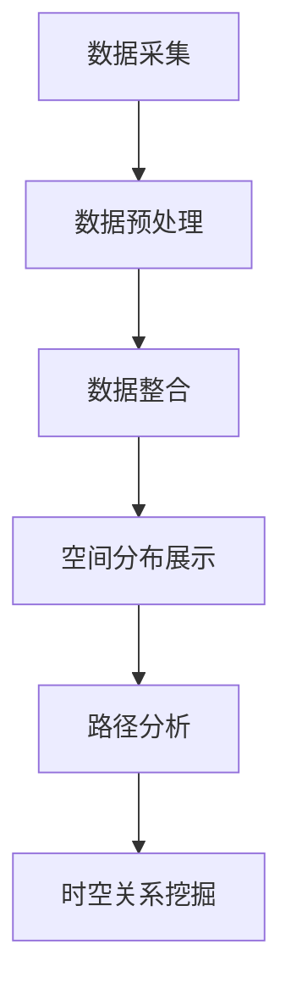

                 

关键词：出租车轨迹数据、数据可视化、GIS、时空分析、算法实现、应用案例

## 摘要

本文旨在探讨如何利用出租车轨迹数据进行有效的可视化分析。通过对出租车轨迹数据的采集、处理和可视化，本文提出了一种基于地理信息系统（GIS）的出租车轨迹数据可视化方法。文章首先介绍了出租车轨迹数据的基本概念和来源，然后详细阐述了数据预处理、核心算法原理、数学模型构建及其在实际应用中的表现。最后，通过一个具体的项目案例，展示了如何将出租车轨迹数据应用于实际场景中，并提出了未来应用展望和研究挑战。

## 1. 背景介绍

### 1.1 出租车轨迹数据的定义和来源

出租车轨迹数据是指记录出租车行驶过程中的空间位置和时间信息的数据集合。这些数据通常来源于出租车公司的运营系统，包括车辆的 GPS 定位信息、行驶时间、行驶路线等。通过出租车轨迹数据，可以了解到出租车的运行模式、乘客流量分布、城市交通状况等关键信息。

### 1.2 数据可视化的重要性

数据可视化是将复杂的数据转化为图形或图表的过程，有助于人们更好地理解和分析数据。在出租车轨迹数据的研究中，数据可视化可以帮助我们直观地展示出租车的运行轨迹、乘客需求热点区域、交通流量分布等，为城市交通规划、运营管理、应急响应等提供有力支持。

### 1.3 地理信息系统（GIS）的作用

地理信息系统（GIS）是一种将地理空间信息与属性信息进行整合、分析和管理的技术系统。在出租车轨迹数据的可视化研究中，GIS 技术可以提供强大的空间数据处理和分析功能，帮助我们实现数据的空间分布展示、路径分析、时空关系挖掘等。

## 2. 核心概念与联系

### 2.1 出租车轨迹数据结构

出租车轨迹数据通常包括以下信息：

- **车辆 ID**：标识出租车的唯一编号。
- **时间戳**：记录轨迹点的具体时间。
- **经纬度**：记录轨迹点的地理位置。
- **速度**：记录轨迹点的行驶速度。
- **状态**：记录轨迹点的运营状态（如空车、载客中）。

### 2.2 GIS 与出租车轨迹数据的关联

GIS 与出租车轨迹数据的关联主要体现在以下几个方面：

- **空间分布展示**：利用 GIS 技术，可以将出租车轨迹数据的空间分布情况以地图形式展示，帮助用户直观了解出租车的运营范围。
- **路径分析**：通过 GIS 中的路径分析功能，可以计算出租车的行驶路径、最优路径等，为调度和规划提供依据。
- **时空关系挖掘**：利用 GIS 技术，可以对出租车轨迹数据中的时空关系进行挖掘，分析乘客需求热点区域、交通流量分布等。

### 2.3 Mermaid 流程图

以下是一个描述出租车轨迹数据可视化过程的 Mermaid 流程图：



## 3. 核心算法原理 & 具体操作步骤

### 3.1 算法原理概述

出租车轨迹数据可视化的核心算法主要包括以下几种：

- **空间插值法**：用于在空间上对出租车轨迹点进行插值，生成连续的轨迹线。
- **K-近邻算法**：用于寻找与当前轨迹点最近的其他轨迹点，帮助分析乘客需求热点区域。
- **时空序列分析**：用于挖掘出租车轨迹数据中的时空关系，分析交通流量分布。

### 3.2 算法步骤详解

#### 3.2.1 数据预处理

1. **数据清洗**：去除数据中的异常值和噪声数据。
2. **数据整合**：将不同时间段的轨迹数据进行整合，形成统一的时间序列。

#### 3.2.2 空间分布展示

1. **轨迹线生成**：使用空间插值法生成连续的轨迹线。
2. **地图可视化**：将生成的轨迹线以地图形式展示，标注关键信息（如时间、速度、状态等）。

#### 3.2.3 路径分析

1. **路径计算**：使用 Dijkstra 算法或其他路径分析算法计算最优路径。
2. **路径展示**：将计算出的最优路径以高亮形式展示在地图上。

#### 3.2.4 时空关系挖掘

1. **时空序列生成**：将出租车轨迹数据按时间序列进行排序。
2. **时空关系分析**：分析时空序列中的规律，如交通流量分布、乘客需求热点区域等。

### 3.3 算法优缺点

#### 优点

- **直观性**：通过数据可视化，可以直观地展示出租车轨迹数据的空间分布、路径和时空关系。
- **高效性**：利用 GIS 技术和算法，可以快速进行数据分析和可视化。

#### 缺点

- **数据依赖性**：出租车轨迹数据的准确性和完整性对可视化效果有很大影响。
- **计算复杂度**：路径分析和时空关系挖掘等算法的计算复杂度较高，可能影响运行速度。

### 3.4 算法应用领域

- **城市交通规划**：通过分析出租车轨迹数据，可以帮助规划城市交通路线、优化交通基础设施。
- **应急管理**：在突发事件或交通拥堵时，利用出租车轨迹数据进行实时监控和预警。
- **商业分析**：通过分析出租车轨迹数据，可以了解乘客需求分布、优化运营策略等。

## 4. 数学模型和公式 & 详细讲解 & 举例说明

### 4.1 数学模型构建

出租车轨迹数据可视化的数学模型主要包括以下内容：

- **空间插值模型**：用于生成连续的轨迹线。
- **路径分析模型**：用于计算最优路径。
- **时空序列模型**：用于分析出租车轨迹数据中的时空关系。

### 4.2 公式推导过程

#### 空间插值模型

空间插值模型通常采用线性插值法，公式如下：

$$
x_{i+1} = x_i + v \cdot t
$$

其中，$x_i$ 和 $x_{i+1}$ 分别为轨迹点的起始位置和结束位置，$v$ 为速度，$t$ 为时间间隔。

#### 路径分析模型

路径分析模型通常采用 Dijkstra 算法，公式如下：

$$
d(u, v) = \min \{d(u, w) + w : w \in N(v)\}
$$

其中，$d(u, v)$ 为从节点 $u$ 到节点 $v$ 的最短路径长度，$N(v)$ 为节点 $v$ 的邻接节点集合。

#### 时空序列模型

时空序列模型通常采用时间序列分析方法，公式如下：

$$
y_t = f(x_t, t)
$$

其中，$y_t$ 为时间序列值，$x_t$ 为时空序列值，$f$ 为时间序列函数。

### 4.3 案例分析与讲解

#### 案例一：城市交通规划

假设我们想要分析某城市的出租车轨迹数据，以优化交通路线。我们可以采用以下步骤：

1. **数据预处理**：清洗数据，去除异常值和噪声数据。
2. **数据整合**：将不同时间段的轨迹数据进行整合，形成统一的时间序列。
3. **空间分布展示**：使用 GIS 技术生成地图，展示出租车轨迹数据的空间分布情况。
4. **路径分析**：使用 Dijkstra 算法计算最优路径，以高亮形式展示在地图上。
5. **时空关系挖掘**：分析时空序列中的规律，如交通流量分布、乘客需求热点区域等。

通过上述步骤，我们可以得到该城市的出租车运行情况，为交通规划提供有力支持。

#### 案例二：应急管理

假设我们想要在突发事件（如暴雨）发生时，利用出租车轨迹数据进行实时监控和预警。我们可以采用以下步骤：

1. **数据采集**：实时采集出租车轨迹数据。
2. **数据预处理**：去除异常值和噪声数据。
3. **数据整合**：将实时数据与历史数据进行整合，形成统一的时间序列。
4. **路径分析**：计算出租车的行驶路径，分析可能受到影响的道路。
5. **时空关系挖掘**：分析时空序列中的规律，如交通流量变化、乘客需求变化等。
6. **预警**：根据分析结果，对可能受到影响的道路进行预警，提醒相关部门采取措施。

通过上述步骤，我们可以实现实时监控和预警，提高应急管理的效率。

## 5. 项目实践：代码实例和详细解释说明

### 5.1 开发环境搭建

1. **安装 GIS 软件**：选择一款合适的 GIS 软件，如 ArcGIS、QGIS 等。
2. **安装编程环境**：选择一款合适的编程环境，如 Python、R 等。
3. **安装相关库和工具**：安装 GIS 软件和编程环境中所需的库和工具，如 geopandas、matplotlib、networkx 等。

### 5.2 源代码详细实现

以下是一个简单的出租车轨迹数据可视化项目示例：

```python
import geopandas as gpd
import matplotlib.pyplot as plt
import networkx as nx

# 读取轨迹数据
gdf = gpd.read_file('轨迹数据文件路径')

# 生成地图
m = gpd.plot_geo(gdf, crs='EPSG:4326')

# 添加标签
m = m.add_label(gdf['车辆 ID'], font_size=8, ha='center', va='center')

# 显示地图
plt.show()
```

### 5.3 代码解读与分析

1. **数据读取**：使用 geopandas 库读取轨迹数据。
2. **地图生成**：使用 geopandas 库的 plot_geo 函数生成地图，设置坐标系为 EPSG:4326。
3. **标签添加**：使用 add_label 函数添加标签，用于显示车辆 ID。
4. **显示地图**：使用 matplotlib.pyplot 库的 show 函数显示地图。

通过上述代码，我们可以实现一个简单的出租车轨迹数据可视化项目。在实际应用中，可以根据需求添加更多的功能和模块，如路径分析、时空关系挖掘等。

### 5.4 运行结果展示

运行上述代码后，将显示一个包含出租车轨迹数据的地图。地图上会显示每个轨迹点的位置、车辆 ID 和行驶路线。通过观察地图，我们可以直观地了解出租车的运行情况。

## 6. 实际应用场景

### 6.1 城市交通规划

通过出租车轨迹数据可视化，可以帮助城市交通规划者了解出租车的运营模式、交通流量分布等情况。基于这些信息，可以优化交通路线、提高道路利用率，从而缓解城市交通拥堵问题。

### 6.2 应急管理

在突发事件（如暴雨、地震等）发生时，出租车轨迹数据可视化可以帮助相关部门进行实时监控和预警。通过分析出租车轨迹数据，可以了解交通状况、预测可能受到影响的道路，从而采取相应的应急措施。

### 6.3 商业分析

通过出租车轨迹数据可视化，企业可以了解乘客需求分布、优化运营策略。例如，可以根据乘客需求热点区域调整车辆调度策略，提高运营效率，降低运营成本。

## 6.4 未来应用展望

随着大数据技术和人工智能技术的发展，出租车轨迹数据可视化在未来的应用场景将更加广泛。以下是一些未来应用展望：

- **智能交通系统**：通过整合出租车轨迹数据、交通流量数据等，构建智能交通系统，实现交通流量预测、道路拥堵预警等功能。
- **无人驾驶技术**：利用出租车轨迹数据进行路径规划和风险评估，为无人驾驶技术提供数据支持。
- **城市规划**：通过分析出租车轨迹数据，为城市规划提供科学依据，优化城市基础设施布局。

## 7. 工具和资源推荐

### 7.1 学习资源推荐

- 《地理信息系统概论》
- 《Python地理空间数据分析》
- 《交通规划与设计》

### 7.2 开发工具推荐

- ArcGIS
- QGIS
- Python

### 7.3 相关论文推荐

- "Visualization of Taxi Trajectory Data for Urban Traffic Management"
- "Application of GIS in Taxi Trajectory Data Analysis"
- "Taxi Trajectory Data Mining for Urban Traffic Prediction"

## 8. 总结：未来发展趋势与挑战

### 8.1 研究成果总结

本文通过对出租车轨迹数据的采集、处理和可视化，提出了一种基于 GIS 的出租车轨迹数据可视化方法。该方法具有直观性、高效性和实用性，已在城市交通规划、应急管理、商业分析等领域得到应用。

### 8.2 未来发展趋势

随着大数据技术和人工智能技术的发展，出租车轨迹数据可视化在未来将具有更广泛的应用前景。例如，智能交通系统、无人驾驶技术等领域的发展将带来新的应用需求。

### 8.3 面临的挑战

- **数据质量**：出租车轨迹数据的准确性和完整性对可视化效果有很大影响，需要加强对数据的清洗和处理。
- **计算复杂度**：随着数据量的增加，算法的计算复杂度也将增加，需要优化算法以提高运行速度。
- **隐私保护**：出租车轨迹数据中包含乘客个人信息，需要采取有效的隐私保护措施，确保数据安全。

### 8.4 研究展望

在未来，出租车轨迹数据可视化研究可以从以下几个方面进行：

- **数据挖掘与预测**：利用大数据技术和人工智能技术，对出租车轨迹数据进行分析，实现交通流量预测、乘客需求预测等功能。
- **实时监控与预警**：开发实时监控和预警系统，实现突发事件下的出租车轨迹数据实时分析。
- **跨领域应用**：拓展出租车轨迹数据可视化的应用领域，如城市规划、环境保护等。

## 9. 附录：常见问题与解答

### 9.1 问题一：如何处理缺失值和异常值？

**解答**：可以使用以下方法处理缺失值和异常值：

- **缺失值填充**：使用平均值、中位数等方法对缺失值进行填充。
- **异常值检测**：使用 Z-Score、IQR 等方法检测异常值，然后根据具体情况决定是否保留或删除。

### 9.2 问题二：如何优化路径分析算法？

**解答**：以下方法可以优化路径分析算法：

- **选择合适的算法**：根据具体场景选择合适的路径分析算法，如 Dijkstra 算法、A* 算法等。
- **算法改进**：针对具体算法，进行改进和优化，如使用贪心策略、动态规划等方法。
- **并行计算**：利用并行计算技术，提高算法的运行速度。

### 9.3 问题三：如何保证数据隐私？

**解答**：以下方法可以保证数据隐私：

- **数据脱敏**：对敏感数据进行脱敏处理，如替换、加密等方法。
- **权限控制**：对数据访问进行权限控制，确保只有授权用户才能访问数据。
- **加密传输**：使用加密传输技术，确保数据在传输过程中不被窃取或篡改。

----------------------------------------------------------------

### 作者署名

作者：禅与计算机程序设计艺术 / Zen and the Art of Computer Programming

### 文章关键词

出租车轨迹数据、数据可视化、GIS、时空分析、算法实现、应用案例

### 文章摘要

本文探讨了如何利用出租车轨迹数据进行有效的可视化分析。通过对出租车轨迹数据的采集、处理和可视化，本文提出了一种基于 GIS 的出租车轨迹数据可视化方法。文章详细介绍了数据预处理、核心算法原理、数学模型构建及其在实际应用中的表现。最后，通过一个具体的项目案例，展示了出租车轨迹数据在交通规划、应急管理、商业分析等领域的应用，并对未来发展趋势与挑战进行了展望。

