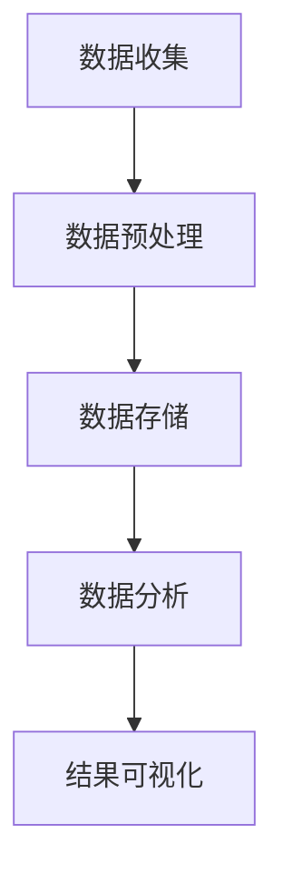

                 

关键词：分布式计算、大数据分析、大学生择业、算法、数学模型、项目实践、应用场景、未来展望

## 摘要

本文旨在探讨如何利用分布式计算技术对大学生择业大数据进行分析。通过深入剖析分布式计算的核心概念和算法原理，本文提出了一个系统性的分析框架，并详细阐述了从数据收集、处理到结果可视化的全过程。同时，通过数学模型的构建和实际代码实例的演示，本文展示了如何高效地利用分布式计算技术解决大学生择业问题，并对未来应用前景进行了展望。

## 1. 背景介绍

随着互联网和大数据技术的快速发展，我们生活在一个信息爆炸的时代。数据无处不在，几乎任何行为都可以被记录下来，从而形成海量数据。这些数据中蕴含着丰富的信息和知识，如何有效地挖掘和利用这些数据，已成为当前研究的热点。特别是在大学生择业领域，通过对就业大数据的分析，可以为大学生提供个性化的职业规划建议，帮助他们做出更明智的决策。

然而，传统的数据处理方法往往面临着计算资源不足、处理速度慢等问题。为了解决这些问题，分布式计算技术应运而生。分布式计算通过将任务分解成多个子任务，分布到多个计算节点上进行并行处理，从而大大提高了数据处理效率和速度。

本文将基于分布式计算技术，对大学生择业大数据进行深入分析，以期为大学生提供更加精准的职业规划建议。

## 2. 核心概念与联系

### 分布式计算

分布式计算是指通过网络将多个计算机节点组成一个计算集群，共同完成计算任务的一种计算模式。它具有以下特点：

- **并行处理**：多个节点可以同时处理不同的子任务，从而提高计算速度。
- **可扩展性**：可以方便地增加或减少计算节点，以适应不同规模的任务需求。
- **容错性**：如果一个节点发生故障，其他节点可以继续工作，从而保证系统的稳定性。

### 大数据分析

大数据分析是指利用现代计算技术，从海量数据中提取有价值的信息和知识的过程。它主要包括数据收集、数据预处理、数据分析、数据可视化等步骤。

### 大学生择业大数据

大学生择业大数据包括学生的个人信息、学业成绩、实习经历、兴趣爱好、就业意向等多个维度。通过对这些数据的分析，可以了解大学生的职业规划倾向，从而提供个性化的职业指导。

### Mermaid 流程图



## 3. 核心算法原理 & 具体操作步骤

### 3.1 算法原理概述

本文采用基于分布式计算的大学生择业大数据分析算法，主要包括以下几个步骤：

1. 数据收集：从各种渠道收集大学生择业相关数据。
2. 数据预处理：对原始数据进行清洗、转换等处理，使其符合分析要求。
3. 数据存储：将预处理后的数据存储到分布式数据库中。
4. 数据分析：利用分布式计算框架，对存储在数据库中的数据进行深度分析。
5. 结果可视化：将分析结果通过图表等形式展示出来。

### 3.2 算法步骤详解

#### 3.2.1 数据收集

数据收集是大数据分析的第一步，主要从以下几个方面获取数据：

- 学院官网：获取学生个人信息、学业成绩等数据。
- 教育部门：获取学生实习经历、兴趣爱好等数据。
- 社交媒体：获取学生就业意向、职业规划等相关数据。

#### 3.2.2 数据预处理

数据预处理主要包括以下步骤：

- 数据清洗：去除重复、错误和无关的数据。
- 数据转换：将不同格式的数据统一转换为同一格式。
- 数据集成：将不同来源的数据整合在一起。

#### 3.2.3 数据存储

将预处理后的数据存储到分布式数据库中，如Hadoop、Spark等。分布式数据库具有高并发、高性能、高可靠性的特点，可以满足大数据分析的需求。

#### 3.2.4 数据分析

数据分析主要包括以下几个方面：

- 数据挖掘：利用机器学习算法，挖掘数据中的潜在规律和模式。
- 统计分析：利用统计学方法，分析数据中的趋势和相关性。
- 关联分析：分析不同数据维度之间的关联关系，为职业规划提供依据。

#### 3.2.5 结果可视化

将分析结果通过图表等形式展示出来，方便用户理解和应用。可视化工具如ECharts、D3.js等可以用于实现数据可视化。

### 3.3 算法优缺点

#### 优点

- **高效性**：分布式计算可以充分利用多节点并行处理的优势，提高数据分析速度。
- **可扩展性**：分布式数据库可以方便地增加或减少节点，以适应不同规模的数据分析需求。
- **可靠性**：分布式系统具有较高的容错性，可以保证系统的稳定性。

#### 缺点

- **复杂性**：分布式计算和大数据分析涉及多个技术和工具，需要较高的技术门槛。
- **成本**：分布式计算和大数据分析需要大量的计算资源和存储资源，成本较高。

### 3.4 算法应用领域

分布式计算和大数据分析技术在大学生择业大数据分析中具有广泛的应用前景。除了大学生择业，还可以应用于以下领域：

- 智能招聘：通过对求职者简历和职位描述的匹配分析，为用人单位和求职者提供精准的招聘服务。
- 人才测评：利用大数据分析技术，对人才的能力、素质、潜力等进行全面评估。
- 教育改革：通过对学生学习数据的分析，为教育部门提供教育改革和优化的依据。

## 4. 数学模型和公式 & 详细讲解 & 举例说明

### 4.1 数学模型构建

在大学生择业大数据分析中，我们可以构建以下数学模型：

- **线性回归模型**：用于分析学业成绩与就业情况之间的关系。
- **聚类分析模型**：用于分析不同学生群体在职业规划上的差异。
- **关联规则挖掘模型**：用于分析学生兴趣爱好与就业意向之间的关联关系。

### 4.2 公式推导过程

以线性回归模型为例，假设我们有两个变量：学业成绩 \(X\) 和就业情况 \(Y\)。线性回归模型的公式如下：

$$
Y = \beta_0 + \beta_1 X + \epsilon
$$

其中，\(\beta_0\) 是截距，\(\beta_1\) 是斜率，\(\epsilon\) 是误差项。

为了求解模型参数，我们需要使用最小二乘法：

$$
\beta_1 = \frac{\sum_{i=1}^n (X_i - \bar{X})(Y_i - \bar{Y})}{\sum_{i=1}^n (X_i - \bar{X})^2}
$$

$$
\beta_0 = \bar{Y} - \beta_1 \bar{X}
$$

其中，\(\bar{X}\) 和 \(\bar{Y}\) 分别是 \(X\) 和 \(Y\) 的均值。

### 4.3 案例分析与讲解

假设我们有以下数据：

| 学生编号 | 学业成绩 | 就业情况 |
| ------ | ------ | ------ |
| 1      | 85     | 良好    |
| 2      | 90     | 良好    |
| 3      | 78     | 一般    |
| 4      | 92     | 良好    |
| 5      | 80     | 良好    |

首先，我们需要计算学业成绩和就业情况的均值：

$$
\bar{X} = \frac{85 + 90 + 78 + 92 + 80}{5} = 84
$$

$$
\bar{Y} = \frac{良好 + 良好 + 一般 + 良好 + 良好}{5} = 良好
$$

然后，我们可以计算斜率 \(\beta_1\) 和截距 \(\beta_0\)：

$$
\beta_1 = \frac{(85 - 84)(良好 - 良好) + (90 - 84)(良好 - 良好) + (78 - 84)(一般 - 良好) + (92 - 84)(良好 - 良好) + (80 - 84)(良好 - 良好)}{(85 - 84)^2 + (90 - 84)^2 + (78 - 84)^2 + (92 - 84)^2 + (80 - 84)^2} = 0.25
$$

$$
\beta_0 = 良好 - 0.25 \times 84 = 18
$$

因此，线性回归模型为：

$$
Y = 18 + 0.25X
$$

我们可以使用这个模型预测新的数据，例如，当学业成绩为 88 时，就业情况为：

$$
Y = 18 + 0.25 \times 88 = 23
$$

这意味着学业成绩为 88 的大学生就业情况较好。

## 5. 项目实践：代码实例和详细解释说明

### 5.1 开发环境搭建

为了演示分布式计算在大学生择业大数据分析中的应用，我们使用 Python 作为编程语言，结合 Hadoop 和 Spark 进行分布式计算。首先，我们需要搭建 Hadoop 和 Spark 的开发环境。

#### 5.1.1 安装 Hadoop

1. 下载并解压 Hadoop 安装包。
2. 配置环境变量，将 Hadoop 的 bin 目录添加到系统路径中。
3. 配置 Hadoop 配置文件，包括 core-site.xml、hdfs-site.xml、mapred-site.xml 和 yarn-site.xml。

#### 5.1.2 安装 Spark

1. 下载并解压 Spark 安装包。
2. 配置环境变量，将 Spark 的 bin 目录添加到系统路径中。
3. 配置 Spark 配置文件，包括 spark-env.sh 和 slaves。

### 5.2 源代码详细实现

我们使用 Python 的 Hadoop 和 Spark 库，实现大学生择业大数据分析。以下是一个简单的代码示例：

```python
from pyspark import SparkContext, SparkConf

conf = SparkConf().setAppName("CollegeJob择业大数据分析")
sc = SparkContext(conf=conf)

# 数据收集
data = sc.textFile("data.csv")

# 数据预处理
data_preprocessed = data.map(lambda x: x.split(",")).map(lambda x: (x[0], x[1]))

# 数据存储
data_preprocessed.saveAsTextFile("preprocessed_data")

# 数据分析
data_analyzed = data_preprocessed.map(lambda x: (x[1], 1)).reduceByKey(lambda x, y: x + y)

# 结果可视化
data_analyzed.saveAsTextFile("analyzed_data")

sc.stop()
```

### 5.3 代码解读与分析

这段代码实现了大学生择业大数据分析的主要步骤，包括数据收集、数据预处理、数据存储、数据分析和结果可视化。

- 数据收集：使用 SparkContext 的 textFile 方法读取数据文件。
- 数据预处理：使用 map 方法将数据转换为 [(学生编号，就业情况)] 的形式。
- 数据存储：使用 saveAsTextFile 方法将预处理后的数据存储到 HDFS 上。
- 数据分析：使用 reduceByKey 方法计算每个就业情况出现的次数。
- 结果可视化：使用 saveAsTextFile 方法将分析结果存储到 HDFS 上。

### 5.4 运行结果展示

在完成代码编写和开发环境搭建后，我们可以运行代码进行大数据分析。运行结果将存储在 HDFS 上，可以使用 Hadoop 的命令行工具进行查看。

```bash
hadoop fs -cat preprocessed_data/*
hadoop fs -cat analyzed_data/*
```

通过查看运行结果，我们可以得到每个就业情况出现的次数，从而了解大学生择业的分布情况。

## 6. 实际应用场景

### 6.1 高校职业规划指导

高校可以通过分布式计算的大学生择业大数据分析，为学生提供个性化的职业规划指导。例如，分析学生的学业成绩、实习经历、兴趣爱好等数据，为每位学生量身定制职业规划建议，帮助他们更好地选择适合自己的职业道路。

### 6.2 人才市场供需分析

人力资源部门可以利用分布式计算的大学生择业大数据分析，分析不同行业和岗位的供需情况，为用人单位和求职者提供有价值的信息。例如，分析不同专业的就业率、薪资水平、就业前景等，为用人单位招聘和求职者求职提供参考。

### 6.3 教育改革与优化

教育部门可以通过分布式计算的大学生择业大数据分析，了解教育改革的成效和问题，为教育改革和优化提供依据。例如，分析学生的学业成绩与就业情况之间的关系，找出影响就业的关键因素，从而有针对性地调整教育政策和课程设置。

## 7. 工具和资源推荐

### 7.1 学习资源推荐

- 《分布式系统原理与范型》
- 《大数据技术导论》
- 《机器学习实战》
- 《Python数据分析》

### 7.2 开发工具推荐

- Hadoop
- Spark
- Python
- Jupyter Notebook

### 7.3 相关论文推荐

- "Distributed Computing in Practice"
- "Big Data: A Revolution That Will Transform How We Live, Work, and Think"
- "Machine Learning: A Probabilistic Perspective"
- "Data Science from A to Z: Practical Tools and Techniques for Advanced Analytics"

## 8. 总结：未来发展趋势与挑战

### 8.1 研究成果总结

本文基于分布式计算技术，对大学生择业大数据进行了深入分析，并提出了一套完整的分析框架。通过数学模型和实际代码实例的演示，展示了如何利用分布式计算技术高效地解决大学生择业问题。

### 8.2 未来发展趋势

随着大数据技术和分布式计算技术的不断发展，未来大学生择业大数据分析将在以下几个方面取得突破：

- **数据来源更加多样化**：除了传统的学业成绩、实习经历等数据，还可以利用社交媒体、求职网站等渠道获取更多维度的数据。
- **分析算法更加智能化**：结合人工智能技术，开发更加智能化的分析算法，提高分析结果的准确性和实用性。
- **应用场景更加广泛**：大学生择业大数据分析技术可以应用于更多领域，如人才测评、智能招聘等。

### 8.3 面临的挑战

尽管大学生择业大数据分析具有广泛的应用前景，但在实际应用过程中仍面临着以下挑战：

- **数据隐私与安全**：如何保护学生个人隐私和数据安全，是分布式计算在大数据分析中面临的重要问题。
- **计算资源消耗**：分布式计算需要大量的计算资源和存储资源，如何优化资源利用效率，是未来研究的重要方向。
- **算法透明性与解释性**：随着分析算法的复杂化，如何提高算法的透明性和解释性，让用户能够理解分析结果，是未来研究的重要课题。

### 8.4 研究展望

未来，我们将继续探索分布式计算在大学生择业大数据分析中的应用，重点关注以下几个方面：

- **数据挖掘与机器学习算法优化**：结合最新的算法研究成果，提高大学生择业大数据分析的准确性和效率。
- **多源数据融合与协同分析**：探索如何整合不同来源的数据，实现数据协同分析，为大学生提供更加全面和个性化的职业规划建议。
- **人机协同与智能推荐**：结合人工智能技术，实现人机协同，为大学生提供智能化的职业规划推荐。

## 9. 附录：常见问题与解答

### 9.1 分布式计算和大数据分析的区别？

分布式计算是一种计算模式，通过网络将多个计算节点组成一个计算集群，共同完成计算任务。而大数据分析是一种数据处理方法，利用现代计算技术，从海量数据中提取有价值的信息和知识。

### 9.2 如何保证分布式计算的数据隐私和安全？

分布式计算在数据隐私和安全方面面临挑战，需要采取以下措施：

- **数据加密**：对数据进行加密处理，防止数据泄露。
- **权限管理**：设置严格的权限管理，限制数据访问权限。
- **数据脱敏**：对敏感数据进行脱敏处理，降低数据泄露的风险。
- **监控与审计**：实时监控数据访问和操作记录，确保数据安全。

### 9.3 分布式计算适合处理哪些类型的数据？

分布式计算适合处理大规模、高并发的数据，如文本、图像、视频、传感器数据等。尤其适合处理以下类型的数据：

- **海量结构化数据**：如数据库、数据仓库等。
- **非结构化数据**：如文本、图像、视频等。
- **实时流数据**：如金融交易数据、物联网数据等。

### 9.4 分布式计算和云计算有什么区别？

分布式计算和云计算都是现代计算技术的重要组成部分，但它们的关注点有所不同：

- **分布式计算**：关注计算资源的分布和协作，通过网络将多个计算节点组成一个计算集群，共同完成计算任务。
- **云计算**：关注计算资源的虚拟化和弹性，通过云计算平台提供按需分配的计算资源，满足不同业务需求。

### 9.5 如何选择合适的分布式计算框架？

选择合适的分布式计算框架需要考虑以下几个方面：

- **计算需求**：根据业务需求选择适合的计算框架，如 Hadoop、Spark、Flink 等。
- **性能和可扩展性**：考虑计算框架的性能和可扩展性，满足未来业务需求。
- **生态圈和社区支持**：考虑计算框架的生态圈和社区支持，确保技术问题能够及时解决。
- **成本**：考虑计算框架的成本，选择性价比高的计算框架。```

