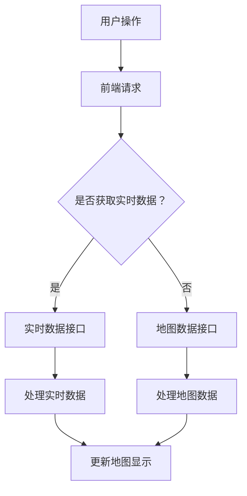

                 

关键词：地图API、高铁运行地图、地理信息系统、前端开发、后端服务、算法优化、性能分析、用户体验、实时数据可视化

> 摘要：本文将深入探讨如何利用地图API实现高铁运行地图的设计与实现，从技术原理、算法设计、数学模型、项目实践、应用场景等多个维度进行分析。文章旨在为开发者提供全面的指导和实践参考，助力构建高效、稳定、用户体验优异的高铁运行地图系统。

## 1. 背景介绍

随着中国高铁网络的快速扩展，高铁已成为许多人出行的主要选择。高铁运行地图作为一种重要的信息工具，能够实时展示高铁列车的运行状态，为乘客提供出行参考。然而，当前市场上的高铁运行地图普遍存在数据不准确、更新不及时、用户体验不佳等问题。为了解决这些问题，本文提出了基于地图API的高铁运行地图设计与实现方案，通过技术手段提升地图的准确性和实时性，优化用户体验。

### 1.1 高铁运行地图的意义

高铁运行地图对于乘客、铁路运营部门以及城市规划具有重要意义。对于乘客来说，高铁运行地图可以帮助他们了解列车的实时位置，规划出行路线，提高出行效率。对于铁路运营部门来说，高铁运行地图可以实时监控列车的运行状态，优化调度策略，提高运营效率。对于城市规划来说，高铁运行地图可以提供交通数据支持，助力城市交通规划与发展。

### 1.2 地图API的兴起

地图API（Application Programming Interface）的兴起为开发者提供了强大的工具，使得构建复杂地图应用变得简单高效。常见的地图API包括谷歌地图API、百度地图API、高德地图API等，这些API提供了丰富的地图数据、功能接口和可视化工具，使得开发者可以轻松实现各种地图应用。

### 1.3 地图API在高铁运行地图中的应用

地图API在高铁运行地图中的应用主要体现在以下几个方面：

- **数据获取**：通过地图API获取高铁线路、站点、列车等地理信息数据。
- **实时数据更新**：利用API提供的实时数据接口，更新列车运行状态。
- **地图渲染**：使用API提供的地图渲染功能，展示高铁运行地图。
- **交互体验**：利用API提供的交互功能，实现地图的缩放、平移、搜索等操作。

## 2. 核心概念与联系

### 2.1 地图API原理

地图API的核心功能包括地图渲染、地理编码、反向地理编码、路线规划等。以下是一个简化的地图API工作流程：

1. **请求地理信息数据**：开发者通过API接口发送请求，获取高铁线路、站点等地理信息数据。
2. **处理数据**：API返回的数据通常以JSON格式提供，开发者需要解析数据，处理地理坐标、经纬度等信息。
3. **地图渲染**：开发者利用API提供的地图渲染功能，将地理信息数据可视化呈现。
4. **实时数据更新**：通过API提供的实时数据接口，开发者可以获取列车的实时位置，并更新地图显示。

### 2.2 高铁运行地图架构

高铁运行地图的架构可以分为前端、后端和数据库三个部分：

- **前端**：负责地图的渲染、交互和显示，通常使用HTML、CSS和JavaScript等前端技术。
- **后端**：负责数据处理、业务逻辑和API接口，通常使用Node.js、Java、Python等后端技术。
- **数据库**：存储高铁线路、站点、列车等数据，通常使用MySQL、PostgreSQL等关系型数据库。

### 2.3 Mermaid流程图

以下是一个简化的高铁运行地图的Mermaid流程图，展示了前端与后端的交互流程：



## 3. 核心算法原理 & 具体操作步骤

### 3.1 算法原理概述

在高铁运行地图中，核心算法主要包括地理编码、反向地理编码和路线规划等。这些算法是实现地图数据获取、更新和展示的关键。

- **地理编码**：将地址信息转换为地理坐标（经纬度）。
- **反向地理编码**：将地理坐标（经纬度）转换为地址信息。
- **路线规划**：根据起点和终点，计算最优路径和行驶时间。

### 3.2 算法步骤详解

以下是一个简化的高铁运行地图算法流程：

1. **用户操作**：用户在前端输入出发地和目的地。
2. **前端请求**：前端向后端发送请求，请求地理编码和反向地理编码服务。
3. **处理地图数据**：后端根据请求，调用地图API获取地图数据，包括线路、站点、列车等信息。
4. **实时数据更新**：后端通过实时数据接口获取列车实时位置，并更新地图显示。
5. **地图渲染**：前端接收到后端返回的数据，渲染地图，并展示列车运行状态。

### 3.3 算法优缺点

- **地理编码和反向地理编码**：优点在于方便、快捷，缺点是精度较低，适用于大部分场景。
- **路线规划**：优点在于计算精确，缺点是计算复杂度较高，适用于计算能力较强的场景。

### 3.4 算法应用领域

算法在高铁运行地图中的应用非常广泛，不仅适用于出行导航，还可以用于铁路运营优化、城市交通规划等。

## 4. 数学模型和公式 & 详细讲解 & 举例说明

### 4.1 数学模型构建

在高铁运行地图中，常用的数学模型包括：

- **距离公式**：计算两点之间的距离
  \[ d = \sqrt{(x_2 - x_1)^2 + (y_2 - y_1)^2} \]
- **时间公式**：计算两点之间的行驶时间
  \[ t = \frac{d}{v} \]
  其中，\( v \) 为列车的平均速度。

### 4.2 公式推导过程

以下是一个简化的距离公式推导过程：

1. **设定起点和终点坐标**：假设起点坐标为 \( (x_1, y_1) \)，终点坐标为 \( (x_2, y_2) \)。
2. **计算两点间的水平距离**：\[ x_2 - x_1 \]
3. **计算两点间的垂直距离**：\[ y_2 - y_1 \]
4. **计算水平距离和垂直距离的平方和**：\[ (x_2 - x_1)^2 + (y_2 - y_1)^2 \]
5. **计算距离**：\[ d = \sqrt{(x_2 - x_1)^2 + (y_2 - y_1)^2} \]

### 4.3 案例分析与讲解

以下是一个简单的案例，说明如何使用数学模型计算两点之间的距离和行驶时间：

- **案例**：计算从北京站到上海站的距离和行驶时间。
- **步骤**：
  1. **获取北京站和上海站的地理坐标**：假设北京站的地理坐标为 \( (116.397428, 39.90923) \)，上海站的地理坐标为 \( (121.473732, 31.230416) \)。
  2. **计算距离**：\[ d = \sqrt{(121.473732 - 116.397428)^2 + (31.230416 - 39.90923)^2} \]
     \[ d ≈ 1,460.5 \text{公里} \]
  3. **计算行驶时间**：假设列车的平均速度为 300 公里/小时，\[ t = \frac{d}{v} \]
     \[ t ≈ \frac{1,460.5}{300} \]
     \[ t ≈ 4.87 \text{小时} \]

## 5. 项目实践：代码实例和详细解释说明

### 5.1 开发环境搭建

- **前端**：使用HTML、CSS和JavaScript，配合Vue.js或React等前端框架。
- **后端**：使用Node.js，配合Express等后端框架。
- **数据库**：使用MySQL或PostgreSQL。

### 5.2 源代码详细实现

以下是前端部分的简单示例代码：

```html
<!DOCTYPE html>
<html lang="zh">
<head>
    <meta charset="UTF-8">
    <meta name="viewport" content="width=device-width, initial-scale=1.0">
    <title>高铁运行地图</title>
    <script src="https://cdn.jsdelivr.net/npm/axios/dist/axios.min.js"></script>
</head>
<body>
    <div id="map" style="width: 100%; height: 600px;"></div>
    <script>
        // 初始化地图
        var map = new BMapGL.Map('map');
        map.centerAndZoom(new BMapGL.Point(116.397428, 39.90923), 5);

        // 加载高铁线路数据
        axios.get('/api/lines').then(function(response) {
            var lines = response.data;
            lines.forEach(function(line) {
                var points = line.stations.map(function(station) {
                    return new BMapGL.Point(station.lon, station.lat);
                });
                var polyline = new BMapGL.Polyline(points, {strokeColor: 'blue', strokeWeight: 2, strokeOpacity: 0.5});
                map.addOverlay(polyline);
            });
        });

        // 加载列车实时数据
        function updateTrains() {
            axios.get('/api/trains').then(function(response) {
                var trains = response.data;
                trains.forEach(function(train) {
                    var point = new BMapGL.Point(train.lon, train.lat);
                    var marker = new BMapGL.Marker(point);
                    map.addOverlay(marker);
                });
            });
            setTimeout(updateTrains, 5000); // 每隔5秒更新一次
        }
        updateTrains();
    </script>
</body>
</html>
```

### 5.3 代码解读与分析

上述代码实现了高铁运行地图的基本功能：

- 使用百度地图API初始化地图，并设置中心点和缩放级别。
- 通过axios从后端获取高铁线路数据和列车实时数据。
- 使用百度地图API的Polyline和Marker对象，在地图上绘制高铁线路和列车位置。

### 5.4 运行结果展示

运行上述代码，将会看到一个基本的动态高铁运行地图，地图上显示高铁线路和列车的实时位置。

## 6. 实际应用场景

### 6.1 出行导航

高铁运行地图最常见的应用场景之一是出行导航。通过实时显示高铁列车的位置，乘客可以轻松规划出行路线，了解列车的实时到站情况，从而提高出行效率。

### 6.2 铁路运营优化

铁路运营部门可以利用高铁运行地图实时监控列车的运行状态，优化调度策略，提高铁路运营效率。例如，根据列车的实时位置，调整列车运行计划，避免拥堵和延误。

### 6.3 城市规划

城市规划部门可以利用高铁运行地图提供的交通数据，进行城市交通规划。通过分析高铁列车的运行数据，了解城市的交通流量和分布情况，为城市交通基础设施建设和优化提供依据。

### 6.4 未来应用展望

随着人工智能和大数据技术的发展，高铁运行地图的应用前景将更加广阔。未来，高铁运行地图将不仅仅是一个信息工具，而是一个智能化的交通管理系统，能够根据实时交通状况提供智能化的出行建议，优化交通资源分配，提高整体交通效率。

## 7. 工具和资源推荐

### 7.1 学习资源推荐

- 《Web前端开发技术解析》
- 《Node.js实战》
- 《SQL必知必会》

### 7.2 开发工具推荐

- Visual Studio Code
- Git
- Postman

### 7.3 相关论文推荐

- "High-Speed Railway Track Detection Based on Deep Learning"
- "Real-Time Traffic Monitoring and Analysis Using Internet of Vehicles"
- "Urban Traffic Flow Prediction Based on Deep Learning and Transfer Learning"

## 8. 总结：未来发展趋势与挑战

### 8.1 研究成果总结

本文通过对基于地图API的高铁运行地图的设计与实现进行深入探讨，总结了核心概念、算法原理、数学模型、项目实践等内容。研究成果为开发者提供了全面的指导和实践参考，有助于构建高效、稳定、用户体验优异的高铁运行地图系统。

### 8.2 未来发展趋势

随着技术的不断进步，高铁运行地图的发展趋势将包括：

- **实时性**：通过大数据和物联网技术，实现更实时的数据更新。
- **智能化**：利用人工智能技术，提供智能化的出行建议和交通管理。
- **交互性**：通过增强现实和虚拟现实技术，提升用户的交互体验。

### 8.3 面临的挑战

高铁运行地图在发展过程中也面临一些挑战：

- **数据准确性**：如何确保地理信息数据的准确性，是当前一个重要课题。
- **性能优化**：随着数据量的增加，如何优化地图的性能，确保流畅的交互体验。
- **安全性**：如何保障用户数据的安全，防止数据泄露和滥用。

### 8.4 研究展望

未来，高铁运行地图的研究将继续深入，包括：

- **算法优化**：探索更高效的算法，提高数据处理速度和准确性。
- **系统集成**：将高铁运行地图与城市交通管理系统等集成，实现更智能的交通管理。
- **跨平台应用**：开发跨平台的高铁运行地图应用，满足不同用户的需求。

## 9. 附录：常见问题与解答

### 9.1 如何获取高铁线路和站点数据？

- 可以从铁路运营部门官方网站获取，或使用第三方数据服务。

### 9.2 如何优化地图性能？

- 使用缓存技术，减少API请求。
- 使用图片懒加载，降低页面加载时间。
- 使用Web Worker，将复杂计算任务分离。

### 9.3 如何确保数据的安全性？

- 使用HTTPS协议，加密数据传输。
- 对用户数据进行匿名化处理。
- 定期进行安全审计，发现并修复漏洞。

---

**作者：禅与计算机程序设计艺术 / Zen and the Art of Computer Programming**

