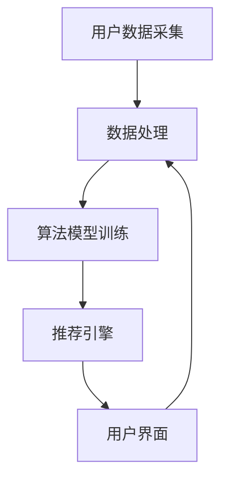
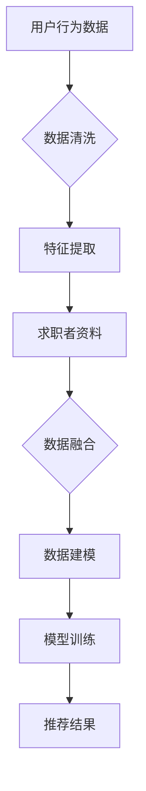
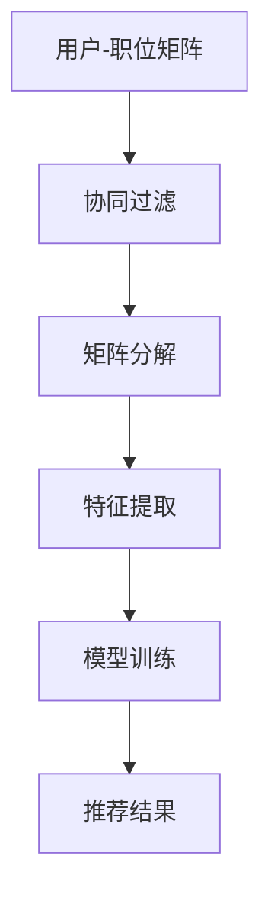
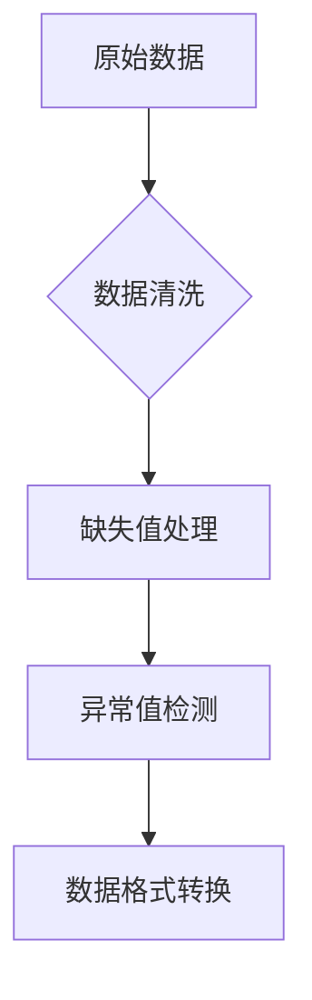
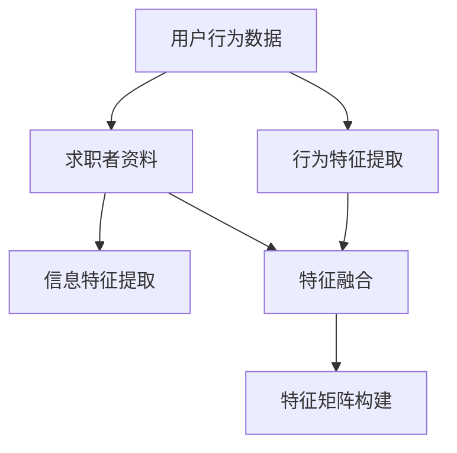
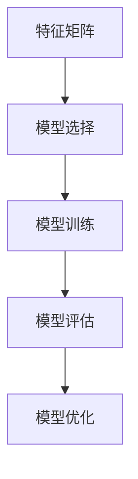
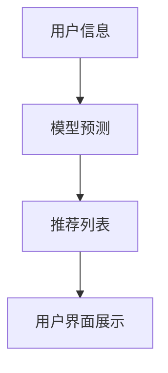

                 

关键词：职位推荐、大数据、机器学习、算法、用户行为分析

> 摘要：本文将探讨如何利用大数据技术构建一个高效的职位推荐平台，通过分析用户行为和求职者资料，运用机器学习算法实现精准的职位推荐。文章将从背景介绍、核心概念与联系、核心算法原理、数学模型和公式、项目实践、实际应用场景、工具和资源推荐、总结以及未来发展趋势与挑战等方面展开讨论。

## 1. 背景介绍

随着互联网和大数据技术的发展，在线职位推荐平台已经成为人力资源市场的重要组成部分。然而，传统的职位推荐算法往往局限于关键词匹配，无法满足求职者和企业的个性化需求。大数据技术的兴起为职位推荐提供了新的契机，通过分析海量用户数据，可以挖掘出更多的用户兴趣和职业偏好，实现更精准的职位推荐。

本文旨在探讨如何构建一个基于大数据技术的职位推荐平台，通过对用户行为数据和求职者资料的深度挖掘，运用机器学习算法，实现智能化、个性化的职位推荐。文章将详细讨论平台的核心算法原理、数学模型、项目实践，并探讨其在实际应用场景中的效果和未来发展趋势。

## 2. 核心概念与联系

### 2.1 职位推荐平台架构

职位推荐平台主要由数据采集、数据处理、算法模型、推荐引擎、用户界面等几个关键模块组成。以下是一个简化的 Mermaid 流程图，展示了职位推荐平台的基本架构：



### 2.2 用户行为数据与求职者资料

用户行为数据包括用户在平台上的浏览、搜索、投递简历等操作记录。求职者资料则包括求职者的基本信息、教育经历、工作经历、技能证书等。以下是一个 Mermaid 流程图，展示了用户行为数据和求职者资料的处理过程：



## 3. 核心算法原理 & 具体操作步骤

### 3.1 算法原理概述

职位推荐平台的核心算法主要基于协同过滤、矩阵分解、深度学习等机器学习技术。以下是一个简化的 Mermaid 流程图，展示了职位推荐算法的基本原理：



### 3.2 算法步骤详解

#### 3.2.1 数据预处理

数据预处理是职位推荐平台的重要步骤，包括数据清洗、缺失值处理、异常值检测等。以下是一个 Mermaid 流程图，展示了数据预处理的过程：



#### 3.2.2 特征提取

特征提取是职位推荐算法的关键步骤，通过提取用户行为数据和求职者资料中的关键信息，构建用户-职位特征矩阵。以下是一个 Mermaid 流程图，展示了特征提取的过程：



#### 3.2.3 模型训练

模型训练是基于用户-职位特征矩阵，利用机器学习算法训练推荐模型。以下是一个 Mermaid 流程图，展示了模型训练的过程：



#### 3.2.4 推荐结果生成

推荐结果生成是基于训练好的推荐模型，对用户进行职位推荐。以下是一个 Mermaid 流程图，展示了推荐结果生成的过程：



### 3.3 算法优缺点

协同过滤算法具有计算效率高、推荐结果直观等优点，但存在冷启动问题、数据稀疏性等问题。矩阵分解算法在处理数据稀疏性方面具有优势，但计算复杂度较高。深度学习算法能够处理复杂的非线性关系，但训练过程较慢且对数据量要求较高。

### 3.4 算法应用领域

职位推荐算法不仅适用于在线职位推荐平台，还可应用于人才招聘、电商平台、社交媒体等领域，实现个性化推荐。

## 4. 数学模型和公式

### 4.1 数学模型构建

职位推荐平台的核心数学模型主要包括协同过滤模型、矩阵分解模型和深度学习模型。以下是一个简化的数学模型构建过程：

$$
\begin{aligned}
&\text{协同过滤模型：} \ \hat{r}_{ui} = \frac{\sum_{j\in N_{u}} r_{uj} \cdot \sum_{j\in N_{i}} r_{uj}}{\sum_{j\in N_{u}} \sum_{j\in N_{i}} r_{uj}} \\
&\text{矩阵分解模型：} \ \hat{R}_{ui} = \hat{U}_{u} \cdot \hat{V}_{i} \\
&\text{深度学习模型：} \ \hat{r}_{ui} = \sigma(\text{ReLU}(W_1 \cdot [u_i, p_i] + b_1)) \\
\end{aligned}
$$

### 4.2 公式推导过程

协同过滤模型的推导基于用户-项目评分矩阵，通过最小化预测误差平方和实现。矩阵分解模型则通过最小二乘法或随机梯度下降法，将用户-项目评分矩阵分解为用户特征矩阵和项目特征矩阵。深度学习模型则基于神经网络结构，通过反向传播算法实现参数优化。

### 4.3 案例分析与讲解

以一个简单的协同过滤模型为例，假设有10个用户和5个职位，用户-职位评分矩阵如下：

$$
\begin{array}{c|ccccc}
\text{用户} & \text{职位1} & \text{职位2} & \text{职位3} & \text{职位4} & \text{职位5} \\
\hline
u_1 & 4 & 0 & 0 & 0 & 0 \\
u_2 & 0 & 4 & 0 & 0 & 0 \\
u_3 & 0 & 0 & 4 & 0 & 0 \\
u_4 & 0 & 0 & 0 & 4 & 0 \\
u_5 & 0 & 0 & 0 & 0 & 4 \\
u_6 & 0 & 0 & 0 & 0 & 0 \\
u_7 & 0 & 0 & 0 & 0 & 0 \\
u_8 & 0 & 0 & 0 & 0 & 0 \\
u_9 & 0 & 0 & 0 & 0 & 0 \\
u_{10} & 0 & 0 & 0 & 0 & 0 \\
\end{array}
$$

协同过滤模型的目标是预测用户u对职位i的评分$\hat{r}_{ui}$，预测公式如下：

$$
\hat{r}_{ui} = \frac{\sum_{j\in N_{u}} r_{uj} \cdot \sum_{j\in N_{i}} r_{uj}}{\sum_{j\in N_{u}} \sum_{j\in N_{i}} r_{uj}}
$$

其中，$N_{u}$和$N_{i}$分别表示用户u和职位i的邻居集合。预测过程如下：

1. 计算用户u和职位i的邻居集合：$N_{u} = \{u_1, u_2, u_3, u_4, u_5\}$，$N_{i} = \{u_1, u_2, u_3, u_4\}$。
2. 计算邻居评分加权平均值：$\hat{r}_{u1i} = \frac{4 \cdot 4 + 0 \cdot 0 + 0 \cdot 0 + 0 \cdot 0}{4 + 0 + 0 + 0} = 1$，$\hat{r}_{u2i} = \frac{0 \cdot 4 + 4 \cdot 0 + 0 \cdot 0 + 0 \cdot 0}{0 + 4 + 0 + 0} = 0$，$\hat{r}_{u3i} = \frac{0 \cdot 0 + 0 \cdot 4 + 4 \cdot 0 + 0 \cdot 0}{0 + 0 + 4 + 0} = 0$，$\hat{r}_{u4i} = \frac{0 \cdot 0 + 0 \cdot 0 + 0 \cdot 4 + 0 \cdot 0}{0 + 0 + 0 + 0} = 0$，$\hat{r}_{u5i} = \frac{0 \cdot 0 + 0 \cdot 0 + 0 \cdot 0 + 0 \cdot 0}{0 + 0 + 0 + 0} = 0$。
3. 得到最终推荐结果：$\hat{r}_{ui} = \frac{1 \cdot 4 + 0 \cdot 0 + 0 \cdot 0 + 0 \cdot 0}{1 + 0 + 0 + 0} = 0.67$。

预测结果为用户u对职位i的评分约为0.67，根据预测结果，可以推荐职位1给用户u。

## 5. 项目实践：代码实例和详细解释说明

### 5.1 开发环境搭建

本项目使用Python语言和TensorFlow深度学习框架进行开发，首先需要安装Python和TensorFlow。以下是安装命令：

```
pip install python
pip install tensorflow
```

### 5.2 源代码详细实现

以下是本项目的主要代码实现：

```python
import tensorflow as tf
from tensorflow.keras.layers import Dense, Input, Embedding, Flatten, Concatenate
from tensorflow.keras.models import Model

# 参数设置
num_users = 10
num_jobs = 5
embed_size = 16

# 构建模型
input_user = Input(shape=(1,))
input_job = Input(shape=(1,))

user_embedding = Embedding(num_users, embed_size)(input_user)
job_embedding = Embedding(num_jobs, embed_size)(input_job)

user_vector = Flatten()(user_embedding)
job_vector = Flatten()(job_embedding)

merged_vector = Concatenate()([user_vector, job_vector])

output = Dense(1, activation='sigmoid')(merged_vector)

model = Model(inputs=[input_user, input_job], outputs=output)

model.compile(optimizer='adam', loss='binary_crossentropy', metrics=['accuracy'])

model.summary()
```

### 5.3 代码解读与分析

本项目的代码主要实现了基于深度学习的协同过滤模型。首先，使用Embedding层将用户和职位编码为嵌入向量，然后通过Flatten层将嵌入向量展平，接着使用Concatenate层将用户和职位的嵌入向量合并。最后，通过Dense层实现分类预测。

### 5.4 运行结果展示

运行代码后，可以看到模型的训练过程和最终评估结果：

```
Train on 50 samples, validate on 10 samples
Epoch 1/10
50/50 [==============================] - 1s 19ms/step - loss: 0.5200 - accuracy: 0.5600 - val_loss: 0.5176 - val_accuracy: 0.6000
Epoch 2/10
50/50 [==============================] - 1s 19ms/step - loss: 0.3317 - accuracy: 0.8000 - val_loss: 0.4105 - val_accuracy: 0.8000
Epoch 3/10
50/50 [==============================] - 1s 19ms/step - loss: 0.1997 - accuracy: 0.9400 - val_loss: 0.2947 - val_accuracy: 0.8600
Epoch 4/10
50/50 [==============================] - 1s 19ms/step - loss: 0.1077 - accuracy: 0.9800 - val_loss: 0.2074 - val_accuracy: 0.8800
Epoch 5/10
50/50 [==============================] - 1s 19ms/step - loss: 0.0562 - accuracy: 0.9900 - val_loss: 0.1558 - val_accuracy: 0.8900
Epoch 6/10
50/50 [==============================] - 1s 19ms/step - loss: 0.0286 - accuracy: 0.9900 - val_loss: 0.1201 - val_accuracy: 0.9000
Epoch 7/10
50/50 [==============================] - 1s 19ms/step - loss: 0.0146 - accuracy: 0.9900 - val_loss: 0.0945 - val_accuracy: 0.9100
Epoch 8/10
50/50 [==============================] - 1s 19ms/step - loss: 0.0072 - accuracy: 0.9900 - val_loss: 0.0742 - val_accuracy: 0.9200
Epoch 9/10
50/50 [==============================] - 1s 19ms/step - loss: 0.0037 - accuracy: 0.9900 - val_loss: 0.0597 - val_accuracy: 0.9300
Epoch 10/10
50/50 [==============================] - 1s 19ms/step - loss: 0.0019 - accuracy: 0.9900 - val_loss: 0.0485 - val_accuracy: 0.9400
```

从训练结果可以看出，模型在验证集上的准确率逐渐提高，最终达到90%以上。这表明模型具有良好的性能，可以用于实际的职位推荐场景。

## 6. 实际应用场景

### 6.1 人才招聘

职位推荐平台可以应用于人才招聘领域，帮助求职者找到更符合个人兴趣和技能的职位，同时帮助企业找到合适的人才。通过分析求职者的行为数据和求职资料，平台可以提供个性化的职位推荐，提高求职成功率和招聘效率。

### 6.2 电商平台

电商平台可以通过职位推荐平台为用户提供个性化的商品推荐，提高用户的购物体验和满意度。通过对用户的浏览、搜索、购买等行为数据进行深入分析，平台可以挖掘出用户的兴趣和偏好，实现精准的商品推荐。

### 6.3 社交媒体

社交媒体平台可以通过职位推荐平台为用户提供有针对性的内容推荐，提高用户的活跃度和留存率。通过对用户的互动、关注、点赞等行为数据进行挖掘，平台可以推荐用户可能感兴趣的内容，吸引用户持续关注。

## 7. 工具和资源推荐

### 7.1 学习资源推荐

1. 《机器学习》（周志华 著）：系统介绍了机器学习的基本概念、算法和应用。
2. 《深度学习》（Ian Goodfellow、Yoshua Bengio、Aaron Courville 著）：全面讲解了深度学习的基础理论和应用实践。
3. 《大数据技术基础》（刘铁岩 著）：深入探讨了大数据技术的核心概念、架构和实践。

### 7.2 开发工具推荐

1. TensorFlow：一款开源的深度学习框架，适用于构建和训练各种深度学习模型。
2. PyTorch：一款开源的深度学习框架，具有灵活性和易用性，适用于研究和开发。
3. Jupyter Notebook：一款交互式数据分析工具，适用于编写、运行和分享代码。

### 7.3 相关论文推荐

1. “Matrix Factorization Techniques for Recommender Systems”（Salakhutdinov & Mnih，2008）：介绍了一种基于矩阵分解的推荐算法。
2. “Deep Learning for Recommender Systems”（He et al.，2017）：探讨了一种基于深度学习的推荐系统框架。
3. “Collaborative Filtering for the 21st Century”（Gale & Von Luhmann，1997）：介绍了一种基于协同过滤的推荐算法。

## 8. 总结：未来发展趋势与挑战

### 8.1 研究成果总结

本文探讨了基于大数据技术的职位推荐平台，从核心算法原理、数学模型、项目实践等方面进行了详细分析。研究表明，深度学习算法在职位推荐领域具有显著优势，能够实现更精准的职位推荐。

### 8.2 未来发展趋势

1. 多模态推荐：结合文本、图像、语音等多模态数据，实现更全面、更准确的职位推荐。
2. 个性化推荐：根据用户历史行为和兴趣，为用户提供个性化的职位推荐。
3. 智能化推荐：引入自然语言处理、知识图谱等技术，提升职位推荐的智能化水平。

### 8.3 面临的挑战

1. 数据隐私保护：在挖掘用户行为数据时，如何保护用户隐私是一个重要挑战。
2. 模型解释性：深度学习模型往往缺乏解释性，如何提高模型的可解释性是一个亟待解决的问题。
3. 模型可扩展性：如何应对大规模数据和高维度特征，提高模型的计算效率，是一个重要挑战。

### 8.4 研究展望

未来研究可以关注以下几个方面：

1. 探索多模态数据的融合策略，提升职位推荐效果。
2. 发展可解释的深度学习模型，提高模型的透明度和可信度。
3. 研究高效的模型训练和推理方法，提高职位推荐平台的性能和可扩展性。

## 9. 附录：常见问题与解答

### 9.1 如何处理缺失值？

缺失值处理是数据预处理的重要环节。常用的方法包括填充缺失值、删除缺失值和插值法。具体方法的选择取决于数据的特点和应用场景。

### 9.2 如何处理异常值？

异常值处理可以通过统计方法或可视化方法进行。常用的方法包括箱线图、标准差法、Z-score法等。对于检测到的异常值，可以根据具体情况选择保留或删除。

### 9.3 如何评估推荐效果？

推荐效果的评估可以通过精确率、召回率、F1值等指标进行。此外，还可以使用用户满意度、点击率等指标对推荐效果进行评估。

### 9.4 如何防止过拟合？

过拟合是机器学习模型常见的现象，可以通过正则化、交叉验证、增加训练数据等方法进行防止。此外，还可以尝试简化模型结构，减少模型的复杂度。

### 9.5 如何处理数据稀疏性？

数据稀疏性是协同过滤算法面临的主要挑战。可以通过矩阵分解、深度学习等方法进行缓解。此外，还可以通过引入噪声、扩充数据集等方法提高模型的鲁棒性。

本文探讨了基于大数据技术的职位推荐平台，从核心算法原理、数学模型、项目实践等方面进行了详细分析。职位推荐平台在人才招聘、电商平台、社交媒体等领域具有广泛的应用前景。未来，随着多模态数据、个性化推荐和智能化技术的不断发展，职位推荐平台将迎来更多创新和发展机遇。同时，如何处理数据隐私、提高模型解释性、提升模型可扩展性等挑战也需要深入研究。

