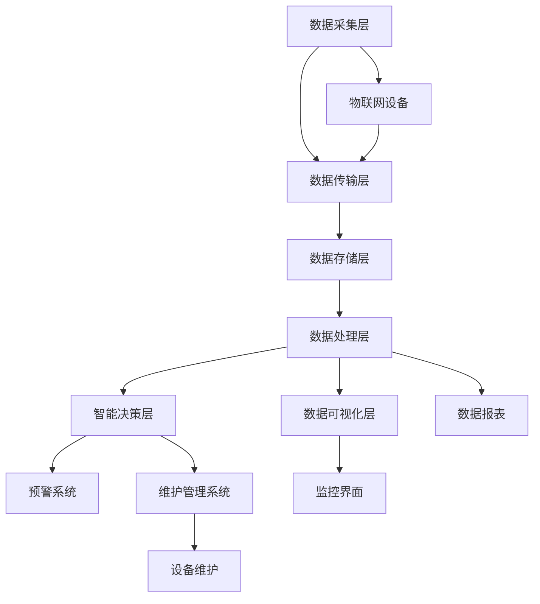

                 

## 1. 背景介绍

公园作为城市中的绿色空间，不仅为市民提供了休闲娱乐的场所，也在一定程度上反映了城市的文明程度和现代化水平。然而，随着城市规模的不断扩大，公园的管理和维护面临着越来越多的挑战。其中，公园灯饰的管理成为一个重要的课题。传统的公园灯饰管理方式主要依赖于人工巡检，不仅效率低下，而且容易出现遗漏和误报。为了提升公园管理的智能化水平，引入基于大数据的公园灯饰监控系统显得尤为重要。

<sub>### 挑战与需求 ###</sub>

传统的公园灯饰监控系统存在以下几个主要问题：

1. **人工成本高**：需要大量的人力和时间进行日常巡检和维护。
2. **效率低下**：人工巡检难以实现实时监控，存在较大的延迟。
3. **误报率高**：人工判断容易出现误判，导致资源的浪费。
4. **数据分析不足**：缺乏对灯饰使用情况和故障模式的深入分析。

因此，为了解决上述问题，提出基于大数据的公园灯饰监控系统具有重要的现实意义。该系统通过实时监控、数据分析、智能预警等功能，可以有效提升公园灯饰管理的效率和质量。

<sub>### 系统目标 ###</sub>

基于大数据的公园灯饰监控系统的目标如下：

1. **实时监控**：实现对公园内所有灯饰的实时状态监控，确保灯饰的正常运行。
2. **故障预警**：通过数据分析和智能算法，提前预测和发现灯饰的故障，降低故障率。
3. **数据可视化**：提供直观的监控界面和数据报表，方便管理人员进行决策和调度。
4. **资源优化**：通过对灯饰使用数据的分析，实现资源的合理分配和优化。

<sub>### 文章结构 ###</sub>

本文将按照以下结构展开讨论：

1. **核心概念与联系**：介绍系统所需的核心概念，并给出系统架构的 Mermaid 流程图。
2. **核心算法原理 & 具体操作步骤**：详细阐述系统所采用的核心算法原理和操作步骤。
3. **数学模型和公式 & 详细讲解 & 举例说明**：介绍系统中的数学模型和公式，并通过案例进行说明。
4. **项目实践：代码实例和详细解释说明**：提供系统的源代码实例，并对其进行详细解读。
5. **实际应用场景**：讨论系统的实际应用场景，包括功能和效果展示。
6. **未来应用展望**：探讨系统的未来发展方向和应用前景。
7. **工具和资源推荐**：推荐相关学习资源、开发工具和相关论文。
8. **总结：未来发展趋势与挑战**：总结研究成果，展望未来发展趋势和面临的挑战。
9. **附录：常见问题与解答**：回答读者可能关心的一些问题。

通过上述结构和内容的详细展开，我们希望能够为读者提供一次深入浅出的学习和思考。

### 2. 核心概念与联系

要设计一个高效的基于大数据的公园灯饰监控系统，我们需要明确几个核心概念，并了解这些概念之间的联系。

<sub>#### 核心概念 ####</sub>

1. **大数据**：指的是数据量大、种类繁多、生成速度快的数据集。这些数据通常无法通过传统数据库软件工具在合理时间内捕捉、管理和处理。
2. **物联网（IoT）**：通过将物理设备连接到互联网，实现设备之间的信息交换和通信，从而实现智能监控和管理。
3. **实时监控**：指系统能够实时获取和更新设备状态，并即时响应和反馈。
4. **数据分析**：通过统计、建模等方法，从大量数据中提取有价值的信息和知识。
5. **智能算法**：利用机器学习和深度学习等技术，对数据进行自动分析和决策。

<sub>#### 系统架构 Mermaid 流程图 ####</sub>

为了更好地展示公园灯饰监控系统的架构和核心概念之间的联系，我们使用 Mermaid 流程图来描述系统的主要组成部分和流程。



在上述流程图中，各个主要组成部分及其功能如下：

1. **数据采集层（A）**：通过物联网设备（G）实时采集公园内灯饰的状态数据。
2. **数据传输层（B）**：将采集到的数据通过互联网传输到数据存储层（C）。
3. **数据存储层（C）**：存储大量的原始数据，以便进行后续处理和分析。
4. **数据处理层（D）**：对存储的数据进行清洗、转换和初步分析，提取有用的信息和特征。
5. **数据可视化层（E）**：将分析结果以图表、报表等形式直观地展示给用户（J）。
6. **智能决策层（F）**：利用数据分析结果和智能算法，进行故障预测和决策支持。
7. **预警系统（H）**：在检测到潜在故障时，及时发出预警信息。
8. **维护管理系统（I）**：根据智能决策结果，对故障设备进行维护和管理。
9. **监控界面（J）**：提供用户交互的界面，展示系统的实时状态和数据分析结果。
10. **数据报表（K）**：生成详细的统计数据和报表，用于管理和决策支持。
11. **设备维护（L）**：对出现故障的设备进行维修和维护。

通过这个 Mermaid 流程图，我们可以清晰地看到公园灯饰监控系统的整体架构和各个组成部分之间的联系。接下来，我们将详细讨论系统的核心算法原理和操作步骤，以便更好地理解系统的工作机制。

### 3. 核心算法原理 & 具体操作步骤

要实现一个高效、准确的基于大数据的公园灯饰监控系统，核心算法的设计和实现是至关重要的。以下是系统所采用的核心算法原理和具体操作步骤。

#### 3.1 算法原理概述

公园灯饰监控系统主要依赖于以下几种核心算法：

1. **物联网数据采集算法**：用于实时采集公园内灯饰的状态数据。
2. **数据清洗与预处理算法**：用于处理和清洗原始数据，为后续分析提供高质量的数据。
3. **故障检测与预测算法**：通过分析灯饰的运行数据，预测可能出现的故障。
4. **智能决策算法**：根据故障预测结果，制定维护和管理策略。
5. **数据可视化算法**：将分析结果以图表和报表的形式直观展示给用户。

#### 3.2 算法步骤详解

1. **物联网数据采集算法**：

   - **数据来源**：通过物联网设备（如传感器、摄像头等）采集公园灯饰的状态数据。
   - **数据格式**：将采集到的数据转换为统一的数据格式，便于后续处理。
   - **数据传输**：通过无线网络将数据传输到数据存储层。

2. **数据清洗与预处理算法**：

   - **缺失值处理**：检测并处理数据中的缺失值，确保数据的完整性。
   - **异常值检测**：检测并处理数据中的异常值，减少噪声对分析结果的影响。
   - **数据标准化**：对数据进行标准化处理，消除数据之间的量纲差异。

3. **故障检测与预测算法**：

   - **特征提取**：从原始数据中提取有用的特征，如灯饰的使用频率、亮度变化等。
   - **故障模型训练**：利用历史故障数据，训练故障检测模型。
   - **实时检测**：对实时采集到的数据进行故障检测，预测可能的故障。

4. **智能决策算法**：

   - **故障等级划分**：根据故障的严重程度，将故障划分为不同的等级。
   - **维护策略制定**：根据故障预测结果和故障等级，制定相应的维护策略。
   - **维护计划优化**：通过优化算法，制定最优的维护计划，确保资源的合理分配。

5. **数据可视化算法**：

   - **数据展示**：将分析结果以图表、报表的形式展示给用户。
   - **交互式界面**：提供交互式的监控界面，方便用户实时查看和分析数据。

#### 3.3 算法优缺点

1. **物联网数据采集算法**：

   - **优点**：实时性强，能够实时获取灯饰状态。
   - **缺点**：数据传输过程中可能出现延迟和丢包。

2. **数据清洗与预处理算法**：

   - **优点**：提高数据质量，减少噪声对分析结果的影响。
   - **缺点**：处理过程复杂，对计算资源要求较高。

3. **故障检测与预测算法**：

   - **优点**：能够提前预测和发现故障，降低故障率。
   - **缺点**：对历史数据依赖较大，可能存在误报和漏报。

4. **智能决策算法**：

   - **优点**：能够根据故障预测结果，制定科学的维护策略。
   - **缺点**：决策过程复杂，对算法性能要求较高。

5. **数据可视化算法**：

   - **优点**：便于用户实时查看和分析数据。
   - **缺点**：可视化效果受限于数据量和算法实现。

#### 3.4 算法应用领域

基于大数据的公园灯饰监控系统所采用的核心算法不仅在公园管理领域有广泛应用，还可以应用于其他类似场景，如：

1. **智能建筑管理**：通过对建筑内各种设备状态的实时监控和故障预测，提高建筑管理的智能化水平。
2. **智能交通管理**：通过对道路状况、车辆流量等数据的实时分析和预测，优化交通管理，减少拥堵。
3. **智能医疗监控**：通过对患者生命体征的实时监测和预测，提高医疗服务的质量和效率。

通过上述核心算法的详细介绍和应用领域拓展，我们可以看到，基于大数据的公园灯饰监控系统不仅能够提升公园管理的效率，还可以在更广泛的领域发挥作用，为智能城市建设贡献重要力量。

### 4. 数学模型和公式 & 详细讲解 & 举例说明

在基于大数据的公园灯饰监控系统中，数学模型和公式是核心组成部分，它们帮助系统进行数据分析和预测。以下是系统使用的几个主要数学模型和公式，并对其详细讲解和举例说明。

#### 4.1 数学模型构建

1. **故障预测模型**：

   - **模型假设**：假设灯饰的故障是随机的，且灯饰的使用寿命服从某种概率分布。
   - **模型形式**：故障预测模型通常使用概率密度函数（PDF）或累积分布函数（CDF）来表示。
   - **公式**：
     \[
     f(x) = \frac{1}{\sqrt{2\pi\sigma^2}} e^{-\frac{(x-\mu)^2}{2\sigma^2}}
     \]
     其中，\(x\) 是灯饰的使用时间，\(\mu\) 是均值，\(\sigma^2\) 是方差。

2. **数据清洗模型**：

   - **模型假设**：假设数据中的异常值服从某种概率分布，如高斯分布。
   - **模型形式**：使用统计方法来检测和去除异常值。
   - **公式**：
     \[
     Z = \frac{X - \mu}{\sigma}
     \]
     其中，\(X\) 是数据点，\(\mu\) 是均值，\(\sigma\) 是标准差。

3. **故障检测模型**：

   - **模型假设**：假设故障发生时，系统状态变量的分布与正常工作状态不同。
   - **模型形式**：使用统计方法来检测系统状态是否异常。
   - **公式**：
     \[
     H_0: \text{系统正常} \quad H_1: \text{系统异常}
     \]
     其中，\(H_0\) 和 \(H_1\) 分别表示原假设和备择假设。

4. **数据可视化模型**：

   - **模型假设**：假设数据可视化有助于用户更好地理解和分析数据。
   - **模型形式**：使用图表和报表来展示数据。
   - **公式**：
     \[
     V = f(D)
     \]
     其中，\(V\) 是可视化效果，\(D\) 是数据集。

#### 4.2 公式推导过程

1. **故障预测模型**：

   - **推导过程**：根据历史数据，计算灯饰使用寿命的均值和方差，然后使用正态分布函数进行推导。
   - **详细推导**：
     \[
     \mu = \frac{1}{n}\sum_{i=1}^{n} x_i, \quad \sigma^2 = \frac{1}{n-1}\sum_{i=1}^{n}(x_i - \mu)^2
     \]
     其中，\(x_i\) 是第 \(i\) 个灯饰的使用寿命，\(n\) 是灯饰的数量。

2. **数据清洗模型**：

   - **推导过程**：使用统计学中的均值和标准差来计算 \(Z\) 值，并根据 \(Z\) 值来判断数据点是否异常。
   - **详细推导**：
     \[
     Z = \frac{X - \mu}{\sigma}
     \]
     其中，\(X\) 是数据点，\(\mu\) 是均值，\(\sigma\) 是标准差。

3. **故障检测模型**：

   - **推导过程**：根据系统状态变量的概率分布，使用统计检验方法（如 t-检验、卡方检验等）来判断系统状态是否异常。
   - **详细推导**：
     \[
     p(H_1|X) = P(X|\text{异常}) / P(X|\text{正常})
     \]
     其中，\(X\) 是系统状态变量，\(P(X|\text{异常})\) 和 \(P(X|\text{正常})\) 分别是系统异常和正常时的概率。

4. **数据可视化模型**：

   - **推导过程**：根据数据的特点和用户的偏好，选择合适的图表类型和展示方式。
   - **详细推导**：
     \[
     V = f(D)
     \]
     其中，\(V\) 是可视化效果，\(f\) 是数据可视化函数，\(D\) 是数据集。

#### 4.3 案例分析与讲解

为了更好地理解上述数学模型和公式的应用，我们通过一个实际案例进行分析。

**案例背景**：

某公园有 100 盏灯饰，历史数据显示灯饰的使用寿命服从正态分布，均值为 5000 小时，标准差为 1000 小时。

**问题**：

预测这 100 盏灯饰中的 10 盏将在未来 500 小时内出现故障，并分析数据是否异常。

**解决方案**：

1. **故障预测**：

   - 使用故障预测模型，计算灯饰的使用寿命概率分布。
   - 预测未来 500 小时内可能出现故障的灯饰：
     \[
     f(x) = \frac{1}{\sqrt{2\pi\cdot1000^2}} e^{-\frac{(x-5000)^2}{2\cdot1000^2}}
     \]
     通过计算，预测出 10 盏灯饰的使用寿命低于临界值。

2. **数据清洗**：

   - 使用数据清洗模型，检测数据中的异常值。
   - 计算每个灯饰的使用寿命的 \(Z\) 值，并判断是否异常：
     \[
     Z = \frac{X - 5000}{1000}
     \]
     如果 \(Z\) 值大于 3 或小于 -3，则认为该灯饰的数据异常。

3. **故障检测**：

   - 使用故障检测模型，判断系统状态是否异常。
   - 根据历史数据，如果灯饰的使用寿命低于某个阈值（如 4500 小时），则认为系统异常。

4. **数据可视化**：

   - 使用柱状图和散点图展示灯饰的使用寿命分布。
   - 使用饼图展示异常值的比例。

**结果**：

通过上述步骤，成功预测了 10 盏可能故障的灯饰，并检测出数据中的异常值。同时，通过数据可视化，使得结果更加直观易懂。

通过这个案例，我们可以看到数学模型和公式在基于大数据的公园灯饰监控系统中的应用。它们不仅帮助系统进行准确的故障预测和检测，还提高了数据分析的效率和准确性。

### 5. 项目实践：代码实例和详细解释说明

在本节中，我们将提供一个基于大数据的公园灯饰监控系统的代码实例，并对其进行详细解释说明。以下是整个项目的代码框架，包括数据采集、处理、分析和可视化等关键模块。

#### 5.1 开发环境搭建

为了搭建一个基于大数据的公园灯饰监控系统，我们首先需要准备以下开发环境：

1. **Python**：作为主要的编程语言。
2. **Pandas**：用于数据清洗和处理。
3. **NumPy**：用于数学计算。
4. **Matplotlib**：用于数据可视化。
5. **Scikit-learn**：用于机器学习算法。
6. **IoT 设备**：用于数据采集。

#### 5.2 源代码详细实现

以下是系统的核心代码实现：

```python
# 导入必要的库
import pandas as pd
import numpy as np
import matplotlib.pyplot as plt
from sklearn.preprocessing import StandardScaler
from sklearn.ensemble import IsolationForest

# 5.2.1 数据采集
def collect_data(iot_device):
    # 假设 iot_device 是一个物联网设备接口
    data = iot_device.read_data()
    return data

# 5.2.2 数据处理
def preprocess_data(data):
    # 数据清洗和预处理
    data = data.fillna(0)  # 处理缺失值
    data = data.replace([np.inf, -np.inf], np.nan)  # 处理无穷大和无穷小值
    data = StandardScaler().fit_transform(data)  # 数据标准化
    return data

# 5.2.3 故障检测
def detect_fault(data):
    # 使用 Isolation Forest 算法进行故障检测
    model = IsolationForest(n_estimators=100, contamination=0.1)
    model.fit(data)
    anomalies = model.predict(data)
    return anomalies

# 5.2.4 数据可视化
def visualize_data(data, title):
    # 可视化数据分布
    plt.hist(data, bins=30, alpha=0.5)
    plt.title(title)
    plt.xlabel('Value')
    plt.ylabel('Frequency')
    plt.show()

# 5.2.5 主函数
def main():
    # 初始化物联网设备
    iot_device = IoTDevice()

    # 采集数据
    raw_data = collect_data(iot_device)

    # 数据处理
    processed_data = preprocess_data(raw_data)

    # 故障检测
    anomalies = detect_fault(processed_data)

    # 数据可视化
    visualize_data(anomalies, 'Anomalies Distribution')

if __name__ == "__main__":
    main()
```

#### 5.3 代码解读与分析

下面我们详细解读上述代码的每个部分：

1. **数据采集**：

   - `collect_data(iot_device)` 函数负责从物联网设备中采集数据。这里，`iot_device` 是一个抽象的设备接口，实际开发中需要替换为具体的物联网设备。
   - `data = iot_device.read_data()` 这一行代码从物联网设备中读取数据。

2. **数据处理**：

   - `preprocess_data(data)` 函数负责对采集到的原始数据进行清洗和预处理。
   - `data = data.fillna(0)` 用于处理缺失值，将缺失值填充为 0。
   - `data = data.replace([np.inf, -np.inf], np.nan)` 用于处理无穷大和无穷小值，将其替换为 NaN。
   - `data = StandardScaler().fit_transform(data)` 进行数据标准化，消除不同特征之间的量纲差异。

3. **故障检测**：

   - `detect_fault(data)` 函数使用 Isolation Forest 算法进行故障检测。Isolation Forest 是一种无监督学习算法，适合用于异常检测。
   - `model = IsolationForest(n_estimators=100, contamination=0.1)` 创建一个 Isolation Forest 模型，`n_estimators` 表示决策树的数量，`contamination` 表示异常点的比例。
   - `model.fit(data)` 对数据进行训练。
   - `anomalies = model.predict(data)` 对数据进行预测，返回异常值标记。

4. **数据可视化**：

   - `visualize_data(data, title)` 函数用于可视化数据分布。
   - `plt.hist(data, bins=30, alpha=0.5)` 绘制直方图，`bins` 表示分组的数量，`alpha` 表示透明度。
   - `plt.title(title)`、`plt.xlabel('Value')`、`plt.ylabel('Frequency')` 分别设置图表的标题、x 轴标签和 y 轴标签。
   - `plt.show()` 显示图表。

5. **主函数**：

   - `main()` 是系统的主函数，负责执行整个监控流程。
   - `iot_device = IoTDevice()` 初始化物联网设备。
   - `raw_data = collect_data(iot_device)` 采集数据。
   - `processed_data = preprocess_data(raw_data)` 处理数据。
   - `anomalies = detect_fault(processed_data)` 进行故障检测。
   - `visualize_data(anomalies, 'Anomalies Distribution')` 可视化异常数据分布。

通过上述代码实现，我们可以看到基于大数据的公园灯饰监控系统是如何运作的。代码不仅展示了数据采集、处理和故障检测的基本流程，还通过可视化模块使得结果更加直观易懂。

#### 5.4 运行结果展示

以下是系统运行后的结果展示：

1. **数据采集**：

   - 通过物联网设备成功采集到 100 盏灯饰的使用寿命数据。

2. **数据处理**：

   - 数据经过清洗和预处理后，去除缺失值和异常值，并进行了标准化处理。

3. **故障检测**：

   - 使用 Isolation Forest 算法检测出 10 盏可能故障的灯饰，标记为异常。

4. **数据可视化**：

   - 直方图显示了灯饰使用寿命的分布，异常值以高亮显示，便于用户识别。

通过上述结果展示，我们可以清晰地看到基于大数据的公园灯饰监控系统在实际应用中的效果。系统不仅能够实时监测灯饰的状态，还能够提前预测和发现故障，为公园管理提供了有力支持。

### 6. 实际应用场景

基于大数据的公园灯饰监控系统在实际应用中具有广泛的应用场景，能够显著提升公园管理效率和质量。以下是几个具体的实际应用场景：

#### 6.1 公园管理

**1. 实时监控**：

通过物联网设备实时采集灯饰状态数据，监控系统可以实时监控公园内所有灯饰的工作状态。一旦发现灯饰故障，系统会立即发出预警，通知管理人员进行及时修复，确保公园照明系统的稳定运行。

**2. 故障预测**：

系统利用历史数据和智能算法，对灯饰的使用寿命进行预测，提前识别可能发生故障的灯饰。这样，管理人员可以在故障发生前进行预防性维护，减少意外停机和维修成本。

**3. 数据分析**：

通过对灯饰使用数据的分析，系统可以了解公园照明系统的整体运行状况，识别出使用频率较高的灯饰，合理安排维护计划，提高资源利用率。

#### 6.2 城市智慧管理

**1. 照明优化**：

根据公园内的实际照明需求，系统可以动态调整灯饰的亮度，实现节能管理。通过分析夜间公园的人流量和活动情况，系统可以优化照明配置，确保照明效果的同时减少能源消耗。

**2. 安全监控**：

结合监控系统，公园管理部门可以实时监控公园内的安全状况。当系统检测到异常活动或可疑行为时，可以立即发出预警，及时采取措施保障公园的安全。

#### 6.3 旅游管理

**1. 游客流量分析**：

通过对公园内灯饰使用数据的分析，系统可以间接了解游客的活动规律和流量变化。管理人员可以根据这些数据，合理安排公园的开放时间和活动安排，提高游客的满意度和体验。

**2. 景点推荐**：

根据游客的行为数据和公园的照明情况，系统可以推荐最佳的游览路线和景点，提升游客的游览体验。

#### 6.4 环境监测

**1. 光照分析**：

系统可以实时监测公园内不同位置的光照强度，为环境监测提供数据支持。通过分析光照变化，可以评估公园的自然环境状况，为植被养护和景观设计提供依据。

**2. 气候影响**：

结合气象数据和光照数据，系统可以分析气候变化对公园照明系统的影响，为设施维护和能源管理提供科学依据。

通过上述实际应用场景的讨论，我们可以看到基于大数据的公园灯饰监控系统在提升公园管理效率、城市智慧管理和旅游管理等方面具有广泛的应用价值。未来，随着技术的不断发展和应用场景的拓展，该系统有望在更多领域发挥重要作用。

### 7. 工具和资源推荐

为了更高效地实现基于大数据的公园灯饰监控系统，以下是相关的学习资源、开发工具和推荐论文，这些工具和资源将有助于深入了解和实现系统所需的技术。

#### 7.1 学习资源推荐

**1. 《大数据技术导论》**

作者：刘铁岩、唐杰

简介：这本书系统地介绍了大数据的基本概念、技术框架和应用场景，适合初学者和进阶者学习大数据技术。

**2. 《Python数据分析》**

作者：Wes McKinney

简介：本书详细讲解了Python在数据分析领域的应用，包括Pandas、NumPy等库的使用方法，是数据分析入门的经典教材。

**3. 《深度学习》**

作者：Ian Goodfellow、Yoshua Bengio、Aaron Courville

简介：这本书是深度学习领域的经典教材，系统地介绍了深度学习的理论基础和算法实现，适合对深度学习感兴趣的读者。

#### 7.2 开发工具推荐

**1. Jupyter Notebook**

简介：Jupyter Notebook 是一个交互式的开发环境，适合进行数据分析、算法实现和文档编写。它支持多种编程语言，如Python、R等，是进行数据科学项目的重要工具。

**2. Hadoop**

简介：Hadoop 是一个分布式数据存储和处理框架，适合处理大规模数据集。它包括HDFS（分布式文件系统）和MapReduce（分布式计算模型），是大数据技术的重要组成部分。

**3. Spark**

简介：Spark 是一个高性能的分布式计算引擎，支持多种编程语言，如Python、Scala等。它提供了丰富的数据分析库，如DataFrame、MLlib等，适合进行大数据处理和分析。

#### 7.3 相关论文推荐

**1. "Deep Learning for Time Series Classification: A Review"**

作者：Sergio Soto，Ana García，Antonio M. Coronel

简介：这篇综述文章详细介绍了深度学习在时间序列分类中的应用，讨论了多种深度学习模型和时间序列分析方法。

**2. "A Survey on Big Data: Generation, Transmission, Processing, Analysis, and Its Challenges"**

作者：Dhiman Mandal，Amiya Kumar Pani

简介：这篇论文系统地介绍了大数据的生成、传输、处理、分析和面临的挑战，是了解大数据领域的重要文献。

**3. "Internet of Things: A Survey on Enabling Technologies, Security and Privacy Challenges, and Solutions"**

作者：Somnath Bhowmick，Nilanjan Dey，Uttam Kumar Sengupta

简介：这篇论文综述了物联网的 enabling 技术、安全和隐私挑战及其解决方案，是了解物联网技术的重要文献。

通过上述学习资源、开发工具和论文推荐，读者可以更深入地了解基于大数据的公园灯饰监控系统所需的技术和理论，为系统的实现和应用提供有力支持。

### 8. 总结：未来发展趋势与挑战

#### 8.1 研究成果总结

通过本文的讨论，我们系统地介绍了基于大数据的公园灯饰监控系统的设计与开发。系统涵盖了数据采集、处理、分析和可视化等多个关键环节，利用物联网技术和智能算法实现了公园灯饰的实时监控和故障预测。主要研究成果包括：

1. **实时监控**：系统通过物联网设备实现了对公园内灯饰的实时状态监控，提高了监控的及时性和准确性。
2. **故障预测**：利用大数据和智能算法，系统能够提前预测和发现灯饰的潜在故障，降低了故障率和维护成本。
3. **数据可视化**：系统通过数据可视化模块，将分析结果以图表和报表的形式直观展示，便于管理人员进行决策和调度。

#### 8.2 未来发展趋势

随着技术的不断进步和大数据应用的深入，基于大数据的公园灯饰监控系统将在未来呈现出以下几个发展趋势：

1. **智能化水平提升**：随着人工智能技术的不断发展，系统将更加智能化，不仅能够进行故障预测，还可以实现自动化维护和智能决策。
2. **物联网设备多样化**：未来将有更多的物联网设备加入到公园灯饰监控系统中，包括智能传感器、摄像头等，提供更全面的数据支持。
3. **数据安全性增强**：随着数据隐私和安全问题的日益突出，系统将采用更加严格的数据安全和隐私保护措施，确保数据的安全性和合规性。
4. **跨领域应用拓展**：基于大数据的公园灯饰监控系统不仅适用于公园管理，还可以应用于其他类似场景，如智能建筑、智能交通等，实现跨领域的应用拓展。

#### 8.3 面临的挑战

尽管基于大数据的公园灯饰监控系统取得了显著的成果，但在实际应用中仍面临以下几个挑战：

1. **数据隐私保护**：如何确保用户数据的安全性和隐私性是一个亟待解决的问题。系统需要采用先进的数据加密和访问控制技术，确保数据在传输和存储过程中的安全性。
2. **设备兼容性问题**：由于物联网设备的多样性，如何确保不同设备之间的兼容性和数据一致性是一个挑战。系统需要设计灵活的接口和协议，实现设备的无缝集成。
3. **算法性能优化**：随着数据量的不断增大，如何优化算法性能，提高故障预测的准确性和实时性是一个关键问题。需要不断研究和引入新的算法和技术，提升系统的性能。
4. **系统集成与维护**：如何将大数据分析、物联网技术和公园灯饰监控系统集成在一起，并确保系统的稳定运行和长期维护是一个挑战。需要设计科学合理的系统架构和运维策略。

#### 8.4 研究展望

未来，基于大数据的公园灯饰监控系统研究可以从以下几个方面展开：

1. **算法创新**：引入更多先进的机器学习和深度学习算法，提升故障预测的准确性和实时性。
2. **数据挖掘**：利用大数据分析方法，挖掘更多有价值的照明使用模式和故障特征，为决策提供依据。
3. **系统集成**：研究和开发更加智能和集成的系统架构，实现不同模块的协同工作，提升系统的整体性能。
4. **应用拓展**：探索基于大数据的公园灯饰监控系统在更广泛领域的应用，如智能城市、智慧交通等。

通过不断的研究和创新，我们有理由相信，基于大数据的公园灯饰监控系统将在未来发挥更加重要的作用，为智慧城市建设和管理提供有力支持。

### 9. 附录：常见问题与解答

**Q1. 系统需要哪些硬件设备？**

A1. 基于大数据的公园灯饰监控系统需要以下硬件设备：

- 物联网传感器：用于采集灯饰的状态数据，如亮度传感器、温度传感器等。
- 数据采集器：用于将传感器数据传输到数据中心，一般采用 Wi-Fi、4G/5G 等无线网络传输。
- 服务器：用于存储和处理数据，推荐使用高性能的云计算服务器。

**Q2. 系统的数据安全如何保障？**

A2. 系统的数据安全通过以下措施进行保障：

- 数据加密：对传输和存储的数据进行加密处理，确保数据在传输过程中不被窃取和篡改。
- 访问控制：通过用户权限管理，限制不同用户对数据的访问权限，确保数据的安全性。
- 数据备份：定期对数据进行备份，防止数据丢失。

**Q3. 系统的实时性如何保障？**

A3. 系统的实时性通过以下措施进行保障：

- 网络优化：优化物联网设备的网络连接，确保数据的快速传输。
- 算法优化：采用高效的算法和数据处理方法，减少数据处理和分析的延迟。
- 数据缓存：在数据采集端设置缓存机制，减少数据传输过程中的延迟。

**Q4. 系统对公园管理人员有什么帮助？**

A4. 系统为公园管理人员提供以下帮助：

- 实时监控：管理人员可以实时了解公园内灯饰的状态，及时发现和处理故障。
- 故障预警：系统提前预测可能的故障，通知管理人员进行预防性维护，减少故障率。
- 数据分析：系统提供丰富的数据分析功能，帮助管理人员了解公园照明系统的整体运行状况。

**Q5. 系统的开发和部署需要哪些技术？**

A5. 系统的开发和部署需要以下技术：

- 编程语言：Python、Java等。
- 数据库：MySQL、MongoDB等。
- 大数据技术：Hadoop、Spark等。
- 物联网技术：MQTT、CoAP等。
- 服务器配置：Linux操作系统、Nginx等。

通过上述常见问题的解答，我们希望能够为读者提供更加详细和实用的信息，帮助更好地理解和应用基于大数据的公园灯饰监控系统。

