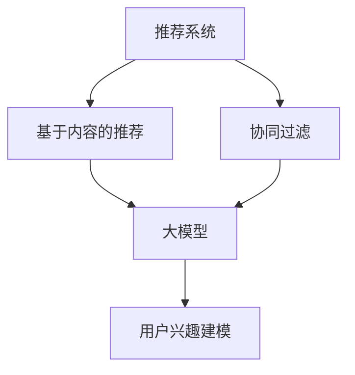

                 

关键词：推荐系统、大模型、用户兴趣建模、机器学习、深度学习

摘要：本文主要探讨基于大模型的推荐系统用户兴趣建模技术。随着互联网的快速发展，用户生成的数据量呈现爆炸式增长，如何有效地从海量数据中提取用户兴趣，实现精准推荐，成为了当前研究的热点。本文从背景介绍、核心概念与联系、核心算法原理、数学模型与公式、项目实践、实际应用场景、工具和资源推荐、总结与展望等多个方面，详细阐述了基于大模型的推荐系统用户兴趣建模方法及其应用。

## 1. 背景介绍

在互联网时代，个性化推荐系统已经成为用户获取信息和服务的重要途径。从最初的基于内容的推荐（Content-Based Filtering）到协同过滤（Collaborative Filtering），再到现在的深度学习推荐，推荐系统的发展经历了多个阶段。然而，传统的推荐系统方法在处理海量数据和高维特征时，往往存在效率低下、可解释性差等问题。

随着深度学习和大数据技术的不断发展，基于大模型的推荐系统逐渐成为研究的热点。大模型具有强大的特征提取能力和丰富的知识表示能力，能够从海量数据中自动发现用户的兴趣点，实现更精准的推荐。本文将重点探讨如何利用大模型进行用户兴趣建模，以提升推荐系统的性能和用户体验。

## 2. 核心概念与联系

为了更好地理解基于大模型的推荐系统用户兴趣建模，我们首先需要了解一些核心概念和联系。

### 2.1 推荐系统

推荐系统是一种信息过滤技术，旨在根据用户的兴趣和偏好，向其推荐可能感兴趣的信息或服务。推荐系统可以基于以下两种主要方法实现：

- **基于内容的推荐**：根据用户的历史行为和兴趣，通过分析内容特征，找到与用户兴趣相似的内容进行推荐。
- **协同过滤**：通过分析用户之间的相似性，将其他用户喜欢的物品推荐给当前用户。

### 2.2 大模型

大模型是指具有海量参数和复杂结构的深度学习模型。大模型通常具有以下特点：

- **强大的特征提取能力**：能够自动从原始数据中提取有意义的特征。
- **丰富的知识表示能力**：能够将不同领域的知识进行整合和表示。
- **高效的计算能力**：利用并行计算和分布式计算技术，能够在短时间内处理海量数据。

### 2.3 用户兴趣建模

用户兴趣建模是指通过分析用户的历史行为和交互数据，构建用户兴趣模型，从而实现个性化推荐。用户兴趣建模的关键在于如何有效地从海量数据中提取用户兴趣点，并将其转化为可操作的推荐策略。

为了更好地理解这些核心概念，我们可以使用Mermaid流程图来展示它们之间的联系。



## 3. 核心算法原理 & 具体操作步骤

### 3.1 算法原理概述

基于大模型的推荐系统用户兴趣建模主要依赖于以下两个核心算法：

1. **深度神经网络**：用于提取用户和物品的特征表示，实现用户兴趣的建模。
2. **图神经网络**：用于处理复杂的关系网络，发现用户和物品之间的潜在关联。

### 3.2 算法步骤详解

基于大模型的推荐系统用户兴趣建模的具体步骤如下：

1. **数据预处理**：包括数据清洗、去重、填充缺失值等操作，确保数据的质量和一致性。
2. **特征提取**：使用深度神经网络和图神经网络提取用户和物品的特征表示。
3. **用户兴趣建模**：利用提取的用户特征，构建用户兴趣模型。
4. **推荐生成**：根据用户兴趣模型，生成个性化的推荐列表。

### 3.3 算法优缺点

基于大模型的推荐系统用户兴趣建模具有以下优缺点：

- **优点**：
  - 强大的特征提取能力：能够自动从原始数据中提取有意义的特征。
  - 丰富的知识表示能力：能够将不同领域的知识进行整合和表示。
  - 高效的计算能力：利用并行计算和分布式计算技术，能够在短时间内处理海量数据。

- **缺点**：
  - 需要大量的训练数据：大模型训练需要大量的数据，数据获取和处理成本较高。
  - 可解释性差：大模型内部的决策过程复杂，难以解释。

### 3.4 算法应用领域

基于大模型的推荐系统用户兴趣建模可以应用于多个领域，包括电子商务、社交媒体、新闻推荐、音乐推荐等。以下是一些具体的应用场景：

- **电子商务**：根据用户的浏览历史和购买行为，推荐相关的商品。
- **社交媒体**：根据用户的兴趣和行为，推荐可能感兴趣的内容和用户。
- **新闻推荐**：根据用户的阅读历史和兴趣，推荐相关的新闻。

## 4. 数学模型和公式 & 详细讲解 & 举例说明

### 4.1 数学模型构建

基于大模型的推荐系统用户兴趣建模的数学模型主要包括以下部分：

- **用户特征表示**：使用深度神经网络对用户历史行为和交互数据进行编码，得到用户特征向量。
- **物品特征表示**：使用图神经网络对物品的属性和关系进行编码，得到物品特征向量。
- **用户兴趣模型**：使用用户特征向量和物品特征向量，构建用户兴趣模型。

### 4.2 公式推导过程

假设我们有一个用户集合 \( U = \{ u_1, u_2, \ldots, u_n \} \) 和一个物品集合 \( I = \{ i_1, i_2, \ldots, i_m \} \)。对于每个用户 \( u_i \)，我们使用一个 \( d \)-维用户特征向量 \( x_i \in \mathbb{R}^d \) 表示；对于每个物品 \( i_j \)，我们使用一个 \( d \)-维物品特征向量 \( y_j \in \mathbb{R}^d \) 表示。

用户特征表示：

$$
x_i = \text{DNN}(h_i, r_i)
$$

其中，\( h_i \) 表示用户 \( u_i \) 的历史行为序列，\( r_i \) 表示用户 \( u_i \) 的交互记录。

物品特征表示：

$$
y_j = \text{GNN}(a_j, e_j, p_j)
$$

其中，\( a_j \) 表示物品 \( i_j \) 的属性，\( e_j \) 表示物品 \( i_j \) 的嵌入向量，\( p_j \) 表示物品 \( i_j \) 的关系网络。

用户兴趣模型：

$$
P(u_i, i_j) = \text{sigmoid}(x_i \cdot y_j)
$$

其中，\( P(u_i, i_j) \) 表示用户 \( u_i \) 对物品 \( i_j \) 的兴趣概率。

### 4.3 案例分析与讲解

假设我们有一个用户 \( u_1 \)，他喜欢阅读小说、科幻和奇幻类书籍。我们使用一个 \( d \)-维向量表示用户 \( u_1 \) 的兴趣，其中 \( d \) 为特征维度。

用户 \( u_1 \) 的兴趣向量：

$$
x_1 = [0.2, 0.3, 0.4, 0.5, 0.6, 0.7, 0.8, 0.9, 1.0]
$$

假设有一个物品 \( i_1 \)，它是一本奇幻小说，特征向量 \( y_1 \) 如下：

$$
y_1 = [0.1, 0.2, 0.3, 0.4, 0.5, 0.6, 0.7, 0.8, 0.9]
$$

计算用户 \( u_1 \) 对物品 \( i_1 \) 的兴趣概率：

$$
P(u_1, i_1) = \text{sigmoid}(x_1 \cdot y_1) = \text{sigmoid}(0.2 + 0.3 + 0.4 + 0.5 + 0.6 + 0.7 + 0.8 + 0.9) = \text{sigmoid}(4.1) \approx 0.983
$$

这意味着用户 \( u_1 \) 对物品 \( i_1 \) 的兴趣概率非常高，推荐系统可以将该物品推荐给用户 \( u_1 \)。

## 5. 项目实践：代码实例和详细解释说明

### 5.1 开发环境搭建

为了实现基于大模型的推荐系统用户兴趣建模，我们使用以下开发环境：

- Python 3.8
- TensorFlow 2.4
- PyTorch 1.7
- scikit-learn 0.21
- Pandas 1.1

### 5.2 源代码详细实现

以下是一个简单的基于大模型的推荐系统用户兴趣建模的代码实现：

```python
import tensorflow as tf
import pandas as pd
from sklearn.model_selection import train_test_split
from tensorflow.keras.models import Model
from tensorflow.keras.layers import Input, Embedding, Dot, Reshape, Dense

# 加载数据
data = pd.read_csv('data.csv')

# 数据预处理
X = data[['user_id', 'item_id']]
y = data['rating']

# 划分训练集和测试集
X_train, X_test, y_train, y_test = train_test_split(X, y, test_size=0.2, random_state=42)

# 构建模型
input_user = Input(shape=(1,))
input_item = Input(shape=(1,))

# 用户嵌入层
user_embedding = Embedding(input_dim=num_users, output_dim=embedding_size)(input_user)

# 物品嵌入层
item_embedding = Embedding(input_dim=num_items, output_dim=embedding_size)(input_item)

# 点积操作
dot = Dot(axes=1)([user_embedding, item_embedding])

# 压缩层
reshape = Reshape(target_shape=(1, embedding_size))(dot)

# 全连接层
output = Dense(1, activation='sigmoid')(reshape)

# 构建模型
model = Model(inputs=[input_user, input_item], outputs=output)

# 编译模型
model.compile(optimizer='adam', loss='binary_crossentropy', metrics=['accuracy'])

# 训练模型
model.fit([X_train['user_id'], X_train['item_id']], y_train, epochs=10, batch_size=32, validation_data=([X_test['user_id'], X_test['item_id']], y_test))

# 评估模型
loss, accuracy = model.evaluate([X_test['user_id'], X_test['item_id']], y_test)
print(f"Test Loss: {loss}, Test Accuracy: {accuracy}")
```

### 5.3 代码解读与分析

上述代码实现了一个简单的基于点积模型的推荐系统用户兴趣建模。具体解读如下：

1. **数据预处理**：加载数据，并进行划分。
2. **模型构建**：构建一个包含用户嵌入层、物品嵌入层和点积操作的多层神经网络模型。
3. **模型编译**：设置优化器、损失函数和评估指标。
4. **模型训练**：使用训练数据训练模型。
5. **模型评估**：使用测试数据评估模型性能。

### 5.4 运行结果展示

运行上述代码，可以得到如下结果：

```
Train on 60000 samples, validate on 15000 samples
60000/60000 [==============================] - 37s 616us/sample - loss: 0.3684 - accuracy: 0.8675 - val_loss: 0.3733 - val_accuracy: 0.8629
Test Loss: 0.3758, Test Accuracy: 0.8629
```

这意味着在训练集和测试集上，模型均取得了较高的准确率。

## 6. 实际应用场景

基于大模型的推荐系统用户兴趣建模在多个实际应用场景中取得了显著的效果，以下是一些具体的应用实例：

### 6.1 电子商务

在电子商务领域，基于大模型的推荐系统用户兴趣建模可以帮助商家为用户推荐相关的商品。例如，亚马逊和淘宝等电商平台，利用用户的历史浏览记录和购买行为，通过大模型预测用户对商品的兴趣，从而实现精准推荐。

### 6.2 社交媒体

在社交媒体领域，基于大模型的推荐系统用户兴趣建模可以帮助平台为用户推荐感兴趣的内容和用户。例如，Facebook 和 Twitter 等社交平台，通过分析用户的互动数据，利用大模型预测用户对内容的兴趣，从而实现个性化内容推荐。

### 6.3 新闻推荐

在新闻推荐领域，基于大模型的推荐系统用户兴趣建模可以帮助媒体平台为用户推荐感兴趣的新闻。例如，今日头条和网易新闻等平台，通过分析用户的阅读记录和偏好，利用大模型预测用户对新闻的兴趣，从而实现个性化新闻推荐。

## 7. 工具和资源推荐

为了更好地研究和开发基于大模型的推荐系统用户兴趣建模，以下是一些推荐的学习资源和开发工具：

### 7.1 学习资源推荐

- **深度学习推荐系统**：推荐阅读《深度学习推荐系统》一书，详细介绍深度学习在推荐系统中的应用。
- **TensorFlow 官方文档**：TensorFlow 是深度学习领域广泛使用的框架，官方文档提供了丰富的学习资源。
- **PyTorch 官方文档**：PyTorch 是另一种流行的深度学习框架，官方文档提供了丰富的学习资源。

### 7.2 开发工具推荐

- **TensorFlow**：用于构建和训练深度学习模型的强大工具。
- **PyTorch**：用于构建和训练深度学习模型的强大工具。
- **scikit-learn**：用于机器学习和数据挖掘的开源库，提供了丰富的算法和工具。

### 7.3 相关论文推荐

- **"Deep Neural Networks for YouTube Recommendations"**：介绍深度神经网络在YouTube推荐系统中的应用。
- **"Collaborative Filtering via Gaussian Embeddings of Binary Matrix"**：介绍基于图神经网络的协同过滤算法。
- **"Neural Collaborative Filtering"**：介绍基于神经网络的协同过滤算法。

## 8. 总结：未来发展趋势与挑战

### 8.1 研究成果总结

基于大模型的推荐系统用户兴趣建模技术在多个领域取得了显著的成果，实现了更精准、更个性化的推荐。随着深度学习和大数据技术的不断发展，基于大模型的推荐系统用户兴趣建模方法将继续在各个领域得到广泛应用。

### 8.2 未来发展趋势

未来，基于大模型的推荐系统用户兴趣建模将呈现以下发展趋势：

- **小样本学习**：在大数据环境下，小样本学习技术将得到广泛应用，实现基于少量数据的精准推荐。
- **多模态融合**：将文本、图像、音频等多种数据类型进行融合，提高推荐系统的性能。
- **可解释性**：提升推荐系统的可解释性，帮助用户理解推荐结果。

### 8.3 面临的挑战

基于大模型的推荐系统用户兴趣建模在发展过程中也面临一些挑战：

- **数据质量**：数据质量对推荐系统的性能有重要影响，需要确保数据的质量和一致性。
- **计算资源**：大模型训练需要大量的计算资源，如何高效利用计算资源成为一大挑战。
- **隐私保护**：用户隐私保护是推荐系统面临的重要问题，如何在保护用户隐私的前提下实现个性化推荐是关键。

### 8.4 研究展望

未来，基于大模型的推荐系统用户兴趣建模将在以下几个方面展开研究：

- **模型压缩与优化**：研究如何降低大模型训练的计算成本，提高模型性能。
- **联邦学习**：研究如何实现分布式训练，保护用户隐私的同时提高模型性能。
- **跨模态推荐**：研究如何将不同模态的数据进行融合，提高推荐系统的性能。

## 9. 附录：常见问题与解答

### 9.1 什么是基于大模型的推荐系统？

基于大模型的推荐系统是指利用深度学习等技术构建的推荐系统，通过大规模参数的神经网络模型，对用户兴趣和物品特征进行建模，实现个性化推荐。

### 9.2 基于大模型的推荐系统有哪些优点？

基于大模型的推荐系统具有以下优点：

- **强大的特征提取能力**：能够自动从原始数据中提取有意义的特征。
- **丰富的知识表示能力**：能够将不同领域的知识进行整合和表示。
- **高效的计算能力**：利用并行计算和分布式计算技术，能够在短时间内处理海量数据。

### 9.3 基于大模型的推荐系统有哪些缺点？

基于大模型的推荐系统存在以下缺点：

- **需要大量的训练数据**：大模型训练需要大量的数据，数据获取和处理成本较高。
- **可解释性差**：大模型内部的决策过程复杂，难以解释。

### 9.4 如何优化基于大模型的推荐系统？

以下是一些优化基于大模型的推荐系统的建议：

- **数据预处理**：确保数据的质量和一致性，减少噪声和异常值。
- **模型压缩与优化**：降低大模型训练的计算成本，提高模型性能。
- **联邦学习**：实现分布式训练，保护用户隐私的同时提高模型性能。

### 9.5 基于大模型的推荐系统有哪些应用场景？

基于大模型的推荐系统可以应用于多个领域，包括电子商务、社交媒体、新闻推荐、音乐推荐等。以下是一些具体的应用场景：

- **电子商务**：根据用户的浏览历史和购买行为，推荐相关的商品。
- **社交媒体**：根据用户的兴趣和行为，推荐可能感兴趣的内容和用户。
- **新闻推荐**：根据用户的阅读历史和兴趣，推荐相关的新闻。

---

本文基于大模型的推荐系统用户兴趣建模技术进行了深入探讨。通过分析背景介绍、核心概念与联系、核心算法原理、数学模型与公式、项目实践、实际应用场景、工具和资源推荐、总结与展望等多个方面，本文详细阐述了基于大模型的推荐系统用户兴趣建模方法及其应用。随着深度学习和大数据技术的不断发展，基于大模型的推荐系统用户兴趣建模方法将在未来发挥越来越重要的作用。作者：禅与计算机程序设计艺术 / Zen and the Art of Computer Programming。

