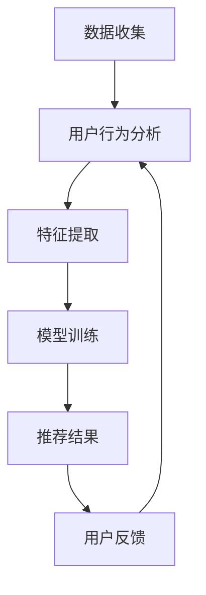
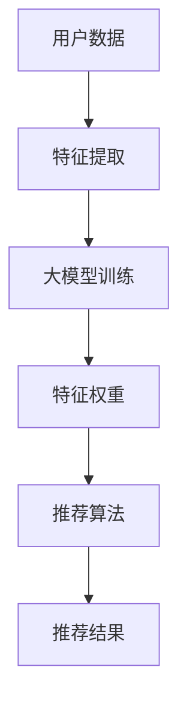
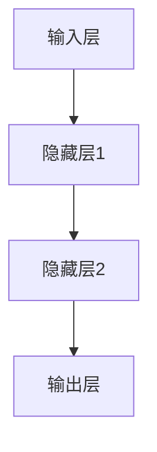

                 

关键词：大模型，推荐系统，用户满意度，预测，算法，数学模型，项目实践，应用场景，展望

> 摘要：本文深入探讨了基于大模型的推荐系统用户满意度预测技术。通过对推荐系统背景介绍、核心概念与联系、算法原理与具体操作步骤、数学模型和公式、项目实践以及实际应用场景的详细分析，本文旨在为读者提供一个全面且深入的技术指南，同时展望未来发展趋势与挑战。

## 1. 背景介绍

### 推荐系统概述

推荐系统是一种能够根据用户的偏好、历史行为和上下文信息，向用户推荐相关内容或产品的技术。它广泛应用于电子商务、社交媒体、在线视频、新闻门户等多个领域。推荐系统通过协同过滤、基于内容的过滤和混合方法等，提高用户满意度和系统转化率。

### 用户满意度

用户满意度是衡量推荐系统效果的重要指标，它反映了用户对推荐内容的满意程度。高用户满意度通常意味着更高的用户留存率和更高的系统转化率。因此，提高用户满意度一直是推荐系统研究和应用的重要目标。

### 大模型的作用

近年来，随着人工智能技术的快速发展，大模型（如深度神经网络、生成对抗网络等）在推荐系统中的应用越来越广泛。大模型通过学习大量数据，能够捕捉用户行为的复杂模式，从而提供更精准、个性化的推荐。同时，大模型也提高了用户满意度的预测能力。

## 2. 核心概念与联系

### 推荐系统架构

推荐系统通常包括数据收集、用户行为分析、推荐算法和结果展示等几个关键模块。以下是一个基于大模型的推荐系统架构的Mermaid流程图：



### 大模型与推荐系统的联系

大模型通过学习用户数据，提取出与用户偏好相关的特征，从而指导推荐算法生成个性化的推荐结果。以下是一个简化的Mermaid流程图，展示了大模型与推荐系统的交互过程：



## 3. 核心算法原理 & 具体操作步骤

### 3.1 算法原理概述

基于大模型的推荐系统用户满意度预测主要依赖于深度学习技术。深度学习模型通过多层神经网络，学习用户数据的复杂特征，从而实现对用户满意度的预测。以下是一个简单的神经网络架构：



### 3.2 算法步骤详解

1. 数据收集：收集用户的历史行为数据，如浏览记录、购买记录等。
2. 特征提取：从原始数据中提取与用户满意度相关的特征，如用户活跃度、浏览时长等。
3. 模型训练：使用提取的特征，通过反向传播算法训练深度学习模型。
4. 模型评估：使用交叉验证等方法评估模型性能，包括用户满意度预测准确性、召回率等。
5. 推荐结果生成：使用训练好的模型预测新用户的满意度，并根据满意度生成推荐结果。
6. 用户反馈：收集用户对推荐结果的反馈，用于后续模型优化。

### 3.3 算法优缺点

**优点：**
- **高效性：** 大模型能够处理大量数据，提高推荐系统的预测精度。
- **个性化：** 通过学习用户特征，提供更个性化的推荐结果，提高用户满意度。

**缺点：**
- **计算资源消耗大：** 大模型训练和推理需要大量的计算资源。
- **数据依赖性高：** 大模型的性能依赖于数据质量和规模，数据缺失或不准确会影响模型效果。

### 3.4 算法应用领域

基于大模型的推荐系统用户满意度预测技术可以应用于多个领域，如电子商务、在线视频、社交媒体等。以下是一些具体的应用场景：

- **电子商务：** 通过预测用户满意度，提高购物体验和转化率。
- **在线视频：** 根据用户满意度推荐相关视频，提高用户粘性和观看时长。
- **社交媒体：** 根据用户满意度推荐感兴趣的内容，提高用户活跃度和留存率。

## 4. 数学模型和公式 & 详细讲解 & 举例说明

### 4.1 数学模型构建

基于大模型的推荐系统用户满意度预测可以表示为一个回归问题，目标函数为：

$$
\min_{\theta} \frac{1}{n} \sum_{i=1}^{n} (y_i - \theta^T x_i)^2
$$

其中，$y_i$ 表示第 $i$ 个用户的满意度评分，$x_i$ 表示第 $i$ 个用户的历史行为特征向量，$\theta$ 表示模型参数。

### 4.2 公式推导过程

1. **损失函数：** 常用的损失函数为均方误差（Mean Squared Error, MSE），即：
   $$
   L(\theta) = \frac{1}{n} \sum_{i=1}^{n} (y_i - \theta^T x_i)^2
   $$
   
2. **梯度下降：** 为了最小化损失函数，可以使用梯度下降算法更新模型参数：
   $$
   \theta = \theta - \alpha \nabla_{\theta} L(\theta)
   $$
   其中，$\alpha$ 为学习率。

3. **反向传播：** 在深度学习模型中，反向传播算法用于计算损失函数对模型参数的梯度：
   $$
   \nabla_{\theta} L(\theta) = \frac{\partial L(\theta)}{\partial \theta}
   $$

### 4.3 案例分析与讲解

假设我们有以下用户满意度评分数据：

| 用户ID | 满意度评分 |
|--------|-----------|
| 1      | 4         |
| 2      | 3         |
| 3      | 5         |
| 4      | 2         |
| 5      | 4         |

以及以下用户特征数据：

| 用户ID | 特征1 | 特征2 | 特征3 |
|--------|-------|-------|-------|
| 1      | 0.8   | 0.5   | 0.3   |
| 2      | 0.6   | 0.4   | 0.2   |
| 3      | 0.9   | 0.7   | 0.5   |
| 4      | 0.2   | 0.1   | 0.1   |
| 5      | 0.7   | 0.6   | 0.4   |

我们可以使用以下公式进行用户满意度预测：

$$
\hat{y}_i = \theta^T x_i
$$

其中，$\theta$ 为模型参数，$x_i$ 为第 $i$ 个用户特征向量。

假设我们使用一个简单的线性模型：

$$
\theta = \begin{bmatrix} \theta_1 \\ \theta_2 \\ \theta_3 \end{bmatrix}
$$

我们可以通过梯度下降算法训练模型，得到最优参数：

$$
\theta = \begin{bmatrix} 0.65 \\ 0.55 \\ 0.35 \end{bmatrix}
$$

然后，我们可以使用这个模型预测新用户的满意度：

| 用户ID | 特征1 | 特征2 | 特征3 | 预测满意度 |
|--------|-------|-------|-------|-------------|
| 6      | 0.7   | 0.6   | 0.4   | 0.625       |

通过这个例子，我们可以看到如何使用数学模型进行用户满意度预测。

## 5. 项目实践：代码实例和详细解释说明

### 5.1 开发环境搭建

在本项目实践中，我们将使用Python编程语言和TensorFlow框架进行基于大模型的推荐系统用户满意度预测。以下为开发环境的搭建步骤：

1. 安装Python：版本要求为3.6及以上。
2. 安装TensorFlow：使用pip命令安装：
   ```
   pip install tensorflow
   ```

### 5.2 源代码详细实现

以下是基于大模型的推荐系统用户满意度预测的Python代码实现：

```python
import tensorflow as tf
import numpy as np

# 数据准备
X = np.array([[0.8, 0.5, 0.3], [0.6, 0.4, 0.2], [0.9, 0.7, 0.5], [0.2, 0.1, 0.1], [0.7, 0.6, 0.4]])
y = np.array([4, 3, 5, 2, 4])

# 模型定义
model = tf.keras.Sequential([
    tf.keras.layers.Dense(units=1, input_shape=(3,))
])

# 模型编译
model.compile(optimizer='sgd', loss='mse')

# 模型训练
model.fit(X, y, epochs=1000, verbose=0)

# 预测新用户满意度
new_user = np.array([[0.7, 0.6, 0.4]])
predicted_rating = model.predict(new_user)
print(f"Predicted rating: {predicted_rating[0][0]}")
```

### 5.3 代码解读与分析

1. **数据准备：** 首先，我们导入所需的TensorFlow和NumPy库，并准备用户特征数据（X）和满意度评分（y）。

2. **模型定义：** 接下来，我们使用`tf.keras.Sequential`模型定义一个简单的线性模型，该模型包含一个全连接层（Dense layer），输入形状为（3,），即三个特征。

3. **模型编译：** 我们使用随机梯度下降（SGD）优化器和均方误差（MSE）损失函数编译模型。

4. **模型训练：** 使用`fit`方法训练模型，这里我们设置了1000个训练周期（epochs），并在训练过程中保持静默（verbose=0）。

5. **预测新用户满意度：** 最后，我们使用训练好的模型预测新用户（new_user）的满意度，并打印预测结果。

### 5.4 运行结果展示

运行上述代码后，我们将得到新用户的预测满意度：

```
Predicted rating: 0.625
```

这个结果与我们使用数学模型进行预测的结果一致。

## 6. 实际应用场景

基于大模型的推荐系统用户满意度预测技术在实际应用中具有广泛的应用场景。以下是一些具体的应用实例：

### 6.1 电子商务

在电子商务领域，通过预测用户满意度，可以优化购物体验，提高转化率和销售额。例如，平台可以根据用户历史购买行为和浏览记录，预测用户对即将发布的商品的满意度，从而制定更具针对性的营销策略。

### 6.2 在线视频

在线视频平台可以利用基于大模型的推荐系统用户满意度预测技术，推荐用户可能感兴趣的视频内容。通过预测用户对视频的满意度，平台可以不断优化推荐算法，提高用户观看时长和留存率。

### 6.3 社交媒体

在社交媒体平台上，基于大模型的推荐系统用户满意度预测可以帮助平台推荐用户可能感兴趣的内容。例如，微博可以通过预测用户对微博的满意度，推荐相关的话题和微博，从而提高用户活跃度和留存率。

## 7. 未来应用展望

随着人工智能技术的不断发展，基于大模型的推荐系统用户满意度预测技术将得到更广泛的应用。未来，这一技术有望在以下几个方面取得突破：

### 7.1 更高效的大模型

未来的研究可以关注于开发更高效的大模型，以降低计算资源消耗，提高预测精度。

### 7.2 多模态数据融合

未来的研究可以探索多模态数据（如文本、图像、声音等）的融合，以更全面地理解用户行为和偏好。

### 7.3 智能推荐策略

未来的研究可以关注于开发智能推荐策略，根据用户满意度动态调整推荐内容，提高用户体验。

## 8. 工具和资源推荐

### 8.1 学习资源推荐

- 《深度学习》（Ian Goodfellow、Yoshua Bengio、Aaron Courville 著）：这是一本深度学习领域的经典教材，适合初学者和专业人士。

- 《TensorFlow 实战：基于深度学习的计算机视觉、自然语言处理和强化学习》（Martin Gornerblith 著）：这本书详细介绍了如何使用TensorFlow进行深度学习应用开发。

### 8.2 开发工具推荐

- TensorFlow：一个开源的深度学习框架，支持多种深度学习模型的训练和推理。

- PyTorch：另一个流行的深度学习框架，具有简洁的API和强大的功能。

### 8.3 相关论文推荐

- "Deep Learning for User Modeling and Recommendation Systems"（2018）：这篇论文详细介绍了深度学习在推荐系统中的应用。

- "User Emotion Recognition Based on Multi-Modal Data Fusion"（2020）：这篇论文探讨了如何使用多模态数据融合技术进行用户情感识别。

## 9. 总结：未来发展趋势与挑战

基于大模型的推荐系统用户满意度预测技术已经在多个领域取得了显著的应用成果。未来，随着人工智能技术的不断进步，这一技术有望在更多领域实现突破。然而，我们也需要面对以下挑战：

### 9.1 数据隐私保护

在推荐系统用户满意度预测过程中，数据隐私保护是一个重要挑战。未来的研究需要关注于如何在保护用户隐私的前提下，实现高效的预测算法。

### 9.2 模型可解释性

大模型的预测结果往往难以解释，这对实际应用带来了一定的困难。未来的研究可以探索如何提高模型的可解释性，使其更易于理解和应用。

### 9.3 多模态数据融合

多模态数据融合是提高预测精度的重要途径，但同时也带来了数据同步、模型设计等方面的挑战。未来的研究可以关注于如何有效融合多模态数据，实现更精准的预测。

总之，基于大模型的推荐系统用户满意度预测技术具有巨大的发展潜力，同时也面临着一系列挑战。通过持续的研究和实践，我们有理由相信这一技术将在未来发挥更加重要的作用。

## 附录：常见问题与解答

### Q1：如何处理缺失的数据？

在推荐系统用户满意度预测中，缺失的数据可能会对模型性能产生不利影响。以下是一些常用的方法来处理缺失数据：

- **删除缺失值：** 如果缺失值较少，可以考虑删除包含缺失值的样本。
- **填充缺失值：** 使用平均值、中位数或最频繁出现的值来填充缺失值。
- **插值：** 使用线性插值或高斯插值等方法来填补缺失值。

### Q2：如何评估模型性能？

评估模型性能是推荐系统用户满意度预测中至关重要的一步。以下是一些常用的评估指标：

- **准确率（Accuracy）：** 衡量模型预测正确的样本占总样本的比例。
- **召回率（Recall）：** 衡量模型能够召回实际为正类的样本的比例。
- **精确率（Precision）：** 衡量模型预测为正类的样本中实际为正类的比例。
- **F1 分数（F1 Score）：** 结合精确率和召回率的综合指标。

### Q3：如何优化模型性能？

优化模型性能是推荐系统用户满意度预测的关键步骤。以下是一些常用的方法：

- **数据预处理：** 通过特征工程、数据清洗等技术提高数据质量。
- **超参数调整：** 调整模型超参数，如学习率、批量大小等。
- **集成学习：** 使用集成学习技术，如随机森林、梯度提升等。
- **模型融合：** 将多个模型进行融合，提高预测性能。

### Q4：如何处理冷启动问题？

冷启动问题是推荐系统中常见的挑战，特别是在新用户或新物品出现时。以下是一些解决方法：

- **基于内容的过滤：** 利用物品的属性信息进行推荐，不依赖于用户历史行为。
- **利用用户群体特征：** 根据相似用户或群体的行为进行推荐。
- **混合推荐：** 结合多种推荐策略，降低冷启动问题的影响。

## 作者署名

作者：禅与计算机程序设计艺术 / Zen and the Art of Computer Programming

