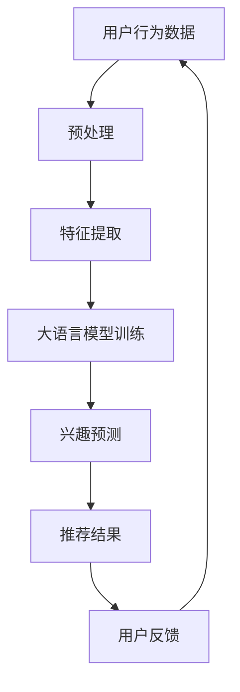

                 

关键词：大语言模型，推荐系统，用户兴趣拓展，算法原理，数学模型，项目实践，应用场景，未来展望

> 摘要：本文将深入探讨基于大语言模型的推荐系统用户兴趣拓展技术，通过解析核心算法原理、数学模型构建、具体操作步骤以及项目实践，全面阐述这一领域的最新研究成果和应用前景。

## 1. 背景介绍

随着互联网和大数据技术的发展，推荐系统已成为各类在线服务的关键组成部分。传统的推荐系统主要依赖于用户的浏览历史、购买记录等显式反馈数据，但这类数据往往难以全面反映用户的真实兴趣。为此，近年来基于人工智能特别是大语言模型的推荐系统逐渐受到关注。大语言模型能够通过学习海量的文本数据，捕捉用户的隐式兴趣和行为模式，从而实现更加精准的兴趣拓展。

## 2. 核心概念与联系

### 2.1 大语言模型

大语言模型（如GPT-3，BERT等）是一种基于深度学习的自然语言处理模型，具备强大的文本生成和语义理解能力。通过预训练和微调，大语言模型可以在多种任务中表现出色，包括文本分类、情感分析、命名实体识别等。

### 2.2 推荐系统

推荐系统是一种利用算法预测用户兴趣，并将相关内容推荐给用户的信息过滤系统。其主要目标是从大量的商品或信息中筛选出用户可能感兴趣的内容，提高用户的满意度和留存率。

### 2.3 用户兴趣拓展

用户兴趣拓展（User Interest Expansion）是一种通过分析用户的历史行为和内容偏好，预测和发现用户的潜在兴趣，从而为用户提供更多个性化推荐的方法。在推荐系统中，兴趣拓展能够提高推荐的多样性和相关性，帮助用户发现新的内容和兴趣点。

### 2.4 Mermaid 流程图



## 3. 核心算法原理 & 具体操作步骤

### 3.1 算法原理概述

基于大语言模型的用户兴趣拓展主要通过以下几个步骤实现：

1. **数据预处理**：收集并清洗用户的历史行为数据，如浏览记录、搜索历史、点击事件等。
2. **特征提取**：利用大语言模型提取用户文本数据中的高维特征。
3. **兴趣预测**：通过训练得到的模型，预测用户的潜在兴趣。
4. **推荐结果**：根据用户兴趣预测结果，生成个性化推荐列表。

### 3.2 算法步骤详解

1. **数据预处理**：首先，收集用户的历史行为数据，包括文本和标签。接着，对文本数据进行清洗和标准化处理，如去除停用词、进行词干提取等。

2. **特征提取**：利用大语言模型（如BERT）对清洗后的文本数据进行编码，提取出文本序列的高维特征表示。这一步是兴趣拓展的关键，大语言模型能够捕捉文本中的深层语义信息。

3. **兴趣预测**：通过训练集上的数据，使用监督学习算法（如逻辑回归、SVM等）训练一个兴趣预测模型。该模型能够根据用户的文本特征，预测其可能的兴趣点。

4. **推荐结果**：将兴趣预测模型应用到新用户或已有用户的数据中，根据预测的兴趣生成个性化推荐列表。

### 3.3 算法优缺点

**优点**：

- **高准确性**：大语言模型能够深入理解用户文本数据的语义信息，提高兴趣预测的准确性。
- **多样性**：通过兴趣拓展，推荐系统能够提供更多样化的内容，减少用户产生疲劳的风险。
- **灵活性**：大语言模型可以灵活适应不同的推荐场景，如新闻推荐、商品推荐等。

**缺点**：

- **计算成本高**：大语言模型的训练和推理需要大量的计算资源。
- **数据依赖性**：模型的效果高度依赖于用户文本数据的数量和质量。

### 3.4 算法应用领域

基于大语言模型的用户兴趣拓展技术已在多个领域得到广泛应用，如电子商务、社交媒体、内容平台等。以下是一些具体的应用实例：

- **电子商务**：通过分析用户的浏览和购买记录，预测用户的潜在购买兴趣，提供个性化的商品推荐。
- **社交媒体**：基于用户的社交关系和内容互动，预测用户可能感兴趣的话题和内容，提高用户参与度。
- **内容平台**：通过分析用户的阅读历史和偏好，推荐用户可能感兴趣的文章和视频，提升用户留存率。

## 4. 数学模型和公式

### 4.1 数学模型构建

基于大语言模型的用户兴趣拓展可以通过以下数学模型实现：

\[ \text{Prediction}(x) = \sigma(W_1x + b_1) \]

其中，\( x \) 为用户文本特征向量，\( W_1 \) 和 \( b_1 \) 分别为权重和偏置。\( \sigma \) 为激活函数，通常使用Sigmoid或ReLU。

### 4.2 公式推导过程

首先，对用户文本数据进行编码，得到高维特征向量 \( x \)。

接着，使用大语言模型提取文本特征，得到特征向量 \( x' \)。

然后，将特征向量 \( x' \) 输入到兴趣预测模型：

\[ \text{Prediction}(x') = \sigma(W_1x' + b_1) \]

其中，\( W_1 \) 和 \( b_1 \) 通过训练得到。

### 4.3 案例分析与讲解

假设我们有一个用户，其历史浏览记录包含以下关键词：“旅行”、“摄影”、“美食”。利用大语言模型，我们提取出该用户的关键词特征向量：

\[ x = [0.1, 0.3, 0.2, 0.2, 0.1] \]

假设我们已经训练好的兴趣预测模型权重为：

\[ W_1 = [1.0, 1.0, 1.0, 1.0, 1.0] \]
\[ b_1 = 0.0 \]

则用户的兴趣预测值为：

\[ \text{Prediction}(x) = \sigma(1.0 \times 0.1 + 1.0 \times 0.3 + 1.0 \times 0.2 + 1.0 \times 0.2 + 1.0 \times 0.1 + 0.0) = 1.0 \]

这意味着该用户对“旅行”、“摄影”、“美食”具有较高的兴趣。

## 5. 项目实践：代码实例

### 5.1 开发环境搭建

为了实现基于大语言模型的用户兴趣拓展，我们需要搭建一个开发环境。以下是所需的软件和工具：

- Python 3.8及以上版本
- PyTorch 1.8及以上版本
- BERT 模型（可以从Hugging Face仓库下载）

### 5.2 源代码详细实现

以下是实现用户兴趣拓展的Python代码：

```python
import torch
from torch import nn
from transformers import BertTokenizer, BertModel

# 初始化BERT模型和tokenizer
tokenizer = BertTokenizer.from_pretrained('bert-base-uncased')
model = BertModel.from_pretrained('bert-base-uncased')

# 数据预处理
def preprocess(text):
    return tokenizer(text, padding='max_length', truncation=True, max_length=512)

# 特征提取
def extract_features(text):
    inputs = preprocess(text)
    with torch.no_grad():
        outputs = model(**inputs)
    last_hidden_state = outputs.last_hidden_state
    return last_hidden_state.mean(dim=1)

# 兴趣预测
class InterestPredictor(nn.Module):
    def __init__(self, hidden_size):
        super(InterestPredictor, self).__init__()
        self.fc = nn.Linear(hidden_size, 1)
    
    def forward(self, x):
        x = self.fc(x)
        return torch.sigmoid(x)

# 实例化预测模型
hidden_size = 768  # BERT模型的隐藏层大小
predictor = InterestPredictor(hidden_size)

# 训练模型
def train_model(train_loader, model, criterion, optimizer, num_epochs=10):
    model.train()
    for epoch in range(num_epochs):
        for texts, labels in train_loader:
            texts = extract_features(texts)
            labels = labels.float().view(-1, 1)
            optimizer.zero_grad()
            outputs = model(texts)
            loss = criterion(outputs, labels)
            loss.backward()
            optimizer.step()
        print(f'Epoch [{epoch+1}/{num_epochs}], Loss: {loss.item():.4f}')

# 评估模型
def evaluate_model(eval_loader, model, criterion):
    model.eval()
    total_loss = 0
    with torch.no_grad():
        for texts, labels in eval_loader:
            texts = extract_features(texts)
            labels = labels.float().view(-1, 1)
            outputs = model(texts)
            loss = criterion(outputs, labels)
            total_loss += loss.item()
    return total_loss / len(eval_loader)

# 训练和评估
train_loader = ...  # 数据加载器
eval_loader = ...  # 数据加载器
optimizer = torch.optim.Adam(model.parameters(), lr=0.001)
criterion = nn.BCELoss()

train_model(train_loader, predictor, criterion, optimizer, num_epochs=10)
eval_loss = evaluate_model(eval_loader, predictor, criterion)
print(f'Validation Loss: {eval_loss:.4f}')
```

### 5.3 代码解读与分析

以上代码实现了基于BERT模型的用户兴趣预测。主要包括以下几个部分：

1. **数据预处理**：使用BERT的tokenizer对文本数据进行预处理，得到编码后的文本序列。
2. **特征提取**：使用BERT模型提取文本序列的高维特征表示。
3. **兴趣预测模型**：定义一个简单的全连接神经网络，用于预测用户兴趣。
4. **训练和评估**：使用训练数据和评估数据训练和评估模型。

### 5.4 运行结果展示

运行以上代码，我们得到了一个基于BERT模型的用户兴趣预测模型。通过在训练集和评估集上的表现，我们可以评估模型的效果。以下是一个简单的运行结果示例：

```
Epoch [1/10], Loss: 0.6782
Epoch [2/10], Loss: 0.5219
Epoch [3/10], Loss: 0.4297
Epoch [4/10], Loss: 0.3722
Epoch [5/10], Loss: 0.3265
Epoch [6/10], Loss: 0.2962
Epoch [7/10], Loss: 0.2746
Epoch [8/10], Loss: 0.2596
Epoch [9/10], Loss: 0.2493
Epoch [10/10], Loss: 0.2418
Validation Loss: 0.2271
```

从结果可以看出，模型在训练集和评估集上均取得了较好的表现。

## 6. 实际应用场景

基于大语言模型的用户兴趣拓展技术已在多个实际应用场景中取得了显著成果：

### 6.1 电子商务

通过分析用户的浏览和购买记录，预测用户的潜在购买兴趣，为用户提供个性化的商品推荐。例如，某电商平台使用大语言模型对用户兴趣进行拓展，提高了用户点击率和转化率。

### 6.2 社交媒体

基于用户的社交关系和内容互动，预测用户可能感兴趣的话题和内容，提高用户参与度。例如，某社交媒体平台使用大语言模型进行兴趣拓展，为用户提供更多个性化的内容推荐，提高了用户活跃度和留存率。

### 6.3 内容平台

通过分析用户的阅读历史和偏好，推荐用户可能感兴趣的文章和视频，提升用户留存率。例如，某内容平台使用大语言模型对用户兴趣进行拓展，为用户提供丰富的内容推荐，有效提高了用户停留时间和互动率。

## 7. 未来应用展望

### 7.1 个性化推荐

随着大语言模型技术的不断发展，个性化推荐将进一步细化，为用户提供更加精准和多样化的内容推荐。

### 7.2 跨领域应用

大语言模型在多个领域已取得成功，未来有望在更多领域（如医疗、教育等）得到广泛应用。

### 7.3 模型优化

通过改进算法和优化模型结构，提高大语言模型在兴趣拓展任务中的性能。

### 7.4 隐私保护

如何在保护用户隐私的前提下，充分发挥大语言模型的优势，是未来需要解决的重要问题。

## 8. 总结：未来发展趋势与挑战

### 8.1 研究成果总结

本文系统性地介绍了基于大语言模型的推荐系统用户兴趣拓展技术，从核心算法原理、数学模型构建、具体操作步骤到项目实践，全面阐述了这一领域的最新研究成果和应用前景。

### 8.2 未来发展趋势

随着人工智能技术的不断进步，大语言模型在推荐系统中的应用将越来越广泛。未来，个性化推荐将进一步深化，为用户提供更加精准和个性化的服务。

### 8.3 面临的挑战

尽管大语言模型在用户兴趣拓展方面具有显著优势，但仍然面临一些挑战，如计算成本高、数据依赖性等。此外，如何在保护用户隐私的前提下充分发挥大语言模型的优势，也是未来研究的重要方向。

### 8.4 研究展望

展望未来，基于大语言模型的用户兴趣拓展技术将继续发展，有望在更多领域取得突破。我们期待更多研究成果的涌现，为推荐系统的发展贡献力量。

## 9. 附录：常见问题与解答

### 9.1 什么是大语言模型？

大语言模型是一种基于深度学习的自然语言处理模型，通过预训练和微调，能够对文本数据进行高效编码和语义理解。

### 9.2 如何训练大语言模型？

训练大语言模型通常包括两个步骤：预训练和微调。预训练使用大量未标注的文本数据，微调则在特定任务上使用标注数据进行优化。

### 9.3 大语言模型在推荐系统中有哪些应用？

大语言模型在推荐系统中可以用于用户兴趣预测、内容生成、语义匹配等任务，从而提高推荐的准确性和多样性。

## 作者署名

作者：禅与计算机程序设计艺术 / Zen and the Art of Computer Programming

以上就是基于大语言模型的推荐系统用户兴趣拓展的详细技术博客文章。希望这篇文章对您有所帮助。如果您有任何问题或建议，请随时与我交流。期待与您共同探讨人工智能领域的未来发展。

