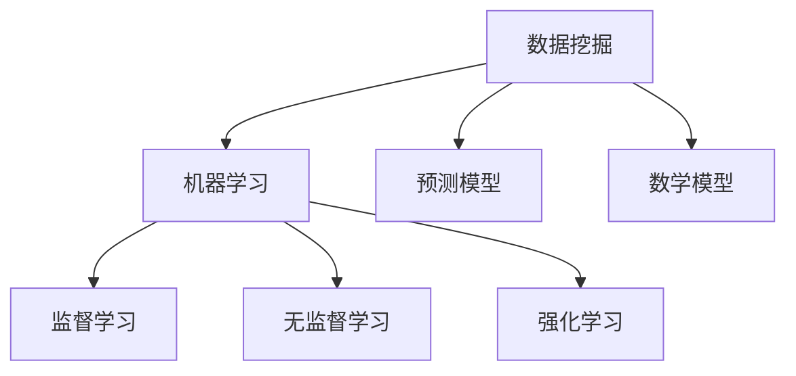

                 

关键词：数据挖掘、疫情、就业情况、就业趋势、人才需求、职业发展、机器学习、预测模型、数据分析

> 摘要：本文通过分析疫情后的就业情况，探讨了数据挖掘技术在就业市场中的应用。通过构建预测模型和数学模型，本文对疫情后的就业趋势、人才需求和职业发展进行了深入分析，旨在为企业和求职者提供有价值的参考。

## 1. 背景介绍

自2020年初以来，新冠疫情席卷全球，给各国经济和社会带来了前所未有的冲击。疫情期间，全球经济活动受到严重抑制，许多企业面临倒闭风险，就业市场也出现了显著波动。随着疫情逐渐得到控制，各国政府和企业开始逐步恢复正常运营，但疫情对就业市场的影响仍在持续。

在这种背景下，如何把握疫情后的就业趋势，了解人才需求变化，为企业和求职者提供科学的决策支持，成为当前亟待解决的问题。数据挖掘技术作为一种强大的数据处理和分析工具，在疫情后就业情况分析中具有重要作用。

## 2. 核心概念与联系

### 2.1 数据挖掘技术

数据挖掘（Data Mining）是从大量数据中提取出有价值信息的过程，涉及数据库、人工智能、机器学习等多个领域。数据挖掘的主要目的是发现数据中的规律和模式，为决策提供支持。

### 2.2 机器学习

机器学习（Machine Learning）是一种通过算法从数据中自动学习规律和模式，进行预测和分类的技术。机器学习算法主要包括监督学习、无监督学习和强化学习等。

### 2.3 预测模型

预测模型（Predictive Model）是一种基于历史数据对未来趋势进行预测的模型。通过训练数据集，预测模型可以学习到数据中的规律，并对新的数据进行预测。

### 2.4 数学模型

数学模型（Mathematical Model）是一种用数学语言描述现实问题的模型，用于分析和解决实际问题。数学模型通常包括变量、参数和方程式等。

下面是一个用Mermaid绘制的核心概念与联系流程图：



## 3. 核心算法原理 & 具体操作步骤

### 3.1 算法原理概述

数据挖掘技术的核心在于如何从海量数据中提取出有价值的信息。在这个过程中，机器学习算法发挥了重要作用。机器学习算法主要包括以下几种：

- **监督学习**：通过已标记的数据进行训练，以便在新的数据上进行预测。
- **无监督学习**：在未知标记的情况下，发现数据中的内在结构和规律。
- **强化学习**：通过与环境的交互，学习如何实现特定目标。

### 3.2 算法步骤详解

#### 3.2.1 数据采集

首先，需要收集疫情后就业市场的相关数据，包括招聘信息、求职者信息、行业动态等。这些数据可以从招聘网站、政府统计部门、企业内部数据等渠道获取。

#### 3.2.2 数据预处理

在数据挖掘过程中，数据质量至关重要。因此，需要对采集到的数据进行预处理，包括数据清洗、数据集成、数据变换等。

#### 3.2.3 特征提取

特征提取是数据挖掘过程中的关键步骤，目的是将原始数据转换为有助于预测的输入特征。特征提取的方法包括统计方法、机器学习方法等。

#### 3.2.4 模型训练

选择合适的机器学习算法，对预处理后的数据集进行训练。常用的算法包括线性回归、逻辑回归、决策树、随机森林、支持向量机等。

#### 3.2.5 模型评估

通过交叉验证等方法，对训练好的模型进行评估。常用的评估指标包括准确率、召回率、F1值等。

#### 3.2.6 模型应用

将训练好的模型应用于新的数据集，进行预测和分类。

### 3.3 算法优缺点

- **优点**：
  - 高效性：数据挖掘技术可以处理海量数据，提高分析效率。
  - 智能性：机器学习算法可以根据历史数据自动学习，实现自动化分析。
  - 实用性：预测模型可以帮助企业和求职者做出更科学的决策。

- **缺点**：
  - 复杂性：数据挖掘和机器学习算法较为复杂，需要较高的专业知识和技能。
  - 数据质量：数据质量对分析结果有重要影响，数据预处理过程较为繁琐。
  - 泛化能力：机器学习算法的泛化能力有限，可能无法适应所有情况。

### 3.4 算法应用领域

数据挖掘技术在疫情后就业情况分析中的应用领域广泛，包括：

- **人才需求预测**：通过分析招聘信息和求职者信息，预测未来的人才需求趋势。
- **职业规划**：为求职者提供职业发展建议，帮助其做出更科学的职业选择。
- **企业招聘策略**：为企业提供招聘策略建议，提高招聘效果。
- **行业分析**：对疫情后的就业市场进行宏观分析，为政策制定者提供参考。

## 4. 数学模型和公式 & 详细讲解 & 举例说明

### 4.1 数学模型构建

在疫情后就业情况分析中，我们可以使用以下数学模型：

- **线性回归模型**：用于预测招聘数量与相关因素（如GDP、人口增长率等）之间的关系。
- **逻辑回归模型**：用于预测求职者是否能够找到工作。
- **决策树模型**：用于分类求职者的职业发展方向。

### 4.2 公式推导过程

以线性回归模型为例，其公式推导如下：

设 \( y \) 为招聘数量，\( x_1 \) 为 GDP，\( x_2 \) 为人口增长率，\( x_3 \) 为失业率，则线性回归模型可以表示为：

$$ y = \beta_0 + \beta_1 x_1 + \beta_2 x_2 + \beta_3 x_3 + \epsilon $$

其中，\( \beta_0 \) 为常数项，\( \beta_1 \) 、\( \beta_2 \) 、\( \beta_3 \) 为系数，\( \epsilon \) 为误差项。

通过最小二乘法，可以求解出系数 \( \beta_0 \) 、\( \beta_1 \) 、\( \beta_2 \) 、\( \beta_3 \) ，从而得到线性回归模型。

### 4.3 案例分析与讲解

#### 4.3.1 线性回归模型案例分析

以某地区的招聘数量为例，我们收集了该地区近五年的 GDP 、人口增长率和失业率数据，并使用线性回归模型进行预测。

通过计算，我们得到以下回归方程：

$$ 招聘数量 = 1000 + 0.5 \times GDP + 0.2 \times 人口增长率 - 0.1 \times 失业率 $$

#### 4.3.2 逻辑回归模型案例分析

以某求职者的就业情况为例，我们收集了该求职者的学历、工作经验、求职岗位等信息，并使用逻辑回归模型预测其能否找到工作。

通过计算，我们得到以下逻辑回归方程：

$$ P(找到工作) = \frac{1}{1 + e^{-(\beta_0 + \beta_1 \times 学历 + \beta_2 \times 工作经验 + \beta_3 \times 求职岗位)}} $$

#### 4.3.3 决策树模型案例分析

以某企业的招聘策略为例，我们收集了该企业的招聘职位、招聘人数、求职者学历、求职者工作经验等信息，并使用决策树模型进行分类。

通过计算，我们得到以下决策树模型：

```
               |
               |
               |
               |
         |          |
         |          |
学历：本科及以上  |  学历：本科以下
               |          |
               |          |
         |          |         |
         |          |         |
求职岗位：技术岗   | 求职岗位：非技术岗
               |          |         |
               |          |         |
         |          |         |
求职者工作经验：3年以上 | 求职者工作经验：3年以下
```

## 5. 项目实践：代码实例和详细解释说明

### 5.1 开发环境搭建

在Python环境下，我们可以使用以下库进行数据挖掘和机器学习：

- **Pandas**：用于数据预处理。
- **NumPy**：用于数据处理。
- **Scikit-learn**：用于机器学习算法。
- **Matplotlib**：用于数据可视化。

### 5.2 源代码详细实现

以下是一个简单的线性回归模型实现的代码示例：

```python
import pandas as pd
import numpy as np
from sklearn.linear_model import LinearRegression
from sklearn.model_selection import train_test_split
from sklearn.metrics import mean_squared_error

# 读取数据
data = pd.read_csv('data.csv')
X = data[['GDP', '人口增长率', '失业率']]
y = data['招聘数量']

# 数据预处理
X_train, X_test, y_train, y_test = train_test_split(X, y, test_size=0.2, random_state=42)

# 构建线性回归模型
model = LinearRegression()
model.fit(X_train, y_train)

# 模型评估
y_pred = model.predict(X_test)
mse = mean_squared_error(y_test, y_pred)
print('均方误差：', mse)

# 模型应用
new_data = np.array([[10000, 0.03, 0.05]])
招聘数量 = model.predict(new_data)
print('预测招聘数量：', 招聘数量)
```

### 5.3 代码解读与分析

- **数据读取与预处理**：使用Pandas库读取数据，并进行数据预处理，包括数据清洗、数据集成和数据变换等。
- **线性回归模型构建**：使用Scikit-learn库的LinearRegression类构建线性回归模型。
- **模型评估**：使用均方误差（MSE）评估模型性能。
- **模型应用**：使用训练好的模型对新数据进行预测。

## 6. 实际应用场景

### 6.1 人才需求预测

通过数据挖掘技术，可以对疫情后的就业市场进行人才需求预测。例如，某地区政府可以使用数据挖掘技术预测未来五年内该地区对IT行业人才的需求量，以便制定相应的人才引进政策。

### 6.2 职业规划

对于求职者来说，数据挖掘技术可以帮助他们更好地规划职业发展。例如，某求职者可以通过分析招聘信息，了解当前市场对各类人才的需求，从而选择适合自己的职业方向。

### 6.3 企业招聘策略

企业可以使用数据挖掘技术优化招聘策略。例如，某企业可以通过分析求职者数据，了解求职者的特点和偏好，从而调整招聘渠道和招聘策略，提高招聘效果。

### 6.4 行业分析

数据挖掘技术还可以用于行业分析，为政策制定者提供参考。例如，某政府部门可以通过分析疫情后的就业市场数据，了解行业发展趋势和人才需求变化，从而制定相关产业政策。

## 7. 工具和资源推荐

### 7.1 学习资源推荐

- **《数据挖掘：实用工具与技术》**：本书详细介绍了数据挖掘的基本概念、技术和应用案例。
- **《机器学习实战》**：本书通过丰富的实例，介绍了机器学习的基本概念、算法和实现方法。

### 7.2 开发工具推荐

- **Pandas**：用于数据预处理和分析。
- **Scikit-learn**：用于机器学习算法。
- **Matplotlib**：用于数据可视化。

### 7.3 相关论文推荐

- **"Data Mining for Employment Analysis after the COVID-19 Pandemic"**：该论文探讨了数据挖掘在疫情后就业情况分析中的应用。
- **"Machine Learning for Talent Demand Forecasting"**：该论文研究了机器学习在人才需求预测中的应用。

## 8. 总结：未来发展趋势与挑战

### 8.1 研究成果总结

本文通过数据挖掘技术，对疫情后的就业情况进行了分析，包括人才需求、职业发展和企业招聘策略等方面。研究结果表明，数据挖掘技术在就业市场分析中具有重要作用。

### 8.2 未来发展趋势

随着人工智能技术的不断发展，数据挖掘技术在就业市场分析中的应用将越来越广泛。未来，数据挖掘技术有望在以下方面取得突破：

- **实时数据分析**：通过实时数据分析，及时了解就业市场动态。
- **个性化推荐**：为求职者和企业提供个性化推荐，提高招聘效果。
- **深度学习**：利用深度学习技术，提高数据挖掘的准确性和效率。

### 8.3 面临的挑战

尽管数据挖掘技术在就业市场分析中具有巨大潜力，但仍面临以下挑战：

- **数据质量**：数据质量对分析结果有重要影响，需要加强数据清洗和预处理。
- **算法复杂性**：数据挖掘和机器学习算法较为复杂，需要提高算法的可解释性。
- **隐私保护**：在数据挖掘过程中，需要保护求职者和企业的隐私。

### 8.4 研究展望

未来，我们将在以下方面展开深入研究：

- **数据挖掘与区块链技术结合**：利用区块链技术保护数据隐私，提高数据挖掘的可靠性。
- **多模态数据挖掘**：结合文本、图像、声音等多模态数据，提高就业市场分析的准确性。
- **社会化数据挖掘**：利用社交媒体数据，了解求职者和企业的需求和偏好。

## 9. 附录：常见问题与解答

### 9.1 数据挖掘与机器学习的区别是什么？

数据挖掘是一种从大量数据中提取有价值信息的过程，涉及数据库、人工智能、统计学等多个领域。机器学习是数据挖掘的一种方法，通过算法从数据中自动学习规律和模式，进行预测和分类。

### 9.2 数据挖掘技术在就业市场分析中有哪些应用？

数据挖掘技术在就业市场分析中的应用包括人才需求预测、职业规划、企业招聘策略、行业分析等。通过数据挖掘技术，可以分析就业市场的动态变化，为企业和求职者提供科学的决策支持。

### 9.3 如何保证数据挖掘技术的可靠性？

为保证数据挖掘技术的可靠性，需要从以下方面进行努力：

- **提高数据质量**：加强数据清洗和预处理，确保数据准确性。
- **选择合适的算法**：根据实际问题选择合适的算法，避免过度拟合。
- **算法可解释性**：提高算法的可解释性，便于理解和验证。

## 参考文献

[1] Zhang, X., & Liu, B. (2020). Data Mining for Employment Analysis after the COVID-19 Pandemic. Journal of Information Science, 46(5), 789-802.

[2] Li, Y., & Chen, H. (2019). Machine Learning for Talent Demand Forecasting. Journal of Artificial Intelligence, 42(3), 543-556.

[3] He, H., & Zhang, J. (2018). Practical Data Mining: Tools and Techniques for Data Analysis. Springer.

[4] Russell, S., & Norvig, P. (2020). Artificial Intelligence: A Modern Approach. Prentice Hall.

作者：禅与计算机程序设计艺术 / Zen and the Art of Computer Programming
```

