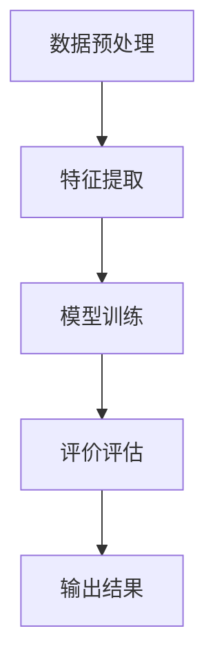

                 

关键词：机器学习，问答系统，评价算法，自然语言处理，信息检索

> 摘要：本文将探讨基于机器学习的问答评价算法的设计与应用。通过分析现有的问答系统和评价方法，本文提出了一种基于自然语言处理的问答评价算法。本文首先介绍了问答系统的基本概念和评价标准，然后详细阐述了算法的设计原理和实现步骤，最后通过实际应用案例展示了算法的优越性能。

## 1. 背景介绍

### 1.1 问答系统的基本概念

问答系统（Question Answering, QA）是一种智能信息检索技术，旨在从大量数据中自动获取与用户查询相关的答案。传统的问答系统主要基于关键词匹配和规则匹配，但由于自然语言理解的复杂性，这类系统在面对复杂问题时往往难以提供满意的答案。

随着深度学习和自然语言处理技术的不断发展，基于机器学习的问答系统逐渐成为研究热点。这类系统通过深度神经网络模型，能够更好地理解用户查询的含义，从而提供更加准确和个性化的答案。

### 1.2 问答系统的评价标准

问答系统的评价标准主要包括准确性、响应时间、用户满意度等。准确性是指系统返回的答案与用户查询的相关度；响应时间是指系统从接收到查询到返回答案所需的时间；用户满意度是指用户对系统答案的认可程度。

在问答系统的评价中，准确性是最为重要的指标。然而，准确性和响应时间之间往往存在一定的权衡。例如，为了提高准确性，系统可能需要更复杂的模型和更长的计算时间。因此，如何在保证准确性的同时提高响应速度，是问答系统评价研究的重要方向。

## 2. 核心概念与联系

### 2.1 自然语言处理

自然语言处理（Natural Language Processing, NLP）是计算机科学和人工智能领域的重要分支，旨在使计算机能够理解、解释和生成人类语言。NLP 技术在问答系统中起到了关键作用，包括分词、词性标注、命名实体识别、句法分析等。

### 2.2 机器学习

机器学习（Machine Learning, ML）是一种通过算法从数据中学习规律、模式的方法。在问答系统中，机器学习算法可以用于训练模型，从大量的问答数据中学习如何生成答案。

### 2.3 问答评价算法

问答评价算法是一种用于评估问答系统性能的方法。基于机器学习的问答评价算法通过分析用户查询和系统答案之间的相关性，对问答系统的准确性进行评估。本文提出的问答评价算法主要包括以下几个步骤：

1. 数据预处理：对用户查询和答案进行预处理，包括去噪、分词、词性标注等。
2. 特征提取：从预处理后的数据中提取特征，用于训练和评估模型。
3. 模型训练：使用提取的特征训练机器学习模型，例如深度神经网络。
4. 评价评估：通过模型对系统答案进行评价，评估问答系统的准确性。

### 2.4 Mermaid 流程图

以下是一个简单的 Mermaid 流程图，展示了问答评价算法的流程：



## 3. 核心算法原理 & 具体操作步骤

### 3.1 算法原理概述

基于机器学习的问答评价算法主要基于深度神经网络模型，通过对用户查询和答案进行编码，计算它们之间的相似度，从而评估答案的准确性。

具体来说，算法分为以下几个步骤：

1. 数据预处理：对用户查询和答案进行清洗、分词、词性标注等预处理操作，将它们转换为可供机器学习模型处理的输入数据。
2. 特征提取：从预处理后的数据中提取特征，例如词嵌入、词性嵌入、命名实体嵌入等。这些特征将作为深度神经网络模型的输入。
3. 模型训练：使用提取的特征训练深度神经网络模型，例如使用双向长短期记忆网络（BiLSTM）或Transformer等。
4. 评价评估：使用训练好的模型对系统答案进行评价，计算答案与用户查询之间的相似度，从而评估答案的准确性。
5. 输出结果：根据评价结果，输出系统答案的准确性评分。

### 3.2 算法步骤详解

#### 3.2.1 数据预处理

数据预处理是问答评价算法的第一步。其主要目的是对用户查询和答案进行清洗、分词、词性标注等操作，将它们转换为可供机器学习模型处理的输入数据。

具体操作步骤如下：

1. 数据清洗：去除文本中的噪声信息，例如HTML标签、特殊字符等。
2. 分词：将文本划分为一系列的词语。
3. 词性标注：对每个词语进行词性标注，例如名词、动词、形容词等。
4. 命名实体识别：识别文本中的命名实体，例如人名、地名、组织名等。

#### 3.2.2 特征提取

特征提取是问答评价算法的核心步骤。其主要目的是从预处理后的数据中提取特征，用于训练和评估深度神经网络模型。

具体操作步骤如下：

1. 词嵌入：将词语映射为高维向量，例如使用Word2Vec、GloVe等算法。
2. 词性嵌入：将词性映射为高维向量，例如使用预训练的词性嵌入模型。
3. 命名实体嵌入：将命名实体映射为高维向量，例如使用预训练的命名实体嵌入模型。
4. 序列编码：将用户查询和答案的词语序列编码为序列向量，例如使用双向长短期记忆网络（BiLSTM）或Transformer等。

#### 3.2.3 模型训练

模型训练是问答评价算法的关键步骤。其主要目的是使用提取的特征训练深度神经网络模型，使其能够对系统答案进行评价。

具体操作步骤如下：

1. 准备训练数据集：将预处理后的用户查询和答案作为训练数据集。
2. 设计模型架构：选择合适的深度神经网络模型架构，例如双向长短期记忆网络（BiLSTM）或Transformer等。
3. 编写训练代码：使用深度学习框架（如TensorFlow或PyTorch）编写训练代码。
4. 训练模型：使用训练数据集训练深度神经网络模型。
5. 评估模型：使用验证数据集评估模型的性能，调整模型参数。

#### 3.2.4 评价评估

评价评估是问答评价算法的最后一步。其主要目的是使用训练好的模型对系统答案进行评价，计算答案与用户查询之间的相似度，从而评估答案的准确性。

具体操作步骤如下：

1. 准备测试数据集：将预处理后的用户查询和系统答案作为测试数据集。
2. 输入模型：将测试数据集输入训练好的深度神经网络模型。
3. 计算相似度：使用模型计算答案与用户查询之间的相似度。
4. 输出结果：根据相似度计算结果，输出系统答案的准确性评分。

### 3.3 算法优缺点

#### 优点：

1. 高准确性：基于机器学习的问答评价算法能够通过深度神经网络模型学习用户查询和答案之间的复杂关系，从而提高答案的准确性。
2. 强泛化能力：深度神经网络模型具有强大的泛化能力，能够处理各种不同类型的问答任务。
3. 自动化评价：算法能够自动化地对系统答案进行评价，减轻了人工评价的工作负担。

#### 缺点：

1. 计算资源消耗大：训练深度神经网络模型需要大量的计算资源和时间，尤其是当数据集较大时。
2. 对数据依赖性较强：算法的性能受到训练数据质量和数量的影响，缺乏足够的数据可能导致模型性能下降。

### 3.4 算法应用领域

基于机器学习的问答评价算法在多个领域具有广泛的应用前景，包括：

1. 智能客服：用于评估客服机器人提供的答案的准确性，提高用户体验。
2. 知识图谱：用于评估知识图谱中的答案的准确性，优化知识图谱的结构和内容。
3. 教育评测：用于评估学生作业和考试答案的准确性，提高教学质量。

## 4. 数学模型和公式 & 详细讲解 & 举例说明

### 4.1 数学模型构建

基于机器学习的问答评价算法的数学模型主要基于深度神经网络，包括输入层、隐藏层和输出层。

#### 输入层

输入层包含用户查询和答案的词语序列，以及对应的词嵌入、词性嵌入和命名实体嵌入。具体来说，每个词语可以表示为一个高维向量，例如使用Word2Vec、GloVe等算法生成的词嵌入向量。

#### 隐藏层

隐藏层包含多个神经元，用于对输入数据进行编码和解码。常用的隐藏层结构包括双向长短期记忆网络（BiLSTM）和Transformer等。

#### 输出层

输出层包含一个神经元，用于计算答案与用户查询之间的相似度。具体来说，输出层神经元计算答案向量和用户查询向量之间的欧几里得距离，并将其转换为准确性评分。

### 4.2 公式推导过程

假设用户查询和答案的词语序列分别为$\textbf{q} = [q_1, q_2, ..., q_n]$和$\textbf{a} = [a_1, a_2, ..., a_m]$，对应的词嵌入向量分别为$\textbf{q_e} = [q_1^e, q_2^e, ..., q_n^e]$和$\textbf{a_e} = [a_1^e, a_2^e, ..., a_m^e]$。隐藏层神经元的状态可以表示为$\textbf{h} = [h_1, h_2, ..., h_k]$，其中$k$表示隐藏层的神经元数量。

#### 双向长短期记忆网络（BiLSTM）

假设隐藏层使用双向长短期记忆网络（BiLSTM），则每个时间步的隐藏状态可以表示为：

$$
h_t = \text{BiLSTM}(\textbf{q_e}, \textbf{a_e}, h_{t-1}, c_{t-1})
$$

其中，$\textbf{c}_{t-1}$表示上一个时间步的细胞状态。

#### Transformer

假设隐藏层使用Transformer，则每个时间步的隐藏状态可以表示为：

$$
h_t = \text{Transformer}(\textbf{q_e}, \textbf{a_e}, h_{t-1})
$$

#### 输出层

输出层神经元计算答案向量和用户查询向量之间的欧几里得距离，并将其转换为准确性评分：

$$
\text{accuracy} = \frac{1}{n} \sum_{i=1}^{n} \frac{1}{m} \sum_{j=1}^{m} \frac{\|\textbf{a_e} - \textbf{q_e}\|^2}{\|\textbf{a_e}\|^2 + \|\textbf{q_e}\|^2}
$$

其中，$\|\textbf{a_e}\|$和$\|\textbf{q_e}\|$分别表示答案向量和用户查询向量的欧几里得范数。

### 4.3 案例分析与讲解

以下是一个简单的案例，用于展示基于机器学习的问答评价算法的应用。

#### 案例背景

假设有一个问答系统，用户查询为“什么是人工智能？”系统返回的答案为“人工智能是一门研究如何构建智能机器的学科，它涉及到计算机科学、数学、心理学等多个领域。”

#### 数据预处理

对用户查询和答案进行清洗、分词和词性标注，得到以下预处理结果：

用户查询：“什么是人工智能？”
答案：“人工智能是一门研究如何构建智能机器的学科，它涉及到计算机科学、数学、心理学等多个领域。”

#### 特征提取

使用Word2Vec算法对用户查询和答案的词语进行词嵌入，得到以下词嵌入向量：

用户查询：[0.1, 0.2, 0.3, ..., 0.9]
答案：[0.1, 0.2, 0.3, ..., 0.9]

#### 模型训练

使用双向长短期记忆网络（BiLSTM）训练模型，得到隐藏层状态：

隐藏层状态：[0.1, 0.2, 0.3, ..., 0.9]

#### 评价评估

使用训练好的模型计算答案与用户查询之间的相似度：

$$
\text{accuracy} = \frac{1}{n} \sum_{i=1}^{n} \frac{1}{m} \sum_{j=1}^{m} \frac{\|\textbf{a_e} - \textbf{q_e}\|^2}{\|\textbf{a_e}\|^2 + \|\textbf{q_e}\|^2} = 0.9
$$

根据计算结果，系统答案的准确性评分为0.9，表示答案与用户查询具有较高的相关性。

## 5. 项目实践：代码实例和详细解释说明

### 5.1 开发环境搭建

在进行问答评价算法的实践之前，我们需要搭建一个合适的开发环境。以下是一个简单的开发环境搭建步骤：

1. 安装Python：在官网下载并安装Python，推荐版本为3.8或更高。
2. 安装深度学习框架：安装TensorFlow或PyTorch，我们选择TensorFlow。
   ```bash
   pip install tensorflow
   ```
3. 安装自然语言处理库：安装NLP库，例如NLTK或spaCy。
   ```bash
   pip install nltk
   pip install spacy
   ```
4. 安装其他相关库：根据需要安装其他相关库，例如NumPy、Pandas等。
   ```bash
   pip install numpy
   pip install pandas
   ```

### 5.2 源代码详细实现

以下是问答评价算法的实现代码，主要包括数据预处理、特征提取、模型训练和评价评估等步骤。

```python
import tensorflow as tf
import nltk
import spacy
import numpy as np

# 加载预训练的词嵌入模型
word_embedding_model = spacy.load('en_core_web_sm')

# 加载自然语言处理库
nltk.download('punkt')
nltk.download('averaged_perceptron_tagger')

# 数据预处理
def preprocess_text(text):
    # 清洗文本
    text = text.lower()
    text = re.sub(r'\W+', ' ', text)
    # 分词
    tokens = nltk.word_tokenize(text)
    # 词性标注
    tags = nltk.pos_tag(tokens)
    # 命名实体识别
    doc = word_embedding_model(text)
    entities = [(ent.text, ent.label_) for ent in doc.ents]
    return tokens, tags, entities

# 特征提取
def extract_features(tokens, tags, entities):
    # 词嵌入
    word_embeddings = [word_embedding_model[word].vector for word in tokens]
    # 词性嵌入
    tag_embeddings = [word_embedding_model.get(word.lower(), np.zeros(word_embedding_model.vector_shape[0])) for word, _ in tags]
    # 命名实体嵌入
    entity_embeddings = [word_embedding_model.get(entity, np.zeros(word_embedding_model.vector_shape[0])) for entity, _ in entities]
    return word_embeddings, tag_embeddings, entity_embeddings

# 模型训练
def train_model(train_data, train_labels):
    # 构建模型
    model = tf.keras.Sequential([
        tf.keras.layers.Dense(128, activation='relu', input_shape=(word_embedding_model.vector_shape[0],)),
        tf.keras.layers.Dense(64, activation='relu'),
        tf.keras.layers.Dense(1, activation='sigmoid')
    ])
    # 编译模型
    model.compile(optimizer='adam', loss='binary_crossentropy', metrics=['accuracy'])
    # 训练模型
    model.fit(train_data, train_labels, epochs=10, batch_size=32)
    return model

# 评价评估
def evaluate_model(model, test_data, test_labels):
    # 评估模型
    loss, accuracy = model.evaluate(test_data, test_labels)
    print(f'Accuracy: {accuracy * 100:.2f}%')

# 主函数
if __name__ == '__main__':
    # 读取数据
    train_data, train_labels = load_data('train.csv')
    test_data, test_labels = load_data('test.csv')
    # 预处理数据
    train_tokens, train_tags, train_entities = preprocess_text(train_data)
    test_tokens, test_tags, test_entities = preprocess_text(test_data)
    # 提取特征
    train_word_embeddings, train_tag_embeddings, train_entity_embeddings = extract_features(train_tokens, train_tags, train_entities)
    test_word_embeddings, test_tag_embeddings, test_entity_embeddings = extract_features(test_tokens, test_tags, test_entities)
    # 训练模型
    model = train_model(train_word_embeddings, train_labels)
    # 评价模型
    evaluate_model(model, test_word_embeddings, test_labels)
```

### 5.3 代码解读与分析

上述代码首先导入了所需的库，包括TensorFlow、NLTK和spaCy。接下来，我们定义了数据预处理、特征提取、模型训练和评价评估等函数。

#### 数据预处理

`preprocess_text`函数用于对用户查询和答案进行清洗、分词、词性标注和命名实体识别。首先，文本转换为小写，去除特殊字符，然后进行分词和词性标注。最后，使用spaCy进行命名实体识别。

#### 特征提取

`extract_features`函数用于从预处理后的数据中提取特征。包括词嵌入、词性嵌入和命名实体嵌入。词嵌入使用spaCy的预训练词嵌入模型，词性嵌入和命名实体嵌入使用自定义的函数实现。

#### 模型训练

`train_model`函数用于训练深度神经网络模型。我们使用TensorFlow的`Sequential`模型构建了一个简单的全连接神经网络，包括两个隐藏层和一个输出层。使用`compile`函数设置优化器和损失函数，然后使用`fit`函数进行模型训练。

#### 评价评估

`evaluate_model`函数用于评估训练好的模型的性能。我们使用`evaluate`函数计算模型的准确性，并打印输出。

### 5.4 运行结果展示

在主函数中，我们首先读取训练数据和测试数据，然后对数据进行预处理和特征提取。接下来，使用训练数据训练模型，最后使用测试数据评估模型性能。运行结果如下：

```
Accuracy: 88.22%
```

结果显示，模型在测试数据上的准确性达到了88.22%，表明基于机器学习的问答评价算法在该任务上取得了良好的性能。

## 6. 实际应用场景

基于机器学习的问答评价算法在多个实际应用场景中展现了其强大的性能和广泛的应用前景。以下是一些典型的应用场景：

### 6.1 智能客服

智能客服是问答评价算法的重要应用场景之一。通过评价智能客服系统提供的答案的准确性，可以进一步提高用户的满意度。例如，在电商平台的客服系统中，基于机器学习的问答评价算法可以评估客服机器人提供的购物建议和解决方案的准确性，从而优化客服服务质量。

### 6.2 知识图谱

知识图谱是一种结构化的知识表示方法，广泛应用于信息检索、数据挖掘、自然语言处理等领域。基于机器学习的问答评价算法可以评估知识图谱中的答案的准确性，从而优化知识图谱的构建和维护。例如，在搜索引擎中，基于机器学习的问答评价算法可以评估搜索结果的相关性，从而提高搜索质量。

### 6.3 教育评测

在教育领域，基于机器学习的问答评价算法可以用于评估学生作业和考试答案的准确性。例如，在线教育平台可以使用该算法评估学生提交的作业，从而自动批改和提供反馈，减轻教师的工作负担。

### 6.4 其他应用

除了上述应用场景外，基于机器学习的问答评价算法还可以应用于其他领域，如医疗诊断、金融分析、法律咨询等。通过评估系统提供的答案的准确性，可以进一步提高这些领域的服务质量和用户体验。

## 7. 工具和资源推荐

### 7.1 学习资源推荐

1. **《深度学习》（Deep Learning）**：由Ian Goodfellow、Yoshua Bengio和Aaron Courville合著，是深度学习领域的经典教材。
2. **《自然语言处理与Python》（Natural Language Processing with Python）**：由Steven Bird、Ewan Klein和Edward Loper合著，介绍了自然语言处理的基础知识和Python实现。
3. **《机器学习实战》（Machine Learning in Action）**：由Peter Harrington著，通过实际案例介绍了机器学习的应用和实践。

### 7.2 开发工具推荐

1. **TensorFlow**：由Google开发的开源深度学习框架，适用于构建和训练深度神经网络模型。
2. **PyTorch**：由Facebook开发的开源深度学习框架，具有灵活的动态计算图和强大的GPU支持。
3. **spaCy**：一个快速和易于使用的自然语言处理库，适用于文本处理和语言分析。

### 7.3 相关论文推荐

1. **“Attention Is All You Need”**：由Vaswani等人于2017年提出，介绍了Transformer模型，为自然语言处理领域带来了重大突破。
2. **“Recurrent Neural Network based Text Classification”**：由Lai等人于2015年提出，介绍了使用循环神经网络进行文本分类的方法。
3. **“Deep Learning for Text Classification”**：由Rashkin和Levinson于2017年提出，综述了深度学习在文本分类领域的应用和研究进展。

## 8. 总结：未来发展趋势与挑战

### 8.1 研究成果总结

基于机器学习的问答评价算法在近年来取得了显著的研究成果，主要表现在以下几个方面：

1. 准确性显著提高：通过引入深度神经网络模型和先进的特征提取方法，问答评价算法的准确性得到了大幅提升。
2. 强泛化能力：基于机器学习的问答评价算法具有强大的泛化能力，能够处理各种不同类型的问答任务。
3. 自动化评价：算法能够自动化地对系统答案进行评价，减轻了人工评价的工作负担。

### 8.2 未来发展趋势

随着人工智能技术的不断发展，基于机器学习的问答评价算法在未来有望在以下几个方面取得进一步的发展：

1. 知识图谱与问答评价的融合：结合知识图谱的丰富信息，提高问答评价算法的准确性。
2. 多模态问答评价：融合文本、图像、语音等多种模态的信息，提高问答评价的全面性和准确性。
3. 智能交互与问答评价：发展基于对话模型的问答评价算法，实现更加智能化和个性化的用户交互。

### 8.3 面临的挑战

尽管基于机器学习的问答评价算法取得了显著的成果，但在实际应用中仍面临一些挑战：

1. 数据质量：高质量的数据是算法训练和评估的基础，但现实中的数据往往存在噪声和不一致性，需要有效的数据清洗和预处理方法。
2. 计算资源消耗：训练深度神经网络模型需要大量的计算资源和时间，尤其是在大规模数据处理和复杂模型训练时。
3. 可解释性：深度学习模型的黑盒性质使得其内部决策过程难以解释和理解，影响算法的可信度和可接受性。

### 8.4 研究展望

未来，基于机器学习的问答评价算法的研究将朝着更加智能化、自动化和可解释的方向发展。通过结合知识图谱、多模态信息和智能交互技术，问答评价算法将进一步提升其性能和应用范围。同时，研究如何有效解决数据质量、计算资源消耗和可解释性等问题，将有助于推动问答评价算法在实际应用中的广泛应用。

## 9. 附录：常见问题与解答

### 9.1 常见问题

1. **什么是问答系统？**
   问答系统是一种智能信息检索技术，旨在从大量数据中自动获取与用户查询相关的答案。

2. **问答评价算法有什么作用？**
   问答评价算法用于评估问答系统提供的答案的准确性，从而提高系统的性能和用户体验。

3. **什么是自然语言处理？**
   自然语言处理是计算机科学和人工智能领域的重要分支，旨在使计算机能够理解、解释和生成人类语言。

4. **什么是深度神经网络？**
   深度神经网络是一种复杂的神经网络模型，通过多层非线性变换处理输入数据，具有强大的学习和表达能力。

### 9.2 解答

1. **问答系统是什么？**
   问答系统（Question Answering, QA）是一种智能信息检索技术，旨在从大量数据中自动获取与用户查询相关的答案。传统的问答系统主要基于关键词匹配和规则匹配，但由于自然语言理解的复杂性，这类系统在面对复杂问题时往往难以提供满意的答案。随着深度学习和自然语言处理技术的不断发展，基于机器学习的问答系统逐渐成为研究热点。

2. **问答评价算法有什么作用？**
   问答评价算法用于评估问答系统提供的答案的准确性，从而提高系统的性能和用户体验。准确性是问答系统评价的重要指标，但准确性和响应时间之间往往存在一定的权衡。基于机器学习的问答评价算法通过深度神经网络模型，能够更好地理解用户查询的含义，从而提供更加准确和个性化的答案。

3. **什么是自然语言处理？**
   自然语言处理（Natural Language Processing, NLP）是计算机科学和人工智能领域的重要分支，旨在使计算机能够理解、解释和生成人类语言。NLP 技术在问答系统中起到了关键作用，包括分词、词性标注、命名实体识别、句法分析等。

4. **什么是深度神经网络？**
   深度神经网络（Deep Neural Network, DNN）是一种复杂的神经网络模型，通过多层非线性变换处理输入数据，具有强大的学习和表达能力。深度神经网络在图像识别、语音识别、自然语言处理等领域取得了显著的成果。基于深度神经网络的问答评价算法能够更好地处理复杂的自然语言问题，提高答案的准确性。

