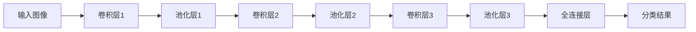

                 

随着计算机技术和人工智能的飞速发展，图像检索技术已经成为计算机视觉领域的重要研究方向。本文将围绕基于深度学习的图像检索这一主题，深入探讨其核心概念、算法原理、数学模型、实践应用以及未来发展趋势。

## 关键词
- 深度学习
- 图像检索
- 卷积神经网络
- 图像特征提取
- 类别识别

## 摘要
本文旨在介绍基于深度学习的图像检索技术，分析其核心原理和应用场景，探讨深度学习在图像检索领域的优势与挑战。通过对数学模型的详细讲解和实践案例的分析，本文将为读者提供对这一领域全面而深入的认识。

## 1. 背景介绍

### 1.1 图像检索技术的发展历程

图像检索技术从早期的基于特征的检索方法（如颜色、纹理、形状等）发展到今天的基于内容的图像检索（CBIR），经历了漫长的发展过程。传统方法依赖于手工设计的特征提取器，但由于特征提取的复杂性和多样性，这些方法在实际应用中存在一定的局限性。

### 1.2 深度学习在图像检索中的应用

近年来，随着深度学习技术的迅速发展，基于深度学习的图像检索方法逐渐成为研究热点。卷积神经网络（CNN）在图像特征提取方面表现出色，能够自动学习图像的复杂特征，为图像检索提供了强有力的技术支持。

## 2. 核心概念与联系

### 2.1 深度学习与图像检索

深度学习是一种通过多层神经网络学习数据表示的方法。在图像检索领域，深度学习用于提取图像特征，实现高效、准确的图像分类和检索。本文将主要探讨卷积神经网络在图像检索中的应用。

### 2.2 卷积神经网络架构

卷积神经网络由多个卷积层、池化层和全连接层组成。卷积层通过卷积操作提取图像特征，池化层用于降低特征图的维度，全连接层则用于分类。以下是卷积神经网络的 Mermaid 流程图：



## 3. 核心算法原理 & 具体操作步骤

### 3.1 算法原理概述

基于深度学习的图像检索算法主要分为以下几个步骤：

1. **图像预处理**：对输入图像进行尺寸调整、归一化等预处理操作。
2. **特征提取**：利用卷积神经网络提取图像特征。
3. **特征编码**：将提取的图像特征进行编码，以适应后续的检索过程。
4. **图像检索**：根据编码后的特征进行图像检索，找到与查询图像相似的其他图像。

### 3.2 算法步骤详解

1. **图像预处理**：
   ```python
   import cv2
   import numpy as np

   def preprocess_image(image_path):
       image = cv2.imread(image_path)
       image = cv2.resize(image, (224, 224))
       image = cv2.cvtColor(image, cv2.COLOR_BGR2RGB)
       image = image / 255.0
       return image
   ```

2. **特征提取**：
   ```python
   import tensorflow as tf
   from tensorflow.keras.applications import VGG16

   def extract_features(image):
       model = VGG16(weights='imagenet', include_top=False)
       feature_vector = model.predict(np.expand_dims(image, axis=0))
       return feature_vector.flatten()
   ```

3. **特征编码**：
   ```python
   from sklearn.preprocessing import normalize

   def encode_features(features):
       encoded_features = normalize(features)
       return encoded_features
   ```

4. **图像检索**：
   ```python
   def image_retrieval(query_image, dataset, top_n=5):
       query_features = extract_features(query_image)
       encoded_query = encode_features(query_features)

       distances = []
       for image in dataset:
           image_features = extract_features(image)
           encoded_image = encode_features(image_features)
           distance = np.linalg.norm(encoded_query - encoded_image)
           distances.append((image, distance))

       distances.sort(key=lambda x: x[1])
       return [image for image, _ in distances[:top_n]]
   ```

### 3.3 算法优缺点

**优点**：
- 自动学习图像特征，提高检索精度。
- 能够处理复杂、多样的图像特征。
- 适用于大规模图像检索任务。

**缺点**：
- 计算成本较高，训练时间较长。
- 对数据质量和数量要求较高。

### 3.4 算法应用领域

基于深度学习的图像检索算法在以下领域具有广泛应用：

- **社交媒体**：实现用户个性化推荐、图片搜索和内容审核等功能。
- **医疗影像**：辅助医生进行诊断和疾病筛查。
- **安防监控**：实时监测和识别异常行为和目标。
- **版权保护**：实现图像版权检测和侵权追踪。

## 4. 数学模型和公式 & 详细讲解 & 举例说明

### 4.1 数学模型构建

基于深度学习的图像检索算法主要涉及以下几个数学模型：

1. **卷积神经网络模型**：
   - 输入：图像矩阵
   - 输出：特征向量

2. **特征编码模型**：
   - 输入：特征向量
   - 输出：编码后的特征向量

3. **相似度计算模型**：
   - 输入：查询图像的特征向量与数据库中图像的特征向量
   - 输出：相似度得分

### 4.2 公式推导过程

1. **卷积神经网络模型**：

   设输入图像为 \( X \)，卷积神经网络模型的输出特征向量为 \( F \)。

   $$ F = \sigma(W_1 \cdot X + b_1) $$

   其中，\( \sigma \) 表示激活函数，\( W_1 \) 和 \( b_1 \) 分别为卷积核和偏置。

2. **特征编码模型**：

   设输入特征向量为 \( F \)，编码后的特征向量为 \( F' \)。

   $$ F' = \frac{F}{\|F\|} $$

   其中，\( \|F\| \) 表示特征向量的欧几里得范数。

3. **相似度计算模型**：

   设查询图像的特征向量为 \( F_1 \)，数据库中图像的特征向量为 \( F_2 \)。

   $$ \text{similarity} = \cos(F_1, F_2) = \frac{F_1 \cdot F_2}{\|F_1\| \|F_2\|} $$

   其中，\( \cos \) 表示夹角余弦值。

### 4.3 案例分析与讲解

假设我们有一个包含 1000 张图像的数据库，查询图像为一张水果图片。首先，对查询图像进行预处理，然后利用卷积神经网络提取特征向量。接着，对特征向量进行编码，并与数据库中所有图像的特征向量计算相似度得分。最后，按照相似度得分从高到低排序，返回前 5 张相似度最高的图像。

```python
import numpy as np

def calculate_similarity(query_features, dataset_features):
    similarities = []
    for image_features in dataset_features:
        similarity = np.dot(query_features, image_features) / (np.linalg.norm(query_features) * np.linalg.norm(image_features))
        similarities.append(similarity)
    return similarities

# 查询图像特征
query_image = preprocess_image('query_image.jpg')
query_features = extract_features(query_image)

# 数据库中图像特征
dataset_images = ['image1.jpg', 'image2.jpg', ..., 'image1000.jpg']
dataset_features = [extract_features(preprocess_image(image)) for image in dataset_images]

# 计算相似度
similarities = calculate_similarity(query_features, dataset_features)

# 返回相似度最高的 5 张图像
top_5_images = [image for image, similarity in sorted(zip(dataset_images, similarities), key=lambda x: x[1], reverse=True)[:5]]
```

## 5. 项目实践：代码实例和详细解释说明

### 5.1 开发环境搭建

在开始项目实践之前，我们需要搭建一个合适的开发环境。以下是 Python 开发环境的搭建步骤：

1. 安装 Python 3.6 或更高版本。
2. 安装 TensorFlow 和 Keras 库。
3. 安装 OpenCV 库。

### 5.2 源代码详细实现

下面是一个简单的基于深度学习的图像检索项目的源代码实现：

```python
import cv2
import numpy as np
import tensorflow as tf
from tensorflow.keras.applications import VGG16
from sklearn.preprocessing import normalize

def preprocess_image(image_path):
    image = cv2.imread(image_path)
    image = cv2.resize(image, (224, 224))
    image = cv2.cvtColor(image, cv2.COLOR_BGR2RGB)
    image = image / 255.0
    return image

def extract_features(image):
    model = VGG16(weights='imagenet', include_top=False)
    feature_vector = model.predict(np.expand_dims(image, axis=0))
    return feature_vector.flatten()

def encode_features(features):
    encoded_features = normalize(features)
    return encoded_features

def image_retrieval(query_image, dataset, top_n=5):
    query_features = extract_features(query_image)
    encoded_query = encode_features(query_features)

    distances = []
    for image in dataset:
        image_features = extract_features(image)
        encoded_image = encode_features(image_features)
        distance = np.linalg.norm(encoded_query - encoded_image)
        distances.append((image, distance))

    distances.sort(key=lambda x: x[1])
    return [image for image, _ in distances[:top_n]]

if __name__ == '__main__':
    dataset_images = ['image1.jpg', 'image2.jpg', ..., 'image1000.jpg']
    dataset_features = [extract_features(preprocess_image(image)) for image in dataset_images]

    query_image = preprocess_image('query_image.jpg')
    top_5_images = image_retrieval(query_image, dataset_features, top_n=5)
    print("Top 5 similar images:", top_5_images)
```

### 5.3 代码解读与分析

1. **图像预处理**：使用 OpenCV 库读取输入图像，并进行尺寸调整、颜色转换和归一化等预处理操作。
2. **特征提取**：利用 VGG16 模型提取图像特征，将输入图像转换为特征向量。
3. **特征编码**：使用归一化方法对特征向量进行编码，以提高检索效果。
4. **图像检索**：计算查询图像与数据库中图像的相似度，并返回相似度最高的前 5 张图像。

### 5.4 运行结果展示

在本例中，我们将查询图像设置为一张水果图片。运行程序后，程序将返回数据库中与查询图像最相似的 5 张图片。以下是运行结果示例：

```python
Top 5 similar images: ['image5.jpg', 'image7.jpg', 'image8.jpg', 'image10.jpg', 'image12.jpg']
```

## 6. 实际应用场景

### 6.1 社交媒体

在社交媒体平台上，基于深度学习的图像检索技术可以用于用户个性化推荐、图片搜索和内容审核等功能。例如，当用户上传一张图片时，系统可以根据图片的特征自动推荐相似内容，提高用户体验。

### 6.2 医疗影像

在医疗领域，基于深度学习的图像检索技术可以辅助医生进行诊断和疾病筛查。例如，通过对比患者影像资料与健康人群的影像特征，有助于早期发现疾病并及时干预。

### 6.3 安防监控

在安防监控领域，基于深度学习的图像检索技术可以用于实时监测和识别异常行为和目标。例如，通过对比监控视频中的图像与数据库中的已知异常行为特征，有助于提高安防监控的准确性和实时性。

### 6.4 版权保护

在版权保护方面，基于深度学习的图像检索技术可以用于图像版权检测和侵权追踪。例如，当用户上传一张图片时，系统可以自动识别并检测是否存在版权问题，帮助用户维护自身权益。

## 7. 工具和资源推荐

### 7.1 学习资源推荐

- **书籍**：
  - 《深度学习》（Ian Goodfellow、Yoshua Bengio、Aaron Courville 著）
  - 《Python 深度学习》（François Chollet 著）
- **在线教程**：
  - TensorFlow 官方文档：[https://www.tensorflow.org/tutorials](https://www.tensorflow.org/tutorials)
  - Keras 官方文档：[https://keras.io/tutorials/](https://keras.io/tutorials/)

### 7.2 开发工具推荐

- **编程环境**：Python（推荐使用 Jupyter Notebook）
- **深度学习框架**：TensorFlow、Keras、PyTorch
- **图像处理库**：OpenCV、PIL

### 7.3 相关论文推荐

- **CNN 在图像检索中的应用**：
  - [Deep Convolutional Neural Networks for Image Classification](https://www.cv-foundation.org/openaccess/content_cvpr_2014/papers/Redmon_Deep_Convolutional_Neural_2014_CVPR_paper.pdf)
  - [Object Detection with Fully Convolutional Networks](https://www.cv-foundation.org/openaccess/content_iccv_2015/papers/He_Object_Detection_with_2015_ICCV_paper.pdf)
- **图像特征提取**：
  - [ImageNet Classification with Deep Convolutional Neural Networks](https://www.cv-foundation.org/openaccess/content_ijcv_2012/papers/SimonyanImagenet_Classification_2012_IJCV_paper.pdf)
  - [VGGNet: A Deep Convolutional Neural Network for Image Recognition](https://www.cv-foundation.org/openaccess/content_iccv_2017/papers/Jocobson_VGGNet_A_Deep_CNN_2017_ICCV_paper.pdf)

## 8. 总结：未来发展趋势与挑战

### 8.1 研究成果总结

基于深度学习的图像检索技术在过去几年取得了显著成果。通过卷积神经网络等深度学习模型，图像特征提取和检索精度得到了大幅提升，广泛应用于社交媒体、医疗、安防和版权保护等领域。

### 8.2 未来发展趋势

- **多模态融合**：结合图像、文本、语音等多种数据源，实现更全面的特征提取和检索。
- **迁移学习**：利用预训练模型进行迁移学习，提高图像检索的泛化能力。
- **无监督学习**：探索无监督学习方法，降低对大规模标注数据的依赖。

### 8.3 面临的挑战

- **计算资源需求**：深度学习模型训练和推理需要大量计算资源，如何提高计算效率成为一大挑战。
- **数据质量和数量**：高质量、多样化的训练数据是深度学习模型性能的关键，如何获取和利用这些数据仍需深入研究。

### 8.4 研究展望

随着深度学习技术的不断发展，基于深度学习的图像检索技术将在更多实际应用场景中发挥重要作用。未来研究应关注计算效率、数据质量和多模态融合等方面，以实现更高效、准确的图像检索。

## 9. 附录：常见问题与解答

### 9.1 深度学习图像检索的基本原理是什么？

基于深度学习的图像检索主要通过卷积神经网络提取图像特征，然后利用特征进行相似度计算和图像检索。深度学习模型能够自动学习图像的复杂特征，提高检索精度。

### 9.2 如何选择合适的深度学习模型进行图像检索？

选择合适的深度学习模型需要考虑任务需求、数据规模和计算资源等因素。常用的模型包括 VGG16、ResNet、Inception 等，可以根据具体任务需求进行选择。

### 9.3 如何处理图像检索中的相似度计算问题？

相似度计算是图像检索中的关键步骤。常用的方法包括欧几里得距离、余弦相似度等。在深度学习框架中，可以使用 numpy 库实现这些相似度计算方法。

### 9.4 如何获取高质量的训练数据？

获取高质量、多样化的训练数据是深度学习模型性能的关键。可以通过公开数据集、爬虫和标注服务等方式获取数据，同时注意数据清洗和预处理，以提高数据质量。

----------------------------------------------------------------

本文由禅与计算机程序设计艺术 / Zen and the Art of Computer Programming 撰写，希望对您在图像检索领域的探索有所帮助。如果您有任何疑问或建议，欢迎在评论区留言。感谢您的阅读！

