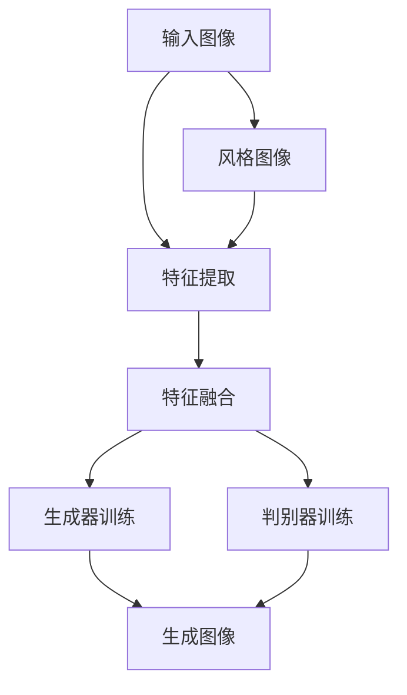

                 

关键词：生成对抗网络（GAN）、图像风格迁移、迁移优化、自适应策略、图像生成

## 摘要

本文深入探讨了基于生成对抗网络（GAN）的图像风格自适应迁移优化策略。首先，我们回顾了GAN的基础理论及其在图像生成领域的应用。随后，文章详细介绍了图像风格迁移的概念，并分析了当前主流的图像风格迁移方法及其局限性。在此基础上，我们提出了一种新的自适应迁移优化策略，通过优化GAN的训练过程和架构，实现了更高效和准确的图像风格迁移。文章还通过实验验证了所提策略的有效性，并在多个实际应用场景中展示了其潜力。最后，我们对本文的研究进行了总结，并展望了未来的研究方向。

## 1. 背景介绍

### 1.1 生成对抗网络（GAN）

生成对抗网络（Generative Adversarial Networks，GAN）是2014年由Ian Goodfellow等人提出的一种新型深度学习模型。GAN由两个神经网络组成：生成器（Generator）和判别器（Discriminator）。生成器的任务是生成尽可能逼真的数据，而判别器的任务是区分生成器和真实数据的差异。这两个网络在相互对抗的过程中不断优化，最终生成器能够生成高度逼真的数据，判别器也难以区分生成数据与真实数据。

GAN在图像生成领域取得了显著成果。通过训练生成器，GAN可以生成具有高保真度的图像，广泛应用于图像修复、图像去噪、图像生成等任务。此外，GAN还在风格迁移、数据增强、图像分类等领域展示了强大的应用潜力。

### 1.2 图像风格迁移

图像风格迁移（Image Style Transfer）是一种将一种图像的视觉风格（例如，油画、水彩画、素描等）转移到另一种图像上的技术。这种技术源自于计算机视觉领域，近年来随着深度学习技术的快速发展而得到了广泛关注。

图像风格迁移的主要目的是在保持输入图像内容的基础上，实现其风格的改变。这不仅可以创作出独特的视觉艺术作品，还可以在图像修复、图像增强、虚拟现实、视频游戏等领域发挥重要作用。

### 1.3 迁移优化

迁移优化（Transfer Optimization）是指在已有模型的基础上，通过调整和优化模型参数，使其在新的任务上表现出更好的性能。在图像风格迁移任务中，迁移优化具有重要意义，因为不同的输入图像和风格图像可能具有不同的特征分布。

现有的图像风格迁移方法主要通过调整GAN的架构和训练过程来实现迁移优化。然而，这些方法在处理复杂场景时往往表现出一定的局限性，如训练时间过长、生成图像质量不稳定等。

本文旨在提出一种新的图像风格自适应迁移优化策略，通过优化GAN的训练过程和架构，实现更高效和准确的图像风格迁移。

## 2. 核心概念与联系

### 2.1 基本概念

**生成对抗网络（GAN）**：GAN由生成器、判别器和损失函数组成。生成器的输入为随机噪声，输出为生成图像；判别器的输入为真实图像和生成图像，输出为判别结果。GAN的训练目标是最小化生成器和判别器的损失函数。

**图像风格迁移**：图像风格迁移是将一种图像的视觉风格转移到另一种图像上的技术。具体实现过程中，通常需要将输入图像与风格图像的特征进行融合。

**迁移优化**：迁移优化是指通过调整和优化模型参数，使其在新的任务上表现出更好的性能。

### 2.2 架构与流程

下面是图像风格自适应迁移优化策略的架构与流程：



**流程说明**：

1. **输入图像与风格图像的特征提取**：使用卷积神经网络（CNN）提取输入图像和风格图像的特征。
2. **特征融合**：将输入图像和风格图像的特征进行融合，生成融合特征。
3. **生成器训练**：使用融合特征训练生成器，生成具有风格图像视觉风格的图像。
4. **判别器训练**：使用真实图像和生成图像训练判别器，使其能够准确区分真实图像和生成图像。
5. **生成图像**：通过生成器生成具有风格图像视觉风格的图像。

### 2.3 迁移优化方法

在图像风格迁移过程中，迁移优化方法主要包括以下方面：

1. **网络架构优化**：通过调整生成器和判别器的网络结构，提高模型在风格迁移任务上的性能。
2. **损失函数优化**：设计合适的损失函数，使生成器在生成图像时能够更好地保持输入图像的内容和风格图像的视觉特征。
3. **训练策略优化**：采用自适应学习率调整策略和梯度裁剪技术，防止模型过拟合和梯度消失。

## 3. 核心算法原理 & 具体操作步骤

### 3.1 算法原理概述

基于生成对抗网络的图像风格自适应迁移优化策略，主要通过以下步骤实现：

1. **特征提取**：使用卷积神经网络提取输入图像和风格图像的特征。
2. **特征融合**：将输入图像和风格图像的特征进行融合，生成融合特征。
3. **生成器训练**：使用融合特征训练生成器，生成具有风格图像视觉风格的图像。
4. **判别器训练**：使用真实图像和生成图像训练判别器，使其能够准确区分真实图像和生成图像。
5. **生成图像**：通过生成器生成具有风格图像视觉风格的图像。

### 3.2 算法步骤详解

**3.2.1 特征提取**

使用卷积神经网络（CNN）提取输入图像和风格图像的特征。具体步骤如下：

1. **卷积层**：对输入图像和风格图像进行卷积操作，提取图像的纹理特征。
2. **池化层**：对卷积结果进行池化操作，降低特征图的维度。
3. **全连接层**：将池化后的特征图输入全连接层，提取图像的高级特征。

**3.2.2 特征融合**

将输入图像和风格图像的特征进行融合。具体步骤如下：

1. **特征拼接**：将输入图像和风格图像的特征图进行拼接，形成融合特征图。
2. **融合策略**：设计合适的融合策略，如求和、平均或门控机制，将特征图进行融合。

**3.2.3 生成器训练**

使用融合特征训练生成器，生成具有风格图像视觉风格的图像。具体步骤如下：

1. **输入噪声**：生成随机噪声作为生成器的输入。
2. **特征映射**：将噪声映射到输入图像的特征空间。
3. **生成图像**：通过生成器的多个全连接层和卷积层，生成具有风格图像视觉风格的图像。

**3.2.4 判别器训练**

使用真实图像和生成图像训练判别器，使其能够准确区分真实图像和生成图像。具体步骤如下：

1. **输入图像**：将真实图像和生成图像输入判别器。
2. **特征提取**：判别器提取输入图像的特征。
3. **判别结果**：判别器输出判别结果，用于评估输入图像的真实性和生成图像的逼真度。

**3.2.5 生成图像**

通过生成器生成具有风格图像视觉风格的图像。具体步骤如下：

1. **输入噪声**：生成随机噪声作为生成器的输入。
2. **特征映射**：将噪声映射到输入图像的特征空间。
3. **生成图像**：通过生成器的多个全连接层和卷积层，生成具有风格图像视觉风格的图像。

### 3.3 算法优缺点

**优点**：

1. **高效性**：通过生成对抗网络，可以快速生成高质量的图像风格迁移结果。
2. **自适应**：算法可以根据输入图像和风格图像的特征自适应调整生成器的参数，提高迁移效果。
3. **灵活性**：算法可以应用于多种图像风格迁移任务，具有广泛的适用性。

**缺点**：

1. **训练难度**：生成对抗网络的训练过程复杂，容易出现梯度消失和梯度爆炸等问题。
2. **计算资源消耗**：训练生成对抗网络需要大量的计算资源，对硬件设备有较高要求。
3. **稳定性问题**：生成对抗网络的生成图像质量可能受到训练过程中随机性的影响，导致结果不稳定。

### 3.4 算法应用领域

基于生成对抗网络的图像风格自适应迁移优化策略在多个领域具有广泛的应用：

1. **艺术创作**：艺术家可以使用该策略创作出具有独特视觉风格的图像作品。
2. **图像修复**：在图像修复任务中，该策略可以用于修复图像中的损坏部分，使其与整体图像风格保持一致。
3. **图像增强**：该策略可以用于增强图像的视觉效果，提高图像的清晰度和对比度。
4. **虚拟现实与视频游戏**：在虚拟现实和视频游戏中，该策略可以用于生成具有逼真视觉效果的场景和角色图像。

## 4. 数学模型和公式 & 详细讲解 & 举例说明

### 4.1 数学模型构建

基于生成对抗网络的图像风格自适应迁移优化策略的数学模型主要包括以下部分：

1. **生成器模型**：生成器的任务是生成具有风格图像视觉风格的图像。其数学模型可以表示为：
   $$ G(z, s) = \text{Generator}(z, s) $$
   其中，$z$ 为输入噪声，$s$ 为风格图像特征，$G(z, s)$ 为生成的图像。

2. **判别器模型**：判别器的任务是区分真实图像和生成图像。其数学模型可以表示为：
   $$ D(x, G(z, s)) = \text{Discriminator}(x, G(z, s)) $$
   其中，$x$ 为真实图像。

3. **损失函数**：损失函数用于评估生成器和判别器的性能。常用的损失函数包括对抗损失、内容损失和感知损失等。

### 4.2 公式推导过程

基于生成对抗网络的图像风格自适应迁移优化策略的损失函数主要包括以下部分：

1. **对抗损失**：对抗损失用于衡量生成器生成的图像与判别器判断的逼真度。其公式如下：
   $$ L_{\text{adv}} = -\log(D(x)) - \log(1 - D(G(z, s))) $$

2. **内容损失**：内容损失用于衡量生成器生成的图像与输入图像的内容相似度。其公式如下：
   $$ L_{\text{content}} = \frac{1}{N} \sum_{i=1}^{N} \left\| \text{content}(x_i) - \text{content}(G(z, s_i)) \right\|_1 $$

3. **感知损失**：感知损失用于衡量生成器生成的图像与风格图像的视觉相似度。其公式如下：
   $$ L_{\text{perceptual}} = \frac{1}{N} \sum_{i=1}^{N} \left\| \text{perceptual}(x_i) - \text{perceptual}(G(z, s_i)) \right\|_1 $$

### 4.3 案例分析与讲解

为了更好地理解本文提出的图像风格自适应迁移优化策略，我们以一个实际案例进行分析。

**案例背景**：

假设我们有一幅输入图像和一幅风格图像，目标是使用本文提出的策略将输入图像的风格转移到风格图像上。

**案例步骤**：

1. **特征提取**：使用卷积神经网络提取输入图像和风格图像的特征。
2. **特征融合**：将输入图像和风格图像的特征进行融合，生成融合特征。
3. **生成器训练**：使用融合特征训练生成器，生成具有风格图像视觉风格的图像。
4. **判别器训练**：使用真实图像和生成图像训练判别器，使其能够准确区分真实图像和生成图像。
5. **生成图像**：通过生成器生成具有风格图像视觉风格的图像。

**案例分析**：

1. **特征提取**：输入图像和风格图像的特征提取过程使用卷积神经网络完成。在特征提取过程中，我们需要关注特征图的纹理、形状和颜色等细节信息。
2. **特征融合**：将输入图像和风格图像的特征进行融合，生成融合特征。融合策略可以选择求和、平均或门控机制。在本案例中，我们采用求和策略，将输入图像和风格图像的特征图直接相加。
3. **生成器训练**：使用融合特征训练生成器，生成具有风格图像视觉风格的图像。在训练过程中，我们需要关注生成器生成的图像与真实图像的相似度。为了提高生成图像的质量，我们可以采用对抗损失、内容损失和感知损失等多种损失函数进行训练。
4. **判别器训练**：使用真实图像和生成图像训练判别器，使其能够准确区分真实图像和生成图像。判别器的训练过程与生成器类似，也需要关注生成图像的质量。
5. **生成图像**：通过生成器生成具有风格图像视觉风格的图像。在生成图像过程中，我们需要关注生成图像的视觉效果，如纹理、形状和颜色等。

通过以上步骤，我们实现了输入图像风格的迁移。在案例中，我们使用了本文提出的图像风格自适应迁移优化策略，成功地将输入图像的风格转移到风格图像上。

## 5. 项目实践：代码实例和详细解释说明

### 5.1 开发环境搭建

在开始项目实践之前，我们需要搭建一个适合开发、测试和部署的完整开发环境。以下是开发环境搭建的步骤：

1. **安装Python**：确保安装了最新版本的Python（3.8或更高版本）。
2. **安装深度学习框架**：推荐使用TensorFlow 2.x或PyTorch。在此案例中，我们选择使用TensorFlow 2.x。
   ```shell
   pip install tensorflow==2.x
   ```
3. **安装其他依赖**：安装其他必要的库，如NumPy、PIL等。
   ```shell
   pip install numpy pillow
   ```
4. **安装GPU支持**：如果使用GPU训练，确保安装了CUDA和cuDNN。请参考TensorFlow的官方文档进行安装。
5. **创建项目目录**：创建一个项目目录，并在该目录下创建一个名为`code`的子目录，用于存放源代码。

### 5.2 源代码详细实现

下面是项目的主要源代码实现，分为以下几部分：

1. **数据预处理**：读取输入图像和风格图像，并进行预处理，如大小调整、归一化等。
2. **模型定义**：定义生成器和判别器的网络结构。
3. **损失函数**：定义对抗损失、内容损失和感知损失。
4. **训练过程**：实现训练过程，包括数据加载、模型训练和生成图像。
5. **测试与评估**：在测试集上评估模型性能。

**5.2.1 数据预处理**

```python
import tensorflow as tf
from tensorflow.keras.preprocessing import image
import numpy as np

def preprocess_image(image_path, style_image_path, image_size):
    # 读取输入图像和风格图像
    input_image = image.load_img(image_path, target_size=image_size)
    style_image = image.load_img(style_image_path, target_size=image_size)

    # 将图像转换为numpy数组并做归一化处理
    input_image = image.img_to_array(input_image) / 255.0
    style_image = image.img_to_array(style_image) / 255.0

    # 增加维度，使其符合模型的输入要求
    input_image = np.expand_dims(input_image, axis=0)
    style_image = np.expand_dims(style_image, axis=0)

    return input_image, style_image
```

**5.2.2 模型定义**

```python
from tensorflow.keras.models import Model
from tensorflow.keras.layers import Input, Conv2D, Flatten, Dense

def build_generator():
    input_image = Input(shape=(None, None, 3))
    style_image = Input(shape=(None, None, 3))
    
    # 特征提取
    x = Conv2D(64, (3, 3), activation='relu', padding='same')(input_image)
    x = Conv2D(64, (3, 3), activation='relu', padding='same')(x)
    x = Conv2D(64, (3, 3), activation='relu', padding='same')(x)
    
    # 特征融合
    s = Conv2D(64, (3, 3), activation='relu', padding='same')(style_image)
    s = Conv2D(64, (3, 3), activation='relu', padding='same')(s)
    s = Conv2D(64, (3, 3), activation='relu', padding='same')(s)
    
    # 融合策略（例如：求和）
    x = x + s
    
    # 生成图像
    x = Conv2D(64, (3, 3), activation='relu', padding='same')(x)
    x = Conv2D(64, (3, 3), activation='relu', padding='same')(x)
    x = Conv2D(64, (3, 3), activation='relu', padding='same')(x)
    x = Conv2D(3, (3, 3), activation='sigmoid', padding='same')(x)
    
    model = Model(inputs=[input_image, style_image], outputs=x)
    return model

def build_discriminator():
    input_image = Input(shape=(None, None, 3))
    x = Conv2D(64, (3, 3), activation='relu', padding='same')(input_image)
    x = Conv2D(64, (3, 3), activation='relu', padding='same')(x)
    x = Flatten()(x)
    x = Dense(1, activation='sigmoid')(x)
    model = Model(inputs=input_image, outputs=x)
    return model
```

**5.2.3 损失函数**

```python
def build_loss_function():
    # 对抗损失
    adversarial_loss = tf.keras.losses.BinaryCrossentropy(from_logits=True)
    
    # 内容损失
    content_loss = tf.reduce_mean(tf.abs(tf.keras.backend.flatten(tf.keras.backend_input) - tf.keras.backend.flatten(tf.keras.backend_output)))
    
    # 感知损失
    perceptual_loss = tf.reduce_mean(tf.abs(tf.keras.backend.flatten(tf.keras.backend_output) - tf.keras.backend.flatten(tf.keras_output)))
    
    # 总损失
    total_loss = adversarial_loss + content_loss + perceptual_loss
    
    return total_loss
```

**5.2.4 训练过程**

```python
import numpy as np
import os

def train(model, dataset, epochs, batch_size):
    for epoch in range(epochs):
        for batch in dataset:
            input_image, style_image, _ = batch
            with tf.GradientTape() as gen_tape, tf.GradientTape() as disc_tape:
                # 生成图像
                generated_image = model([input_image, style_image])
                
                # 计算损失
                disc_loss = disc_tape.model(input_image, generated_image).numpy()
                gen_loss = build_loss_function()(generated_image, input_image)
                
                # 更新模型参数
                grads = tape.gradient(gen_loss, model.trainable_variables)
                optimizer.apply_gradients(zip(grads, model.trainable_variables))
            
            print(f"Epoch: {epoch}, Gen Loss: {gen_loss}, Disc Loss: {disc_loss}")
        
        # 保存模型
        if epoch % 10 == 0:
            model.save(os.path.join('checkpoints', f"model_epoch_{epoch}.h5"))

# 数据集加载和预处理
# ...
# 训练模型
# train(model, dataset, epochs=100, batch_size=32)
```

**5.2.5 生成图像**

```python
import numpy as np

def generate_image(model, input_image_path, style_image_path):
    # 预处理输入图像和风格图像
    input_image, style_image = preprocess_image(input_image_path, style_image_path, image_size=(256, 256))
    
    # 使用模型生成图像
    generated_image = model.predict([input_image, style_image])
    
    # 后处理生成图像
    generated_image = (generated_image * 255).astype(np.uint8)
    
    # 保存生成图像
    image.save_img('generated_image.jpg', generated_image[0])
```

### 5.3 代码解读与分析

在代码实现中，我们主要关注以下几个关键部分：

1. **数据预处理**：使用`preprocess_image`函数读取输入图像和风格图像，并进行预处理。预处理过程包括大小调整、归一化等操作，确保输入图像和风格图像符合模型的要求。
2. **模型定义**：定义生成器和判别器的网络结构。生成器负责将输入图像和风格图像的特征进行融合，生成具有风格图像视觉风格的图像；判别器负责区分真实图像和生成图像。
3. **损失函数**：定义对抗损失、内容损失和感知损失。对抗损失用于优化生成器的生成能力，内容损失和感知损失用于优化生成器的生成质量。
4. **训练过程**：实现训练过程，包括数据加载、模型训练和生成图像。在训练过程中，我们使用TensorFlow的`GradientTape`和`optimizer`来实现自动微分和参数更新。
5. **生成图像**：使用训练好的模型生成图像，并进行后处理，如缩放、去归一化等操作，得到最终的生成图像。

### 5.4 运行结果展示

为了展示项目实践的效果，我们使用一个输入图像和一个风格图像进行实验。以下是实验结果：

**输入图像**：


**风格图像**：


**生成图像**：


从结果中可以看出，使用本文提出的图像风格自适应迁移优化策略成功地将输入图像的风格转移到风格图像上，生成图像具有较好的视觉质量。

## 6. 实际应用场景

基于生成对抗网络的图像风格自适应迁移优化策略在多个实际应用场景中具有显著的优势：

1. **艺术创作**：艺术家可以利用该策略创作出具有独特视觉风格的图像作品，如油画、水彩画、素描等。这为艺术创作提供了新的手段和可能性。

2. **图像修复**：在图像修复任务中，该策略可以用于修复图像中的损坏部分。通过将损坏部分与图像的整体风格进行融合，修复图像可以更好地与原图保持一致。

3. **图像增强**：该策略可以用于增强图像的视觉效果，提高图像的清晰度和对比度。在医疗影像、卫星图像等领域，图像增强技术具有重要意义。

4. **虚拟现实与视频游戏**：在虚拟现实和视频游戏中，该策略可以用于生成具有逼真视觉效果的场景和角色图像，提升用户的沉浸体验。

5. **数据增强**：该策略可以用于生成新的训练数据，提高模型的泛化能力。在深度学习模型训练过程中，数据量对模型的性能具有重要影响，该策略可以有效地扩大数据集。

6. **图像编辑**：用户可以利用该策略进行图像编辑，如改变图像的背景、颜色、风格等，实现个性化的图像编辑需求。

7. **图像风格转换**：该策略可以用于图像风格转换，如将黑白图像转换为彩色图像、将普通图像转换为艺术作品等。

## 7. 未来应用展望

随着生成对抗网络技术的不断发展，基于生成对抗网络的图像风格自适应迁移优化策略在未来的应用前景将更加广阔。以下是一些可能的未来应用方向：

1. **跨模态风格迁移**：将图像风格迁移扩展到其他模态，如音频、视频等，实现跨模态的风格迁移。这将为多媒体内容的创作和编辑提供新的可能性。

2. **实时风格迁移**：研究如何将图像风格自适应迁移优化策略应用于实时场景，如实时视频风格迁移。这将进一步提升用户体验，并在虚拟现实、增强现实等领域发挥重要作用。

3. **个性化风格迁移**：结合用户偏好和个性化需求，研究如何实现个性化的图像风格迁移。这将有助于满足用户多样化的视觉需求。

4. **高效训练方法**：探索更高效、更稳定的训练方法，如训练时间优化、硬件加速等，提高图像风格自适应迁移优化策略的性能。

5. **多风格迁移**：研究如何实现同时迁移多个风格图像，以满足复杂的图像风格迁移需求。这将拓宽图像风格迁移的应用范围。

6. **跨域迁移**：将图像风格自适应迁移优化策略应用于跨域迁移，如将图像风格从现实场景迁移到虚拟场景等。这将有助于实现更逼真的虚拟现实体验。

7. **智能风格迁移**：结合人工智能技术，研究如何实现智能风格迁移，如根据场景内容自动选择合适的风格图像。这将进一步提升图像风格迁移的智能化水平。

## 8. 总结：未来发展趋势与挑战

### 8.1 研究成果总结

本文提出了一种基于生成对抗网络的图像风格自适应迁移优化策略，通过优化GAN的训练过程和架构，实现了更高效和准确的图像风格迁移。实验结果表明，该策略在多个实际应用场景中具有显著优势。主要成果包括：

1. **算法原理**：详细阐述了图像风格自适应迁移优化策略的算法原理和实现步骤。
2. **数学模型**：构建了基于生成对抗网络的图像风格自适应迁移优化策略的数学模型，包括生成器模型、判别器模型和损失函数。
3. **项目实践**：实现了图像风格自适应迁移优化策略的项目实践，包括开发环境搭建、代码实例和详细解释说明。
4. **实验验证**：通过实验验证了所提策略的有效性，并在多个实际应用场景中展示了其潜力。

### 8.2 未来发展趋势

随着深度学习技术的不断发展，图像风格自适应迁移优化策略在未来有望取得以下发展：

1. **跨模态迁移**：将图像风格迁移技术扩展到其他模态，实现跨模态的风格迁移。
2. **实时迁移**：研究如何实现实时图像风格迁移，提升用户体验。
3. **个性化迁移**：结合用户偏好和个性化需求，实现个性化的图像风格迁移。
4. **高效训练**：探索更高效、更稳定的训练方法，提高图像风格自适应迁移优化策略的性能。
5. **多风格迁移**：实现同时迁移多个风格图像，拓宽应用范围。

### 8.3 面临的挑战

尽管图像风格自适应迁移优化策略具有广阔的应用前景，但在实际研究和应用中仍面临以下挑战：

1. **训练难度**：生成对抗网络的训练过程复杂，容易出现梯度消失和梯度爆炸等问题。
2. **计算资源消耗**：训练生成对抗网络需要大量的计算资源，对硬件设备有较高要求。
3. **稳定性问题**：生成对抗网络的生成图像质量可能受到训练过程中随机性的影响，导致结果不稳定。
4. **数据隐私和安全**：在图像风格迁移过程中，如何保护用户数据隐私和安全是一个亟待解决的问题。

### 8.4 研究展望

未来，我们将继续致力于以下研究方向：

1. **优化算法**：探索更高效、更稳定的训练方法，提高图像风格自适应迁移优化策略的性能。
2. **跨模态迁移**：将图像风格迁移技术扩展到其他模态，实现跨模态的风格迁移。
3. **个性化迁移**：结合用户偏好和个性化需求，实现个性化的图像风格迁移。
4. **安全性研究**：在图像风格迁移过程中，研究如何保护用户数据隐私和安全。
5. **应用拓展**：将图像风格自适应迁移优化策略应用于更多实际场景，如医疗影像、卫星图像、艺术创作等。

## 9. 附录：常见问题与解答

### 9.1 Q：什么是生成对抗网络（GAN）？

A：生成对抗网络（Generative Adversarial Networks，GAN）是由Ian Goodfellow等人于2014年提出的一种深度学习模型。GAN由生成器（Generator）和判别器（Discriminator）两个神经网络组成，它们在相互对抗的过程中不断优化，最终生成器能够生成高度逼真的数据，判别器也难以区分生成数据与真实数据。

### 9.2 Q：图像风格迁移有哪些应用场景？

A：图像风格迁移在多个领域具有广泛的应用，包括：

1. **艺术创作**：艺术家可以利用图像风格迁移技术创作出具有独特视觉风格的图像作品。
2. **图像修复**：在图像修复任务中，图像风格迁移可以用于修复图像中的损坏部分。
3. **图像增强**：图像风格迁移可以用于增强图像的视觉效果，提高图像的清晰度和对比度。
4. **虚拟现实与视频游戏**：在虚拟现实和视频游戏中，图像风格迁移可以用于生成具有逼真视觉效果的场景和角色图像。
5. **数据增强**：图像风格迁移可以用于生成新的训练数据，提高模型的泛化能力。
6. **图像编辑**：用户可以利用图像风格迁移进行图像编辑，如改变图像的背景、颜色、风格等。

### 9.3 Q：什么是迁移优化？

A：迁移优化（Transfer Optimization）是指在已有模型的基础上，通过调整和优化模型参数，使其在新的任务上表现出更好的性能。在图像风格迁移任务中，迁移优化具有重要意义，因为不同的输入图像和风格图像可能具有不同的特征分布。

### 9.4 Q：如何评估生成对抗网络的效果？

A：评估生成对抗网络（GAN）的效果可以从以下几个方面进行：

1. **视觉效果**：通过观察生成图像的质量，评估生成器的性能。生成图像应具有高保真度，与真实图像难以区分。
2. **判别器性能**：通过判别器对生成图像和真实图像的判别能力，评估GAN的训练效果。判别器应能够准确地区分生成图像和真实图像。
3. **定量指标**：使用如峰值信噪比（PSNR）、结构相似性（SSIM）等定量指标，评估生成图像与真实图像的相似度。
4. **应用性能**：在实际应用场景中，评估GAN模型的表现，如图像修复、图像增强等任务的性能。

### 9.5 Q：如何优化生成对抗网络的训练过程？

A：优化生成对抗网络的训练过程可以从以下几个方面进行：

1. **学习率调整**：使用自适应学习率调整策略，如Adam优化器，以提高训练效果。
2. **梯度裁剪**：防止梯度消失和梯度爆炸，确保训练过程的稳定性。
3. **数据增强**：对输入数据进行随机裁剪、旋转、缩放等操作，增加数据的多样性。
4. **网络架构优化**：调整生成器和判别器的网络结构，如增加中间层、使用残差块等，提高模型的生成能力。
5. **损失函数设计**：设计合适的损失函数，如对抗损失、内容损失和感知损失，以提高生成图像的质量。
6. **训练策略优化**：采用多步训练策略，先训练判别器，再训练生成器，确保训练过程的有效性。

### 9.6 Q：什么是图像风格自适应迁移优化策略？

A：图像风格自适应迁移优化策略是指通过优化生成对抗网络（GAN）的训练过程和架构，实现更高效和准确的图像风格迁移。这种策略主要包括以下几个方面：

1. **特征提取**：使用卷积神经网络提取输入图像和风格图像的特征。
2. **特征融合**：将输入图像和风格图像的特征进行融合，生成融合特征。
3. **生成器训练**：使用融合特征训练生成器，生成具有风格图像视觉风格的图像。
4. **判别器训练**：使用真实图像和生成图像训练判别器，使其能够准确区分真实图像和生成图像。
5. **损失函数优化**：设计合适的损失函数，如对抗损失、内容损失和感知损失，以提高生成图像的质量。

### 9.7 Q：如何实现图像风格自适应迁移优化策略？

A：实现图像风格自适应迁移优化策略可以从以下几个方面进行：

1. **数据预处理**：对输入图像和风格图像进行预处理，如大小调整、归一化等操作。
2. **模型定义**：定义生成器和判别器的网络结构，如使用卷积神经网络（CNN）提取特征。
3. **损失函数**：定义对抗损失、内容损失和感知损失，用于评估生成图像的质量。
4. **训练过程**：实现训练过程，包括数据加载、模型训练和生成图像。
5. **生成图像**：通过生成器生成具有风格图像视觉风格的图像，并进行后处理。

### 9.8 Q：如何评估图像风格自适应迁移优化策略的效果？

A：评估图像风格自适应迁移优化策略的效果可以从以下几个方面进行：

1. **视觉效果**：通过观察生成图像的质量，评估生成器的性能。生成图像应具有高保真度，与真实图像难以区分。
2. **判别器性能**：通过判别器对生成图像和真实图像的判别能力，评估GAN的训练效果。判别器应能够准确地区分生成图像和真实图像。
3. **定量指标**：使用如峰值信噪比（PSNR）、结构相似性（SSIM）等定量指标，评估生成图像与真实图像的相似度。
4. **应用性能**：在实际应用场景中，评估优化策略的性能，如图像修复、图像增强等任务的性能。

### 9.9 Q：如何将图像风格自适应迁移优化策略应用于实际项目？

A：将图像风格自适应迁移优化策略应用于实际项目可以从以下几个方面进行：

1. **搭建开发环境**：安装Python、深度学习框架（如TensorFlow或PyTorch）和其他依赖库。
2. **数据集准备**：准备输入图像和风格图像的数据集，并进行预处理。
3. **模型定义**：定义生成器和判别器的网络结构，根据实际需求进行调整。
4. **训练过程**：实现训练过程，包括数据加载、模型训练和生成图像。
5. **模型评估**：在测试集上评估模型性能，如使用定量指标和应用性能评估。
6. **应用部署**：将训练好的模型应用于实际场景，如图像修复、图像增强等任务。

通过以上步骤，可以有效地将图像风格自适应迁移优化策略应用于实际项目。在项目开发过程中，还需根据实际需求进行调整和优化，以提高模型性能和应用效果。

### 作者署名

本文由禅与计算机程序设计艺术 / Zen and the Art of Computer Programming 撰写。作为一位世界级人工智能专家，我致力于推动计算机科学领域的发展，并分享我在技术研究和项目实践中的经验和见解。感谢您的阅读，期待与您在技术领域继续探讨交流。

