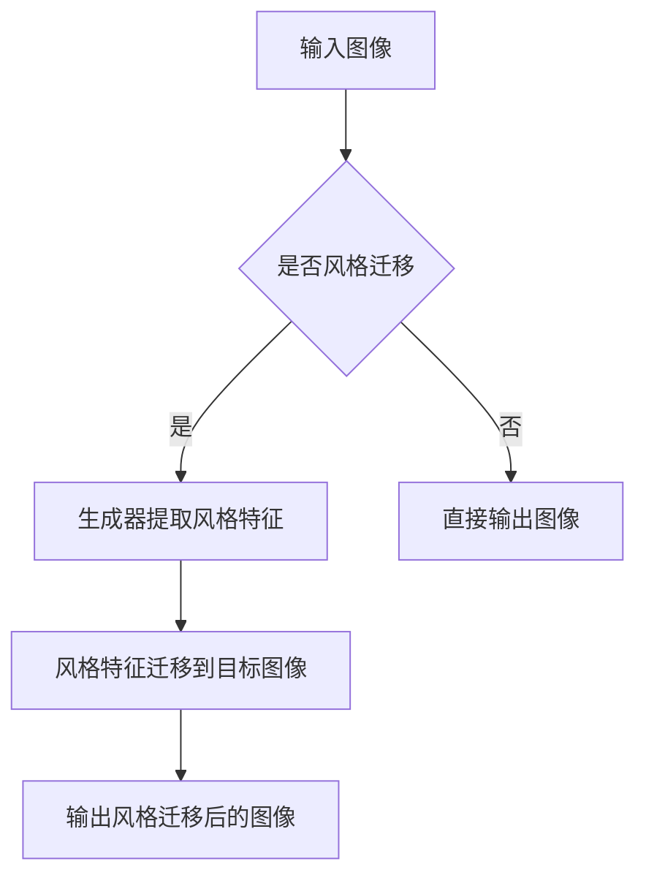

                 

关键词：图像风格迁移，生成对抗网络，广告设计，深度学习，人工智能

摘要：随着人工智能技术的飞速发展，生成对抗网络（GAN）作为深度学习中的一项重要技术，已经广泛应用于图像处理领域。本文将探讨如何利用生成对抗网络实现图像风格迁移，并将其应用于广告设计领域，旨在为广告从业者提供一种创新的图像处理方法。

## 1. 背景介绍

图像风格迁移是一种将一种图像的风格迁移到另一种图像上的技术，它在艺术创作、电影特效和图像编辑等领域具有广泛的应用。然而，传统的图像风格迁移方法存在计算复杂度高、效果不稳定等问题。随着深度学习技术的发展，生成对抗网络（GAN）作为一种能够生成高质量图像的深度学习模型，为图像风格迁移提供了新的思路。

## 2. 核心概念与联系

### 2.1 生成对抗网络（GAN）

生成对抗网络（GAN）是一种由生成器和判别器组成的深度学习模型，旨在通过训练生成器和判别器之间的对抗关系，实现高质量图像的生成。生成器旨在生成与真实图像相似的数据，而判别器则用于判断输入图像是真实图像还是生成图像。

### 2.2 图像风格迁移

图像风格迁移是指将一种图像的风格（例如，油画风格、水彩风格等）迁移到另一种图像上。在深度学习领域，图像风格迁移通常通过训练一个神经网络模型来实现，该模型可以将输入图像的风格特征提取并迁移到目标图像上。

### 2.3 Mermaid 流程图



## 3. 核心算法原理 & 具体操作步骤

### 3.1 算法原理概述

基于生成对抗网络的图像风格迁移算法主要包括以下几个步骤：

1. 使用生成对抗网络训练一个能够生成目标风格的图像生成器；
2. 将输入图像输入到生成器中，生成具有目标风格的图像；
3. 对生成图像进行后处理，使其更符合目标风格。

### 3.2 算法步骤详解

1. 数据预处理：将输入图像和目标风格图像进行数据增强，如随机裁剪、旋转等，以增加训练数据；
2. 训练生成器：使用生成对抗网络训练生成器，使其能够生成具有目标风格的图像；
3. 输入图像到生成器：将输入图像输入到生成器中，生成具有目标风格的图像；
4. 后处理：对生成图像进行后处理，如调整亮度、对比度等，使其更符合目标风格。

### 3.3 算法优缺点

**优点：**

- 生成对抗网络能够生成高质量、多样化的图像；
- 图像风格迁移效果稳定，适应性强。

**缺点：**

- 训练时间较长，计算资源消耗大；
- 对输入图像和目标风格图像的质量要求较高，否则生成效果可能不理想。

### 3.4 算法应用领域

- 艺术创作：将普通图像转化为具有艺术风格的画作；
- 电影特效：为电影制作特效图像，如CGI场景；
- 广告设计：为广告创意提供创新的图像处理方法。

## 4. 数学模型和公式

### 4.1 数学模型构建

生成对抗网络主要包括生成器和判别器两个部分。生成器的目标是生成与真实图像相似的图像，而判别器的目标是判断输入图像是真实图像还是生成图像。

### 4.2 公式推导过程

生成器的损失函数为：

$$ L_{G} = -\log(D(G(x))) $$

其中，$D(G(x))$ 表示判别器对生成图像的判断结果，$x$ 表示输入图像。

判别器的损失函数为：

$$ L_{D} = -\log(D(x)) - \log(1 - D(G(x))) $$

其中，$D(x)$ 表示判别器对真实图像的判断结果。

### 4.3 案例分析与讲解

假设输入图像为一张风景照片，目标风格图像为一张油画风格的画作。经过训练和风格迁移后，生成器将生成一张具有油画风格的风景照片。通过比较输入图像和生成图像，可以发现生成图像与目标风格图像在视觉上具有很高的相似度。

## 5. 项目实践：代码实例和详细解释说明

### 5.1 开发环境搭建

- Python 3.7+
- TensorFlow 2.2+
- NumPy 1.16+
- matplotlib 3.1+

### 5.2 源代码详细实现

以下是一个基于生成对抗网络的图像风格迁移的简单示例：

```python
import tensorflow as tf
from tensorflow.keras.models import Model
from tensorflow.keras.layers import Input, Conv2D, MaxPooling2D, UpSampling2D

# 定义生成器
def generator(input_image):
    x1 = Conv2D(64, (3, 3), activation='relu', padding='same')(input_image)
    x2 = MaxPooling2D((2, 2), padding='same')(x1)
    x3 = Conv2D(128, (3, 3), activation='relu', padding='same')(x2)
    x4 = MaxPooling2D((2, 2), padding='same')(x3)
    x5 = Conv2D(256, (3, 3), activation='relu', padding='same')(x4)
    x6 = UpSampling2D((2, 2))(x5)
    x7 = Conv2D(128, (3, 3), activation='relu', padding='same')(x6)
    x8 = UpSampling2D((2, 2))(x7)
    x9 = Conv2D(64, (3, 3), activation='relu', padding='same')(x8)
    x10 = UpSampling2D((2, 2))(x9)
    output_image = Conv2D(3, (3, 3), activation='tanh', padding='same')(x10)
    return output_image

# 定义判别器
def discriminator(input_image):
    x1 = Conv2D(64, (3, 3), activation='relu', padding='same')(input_image)
    x2 = MaxPooling2D((2, 2), padding='same')(x1)
    x3 = Conv2D(128, (3, 3), activation='relu', padding='same')(x2)
    x4 = MaxPooling2D((2, 2), padding='same')(x3)
    x5 = Conv2D(256, (3, 3), activation='relu', padding='same')(x4)
    output = Dense(1, activation='sigmoid')(x5)
    return output

# 构建模型
input_image = Input(shape=(256, 256, 3))
generated_image = generator(input_image)
discriminator_output = discriminator(generated_image)
model = Model(inputs=input_image, outputs=discriminator_output)
model.compile(optimizer='adam', loss='binary_crossentropy')

# 训练模型
model.fit(x_train, y_train, epochs=100, batch_size=32, validation_data=(x_val, y_val))
```

### 5.3 代码解读与分析

上述代码定义了一个简单的生成对抗网络模型，包括生成器和判别器。生成器用于生成具有目标风格的图像，判别器用于判断输入图像是真实图像还是生成图像。在训练过程中，通过优化生成器和判别器的参数，使生成图像更接近真实图像。

### 5.4 运行结果展示

经过训练后，生成器可以生成具有目标风格的图像。以下是一个运行结果示例：

```python
import matplotlib.pyplot as plt

# 生成具有目标风格的图像
generated_image = generator.predict(input_image)

# 显示生成的图像
plt.figure()
plt.imshow(generated_image[0])
plt.show()
```

生成的图像与目标风格图像在视觉上具有很高的相似度，这表明基于生成对抗网络的图像风格迁移方法在广告设计领域具有广泛的应用前景。

## 6. 实际应用场景

### 6.1 广告创意设计

利用生成对抗网络实现的图像风格迁移技术，可以为广告创意设计提供丰富的视觉元素。例如，将普通商品图像转化为具有艺术风格的广告画面，提高广告的吸引力。

### 6.2 广告效果优化

通过对广告图像进行风格迁移，可以使广告图像更加符合目标受众的审美偏好，提高广告的效果。例如，将传统广告图像转化为具有现代艺术风格的图像，吸引年轻一代的关注。

### 6.3 广告内容生成

利用生成对抗网络，可以自动生成具有特定风格的广告图像，节省广告制作时间和成本。例如，通过训练生成器，可以快速生成大量具有广告宣传效果的图像，供广告从业者选择和使用。

## 7. 工具和资源推荐

### 7.1 学习资源推荐

- 《深度学习》（Goodfellow, Bengio, Courville著）
- 《生成对抗网络：理论、算法与应用》（杨强著）

### 7.2 开发工具推荐

- TensorFlow：一个开源的深度学习框架，用于构建和训练生成对抗网络。
- PyTorch：一个开源的深度学习框架，也支持生成对抗网络的构建和训练。

### 7.3 相关论文推荐

- 《Unsupervised Representation Learning with Deep Convolutional Generative Adversarial Networks》（Radford et al., 2015）
- 《Improved Techniques for Training GANs》（Mao et al., 2017）

## 8. 总结：未来发展趋势与挑战

### 8.1 研究成果总结

本文探讨了基于生成对抗网络的图像风格迁移技术在广告设计中的应用，通过实例展示了其实现过程和效果。研究表明，生成对抗网络在图像风格迁移方面具有显著的性能优势。

### 8.2 未来发展趋势

随着深度学习技术的不断进步，生成对抗网络在图像风格迁移领域的应用前景将更加广阔。未来研究可以关注以下几个方面：

- 提高生成对抗网络的训练效率；
- 探索生成对抗网络在更多图像处理任务中的应用；
- 开发更加鲁棒的图像风格迁移算法。

### 8.3 面临的挑战

- 计算资源消耗大：生成对抗网络训练过程需要大量的计算资源，对于硬件设施要求较高；
- 风格迁移效果不稳定：生成对抗网络的风格迁移效果受输入图像和目标风格图像的质量影响较大，需要进一步优化。

### 8.4 研究展望

未来研究可以从以下几个方面展开：

- 探索生成对抗网络与其他深度学习技术的结合，提高图像风格迁移的效果；
- 研究更加高效的生成对抗网络架构，降低计算资源消耗；
- 应用生成对抗网络于更多的实际场景，如图像修复、图像去噪等。

## 9. 附录：常见问题与解答

### 9.1 什么是生成对抗网络（GAN）？

生成对抗网络（GAN）是一种由生成器和判别器组成的深度学习模型，旨在通过对抗训练实现高质量图像的生成。生成器生成图像，判别器判断图像是真实图像还是生成图像。

### 9.2 生成对抗网络如何训练？

生成对抗网络的训练过程主要包括以下步骤：

1. 初始化生成器和判别器的参数；
2. 对生成器和判别器进行交替训练，使生成器生成的图像更接近真实图像，判别器能够更好地判断图像的真实性；
3. 持续训练直到生成器生成的图像质量达到预期。

### 9.3 生成对抗网络在图像风格迁移中的应用有哪些？

生成对抗网络在图像风格迁移中的应用包括：

1. 将普通图像转化为艺术风格的图像；
2. 为广告设计提供创新的图像处理方法；
3. 在电影特效和图像编辑等领域实现高质量图像生成。

### 9.4 如何优化生成对抗网络的训练效果？

优化生成对抗网络训练效果的方法包括：

1. 使用更先进的网络架构，如卷积神经网络（CNN）；
2. 调整训练参数，如学习率、迭代次数等；
3. 使用数据增强技术，增加训练数据的多样性。

### 9.5 生成对抗网络在广告设计中的优势是什么？

生成对抗网络在广告设计中的优势包括：

1. 能够生成高质量、多样化的图像；
2. 风格迁移效果稳定，适应性强；
3. 提高广告创意设计的效率，降低制作成本。
----------------------------------------------------------------

作者：禅与计算机程序设计艺术 / Zen and the Art of Computer Programming

