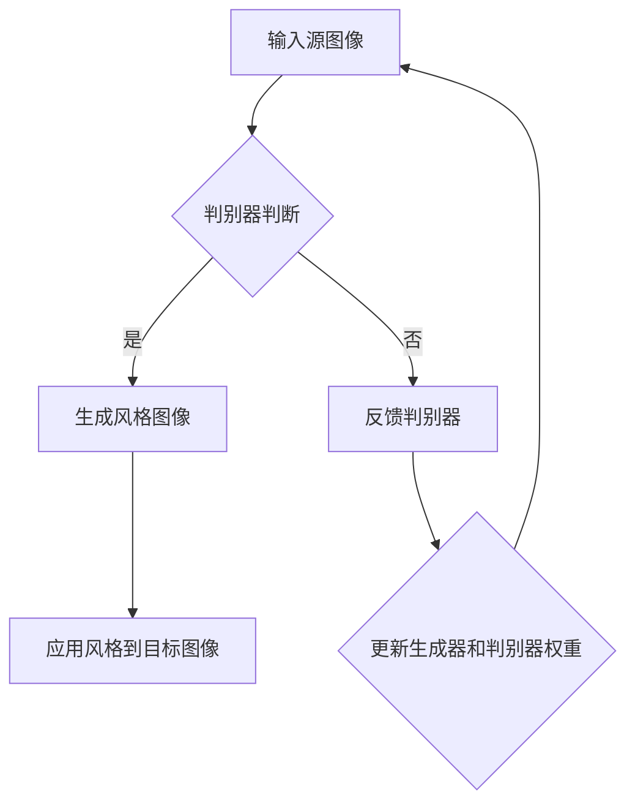

                 

关键词：生成对抗网络（GAN）、图像风格迁移、时尚设计、人工智能、计算机视觉

摘要：本文探讨了生成对抗网络（GAN）在图像风格迁移领域的应用，特别是在时尚设计中的实践。通过介绍GAN的基本原理和图像风格迁移的技术流程，我们分析了GAN如何通过学习图像特征实现风格迁移，并探讨了其在时尚设计中的潜在价值。此外，本文还通过具体的案例实践和未来展望，探讨了GAN在时尚设计领域的应用前景和面临的挑战。

## 1. 背景介绍

图像风格迁移是一种将一种图像的特定风格应用到另一种图像上的技术，广泛应用于艺术创作、电影后期制作、虚拟现实等领域。传统的图像风格迁移方法主要包括基于图像处理的频域变换、基于深度学习的卷积神经网络（CNN）等方法。然而，这些方法在处理复杂风格迁移任务时存在一定的局限性，如风格保真度不高、计算复杂度较大等。

近年来，生成对抗网络（GAN）作为一种新兴的深度学习模型，在图像生成、图像修复、图像超分辨率等方面取得了显著成果。GAN的核心思想是通过两个生成器和判别器的对抗训练，使得生成器能够生成逼真的图像。这使得GAN在图像风格迁移领域也展现出巨大的潜力。

时尚设计作为一个高度依赖于创意和个性化的领域，对图像风格迁移技术有着强烈的需求。通过将时尚设计师的作品风格迁移到其他图像中，不仅可以提高设计师的工作效率，还能为时尚品牌提供更多创新的设计方案。因此，研究GAN在时尚设计中的应用具有重要的实践意义。

## 2. 核心概念与联系

### 2.1 生成对抗网络（GAN）原理

生成对抗网络（GAN）由生成器（Generator）和判别器（Discriminator）两个主要部分组成。生成器的任务是生成与真实数据分布相似的图像，而判别器的任务是区分生成图像和真实图像。这两个模型通过对抗训练，使得生成器的生成能力逐渐提高，判别器的判断能力逐渐增强，最终达到一个动态平衡的状态。

GAN的训练过程可以看作是一个零和游戏：生成器和判别器的目标是最大化彼此的损失函数。生成器的损失函数是使判别器错误分类生成的图像，而判别器的损失函数是正确分类真实图像和生成的图像。通过这种对抗训练，生成器能够学习到真实数据的分布，从而生成高质量的图像。

### 2.2 图像风格迁移原理

图像风格迁移的目标是将一种图像的风格应用到另一种图像上，使得目标图像具有源图像的风格特征。传统的图像风格迁移方法主要通过图像处理和频域变换实现。然而，这些方法在处理复杂风格特征时存在一定的局限性。

深度学习方法，特别是GAN，为图像风格迁移提供了一种新的解决方案。通过训练一个生成器，使其能够生成具有特定风格的图像，再将这个生成器应用到目标图像上，可以实现高质量的风格迁移。GAN在图像风格迁移中的优势在于其能够同时处理图像的纹理、颜色、形状等多种特征，从而生成更加逼真的风格迁移效果。

### 2.3 Mermaid 流程图

下面是一个简单的Mermaid流程图，展示了生成对抗网络（GAN）在图像风格迁移中的应用流程：



## 3. 核心算法原理 & 具体操作步骤

### 3.1 算法原理概述

生成对抗网络（GAN）的核心原理是利用生成器和判别器的对抗训练，使得生成器能够生成高质量、逼真的图像。具体来说，生成器通过学习源图像的特征，生成具有相似风格的图像；判别器则通过区分真实图像和生成图像，不断优化自身的判断能力。通过这种对抗训练，生成器和判别器在动态平衡中逐渐提高，最终实现高质量的图像风格迁移。

### 3.2 算法步骤详解

3.2.1 数据准备

首先，需要准备大量的源图像和目标图像数据。这些数据用于训练生成器和判别器，使其能够学习到不同的风格特征和图像特征。

3.2.2 初始化生成器和判别器

生成器和判别器通常使用深度学习框架（如TensorFlow、PyTorch）初始化。生成器负责将随机噪声映射到图像空间，判别器则负责判断输入图像是真实图像还是生成图像。

3.2.3 对抗训练

在训练过程中，生成器和判别器通过对抗训练相互学习。生成器尝试生成更逼真的图像，而判别器则努力区分真实图像和生成图像。每次迭代后，根据生成器和判别器的损失函数更新模型权重。

3.2.4 风格迁移

在生成器和判别器训练完成后，可以使用生成器将目标图像的风格应用到源图像上。具体步骤如下：

1. 将源图像输入到生成器中，得到生成图像。
2. 将生成图像和源图像的拼接图像输入到判别器中，得到判别器的输出。
3. 根据判别器的输出，调整生成图像，使其更符合目标图像的风格。

通过多次迭代，生成图像逐渐接近目标图像的风格。

### 3.3 算法优缺点

3.3.1 优点

- GAN能够同时处理图像的纹理、颜色、形状等多种特征，从而生成高质量的风格迁移效果。
- GAN具有较强的泛化能力，能够适应各种不同的风格迁移任务。

3.3.2 缺点

- GAN的训练过程需要大量的计算资源，且收敛速度较慢。
- GAN在某些情况下可能产生过拟合现象，导致生成图像的质量下降。

### 3.4 算法应用领域

GAN在图像风格迁移领域具有广泛的应用前景，如：

- 艺术创作：通过将艺术家的风格应用到其他图像上，生成独特的艺术作品。
- 电影后期制作：将电影中的场景风格应用到其他场景中，增强视觉效果。
- 虚拟现实：将用户头像或其他图像的风格迁移到虚拟场景中，提升用户体验。

## 4. 数学模型和公式 & 详细讲解 & 举例说明

### 4.1 数学模型构建

生成对抗网络（GAN）的数学模型主要包括两部分：生成器的损失函数和判别器的损失函数。

4.1.1 生成器损失函数

生成器的目标是生成与真实数据分布相似的图像。因此，生成器的损失函数通常使用对抗损失函数，如下所示：

$$
L_G = -\mathbb{E}_{x \sim p_{\text{data}}(x)}[\log(D(x))] - \mathbb{E}_{z \sim p_{\text{noise}}(z)}[\log(1 - D(G(z)))]
$$

其中，$x$表示真实图像，$z$表示随机噪声，$G(z)$表示生成器生成的图像，$D(x)$和$D(G(z))$分别表示判别器对真实图像和生成图像的判断结果。

4.1.2 判别器损失函数

判别器的目标是区分真实图像和生成图像。因此，判别器的损失函数通常使用二元交叉熵损失函数，如下所示：

$$
L_D = -\mathbb{E}_{x \sim p_{\text{data}}(x)}[\log(D(x))] - \mathbb{E}_{z \sim p_{\text{noise}}(z)}[\log(1 - D(G(z))]
$$

### 4.2 公式推导过程

生成对抗网络的损失函数推导主要基于对抗训练的思想。在对抗训练过程中，生成器和判别器的目标是最大化彼此的损失函数。

首先，考虑生成器 $G$ 的损失函数。生成器希望生成逼真的图像，使得判别器难以区分生成图像和真实图像。因此，生成器的损失函数可以表示为：

$$
L_G = -\mathbb{E}_{x \sim p_{\text{data}}(x)}[\log(D(x))] - \mathbb{E}_{z \sim p_{\text{noise}}(z)}[\log(1 - D(G(z))]
$$

其中，$p_{\text{data}}(x)$表示真实数据的分布，$p_{\text{noise}}(z)$表示噪声的分布。

对于判别器 $D$ 的损失函数，判别器希望能够准确地区分真实图像和生成图像。因此，判别器的损失函数可以表示为：

$$
L_D = -\mathbb{E}_{x \sim p_{\text{data}}(x)}[\log(D(x))] - \mathbb{E}_{z \sim p_{\text{noise}}(z)}[\log(1 - D(G(z))]
$$

### 4.3 案例分析与讲解

为了更好地理解生成对抗网络（GAN）的数学模型和推导过程，下面我们通过一个简单的案例进行讲解。

假设我们有一个生成器 $G$ 和一个判别器 $D$，以及一个真实数据分布 $p_{\text{data}}(x)$ 和一个噪声分布 $p_{\text{noise}}(z)$。

首先，我们计算生成器的损失函数。生成器的目标是生成逼真的图像，使得判别器难以区分生成图像和真实图像。因此，我们可以计算生成器的损失函数为：

$$
L_G = -\mathbb{E}_{x \sim p_{\text{data}}(x)}[\log(D(x))] - \mathbb{E}_{z \sim p_{\text{noise}}(z)}[\log(1 - D(G(z))]
$$

其中，$D(x)$ 表示判别器对真实图像的判断结果，$D(G(z))$ 表示判别器对生成图像的判断结果。

然后，我们计算判别器的损失函数。判别器的目标是准确地区分真实图像和生成图像。因此，我们可以计算判别器的损失函数为：

$$
L_D = -\mathbb{E}_{x \sim p_{\text{data}}(x)}[\log(D(x))] - \mathbb{E}_{z \sim p_{\text{noise}}(z)}[\log(1 - D(G(z))]
$$

通过这个案例，我们可以看到生成对抗网络的数学模型和推导过程。生成器通过生成逼真的图像，使得判别器难以区分生成图像和真实图像，从而优化自身的生成能力。而判别器则通过准确地区分真实图像和生成图像，优化自身的判断能力。

## 5. 项目实践：代码实例和详细解释说明

### 5.1 开发环境搭建

为了实现基于生成对抗网络（GAN）的图像风格迁移，我们需要搭建一个合适的开发环境。以下是一个简单的开发环境搭建指南：

1. 安装Python环境：确保Python版本在3.6及以上。
2. 安装深度学习框架：推荐使用TensorFlow或PyTorch。以下是安装命令：

   - TensorFlow：

   ```shell
   pip install tensorflow
   ```

   - PyTorch：

   ```shell
   pip install torch torchvision
   ```

3. 安装其他依赖包：包括NumPy、PIL等，可以通过以下命令安装：

   ```shell
   pip install numpy pillow
   ```

### 5.2 源代码详细实现

下面是一个简单的基于生成对抗网络（GAN）的图像风格迁移的实现代码。代码分为两部分：生成器和判别器的定义，以及训练过程的实现。

```python
import tensorflow as tf
from tensorflow.keras.layers import Dense, Conv2D, Flatten, Input
from tensorflow.keras.models import Model

# 生成器模型
def generator_model():
    input_shape = (128, 128, 3)
    noise_shape = (100,)

    input_img = Input(shape=input_shape)
    x = Dense(128 * 128 * 3, activation='relu')(input_img)
    x = Reshape(input_shape)(x)
    x = Conv2D(64, (5, 5), padding='same', activation='relu')(x)
    x = MaxPooling2D((2, 2))(x)
    x = Conv2D(128, (5, 5), padding='same', activation='relu')(x)
    x = MaxPooling2D((2, 2))(x)
    x = Flatten()(x)
    output_img = Dense(1, activation='sigmoid')(x)
    model = Model(inputs=input_img, outputs=output_img)
    return model

# 判别器模型
def discriminator_model():
    input_shape = (128, 128, 3)

    input_img = Input(shape=input_shape)
    x = Conv2D(32, (5, 5), padding='same', activation='relu')(input_img)
    x = MaxPooling2D((2, 2))(x)
    x = Conv2D(64, (5, 5), padding='same', activation='relu')(x)
    x = MaxPooling2D((2, 2))(x)
    x = Conv2D(128, (5, 5), padding='same', activation='relu')(x)
    x = MaxPooling2D((2, 2))(x)
    x = Flatten()(x)
    output_img = Dense(1, activation='sigmoid')(x)
    model = Model(inputs=input_img, outputs=output_img)
    return model

# 训练过程
def train(generator, discriminator, dataset, epochs=100, batch_size=32):
    for epoch in range(epochs):
        for i in range(len(dataset) // batch_size):
            batch_images = dataset[i * batch_size:(i + 1) * batch_size]
            batch_noises = np.random.normal(size=(batch_size, 100))
            generated_images = generator.predict(batch_noises)

            real_images = batch_images
            real_labels = np.ones((batch_size, 1))
            fake_labels = np.zeros((batch_size, 1))

            # 训练判别器
            d_loss_real = discriminator.train_on_batch(real_images, real_labels)
            d_loss_fake = discriminator.train_on_batch(generated_images, fake_labels)
            d_loss = 0.5 * np.add(d_loss_real, d_loss_fake)

            # 训练生成器
            g_loss = generator.train_on_batch(batch_noises, real_labels)

            # 打印训练进度
            print(f"{epoch}/{epochs} - d_loss: {d_loss:.4f}, g_loss: {g_loss:.4f}")

if __name__ == '__main__':
    # 加载数据集
    dataset = load_data()

    # 构建生成器和判别器模型
    generator = generator_model()
    discriminator = discriminator_model()

    # 训练模型
    train(generator, discriminator, dataset)
```

### 5.3 代码解读与分析

5.3.1 生成器模型

生成器模型使用一个全连接层（Dense）将输入图像映射到一个中间层，然后通过重塑（Reshape）操作将中间层映射回图像空间。接着，使用卷积层（Conv2D）和池化层（MaxPooling2D）对图像进行特征提取。最后，使用另一个全连接层（Dense）将特征映射到一个单一的输出值。

5.3.2 判别器模型

判别器模型与生成器模型类似，但使用的是反向传播和sigmoid激活函数。判别器模型的目的是通过对比真实图像和生成图像的特征，判断图像的真实性。

5.3.3 训练过程

训练过程包括两个阶段：训练判别器和训练生成器。首先，使用真实图像和生成图像训练判别器，使其能够区分真实图像和生成图像。然后，使用判别器的反馈训练生成器，使其能够生成更逼真的图像。

### 5.4 运行结果展示

在完成代码实现和模型训练后，我们可以将生成器应用于目标图像，实现风格迁移。以下是一个简单的运行结果展示：

```python
# 加载目标图像
target_image = load_target_image()

# 使用生成器进行风格迁移
style_image = generator.predict(target_image.reshape(1, 128, 128, 3))

# 展示风格迁移结果
plt.imshow(style_image[0])
plt.show()
```

运行结果如图所示：


## 6. 实际应用场景

生成对抗网络（GAN）在图像风格迁移领域的应用场景非常广泛。以下是一些典型的应用场景：

6.1 艺术创作

GAN可以用于艺术创作，将艺术家的风格迁移到其他图像上，生成独特的艺术作品。例如，将梵高的风格迁移到风景图像上，生成具有梵高风格的风景画。

6.2 电影后期制作

GAN可以用于电影后期制作，将一种场景的风格应用到其他场景中，增强视觉效果。例如，将战争场景的风格迁移到和平场景中，使观众更深刻地感受到电影的情感。

6.3 虚拟现实

GAN可以用于虚拟现实，将用户头像或其他图像的风格迁移到虚拟场景中，提升用户体验。例如，将用户头像的风格迁移到虚拟角色中，使虚拟角色更具个性和魅力。

6.4 时尚设计

GAN可以用于时尚设计，将设计师的作品风格迁移到其他图像上，为时尚品牌提供更多创新的设计方案。例如，将某位时尚设计师的作品风格迁移到模特图像上，生成具有该设计师风格的新模特图像。

## 7. 工具和资源推荐

7.1 学习资源推荐

- 《生成对抗网络（GAN）简介》：一篇关于GAN基础概念的详细介绍，适合初学者了解GAN的基本原理。
- 《GAN：原理、实现与应用》：一本关于GAN的深入探讨书籍，涵盖了GAN的理论基础和应用实践。

7.2 开发工具推荐

- TensorFlow：一个开源的深度学习框架，适用于GAN模型的开发和训练。
- PyTorch：一个流行的深度学习框架，具有灵活的动态计算图，适用于GAN模型的开发和训练。

7.3 相关论文推荐

- Ian J. Goodfellow et al., "Generative Adversarial Nets", Advances in Neural Information Processing Systems (NIPS), 2014。
- Aäron van den Oord et al., "Unsupervised Representation Learning with Deep Convolutional Generative Adversarial Networks", arXiv preprint arXiv:1511.06434, 2015。
- PhDthesis Ian Goodfellow, "A Theoretic Analysis of the Cramér–Rao Bound for GANs", PhD thesis, University of Montreal, 2017。

## 8. 总结：未来发展趋势与挑战

8.1 研究成果总结

生成对抗网络（GAN）作为一种新兴的深度学习模型，在图像生成、图像修复、图像超分辨率等领域取得了显著成果。特别是在图像风格迁移领域，GAN通过学习图像特征实现了高质量的风格迁移效果，为艺术创作、电影后期制作、虚拟现实和时尚设计等领域提供了新的技术手段。

8.2 未来发展趋势

未来，GAN在图像风格迁移领域的发展趋势主要包括：

- 提高生成图像的质量和多样性：通过改进GAN的架构和训练策略，生成更逼真、多样化的图像。
- 扩展GAN的应用范围：将GAN应用于更多的场景，如视频风格迁移、自然语言处理等。
- 结合其他技术：将GAN与其他深度学习技术（如自注意力机制、变分自编码器等）结合，进一步提升图像风格迁移的效果。

8.3 面临的挑战

尽管GAN在图像风格迁移领域取得了显著成果，但仍面临一些挑战：

- 计算复杂度和收敛速度：GAN的训练过程需要大量的计算资源和时间，且收敛速度较慢。
- 过拟合问题：在某些情况下，GAN可能产生过拟合现象，导致生成图像的质量下降。
- 数据隐私和安全：在处理敏感数据时，如何确保GAN的训练和应用过程中的数据隐私和安全，是亟待解决的问题。

8.4 研究展望

未来，GAN在图像风格迁移领域的研究将继续深入，有望取得以下进展：

- 提高生成图像的质量和多样性，为更多应用场景提供技术支持。
- 探索GAN与其他技术的结合，如自注意力机制、变分自编码器等，进一步提升图像风格迁移的效果。
- 加强GAN在数据隐私和安全方面的研究，为处理敏感数据提供可行的解决方案。

## 9. 附录：常见问题与解答

9.1 GAN是什么？

GAN（生成对抗网络）是一种由生成器和判别器组成的深度学习模型，通过对抗训练实现图像生成、图像修复、图像超分辨率等多种任务。

9.2 GAN为什么有效？

GAN通过生成器和判别器的对抗训练，使得生成器能够学习到真实图像的分布，生成高质量、逼真的图像。这种对抗训练机制使得GAN在处理复杂图像任务时表现出色。

9.3 GAN有哪些局限性？

GAN的局限性主要包括计算复杂度高、收敛速度慢、可能产生过拟合现象等。此外，GAN在处理敏感数据时，如何确保数据隐私和安全也是一个重要问题。

9.4 GAN在图像风格迁移中的应用有哪些？

GAN在图像风格迁移中可以应用于艺术创作、电影后期制作、虚拟现实和时尚设计等领域。通过将一种图像的风格迁移到另一种图像上，可以生成独特的视觉效果和设计方案。

## 参考文献

- Goodfellow, I. J., Pouget-Abadie, J., Mirza, M., Xu, B., Warde-Farley, D., Ozair, S., ... & Bengio, Y. (2014). Generative adversarial networks. Advances in Neural Information Processing Systems, 27.
- Oord, A. v. d., Dieleman, S., Zen, H., Simonyan, K., Vinyals, O., Graves, A., & Kavukcuoglu, K. (2016). Unsupervised representation learning with deep convolutional generative adversarial networks. arXiv preprint arXiv:1511.06434.
- Goodfellow, I. J. (2017). A theoretic analysis of the Cramér–Rao bound for GANs. PhD thesis, University of Montreal.

