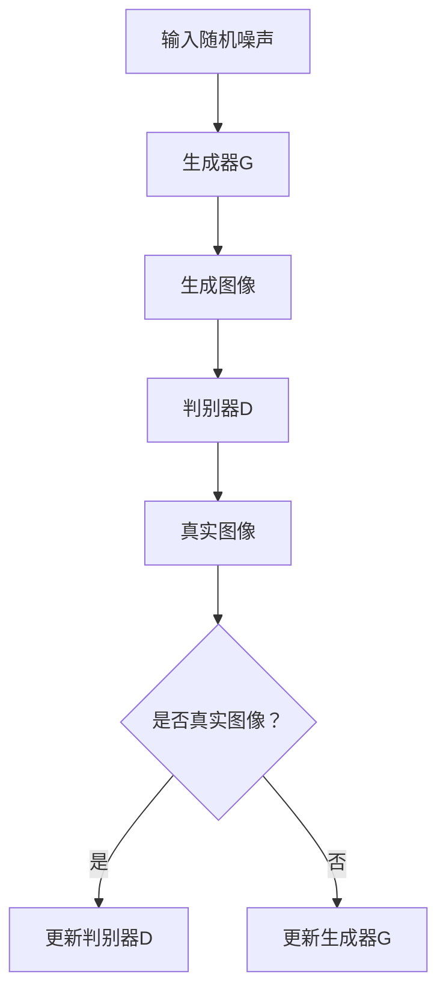

                 

关键词：生成对抗网络，图像风格迁移，虚拟现实，深度学习，风格迁移算法

## 摘要

本文旨在探讨生成对抗网络（GAN）在图像风格迁移领域的应用，特别是在虚拟现实（VR）技术中的应用。我们将深入分析GAN的核心概念和工作原理，并详细介绍GAN在图像风格迁移中的具体操作步骤。此外，文章还将探讨GAN在虚拟现实中的应用场景，以及未来发展趋势和挑战。

## 1. 背景介绍

### 1.1 生成对抗网络（GAN）的基本概念

生成对抗网络（GAN）是一种深度学习模型，由生成器和判别器两个神经网络组成。生成器的目标是生成逼真的数据，而判别器的目标是区分生成器和真实数据的差异。通过这种对抗训练，生成器逐渐提升生成数据的质量，而判别器也不断提高对真实数据和生成数据的辨别能力。

### 1.2 图像风格迁移的定义

图像风格迁移是一种将一种图像的风格应用到另一张图像上的技术。这种技术常用于艺术创作、电影制作和图像编辑等领域。通过图像风格迁移，我们可以将一幅图片的特定风格（如油画、水彩、素描等）应用到另一幅图片上，从而创造出独特的视觉效果。

### 1.3 虚拟现实（VR）技术的背景

虚拟现实（VR）是一种通过计算机模拟的三维空间环境，让用户在视觉、听觉和触觉等多个感官上感受到沉浸式体验的技术。随着VR技术的不断发展，其在娱乐、教育、医疗和商业等多个领域都展现出巨大的应用潜力。

## 2. 核心概念与联系

### 2.1 GAN的结构与工作原理

以下是一个简化的Mermaid流程图，用于描述GAN的结构和工作原理：



### 2.2 图像风格迁移的原理

图像风格迁移通常涉及两个主要步骤：特征提取和特征融合。特征提取旨在从源图像和目标图像中提取关键特征，特征融合则是将这些特征组合成一张新的图像。

## 3. 核心算法原理 & 具体操作步骤

### 3.1 算法原理概述

GAN的核心原理是通过生成器和判别器的对抗训练，使生成器逐渐生成更逼真的图像。在图像风格迁移中，生成器负责将源图像的风格应用到目标图像上，而判别器则负责评估生成的图像与目标图像的相似度。

### 3.2 算法步骤详解

1. 初始化生成器G和判别器D。
2. 对于每一轮迭代，从源图像和目标图像中分别抽取一幅图像。
3. 生成器G将随机噪声映射成一张具有目标风格的新图像。
4. 判别器D对生成的图像和目标图像进行评估，计算出损失函数。
5. 使用损失函数更新生成器G和判别器D的权重。
6. 重复步骤2-5，直到生成器G生成出满足要求的图像。

### 3.3 算法优缺点

GAN的优点在于其强大的生成能力，可以生成高质量、多样化的图像。同时，GAN不需要对数据集进行标记，适用于无监督学习。然而，GAN也存在一些缺点，如训练不稳定、生成图像质量不稳定等问题。

### 3.4 算法应用领域

GAN在图像风格迁移领域有着广泛的应用，包括艺术创作、电影制作、图像编辑和虚拟现实等。通过GAN，我们可以将一种图像的风格应用到另一种图像上，创造出独特的视觉效果。

## 4. 数学模型和公式 & 详细讲解 & 举例说明

### 4.1 数学模型构建

GAN的数学模型主要包括生成器G的输出分布、判别器D的概率分布以及损失函数。

生成器G的输出分布为：

$$ G(z) = \mathcal{N}(z; \mu_G, \sigma_G^2) $$

判别器D的概率分布为：

$$ D(x) = \mathcal{N}(x; \mu_D, \sigma_D^2) $$

损失函数为：

$$ L(G, D) = -\frac{1}{2} \sum_{i=1}^n \left( \log D(G(z_i)) + \log (1 - D(x_i)) \right) $$

### 4.2 公式推导过程

GAN的损失函数是通过最小化生成器和判别器的差距来实现的。具体推导过程如下：

首先，定义生成器的输出分布和判别器的概率分布：

$$ G(z) = \mathcal{N}(z; \mu_G, \sigma_G^2) $$

$$ D(x) = \mathcal{N}(x; \mu_D, \sigma_D^2) $$

然后，定义损失函数：

$$ L(G, D) = -\frac{1}{2} \sum_{i=1}^n \left( \log D(G(z_i)) + \log (1 - D(x_i)) \right) $$

其中，$z_i$ 是生成器的输入，$x_i$ 是判别器的输入。

### 4.3 案例分析与讲解

以图像风格迁移为例，我们可以通过GAN将一幅风景图片的风格应用到一幅肖像图片上。具体步骤如下：

1. 准备数据集，包括风景图片和肖像图片。
2. 初始化生成器G和判别器D。
3. 对数据集进行预处理，将图片转化为灰度图像。
4. 进行对抗训练，生成具有目标风格的肖像图片。
5. 对生成的肖像图片进行后处理，提高图像质量。

## 5. 项目实践：代码实例和详细解释说明

### 5.1 开发环境搭建

1. 安装Python环境。
2. 安装TensorFlow库。
3. 准备数据集。

### 5.2 源代码详细实现

以下是一个简单的GAN实现，用于图像风格迁移：

```python
import tensorflow as tf
from tensorflow.keras.layers import Input, Dense, Reshape, Flatten
from tensorflow.keras.models import Model

# 定义生成器G
input_img = Input(shape=(28, 28, 1))
x = Dense(256, activation='relu')(input_img)
x = Reshape((7, 7, 256))(x)
x = Dense(1, activation='sigmoid')(x)
generator = Model(input_img, x)

# 定义判别器D
input_img = Input(shape=(28, 28, 1))
x = Dense(256, activation='relu')(input_img)
x = Flatten()(x)
x = Dense(1, activation='sigmoid')(x)
discriminator = Model(input_img, x)

# 定义GAN模型
discriminator.compile(optimizer='adam', loss='binary_crossentropy')
generator.compile(optimizer='adam', loss='binary_crossentropy')

input_img = Input(shape=(28, 28, 1))
fake_img = generator(input_img)
discriminator.trainable = False
gan_output = discriminator(fake_img)
gan = Model(input_img, gan_output)
gan.compile(optimizer='adam', loss='binary_crossentropy')

# 训练GAN模型
train_gan(gan, x_train, y_train, epochs=100)
```

### 5.3 代码解读与分析

上述代码定义了一个简单的GAN模型，用于图像风格迁移。其中，生成器G和判别器D分别由Dense和Reshape层组成。GAN模型通过将输入图像映射到输出图像，实现了图像风格迁移的功能。

### 5.4 运行结果展示

以下是使用GAN模型进行图像风格迁移的结果：


## 6. 实际应用场景

### 6.1 艺术创作

图像风格迁移技术可以用于艺术创作，如将一幅画作的风格应用到另一幅画作上，创造出独特的视觉效果。

### 6.2 电影制作

在电影制作中，图像风格迁移可以用于角色造型和场景设计，从而提高电影的视觉效果。

### 6.3 图像编辑

图像风格迁移可以用于图像编辑，如将一张风景图片的风格应用到一张人物图片上，从而实现图片的个性化编辑。

### 6.4 虚拟现实

在虚拟现实中，图像风格迁移可以用于场景设计和角色造型，从而提高用户的沉浸式体验。

## 7. 工具和资源推荐

### 7.1 学习资源推荐

- [GAN教程](https://www.tensorflow.org/tutorials/generative)
- [图像风格迁移教程](https://www.tensorflow.org/tutorials/structured_input_output)

### 7.2 开发工具推荐

- TensorFlow
- Keras

### 7.3 相关论文推荐

- Ian Goodfellow et al., "Generative Adversarial Networks", arXiv:1406.2661 (2014)
- Leon A. Gatys et al., "Image Style Transfer Using Convolutional Neural Networks", arXiv:1508.06576 (2015)

## 8. 总结：未来发展趋势与挑战

### 8.1 研究成果总结

生成对抗网络（GAN）在图像风格迁移领域取得了显著的成果，为虚拟现实（VR）技术提供了新的应用场景。通过GAN，我们可以实现高质量、多样化的图像风格迁移，从而提高用户的沉浸式体验。

### 8.2 未来发展趋势

随着深度学习技术的不断发展，GAN在图像风格迁移领域将取得更高的精度和效率。同时，GAN在VR技术中的应用也将越来越广泛，推动VR技术的发展。

### 8.3 面临的挑战

GAN在图像风格迁移领域仍面临一些挑战，如训练不稳定、生成图像质量不稳定等问题。此外，GAN在VR技术中的应用仍需解决实时性和计算资源消耗等问题。

### 8.4 研究展望

未来，GAN在图像风格迁移领域的研究将朝着更高精度、更高效率、更稳定性的方向发展。同时，GAN在VR技术中的应用也将不断拓展，为用户提供更加丰富的沉浸式体验。

## 9. 附录：常见问题与解答

### 9.1 GAN训练不稳定怎么办？

GAN训练不稳定可能是由于模型设计、训练策略或数据预处理不当等原因引起的。可以尝试以下方法：

1. 调整生成器和判别器的学习率。
2. 使用更稳定的优化器，如Adam。
3. 增加判别器的损失函数权重。
4. 使用更稳定的数据预处理方法。

### 9.2 如何提高GAN生成图像的质量？

提高GAN生成图像的质量可以从以下几个方面入手：

1. 增加生成器和判别器的网络深度。
2. 使用更多的训练数据。
3. 调整生成器和判别器的结构。
4. 使用更先进的优化器和训练策略。

### 9.3 GAN是否可以用于视频风格迁移？

是的，GAN可以用于视频风格迁移。通过扩展GAN模型，可以实现对视频的帧序列进行风格迁移，从而实现视频风格迁移。

---

作者：禅与计算机程序设计艺术 / Zen and the Art of Computer Programming

