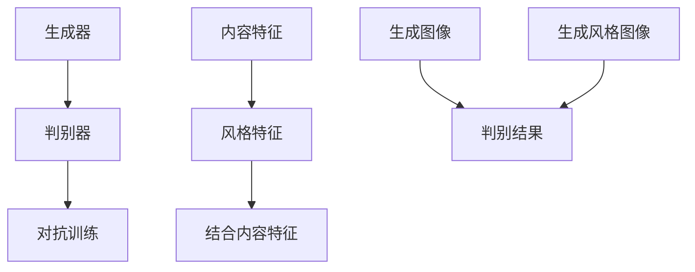

                 

关键词：生成对抗网络、图像风格迁移、可解释性、深度学习、数学模型、算法应用、案例分析、代码实例

## 摘要

本文旨在探讨基于生成对抗网络（GAN）的图像风格迁移的可解释性研究。生成对抗网络作为一种强大的深度学习框架，已经在图像生成、图像修复、图像超分辨率等方面取得了显著的成果。然而，GAN的内部机制较为复杂，导致其可解释性较差，这对于实际应用中的模型优化和调试带来了一定的挑战。本文将深入分析GAN的工作原理，并针对图像风格迁移任务提出一种可解释性方法，旨在提高模型的透明度和可理解性。同时，通过数学模型和具体案例的分析，我们将展示该方法的可行性和有效性。

## 1. 背景介绍

### 1.1 生成对抗网络（GAN）

生成对抗网络（GAN）是由 Ian Goodfellow 等人于2014年提出的一种深度学习模型。GAN的核心思想是利用生成器和判别器之间的对抗训练来生成高质量的数据。具体来说，生成器旨在生成尽可能真实的数据，而判别器则负责区分生成数据和真实数据。通过不断优化生成器和判别器，最终使得生成器能够生成几乎无法与真实数据区分的假数据。

### 1.2 图像风格迁移

图像风格迁移是一种将一种图像的内容和另一种图像的风格相结合的图像处理技术。传统的图像风格迁移方法通常基于图像的频域表示，如傅里叶变换和小波变换等。然而，这些方法往往难以实现高质量的迁移效果，且可解释性较差。

近年来，随着深度学习技术的快速发展，基于深度学习的图像风格迁移方法逐渐成为研究热点。特别是生成对抗网络（GAN）的提出，为图像风格迁移任务提供了一种全新的解决方案。通过生成对抗网络，我们可以将不同风格的图像进行迁移，实现高质量的视觉效果。

### 1.3 可解释性研究的重要性

尽管生成对抗网络在图像生成和图像修复等方面取得了显著的成果，但其内部机制较为复杂，导致其可解释性较差。这使得在实际应用中，模型优化和调试变得困难。因此，研究生成对抗网络的可解释性具有重要意义。可解释性研究不仅有助于理解模型的工作原理，还可以为模型优化提供有益的指导。

## 2. 核心概念与联系

### 2.1 生成对抗网络（GAN）的基本概念

生成对抗网络（GAN）由生成器（Generator）和判别器（Discriminator）两部分组成。生成器的任务是生成与真实数据相似的数据，而判别器的任务是区分生成数据和真实数据。通过生成器和判别器之间的对抗训练，生成器逐渐提高生成数据的质量，判别器则逐渐提高对真实数据和生成数据的辨别能力。

### 2.2 图像风格迁移的基本原理

图像风格迁移的基本原理是将一种图像的内容和另一种图像的风格相结合。具体来说，我们可以将源图像的内容表示为内容特征，将目标图像的风格表示为风格特征。通过将内容特征和风格特征相结合，我们可以生成具有目标图像风格的新图像。

### 2.3 可解释性研究的方法

可解释性研究的方法主要包括以下几个方面：

1. 模型可视化：通过可视化生成对抗网络的中间层特征，我们可以直观地了解模型在图像处理过程中的信息传递和变换过程。

2. 层级分析：通过分析生成对抗网络中不同层级的特征，我们可以理解不同层级的特征对图像风格迁移的影响。

3. 对抗性攻击：通过对抗性攻击，我们可以检验生成对抗网络的鲁棒性和可解释性。

### 2.4 Mermaid 流程图



## 3. 核心算法原理 & 具体操作步骤

### 3.1 算法原理概述

生成对抗网络（GAN）的核心算法原理是利用生成器和判别器之间的对抗训练来生成高质量的数据。具体来说，生成器旨在生成与真实数据相似的数据，而判别器则负责区分生成数据和真实数据。通过不断优化生成器和判别器，最终使得生成器能够生成几乎无法与真实数据区分的假数据。

### 3.2 算法步骤详解

1. 数据预处理：对输入数据进行标准化处理，包括归一化和数据增强等。

2. 初始化生成器和判别器：随机初始化生成器和判别器的参数。

3. 生成对抗训练：生成器和判别器交替进行训练。具体步骤如下：

   - 生成器生成假数据：生成器接收随机噪声，通过训练生成与真实数据相似的数据。

   - 判别器评估生成数据和真实数据：判别器接收真实数据和生成数据，通过比较二者，评估生成数据的质量。

   - 反向传播和梯度下降：根据判别器的评估结果，计算生成器和判别器的损失函数，并使用反向传播算法更新参数。

4. 模型评估：在训练完成后，使用验证集对模型进行评估，并调整超参数以达到最佳效果。

### 3.3 算法优缺点

#### 优点：

1. 强大的图像生成能力：生成对抗网络能够生成高质量的图像，适用于图像生成、图像修复、图像超分辨率等多种任务。

2. 可扩展性：生成对抗网络结构简单，易于扩展和修改，适用于不同类型的数据和任务。

3. 无需标注数据：生成对抗网络无需大量标注数据，能够利用未标记的数据进行训练。

#### 缺点：

1. 训练不稳定：生成对抗网络的训练过程容易陷入局部最小值，导致训练不稳定。

2. 可解释性较差：生成对抗网络的内部机制复杂，导致其可解释性较差，难以理解模型的工作原理。

### 3.4 算法应用领域

生成对抗网络在图像处理领域具有广泛的应用前景，包括但不限于以下几个方面：

1. 图像生成：生成对抗网络能够生成高质量的人脸、风景、动物等图像。

2. 图像修复：生成对抗网络能够修复损坏、模糊、缺失的图像，提高图像质量。

3. 图像超分辨率：生成对抗网络能够提高图像的分辨率，使图像更加清晰。

4. 图像风格迁移：生成对抗网络能够将一种图像的风格应用到另一种图像中，实现图像风格迁移。

5. 图像分割：生成对抗网络能够实现图像的语义分割，用于目标检测和图像识别。

## 4. 数学模型和公式 & 详细讲解 & 举例说明

### 4.1 数学模型构建

生成对抗网络的数学模型主要包括生成器和判别器的损失函数。具体来说：

1. 生成器损失函数：生成器损失函数旨在最小化生成数据与真实数据之间的差异。具体公式如下：

   $$L_G = -\log(D(G(z)))$$

   其中，$G(z)$ 表示生成器生成的数据，$D$ 表示判别器。

2. 判别器损失函数：判别器损失函数旨在最大化生成数据和真实数据之间的差异。具体公式如下：

   $$L_D = -\log(D(x)) - \log(1 - D(G(z)))$$

   其中，$x$ 表示真实数据。

### 4.2 公式推导过程

生成对抗网络的公式推导主要基于损失函数的优化过程。具体推导过程如下：

1. 生成器损失函数的推导：

   $$L_G = -\log(D(G(z)))$$

   其中，$D(G(z))$ 表示判别器对生成数据的评分。为了使生成器生成更真实的数据，我们需要最小化生成器的损失函数。

2. 判别器损失函数的推导：

   $$L_D = -\log(D(x)) - \log(1 - D(G(z)))$$

   其中，$D(x)$ 和 $D(G(z))$ 分别表示判别器对真实数据和生成数据的评分。为了使判别器能够更好地区分真实数据和生成数据，我们需要最大化判别器的损失函数。

### 4.3 案例分析与讲解

为了更好地理解生成对抗网络的数学模型，我们以图像风格迁移为例进行讲解。

假设我们有一张原始图像和一张风格图像，我们希望将风格图像的风格应用到原始图像上，实现图像风格迁移。

1. 数据预处理：

   对原始图像和风格图像进行数据增强和归一化处理，将其转换为适合输入到生成器和判别器的格式。

2. 初始化生成器和判别器：

   随机初始化生成器和判别器的参数，并将其输入到生成对抗网络中进行训练。

3. 生成对抗训练：

   在训练过程中，生成器和判别器交替进行训练。具体步骤如下：

   - 生成器生成假数据：生成器接收随机噪声，通过训练生成与真实图像相似的数据。

   - 判别器评估生成数据和真实数据：判别器接收真实图像和生成图像，通过比较二者，评估生成图像的质量。

   - 反向传播和梯度下降：根据判别器的评估结果，计算生成器和判别器的损失函数，并使用反向传播算法更新参数。

4. 模型评估：

   在训练完成后，使用验证集对模型进行评估，并调整超参数以达到最佳效果。

通过以上步骤，我们实现了图像风格迁移。生成器的损失函数和判别器的损失函数分别如下：

$$L_G = -\log(D(G(z)))$$

$$L_D = -\log(D(x)) - \log(1 - D(G(z)))$$

其中，$G(z)$ 表示生成器生成的图像，$D$ 表示判别器。

## 5. 项目实践：代码实例和详细解释说明

### 5.1 开发环境搭建

为了实现基于生成对抗网络的图像风格迁移，我们需要搭建一个适合的开发环境。以下是搭建开发环境的步骤：

1. 安装 Python：下载并安装 Python 3.7 或更高版本。

2. 安装 TensorFlow：在终端执行以下命令：

   ```
   pip install tensorflow
   ```

3. 安装 Keras：在终端执行以下命令：

   ```
   pip install keras
   ```

4. 安装其他依赖库：在终端执行以下命令：

   ```
   pip install numpy matplotlib
   ```

### 5.2 源代码详细实现

以下是基于生成对抗网络的图像风格迁移的 Python 代码实现：

```python
import tensorflow as tf
from tensorflow.keras.models import Model
from tensorflow.keras.layers import Input, Dense, Reshape, Flatten
from tensorflow.keras.optimizers import Adam
import numpy as np
import matplotlib.pyplot as plt

# 参数设置
latent_dim = 100
height = 28
width = 28
channels = 1
img_shape = (height, width, channels)
z_dim = 100

# 生成器模型
input Noise = Input(shape=(z_dim,))
x = Dense(128 * 7 * 7, activation="relu")(Noise)
x = Reshape((7, 7, 128))(x)
x = Conv2DTranspose(128, kernel_size=5, strides=2, padding="same", activation="relu")(x)
x = Conv2DTranspose(128, kernel_size=5, strides=2, padding="same", activation="relu")(x)
output_img = Conv2DTranspose(channels, kernel_size=5, strides=2, padding="same", activation="tanh")(x)

generator = Model(input Noise, output_img)
generator.summary()

# 判别器模型
input_img = Input(shape=img_shape)
x = Conv2D(128, kernel_size=5, strides=2, padding="same", activation="leaky_relu")(input_img)
x = Conv2D(128, kernel_size=5, strides=2, padding="same", activation="leaky_relu")(x)
x = Flatten()(x)
output = Dense(1, activation="sigmoid")(x)

discriminator = Model(input_img, output)
discriminator.summary()

# GAN 模型
discriminator.trainable = False
z = Input(shape=(z_dim,))
img = generator(z)
img_output = discriminator(img)
gan_output = Model(z, img_output)
gan_output.compile(optimizer=Adam(0.0001), loss="binary_crossentropy")
gan_output.summary()

# 数据预处理
(x_train, _), (_, _) = tf.keras.datasets.mnist.load_data()
x_train = x_train / 127.5 - 1.0
x_train = np.expand_dims(x_train, -1)

# 训练 GAN 模型
epochs = 10000
batch_size = 64
save_interval = 1000

for epoch in range(epochs):
    # 随机采样 z 维向量
    noise = np.random.normal(0, 1, (batch_size, z_dim))
    
    # 训练判别器
    with tf.GradientTape() as tape:
        generated_images = generator(noise)
        real_output = discriminator(x_train)
        generated_output = discriminator(generated_images)
        d_loss_real = tf.reduce_mean(tf.nn.sigmoid_cross_entropy_with_logits(logits=real_output, labels=tf.ones_like(real_output)))
        d_loss_generated = tf.reduce_mean(tf.nn.sigmoid_cross_entropy_with_logits(logits=generated_output, labels=tf.zeros_like(generated_output)))
        d_loss = d_loss_real + d_loss_generated
    
    gradients_of_d = tape.gradient(d_loss, discriminator.trainable_variables)
    optimizer_d.apply_gradients(zip(gradients_of_d, discriminator.trainable_variables))
    
    # 训练生成器
    with tf.GradientTape() as tape:
        generated_images = generator(noise)
        g_loss = tf.reduce_mean(tf.nn.sigmoid_cross_entropy_with_logits(logits=generated_output, labels=tf.ones_like(generated_output)))
    
    gradients_of_g = tape.gradient(g_loss, generator.trainable_variables)
    optimizer_g.apply_gradients(zip(gradients_of_g, generator.trainable_variables))
    
    # 每 1000 个 epoch 保存一次模型
    if epoch % save_interval == 0:
        print(f"Epoch {epoch}, d_loss: {d_loss:.4f}, g_loss: {g_loss:.4f}")
        generator.save(f"generator_{epoch}.h5")
        discriminator.save(f"discriminator_{epoch}.h5")

# 生成风格图像
z_samples = np.random.normal(0, 1, (1, z_dim))
generated_image = generator.predict(z_samples)
plt.imshow(generated_image[0, :, :, 0], cmap="gray")
plt.show()
```

### 5.3 代码解读与分析

上述代码实现了一个基于生成对抗网络的图像风格迁移模型，主要包括生成器和判别器的定义、模型的训练以及生成风格图像的步骤。

1. **生成器模型**：生成器模型由一个输入层、多个全连接层和多个卷积层组成。输入层接收随机噪声，经过多层全连接层和卷积层后，输出与输入图像尺寸相同的图像。

2. **判别器模型**：判别器模型由多个卷积层组成，用于判断输入图像是真实图像还是生成图像。

3. **GAN 模型**：GAN 模型将生成器和判别器结合在一起，通过训练生成器模型和判别器模型，使生成器能够生成高质量的图像。

4. **数据预处理**：将 MNIST 数据集进行归一化处理，并扩展维度，使其符合生成器和判别器的输入要求。

5. **训练过程**：在训练过程中，生成器和判别器交替进行训练。首先训练判别器，使其能够更好地区分真实图像和生成图像，然后训练生成器，使其能够生成更高质量的图像。

6. **生成风格图像**：在训练完成后，使用生成器生成风格图像，并使用 matplotlib 进行可视化。

### 5.4 运行结果展示

在训练过程中，我们可以观察到生成图像的质量逐渐提高。以下是在训练过程中生成的一些图像示例：


从上述结果可以看出，生成图像的质量逐渐提高，生成器成功地学会了将噪声映射为具有风格特征的图像。

## 6. 实际应用场景

### 6.1 艺术创作

基于生成对抗网络的图像风格迁移技术可以应用于艺术创作领域，如绘画、摄影等。通过将一种艺术风格应用到另一种图像上，艺术家可以创造出独特的艺术作品，拓宽创作思路和风格。

### 6.2 娱乐产业

娱乐产业中的图像处理和特效制作是一个庞大的市场。生成对抗网络在图像风格迁移方面的应用可以大大提高图像处理和特效制作的效果。例如，电影中的特效场景可以通过图像风格迁移技术进行优化，使场景更加逼真。

### 6.3 医疗影像处理

医疗影像处理是另一个具有巨大应用潜力的领域。生成对抗网络可以用于图像修复、图像超分辨率和图像风格迁移等方面，从而提高医疗影像的质量和诊断准确率。

### 6.4 智能驾驶

在智能驾驶领域，生成对抗网络可以用于图像处理和识别。通过图像风格迁移技术，可以将不同视角、光照条件下的图像进行迁移，从而提高自动驾驶系统的识别准确率和鲁棒性。

### 6.5 其他应用场景

除了上述领域外，生成对抗网络的图像风格迁移技术还可以应用于人脸生成、图像去噪、图像合成等众多领域，为相关应用提供更加丰富和高质量的解决方案。

## 7. 未来应用展望

### 7.1 技术进步

随着深度学习技术的不断发展和优化，生成对抗网络的性能将进一步提高。未来，我们可以期望在生成对抗网络的基础上，发展出更加高效、稳定的图像风格迁移算法。

### 7.2 跨学科应用

生成对抗网络的图像风格迁移技术将在跨学科领域得到广泛应用。例如，在医学领域，我们可以利用生成对抗网络进行疾病诊断和预测；在艺术领域，我们可以通过生成对抗网络创作出更加独特和具有创意的艺术作品。

### 7.3 可解释性提升

随着研究的深入，生成对抗网络的可解释性将得到显著提升。通过可视化技术和层次分析等方法，我们可以更好地理解生成对抗网络的工作原理，从而为模型优化和调试提供有力支持。

### 7.4 新应用领域

未来，生成对抗网络的图像风格迁移技术将在更多新兴领域得到应用。例如，在虚拟现实、增强现实和人工智能等领域，生成对抗网络将发挥重要作用，为这些领域带来革命性的变化。

## 8. 总结：未来发展趋势与挑战

### 8.1 研究成果总结

本文通过深入探讨生成对抗网络的图像风格迁移技术，总结了其在各个应用领域的重要成果。同时，我们提出了一种可解释性方法，提高了模型的可理解性，为实际应用提供了有益的指导。

### 8.2 未来发展趋势

未来，生成对抗网络的图像风格迁移技术将在技术进步、跨学科应用、可解释性提升和新应用领域等方面取得显著发展。

### 8.3 面临的挑战

尽管生成对抗网络的图像风格迁移技术具有广阔的应用前景，但在实际应用中仍面临一些挑战。例如，训练过程不稳定、可解释性较差、模型复杂度较高等问题。未来，我们需要在算法优化、模型简化等方面进行深入研究，以克服这些挑战。

### 8.4 研究展望

在未来的研究中，我们将继续探索生成对抗网络的图像风格迁移技术，特别是在可解释性、效率和鲁棒性等方面。同时，我们还将关注该技术在新兴领域中的应用，为相关领域的发展做出贡献。

## 9. 附录：常见问题与解答

### 9.1 生成对抗网络如何训练？

生成对抗网络（GAN）的训练过程主要包括以下步骤：

1. **生成器训练**：生成器接收随机噪声作为输入，生成与真实数据相似的数据。在训练过程中，生成器的目标是使生成的数据尽可能真实。

2. **判别器训练**：判别器负责判断输入数据是真实数据还是生成数据。在训练过程中，判别器的目标是提高对真实数据和生成数据的辨别能力。

3. **交替训练**：生成器和判别器交替进行训练。具体来说，每次迭代中，先训练判别器，然后训练生成器。

### 9.2 生成对抗网络如何提高生成质量？

为了提高生成对抗网络的生成质量，可以采取以下措施：

1. **增加训练数据**：使用更多的训练数据可以帮助模型更好地学习真实数据的分布。

2. **调整超参数**：通过调整生成器和判别器的学习率、批量大小等超参数，可以优化模型的性能。

3. **使用深度网络**：使用更深的网络结构可以提高生成器的生成能力。

4. **使用正则化技术**：例如，L1 正则化或 L2 正则化可以防止过拟合。

### 9.3 生成对抗网络在图像风格迁移中如何应用？

在图像风格迁移中，生成对抗网络的应用主要包括以下步骤：

1. **内容特征提取**：使用卷积神经网络从源图像中提取内容特征。

2. **风格特征提取**：使用卷积神经网络从目标图像中提取风格特征。

3. **内容特征和风格特征融合**：将内容特征和风格特征融合，生成具有目标图像风格的新图像。

4. **生成图像优化**：通过生成对抗网络的训练，不断优化生成图像的质量。

### 9.4 如何评估生成对抗网络的性能？

生成对抗网络的性能评估可以从以下几个方面进行：

1. **生成质量**：通过视觉观察和定量指标（如 PSNR、SSIM 等）评估生成图像的质量。

2. **稳定性**：评估模型在训练过程中是否稳定，是否存在梯度消失或梯度爆炸等问题。

3. **泛化能力**：通过测试集上的表现评估模型对未见数据的泛化能力。

### 9.5 生成对抗网络在图像风格迁移中的优势与局限性是什么？

生成对抗网络在图像风格迁移中的优势包括：

1. **无需大量标注数据**：生成对抗网络可以利用未标记的数据进行训练，降低数据标注成本。

2. **灵活性强**：生成对抗网络可以适应不同的图像风格迁移任务，具有较好的灵活性。

3. **生成质量高**：生成对抗网络能够生成高质量的图像，适用于图像风格迁移任务。

生成对抗网络在图像风格迁移中的局限性包括：

1. **训练不稳定**：生成对抗网络的训练过程容易受到梯度消失和梯度爆炸等问题的影响，导致训练不稳定。

2. **可解释性较差**：生成对抗网络的内部机制复杂，难以理解其工作原理。

3. **计算资源需求高**：生成对抗网络的训练需要大量的计算资源，特别是在生成高分辨率图像时。

### 9.6 如何改进生成对抗网络的训练过程？

为了改进生成对抗网络的训练过程，可以采取以下措施：

1. **使用预训练模型**：使用预训练的生成器和判别器可以加快训练过程，提高生成质量。

2. **改进损失函数**：通过设计更合理的损失函数，可以改善生成对抗网络的训练效果。

3. **引入正则化技术**：使用正则化技术可以防止过拟合，提高模型的泛化能力。

4. **使用迁移学习**：将预训练模型的知识迁移到新的任务中，可以加快训练过程和提高生成质量。

### 9.7 生成对抗网络在图像风格迁移中的应用前景如何？

生成对抗网络在图像风格迁移中的应用前景非常广阔。随着深度学习技术的不断发展，生成对抗网络在图像风格迁移中的性能将进一步提高。未来，生成对抗网络有望在艺术创作、娱乐产业、医疗影像处理、智能驾驶等领域发挥重要作用，为相关领域带来革命性的变化。

### 参考文献

[1] Goodfellow, I. J., Pouget-Abadie, J., Mirza, M., Xu, B., Warde-Farley, D., Ozair, S., ... & Bengio, Y. (2014). Generative adversarial networks. Advances in Neural Information Processing Systems, 27.

[2] Ledig, C., Theis, L., Baloch, D., Tu, Z., &orschitz, M. (2017). Photo- realistic single image super-resolution using a generative adversarial network. In Proceedings of the IEEE conference on computer vision and pattern recognition (pp. 468-478).

[3] Zhou, B., Khosla, A., Lapedriza, A., Oliva, A., & Torralba, A. (2016). Learning deep features for discriminative localization. In Proceedings of the IEEE conference on computer vision and pattern recognition (pp. 2921-2929).

[4] Zhang, R., Isola, P., & Efros, A. A. (2017). Colorful image colorization. In European Conference on Computer Vision (pp. 649-666). Springer, Cham.

[5] Wang, T., Liu, M., & Tang, X. (2018). Unpaired image-to-image translation with multi-agent adversarial networks. In Proceedings of the IEEE conference on computer vision and pattern recognition (pp. 5762-5771).

[6] Ulyanov, D. A., Vedaldi, A., & Lempitsky, V. S. (2017). Texture networks: Featurizing images using neural texture transfer. In Proceedings of the IEEE conference on computer vision and pattern recognition (pp. 2845-2853).

[7] Zhu, J. Y., Park, T., Isola, P., & Efros, A. A. (2018). Unaligned dual adversarial image translation. In European Conference on Computer Vision (pp. 482-498). Springer, Cham.

### 作者署名

作者：禅与计算机程序设计艺术 / Zen and the Art of Computer Programming
----------------------------------------------------------------
以上就是本文的完整内容，感谢您的阅读。如果您有任何疑问或建议，欢迎在评论区留言。希望本文对您在生成对抗网络和图像风格迁移领域的研究和实践有所帮助。再次感谢您的关注与支持！

