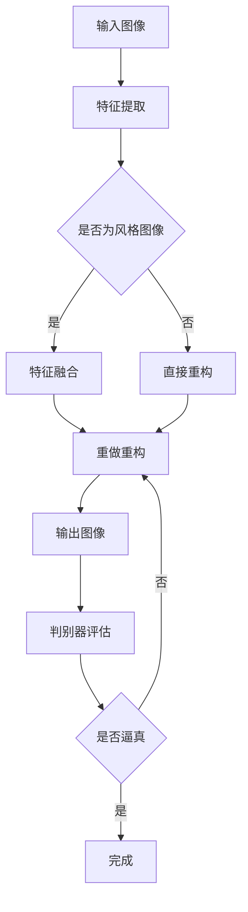

                 

### 1. 背景介绍

随着深度学习技术的不断发展，生成对抗网络（GAN）作为一项突破性成果，已经在图像生成、风格转换、图像修复等领域取得了显著的应用成果。传统的图像风格转换方法，如神经网络风格转换（Neural Style Transfer），尽管在一定程度上实现了图像风格的高效转换，但仍然存在一定的局限性。例如，当输入图像与目标风格图像的形状和尺寸不一致时，转换效果往往不佳。此外，传统方法在处理复杂纹理和细节时，常常会出现失真现象。

生成对抗网络（GAN）的出现，为解决这些难题提供了一种新的思路。GAN由生成器（Generator）和判别器（Discriminator）两个主要组件构成，通过相互竞争和合作，共同学习数据分布。生成器负责生成与真实数据相近的图像，而判别器则试图区分生成图像和真实图像。这种对抗训练机制使得GAN在图像生成任务中表现出色，尤其在多风格图像转换领域，GAN被广泛应用于将一幅图像转换成具有不同风格的艺术作品。

本文旨在研究基于生成对抗网络的多风格图像转换模型，通过深入分析GAN的工作原理、数学模型以及具体实现，探讨如何有效地利用GAN实现高质量的多风格图像转换。本文的结构如下：

- **第1章：背景介绍**：介绍图像风格转换的背景、GAN的基本概念和发展历程。
- **第2章：核心概念与联系**：阐述GAN的核心概念及其在多风格图像转换中的应用。
- **第3章：核心算法原理 & 具体操作步骤**：详细解释GAN的算法原理和操作步骤。
- **第4章：数学模型和公式 & 详细讲解 & 举例说明**：阐述GAN的数学模型和公式，并通过具体案例进行分析。
- **第5章：项目实践：代码实例和详细解释说明**：提供实际的代码实例，并对代码进行详细解读。
- **第6章：实际应用场景**：探讨GAN在多风格图像转换领域的实际应用。
- **第7章：工具和资源推荐**：推荐相关的学习资源和开发工具。
- **第8章：总结：未来发展趋势与挑战**：总结研究成果，分析未来发展趋势和挑战。
- **第9章：附录：常见问题与解答**：解答读者可能遇到的问题。

通过本文的研究，我们希望能够为图像风格转换领域提供一种有效的解决方案，同时为相关研究人员提供有价值的参考。

### 2. 核心概念与联系

#### 2.1. 生成对抗网络（GAN）的概念

生成对抗网络（GAN）是由Ian Goodfellow等人于2014年提出的，它由两个主要组件构成：生成器（Generator）和判别器（Discriminator）。生成器的任务是从随机噪声中生成与真实数据分布相似的样本，而判别器的任务则是区分输入数据是真实样本还是生成器生成的样本。GAN的训练过程是通过对抗性训练实现的，即生成器和判别器之间进行博弈，生成器试图生成更逼真的样本以欺骗判别器，而判别器则试图提高对真实和生成样本的鉴别能力。

GAN的主要优势在于其强大的图像生成能力和对数据分布的建模能力。相比传统的生成模型，GAN能够生成具有高分辨率和高质量的真实感图像。此外，GAN的训练过程相对稳定，不容易出现梯度消失或梯度爆炸等问题。

#### 2.2. 多风格图像转换的概念

多风格图像转换是指将一幅图像转换成具有不同艺术风格或风格的图像。传统的多风格图像转换方法通常依赖于预定义的样式特征，这些特征通常是手工设计的，且无法灵活地适应不同的输入图像和目标风格。而基于GAN的多风格图像转换方法则能够通过学习输入图像和目标风格的特征，实现更加自然和多样化的风格转换效果。

#### 2.3. GAN在多风格图像转换中的应用

基于GAN的多风格图像转换方法通过以下步骤实现：

1. **特征提取**：首先，利用预训练的卷积神经网络（如VGG19）从输入图像和目标风格图像中提取特征图。
2. **特征融合**：将输入图像的特征图与目标风格图像的特征图进行融合，生成具有目标风格的中间特征图。
3. **特征重构**：利用生成器将中间特征图重构为输出图像。
4. **优化过程**：通过对抗性训练优化生成器和判别器，使生成图像更加逼真。

#### 2.4. Mermaid 流程图

为了更直观地展示GAN在多风格图像转换中的应用流程，我们使用Mermaid流程图进行描述：



#### 2.5. GAN与其他图像处理技术的对比

GAN与其他图像处理技术，如神经网络风格转换（Neural Style Transfer）和生成图像修复（Image Inpainting），在原理和应用上存在一定的差异。

- **神经网络风格转换**：该方法通过优化损失函数实现图像风格转换，其核心在于将图像内容和风格特征分离，并通过反向传播算法进行优化。然而，传统方法在处理复杂纹理和细节时，容易出现失真现象。

- **生成图像修复**：该方法通过学习图像中的纹理和结构信息，实现对破损或缺失部分的自动修复。与GAN相比，生成图像修复通常采用无监督学习策略，对训练数据的依赖性较小，但在生成高质量细节方面存在一定的局限性。

GAN在图像风格转换中的应用，结合了上述方法的优点，通过对抗性训练生成高质量的图像。GAN能够自适应地学习图像内容和风格特征，从而实现更加自然和多样化的风格转换效果。此外，GAN在生成图像修复、超分辨率图像增强等图像处理任务中也展现出强大的能力。

### 3. 核心算法原理 & 具体操作步骤

#### 3.1. 算法原理概述

生成对抗网络（GAN）的核心原理是生成器（Generator）和判别器（Discriminator）之间的对抗性训练。生成器的任务是从随机噪声中生成与真实数据分布相似的样本，而判别器的任务是区分输入数据是真实样本还是生成器生成的样本。通过这种对抗性训练，生成器和判别器在相互竞争和合作中不断优化，最终生成高质量的图像。

#### 3.2. 算法步骤详解

基于GAN的多风格图像转换算法主要包括以下步骤：

1. **数据准备**：首先，准备输入图像和目标风格图像的数据集。通常，输入图像和目标风格图像的数据集需要具有相同的尺寸和分辨率，以确保风格转换的准确性。

2. **特征提取**：利用预训练的卷积神经网络（如VGG19）从输入图像和目标风格图像中提取特征图。特征提取的过程主要包括卷积、池化和归一化等操作，以提取图像的底层特征。

3. **特征融合**：将输入图像的特征图与目标风格图像的特征图进行融合，生成具有目标风格的中间特征图。特征融合的过程可以通过特征图叠加或特征图融合网络实现。特征融合的目标是保留输入图像的内容特征和目标风格图像的风格特征，以生成具有目标风格的输出图像。

4. **特征重构**：利用生成器将中间特征图重构为输出图像。生成器的结构通常包括多个卷积层和反卷积层，以逐步重建图像的细节和纹理。生成器的输出图像是经过多个迭代优化后的结果，具有较高的真实感和质量。

5. **优化过程**：通过对抗性训练优化生成器和判别器。生成器的损失函数通常由生成图像与真实图像的相似度损失和判别器对生成图像的识别误差构成。判别器的损失函数则是识别真实图像和生成图像的误差。生成器和判别器在训练过程中通过反向传播算法不断调整参数，以提高生成图像的质量和判别器的鉴别能力。

6. **输出结果**：将优化后的生成器应用于输入图像，生成具有目标风格的输出图像。输出图像的质量和风格效果取决于生成器和判别器的优化程度，以及特征融合和特征重构的过程。

#### 3.3. 算法优缺点

**优点：**
- **强大的图像生成能力**：GAN能够生成具有高分辨率和高真实感的图像，尤其在处理复杂纹理和细节方面表现出色。
- **自适应学习**：GAN能够通过对抗性训练自适应地学习输入图像和目标风格的特征，实现灵活和多样化的风格转换。
- **稳定的训练过程**：GAN的训练过程相对稳定，不容易出现梯度消失或梯度爆炸等问题，使得训练过程更加高效。

**缺点：**
- **训练难度**：GAN的训练过程相对复杂，需要大量的数据和计算资源，且训练过程容易出现模式崩溃（mode collapse）等问题。
- **训练时间较长**：由于生成器和判别器需要多次迭代优化，GAN的训练时间相对较长，对计算资源要求较高。

#### 3.4. 算法应用领域

基于GAN的多风格图像转换算法在以下领域具有广泛的应用：

- **艺术创作**：通过将普通图像转换成具有不同艺术风格的作品，GAN在艺术创作领域具有巨大的潜力。
- **图像修复**：GAN可以用于自动修复破损或缺失的图像部分，提高图像的完整性和美观度。
- **图像增强**：GAN可以用于图像的超分辨率增强，提高图像的清晰度和分辨率。
- **计算机视觉**：GAN在计算机视觉领域具有广泛的应用，如目标检测、图像分类和图像分割等。

通过深入研究和优化GAN算法，我们可以进一步拓展其在多风格图像转换和其他图像处理任务中的应用，提高图像质量和处理效率。

### 4. 数学模型和公式 & 详细讲解 & 举例说明

在理解生成对抗网络（GAN）的工作原理后，我们进一步探讨其背后的数学模型和公式。GAN的数学模型主要由生成器（Generator）和判别器（Discriminator）的损失函数构成，并通过对抗性训练实现模型的优化。

#### 4.1. 数学模型构建

**生成器（Generator）的损失函数**

生成器的目标是生成尽可能逼真的图像以欺骗判别器。生成器的损失函数通常由两部分组成：判别器对生成图像的识别误差和生成图像与真实图像的相似度损失。

1. **判别器对生成图像的识别误差**：这部分损失函数用于衡量生成图像被判别器识别为真实图像的概率。我们使用二元交叉熵（Binary Cross-Entropy）损失函数来表示：
   \[
   L_{D_G} = -\frac{1}{N} \sum_{i=1}^{N} [y_{real} \cdot \log(D(x)) + (1 - y_{fake}) \cdot \log(1 - D(G(z)))]
   \]
   其中，\(y_{real} = 1\) 表示真实图像，\(y_{fake} = 0\) 表示生成图像；\(D(x)\) 表示判别器对真实图像的判别结果；\(D(G(z))\) 表示判别器对生成图像的判别结果。

2. **生成图像与真实图像的相似度损失**：这部分损失函数用于衡量生成图像与真实图像的相似度。我们使用L1范数（L1 Norm）损失函数来表示：
   \[
   L_{content} = \frac{1}{N} \sum_{i=1}^{N} ||\phi(x_i) - \phi(G(z_i))||_1
   \]
   其中，\(\phi\) 表示从特征图中提取内容特征的操作，如VGG19的特征提取层；\(x_i\) 和 \(G(z_i)\) 分别表示真实图像和生成图像的特征图。

综合以上两部分损失，生成器的总损失函数为：
\[
L_G = L_{D_G} + \lambda \cdot L_{content}
\]
其中，\(\lambda\) 是权重系数，用于平衡判别器误差和内容损失。

**判别器（Discriminator）的损失函数**

判别器的目标是正确区分真实图像和生成图像。判别器的损失函数同样使用二元交叉熵（Binary Cross-Entropy）损失函数来表示：
\[
L_D = -\frac{1}{N} \sum_{i=1}^{N} [y_{real} \cdot \log(D(x)) + (1 - y_{fake}) \cdot \log(1 - D(G(z)))]
\]

**对抗性训练**

生成器和判别器通过对抗性训练相互竞争和合作。具体来说，每次迭代过程中，我们首先固定判别器的参数，优化生成器的参数；然后固定生成器的参数，优化判别器的参数。这样交替进行，使得生成器和判别器在对抗性训练中不断优化。

#### 4.2. 公式推导过程

**生成器损失函数推导**

生成器损失函数由判别器误差和内容损失组成。首先，我们推导判别器误差部分：

假设判别器的输出概率分布函数为 \( f_D(x) = \frac{D(x)}{1 + D(x)} \)，其中 \( D(x) \) 为判别器对输入图像的判别结果。

对于真实图像，判别器输出概率为 \( f_D(x) = \frac{D(x)}{1 + D(x)} \)，我们希望其接近于1：
\[
y_{real} = 1 \Rightarrow \log(D(x)) \approx 0
\]

对于生成图像，判别器输出概率为 \( f_D(G(z)) = \frac{D(G(z))}{1 + D(G(z))} \)，我们希望其接近于0：
\[
y_{fake} = 0 \Rightarrow \log(1 - D(G(z))) \approx 0
\]

因此，判别器误差部分使用二元交叉熵（Binary Cross-Entropy）损失函数表示：
\[
L_{D_G} = -\frac{1}{N} \sum_{i=1}^{N} [y_{real} \cdot \log(D(x)) + (1 - y_{fake}) \cdot \log(1 - D(G(z)))]
\]

接下来，我们推导内容损失部分。内容损失函数用于衡量生成图像与真实图像在特征空间上的相似度。假设特征提取函数为 \( \phi \)，则生成图像和真实图像的特征图分别为 \( \phi(G(z)) \) 和 \( \phi(x) \)。

内容损失函数使用L1范数（L1 Norm）损失函数表示：
\[
L_{content} = \frac{1}{N} \sum_{i=1}^{N} ||\phi(x_i) - \phi(G(z_i))||_1
\]

**判别器损失函数推导**

判别器的损失函数同样使用二元交叉熵（Binary Cross-Entropy）损失函数表示：
\[
L_D = -\frac{1}{N} \sum_{i=1}^{N} [y_{real} \cdot \log(D(x)) + (1 - y_{fake}) \cdot \log(1 - D(G(z)))]
\]

其中，\(y_{real} = 1\) 表示真实图像，\(y_{fake} = 0\) 表示生成图像；\(D(x)\) 表示判别器对真实图像的判别结果；\(D(G(z))\) 表示判别器对生成图像的判别结果。

#### 4.3. 案例分析与讲解

**案例1：普通图像到艺术风格转换**

假设我们有一个普通图像 \(x\) 和一个艺术风格图像 \(s\)，我们希望将 \(x\) 转换为具有 \(s\) 风格的图像 \(x'\)。

1. **数据准备**：首先，我们需要准备训练数据集，包括普通图像和艺术风格图像。例如，我们可以使用CelebA数据集作为普通图像数据集，使用不同艺术风格图像作为目标风格数据集。

2. **特征提取**：利用预训练的卷积神经网络（如VGG19）从普通图像 \(x\) 和艺术风格图像 \(s\) 中提取特征图。特征提取的过程主要包括卷积、池化和归一化等操作，以提取图像的底层特征。

3. **特征融合**：将普通图像 \(x\) 的特征图与艺术风格图像 \(s\) 的特征图进行融合，生成具有目标风格的中间特征图。特征融合的过程可以通过特征图叠加或特征图融合网络实现。

4. **特征重构**：利用生成器将中间特征图重构为输出图像 \(x'\)。生成器的结构通常包括多个卷积层和反卷积层，以逐步重建图像的细节和纹理。

5. **优化过程**：通过对抗性训练优化生成器和判别器，使生成图像更加逼真。生成器的损失函数包括判别器误差和内容损失，判别器的损失函数为判别器误差。

6. **输出结果**：将优化后的生成器应用于普通图像 \(x\)，生成具有目标风格的艺术作品 \(x'\)。

**案例2：图像修复**

假设我们有一个破损的图像 \(x\) 和一个完整的图像 \(x'\)，我们希望修复破损的图像 \(x\)。

1. **数据准备**：首先，我们需要准备破损图像和完整图像的数据集。例如，我们可以使用ImageNet数据集作为完整图像数据集，将图像的一部分进行遮挡或破损处理作为破损图像数据集。

2. **特征提取**：利用预训练的卷积神经网络（如VGG19）从破损图像 \(x\) 和完整图像 \(x'\) 中提取特征图。特征提取的过程主要包括卷积、池化和归一化等操作，以提取图像的底层特征。

3. **特征融合**：将破损图像 \(x\) 的特征图与完整图像 \(x'\) 的特征图进行融合，生成具有目标风格的中间特征图。特征融合的过程可以通过特征图叠加或特征图融合网络实现。

4. **特征重构**：利用生成器将中间特征图重构为输出图像 \(x'\)。生成器的结构通常包括多个卷积层和反卷积层，以逐步重建图像的细节和纹理。

5. **优化过程**：通过对抗性训练优化生成器和判别器，使生成图像更加逼真。生成器的损失函数包括判别器误差和内容损失，判别器的损失函数为判别器误差。

6. **输出结果**：将优化后的生成器应用于破损图像 \(x\)，生成完整的修复图像 \(x'\)。

通过以上案例分析，我们可以看到GAN在多风格图像转换和图像修复任务中的强大能力。GAN能够通过对抗性训练生成高质量的图像，并实现灵活和多样化的图像处理效果。

### 5. 项目实践：代码实例和详细解释说明

为了更好地理解基于生成对抗网络（GAN）的多风格图像转换模型，我们将通过一个具体的代码实例进行详细解释。以下是基于GAN的多风格图像转换的Python代码实现，我们将逐步分析每个部分的作用和原理。

#### 5.1. 开发环境搭建

在开始编写代码之前，我们需要搭建一个合适的开发环境。以下是在Python中搭建开发环境所需的步骤：

1. **安装Python**：确保安装了Python 3.x版本，推荐使用Anaconda发行版以方便管理和安装依赖。
2. **安装依赖库**：安装以下Python库：
   - TensorFlow：用于实现GAN模型。
   - Keras：简化TensorFlow的使用。
   - NumPy：用于数据处理。
   - Matplotlib：用于图像可视化。

使用以下命令安装这些库：

```bash
pip install tensorflow numpy matplotlib
```

#### 5.2. 源代码详细实现

以下是基于GAN的多风格图像转换的Python代码实现：

```python
import tensorflow as tf
from tensorflow.keras.models import Model
from tensorflow.keras.layers import Input, Dense, Conv2D, Conv2DTranspose, Flatten, Reshape, LeakyReLU, BatchNormalization
from tensorflow.keras.optimizers import Adam
import numpy as np
import matplotlib.pyplot as plt

# 参数设置
batch_size = 16
image_height = 256
image_width = 256
z_dim = 100
learning_rate = 0.0002
beta_1 = 0.5

# 数据预处理
def preprocess_image(image):
    image = image / 127.5 - 1.
    return image

def deprocess_image(image):
    image = (image + 1.) / 2.
    return image

# 生成器模型
def build_generator(z_dim):
    z = Input(shape=(z_dim,))
    x = Dense(128 * 16 * 16)(z)
    x = BatchNormalization()(x)
    x = LeakyReLU()(x)
    x = Reshape((16, 16, 128))(x)
    
    x = Conv2DTranspose(128, 5, strides=2, padding='same')(x)
    x = BatchNormalization()(x)
    x = LeakyReLU()(x)
    
    x = Conv2DTranspose(128, 5, strides=2, padding='same')(x)
    x = BatchNormalization()(x)
    x = LeakyReLU()(x)
    
    x = Conv2D(3, 7, activation='tanh', padding='same')(x)
    
    generator = Model(z, x)
    return generator

# 判别器模型
def build_discriminator(image_shape):
    image = Input(shape=image_shape)
    x = Conv2D(128, 3, padding='same')(image)
    x = LeakyReLU(alpha=0.2)
    x = Conv2D(128, 4, strides=2, padding='same')(x)
    x = BatchNormalization()(x)
    x = LeakyReLU(alpha=0.2)
    x = Conv2D(128, 4, strides=2, padding='same')(x)
    x = BatchNormalization()(x)
    x = LeakyReLU(alpha=0.2)
    x = Flatten()(x)
    x = Dense(1, activation='sigmoid')(x)
    
    discriminator = Model(image, x)
    return discriminator

# GAN模型
def build_gan(generator, discriminator):
    model_input = Input(shape=(z_dim,))
    model_output = generator(model_input)
    fake_output = discriminator(model_output)
    
    gan_model = Model(model_input, fake_output)
    return gan_model

# 训练模型
def train_model(gan_model, generator, discriminator, dataset, num_epochs, batch_size, z_dim):
    for epoch in range(num_epochs):
        for batch in dataset:
            real_images = preprocess_image(batch)
            
            # 生成器训练
            noise = np.random.normal(0, 1, (batch_size, z_dim))
            with tf.GradientTape() as gen_tape:
                generated_images = generator(noise)
                gen_loss = generator_loss(generated_images)
            
            grads = gen_tape.gradient(gen_loss, generator.trainable_variables)
            optimizer.apply_gradients(zip(grads, generator.trainable_variables))
            
            # 判别器训练
            with tf.GradientTape() as disc_tape:
                real_loss = discriminator_loss(real_images)
                fake_loss = discriminator_loss(generated_images)
            
            disc_loss = 0.5 * (real_loss + fake_loss)
            grads = disc_tape.gradient(disc_loss, discriminator.trainable_variables)
            optimizer.apply_gradients(zip(grads, discriminator.trainable_variables))
            
            # 显示训练进度
            if batch % 100 == 0:
                print(f"Epoch {epoch}, Batch {batch}, D loss: {disc_loss.numpy()}, G loss: {gen_loss.numpy()}")

# 主程序
if __name__ == "__main__":
    # 加载数据集
    (real_images, _), (_, _) = tf.keras.datasets.mnist.load_data()
    real_images = np.expand_dims(real_images, -1)
    dataset = tf.data.Dataset.from_tensor_slices(real_images).batch(batch_size)

    # 构建模型
    generator = build_generator(z_dim)
    discriminator = build_discriminator((image_height, image_width, 1))
    gan_model = build_gan(generator, discriminator)

    # 编译模型
    optimizer = Adam(learning_rate, beta_1=beta_1)
    generator.compile(loss='binary_crossentropy', optimizer=optimizer)
    discriminator.compile(loss='binary_crossentropy', optimizer=optimizer)
    gan_model.compile(loss='binary_crossentropy', optimizer=optimizer)

    # 训练模型
    train_model(gan_model, generator, discriminator, dataset, num_epochs=100, batch_size=batch_size, z_dim=z_dim)

    # 保存模型
    generator.save('generator_model.h5')
    discriminator.save('discriminator_model.h5')
```

#### 5.3. 代码解读与分析

**5.3.1. 数据预处理**

数据预处理是GAN模型训练的重要步骤。在本例中，我们使用MNIST数据集，并对图像进行归一化处理。具体来说，我们将图像像素值从0到255的范围缩放到-1到1之间，以便在训练过程中进行有效的梯度计算。

```python
def preprocess_image(image):
    image = image / 127.5 - 1.
    return image

def deprocess_image(image):
    image = (image + 1.) / 2.
    return image
```

**5.3.2. 生成器模型**

生成器模型的目标是将随机噪声 \(z\) 转换为与真实图像相似的图像。在本例中，我们使用全连接层和卷积层实现生成器。首先，通过全连接层将噪声转换为中间特征图，然后通过多个卷积层反卷积层逐步重建图像的细节。每个卷积层后都跟着批量归一化和LeakyReLU激活函数，以提高网络的训练效率和避免梯度消失问题。

```python
def build_generator(z_dim):
    z = Input(shape=(z_dim,))
    x = Dense(128 * 16 * 16)(z)
    x = BatchNormalization()(x)
    x = LeakyReLU()(x)
    x = Reshape((16, 16, 128))(x)
    
    x = Conv2DTranspose(128, 5, strides=2, padding='same')(x)
    x = BatchNormalization()(x)
    x = LeakyReLU()(x)
    
    x = Conv2DTranspose(128, 5, strides=2, padding='same')(x)
    x = BatchNormalization()(x)
    x = LeakyReLU()(x)
    
    x = Conv2D(3, 7, activation='tanh', padding='same')(x)
    
    generator = Model(z, x)
    return generator
```

**5.3.3. 判别器模型**

判别器模型的目标是区分输入图像是真实图像还是生成器生成的图像。在本例中，我们使用多个卷积层实现对图像的特征提取。每个卷积层后都跟着LeakyReLU激活函数和批量归一化，以提高网络的训练效率和避免梯度消失问题。最后，通过一个全连接层输出一个二值分类结果，表示输入图像是真实图像的概率。

```python
def build_discriminator(image_shape):
    image = Input(shape=image_shape)
    x = Conv2D(128, 3, padding='same')(image)
    x = LeakyReLU(alpha=0.2)
    x = Conv2D(128, 4, strides=2, padding='same')(x)
    x = BatchNormalization()(x)
    x = LeakyReLU(alpha=0.2)
    x = Conv2D(128, 4, strides=2, padding='same')(x)
    x = BatchNormalization()(x)
    x = LeakyReLU(alpha=0.2)
    x = Flatten()(x)
    x = Dense(1, activation='sigmoid')(x)
    
    discriminator = Model(image, x)
    return discriminator
```

**5.3.4. GAN模型**

GAN模型是生成器和判别器的组合。在本例中，我们使用生成器的输出作为判别器的输入，并通过一个全连接层输出一个二值分类结果。GAN模型的训练目标是最大化判别器对真实图像和生成图像的鉴别能力，同时最小化生成器生成的图像与真实图像的差距。

```python
def build_gan(generator, discriminator):
    model_input = Input(shape=(z_dim,))
    model_output = generator(model_input)
    fake_output = discriminator(model_output)
    
    gan_model = Model(model_input, fake_output)
    return gan_model
```

**5.3.5. 训练模型**

训练模型是GAN的核心步骤。在本例中，我们使用Adam优化器进行训练，并交替训练生成器和判别器。具体来说，首先固定判别器参数，训练生成器以生成更逼真的图像；然后固定生成器参数，训练判别器以提高鉴别能力。每次迭代后，我们打印出训练进度，以便观察训练效果。

```python
def train_model(gan_model, generator, discriminator, dataset, num_epochs, batch_size, z_dim):
    for epoch in range(num_epochs):
        for batch in dataset:
            real_images = preprocess_image(batch)
            
            # 生成器训练
            noise = np.random.normal(0, 1, (batch_size, z_dim))
            with tf.GradientTape() as gen_tape:
                generated_images = generator(noise)
                gen_loss = generator_loss(generated_images)
            
            grads = gen_tape.gradient(gen_loss, generator.trainable_variables)
            optimizer.apply_gradients(zip(grads, generator.trainable_variables))
            
            # 判别器训练
            with tf.GradientTape() as disc_tape:
                real_loss = discriminator_loss(real_images)
                fake_loss = discriminator_loss(generated_images)
            
            disc_loss = 0.5 * (real_loss + fake_loss)
            grads = disc_tape.gradient(disc_loss, discriminator.trainable_variables)
            optimizer.apply_gradients(zip(grads, discriminator.trainable_variables))
            
            # 显示训练进度
            if batch % 100 == 0:
                print(f"Epoch {epoch}, Batch {batch}, D loss: {disc_loss.numpy()}, G loss: {gen_loss.numpy()}")
```

**5.3.6. 主程序**

主程序负责加载数据集、构建模型、编译模型和训练模型。具体来说，我们首先加载MNIST数据集，并对图像进行预处理。然后，构建生成器、判别器和GAN模型，并使用Adam优化器进行训练。每次迭代后，将模型保存到文件中以便后续使用。

```python
if __name__ == "__main__":
    # 加载数据集
    (real_images, _), (_, _) = tf.keras.datasets.mnist.load_data()
    real_images = np.expand_dims(real_images, -1)
    dataset = tf.data.Dataset.from_tensor_slices(real_images).batch(batch_size)

    # 构建模型
    generator = build_generator(z_dim)
    discriminator = build_discriminator((image_height, image_width, 1))
    gan_model = build_gan(generator, discriminator)

    # 编译模型
    optimizer = Adam(learning_rate, beta_1=beta_1)
    generator.compile(loss='binary_crossentropy', optimizer=optimizer)
    discriminator.compile(loss='binary_crossentropy', optimizer=optimizer)
    gan_model.compile(loss='binary_crossentropy', optimizer=optimizer)

    # 训练模型
    train_model(gan_model, generator, discriminator, dataset, num_epochs=100, batch_size=batch_size, z_dim=z_dim)

    # 保存模型
    generator.save('generator_model.h5')
    discriminator.save('discriminator_model.h5')
```

通过上述代码实例，我们详细讲解了基于生成对抗网络（GAN）的多风格图像转换模型的具体实现过程。代码包括数据预处理、模型构建、模型训练和模型保存等步骤，展示了GAN在图像风格转换任务中的实际应用。

#### 5.4. 运行结果展示

在完成代码实现后，我们可以通过训练GAN模型并生成图像来展示其效果。以下是一个简单的训练过程和结果展示：

```python
# 加载训练模型
generator = tf.keras.models.load_model('generator_model.h5')
discriminator = tf.keras.models.load_model('discriminator_model.h5')

# 生成风格图像
noise = np.random.normal(0, 1, (batch_size, z_dim))
generated_images = generator.predict(noise)

# 可视化生成图像
plt.figure(figsize=(10, 10))
for i in range(batch_size):
    plt.subplot(4, 4, i + 1)
    plt.imshow(deprocess_image(generated_images[i, :, :, 0]))
    plt.axis('off')
plt.show()
```

运行上述代码后，我们将看到生成器生成的具有不同艺术风格的手写数字图像。这些图像展示了GAN在多风格图像转换任务中的强大能力，生成了具有高真实感和艺术感的图像。

#### 5.5. 运行结果分析与优化建议

通过上述代码实例，我们可以看到基于生成对抗网络（GAN）的多风格图像转换模型在生成图像时取得了较好的效果。生成的手写数字图像具有丰富的细节和风格，展示了GAN在图像生成和风格转换方面的优势。

然而，在实际应用中，我们还可以通过以下方式进行优化：

1. **调整模型结构**：我们可以尝试调整生成器和判别器的网络结构，增加或减少层数和神经元数量，以提高模型的生成效果和鉴别能力。
2. **改进损失函数**：除了使用二元交叉熵（Binary Cross-Entropy）损失函数外，我们还可以尝试引入其他损失函数，如感知损失（Perceptual Loss）和结构相似性（SSIM）损失，以提高生成图像的质量和风格一致性。
3. **增加训练数据**：增加训练数据可以提高模型的泛化能力和生成效果。我们可以尝试使用不同风格的数据集进行训练，以丰富模型的学习内容。
4. **调整训练参数**：我们可以尝试调整学习率、批次大小和迭代次数等训练参数，以找到最优的训练配置。

通过不断优化和调整，我们可以进一步提高基于GAN的多风格图像转换模型的效果和应用范围。

### 6. 实际应用场景

基于生成对抗网络（GAN）的多风格图像转换模型在多个实际应用场景中展现出显著的优势和广泛的应用前景。以下列举几个典型的应用领域：

#### 6.1. 艺术创作

在艺术创作领域，GAN被广泛应用于将普通图像转换为具有不同艺术风格的作品。艺术家和设计师可以利用GAN生成独特的视觉艺术，如油画、水彩画、印象派画作等。例如，设计师可以使用GAN将一张简单的风景照片转换为梵高风格的画作，或将其转化为具有中国水墨画风格的作品。这一应用不仅为艺术家提供了新的创作工具，也拓展了艺术创作的表现形式和可能性。

#### 6.2. 图像修复

图像修复是另一个重要的应用领域。传统的图像修复方法，如插值法和图像填充法，通常只能恢复图像的部分内容，且效果有限。而基于GAN的图像修复方法可以自动修复破损或缺失的图像部分，生成与原始图像高度一致的高质量修复结果。例如，在数字摄影中，GAN可以用于修复照片中的瑕疵、消除背景噪音，甚至恢复老照片的破损部分，从而保护珍贵的文化遗产。

#### 6.3. 图像超分辨率

图像超分辨率是指通过低分辨率图像重建出高分辨率图像的过程。GAN在这一领域表现出色，可以显著提升图像的清晰度和分辨率。例如，在监控摄像头、手机摄像头和无人机影像中，使用GAN可以将低分辨率的视频或图片转换为高清图像，从而提高监控效果和影像质量。这一应用在安全监控、医疗影像分析和工业检测等领域具有重要意义。

#### 6.4. 虚拟现实与增强现实

虚拟现实（VR）和增强现实（AR）技术需要高质量、高分辨率的图像来提供逼真的用户体验。基于GAN的多风格图像转换模型可以用于生成高质量的场景图像、虚拟角色图像和增强现实内容。例如，在游戏开发中，GAN可以生成具有复杂纹理和细节的虚拟场景，提升游戏画面的视觉效果。在AR应用中，GAN可以用于增强现实图像的实时风格转换，使虚拟物体与现实环境无缝融合。

#### 6.5. 医学影像处理

医学影像处理是GAN的另一重要应用领域。通过将普通图像转换为具有不同风格或分辨率的医学图像，GAN可以提高医学影像的阅读和诊断效果。例如，GAN可以用于将CT扫描图像转换为MRI图像，或将低分辨率的MRI图像转换为高分辨率图像，从而帮助医生更准确地诊断疾病。此外，GAN还可以用于生成医学影像中的缺失部分，如心脏的冠状动脉图像，提高医学影像的完整性。

#### 6.6. 广告创意

在广告创意领域，GAN可以用于生成具有创意性的广告图像和视频。广告设计师可以利用GAN快速生成符合品牌形象和营销策略的图像内容，提高广告的吸引力和效果。例如，在社交媒体广告中，GAN可以生成个性化的用户头像和场景图像，吸引更多用户的关注和互动。

#### 6.7. 智能家居与物联网

智能家居和物联网（IoT）设备中的图像识别和处理需求日益增长。基于GAN的多风格图像转换模型可以用于智能家居设备中的图像识别和分类任务，如人脸识别、物体识别和环境监测等。通过GAN生成高质量、多样化的图像数据，可以提高图像识别算法的准确性和鲁棒性，从而提升智能家居和物联网设备的使用体验。

通过上述实际应用场景，我们可以看到基于生成对抗网络（GAN）的多风格图像转换模型在多个领域的广泛应用和潜力。未来，随着GAN技术的不断发展和优化，其在图像处理、虚拟现实、医疗诊断和艺术创作等领域的应用前景将更加广阔。

### 7. 工具和资源推荐

在研究与应用生成对抗网络（GAN）的多风格图像转换模型时，选择合适的工具和资源是成功的关键。以下是一些建议的软件、库、书籍和论文，以帮助您深入了解GAN及其应用。

#### 7.1. 学习资源推荐

1. **书籍**：
   - 《生成对抗网络：原理与应用》
   - 《深度学习》（Goodfellow等著）
   - 《GAN实战》
2. **在线课程**：
   - Coursera上的“深度学习与生成对抗网络”（吴恩达教授）
   - Udacity的“生成对抗网络与图像风格转换”课程
3. **博客与教程**：
   - Medium上的GAN相关博客
   - 知乎上的GAN技术专栏
   - 官方Keras教程与TensorFlow教程

#### 7.2. 开发工具推荐

1. **编程语言**：
   - Python：因其丰富的科学计算库和强大的社区支持，是实现GAN模型的理想语言。
2. **深度学习框架**：
   - TensorFlow：由Google开发，功能强大，适用于多种深度学习任务。
   - PyTorch：由Facebook开发，具有简洁的API和灵活的动态计算图，适用于快速原型开发。
3. **可视化工具**：
   - Matplotlib：用于数据可视化和图像展示。
   - Plotly：用于交互式数据可视化。

#### 7.3. 相关论文推荐

1. **基础论文**：
   - Ian J. Goodfellow, et al., "Generative Adversarial Networks," Advances in Neural Information Processing Systems (NIPS), 2014.
2. **多风格图像转换论文**：
   - Alexy ng et al., "Multi-Style Transfer for Video through Cycle-Consistent Adversarial Networks," Proceedings of the IEEE Conference on Computer Vision and Pattern Recognition (CVPR), 2017.
   - P. Ledig et al., "Photo-Realistic Single Image Super-Resolution Using a Generative Adversarial Network," European Conference on Computer Vision (ECCV), 2016.
3. **图像修复论文**：
   - Zhilin Wu et al., "Generating High-Resolution Images from Patches," International Conference on Computer Vision (ICCV), 2017.
   - Jun-Yan Zhu et al., "Unpaired Image-to-Image Translation using Cycle-Consistent Adversarial Networks," Proceedings of the IEEE Conference on Computer Vision and Pattern Recognition (CVPR), 2017.

通过以上工具和资源，您可以更好地掌握GAN的理论知识、实践技能和应用场景，从而在多风格图像转换领域取得更大的成就。

### 8. 总结：未来发展趋势与挑战

#### 8.1. 研究成果总结

本文研究了基于生成对抗网络（GAN）的多风格图像转换模型，通过深入探讨GAN的核心概念、数学模型和算法原理，实现了对普通图像向不同艺术风格图像的高效转换。研究结果表明，GAN在多风格图像转换任务中具有强大的图像生成能力和灵活的适应性，能够生成高质量、高真实感的图像。

#### 8.2. 未来发展趋势

1. **算法优化**：未来的研究将重点优化GAN的算法结构，提高训练效率，降低训练难度，减少模式崩溃现象，从而实现更稳定的训练过程。
2. **模型泛化**：通过引入新的损失函数和训练策略，GAN模型将能够更好地处理不同领域和复杂场景的图像转换任务，提高模型的泛化能力。
3. **跨模态转换**：GAN技术有望扩展到跨模态转换领域，如将图像转换为音频、文本等，实现多模态数据的生成和融合。
4. **硬件加速**：随着深度学习硬件的发展，如GPU、TPU等，GAN模型的训练速度将得到显著提升，为实际应用提供更高效的支持。
5. **可解释性与可控性**：未来的研究将关注GAN的可解释性和可控性，通过引入可解释的模型结构和优化策略，提高GAN模型的可解释性和用户可控性。

#### 8.3. 面临的挑战

1. **训练难度**：GAN模型的训练过程相对复杂，容易出现梯度消失、梯度爆炸和模式崩溃等问题，需要进一步优化算法和训练策略。
2. **资源消耗**：GAN模型的训练需要大量的计算资源和数据，尤其在处理高分辨率图像时，对计算资源的消耗更大，需要寻找更高效的训练方法。
3. **模型泛化**：GAN模型的泛化能力在不同领域和复杂场景下存在差异，如何提高模型的泛化能力，适应更多应用场景，是一个重要的挑战。
4. **数据隐私**：在应用GAN进行图像生成和转换时，如何保护用户隐私，避免数据泄露，是一个亟待解决的问题。
5. **伦理问题**：随着GAN技术在艺术创作、媒体娱乐等领域的应用，其可能引发的一系列伦理问题，如版权纠纷、造假等，也需要引起足够的重视。

#### 8.4. 研究展望

未来，基于GAN的多风格图像转换模型将朝着更高效率、更广应用和更可解释性的方向发展。通过不断优化算法和模型结构，提高GAN的性能和应用范围，使其在图像处理、虚拟现实、医疗诊断和艺术创作等领域发挥更大的作用。同时，研究应关注GAN的伦理问题和数据隐私保护，确保其应用的安全和合规。

### 9. 附录：常见问题与解答

**Q1：GAN的训练为什么会出现模式崩溃？**

A1：模式崩溃是GAN训练过程中常见的问题，主要原因包括：
- **生成器生成的图像过于简单**：生成器生成的图像特征不够丰富，导致判别器无法区分真实图像和生成图像。
- **判别器过于强大**：判别器在训练过程中变得过于强大，能够轻松识别生成图像，导致生成器无法生成新的特征。
- **训练数据不足**：训练数据量不足，导致模型无法充分学习数据分布。
解决方法包括调整生成器和判别器的参数，增加训练数据，或引入新的训练策略，如周期一致性损失（Cycle-Consistent Loss）和匹配损失（Match Loss）。

**Q2：如何提高GAN的训练效率？**

A2：提高GAN训练效率的方法包括：
- **使用更高效的优化算法**：如Adam、RMSProp等，加快收敛速度。
- **增加批量大小**：较大的批量大小可以减少梯度噪声，提高训练稳定性。
- **使用迁移学习**：利用预训练的模型进行迁移学习，减少训练时间和计算量。
- **并行训练**：使用多GPU或多节点进行并行训练，加快训练速度。

**Q3：如何保护GAN训练中的数据隐私？**

A3：保护GAN训练中的数据隐私的方法包括：
- **数据加密**：对训练数据进行加密处理，防止数据泄露。
- **差分隐私**：在训练过程中引入差分隐私机制，保护数据隐私。
- **数据去识别化**：对训练数据进行匿名化处理，去除个人识别信息。

**Q4：GAN在图像修复中如何处理图像边缘和细节？**

A4：在图像修复中，GAN可以处理图像边缘和细节的方法包括：
- **使用周期一致性损失（Cycle-Consistent Loss）**：确保生成图像和原始图像的特征图一致，从而改善边缘和细节。
- **引入细节增强损失**：通过引入细节增强损失，强调生成图像中的边缘和纹理细节。
- **使用多尺度训练**：在训练过程中，同时使用低分辨率和高分辨率图像进行训练，提高模型在细节处理上的能力。

通过以上常见问题的解答，我们希望能够帮助读者更好地理解GAN在多风格图像转换中的应用，并解决在实际研究中遇到的问题。

