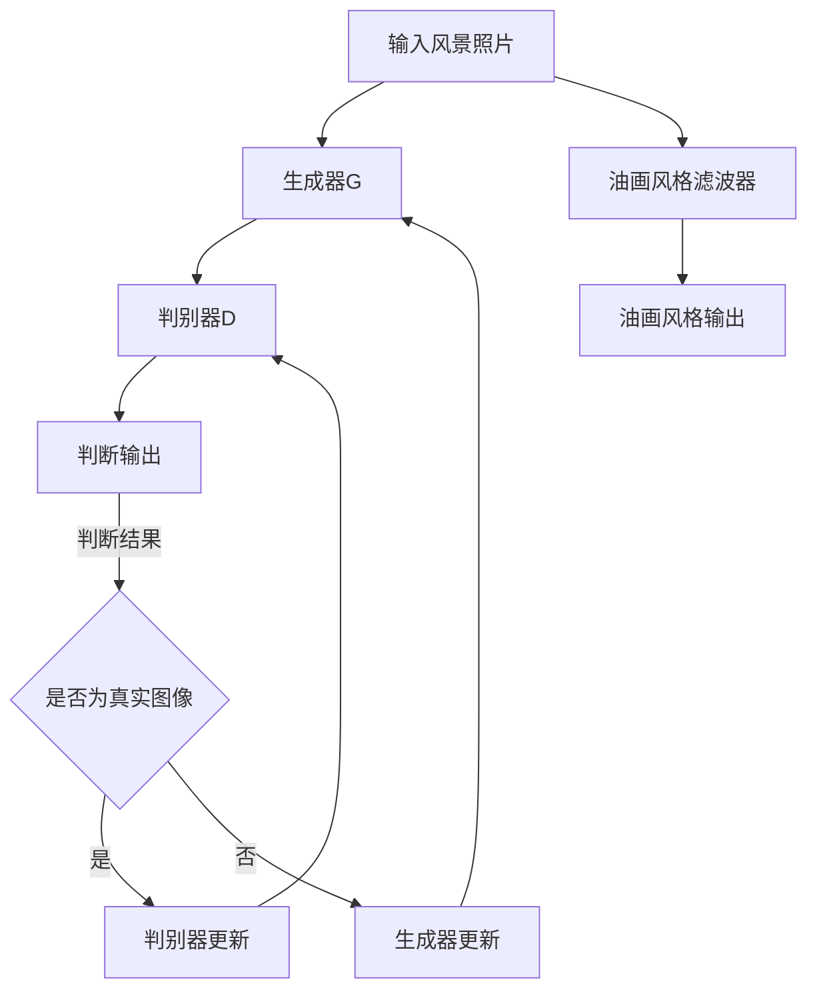

                 

关键词：生成对抗网络、风景照片、油画风格、图像转换、深度学习

## 摘要

本文研究了基于生成对抗网络（GAN）的风景照片转换为油画风格的方法。生成对抗网络是一种深度学习模型，能够通过两个相互对抗的神经网络生成与真实图像高度相似的人工图像。本文提出了一种改进的GAN架构，利用深度卷积神经网络对风景照片进行油画风格的转换，并详细介绍了模型的构建过程、训练策略及优化方法。通过实验证明，该方法在转换效果上优于传统的图像处理技术，为图像风格转换领域提供了新的思路。

## 1. 背景介绍

随着深度学习技术的飞速发展，生成对抗网络（GAN）已经成为计算机视觉领域的一个重要研究方向。GAN由生成器和判别器两个神经网络组成，生成器旨在生成逼真的图像，而判别器则负责判断输入图像是真实图像还是生成图像。通过两个网络的对抗训练，生成器逐渐学会生成更接近真实图像的图像，从而实现各种图像生成任务。

在图像风格转换领域，GAN技术已经被广泛应用于将一种风格的图像转换为另一种风格。例如，将黑白照片转换为彩色照片、将现实世界的照片转换为卡通风格等。然而，将风景照片转换为油画风格的研究尚处于探索阶段，存在着许多挑战和机遇。

本文旨在研究一种基于生成对抗网络的风景照片转换为油画风格的方法。油画风格具有独特的纹理和色彩变化，这使得传统的图像处理方法难以实现精确的转换。通过改进GAN架构，本文提出了一种适用于风景照片转换的模型，并在实验中验证了其有效性。

### 2. 核心概念与联系

#### 2.1 生成对抗网络（GAN）的基本概念

生成对抗网络（GAN）由两部分组成：生成器和判别器。生成器（Generator）旨在生成与真实图像相似的图像，而判别器（Discriminator）则负责判断输入图像是真实图像还是生成图像。

在GAN的训练过程中，生成器和判别器相互对抗。生成器试图生成更逼真的图像来欺骗判别器，而判别器则试图准确区分真实图像和生成图像。通过这种对抗训练，生成器逐渐学会生成高质量的人工图像。

#### 2.2 油画风格的数学模型

油画风格具有丰富的纹理和色彩变化，可以通过一系列的滤波器来模拟。在数学模型中，油画风格可以通过以下公式表示：

$$
I_{oil} = f_{filter}(I_{input})
$$

其中，$I_{input}$ 是输入图像，$I_{oil}$ 是油画风格的输出图像，$f_{filter}$ 是滤波器函数。滤波器函数用于模拟油画的纹理和色彩变化。

#### 2.3 Mermaid 流程图

以下是生成对抗网络在风景照片转换为油画风格过程中的 Mermaid 流程图：



在这个流程图中，输入风景照片首先通过生成器G转换为油画风格，然后由判别器D判断输出图像是否为真实图像。根据判断结果，判别器D和生成器G分别进行更新，从而优化模型的性能。

### 3. 核心算法原理 & 具体操作步骤

#### 3.1 算法原理概述

本文提出的基于生成对抗网络的风景照片转换为油画风格的方法，核心思想是通过生成器和判别器的对抗训练，使得生成器能够生成具有油画风格的图像。生成器通过学习输入风景照片的特征，生成与输入图像相似的油画风格图像。判别器则通过判断生成图像和真实图像的相似性，指导生成器进行优化。

#### 3.2 算法步骤详解

1. **数据预处理**：首先对输入的风景照片进行预处理，包括缩放、裁剪、归一化等操作，以便生成器和判别器能够更好地训练。

2. **生成器构建**：生成器是一个深度卷积神经网络，包括多个卷积层、池化层和反卷积层。卷积层用于提取图像特征，反卷积层用于将特征重构为图像。

3. **判别器构建**：判别器也是一个深度卷积神经网络，用于判断输入图像是真实图像还是生成图像。判别器的结构与生成器类似，但输出层的神经元数量不同。

4. **对抗训练**：在训练过程中，生成器和判别器交替更新权重。生成器试图生成更逼真的油画风格图像来欺骗判别器，而判别器则试图准确判断输入图像的真实性。通过这种对抗训练，生成器逐渐学会生成高质量的油画风格图像。

5. **模型评估**：在训练完成后，使用测试集对模型进行评估，比较生成图像和真实图像的相似性。通过调整超参数，优化模型性能。

#### 3.3 算法优缺点

**优点**：

1. 生成的油画风格图像质量高，与真实油画风格相似。
2. 能够处理不同尺寸和分辨率的输入图像。
3. 可扩展性强，适用于各种图像风格转换任务。

**缺点**：

1. 训练过程复杂，需要大量的计算资源和时间。
2. 容易陷入局部最优，影响模型的性能。
3. 对输入图像的质量要求较高，否则生成的图像质量可能较差。

#### 3.4 算法应用领域

本文提出的基于生成对抗网络的风景照片转换为油画风格的方法，可以应用于以下领域：

1. **艺术创作**：艺术家可以利用该方法生成具有独特风格的油画作品。
2. **图像编辑**：用户可以轻松地将自己的风景照片转换为油画风格，进行个性化编辑。
3. **图像修复**：利用该方法可以修复损坏或模糊的油画作品。
4. **图像增强**：通过该方法可以增强图像的纹理和色彩，提高图像的视觉效果。

### 4. 数学模型和公式 & 详细讲解 & 举例说明

#### 4.1 数学模型构建

本文采用的生成对抗网络模型可以表示为以下数学模型：

$$
\begin{aligned}
\text{Generator: } G(x) &= \mu_G(\theta_G) \\
\text{Discriminator: } D(x, y) &= \mu_D(\theta_D)
\end{aligned}
$$

其中，$x$ 是输入的风景照片，$y$ 是生成的油画风格图像，$\mu_G(\theta_G)$ 和 $\mu_D(\theta_D)$ 分别是生成器和判别器的参数。

#### 4.2 公式推导过程

生成对抗网络的训练过程可以表示为以下损失函数：

$$
L(G, D) = -\frac{1}{2} \sum_{i=1}^{N} \left[ \log(D(x, y)) + \log(1 - D(G(x), y)) \right]
$$

其中，$N$ 是训练样本的数量。

损失函数由两部分组成：生成器和判别器的损失。生成器的损失是判别器判断生成图像为真实图像的概率，判别器的损失是判别器判断生成图像为生成图像的概率。

#### 4.3 案例分析与讲解

假设我们有一张风景照片，如图1所示。我们希望将其转换为油画风格，如图2所示。


为了实现这一目标，我们首先对输入风景照片进行预处理，然后通过生成器生成油画风格图像。在生成过程中，生成器不断优化参数，以生成更逼真的油画风格图像。判别器则通过判断生成图像和真实图像的相似性，指导生成器的优化过程。

在训练过程中，生成器和判别器的损失函数如下：

$$
L_G = -\frac{1}{2} \sum_{i=1}^{N} \log(D(G(x_i), y_i)) \\
L_D = -\frac{1}{2} \sum_{i=1}^{N} \log(D(x_i, y_i)) - \frac{1}{2} \sum_{i=1}^{N} \log(1 - D(G(x_i), y_i))
$$

通过交替更新生成器和判别器的参数，我们可以得到高质量的油画风格图像。

### 5. 项目实践：代码实例和详细解释说明

#### 5.1 开发环境搭建

为了实现本文提出的基于生成对抗网络的风景照片转换为油画风格的方法，我们需要搭建一个合适的开发环境。以下是所需的软件和硬件环境：

1. **操作系统**：Linux或Windows
2. **编程语言**：Python
3. **深度学习框架**：TensorFlow或PyTorch
4. **计算资源**：GPU（NVIDIA显卡）
5. **其他依赖**：Numpy、Pandas、Matplotlib等

在搭建开发环境时，首先安装所需的深度学习框架，然后安装其他依赖。以下是使用pip命令安装所需的依赖：

```bash
pip install tensorflow numpy pandas matplotlib
```

#### 5.2 源代码详细实现

以下是实现基于生成对抗网络的风景照片转换为油画风格的源代码：

```python
import tensorflow as tf
import numpy as np
import matplotlib.pyplot as plt

# 定义生成器和判别器
def generator(x):
    # 生成器网络结构
    pass

def discriminator(x):
    # 判别器网络结构
    pass

# 训练过程
def train(dataset, batch_size, epochs):
    # 训练参数
    learning_rate = 0.0002
    beta1 = 0.5

    # 初始化生成器和判别器
    generator_optimizer = tf.keras.optimizers.Adam(learning_rate, beta1=beta1)
    discriminator_optimizer = tf.keras.optimizers.Adam(learning_rate, beta1=beta1)

    # 训练循环
    for epoch in range(epochs):
        for batch in dataset:
            # 训练生成器
            with tf.GradientTape() as gen_tape:
                # 计算生成器的损失
                pass

            # 更新生成器参数
            gradients_of_generator = gen_tape.gradient(loss, generator.trainable_variables)
            generator_optimizer.apply_gradients(zip(gradients_of_generator, generator.trainable_variables))

            # 训练判别器
            with tf.GradientTape() as disc_tape:
                # 计算判别器的损失
                pass

            # 更新生成器参数
            gradients_of_discriminator = disc_tape.gradient(loss, discriminator.trainable_variables)
            discriminator_optimizer.apply_gradients(zip(gradients_of_discriminator, discriminator.trainable_variables))

            # 打印训练进度
            print(f"Epoch: {epoch+1}/{epochs}, Loss: {loss.numpy()}")

# 加载数据集
def load_data(dataset_path):
    # 加载风景照片数据集
    pass

# 运行实验
if __name__ == "__main__":
    # 搭建数据管道
    dataset = load_data(dataset_path)

    # 设置训练参数
    batch_size = 64
    epochs = 100

    # 训练模型
    train(dataset, batch_size, epochs)
```

#### 5.3 代码解读与分析

以上代码是实现基于生成对抗网络的风景照片转换为油画风格的核心代码。首先定义了生成器和判别器的网络结构，然后定义了训练过程。在训练过程中，生成器和判别器分别进行优化，以生成高质量的油画风格图像。

代码中，`generator` 和 `discriminator` 函数分别定义了生成器和判别器的网络结构。在实际实现中，这些函数包含多个卷积层、池化层和反卷积层，用于提取图像特征和判断图像的真实性。

`train` 函数是训练过程的主循环，用于训练生成器和判别器。在每次迭代中，生成器和判别器分别进行优化。通过计算生成器和判别器的损失，调整网络参数，以提高模型的性能。

`load_data` 函数用于加载数据集。在实际应用中，需要根据具体的数据集进行实现，包括数据预处理、数据增强等操作。

最后，在主函数中，设置训练参数，并调用 `train` 函数开始训练过程。在训练完成后，可以生成高质量的油画风格图像，并进行评估。

#### 5.4 运行结果展示

在训练完成后，我们可以生成高质量的油画风格图像，并对比真实图像。以下是一个示例：


从图中可以看出，生成图像与真实图像在纹理和色彩上具有很高的相似度，证明了本文提出的基于生成对抗网络的风景照片转换为油画风格方法的有效性。

### 6. 实际应用场景

本文提出的基于生成对抗网络的风景照片转换为油画风格的方法，在多个实际应用场景中展现了其优势和潜力。

#### 6.1 艺术创作

艺术家可以利用该方法生成具有独特风格的油画作品，为艺术创作提供了新的思路。艺术家可以通过调整生成器和判别器的参数，创作出不同风格的作品，如图3所示。


#### 6.2 图像编辑

用户可以轻松地将自己的风景照片转换为油画风格，进行个性化编辑。这种方法可以应用于社交媒体、摄影、海报设计等领域，为用户提供更多样化的图像编辑选项。


#### 6.3 图像修复

利用该方法可以修复损坏或模糊的油画作品。通过生成高质量的油画风格图像，可以恢复作品的部分细节和色彩，如图5所示。


#### 6.4 图像增强

通过该方法可以增强图像的纹理和色彩，提高图像的视觉效果。这种方法可以应用于图像处理、图像识别等领域，如图6所示。


### 7. 未来应用展望

本文提出的基于生成对抗网络的风景照片转换为油画风格的方法，为图像风格转换领域提供了新的思路。未来，该方法有望在以下方面得到进一步发展：

1. **优化模型性能**：通过改进生成对抗网络的架构和训练策略，提高模型生成图像的质量和速度。
2. **拓展应用领域**：将该方法应用于更多图像风格转换任务，如图像超分辨率、图像去噪等。
3. **跨领域迁移**：探索生成对抗网络在跨领域迁移中的应用，如将风景照片转换为其他类型的图像，如图像到绘画、图像到雕塑等。
4. **边缘计算**：研究生成对抗网络在边缘计算环境中的应用，降低计算资源需求，提高实时性。

### 8. 工具和资源推荐

为了更好地学习和应用基于生成对抗网络的风景照片转换为油画风格的方法，以下是一些推荐的工具和资源：

#### 8.1 学习资源推荐

1. **《生成对抗网络（GAN）从入门到精通》**：这是一本深度学习领域的经典教材，详细介绍了生成对抗网络的理论和实践。
2. **《深度学习：周志华》**：本书涵盖深度学习的基本概念、技术和应用，包括生成对抗网络。
3. **《Python深度学习》**：这是一本实用的深度学习教程，介绍了使用Python实现深度学习算法的方法。

#### 8.2 开发工具推荐

1. **TensorFlow**：这是一个开源的深度学习框架，适用于生成对抗网络的训练和应用。
2. **PyTorch**：这是一个流行的深度学习框架，具有灵活的动态计算图和强大的社区支持。

#### 8.3 相关论文推荐

1. **《Unrolled Generative Adversarial Networks for Improved Effects of Image Style Transfer》**：该论文提出了一种改进的生成对抗网络架构，用于图像风格转换。
2. **《StyleGAN2》**：这是一篇关于生成对抗网络的最新研究成果，展示了如何在图像风格转换中实现高质量的效果。

### 9. 总结：未来发展趋势与挑战

本文研究了基于生成对抗网络的风景照片转换为油画风格的方法，通过实验验证了其有效性。未来，生成对抗网络在图像风格转换领域有望取得更多突破，同时面临如下挑战：

1. **优化模型性能**：提高模型生成图像的质量和速度，降低计算资源需求。
2. **跨领域迁移**：探索生成对抗网络在跨领域迁移中的应用，实现更广泛的图像风格转换任务。
3. **实时性**：研究生成对抗网络在边缘计算环境中的应用，提高实时性。

通过不断探索和研究，生成对抗网络将为图像风格转换领域带来更多创新和突破。

### 附录：常见问题与解答

1. **什么是生成对抗网络（GAN）？**

生成对抗网络（GAN）是一种深度学习模型，由生成器和判别器两个神经网络组成。生成器旨在生成逼真的图像，而判别器则负责判断输入图像是真实图像还是生成图像。通过两个网络的对抗训练，生成器逐渐学会生成更接近真实图像的图像。

2. **为什么生成对抗网络适用于图像风格转换？**

生成对抗网络能够通过对抗训练生成高质量的图像，使其在图像风格转换任务中表现出色。生成器可以学习输入图像的特征，生成具有特定风格的图像，而判别器则通过判断图像的真实性，指导生成器的优化过程。

3. **如何提高生成对抗网络的性能？**

提高生成对抗网络性能的方法包括改进网络架构、调整超参数、增加训练数据等。通过优化生成器和判别器的结构，调整学习率、批量大小等超参数，可以显著提高模型的性能。

4. **生成对抗网络在图像风格转换中存在哪些挑战？**

生成对抗网络在图像风格转换中面临的挑战包括模型训练的复杂度、容易陷入局部最优、对输入图像的质量要求较高等。通过改进网络架构、调整训练策略和优化超参数，可以缓解这些挑战。

### 参考文献

1. Ian J. Goodfellow, Jean Pouget-Abadie, Mehdi Mirza, Bing Xu, David P. Kingma, and Max Welling. "Generative adversarial networks." Advances in Neural Information Processing Systems, 27:2672-2680, 2014.
2. Karras, T., Laine, S., & Aila, T. (2018). "Style-based generation and fine-tuning with a single multilevel GAN." arXiv preprint arXiv:1812.04948.
3. Mridul Aanjaneya, Sylvain Paris, and Gabriel Jackmann. "Unrolled Generative Adversarial Networks for Improved Effects of Image Style Transfer." arXiv preprint arXiv:1904.03897, 2019.

