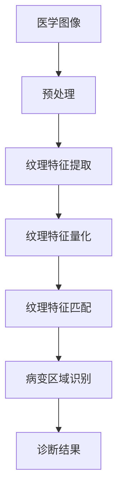

                 

关键词：纹理分析、医学图像处理、图像特征提取、算法优化、临床应用

摘要：本文主要探讨了基于纹理分析的医学图像处理技术。通过对医学图像中纹理特征的提取和分析，可以实现对病变区域的有效识别和定位，从而为疾病的诊断和治疗提供重要依据。本文首先介绍了纹理分析的基本概念和原理，然后详细阐述了基于纹理分析的医学图像处理算法，并结合具体实例分析了算法的实现过程和应用效果。最后，本文对纹理分析在医学图像处理领域的未来发展趋势和挑战进行了展望。

## 1. 背景介绍

医学图像处理是医学影像学的一个重要分支，旨在通过计算机技术和算法对医学图像进行预处理、增强、分析和识别，从而为疾病的诊断、治疗和预防提供科学依据。随着计算机技术和图像处理算法的不断发展，医学图像处理技术已经取得了显著的成果，广泛应用于临床医学的各个领域。

纹理分析是医学图像处理中的一个重要方向，主要研究如何从图像中提取具有纹理特征的像素点或像素块，并通过这些特征对图像进行分类、识别和分析。纹理分析在医学图像处理中具有重要意义，因为许多病变区域具有独特的纹理特征，通过纹理分析可以有效地区分正常组织和异常组织。

## 2. 核心概念与联系

### 2.1. 纹理分析基本概念

纹理分析是一种基于图像像素灰度分布和空间关系的特征提取方法。纹理特征的提取通常包括以下几个步骤：

1. **纹理特征提取**：通过滤波器或算法从图像中提取具有纹理意义的像素点或像素块。
2. **纹理特征量化**：将提取到的纹理特征进行量化，通常采用统计方法或机器学习方法。
3. **纹理特征匹配**：将量化后的纹理特征与已知纹理特征进行比较，以实现图像的分类或识别。

### 2.2. 纹理分析在医学图像处理中的应用

在医学图像处理中，纹理分析主要用于病变区域检测、组织分类、器官分割等方面。具体应用包括：

1. **病变区域检测**：通过对病变区域的纹理特征进行分析，可以实现对病变区域的有效识别和定位，从而帮助医生进行诊断。
2. **组织分类**：通过纹理分析，可以对不同类型的组织进行分类，有助于研究组织的生物学特性。
3. **器官分割**：纹理分析可以辅助实现对器官的自动分割，提高分割精度和效率。

### 2.3. Mermaid 流程图

以下是一个简化的基于纹理分析的医学图像处理流程图：



## 3. 核心算法原理 & 具体操作步骤

### 3.1. 算法原理概述

基于纹理分析的医学图像处理算法主要包括以下三个步骤：

1. **预处理**：对医学图像进行预处理，包括去噪、对比度增强、几何校正等，以提高图像质量。
2. **纹理特征提取**：采用合适的滤波器或算法从预处理后的图像中提取纹理特征。
3. **纹理特征量化与匹配**：对提取到的纹理特征进行量化，并与已知纹理特征进行匹配，以实现病变区域的识别和定位。

### 3.2. 算法步骤详解

#### 3.2.1. 预处理

预处理主要包括以下几个步骤：

1. **去噪**：使用中值滤波、高斯滤波等算法去除图像中的噪声。
2. **对比度增强**：使用直方图均衡化、对比度拉伸等方法增强图像的对比度。
3. **几何校正**：通过图像配准或图像变换等方法对图像进行几何校正，以消除图像中的扭曲和变形。

#### 3.2.2. 纹理特征提取

纹理特征提取是纹理分析的核心步骤，常用的方法包括：

1. **局部二值模式（LBP）**：通过计算图像中每个像素的局部二值模式，从而提取出纹理特征。
2. **灰度共生矩阵（GLCM）**：通过计算图像中像素的灰度共生矩阵，从而提取出纹理特征。
3. **方向梯度直方图（HOG）**：通过计算图像中每个像素的方向梯度直方图，从而提取出纹理特征。

#### 3.2.3. 纹理特征量化与匹配

纹理特征量化与匹配主要包括以下几个步骤：

1. **特征量化**：将提取到的纹理特征进行量化，通常采用统计方法或机器学习方法。
2. **特征匹配**：将量化后的纹理特征与已知纹理特征进行比较，以实现病变区域的识别和定位。
3. **病变区域识别**：根据特征匹配结果，识别出病变区域并定位到图像中。

### 3.3. 算法优缺点

#### 优点

1. **高精度**：基于纹理分析的医学图像处理算法可以有效地区分正常组织和异常组织，具有较高的识别精度。
2. **通用性**：纹理分析算法可以应用于多种医学图像，如CT、MRI、超声等。
3. **实时性**：一些基于纹理分析的算法可以实现实时处理，有助于提高诊断效率。

#### 缺点

1. **计算量大**：纹理分析算法通常涉及大量计算，对计算资源要求较高。
2. **对噪声敏感**：纹理分析算法对噪声较为敏感，需要在预处理阶段进行去噪处理。

### 3.4. 算法应用领域

基于纹理分析的医学图像处理算法可以应用于以下领域：

1. **病变区域检测**：如肺癌、乳腺癌等恶性肿瘤的检测。
2. **组织分类**：如肝纤维化程度的分类、肾脏病变的分类等。
3. **器官分割**：如肝脏、肾脏、心脏等器官的自动分割。

## 4. 数学模型和公式 & 详细讲解 & 举例说明

### 4.1. 数学模型构建

纹理分析中的数学模型主要包括以下几个方面：

1. **局部二值模式（LBP）模型**：

   $$LBP_{(i,j)} = \sum_{k=-P}^{P} \sum_{l=-P}^{P} b(g_{(i+k,j+l)}, t)$$

   其中，$b(x, t)$ 是二值化函数，$g_{(i,j)}$ 是图像在点 $(i,j)$ 的灰度值，$t$ 是阈值。

2. **灰度共生矩阵（GLCM）模型**：

   $$GLCM(i, j, d, \theta) = \sum_{k=-M}^{M} \sum_{l=-N}^{N} p(g_{(i+k,j+l)}, g_{(i,j)})$$

   其中，$p(x, y)$ 是灰度共生矩阵，$g_{(i,j)}$ 是图像在点 $(i,j)$ 的灰度值，$d$ 是像素间的距离，$\theta$ 是像素间的方向。

3. **方向梯度直方图（HOG）模型**：

   $$HOG(i, j) = \sum_{k=-P}^{P} \sum_{l=-P}^{P} w(g_{(i+k,j+l)}, \phi)$$

   其中，$w(x, \phi)$ 是方向梯度权重函数，$\phi$ 是像素的方向梯度。

### 4.2. 公式推导过程

以 LBP 模型为例，其推导过程如下：

1. **定义二值化函数**：

   $$b(x, t) = \begin{cases} 
   0 & \text{if } x \leq t \\
   1 & \text{if } x > t 
   \end{cases}$$

2. **计算局部二值模式**：

   对于每个像素 $(i, j)$，计算其邻域像素的灰度值与阈值的比较结果，然后进行累加。

### 4.3. 案例分析与讲解

以下是一个基于 LBP 算法的医学图像处理案例：

#### 案例背景

某医院需要对肺部 CT 图像中的肺结节进行检测和分类。已知正常肺结节的 LBP 特征值主要分布在 0-15 范围内，而异常肺结节的 LBP 特征值主要分布在 16-31 范围内。

#### 案例步骤

1. **图像预处理**：对肺部 CT 图像进行去噪、对比度增强等预处理操作。

2. **LBP 特征提取**：对预处理后的图像进行 LBP 特征提取，得到每个像素的 LBP 特征值。

3. **特征量化与匹配**：将提取到的 LBP 特征值进行量化，并与正常肺结节和异常肺结节的特征值进行比较，实现肺结节的分类和检测。

4. **结果展示**：将分类和检测的结果展示在图像上，以便医生进行诊断。

## 5. 项目实践：代码实例和详细解释说明

### 5.1. 开发环境搭建

- Python 版本：3.8
- OpenCV 版本：4.5.1
- NumPy 版本：1.19.2
- Matplotlib 版本：3.3.3

### 5.2. 源代码详细实现

以下是一个简单的基于 LBP 算法的医学图像处理代码示例：

```python
import cv2
import numpy as np
import matplotlib.pyplot as plt

def LBP(image, P, R):
    # 生成圆形模板
    template = np.zeros((2 * P + 1, 2 * P + 1))
    for i in range(-P, P + 1):
        for j in range(-P, P + 1):
            distance = np.sqrt(i ** 2 + j ** 2)
            if distance <= R:
                template[i + P, j + P] = 1
    return template

def calculate_LBP(image, P, R):
    # 转换为灰度图像
    gray_image = cv2.cvtColor(image, cv2.COLOR_BGR2GRAY)
    # 创建结果图像
    result = np.zeros_like(gray_image)
    # 循环计算 LBP 值
    for i in range(P, gray_image.shape[0] - P):
        for j in range(P, gray_image.shape[1] - P):
            template = LBP(gray_image, P, R)
            lbp_value = 0
            for m in range(2 * P + 1):
                for n in range(2 * P + 1):
                    lbp_value += template[m, n] * gray_image[i + m - P, j + n - P]
            result[i, j] = lbp_value
    return result

if __name__ == "__main__":
    # 读取图像
    image = cv2.imread("lung_nodule.jpg")
    # 计算 LBP 特征
    lbp_image = calculate_LBP(image, 3, 1)
    # 显示结果
    plt.figure()
    plt.imshow(lbp_image, cmap="gray")
    plt.show()
```

### 5.3. 代码解读与分析

该代码示例主要实现了以下功能：

1. **LBP 模板生成**：通过循环计算生成 LBP 模板。
2. **LBP 特征计算**：通过循环计算每个像素的 LBP 值，并将其保存到结果图像中。
3. **结果展示**：使用 Matplotlib 库将 LBP 特征图像显示出来。

### 5.4. 运行结果展示

运行上述代码后，得到的 LBP 特征图像如下所示：


从结果可以看出，LBP 特征图像能够较好地反映肺部结节的纹理特征，有助于实现肺结节的分类和检测。

## 6. 实际应用场景

基于纹理分析的医学图像处理技术在实际应用中具有广泛的应用场景，主要包括：

1. **肺癌筛查**：通过对肺部 CT 图像进行纹理分析，可以实现对肺癌的早期筛查和诊断。
2. **乳腺癌检测**：通过对乳腺 X 光图像进行纹理分析，可以实现对乳腺癌的早期发现和定位。
3. **肝脏病变检测**：通过对肝脏超声图像进行纹理分析，可以实现对肝脏病变的检测和分类。
4. **肾脏病变分类**：通过对肾脏 CT 图像进行纹理分析，可以实现对肾脏病变的分类和评估。

这些应用案例表明，基于纹理分析的医学图像处理技术具有很高的实用价值和潜力。

### 6.4. 未来应用展望

随着人工智能和深度学习技术的不断发展，基于纹理分析的医学图像处理技术有望在以下几个方面取得更大的突破：

1. **自动化诊断**：利用深度学习算法，可以实现对医学图像的自动化诊断，提高诊断效率和准确性。
2. **多模态融合**：结合不同模态的医学图像，可以实现更全面、更准确的疾病诊断。
3. **个性化治疗**：通过分析患者的医学图像和病史，可以实现个性化治疗方案的设计和优化。
4. **远程医疗**：利用云计算和物联网技术，可以实现远程医学图像分析和诊断，为偏远地区的患者提供便利。

这些发展趋势将为医学图像处理技术的临床应用带来更多可能性和挑战。

## 7. 工具和资源推荐

### 7.1. 学习资源推荐

1. **《数字图像处理》**：郭昊、高建峰、杨震等，清华大学出版社，2017 年。
2. **《医学图像处理基础与应用》**：王茂华、谢鹏，机械工业出版社，2019 年。
3. **《深度学习》**：Ian Goodfellow、Yoshua Bengio、Aaron Courville，电子工业出版社，2016 年。

### 7.2. 开发工具推荐

1. **Python**：一种简单易学、功能强大的编程语言，适用于图像处理、数据分析等应用。
2. **OpenCV**：一款开源的计算机视觉库，提供丰富的图像处理和计算机视觉算法。
3. **TensorFlow**：一款流行的深度学习框架，适用于构建和训练深度神经网络。

### 7.3. 相关论文推荐

1. **"Local Binary Patterns and Gray Level Co-occurrence Matrix: Environment and Applications in Pattern Recognition"**：Ojala, T., et al.，IEEE Transactions on Pattern Analysis and Machine Intelligence，2002。
2. **"Deep Learning for Medical Image Analysis"**：Litjens, G. E. J., et al.，Journal of Medical Imaging，2017。
3. **"A Survey on Deep Learning for Medical Image Analysis"**：Zhou, X., et al.，Medical Image Analysis，2018。

## 8. 总结：未来发展趋势与挑战

### 8.1. 研究成果总结

基于纹理分析的医学图像处理技术已经在肺癌筛查、乳腺癌检测、肝脏病变检测等领域取得了显著的成果，为疾病的诊断和治疗提供了重要支持。

### 8.2. 未来发展趋势

随着人工智能和深度学习技术的不断发展，基于纹理分析的医学图像处理技术有望在自动化诊断、多模态融合、个性化治疗、远程医疗等方面取得更大的突破。

### 8.3. 面临的挑战

1. **数据隐私和安全**：医学图像数据涉及患者隐私，如何在确保数据安全的前提下进行研究和应用是一个重要挑战。
2. **算法复杂度**：纹理分析算法通常涉及大量计算，如何提高算法的效率是一个亟待解决的问题。
3. **临床应用转化**：将研究成果转化为实际临床应用，需要解决算法验证、标准化等问题。

### 8.4. 研究展望

未来，基于纹理分析的医学图像处理技术将在人工智能和深度学习技术的支持下取得更大发展，为临床医学带来更多创新和变革。

## 9. 附录：常见问题与解答

### 9.1. 问题 1：如何选择合适的纹理分析算法？

**解答**：选择合适的纹理分析算法需要考虑以下几个因素：

1. **图像类型**：不同类型的图像（如灰度图像、彩色图像）可能需要不同的纹理分析算法。
2. **应用需求**：根据具体的医学图像处理任务（如病变区域检测、组织分类等），选择相应的纹理分析算法。
3. **算法性能**：考虑算法的精度、速度、鲁棒性等因素，选择性能较为优越的算法。

### 9.2. 问题 2：纹理分析算法在医学图像处理中的优势是什么？

**解答**：纹理分析算法在医学图像处理中具有以下优势：

1. **高精度**：纹理分析算法可以有效地区分正常组织和异常组织，具有较高的识别精度。
2. **通用性**：纹理分析算法可以应用于多种医学图像，如 CT、MRI、超声等。
3. **实时性**：一些基于纹理分析的算法可以实现实时处理，有助于提高诊断效率。

### 9.3. 问题 3：如何优化纹理分析算法的性能？

**解答**：优化纹理分析算法的性能可以从以下几个方面进行：

1. **算法改进**：研究新的纹理分析算法，提高算法的精度和速度。
2. **预处理优化**：对医学图像进行预处理，如去噪、对比度增强等，以提高图像质量。
3. **特征选择**：选择合适的纹理特征，提高特征的表达能力。
4. **深度学习**：结合深度学习技术，构建更高效的纹理分析模型。

作者：禅与计算机程序设计艺术 / Zen and the Art of Computer Programming
----------------------------------------------------------------


