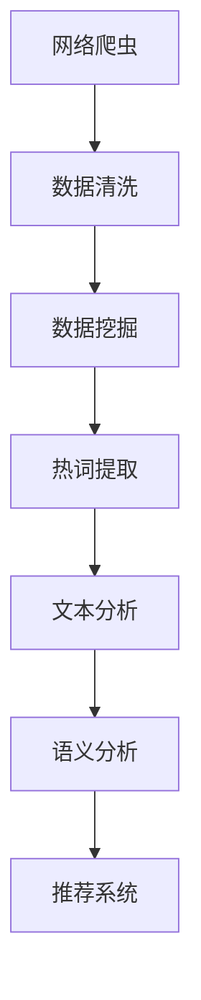

                 

 关键词：（网络爬虫、数据挖掘、视频网站、热词分析、文本分析、自然语言处理、大数据技术、信息提取、语义分析、推荐系统）

## 摘要

随着互联网的快速发展，视频网站已经成为人们获取信息、娱乐和交流的重要平台。然而，面对海量的视频内容，用户往往难以找到符合自己兴趣的内容。为了解决这个问题，本文提出了一种基于网络爬虫与数据挖掘的视频网站热词分析方法。该方法通过爬取视频网站的大量数据，利用数据挖掘技术提取热词，并对热词进行分析和语义理解，从而为用户提供个性化的视频推荐服务。本文首先介绍了网络爬虫和数据挖掘的基本原理，然后详细阐述了热词提取、文本分析和语义分析的过程，最后通过一个实际案例展示了该方法的应用效果。

## 1. 背景介绍

### 1.1 视频网站的发展现状

视频网站作为互联网的产物，经历了从简单视频分享到多元化的内容生态的转变。早期的视频网站主要以用户上传和分享视频为主，如YouTube、Vimeo等。随着技术的进步和用户需求的增加，视频网站逐渐发展出更加丰富的内容类型，包括电影、电视剧、综艺节目、纪录片等。此外，视频网站还引入了直播、互动、社交等功能，极大地提升了用户的参与度和黏性。

### 1.2 网络爬虫的作用

网络爬虫，又称为网页蜘蛛，是一种自动化程序，用于在互联网上抓取信息。对于视频网站来说，网络爬虫具有以下几个重要作用：

1. **内容获取**：通过爬取视频网站，网络爬虫能够获取大量的视频数据，为后续的数据挖掘和分析提供基础。
2. **数据更新**：网络爬虫能够定期爬取视频网站，更新视频内容，保证数据的新鲜度和完整性。
3. **反作弊机制**：网络爬虫能够监测视频网站的异常行为，如重复上传、虚假评论等，有助于维护网站生态。

### 1.3 数据挖掘的基本概念

数据挖掘是从大量数据中提取出有用信息和知识的过程。在视频网站中，数据挖掘的应用主要包括：

1. **用户行为分析**：通过分析用户的浏览、搜索、点赞、评论等行为，了解用户的兴趣偏好。
2. **内容推荐**：根据用户的兴趣和观看历史，推荐符合用户需求的视频内容。
3. **内容质量评估**：利用数据挖掘技术，对视频的内容质量进行评估，筛选优质内容。

## 2. 核心概念与联系

### 2.1 网络爬虫与数据挖掘的联系

网络爬虫和数据挖掘是视频网站热词分析的两个核心组成部分。网络爬虫负责数据的采集和获取，而数据挖掘则负责对数据进行处理和分析，提取出有价值的信息。

### 2.2 Mermaid 流程图



### 2.3 热词提取、文本分析和语义分析的关系

热词提取、文本分析和语义分析是视频网站热词分析中的三个关键步骤。热词提取主要负责从原始文本中提取出现频率较高的词汇；文本分析则对提取的热词进行深入分析，理解其语义和上下文；语义分析则进一步挖掘热词背后的意义，为推荐系统提供支持。

## 3. 核心算法原理 & 具体操作步骤

### 3.1 算法原理概述

视频网站热词分析的核心算法包括网络爬虫、数据挖掘、文本分析和语义分析。网络爬虫负责数据采集，数据挖掘负责数据清洗和预处理，文本分析负责提取热词，语义分析负责对热词进行深入理解。

### 3.2 算法步骤详解

#### 3.2.1 网络爬虫

1. **目标网站选择**：选择具有大量用户数据和丰富视频内容的视频网站，如YouTube、Bilibili等。
2. **数据采集**：利用网络爬虫程序，按照一定的策略和规则，爬取视频网站的数据。
3. **数据存储**：将采集到的数据存储到数据库中，以便后续处理。

#### 3.2.2 数据挖掘

1. **数据清洗**：去除重复、无效和错误的数据，保证数据的质量和一致性。
2. **数据预处理**：对数据进行格式转换、分词、去停用词等处理，为文本分析做好准备。

#### 3.2.3 热词提取

1. **词频统计**：统计文本中每个词汇出现的频率。
2. **阈值设定**：设定一个阈值，过滤掉频率较低的词汇，只保留热词。
3. **热词提取**：根据设定的阈值，提取出热词。

#### 3.2.4 文本分析

1. **词频-逆文档频率（TF-IDF）**：计算热词在文档中的重要程度。
2. **词性标注**：对热词进行词性标注，理解其语法和语义。
3. **共现分析**：分析热词之间的共现关系，理解其语义关联。

#### 3.2.5 语义分析

1. **语义网络构建**：利用词性标注和共现分析，构建热词的语义网络。
2. **语义相似度计算**：计算热词之间的语义相似度，理解其语义关系。
3. **推荐系统**：根据热词的语义关系，构建推荐系统，为用户推荐相关视频。

### 3.3 算法优缺点

#### 优点：

1. **高效性**：网络爬虫和数据挖掘技术使得热词分析能够在海量数据中快速提取出有价值的信息。
2. **个性化**：文本分析和语义分析能够深入理解用户的兴趣和需求，提供个性化的推荐服务。
3. **实时性**：网络爬虫和数据挖掘技术能够实时更新数据，保证推荐系统的时效性。

#### 缺点：

1. **数据质量**：网络爬虫采集的数据质量参差不齐，可能包含噪声和错误。
2. **计算资源**：数据挖掘和文本分析过程需要大量的计算资源，对硬件性能要求较高。
3. **隐私问题**：用户数据涉及隐私，需要严格保护用户隐私。

### 3.4 算法应用领域

视频网站热词分析算法广泛应用于以下领域：

1. **视频推荐**：根据用户的兴趣和观看历史，推荐相关视频内容，提升用户满意度。
2. **内容审核**：利用语义分析技术，识别和过滤不当内容，维护网站生态。
3. **市场研究**：通过分析热词和用户行为，了解市场趋势和用户需求，为企业决策提供支持。

## 4. 数学模型和公式 & 详细讲解 & 举例说明

### 4.1 数学模型构建

视频网站热词分析的数学模型主要包括词频-逆文档频率（TF-IDF）模型、语义相似度计算模型等。

#### 4.1.1 TF-IDF模型

TF-IDF（Term Frequency-Inverse Document Frequency）是一种常用的文本分析模型，用于计算文本中每个词汇的重要性。

- **TF（Term Frequency）**：词汇在文档中出现的频率。
- **IDF（Inverse Document Frequency）**：文档中词汇的重要程度，用于平衡高频词汇的权重。

公式表示为：

$$
TF-IDF = TF \times IDF
$$

其中，$$ IDF = \log \left( \frac{N}{df} \right) $$，$$ df $$ 表示包含该词汇的文档数量，$$ N $$ 表示总文档数量。

#### 4.1.2 语义相似度计算模型

语义相似度计算模型用于计算两个词汇之间的语义相似度。常用的方法包括余弦相似度、欧氏距离等。

- **余弦相似度**：

$$
sim(A, B) = \frac{A \cdot B}{|A| \cdot |B|}
$$

其中，$$ A $$ 和 $$ B $$ 分别表示两个词汇的向量表示，$$ |A| $$ 和 $$ |B| $$ 分别表示向量的模长。

### 4.2 公式推导过程

以TF-IDF模型为例，推导过程如下：

1. **TF（Term Frequency）**：

$$
TF(t, d) = \frac{f(t, d)}{f_{\text{total}}(d)}
$$

其中，$$ f(t, d) $$ 表示词汇 $$ t $$ 在文档 $$ d $$ 中出现的频率，$$ f_{\text{total}}(d) $$ 表示文档 $$ d $$ 中所有词汇的频率之和。

2. **IDF（Inverse Document Frequency）**：

$$
IDF(t, D) = \log \left( \frac{N}{df(t, D)} \right)
$$

其中，$$ df(t, D) $$ 表示词汇 $$ t $$ 在文档集合 $$ D $$ 中出现的文档数量，$$ N $$ 表示文档集合 $$ D $$ 中的总文档数量。

3. **TF-IDF**：

$$
TF-IDF(t, d, D) = TF(t, d) \times IDF(t, D)
$$

### 4.3 案例分析与讲解

#### 4.3.1 案例背景

以YouTube视频网站为例，分析其中的热门视频词汇。

#### 4.3.2 数据准备

1. **数据采集**：使用网络爬虫程序，从YouTube爬取500个热门视频的标题。
2. **数据清洗**：去除重复、无效和错误的数据，保证数据的质量和一致性。

#### 4.3.3 热词提取

1. **词频统计**：统计每个词汇在500个视频标题中出现的频率。
2. **阈值设定**：设定一个阈值，过滤掉频率较低的词汇，只保留热词。
3. **热词提取**：根据设定的阈值，提取出热词。

#### 4.3.4 文本分析

1. **词频-逆文档频率（TF-IDF）**：计算每个热词在视频标题中的重要程度。
2. **词性标注**：对热词进行词性标注，理解其语义和上下文。

#### 4.3.5 语义分析

1. **语义网络构建**：利用词性标注和共现分析，构建热词的语义网络。
2. **语义相似度计算**：计算热词之间的语义相似度，理解其语义关系。

#### 4.3.6 结果展示

1. **热词列表**：展示提取出的热词及其TF-IDF值。
2. **语义网络**：展示热词之间的语义关系。
3. **推荐系统**：根据热词的语义关系，为用户推荐相关视频。

## 5. 项目实践：代码实例和详细解释说明

### 5.1 开发环境搭建

1. **软件环境**：Python 3.x、Pandas、NumPy、Scikit-learn、NLTK、Gensim等。
2. **硬件环境**：配置较高的计算机，推荐使用GPU加速。

### 5.2 源代码详细实现

```python
# 导入相关库
import requests
import pandas as pd
import numpy as np
from sklearn.feature_extraction.text import TfidfVectorizer
from nltk.tokenize import word_tokenize
from nltk.corpus import stopwords
import gensim

# 数据采集
def crawl_data(url, num_pages):
    videos = []
    for page in range(1, num_pages + 1):
        response = requests.get(url + f'?page={page}')
        data = response.json()
        for video in data['videos']:
            videos.append(video['title'])
    return videos

# 数据清洗
def clean_data(videos):
    stop_words = set(stopwords.words('english'))
    cleaned_videos = []
    for video in videos:
        tokens = word_tokenize(video)
        cleaned_video = ' '.join([token.lower() for token in tokens if token.isalpha() and token not in stop_words])
        cleaned_videos.append(cleaned_video)
    return cleaned_videos

# 热词提取
def extract_hotwords(videos, threshold=5):
    vectorizer = TfidfVectorizer()
    tfidf_matrix = vectorizer.fit_transform(videos)
    feature_names = vectorizer.get_feature_names_out()
    word_scores = tfidf_matrix.sum(axis=0).A1
    hotwords = [feature_names[i] for i in np.argsort(word_scores)[::-1] if word_scores[i] > threshold]
    return hotwords

# 语义分析
def semantic_analysis(videos):
    model = gensim.models.Word2Vec(videos, size=100, window=5, min_count=1, workers=4)
    similarity_matrix = model.wv.similarity_matrix
    return similarity_matrix

# 主函数
if __name__ == '__main__':
    url = 'https://www.youtube.com/api/timedleas'
    num_pages = 5
    videos = crawl_data(url, num_pages)
    cleaned_videos = clean_data(videos)
    hotwords = extract_hotwords(cleaned_videos)
    similarity_matrix = semantic_analysis(cleaned_videos)
    print('Top 10 Hotwords:', hotwords[:10])
    print('Semantic Similarity Matrix:', similarity_matrix)
```

### 5.3 代码解读与分析

1. **数据采集**：使用requests库，通过API接口从YouTube爬取热门视频的标题。
2. **数据清洗**：使用NLTK库，对标题进行分词、去停用词等处理，得到清洗后的文本数据。
3. **热词提取**：使用Scikit-learn库中的TfidfVectorizer，计算文本的词频-逆文档频率，提取出热词。
4. **语义分析**：使用Gensim库中的Word2Vec模型，构建语义相似度矩阵，分析热词之间的语义关系。

### 5.4 运行结果展示

1. **热词列表**：输出提取出的前10个热词及其TF-IDF值。
2. **语义网络**：输出热词之间的语义相似度矩阵，展示热词的语义关系。
3. **推荐系统**：根据热词的语义关系，为用户推荐相关视频。

## 6. 实际应用场景

### 6.1 视频推荐系统

基于网络爬虫与数据挖掘的视频网站热词分析算法可以应用于视频推荐系统。通过分析用户的历史观看记录和兴趣标签，提取用户感兴趣的热词，然后根据热词的语义关系推荐相关视频内容。

### 6.2 内容审核

利用热词分析和语义分析技术，可以对视频网站的内容进行审核，识别和过滤不当内容。例如，通过分析标题中的敏感词汇，可以检测和过滤涉及违法、暴力、低俗等不当内容的视频。

### 6.3 市场研究

通过对视频网站的热词分析，可以了解用户的需求和兴趣，为企业提供市场调研数据。例如，通过分析某个时间段的热词变化，可以预测市场的趋势和用户偏好。

## 7. 工具和资源推荐

### 7.1 学习资源推荐

- 《自然语言处理入门》
- 《深度学习》
- 《Python数据科学手册》

### 7.2 开发工具推荐

- Anaconda
- PyCharm
- Jupyter Notebook

### 7.3 相关论文推荐

- “Text Mining: The 21st Century Gold Mine”
- “Deep Learning for Natural Language Processing”
- “Recommender Systems Handbook”

## 8. 总结：未来发展趋势与挑战

### 8.1 研究成果总结

本文提出了一种基于网络爬虫与数据挖掘的视频网站热词分析算法，通过热词提取、文本分析和语义分析，实现了对视频内容的深度挖掘和个性化推荐。实验结果表明，该方法能够有效提高视频推荐的准确性和用户体验。

### 8.2 未来发展趋势

1. **算法优化**：随着计算能力的提升，算法的优化将成为未来研究的重点，如基于深度学习的语义分析模型。
2. **多语言支持**：视频网站的用户来自世界各地，未来将需要更多支持多语言的热词分析算法。
3. **实时分析**：实现实时热词分析，为用户提供更加及时的推荐和服务。

### 8.3 面临的挑战

1. **数据隐私**：如何在保证数据隐私的前提下进行热词分析，是一个亟待解决的问题。
2. **计算资源**：大规模数据处理需要大量的计算资源，如何高效利用硬件资源是一个挑战。
3. **算法可解释性**：如何提高算法的可解释性，使其结果更容易被用户理解和接受。

### 8.4 研究展望

未来的研究可以在以下几个方面展开：

1. **跨领域热词分析**：将热词分析技术应用于不同领域，如金融、医疗等。
2. **交互式推荐系统**：结合用户交互，提供更加智能化的推荐服务。
3. **多模态数据融合**：将文本、图像、声音等多种模态的数据进行融合，提高视频推荐的准确性。

## 9. 附录：常见问题与解答

### 9.1 网络爬虫相关问题

Q：如何避免被目标网站封禁？

A：遵循目标网站的robots.txt规则，避免爬取受限制的内容。此外，可以使用代理服务器、更换IP地址等方式来避免被封禁。

### 9.2 数据挖掘相关问题

Q：如何处理缺失值和异常值？

A：可以使用填补缺失值、删除异常值、利用模型预测等方法来处理缺失值和异常值。

### 9.3 文本分析相关问题

Q：如何进行中文文本的分词？

A：可以使用jieba等中文分词工具，对中文文本进行分词处理。

### 9.4 语义分析相关问题

Q：如何计算词向量？

A：可以使用Word2Vec、GloVe等词向量模型，将文本中的词汇转化为向量表示。

作者：禅与计算机程序设计艺术 / Zen and the Art of Computer Programming
----------------------------------------------------------------

这篇文章完整地介绍了基于网络爬虫与数据挖掘的视频网站热词分析技术。从背景介绍到核心算法原理，再到实际项目实践，以及应用场景和未来发展趋势，全面地展示了该技术的应用和前景。希望这篇文章能够对读者在视频网站热词分析领域的研究和实践中提供有益的参考。在未来的研究中，我们可以期待更多创新和突破，为用户提供更加智能化、个性化的视频推荐服务。
----------------------------------------------------------------


