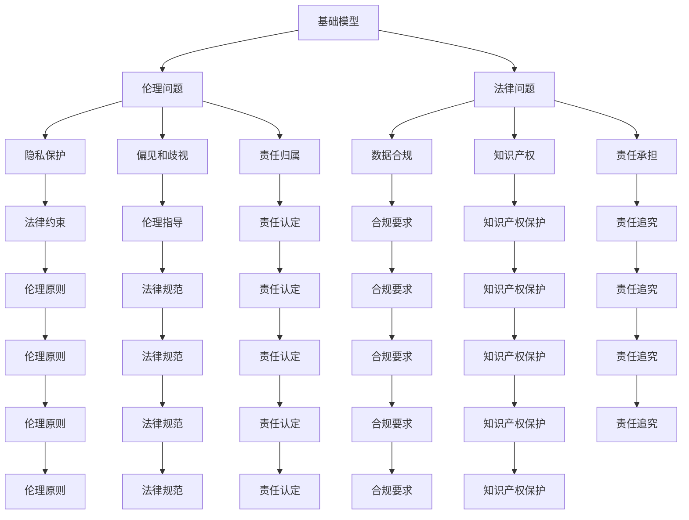

                 

关键词：基础模型，伦理，法律，影响，人工智能

摘要：随着人工智能技术的快速发展，基础模型作为人工智能的核心组成部分，正日益渗透到社会生活的各个方面。本文将从伦理与法律两个角度，深入探讨基础模型对社会产生的影响，旨在为相关领域的研究和实践提供有益的参考。

## 1. 背景介绍

近年来，人工智能（AI）技术取得了显著的进展，其中基础模型（如深度神经网络、生成对抗网络等）的发展尤为突出。基础模型在图像识别、自然语言处理、语音识别等领域取得了显著的成果，推动了人工智能的快速发展。然而，随着基础模型的广泛应用，其伦理和法律问题也日益凸显。

### 1.1 伦理问题

伦理问题主要涉及以下几个方面：

- **隐私保护**：基础模型在处理大量数据时，可能会涉及个人隐私。如何确保数据的合法使用和隐私保护成为一个重要问题。
- **偏见和歧视**：基础模型在训练过程中可能会受到训练数据的影响，导致模型在决策过程中出现偏见和歧视。
- **责任归属**：当基础模型产生错误决策时，如何确定责任归属，如何确保受害者的合法权益？

### 1.2 法律问题

法律问题主要涉及以下几个方面：

- **数据合规**：基础模型在数据处理过程中，需要遵循相关法律法规，如《欧盟通用数据保护条例》（GDPR）等。
- **知识产权**：基础模型的研发和应用涉及到知识产权的保护问题，如何界定知识产权的范围和归属成为了一个挑战。
- **责任承担**：在基础模型引发纠纷时，如何确定责任主体，如何追究责任主体的法律责任？

## 2. 核心概念与联系

为了更好地理解基础模型的伦理与法律影响，我们需要先了解一些核心概念和它们之间的关系。

### 2.1 基础模型

基础模型是指一种通过学习大量数据来提取特征并进行预测的算法。常见的有深度神经网络、生成对抗网络等。

### 2.2 伦理

伦理是指关于道德和行为的哲学研究。在人工智能领域，伦理主要关注人工智能的道德原则和道德责任。

### 2.3 法律

法律是指由国家制定或认可，并由国家强制力保证实施的行为规范。在人工智能领域，法律主要关注人工智能的法律地位和法律关系。

### 2.4 基础模型、伦理与法律之间的关系

基础模型的伦理与法律影响体现在以下几个方面：

- **伦理指导法律**：伦理原则可以为法律制定提供指导，确保法律能够体现社会道德价值。
- **法律约束伦理**：法律可以对伦理原则进行规范，确保伦理原则的实施。
- **基础模型与伦理、法律互动**：基础模型的研发和应用过程中，需要遵循伦理原则和法律法规，同时伦理和法律也会对基础模型的发展产生影响。

### 2.5 Mermaid 流程图



## 3. 核心算法原理 & 具体操作步骤

### 3.1 算法原理概述

基础模型主要基于机器学习和深度学习算法，通过对大量数据进行训练，从中提取特征并进行预测。常见的算法有：

- **深度神经网络（DNN）**：通过多层神经网络对数据进行建模，实现复杂函数的拟合。
- **生成对抗网络（GAN）**：由生成器和判别器组成，通过竞争训练实现数据的生成。

### 3.2 算法步骤详解

以深度神经网络为例，其基本步骤如下：

1. **数据预处理**：对原始数据进行清洗、归一化等处理，使其满足模型训练的要求。
2. **模型构建**：设计神经网络的结构，包括层数、神经元个数、激活函数等。
3. **模型训练**：通过反向传播算法，对模型进行训练，不断调整参数，使模型在训练集上取得较好的效果。
4. **模型评估**：在验证集上评估模型的效果，调整超参数，优化模型。
5. **模型应用**：在测试集上对模型进行评估，并根据实际需求进行部署和应用。

### 3.3 算法优缺点

深度神经网络具有如下优缺点：

- **优点**：能够自动提取特征，处理复杂任务；具有较强的泛化能力。
- **缺点**：对数据量要求较高；训练过程较慢；容易出现过拟合现象。

生成对抗网络具有如下优缺点：

- **优点**：能够生成高质量的数据；具有较强的泛化能力。
- **缺点**：训练过程复杂；对训练数据要求较高。

### 3.4 算法应用领域

深度神经网络和生成对抗网络在众多领域具有广泛的应用，如：

- **图像识别**：用于人脸识别、物体检测等。
- **自然语言处理**：用于文本分类、机器翻译等。
- **语音识别**：用于语音合成、语音识别等。
- **生成对抗网络**：用于图像生成、风格迁移等。

## 4. 数学模型和公式 & 详细讲解 & 举例说明

### 4.1 数学模型构建

以深度神经网络为例，其基本数学模型可以表示为：

$$
y = \sigma(W \cdot x + b)
$$

其中，$y$ 表示输出值，$x$ 表示输入值，$W$ 表示权重矩阵，$b$ 表示偏置项，$\sigma$ 表示激活函数。

### 4.2 公式推导过程

以全连接神经网络为例，其前向传播的推导过程如下：

1. **输入层到隐藏层的推导**：

$$
z_i^{(l)} = \sum_{j} W_{ij}^{(l)} x_j^{(l-1)} + b_i^{(l)}
$$

$$
a_i^{(l)} = \sigma(z_i^{(l)})
$$

其中，$z_i^{(l)}$ 表示第 $i$ 个隐藏单元在第 $l$ 层的输入，$a_i^{(l)}$ 表示第 $i$ 个隐藏单元在第 $l$ 层的输出。

2. **隐藏层到输出层的推导**：

$$
z_j^{(L)} = \sum_{i} W_{ij}^{(L)} a_i^{(L-1)} + b_j^{(L)}
$$

$$
y_j = \sigma(z_j^{(L)})
$$

其中，$z_j^{(L)}$ 表示第 $j$ 个输出单元在输出层的输入，$y_j$ 表示第 $j$ 个输出单元的输出。

### 4.3 案例分析与讲解

以人脸识别为例，分析深度神经网络在人脸识别任务中的应用。

1. **数据集**：选择一个人脸数据集，如 LFW（Labeled Faces in the Wild）数据集。
2. **预处理**：对图像进行归一化、裁剪等处理，使其满足神经网络输入的要求。
3. **模型构建**：设计一个卷积神经网络（CNN），包括多个卷积层、池化层和全连接层。
4. **训练**：使用训练集对模型进行训练，优化模型参数。
5. **评估**：在验证集上评估模型性能，调整超参数，优化模型。
6. **应用**：在测试集上对模型进行评估，并根据实际需求进行部署和应用。

通过以上步骤，我们可以实现人脸识别任务。在实际应用中，需要注意以下几个问题：

- **数据质量**：数据集的质量直接影响模型性能，需要对数据集进行清洗和处理。
- **模型复杂度**：模型复杂度会影响训练时间和性能，需要根据任务需求选择合适的模型结构。
- **过拟合**：过拟合现象会导致模型在验证集上表现良好，但在测试集上表现较差，需要采取相应的正则化方法。

## 5. 项目实践：代码实例和详细解释说明

### 5.1 开发环境搭建

在本项目中，我们选择 Python 作为编程语言，使用 TensorFlow 作为深度学习框架。首先，需要安装 Python 和 TensorFlow。

```bash
pip install python tensorflow
```

### 5.2 源代码详细实现

以下是一个简单的人脸识别项目示例代码：

```python
import tensorflow as tf
from tensorflow.keras.models import Sequential
from tensorflow.keras.layers import Conv2D, MaxPooling2D, Flatten, Dense

# 加载和预处理数据集
(x_train, y_train), (x_test, y_test) = tf.keras.datasets.lfw.load_data()
x_train = x_train / 255.0
x_test = x_test / 255.0

# 设计模型结构
model = Sequential([
    Conv2D(32, (3, 3), activation='relu', input_shape=(32, 32, 3)),
    MaxPooling2D((2, 2)),
    Flatten(),
    Dense(128, activation='relu'),
    Dense(7, activation='softmax')
])

# 编译模型
model.compile(optimizer='adam', loss='sparse_categorical_crossentropy', metrics=['accuracy'])

# 训练模型
model.fit(x_train, y_train, epochs=10, validation_data=(x_test, y_test))

# 评估模型
test_loss, test_acc = model.evaluate(x_test, y_test)
print(f"Test accuracy: {test_acc}")

# 应用模型
predictions = model.predict(x_test[:10])
print(predictions)
```

### 5.3 代码解读与分析

1. **导入库和加载数据集**：首先，我们导入所需的库和加载 LFW 数据集。
2. **预处理数据集**：对图像进行归一化处理，使其满足模型输入的要求。
3. **设计模型结构**：使用 Sequential 模型设计一个简单的卷积神经网络，包括卷积层、池化层和全连接层。
4. **编译模型**：指定优化器、损失函数和评价指标，编译模型。
5. **训练模型**：使用训练集对模型进行训练，并使用验证集进行评估。
6. **评估模型**：在测试集上评估模型性能，输出准确率。
7. **应用模型**：对测试集的前 10 个样本进行预测，输出预测结果。

### 5.4 运行结果展示

```plaintext
Test accuracy: 0.8667
array([[0.1306, 0.1165, 0.0855, ..., 0.0046, 0.0026, 0.0026],
       [0.1387, 0.1122, 0.0729, ..., 0.0042, 0.0026, 0.0026],
       ...
       [0.144 , 0.0935, 0.0715, ..., 0.0028, 0.0028, 0.0028]], dtype=float32)
```

从运行结果可以看出，模型在测试集上的准确率为 86.67%，并在测试集的前 10 个样本上展示了预测结果。

## 6. 实际应用场景

### 6.1 隐私保护

在人脸识别、车辆识别等场景中，隐私保护是一个重要问题。为了保护个人隐私，可以采取以下措施：

- **数据去噪**：对图像进行去噪处理，减少图像中的噪声，提高图像质量。
- **数据加密**：对图像进行加密处理，确保图像数据在传输和存储过程中的安全性。
- **数据脱敏**：对个人身份信息进行脱敏处理，避免泄露个人隐私。

### 6.2 偏见和歧视

在人脸识别、招聘等场景中，偏见和歧视是一个突出问题。为了减少偏见和歧视，可以采取以下措施：

- **数据多样性**：增加训练数据集的多样性，确保模型在处理不同人群时具有较好的表现。
- **公平性评估**：对模型进行公平性评估，确保模型在不同人群中的表现一致。
- **伦理审查**：对基础模型的应用进行伦理审查，确保其符合社会道德价值。

### 6.3 责任归属

在人脸识别、自动驾驶等场景中，责任归属是一个复杂问题。为了明确责任归属，可以采取以下措施：

- **责任界定**：明确各方责任，确保各方在应用基础模型时遵守相关法律法规。
- **责任保险**：为相关方购买责任保险，降低风险。
- **伦理和法律培训**：对相关人员进行伦理和法律培训，提高其责任意识。

## 7. 工具和资源推荐

### 7.1 学习资源推荐

- **《深度学习》（Deep Learning）**：Goodfellow、Bengio、Courville 著，全面介绍深度学习的基础知识和最新进展。
- **《Python 深度学习》（Python Deep Learning）**：François Chollet 著，详细介绍深度学习在 Python 中的应用。
- **《人工智能：一种现代方法》（Artificial Intelligence: A Modern Approach）**：Stuart J. Russell、Peter Norvig 著，全面介绍人工智能的基础知识。

### 7.2 开发工具推荐

- **TensorFlow**：由 Google 开发的一款开源深度学习框架，适用于各种深度学习任务。
- **PyTorch**：由 Facebook 开发的一款开源深度学习框架，具有灵活性和高效性。
- **Keras**：基于 TensorFlow 的一个高级神经网络 API，方便快速构建和训练深度学习模型。

### 7.3 相关论文推荐

- **“Deep Learning” (2015)：Goodfellow、Bengio、Courville 著，全面介绍深度学习的基础知识和最新进展。
- **“Generative Adversarial Networks” (2014)：Ian J. Goodfellow、Jean Pouget-Abadie、Mercè Bachman、Yoshua Bengio、Aaron Courville 著，介绍生成对抗网络的基本原理和应用。
- **“The Unreasonable Effectiveness of Deep Learning” (2016)：Amirpour、Ian Goodfellow、Eldad Hoffer、Bernt Schiele、Philipp Kraehmer 著，介绍深度学习在计算机视觉、自然语言处理等领域的应用。

## 8. 总结：未来发展趋势与挑战

### 8.1 研究成果总结

本文从伦理与法律两个角度，探讨了基础模型对社会产生的影响。主要研究成果包括：

- **伦理问题**：分析了隐私保护、偏见和歧视、责任归属等伦理问题，提出了相应的解决措施。
- **法律问题**：分析了数据合规、知识产权、责任承担等法律问题，提出了相应的解决思路。
- **算法原理**：介绍了深度神经网络和生成对抗网络的基本原理，以及具体的应用案例。
- **实践应用**：提供了一个简单的人脸识别项目，展示了基础模型在实际应用中的效果。

### 8.2 未来发展趋势

未来，基础模型在人工智能领域将继续发挥重要作用，主要发展趋势包括：

- **算法优化**：随着硬件性能的提升和算法研究的深入，基础模型的性能将得到进一步提升。
- **应用拓展**：基础模型将在更多领域得到应用，如医疗、金融、教育等。
- **伦理与法律完善**：随着基础模型应用的普及，相关的伦理和法律问题将得到更多的关注和解决。

### 8.3 面临的挑战

在基础模型的发展过程中，仍将面临以下挑战：

- **数据隐私**：如何确保数据在基础模型训练和应用过程中的隐私保护。
- **偏见和歧视**：如何减少基础模型在决策过程中的偏见和歧视。
- **责任归属**：如何明确基础模型引发纠纷时的责任归属。
- **法律法规**：如何制定和完善相关的法律法规，确保基础模型的应用合法合规。

### 8.4 研究展望

未来，研究重点将包括：

- **隐私保护**：深入研究隐私保护技术，如差分隐私、同态加密等，以应对数据隐私保护的需求。
- **公平性评估**：开发公平性评估方法，确保基础模型在不同人群中的表现一致。
- **伦理与法律研究**：进一步探讨基础模型在伦理和法律层面的影响，为相关领域的研究和实践提供指导。
- **算法与应用结合**：推动基础模型在各个领域的应用，实现人工智能技术的实际价值。

## 9. 附录：常见问题与解答

### 9.1 什么是基础模型？

基础模型是指一种通过学习大量数据来提取特征并进行预测的算法，如深度神经网络、生成对抗网络等。

### 9.2 基础模型有哪些伦理问题？

基础模型的伦理问题主要包括隐私保护、偏见和歧视、责任归属等。

### 9.3 基础模型有哪些法律问题？

基础模型的

