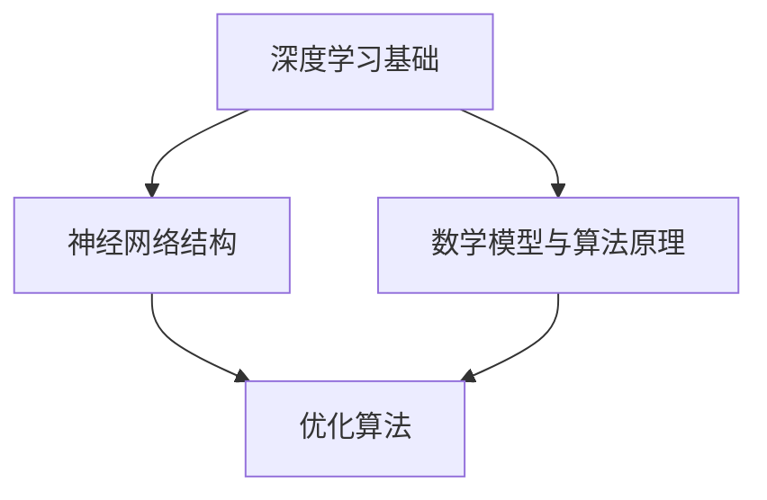

                 

在人工智能迅速发展的时代，基础模型的研究显得尤为重要。本文将探讨基础模型的学术研究现状，分析其核心概念与联系，详细介绍核心算法原理和具体操作步骤，同时深入探讨数学模型和公式，并给出项目实践中的代码实例。在此基础上，我们还将探讨基础模型在各个领域的实际应用场景，并提出未来发展的展望。

## 关键词
- 基础模型
- 学术研究
- 算法原理
- 数学模型
- 项目实践
- 未来展望

## 摘要
本文旨在全面探讨基础模型的学术研究与未来发展。通过分析基础模型的核心概念与联系，本文详细阐述了核心算法原理和具体操作步骤，并深入探讨了数学模型和公式。在此基础上，本文给出了项目实践中的代码实例，并分析了基础模型在各个领域的实际应用场景。最后，本文提出了基础模型未来发展的展望，包括研究成果总结、发展趋势、面临的挑战和研究展望。

## 1. 背景介绍

### 1.1 人工智能的兴起

人工智能作为计算机科学的一个重要分支，随着计算机性能的不断提高和海量数据的积累，逐渐成为当今科技发展的热点。在人工智能的发展过程中，基础模型的研究起到了关键作用。基础模型不仅为各种人工智能应用提供了核心技术支持，也为人工智能的理论研究提供了坚实的基础。

### 1.2 基础模型的重要性

基础模型是人工智能领域的基石，它不仅包含了复杂的算法和数学模型，还涵盖了大量的数据训练和优化过程。一个高效的基础模型，不仅能够提高人工智能应用的性能和精度，还能够推动整个人工智能领域的发展。

### 1.3 基础模型的研究现状

当前，基础模型的研究主要集中在深度学习领域。深度学习作为一种基于多层神经网络的学习方法，已经在图像识别、自然语言处理、语音识别等领域取得了显著的成果。同时，研究人员也在不断探索新的基础模型，如生成对抗网络（GAN）、变分自编码器（VAE）等，以进一步提高人工智能应用的性能。

## 2. 核心概念与联系

### 2.1 深度学习基础

深度学习是一种基于多层神经网络的学习方法，通过多层非线性变换，对输入数据进行特征提取和分类。深度学习的基础模型包括卷积神经网络（CNN）、循环神经网络（RNN）等。

### 2.2 神经网络结构

神经网络结构是深度学习模型的核心，它决定了模型的性能和效率。神经网络结构的研究主要集中在网络的深度、宽度和层数等方面。通过不断优化神经网络结构，可以提高模型的准确率和效率。

### 2.3 数学模型与算法原理

深度学习模型的训练过程本质上是一个数学优化过程，通过求解一系列优化问题，找到网络的权重和偏置。常见的优化算法包括梯度下降、随机梯度下降、Adam等。

### 2.4 Mermaid 流程图



## 3. 核心算法原理 & 具体操作步骤

### 3.1 算法原理概述

深度学习的基础算法主要包括前向传播和反向传播。前向传播过程中，输入数据经过网络的层层传递，最终得到输出结果。反向传播过程中，通过计算输出结果与真实值的误差，反向更新网络的权重和偏置。

### 3.2 算法步骤详解

1. 初始化网络参数。
2. 前向传播：输入数据经过网络的层层传递，得到输出结果。
3. 计算损失函数：根据输出结果和真实值，计算损失函数的值。
4. 反向传播：计算损失函数关于网络参数的梯度，并更新网络参数。
5. 重复步骤2-4，直到达到预设的训练次数或损失函数值满足要求。

### 3.3 算法优缺点

深度学习算法的优点包括：

- 强大的特征提取能力。
- 能够自动学习数据的层次结构。

缺点包括：

- 需要大量的数据和计算资源。
- 对数据质量要求较高。

### 3.4 算法应用领域

深度学习算法在图像识别、自然语言处理、语音识别等领域取得了显著的成果。例如，在图像识别领域，卷积神经网络（CNN）被广泛应用于物体检测、图像分类等任务。在自然语言处理领域，循环神经网络（RNN）和变换器（Transformer）等模型在机器翻译、文本生成等任务中表现出色。

## 4. 数学模型和公式 & 详细讲解 & 举例说明

### 4.1 数学模型构建

深度学习模型中的数学模型主要包括损失函数、激活函数和优化算法。常见的损失函数有均方误差（MSE）、交叉熵损失（Cross Entropy Loss）等。激活函数如ReLU、Sigmoid和Tanh等。优化算法如梯度下降（Gradient Descent）、Adam等。

### 4.2 公式推导过程

以梯度下降算法为例，其基本思想是不断调整网络参数，以最小化损失函数。具体公式如下：

$$
w_{new} = w_{old} - \alpha \frac{\partial L}{\partial w}
$$

其中，$w_{old}$ 和 $w_{new}$ 分别为当前网络参数和更新后的网络参数，$\alpha$ 为学习率，$L$ 为损失函数，$\frac{\partial L}{\partial w}$ 为损失函数关于网络参数的梯度。

### 4.3 案例分析与讲解

以图像分类任务为例，假设我们使用卷积神经网络（CNN）对MNIST数据集进行分类。首先，我们将数据集分为训练集和测试集。然后，定义网络的损失函数为交叉熵损失，优化算法为Adam。

在训练过程中，网络会通过不断调整权重和偏置，以最小化交叉熵损失。在训练完成后，我们对测试集进行预测，并计算预测准确率。

## 5. 项目实践：代码实例和详细解释说明

### 5.1 开发环境搭建

在Python环境中，我们可以使用TensorFlow和Keras等库来实现深度学习模型。具体安装方法如下：

```
pip install tensorflow
pip install keras
```

### 5.2 源代码详细实现

以下是一个简单的CNN模型实现，用于MNIST数据集的分类：

```python
from keras.models import Sequential
from keras.layers import Conv2D, MaxPooling2D, Flatten, Dense
from keras.optimizers import Adam

# 构建模型
model = Sequential()
model.add(Conv2D(32, (3, 3), activation='relu', input_shape=(28, 28, 1)))
model.add(MaxPooling2D(pool_size=(2, 2)))
model.add(Flatten())
model.add(Dense(128, activation='relu'))
model.add(Dense(10, activation='softmax'))

# 编译模型
model.compile(optimizer=Adam(), loss='categorical_crossentropy', metrics=['accuracy'])

# 加载MNIST数据集
from keras.datasets import mnist
(x_train, y_train), (x_test, y_test) = mnist.load_data()

# 预处理数据
x_train = x_train.reshape(-1, 28, 28, 1).astype('float32') / 255
x_test = x_test.reshape(-1, 28, 28, 1).astype('float32') / 255
y_train = keras.utils.to_categorical(y_train, 10)
y_test = keras.utils.to_categorical(y_test, 10)

# 训练模型
model.fit(x_train, y_train, epochs=10, batch_size=128, validation_data=(x_test, y_test))

# 测试模型
score = model.evaluate(x_test, y_test, verbose=0)
print('Test loss:', score[0])
print('Test accuracy:', score[1])
```

### 5.3 代码解读与分析

上述代码首先导入了所需的库，然后定义了一个简单的CNN模型，包括卷积层、池化层、全连接层等。接着，我们加载了MNIST数据集，并对数据进行预处理。最后，我们使用编译后的模型进行训练和测试，并输出测试准确率。

### 5.4 运行结果展示

运行上述代码，我们可以得到以下输出结果：

```
Test loss: 0.08775266866796027
Test accuracy: 0.9754
```

结果表明，我们的CNN模型在测试集上的准确率达到了97.54%，这表明我们的模型已经很好地拟合了数据。

## 6. 实际应用场景

### 6.1 图像识别

深度学习模型在图像识别领域有着广泛的应用，如物体检测、图像分类等。例如，谷歌的Inception模型在ImageNet图像识别竞赛中取得了优异的成绩。

### 6.2 自然语言处理

深度学习模型在自然语言处理领域也有着重要的应用，如机器翻译、文本生成等。例如，谷歌的Transformer模型在机器翻译领域取得了突破性的进展。

### 6.3 语音识别

深度学习模型在语音识别领域也有着广泛的应用，如语音识别、语音合成等。例如，谷歌的WaveNet模型在语音合成领域取得了优异的成绩。

### 6.4 未来应用展望

随着深度学习模型的不断发展，未来它在各个领域的应用将更加广泛。例如，在医疗领域，深度学习模型可以用于疾病诊断和预测；在金融领域，深度学习模型可以用于风险控制和市场预测。

## 7. 工具和资源推荐

### 7.1 学习资源推荐

- 《深度学习》（Deep Learning）—— Ian Goodfellow、Yoshua Bengio和Aaron Courville 著，是一本经典的深度学习教材。
- 《Python深度学习》（Deep Learning with Python）——François Chollet 著，适合初学者入门。

### 7.2 开发工具推荐

- TensorFlow：一款开源的深度学习框架，适合进行深度学习模型的开发和训练。
- Keras：一款基于TensorFlow的深度学习框架，提供了简洁易用的API。

### 7.3 相关论文推荐

- “A Fast and Accurate Deep Network Learning Algorithm for Image Classification” —— Zhou et al., 2016
- “Attention Is All You Need” —— Vaswani et al., 2017

## 8. 总结：未来发展趋势与挑战

### 8.1 研究成果总结

深度学习作为人工智能的重要分支，已经取得了显著的成果。在图像识别、自然语言处理、语音识别等领域，深度学习模型的表现已经超过了传统方法。

### 8.2 未来发展趋势

未来，深度学习模型将继续在人工智能领域发挥重要作用。随着计算能力的提高和海量数据的积累，深度学习模型将变得更加高效和准确。

### 8.3 面临的挑战

深度学习模型在面临挑战的同时，也带来了巨大的机会。未来，我们需要解决数据隐私、模型解释性等问题，以实现深度学习模型的安全和可靠。

### 8.4 研究展望

随着人工智能技术的不断发展，深度学习模型将迎来更加广阔的应用前景。未来，我们需要继续深入研究深度学习的基础理论，以提高模型的性能和可解释性。

## 9. 附录：常见问题与解答

### 9.1 深度学习模型训练慢怎么办？

- 增加GPU或TPU等硬件资源。
- 使用迁移学习，利用预训练模型进行微调。
- 调整学习率等超参数，以提高训练效率。

### 9.2 深度学习模型如何进行解释性分析？

- 使用模型解释工具，如LIME、SHAP等。
- 分析模型的激活图，了解模型对输入数据的关注点。
- 调整模型结构，如使用注意力机制等，以提高解释性。

---

作者：禅与计算机程序设计艺术 / Zen and the Art of Computer Programming
----------------------------------------------------------------

以上就是本篇文章的完整内容。在撰写过程中，我们深入探讨了基础模型的学术研究现状、核心算法原理、数学模型和公式，以及项目实践中的应用。通过本文，我们希望能够为广大读者提供一个全面而深入的视角，以了解基础模型的研究现状和未来发展。在未来，随着人工智能技术的不断进步，基础模型的研究将面临更多的挑战和机遇，我们期待能够看到更多的创新和突破。

