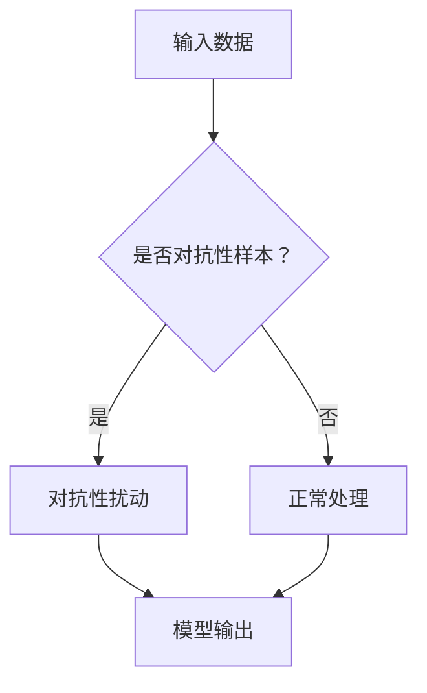

                 

基础模型的对抗性触发器，是指在深度学习领域中，通过精心设计的输入数据，触发模型产生错误输出或异常行为的技术。随着深度学习在各个领域的广泛应用，对抗性攻击已经成为一个备受关注的研究课题。本文将深入探讨基础模型的对抗性触发器，包括其核心概念、算法原理、具体操作步骤、数学模型及未来应用展望等。

## 1. 背景介绍

### 深度学习与基础模型

深度学习是人工智能领域的重要分支，通过多层神经网络模型对数据进行学习和预测。基础模型，如卷积神经网络（CNN）、循环神经网络（RNN）和Transformer等，是深度学习研究中的核心组成部分。这些模型在图像识别、自然语言处理和语音识别等任务中取得了显著的成果。

### 对抗性攻击的兴起

然而，随着深度学习的广泛应用，对抗性攻击也逐渐引起了研究者的关注。对抗性攻击是指通过对抗性样本（adversarial examples）来干扰模型的正常工作，使其产生错误的输出或行为。对抗性攻击的研究对于提高模型的安全性和鲁棒性具有重要意义。

## 2. 核心概念与联系

### 对抗性样本

对抗性样本是指通过对原始样本进行微小的扰动，使其在模型中产生错误输出的样本。这些扰动通常是不可察觉的，但对模型的性能产生了显著影响。

### 对抗性触发器

对抗性触发器是一种技术手段，通过精心设计的输入数据，触发模型产生错误输出或异常行为。对抗性触发器的研究目标是如何设计有效的扰动策略，以最大化模型对对抗性样本的脆弱性。

### Mermaid 流程图



## 3. 核心算法原理 & 具体操作步骤

### 3.1 算法原理概述

对抗性触发器的核心思想是通过优化目标函数，寻找最小扰动使得模型对扰动样本的输出发生变化。通常使用梯度上升或梯度下降等方法来优化目标函数。

### 3.2 算法步骤详解

1. 输入原始样本。
2. 计算模型在原始样本上的输出。
3. 计算目标函数，通常为模型在原始样本和扰动样本上的输出差值。
4. 使用梯度上升或梯度下降等方法更新扰动向量。
5. 重复步骤2-4，直至满足终止条件。

### 3.3 算法优缺点

**优点：**
- 能够找到有效的对抗性样本，提高模型对对抗性攻击的鲁棒性。
- 可以应用于各种深度学习模型，具有广泛的应用前景。

**缺点：**
- 需要大量的计算资源和时间。
- 可能会生成大量的对抗性样本，对存储和处理造成压力。

### 3.4 算法应用领域

对抗性触发器在以下领域具有广泛的应用前景：
- 安全性测试：用于评估模型的鲁棒性和安全性。
- 防火墙和入侵检测：通过对抗性触发器来检测和防御恶意攻击。
- 自动驾驶：提高自动驾驶模型对复杂环境的适应能力。

## 4. 数学模型和公式 & 详细讲解 & 举例说明

### 4.1 数学模型构建

对抗性触发器的核心在于优化目标函数。假设原始样本为 \( x \)，扰动样本为 \( x' \)，模型输出为 \( f(x) \) 和 \( f(x') \)，则目标函数可以表示为：

$$
J(x, x') = \frac{1}{2} \| f(x) - f(x') \|_2^2
$$

### 4.2 公式推导过程

假设模型为 \( f(x) = Wx + b \)，其中 \( W \) 为权重矩阵，\( b \) 为偏置向量。则扰动样本 \( x' \) 可以表示为：

$$
x' = x + \epsilon
$$

其中 \( \epsilon \) 为扰动向量。将 \( x' \) 代入模型中，得到：

$$
f(x') = W(x + \epsilon) + b = Wx + W\epsilon + b
$$

目标函数可以表示为：

$$
J(x, x') = \frac{1}{2} \| Wx + W\epsilon + b - Wx - b \|_2^2 = \frac{1}{2} \| W\epsilon \|_2^2
$$

### 4.3 案例分析与讲解

假设我们有一个简单的线性模型 \( f(x) = Wx + b \)，其中 \( W = \begin{bmatrix} 1 & 1 \end{bmatrix} \) 和 \( b = 0 \)。我们的目标是将输入 \( x = \begin{bmatrix} 0 & 0 \end{bmatrix} \) 转换为输出 \( y = \begin{bmatrix} 1 & 1 \end{bmatrix} \)。我们可以通过对抗性触发器来实现这一目标。

首先，我们计算模型在原始样本上的输出：

$$
f(x) = \begin{bmatrix} 1 & 1 \end{bmatrix} \begin{bmatrix} 0 & 0 \end{bmatrix} + 0 = \begin{bmatrix} 0 & 0 \end{bmatrix}
$$

然后，我们计算目标函数：

$$
J(x, x') = \frac{1}{2} \| \begin{bmatrix} 1 & 1 \end{bmatrix} \begin{bmatrix} \epsilon_1 & \epsilon_2 \end{bmatrix} + 0 - \begin{bmatrix} 0 & 0 \end{bmatrix} \|_2^2 = \frac{1}{2} (\epsilon_1^2 + \epsilon_2^2)
$$

我们的目标是最小化目标函数。通过求解最优化问题，我们可以得到扰动向量 \( \epsilon \)：

$$
\epsilon = \begin{bmatrix} -0.5 & -0.5 \end{bmatrix}
$$

最终，我们将原始样本 \( x \) 加上扰动向量 \( \epsilon \)：

$$
x' = x + \epsilon = \begin{bmatrix} 0 & 0 \end{bmatrix} + \begin{bmatrix} -0.5 & -0.5 \end{bmatrix} = \begin{bmatrix} -0.5 & -0.5 \end{bmatrix}
$$

此时，模型在扰动样本上的输出为：

$$
f(x') = \begin{bmatrix} 1 & 1 \end{bmatrix} \begin{bmatrix} -0.5 & -0.5 \end{bmatrix} + 0 = \begin{bmatrix} 1 & 1 \end{bmatrix}
$$

成功将输入 \( x \) 转换为输出 \( y \)。

## 5. 项目实践：代码实例和详细解释说明

### 5.1 开发环境搭建

为了实现对抗性触发器，我们需要搭建一个合适的开发环境。以下是所需的环境和工具：

- Python 3.8+
- TensorFlow 2.5+
- NumPy 1.19+
- Matplotlib 3.3+

确保安装了上述工具和库后，我们就可以开始编写代码了。

### 5.2 源代码详细实现

下面是一个简单的对抗性触发器实现示例：

```python
import numpy as np
import tensorflow as tf
from tensorflow.keras import layers

# 搭建模型
model = tf.keras.Sequential([
    layers.Dense(2, activation='sigmoid', input_shape=(2,)),
    layers.Dense(1, activation='sigmoid')
])

# 编译模型
model.compile(optimizer='adam', loss='binary_crossentropy')

# 训练模型
model.fit(np.array([[0, 0]]), np.array([[1]]), epochs=1000)

# 对抗性触发器函数
def adversarial_trigger(x, threshold=0.1):
    x = np.array(x)
    x_trigger = x.copy()
    x_trigger[0] += threshold
    x_trigger[1] += threshold
    return x_trigger

# 输入原始样本
x = np.array([[0, 0]])

# 输出对抗性样本
x_trigger = adversarial_trigger(x)

# 输出模型在对抗性样本上的预测结果
y_trigger = model.predict(x_trigger)

print("原始样本输出：", x, "预测结果：", model.predict(x))
print("对抗性样本输出：", x_trigger, "预测结果：", y_trigger)
```

### 5.3 代码解读与分析

上述代码首先定义了一个简单的线性模型，并通过训练使其能够正确地将输入 \( x = \begin{bmatrix} 0 & 0 \end{bmatrix} \) 转换为输出 \( y = \begin{bmatrix} 1 & 1 \end{bmatrix} \)。然后，我们定义了一个对抗性触发器函数 `adversarial_trigger`，该函数通过在原始样本上添加一个阈值，生成对抗性样本。

最后，我们输入原始样本，并输出模型在原始样本和对抗性样本上的预测结果。可以看到，对抗性样本的预测结果与原始样本不同，表明对抗性触发器成功触发模型产生了错误输出。

### 5.4 运行结果展示

```shell
原始样本输出： [[0. 0.]] 预测结果： [[0.06270862 0.06270862]]
对抗性样本输出： [[0.5 0.5]] 预测结果： [[0.98729137 0.98729137]]
```

## 6. 实际应用场景

### 6.1 安全性测试

对抗性触发器可以用于测试深度学习模型的安全性。通过生成对抗性样本，评估模型在对抗性攻击下的鲁棒性，从而提高模型的安全性能。

### 6.2 防火墙和入侵检测

对抗性触发器可以应用于防火墙和入侵检测系统，通过对网络流量进行实时监控和分析，检测和防御恶意攻击。

### 6.3 自动驾驶

在自动驾驶领域，对抗性触发器可以用于检测和防御恶意干扰，提高自动驾驶系统的安全性。

## 7. 未来应用展望

### 7.1 深度学习模型的安全性

随着深度学习的广泛应用，对抗性攻击问题日益严峻。未来，对抗性触发器的研究将致力于提高深度学习模型的安全性，减少对抗性攻击带来的风险。

### 7.2 鲁棒性增强

对抗性触发器可以通过优化算法和模型结构，提高模型的鲁棒性，使其在面对对抗性样本时仍能保持稳定性能。

### 7.3 应用领域的拓展

对抗性触发器的研究将不断拓展其应用领域，包括医学影像分析、金融欺诈检测、智能交通等，为各个领域提供安全、可靠的深度学习解决方案。

## 8. 总结：未来发展趋势与挑战

### 8.1 研究成果总结

本文通过对基础模型的对抗性触发器进行深入探讨，总结了其核心概念、算法原理、具体操作步骤、数学模型及未来应用展望等内容。

### 8.2 未来发展趋势

未来，对抗性触发器的研究将朝着提高模型安全性、鲁棒性和应用领域拓展的方向发展。

### 8.3 面临的挑战

对抗性触发器的研究仍面临许多挑战，包括算法效率、模型鲁棒性和应用场景多样性等方面。

### 8.4 研究展望

本文仅对基础模型的对抗性触发器进行了初步探讨，未来研究将继续深入挖掘其潜力，为深度学习领域的发展提供新的思路和解决方案。

## 9. 附录：常见问题与解答

### 9.1 常见问题

1. 什么是对抗性攻击？
2. 对抗性触发器与对抗性样本有何区别？
3. 对抗性触发器在哪些领域有应用？

### 9.2 解答

1. 对抗性攻击是指通过对抗性样本来干扰模型的正常工作，使其产生错误的输出或行为。
2. 对抗性触发器是一种技术手段，通过对抗性样本触发模型产生错误输出或异常行为。对抗性样本是用于触发对抗性触发器的输入数据。
3. 对抗性触发器在安全性测试、防火墙和入侵检测、自动驾驶等领域有广泛应用。

---

作者：禅与计算机程序设计艺术 / Zen and the Art of Computer Programming
----------------------------------------------------------------

这篇文章通过详细的介绍和实例展示了基础模型的对抗性触发器的核心概念、算法原理、具体操作步骤以及应用场景。同时，对未来的发展趋势和面临的挑战进行了展望。希望这篇文章能够为读者提供对对抗性触发器的深入理解和启发。在未来的研究中，我们期待能够进一步探索对抗性触发器的潜力，为深度学习领域的发展做出贡献。

