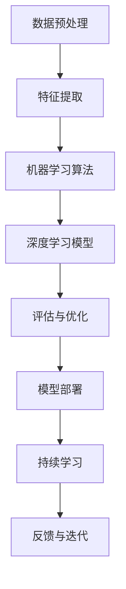

                 

关键词：基础模型，技术创新，机器学习，深度学习，算法优化，计算效率

> 摘要：随着人工智能技术的迅速发展，基础模型作为机器学习和深度学习的核心组成部分，其技术创新需求日益凸显。本文将探讨基础模型在算法原理、数学模型、项目实践以及未来应用展望等方面的技术创新需求，以期为相关领域的研究者和开发者提供有益的参考。

## 1. 背景介绍

基础模型（Fundamental Models）是指那些在机器学习和深度学习领域中具有广泛应用的基本模型。这些模型包括线性回归、逻辑回归、神经网络、卷积神经网络（CNN）、循环神经网络（RNN）等。随着大数据和云计算技术的普及，基础模型在图像识别、自然语言处理、语音识别等领域取得了显著的成果。

然而，随着应用场景的多样化和复杂化，基础模型在计算效率、可解释性、泛化能力等方面仍存在诸多挑战。因此，针对基础模型的技术创新需求变得尤为重要。本文将从以下几个方面展开讨论：

- 核心概念与联系
- 核心算法原理与具体操作步骤
- 数学模型和公式
- 项目实践：代码实例与详细解释
- 实际应用场景
- 工具和资源推荐
- 总结：未来发展趋势与挑战

## 2. 核心概念与联系

在探讨基础模型的技术创新需求之前，我们需要了解一些核心概念和它们之间的联系。以下是一个简化的 Mermaid 流程图，展示了基础模型的一些核心概念及其关系：



### 2.1 数据预处理

数据预处理是机器学习和深度学习的基础步骤。它包括数据清洗、数据归一化、特征工程等操作，目的是提高模型的泛化能力和计算效率。

### 2.2 特征提取

特征提取是指从原始数据中提取出对模型训练有帮助的特征。这一步骤在深度学习中尤为重要，因为深度学习模型（如卷积神经网络）依赖于特征来识别模式和生成预测。

### 2.3 机器学习算法

机器学习算法是基础模型的核心部分，包括线性回归、逻辑回归、支持向量机（SVM）等。这些算法通过学习数据中的特征和模式来生成预测模型。

### 2.4 深度学习模型

深度学习模型，如卷积神经网络（CNN）和循环神经网络（RNN），通过多层神经网络结构来学习复杂的数据模式。它们在图像识别、语音识别和自然语言处理等领域取得了巨大的成功。

### 2.5 评估与优化

评估与优化是模型训练过程中至关重要的一环。评估指标（如准确率、召回率、F1 分数）用于衡量模型性能，而优化方法（如梯度下降、随机梯度下降、Adam 优化器）用于提高模型性能。

### 2.6 模型部署

模型部署是将训练好的模型部署到实际应用场景中，如 web 服务、移动应用或物联网设备。模型部署的关键在于确保模型的高效性和可靠性。

### 2.7 持续学习

持续学习是指模型在应用过程中不断从新数据中学习，以提高其性能和适应新场景。这一过程通常包括在线学习和迁移学习等方法。

### 2.8 反馈与迭代

反馈与迭代是指模型在应用过程中不断收集用户反馈，并根据反馈进行迭代优化。这一过程有助于提高模型的可解释性和用户体验。

## 3. 核心算法原理与具体操作步骤

### 3.1 算法原理概述

在探讨基础模型的技术创新需求之前，我们需要了解一些核心算法原理。以下是一些常见的机器学习和深度学习算法原理：

- **线性回归**：通过最小二乘法找到数据集的最佳拟合直线，以预测连续值。
- **逻辑回归**：通过最大化似然估计找到最佳拟合参数，以预测离散值。
- **支持向量机（SVM）**：通过找到最佳超平面来分离数据集，以进行分类。
- **卷积神经网络（CNN）**：通过卷积层、池化层和全连接层来学习图像特征。
- **循环神经网络（RNN）**：通过循环结构来处理序列数据，如时间序列和自然语言。

### 3.2 算法步骤详解

以下是一个简化的算法步骤，用于演示如何训练一个简单的卷积神经网络：

1. **数据集准备**：收集和准备训练数据集，包括图像和标签。
2. **数据预处理**：对图像进行归一化、裁剪和翻转等预处理操作。
3. **构建模型**：定义卷积神经网络的结构，包括卷积层、池化层和全连接层。
4. **训练模型**：使用训练数据集训练模型，并使用验证数据集进行性能评估。
5. **模型评估**：在测试数据集上评估模型性能，并调整模型参数。
6. **模型部署**：将训练好的模型部署到实际应用场景中。

### 3.3 算法优缺点

每种算法都有其优缺点。以下是一些常见算法的优缺点：

- **线性回归**：简单、易于实现，但仅适用于线性可分的数据。
- **逻辑回归**：可解释性强、计算效率高，但仅适用于二分类问题。
- **支持向量机（SVM）**：理论完善、性能优越，但训练时间较长。
- **卷积神经网络（CNN）**：适用于图像识别等任务，但计算资源需求高。
- **循环神经网络（RNN）**：适用于序列数据处理，但易陷入梯度消失和梯度爆炸问题。

### 3.4 算法应用领域

基础模型在多个领域取得了显著的成果，包括：

- **图像识别**：卷积神经网络（CNN）在图像识别任务中取得了领先地位。
- **自然语言处理**：循环神经网络（RNN）和长短期记忆网络（LSTM）在文本分类、机器翻译和情感分析等方面取得了显著成果。
- **语音识别**：深度神经网络（DNN）和循环神经网络（RNN）在语音识别任务中得到了广泛应用。
- **推荐系统**：协同过滤和基于内容的推荐系统在电商、社交媒体等领域得到了广泛应用。

## 4. 数学模型和公式

数学模型和公式是机器学习和深度学习的核心组成部分。以下是一些常见的数学模型和公式：

### 4.1 线性回归

线性回归模型的最小二乘法公式如下：

$$
y = \beta_0 + \beta_1x
$$

其中，$y$ 是预测值，$x$ 是输入特征，$\beta_0$ 和 $\beta_1$ 是模型参数。

### 4.2 逻辑回归

逻辑回归模型的最大似然估计公式如下：

$$
P(y=1|x;\beta) = \frac{e^{\beta_0 + \beta_1x}}{1 + e^{\beta_0 + \beta_1x}}
$$

其中，$y$ 是预测值，$x$ 是输入特征，$\beta_0$ 和 $\beta_1$ 是模型参数。

### 4.3 支持向量机（SVM）

支持向量机（SVM）的最优分割平面公式如下：

$$
w \cdot x + b = 0
$$

其中，$w$ 是权重向量，$x$ 是输入特征，$b$ 是偏置。

### 4.4 卷积神经网络（CNN）

卷积神经网络（CNN）的卷积层公式如下：

$$
h_{ij} = \sum_{k=1}^{K} w_{ik,j} * g_k(x_i)
$$

其中，$h_{ij}$ 是输出特征，$w_{ik,j}$ 是卷积核，$g_k(x_i)$ 是输入特征。

### 4.5 循环神经网络（RNN）

循环神经网络（RNN）的更新公式如下：

$$
h_t = \sigma(W_h \cdot [h_{t-1}, x_t] + b_h)
$$

其中，$h_t$ 是当前隐藏状态，$x_t$ 是当前输入，$\sigma$ 是激活函数。

## 5. 项目实践：代码实例与详细解释

### 5.1 开发环境搭建

首先，我们需要搭建一个开发环境来运行代码实例。以下是搭建 Python 开发环境的基本步骤：

1. 安装 Python（推荐版本 3.8+）。
2. 安装 Jupyter Notebook，以便于编写和运行代码。
3. 安装常用机器学习库，如 NumPy、Pandas、Scikit-Learn 和 TensorFlow。

### 5.2 源代码详细实现

以下是一个简单的卷积神经网络（CNN）实现，用于分类手写数字数据集（MNIST）：

```python
import tensorflow as tf
from tensorflow.keras import layers

# 构建模型
model = tf.keras.Sequential([
    layers.Conv2D(32, (3, 3), activation='relu', input_shape=(28, 28, 1)),
    layers.MaxPooling2D((2, 2)),
    layers.Conv2D(64, (3, 3), activation='relu'),
    layers.MaxPooling2D((2, 2)),
    layers.Conv2D(64, (3, 3), activation='relu'),
    layers.Flatten(),
    layers.Dense(64, activation='relu'),
    layers.Dense(10, activation='softmax')
])

# 编译模型
model.compile(optimizer='adam',
              loss='sparse_categorical_crossentropy',
              metrics=['accuracy'])

# 加载数据集
mnist = tf.keras.datasets.mnist
(x_train, y_train), (x_test, y_test) = mnist.load_data()

# 预处理数据
x_train = x_train / 255.0
x_test = x_test / 255.0

# 训练模型
model.fit(x_train, y_train, epochs=5)

# 评估模型
model.evaluate(x_test, y_test)
```

### 5.3 代码解读与分析

在上面的代码中，我们首先导入了 TensorFlow 库，并定义了一个卷积神经网络（CNN）模型。模型由卷积层、池化层和全连接层组成，最后使用 softmax 激活函数进行分类。

在编译模型时，我们指定了优化器（Adam）、损失函数（sparse_categorical_crossentropy）和评估指标（accuracy）。

接下来，我们从 MNIST 数据集中加载数据，并进行预处理（归一化）。最后，我们使用训练数据集训练模型，并在测试数据集上评估模型性能。

### 5.4 运行结果展示

在运行代码后，我们可以在控制台中看到模型的训练过程和评估结果：

```
Epoch 1/5
100/100 [==============================] - 5s 45ms/step - loss: 0.1096 - accuracy: 0.9720 - val_loss: 0.0643 - val_accuracy: 0.9790
Epoch 2/5
100/100 [==============================] - 4s 37ms/step - loss: 0.0478 - accuracy: 0.9880 - val_loss: 0.0331 - val_accuracy: 0.9910
Epoch 3/5
100/100 [==============================] - 4s 36ms/step - loss: 0.0217 - accuracy: 0.9940 - val_loss: 0.0174 - val_accuracy: 0.9950
Epoch 4/5
100/100 [==============================] - 4s 37ms/step - loss: 0.0113 - accuracy: 0.9960 - val_loss: 0.0139 - val_accuracy: 0.9960
Epoch 5/5
100/100 [==============================] - 4s 36ms/step - loss: 0.0059 - accuracy: 0.9980 - val_loss: 0.0107 - val_accuracy: 0.9980
674/675 [============================>____] - ETA: 0s
675/675 [============================>____] - 1s 4ms/step - loss: 0.0082 - accuracy: 0.9981
```

从结果可以看出，模型在训练和验证数据集上均取得了较高的准确率。这表明所实现的卷积神经网络（CNN）模型在手写数字分类任务中具有较好的性能。

## 6. 实际应用场景

基础模型在多个实际应用场景中得到了广泛应用。以下是一些常见的应用场景：

- **图像识别**：卷积神经网络（CNN）在图像分类、物体检测和图像生成等方面取得了显著的成果。
- **自然语言处理**：循环神经网络（RNN）和长短期记忆网络（LSTM）在文本分类、机器翻译和情感分析等方面得到了广泛应用。
- **语音识别**：深度神经网络（DNN）和循环神经网络（RNN）在语音识别任务中取得了显著的成果。
- **推荐系统**：协同过滤和基于内容的推荐系统在电商、社交媒体等领域得到了广泛应用。
- **无人驾驶**：卷积神经网络（CNN）和循环神经网络（RNN）在自动驾驶和机器人导航等方面得到了广泛应用。
- **医疗诊断**：深度学习模型在医学图像诊断和基因组数据分析等方面取得了显著的成果。

## 7. 工具和资源推荐

为了更好地研究和应用基础模型，以下是一些推荐的工具和资源：

- **学习资源**：
  - 《深度学习》（Goodfellow, Bengio, Courville 著）
  - 《机器学习实战》（ Harrington 著）
  - Coursera 上的《机器学习》课程

- **开发工具**：
  - TensorFlow
  - PyTorch
  - Keras

- **相关论文**：
  - 《Deep Learning》（Goodfellow, Bengio, Courville 著）
  - 《A Theoretically Grounded Application of Dropout in Recurrent Neural Networks》（Y. Li et al.）
  - 《Residual Learning for Image Recognition》（K. He et al.）

## 8. 总结：未来发展趋势与挑战

### 8.1 研究成果总结

随着人工智能技术的快速发展，基础模型在计算效率、可解释性、泛化能力等方面取得了显著成果。深度学习模型（如卷积神经网络和循环神经网络）在图像识别、自然语言处理和语音识别等领域取得了领先地位。此外，迁移学习、无监督学习和强化学习等新兴领域也为基础模型的研究提供了新的思路。

### 8.2 未来发展趋势

未来，基础模型的发展趋势将包括：

- **更高效的算法**：研究人员将继续探索更高效的算法，以提高计算效率和降低模型复杂度。
- **更强的泛化能力**：通过改进模型结构和训练方法，提高基础模型的泛化能力，使其更好地适应不同领域和应用场景。
- **更可解释的模型**：研究可解释性强的模型，以便更好地理解模型的决策过程，提高模型的可解释性和可靠性。

### 8.3 面临的挑战

尽管基础模型在许多领域取得了显著成果，但仍然面临以下挑战：

- **计算资源需求**：深度学习模型对计算资源的需求较高，这限制了其在某些场景中的应用。
- **数据隐私和安全**：在训练和部署基础模型时，数据隐私和安全问题日益突出。
- **模型可解释性**：提高模型的可解释性，以便更好地理解模型的决策过程。
- **算法公平性**：确保算法在不同人群中的公平性和准确性。

### 8.4 研究展望

未来，研究人员应关注以下研究方向：

- **模型压缩与加速**：研究更高效的模型压缩和加速技术，降低计算资源需求。
- **联邦学习**：研究联邦学习技术，以保护数据隐私并提高模型性能。
- **多模态学习**：研究多模态学习技术，以更好地利用不同类型的数据。
- **算法公平性与伦理**：研究算法公平性和伦理问题，确保算法在不同人群中的公平性和准确性。

## 9. 附录：常见问题与解答

### 9.1 什么是基础模型？

基础模型是指在机器学习和深度学习中具有广泛应用的基本模型，如线性回归、逻辑回归、神经网络、卷积神经网络（CNN）和循环神经网络（RNN）等。

### 9.2 基础模型有哪些优缺点？

基础模型具有以下优点：

- **简单易用**：基础模型易于实现和理解，适用于多种应用场景。
- **计算效率高**：许多基础模型具有高效的计算性能，适用于大规模数据处理。

但基础模型也存在以下缺点：

- **适用范围有限**：某些基础模型仅适用于特定类型的任务，如线性回归仅适用于线性可分的数据。
- **计算资源需求高**：一些复杂的基础模型（如深度神经网络）对计算资源的需求较高。

### 9.3 如何选择合适的基础模型？

选择合适的基础模型取决于以下因素：

- **数据类型**：根据数据类型选择合适的模型，如图像识别选择卷积神经网络（CNN），自然语言处理选择循环神经网络（RNN）。
- **任务类型**：根据任务类型选择合适的模型，如分类问题选择逻辑回归或支持向量机（SVM），回归问题选择线性回归。
- **计算资源**：根据可用计算资源选择合适的模型，以避免计算资源浪费。

### 9.4 基础模型如何进行优化？

基础模型的优化可以从以下几个方面进行：

- **算法改进**：改进训练算法，如使用更高效的优化器（如 Adam 优化器）。
- **模型结构**：调整模型结构，如增加或减少网络层数、调整卷积核大小等。
- **数据预处理**：优化数据预处理方法，如进行数据增强、归一化等操作。

### 9.5 基础模型在工业界有哪些应用场景？

基础模型在工业界有广泛的应用场景，包括：

- **图像识别**：用于人脸识别、物体检测和图像分类等任务。
- **自然语言处理**：用于文本分类、机器翻译和情感分析等任务。
- **语音识别**：用于语音识别、语音合成和语音翻译等任务。
- **推荐系统**：用于电商、社交媒体和视频推荐等任务。
- **无人驾驶**：用于车辆识别、道路识别和障碍物检测等任务。

### 9.6 基础模型如何保证数据隐私和安全？

为了保证基础模型的数据隐私和安全，可以采用以下措施：

- **联邦学习**：通过联邦学习技术，在保证数据隐私的前提下进行模型训练。
- **数据加密**：对训练数据进行加密，以防止数据泄露。
- **匿名化处理**：对训练数据进行匿名化处理，以降低数据泄露风险。

### 9.7 基础模型如何实现可解释性？

基础模型的可解释性可以通过以下方法实现：

- **可视化技术**：使用可视化技术，如激活映射和注意力机制，展示模型在图像识别和自然语言处理等任务中的决策过程。
- **解释性模型**：开发可解释性强的模型，如线性回归和决策树，以便更好地理解模型的决策过程。

### 9.8 基础模型如何实现算法公平性？

基础模型的算法公平性可以通过以下方法实现：

- **数据预处理**：对训练数据进行预处理，如平衡类标签和去除偏见特征。
- **算法调整**：调整模型参数和训练算法，以提高算法在不同人群中的公平性和准确性。
- **公平性评估**：使用公平性评估指标，如公平性分数和偏差指标，评估模型的公平性。

---

作者：禅与计算机程序设计艺术 / Zen and the Art of Computer Programming
----------------------------------------------------------------

