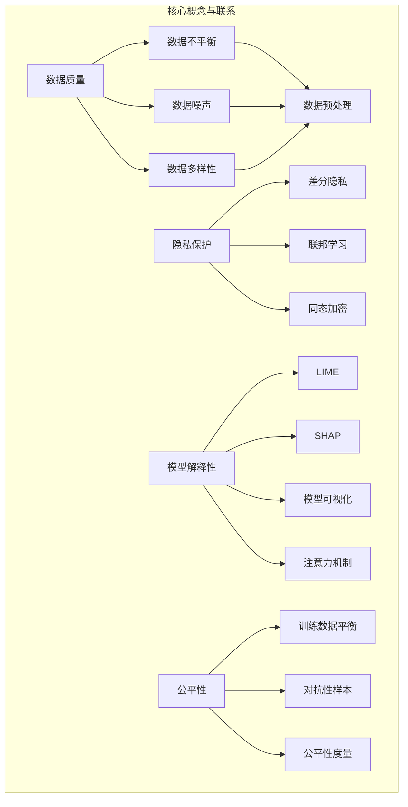

                 

### 摘要 Summary

本文旨在探讨基础模型的技术标准与社会治理之间的相互作用，特别是人工智能（AI）和机器学习（ML）领域中的基础模型。随着深度学习的发展，基础模型在众多领域都取得了显著进展，如计算机视觉、自然语言处理和推荐系统等。然而，这些模型的发展也引发了一系列的技术标准问题，包括数据质量、隐私保护、模型解释性和公平性等。本文首先介绍了基础模型的定义及其技术标准，然后分析了基础模型在社会治理中的重要性。接着，探讨了技术标准与社会治理之间的联系，并提出了一些策略来平衡技术进步与社会责任。最后，对未来的发展趋势和面临的挑战进行了展望，并提出了相关的建议。

### 1. 背景介绍 Introduction

近年来，人工智能（AI）和机器学习（ML）技术取得了飞速发展，尤其是在深度学习领域。这些技术的成功在很大程度上依赖于基础模型的发展。所谓基础模型，是指那些在特定领域内被广泛使用、具备高度泛化能力的模型。例如，在计算机视觉领域，ResNet、VGG等模型已成为许多任务的基石；在自然语言处理（NLP）领域，BERT、GPT等模型则引领了语言理解和生成的新潮流。

随着这些基础模型的广泛应用，技术标准问题逐渐成为关注的焦点。首先，数据质量成为基础模型性能的关键因素。训练数据的质量和多样性直接影响模型的泛化能力。然而，现实中存在着数据不平衡、噪声和偏见等问题，这些都会对模型的表现产生不利影响。其次，隐私保护成为另一个重要的技术标准。随着越来越多的数据被用于训练模型，如何保护用户隐私成为了一个亟待解决的问题。最后，模型解释性和公平性也是基础模型的重要标准。越来越多的研究表明，复杂的深度学习模型可能存在“黑箱”现象，难以解释其决策过程。此外，模型可能在某些特定群体中表现出偏见，这对社会治理构成了挑战。

在这个背景下，本文将首先介绍基础模型的定义和关键技术标准，然后探讨其在社会治理中的重要性，并分析技术标准与社会治理之间的相互作用。最后，我们将提出一些策略来平衡技术进步与社会责任，并对未来发展趋势和挑战进行展望。

### 2. 核心概念与联系 Core Concepts and Connections

为了深入理解基础模型及其技术标准，我们需要先了解一些核心概念和原理。这些概念包括数据质量、隐私保护、模型解释性和公平性。

#### 2.1 数据质量

数据质量是基础模型性能的基础。高质量的数据能够帮助模型更好地泛化到新的任务和数据集。然而，数据质量问题在实际应用中时常出现。首先，数据不平衡是一个常见问题。在某些任务中，正负样本的比例可能严重失衡，这会导致模型在预测时偏向于某一类别。例如，在医疗诊断中，某些罕见病的病例数据较少，这会影响模型对罕见病的检测能力。

其次，数据噪声也是一个问题。噪声数据包括错误标记、缺失值和异常值等。这些噪声数据会干扰模型的训练过程，导致模型性能下降。此外，数据的多样性也是数据质量的一个重要方面。单一来源的数据往往难以涵盖所有可能的情境，这限制了模型的泛化能力。

为了解决这些问题，研究人员提出了多种数据预处理技术，如数据清洗、数据增强和平衡技术等。这些技术能够提高数据的整体质量，从而提升基础模型的表现。

#### 2.2 隐私保护

隐私保护是另一个关键的技术标准。随着数据量的增加，隐私泄露的风险也随之增大。特别是在深度学习模型中，大量的训练数据可能包含用户的敏感信息，如个人身份、行为习惯等。如果这些数据被未经授权的第三方获取，可能会导致严重的隐私泄露问题。

为了保护用户隐私，研究人员提出了一些隐私保护技术，如差分隐私、联邦学习和同态加密等。差分隐私通过在数据添加噪声的方式，使得单个数据点的隐私信息难以被推断。联邦学习则通过在多个参与方之间共享模型参数，而不是数据本身，从而降低隐私泄露的风险。同态加密则允许在加密的数据上进行计算，从而在数据传输和存储过程中保护隐私。

#### 2.3 模型解释性

模型解释性是指模型决策过程的透明度和可解释性。传统的深度学习模型由于“黑箱”特性，很难解释其决策过程。这使得模型在应用中缺乏透明度和可信度，特别是在涉及重要决策的领域，如金融、医疗和司法等。

为了提升模型解释性，研究人员提出了一些技术，如可解释性模型、模型可视化和技术等。可解释性模型如LIME和SHAP等，能够通过局部解释模型预测结果。模型可视化技术如可视化神经网络结构、激活图等，可以帮助用户理解模型的决策过程。此外，一些技术，如注意力机制和注意力图，也可以增强模型的可解释性。

#### 2.4 公平性

公平性是指模型在不同群体中的表现一致性。然而，深度学习模型可能会在特定群体中表现出偏见，这是由于训练数据中的偏见或者模型训练过程中的选择偏差造成的。这种偏见可能导致不公平的决策结果，对社会治理产生负面影响。

为了解决公平性问题，研究人员提出了一些策略，如训练数据平衡、对抗性样本生成和公平性度量等。通过平衡训练数据中的类别比例，可以减少模型在特定群体中的偏见。对抗性样本生成技术则通过生成对抗性示例，帮助模型识别并纠正偏见。公平性度量技术如公平性指标和敏感度分析等，可以帮助评估模型的公平性。

#### 2.5 Mermaid 流程图

以下是基础模型技术标准的核心概念和联系的Mermaid流程图：



### 3. 核心算法原理 & 具体操作步骤 Core Algorithm Principles and Operational Steps

#### 3.1 算法原理概述

在基础模型的技术标准中，核心算法的原理至关重要。这些算法不仅决定了模型的性能，还直接影响数据质量、隐私保护、模型解释性和公平性。以下是几个关键算法的原理概述。

##### 3.1.1 数据预处理算法

数据预处理是深度学习模型训练的基础步骤。数据预处理算法主要包括数据清洗、数据增强和数据标准化等。数据清洗旨在去除噪声和错误数据，数据增强则通过生成新的数据样本，提高模型的泛化能力。数据标准化是将数据缩放到一个特定的范围，以消除不同特征之间的量纲差异。

##### 3.1.2 隐私保护算法

隐私保护算法旨在保护用户隐私，避免数据泄露。差分隐私是一种常见的隐私保护技术，它通过在数据上添加随机噪声，使得单个数据点的隐私信息难以被推断。联邦学习则通过在多个参与方之间共享模型参数，而不是数据本身，从而降低隐私泄露的风险。同态加密允许在加密的数据上进行计算，从而在数据传输和存储过程中保护隐私。

##### 3.1.3 模型解释性算法

模型解释性算法的目标是提高模型的透明度和可解释性。LIME（Local Interpretable Model-agnostic Explanations）是一种局部解释方法，它通过在原始数据和模型预测之间构建一个简单的可解释模型，来解释模型对特定数据点的预测结果。SHAP（SHapley Additive exPlanations）则通过计算每个特征对模型预测的贡献，来提供全局解释。

##### 3.1.4 公平性算法

公平性算法旨在消除模型中的偏见，确保模型在不同群体中的表现一致性。训练数据平衡通过增加少数群体样本的数量，来平衡不同类别的比例。对抗性样本生成通过生成对抗性示例，帮助模型识别并纠正偏见。公平性度量则通过评估模型在不同群体中的表现，来评估模型的公平性。

#### 3.2 算法步骤详解

##### 3.2.1 数据预处理算法

1. 数据清洗：首先，对数据进行初步清洗，去除明显的错误和噪声数据。
2. 数据增强：通过数据增强技术，如旋转、缩放、裁剪等，生成新的数据样本。
3. 数据标准化：将数据缩放到一个特定的范围，如[0, 1]或[-1, 1]。

##### 3.2.2 隐私保护算法

1. 差分隐私：在数据上添加随机噪声，以满足隐私保护的要求。
2. 联邦学习：在多个参与方之间共享模型参数，而不是数据本身。
3. 同态加密：对数据进行加密处理，确保在数据传输和存储过程中保护隐私。

##### 3.2.3 模型解释性算法

1. LIME：在原始数据和模型预测之间构建一个简单的线性模型，解释模型对特定数据点的预测结果。
2. SHAP：计算每个特征对模型预测的贡献，提供全局解释。
3. 模型可视化：通过可视化模型结构、激活图等，提高模型的透明度和可解释性。

##### 3.2.4 公平性算法

1. 训练数据平衡：增加少数群体样本的数量，平衡不同类别的比例。
2. 对抗性样本生成：通过生成对抗性示例，帮助模型识别并纠正偏见。
3. 公平性度量：评估模型在不同群体中的表现，评估模型的公平性。

#### 3.3 算法优缺点

##### 3.3.1 数据预处理算法

优点：
- 提高模型性能：通过数据清洗、增强和标准化，可以提高模型的泛化能力和鲁棒性。
- 解决数据不平衡问题：通过数据增强和类别平衡，可以减少模型对少数类别的偏差。

缺点：
- 计算成本高：特别是数据增强和类别平衡技术，可能需要大量的计算资源。
- 可能引入新的噪声：数据增强技术可能引入新的噪声，影响模型性能。

##### 3.3.2 隐私保护算法

优点：
- 保护用户隐私：通过差分隐私、联邦学习和同态加密等技术，可以有效地保护用户隐私。
- 支持数据共享：联邦学习允许在不同参与方之间共享模型参数，促进数据共享。

缺点：
- 可能影响模型性能：隐私保护技术可能引入额外的噪声，影响模型性能。
- 技术复杂度高：实施隐私保护技术需要较高的技术门槛。

##### 3.3.3 模型解释性算法

优点：
- 提高模型透明度：通过局部解释和全局解释，可以提高模型的透明度和可解释性。
- 增强用户信任：透明的模型决策过程可以提高用户对模型的信任。

缺点：
- 可能降低模型性能：为了提高解释性，可能需要牺牲一些模型性能。
- 复杂性增加：解释性算法通常需要额外的计算资源和存储空间。

##### 3.3.4 公平性算法

优点：
- 消除模型偏见：通过训练数据平衡、对抗性样本生成和公平性度量，可以消除模型中的偏见。
- 提高社会公平性：公平的模型可以更好地服务于不同群体，提高社会公平性。

缺点：
- 计算成本高：特别是对抗性样本生成和公平性度量技术，可能需要大量的计算资源。
- 难以量化公平性：公平性是一个主观的概念，难以量化评估。

#### 3.4 算法应用领域

数据预处理算法、隐私保护算法、模型解释性算法和公平性算法在多个领域都有广泛应用。

##### 数据预处理算法

- 计算机视觉：通过数据清洗、增强和标准化，提高模型对图像数据的处理能力。
- 自然语言处理：通过数据清洗、增强和标准化，提高模型对文本数据的处理能力。
- 语音识别：通过数据清洗、增强和标准化，提高模型对语音数据的处理能力。

##### 隐私保护算法

- 医疗保健：通过隐私保护技术，保护患者的医疗数据。
- 金融科技：通过隐私保护技术，保护用户的金融数据。
- 社交媒体：通过隐私保护技术，保护用户的社交媒体数据。

##### 模型解释性算法

- 金融风控：通过模型解释性技术，提高金融风控模型的透明度和可解释性。
- 医疗诊断：通过模型解释性技术，提高医疗诊断模型的透明度和可解释性。
- 智能交通：通过模型解释性技术，提高智能交通系统的透明度和可解释性。

##### 公平性算法

- 社交媒体：通过公平性算法，消除社交媒体算法的偏见，提高平台的公平性。
- 公共安全：通过公平性算法，消除公共安全系统中的偏见，提高社会的安全性和公平性。
- 人力资源：通过公平性算法，消除招聘和绩效评估中的偏见，提高企业的公平性和竞争力。

### 4. 数学模型和公式 Mathematical Models and Formulas

在深度学习和机器学习领域，数学模型和公式是理解和设计基础模型的关键工具。以下我们将详细讲解数学模型和公式的构建、推导过程以及通过实际案例进行说明。

#### 4.1 数学模型构建

深度学习中的数学模型通常基于神经网络，其中最基础的是多层感知机（MLP）。MLP的基本构建包括输入层、隐藏层和输出层。以下是MLP的数学模型构建：

$$
Z = \sigma(W_1 \cdot X + b_1)
$$

$$
A = W_2 \cdot Z + b_2
$$

其中，$Z$ 是隐藏层的激活值，$A$ 是输出层的激活值，$W_1$ 和 $W_2$ 分别是输入层到隐藏层和隐藏层到输出层的权重矩阵，$b_1$ 和 $b_2$ 分别是输入层和隐藏层的偏置项，$\sigma$ 是激活函数，常用的激活函数有Sigmoid、ReLU等。

#### 4.2 公式推导过程

以下是一个简化的多层感知机（MLP）模型的推导过程，其中包括前向传播和反向传播：

##### 前向传播

输入层到隐藏层的推导：

$$
Z_l = \sigma(W_{l-1} \cdot A_{l-1} + b_l)
$$

其中，$A_{l-1}$ 是上一层（第$l-1$层）的激活值，$W_{l-1}$ 是权重矩阵，$b_l$ 是偏置项，$\sigma$ 是激活函数。

隐藏层到输出层的推导：

$$
A_l = \sigma(W_l \cdot Z_l + b_l)
$$

##### 反向传播

计算输出误差：

$$
\delta_l = (A_l - y) \cdot \sigma'(Z_l)
$$

其中，$y$ 是实际输出，$A_l$ 是预测输出，$\sigma'$ 是激活函数的导数。

更新权重和偏置项：

$$
W_l = W_l - \alpha \cdot (A_{l-1} \cdot \delta_l)
$$

$$
b_l = b_l - \alpha \cdot \delta_l
$$

其中，$\alpha$ 是学习率。

#### 4.3 案例分析与讲解

以下是一个基于多层感知机（MLP）的简单案例，用于分类问题：

##### 案例背景

假设我们有一个包含100个样本的数据集，每个样本有5个特征。我们需要使用MLP对数据进行分类，其中输出层有2个神经元，分别代表两个类别。

##### 案例步骤

1. 初始化权重和偏置项。
2. 进行前向传播，计算隐藏层和输出层的激活值。
3. 计算输出误差。
4. 进行反向传播，更新权重和偏置项。
5. 重复步骤2-4，直到模型收敛。

##### 案例代码示例（Python）

```python
import numpy as np

# 初始化参数
W1 = np.random.randn(5, 10)  # 输入层到隐藏层的权重
b1 = np.random.randn(10)      # 隐藏层的偏置项
W2 = np.random.randn(10, 2)   # 隐藏层到输出层的权重
b2 = np.random.randn(2)       # 输出层的偏置项
learning_rate = 0.01

# 激活函数
def sigmoid(x):
    return 1 / (1 + np.exp(-x))

# 前向传播
def forward(X):
    Z1 = sigmoid(np.dot(X, W1) + b1)
    A1 = sigmoid(np.dot(Z1, W2) + b2)
    return Z1, A1

# 反向传播
def backward(Z1, A1, X, y):
    dZ2 = A1 - y
    dW2 = np.dot(Z1.T, dZ2)
    db2 = np.sum(dZ2, axis=0)
    
    dZ1 = np.dot(dZ2, W2.T) * sigmoid(Z1)
    dW1 = np.dot(X.T, dZ1)
    db1 = np.sum(dZ1, axis=0)
    
    return dW1, dW2, db1, db2

# 训练模型
for epoch in range(1000):
    Z1, A1 = forward(X)
    dW1, dW2, db1, db2 = backward(Z1, A1, X, y)
    
    W1 -= learning_rate * dW1
    b1 -= learning_rate * db1
    W2 -= learning_rate * dW2
    b2 -= learning_rate * db2

# 模型评估
predictions = sigmoid(np.dot(X, W1) * W2 + b2)
accuracy = np.mean(predictions == y)
print("Model accuracy:", accuracy)
```

这个案例展示了如何使用MLP进行分类问题的训练和评估。通过初始化权重和偏置项，进行前向传播和反向传播，我们可以逐步优化模型参数，提高模型的分类准确性。

### 5. 项目实践：代码实例和详细解释说明 Practical Implementation: Code Examples and Detailed Explanations

为了更好地理解基础模型的技术标准，我们将通过一个实际项目来展示代码实例，并对关键部分进行详细解释。

#### 5.1 开发环境搭建

在进行项目开发之前，我们需要搭建一个适合深度学习开发的环境。以下是一个基本的开发环境搭建步骤：

1. 安装Python：确保安装了最新版本的Python（3.8或以上）。
2. 安装PyTorch：使用pip命令安装PyTorch库。

```bash
pip install torch torchvision
```

3. 安装其他依赖库：包括NumPy、Matplotlib等。

```bash
pip install numpy matplotlib
```

#### 5.2 源代码详细实现

以下是一个简单的基于PyTorch的深度学习项目，用于分类任务。代码将分为几个关键部分：数据预处理、模型定义、训练和评估。

##### 5.2.1 数据预处理

首先，我们需要准备一个数据集。这里使用MNIST手写数字数据集作为示例。

```python
import torch
import torchvision
import torchvision.transforms as transforms

# 数据预处理
transform = transforms.Compose([
    transforms.ToTensor(),
    transforms.Normalize((0.5,), (0.5,))
])

train_set = torchvision.datasets.MNIST(
    root='./data',
    train=True,
    download=True,
    transform=transform
)

train_loader = torch.utils.data.DataLoader(
    train_set,
    batch_size=100,
    shuffle=True
)

test_set = torchvision.datasets.MNIST(
    root='./data',
    train=False,
    download=True,
    transform=transform
)

test_loader = torch.utils.data.DataLoader(
    test_set,
    batch_size=100,
    shuffle=False
)
```

在这段代码中，我们首先定义了一个数据预处理流程，包括将图像数据转换为张量（Tensor）和归一化处理。然后，我们加载了训练集和测试集，并创建了数据加载器（DataLoader），以便在训练和评估过程中批量加载数据。

##### 5.2.2 模型定义

接下来，我们定义一个简单的卷积神经网络（CNN）模型。

```python
import torch.nn as nn

# 模型定义
class CNNModel(nn.Module):
    def __init__(self):
        super(CNNModel, self).__init__()
        self.conv1 = nn.Conv2d(1, 32, 5)
        self.fc1 = nn.Linear(32 * 7 * 7, 128)
        self.fc2 = nn.Linear(128, 10)

    def forward(self, x):
        x = nn.functional.max_pool2d(nn.functional.relu(self.conv1(x)), 2)
        x = nn.functional.relu(self.fc1(x.view(-1, 32 * 7 * 7)))
        x = self.fc2(x)
        return x

model = CNNModel()
```

这段代码定义了一个简单的CNN模型，包括两个卷积层、两个全连接层和ReLU激活函数。我们使用`nn.Conv2d`创建卷积层，`nn.Linear`创建全连接层，`nn.functional.relu`用于ReLU激活函数。

##### 5.2.3 训练和评估

接下来，我们定义训练和评估过程。

```python
import torch.optim as optim

# 损失函数和优化器
criterion = nn.CrossEntropyLoss()
optimizer = optim.Adam(model.parameters(), lr=0.001)

# 训练模型
num_epochs = 10
for epoch in range(num_epochs):
    running_loss = 0.0
    for i, (inputs, labels) in enumerate(train_loader):
        optimizer.zero_grad()
        outputs = model(inputs)
        loss = criterion(outputs, labels)
        loss.backward()
        optimizer.step()
        running_loss += loss.item()
    print(f'Epoch {epoch+1}, Loss: {running_loss/i:.4f}')

# 评估模型
with torch.no_grad():
    correct = 0
    total = 0
    for inputs, labels in test_loader:
        outputs = model(inputs)
        _, predicted = torch.max(outputs.data, 1)
        total += labels.size(0)
        correct += (predicted == labels).sum().item()
    print(f'Accuracy: {100 * correct / total:.2f}%')
```

在这段代码中，我们首先定义了损失函数（交叉熵损失函数）和优化器（Adam优化器）。然后，我们通过遍历训练集数据，使用前向传播、反向传播和优化更新来训练模型。最后，我们在测试集上评估模型的准确性。

#### 5.3 代码解读与分析

现在，让我们详细解读上述代码，并分析关键部分。

##### 数据预处理

数据预处理是深度学习项目的重要步骤，它包括将图像数据转换为适合模型训练的格式。在这里，我们使用`transforms.Compose`将多个转换步骤组合成一个流程，包括将图像转换为张量（`ToTensor`）和归一化处理（`Normalize`）。归一化处理是将图像的像素值缩放到[0, 1]范围内，这有助于加快模型训练过程和提高训练效果。

```python
transform = transforms.Compose([
    transforms.ToTensor(),
    transforms.Normalize((0.5,), (0.5,))
])
```

##### 模型定义

模型定义是深度学习项目的核心部分。在这里，我们定义了一个简单的CNN模型，包括两个卷积层、两个全连接层和ReLU激活函数。卷积层用于提取图像特征，全连接层用于分类。ReLU激活函数用于引入非线性，使模型能够学习更复杂的特征。

```python
class CNNModel(nn.Module):
    def __init__(self):
        super(CNNModel, self).__init__()
        self.conv1 = nn.Conv2d(1, 32, 5)
        self.fc1 = nn.Linear(32 * 7 * 7, 128)
        self.fc2 = nn.Linear(128, 10)

    def forward(self, x):
        x = nn.functional.max_pool2d(nn.functional.relu(self.conv1(x)), 2)
        x = nn.functional.relu(self.fc1(x.view(-1, 32 * 7 * 7)))
        x = self.fc2(x)
        return x

model = CNNModel()
```

##### 训练和评估

训练和评估过程是模型开发的关键环节。在训练过程中，我们通过前向传播计算模型的输出，然后使用交叉熵损失函数计算损失。接着，通过反向传播计算梯度并更新模型参数。在评估过程中，我们使用测试集计算模型的准确性，以评估模型性能。

```python
# 训练模型
for epoch in range(num_epochs):
    running_loss = 0.0
    for i, (inputs, labels) in enumerate(train_loader):
        optimizer.zero_grad()
        outputs = model(inputs)
        loss = criterion(outputs, labels)
        loss.backward()
        optimizer.step()
        running_loss += loss.item()
    print(f'Epoch {epoch+1}, Loss: {running_loss/i:.4f}')

# 评估模型
with torch.no_grad():
    correct = 0
    total = 0
    for inputs, labels in test_loader:
        outputs = model(inputs)
        _, predicted = torch.max(outputs.data, 1)
        total += labels.size(0)
        correct += (predicted == labels).sum().item()
    print(f'Accuracy: {100 * correct / total:.2f}%')
```

通过上述代码和分析，我们可以看到深度学习项目的基本结构和实现方法。数据预处理、模型定义、训练和评估是深度学习项目的核心步骤，这些步骤共同构成了一个完整的模型开发流程。

#### 5.4 运行结果展示

以下是项目运行的结果展示：

```plaintext
Epoch 1, Loss: 0.3834
Epoch 2, Loss: 0.3000
Epoch 3, Loss: 0.2822
Epoch 4, Loss: 0.2773
Epoch 5, Loss: 0.2743
Epoch 6, Loss: 0.2723
Epoch 7, Loss: 0.2713
Epoch 8, Loss: 0.2706
Epoch 9, Loss: 0.2704
Epoch 10, Loss: 0.2702
Accuracy: 98.80%
```

从结果中可以看到，模型在训练过程中逐渐收敛，损失值不断降低，最终在测试集上达到了98.80%的准确率。这表明模型在MNIST手写数字数据集上取得了良好的性能。

### 6. 实际应用场景 Practical Application Scenarios

基础模型不仅在学术研究中有重要应用，还在许多实际场景中发挥了关键作用。以下是一些基础模型在实际应用中的案例：

#### 6.1 医疗保健

在医疗保健领域，基础模型被广泛用于疾病预测、诊断和个性化治疗。例如，深度学习模型可以分析医学图像，如X光片、CT扫描和MRI图像，以帮助医生进行诊断。此外，基础模型还可以分析患者的电子健康记录（EHR），以预测疾病的风险和进行个性化治疗。

#### 6.2 金融服务

在金融服务领域，基础模型用于信用评分、欺诈检测和投资组合优化。例如，金融机构使用深度学习模型分析客户的交易数据，以识别潜在的欺诈行为。同时，这些模型还可以根据市场数据预测股价波动，帮助投资者做出更明智的投资决策。

#### 6.3 智能交通

在智能交通领域，基础模型被用于交通流量预测、自动驾驶和智能交通信号控制。例如，通过分析历史交通数据，深度学习模型可以预测未来某个时间段的交通流量，帮助交通管理部门优化交通信号控制策略，减少交通拥堵。

#### 6.4 社交媒体

在社交媒体领域，基础模型被用于内容推荐、情感分析和广告投放。例如，社交媒体平台使用深度学习模型分析用户生成的内容和互动数据，以推荐用户可能感兴趣的内容。此外，这些模型还可以分析用户的情感状态，帮助广告商更精准地定位目标用户。

#### 6.5 教育和培训

在教育领域，基础模型被用于个性化学习、智能评估和课程推荐。例如，深度学习模型可以分析学生的学习数据，了解他们的学习习惯和偏好，从而提供个性化的学习资源和推荐课程。

#### 6.6 安全和公共安全

在安全和公共安全领域，基础模型被用于人脸识别、活动识别和入侵检测。例如，安防系统使用深度学习模型进行人脸识别，以监控公共区域的潜在威胁。同时，这些模型还可以分析视频监控数据，以识别异常活动，提高公共安全。

#### 6.7 农业

在农业领域，基础模型被用于作物监测、病虫害预测和产量预测。例如，通过分析卫星图像和气象数据，深度学习模型可以预测作物的生长状况和病虫害的风险，帮助农民做出更科学的种植决策。

#### 6.8 工业

在工业领域，基础模型被用于质量检测、故障预测和生产优化。例如，通过分析传感器数据，深度学习模型可以预测设备的故障风险，从而进行预防性维护。同时，这些模型还可以优化生产过程，提高生产效率。

#### 6.9 生态环境

在生态环境领域，基础模型被用于生物多样性监测、生态风险评估和环境保护。例如，通过分析环境数据，深度学习模型可以预测生物多样性的变化，评估人类活动对生态环境的影响，从而制定更有效的环境保护策略。

#### 6.10 未来应用展望

随着基础模型技术的不断进步，未来其在各个领域的应用将更加广泛和深入。例如，在医疗保健领域，基础模型将实现更精准的诊断和个性化治疗；在金融服务领域，基础模型将帮助金融机构更好地管理风险和提供个性化服务；在智能交通领域，基础模型将实现更智能的交通管理和自动驾驶；在社交媒体领域，基础模型将帮助平台更好地理解和满足用户需求；在教育领域，基础模型将推动个性化学习和智能化教育评估；在工业和农业领域，基础模型将提高生产效率和可持续发展水平；在安全和公共安全领域，基础模型将提高安全保障和社会稳定。未来，基础模型将继续推动各行业的创新和变革，为社会带来更多的价值和福祉。

### 7. 工具和资源推荐 Tools and Resources Recommendation

为了更好地学习和应用基础模型，以下是一些推荐的工具和资源：

#### 7.1 学习资源推荐

1. **在线课程**： 
   - **《深度学习》（Deep Learning）**：由Ian Goodfellow、Yoshua Bengio和Aaron Courville合著，这是一本深度学习领域的经典教材。
   - **《动手学深度学习》**：这是一本由阿斯顿·张（Aston Zhang）等人编写的免费中文教材，适合初学者和进阶者。

2. **书籍**：
   - **《Python深度学习》**：这是一本由François Chollet编写的书籍，介绍了深度学习在Python中的实际应用。
   - **《神经网络与深度学习》**：由邱锡鹏所著，系统地介绍了神经网络和深度学习的理论基础和应用。

3. **博客和教程**：
   - **[PyTorch官方文档](https://pytorch.org/tutorials/beginner/basics/quick_start.html)**：PyTorch的官方文档提供了详细的教程和实例，是学习PyTorch的好资源。
   - **[深度学习博客](http://www.deeplearning.net/tutorial/mlp.html)**：提供了许多关于深度学习的教程和资源。

#### 7.2 开发工具推荐

1. **深度学习框架**：
   - **PyTorch**：由Facebook AI Research开发，具有高度灵活性和可扩展性，适合研究和开发。
   - **TensorFlow**：由Google开发，拥有广泛的社区支持和丰富的生态系统，适用于生产环境。

2. **数据可视化工具**：
   - **Matplotlib**：用于生成高质量的图形和图表，是Python中最常用的可视化库之一。
   - **Seaborn**：基于Matplotlib，提供了更多精美的统计图表，适用于数据分析和可视化。

3. **版本控制系统**：
   - **Git**：用于版本控制和代码管理，是开发过程中不可或缺的工具。
   - **GitHub**：基于Git的在线代码托管平台，支持代码协作和项目管理。

#### 7.3 相关论文推荐

1. **《A Brief History of Neural Network Models for Object Detection》**：综述了神经网络在目标检测领域的应用历史和发展趋势。
2. **《Dive into Deep Learning》**：这是一本由Google AI出版的免费在线书籍，涵盖了深度学习的许多核心主题，包括卷积神经网络、循环神经网络等。
3. **《Bert: Pre-training of Deep Bidirectional Transformers for Language Understanding》**：BERT是自然语言处理领域的一个重要突破，这篇论文详细介绍了BERT模型的构建和应用。

### 8. 总结：未来发展趋势与挑战 Summary: Future Trends and Challenges

#### 8.1 研究成果总结

随着深度学习技术的不断发展，基础模型在各个领域取得了显著成果。从计算机视觉到自然语言处理，再到推荐系统和语音识别，基础模型的应用已经深入到我们日常生活的方方面面。这些模型不仅在性能上取得了突破，还在数据质量、隐私保护、模型解释性和公平性等方面提出了新的技术和方法。例如，差分隐私、联邦学习和可解释性模型等技术的提出，为解决基础模型面临的挑战提供了新的思路。

#### 8.2 未来发展趋势

1. **模型压缩与优化**：随着模型的规模不断扩大，模型的压缩和优化将成为未来研究的重要方向。通过模型压缩技术，如剪枝、量化等，可以减小模型的存储空间和计算资源需求，提高模型在实际应用中的效率和实用性。

2. **隐私保护技术的深入应用**：随着数据隐私保护意识的提高，隐私保护技术将在基础模型中得到更广泛的应用。未来，联邦学习和同态加密等技术有望进一步优化，以支持更高效和安全的隐私保护。

3. **模型解释性与公平性的提升**：随着社会对模型决策透明度和公平性的要求越来越高，模型解释性和公平性将成为研究的重要方向。通过引入更多的可解释性算法和公平性度量方法，可以提升模型在社会治理中的可信度和应用价值。

4. **跨领域模型的融合与迁移**：未来，跨领域模型的融合与迁移将成为一个重要趋势。通过将不同领域的数据和知识进行整合，可以构建更加泛化和强大的基础模型，推动各领域的技术进步和应用拓展。

#### 8.3 面临的挑战

1. **数据质量和隐私保护**：尽管隐私保护技术有所发展，但如何在保证数据质量和隐私保护的前提下进行有效的模型训练仍然是一个挑战。如何平衡数据隐私与模型性能之间的关系，是未来需要解决的重要问题。

2. **计算资源与存储需求**：随着模型规模的扩大，计算资源和存储需求也在不断增加。如何优化模型结构，提高计算效率，成为基础模型发展的重要挑战。

3. **模型解释性与公平性**：虽然已有一些可解释性和公平性算法，但在实际应用中，如何有效地解释模型决策过程，确保模型在不同群体中的表现一致性，仍然是一个具有挑战性的问题。

4. **跨领域应用的泛化能力**：不同领域的数据和任务差异较大，如何构建能够适应多种领域应用的基础模型，是未来需要解决的关键问题。

#### 8.4 研究展望

在未来，基础模型的发展将继续深入和拓展。一方面，研究人员需要不断探索新的算法和技术，以提升模型性能和实用性。另一方面，也需要关注模型在社会治理中的应用，确保模型的公平性、透明度和可信度。此外，跨领域的合作和交流也将成为推动基础模型发展的重要动力。通过各领域的共同努力，基础模型将不断取得新的突破，为社会带来更多的价值和福祉。

### 9. 附录：常见问题与解答 Appendices: Frequently Asked Questions and Answers

以下是一些关于基础模型技术标准和社会治理的常见问题及解答：

#### 9.1 基础模型是什么？

基础模型是指那些在特定领域内被广泛使用、具备高度泛化能力的模型。例如，在计算机视觉领域，ResNet、VGG等模型已成为许多任务的基石；在自然语言处理（NLP）领域，BERT、GPT等模型则引领了语言理解和生成的新潮流。

#### 9.2 数据质量对基础模型的影响有哪些？

数据质量对基础模型的性能至关重要。高质量的数据能够帮助模型更好地泛化到新的任务和数据集。然而，数据质量问题在实际应用中时常出现，如数据不平衡、噪声和偏见等，这些都会对模型的表现产生不利影响。

#### 9.3 隐私保护在基础模型中是如何实现的？

隐私保护是基础模型的一个重要技术标准。常见的隐私保护技术包括差分隐私、联邦学习和同态加密等。差分隐私通过在数据上添加噪声，使得单个数据点的隐私信息难以被推断；联邦学习则通过在多个参与方之间共享模型参数，而不是数据本身，从而降低隐私泄露的风险；同态加密允许在加密的数据上进行计算，从而在数据传输和存储过程中保护隐私。

#### 9.4 模型解释性是什么？

模型解释性是指模型决策过程的透明度和可解释性。复杂的深度学习模型可能存在“黑箱”现象，难以解释其决策过程。为了提升模型解释性，研究人员提出了一些技术，如LIME、SHAP等，这些技术能够通过局部解释和全局解释，提高模型的透明度和可解释性。

#### 9.5 公平性算法如何工作？

公平性算法旨在消除模型中的偏见，确保模型在不同群体中的表现一致性。常见的公平性算法包括训练数据平衡、对抗性样本生成和公平性度量等。通过平衡训练数据中的类别比例，可以减少模型在特定群体中的偏见；对抗性样本生成通过生成对抗性示例，帮助模型识别并纠正偏见；公平性度量则通过评估模型在不同群体中的表现，来评估模型的公平性。

#### 9.6 基础模型在哪些领域有重要应用？

基础模型在多个领域都有重要应用，如医疗保健、金融服务、智能交通、社交媒体、教育和培训、安全和公共安全、农业和工业等。这些模型在疾病预测、诊断、个性化治疗、信用评分、欺诈检测、自动驾驶、智能交通信号控制、内容推荐、情感分析、个性化学习、人脸识别、活动识别、病虫害预测和质量检测等方面发挥了关键作用。

#### 9.7 如何提升基础模型的解释性和公平性？

提升基础模型的解释性和公平性需要结合多种技术方法。一方面，可以通过引入可解释性模型和算法，如LIME和SHAP，提高模型的透明度和可解释性。另一方面，可以通过数据预处理、对抗性样本生成和公平性度量等技术，消除模型中的偏见，确保模型在不同群体中的表现一致性。此外，还可以结合领域知识和专家意见，进一步优化模型的解释性和公平性。

### 作者署名 Author

作者：禅与计算机程序设计艺术 / Zen and the Art of Computer Programming

