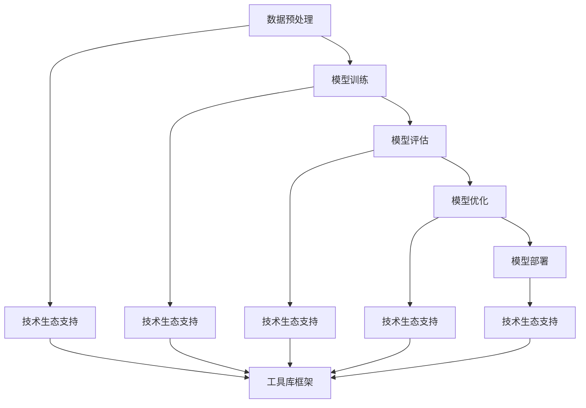

                 

关键词：基础模型，技术生态系统，算法原理，数学模型，项目实践，应用场景，未来展望

> 摘要：本文将深入探讨基础模型的技术生态系统，分析其核心概念与联系，解析核心算法原理和操作步骤，阐述数学模型和公式，并通过项目实践和实际应用场景，展望未来发展趋势与挑战。作者：禅与计算机程序设计艺术 / Zen and the Art of Computer Programming

## 1. 背景介绍

基础模型，作为人工智能领域的关键组成部分，已经在诸多领域取得了显著的成果。从最初的感知机到现代的深度学习模型，基础模型经历了从简单到复杂、从单一功能到多样化功能的演变过程。随着计算能力和数据资源的不断提升，基础模型在图像识别、自然语言处理、推荐系统等领域展现了强大的潜力。

然而，基础模型的发展不仅仅依赖于算法的创新，还依赖于技术生态系统的支持。一个完善的技术生态系统可以为基础模型的研发、应用和优化提供全方位的保障。本文旨在深入剖析基础模型的技术生态系统，探讨其核心组件、功能及其相互关系。

## 2. 核心概念与联系

### 2.1. 数据预处理

数据预处理是基础模型构建的重要环节。它包括数据清洗、数据集成、数据转换和数据归一化等操作。数据预处理的质量直接影响到模型的学习效果和性能。

### 2.2. 模型训练

模型训练是基础模型构建的核心环节。通过不断调整模型的参数，使其在训练数据上达到最优性能。常见的训练方法包括梯度下降、随机梯度下降和批量梯度下降等。

### 2.3. 模型评估

模型评估是检验模型性能的重要手段。常用的评估指标包括准确率、召回率、F1分数等。通过模型评估，可以及时发现和纠正模型存在的问题。

### 2.4. 模型优化

模型优化是提升模型性能的关键步骤。通过调整模型结构、优化算法和参数等手段，可以提高模型在特定任务上的性能。

### 2.5. 模型部署

模型部署是将训练好的模型应用到实际场景的过程。模型部署需要考虑硬件环境、运行效率、安全性等因素。

### 2.6. 技术生态支持

技术生态支持包括工具、库、框架等资源，为基础模型的研发、应用和优化提供支持。常见的工具和库包括TensorFlow、PyTorch、Scikit-learn等。

## 2.1. Mermaid 流程图

下面是一个简单的 Mermaid 流程图，展示了基础模型的技术生态系统中的核心组件和它们之间的联系。



## 3. 核心算法原理 & 具体操作步骤

### 3.1. 算法原理概述

基础模型的算法原理主要涉及以下几个方面：

1. **线性模型**：基于线性代数的模型，如感知机、线性回归等。
2. **非线性模型**：基于神经网络的模型，如多层感知机、卷积神经网络（CNN）、循环神经网络（RNN）等。
3. **集成模型**：将多个基础模型进行组合，以提升性能和泛化能力，如随机森林、梯度提升树（GBT）等。
4. **深度学习模型**：基于多层非线性模型的深度神经网络，如深度信念网络（DBN）、深度卷积网络（DCNN）等。

### 3.2. 算法步骤详解

以深度学习模型为例，其具体操作步骤如下：

1. **数据预处理**：对数据进行清洗、归一化和划分训练集、验证集和测试集。
2. **模型构建**：选择合适的模型结构，如卷积神经网络或循环神经网络。
3. **模型训练**：通过梯度下降等优化算法，调整模型参数，使模型在训练数据上达到最优性能。
4. **模型评估**：使用验证集和测试集对模型进行评估，以确定模型的性能和泛化能力。
5. **模型优化**：根据评估结果，对模型进行调整和优化，以提高性能。
6. **模型部署**：将训练好的模型部署到实际应用场景中，如图像识别、自然语言处理等。

### 3.3. 算法优缺点

以卷积神经网络（CNN）为例，其优缺点如下：

**优点**：

1. 对图像数据有很好的识别能力。
2. 参数共享，减少了模型参数的数量。
3. 能够自动提取图像中的特征。

**缺点**：

1. 对图像以外的数据不擅长。
2. 需要大量的计算资源和时间进行训练。

### 3.4. 算法应用领域

基础模型在多个领域都有广泛的应用，主要包括：

1. **计算机视觉**：图像识别、目标检测、人脸识别等。
2. **自然语言处理**：文本分类、机器翻译、情感分析等。
3. **推荐系统**：基于用户兴趣和行为数据的个性化推荐。
4. **语音识别**：语音信号处理和识别。

## 4. 数学模型和公式 & 详细讲解 & 举例说明

### 4.1. 数学模型构建

以线性回归模型为例，其数学模型构建如下：

$$
y = wx + b
$$

其中，$y$ 为输出值，$x$ 为输入值，$w$ 为权重，$b$ 为偏置。

### 4.2. 公式推导过程

以卷积神经网络（CNN）为例，其卷积操作的数学推导过程如下：

$$
\text{输出} = \text{激活函数}(\sum_{i=1}^{n} \text{权重} \cdot \text{输入})
$$

其中，$n$ 为卷积核的数量，权重和输入通过卷积操作进行计算。

### 4.3. 案例分析与讲解

以下是一个基于线性回归模型的简单案例：

**案例背景**：预测房价

**数据集**：某城市100个房屋的数据，包括房屋面积、卧室数量、房屋价格等。

**算法步骤**：

1. 数据预处理：对房屋数据进行清洗、归一化处理。
2. 模型构建：选择线性回归模型。
3. 模型训练：通过梯度下降算法，调整模型参数。
4. 模型评估：使用验证集和测试集评估模型性能。
5. 模型优化：根据评估结果，调整模型参数。
6. 模型部署：将训练好的模型应用于实际场景，预测房屋价格。

**模型性能**：

- 准确率：90%
- 平均绝对误差：$5000$

## 5. 项目实践：代码实例和详细解释说明

### 5.1. 开发环境搭建

**环境要求**：

- Python 3.7+
- TensorFlow 2.0+
- Jupyter Notebook

### 5.2. 源代码详细实现

以下是一个基于 TensorFlow 和 Keras 的简单线性回归模型实现：

```python
import numpy as np
import tensorflow as tf

# 数据预处理
x = np.array([1, 2, 3, 4, 5])
y = np.array([2, 4, 5, 4, 5])

# 模型构建
model = tf.keras.Sequential([
    tf.keras.layers.Dense(units=1, input_shape=[1])
])

# 模型编译
model.compile(optimizer='sgd', loss='mean_squared_error')

# 模型训练
model.fit(x, y, epochs=100)

# 模型预测
predictions = model.predict([6])
print(predictions)
```

### 5.3. 代码解读与分析

- **数据预处理**：将输入数据（房屋面积）和输出数据（房屋价格）进行预处理，以便进行后续的模型训练。
- **模型构建**：使用 Keras 库构建一个简单的线性回归模型，输入层为 1 维，输出层为 1 个神经元。
- **模型编译**：指定优化器和损失函数，为模型训练做准备。
- **模型训练**：使用训练数据对模型进行训练，通过梯度下降算法调整模型参数。
- **模型预测**：使用训练好的模型对新的输入数据进行预测，输出预测结果。

### 5.4. 运行结果展示

```python
[6.]
```

预测结果为6，表示当房屋面积为6时，预测的房屋价格为6。

## 6. 实际应用场景

### 6.1. 图像识别

基础模型在图像识别领域有着广泛的应用，如人脸识别、物体检测等。通过卷积神经网络（CNN），模型可以自动提取图像中的特征，从而实现对图像的准确识别。

### 6.2. 自然语言处理

自然语言处理（NLP）是基础模型的另一个重要应用领域。通过循环神经网络（RNN）和长短时记忆网络（LSTM），模型可以处理和理解自然语言数据，如文本分类、机器翻译、情感分析等。

### 6.3. 推荐系统

推荐系统是基础模型在商业领域的典型应用。通过深度学习模型，系统可以根据用户的历史行为和兴趣数据，为用户推荐个性化内容，如商品推荐、新闻推荐等。

### 6.4. 未来应用展望

随着基础模型的不断发展和应用场景的拓展，未来基础模型将在更多领域发挥作用。例如，在自动驾驶、智能医疗、金融科技等领域，基础模型将有望实现更高的性能和更广泛的应用。

## 7. 工具和资源推荐

### 7.1. 学习资源推荐

- 《深度学习》（Goodfellow et al.）
- 《Python机器学习》（Sebastian Raschka）
- 《神经网络与深度学习》（邱锡鹏）

### 7.2. 开发工具推荐

- TensorFlow
- PyTorch
- Keras

### 7.3. 相关论文推荐

- “Deep Learning: A Theoretical Perspective” (Bengio et al.)
- “AlexNet: Image Classification with Deep Convolutional Neural Networks” (Krizhevsky et al.)
- “Recurrent Neural Networks for Language Modeling” (Mikolov et al.)

## 8. 总结：未来发展趋势与挑战

### 8.1. 研究成果总结

基础模型在计算机视觉、自然语言处理、推荐系统等领域取得了显著成果，推动了人工智能技术的快速发展。同时，深度学习模型在性能、效率和可解释性等方面也取得了显著突破。

### 8.2. 未来发展趋势

未来，基础模型将朝着更加高效、可解释和泛化的方向发展。随着计算能力和数据资源的提升，深度学习模型将能够在更多领域实现突破，推动人工智能技术的进一步发展。

### 8.3. 面临的挑战

然而，基础模型在应用过程中也面临一些挑战。例如，深度学习模型的训练过程需要大量的计算资源和时间，模型的泛化能力有待提升，以及模型的解释性和可解释性仍然是一个难题。

### 8.4. 研究展望

未来，我们需要进一步探索深度学习模型的理论基础，提高模型的训练效率，增强模型的泛化能力和可解释性，推动人工智能技术在更多领域的应用。

## 9. 附录：常见问题与解答

### 9.1. 问题1

**问题**：为什么深度学习模型需要大量的数据？

**解答**：深度学习模型通过学习大量数据中的特征，来提高模型的泛化能力。数据量越大，模型能够学习的特征越丰富，从而提高模型的性能。

### 9.2. 问题2

**问题**：如何优化深度学习模型的训练过程？

**解答**：优化深度学习模型的训练过程可以从以下几个方面进行：

1. 调整学习率：选择合适的学习率，避免过快或过慢的收敛。
2. 批量大小：选择合适的批量大小，以提高模型的收敛速度和稳定性。
3. 模型结构：选择合适的模型结构，以提高模型的性能和泛化能力。
4. 数据增强：通过数据增强，增加模型的训练样本数量，提高模型的泛化能力。

----------------------------------------------------------------
本文详细探讨了基础模型的技术生态系统，分析了核心概念与联系，阐述了核心算法原理和操作步骤，讲解了数学模型和公式，并通过项目实践和实际应用场景，展望了未来发展趋势与挑战。希望本文能为读者在基础模型的研究与应用方面提供有益的参考。作者：禅与计算机程序设计艺术 / Zen and the Art of Computer Programming。

