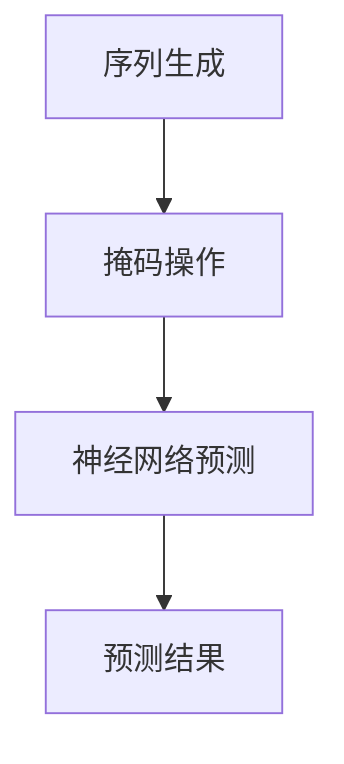

                 

关键词：基础模型，掩码，语言建模，深度学习，序列预测，神经网络，计算语言学，自然语言处理

## 摘要

本文将探讨基础模型在自然语言处理（NLP）中的一项关键技术——掩码语言建模（Masked Language Modeling，MLM）。MLM作为近年来深度学习在NLP领域的突破性进展，被广泛应用于词向量表示、序列预测、文本生成等领域。本文将从背景介绍、核心概念与联系、核心算法原理、数学模型和公式、项目实践、实际应用场景、工具和资源推荐以及未来发展趋势与挑战等方面，系统性地阐述MLM的基本理论、实践应用和发展前景。

## 1. 背景介绍

自然语言处理作为人工智能的一个重要分支，旨在使计算机能够理解、生成和回应自然语言。自然语言处理的应用场景广泛，包括语音识别、机器翻译、文本摘要、问答系统等。在过去的几十年里，深度学习技术，尤其是神经网络的发展，极大地推动了自然语言处理的发展。

传统的NLP方法依赖于规则和统计模型，如基于词汇的语法分析、隐马尔可夫模型（HMM）和条件概率模型等。然而，这些方法在处理复杂任务时，往往效果不佳。随着深度学习的兴起，基于神经网络的模型，如循环神经网络（RNN）、长短时记忆网络（LSTM）和变换器（Transformer）等，逐渐成为NLP的主流模型。

在深度学习框架下，词向量表示方法，如Word2Vec、GloVe等，通过将词映射到高维空间，使词与词之间的关系可以被量化，从而为文本数据的处理提供了有效的工具。然而，传统的词向量表示方法存在一些问题，如语义相似性差、难以捕捉长距离依赖等。

为了解决这些问题，研究者们提出了掩码语言建模（MLM）技术。MLM通过在输入序列中随机掩码（遮盖）一部分词，然后利用神经网络预测这些被掩码的词，从而学习到词与词之间的复杂关系。MLM不仅能够提高词向量表示的语义丰富性，还能为下游任务提供高质量的文本特征。

## 2. 核心概念与联系

### 2.1 基础概念

在介绍MLM的核心概念之前，我们需要了解一些基本的概念。

#### 序列

序列是由一系列元素按照特定顺序排列组成的集合。在自然语言处理中，序列通常是指文本序列，每个元素是一个单词、字符或子词。

#### 掩码

掩码是指在序列中随机选择一部分元素进行遮盖，使其在训练过程中无法直接观察到。在MLM中，掩码通常用一个特殊的标记 `<MASK>` 表示。

#### 神经网络

神经网络是一种模仿人脑结构和功能的计算模型。在自然语言处理中，神经网络被广泛应用于词向量表示、序列建模和预测等任务。

### 2.2 关联与联系

MLM的核心在于通过在输入序列中随机掩码一部分词，然后利用神经网络预测这些被掩码的词。这一过程涉及以下几个方面：

#### 序列生成

在MLM中，首先需要生成一个输入序列。这个序列可以是真实文本序列，也可以是随机生成的序列。生成序列的过程通常涉及到分词、去停用词、词形还原等步骤。

#### 掩码操作

在生成输入序列后，对序列中的部分词进行掩码操作。掩码操作可以是随机选择的，也可以是根据某种策略选择的。在训练过程中，这些被掩码的词将无法直接观察到，从而迫使神经网络通过学习序列中其他未被掩码的词来预测这些被掩码的词。

#### 神经网络预测

神经网络通过训练学习到输入序列中词与词之间的关系，从而能够在预测阶段，根据已知的未被掩码的词来预测被掩码的词。在训练过程中，神经网络的目标是最小化预测词与实际词之间的差距，从而提高模型的预测准确性。

### 2.3 Mermaid 流程图

为了更直观地展示MLM的工作流程，我们使用Mermaid绘制了一个简化的流程图。



在上图中，A表示序列生成，B表示掩码操作，C表示神经网络预测，D表示预测结果。这个流程图简要展示了MLM的基本工作原理。

## 3. 核心算法原理 & 具体操作步骤

### 3.1 算法原理概述

MLM算法的核心思想是通过在输入序列中随机掩码一部分词，然后利用神经网络预测这些被掩码的词，从而学习到词与词之间的复杂关系。具体来说，MLM算法包括以下几个步骤：

1. **序列生成**：生成一个输入序列，可以是真实文本序列或随机生成的序列。
2. **掩码操作**：在输入序列中随机选择一部分词进行掩码，通常使用特殊标记 `<MASK>` 表示。
3. **神经网络预测**：利用神经网络预测被掩码的词，神经网络的目标是最小化预测词与实际词之间的差距。
4. **训练与优化**：通过梯度下降等优化算法，调整神经网络权重，使得模型在预测任务中表现更好。

### 3.2 算法步骤详解

下面我们详细阐述MLM算法的每个步骤。

#### 3.2.1 序列生成

序列生成是MLM算法的第一步。在这一步中，我们需要生成一个输入序列。这个序列可以是真实文本序列，也可以是随机生成的序列。真实文本序列通常来自于大规模语料库，如维基百科、新闻文章等。随机生成的序列可以通过一些生成算法，如随机游走、文本生成模型等获得。

在序列生成过程中，通常需要考虑以下因素：

- **分词**：将文本序列中的每个词分离出来，形成独立的词汇单元。
- **去停用词**：去除一些常见的停用词，如“的”、“了”、“在”等，以提高模型的性能。
- **词形还原**：将一些变体形式统一为标准形式，如“好”和“很好”都还原为“好”。

#### 3.2.2 掩码操作

在生成输入序列后，我们需要对其进行掩码操作。掩码操作的目标是在输入序列中随机选择一部分词进行遮盖，使其在训练过程中无法直接观察到。具体来说，掩码操作可以分为以下几个步骤：

1. **随机选择掩码位置**：在输入序列中随机选择一部分词的位置进行掩码。这个选择可以是完全随机的，也可以是基于某种策略的。
2. **替换为特殊标记**：将选定的词替换为特殊标记 `<MASK>`。在预测阶段，这些 `<MASK>` 将被神经网络预测的词所代替。

#### 3.2.3 神经网络预测

神经网络预测是MLM算法的核心步骤。在这一步中，神经网络通过学习输入序列中词与词之间的关系，从而预测被掩码的词。具体来说，神经网络预测可以分为以下几个步骤：

1. **输入层**：将掩码后的输入序列作为神经网络的输入。每个词通常被映射为一个高维向量。
2. **隐藏层**：神经网络通过多个隐藏层，学习输入序列中词与词之间的复杂关系。隐藏层可以包含多层，每一层都可以将输入向量映射为更复杂的特征向量。
3. **输出层**：输出层负责预测被掩码的词。在预测阶段，神经网络将输出一个概率分布，表示每个词被预测为 `<MASK>` 的概率。通过取概率最大的词作为预测结果。

#### 3.2.4 训练与优化

在完成神经网络预测后，我们需要通过训练与优化，调整神经网络的权重，从而提高模型的预测准确性。训练与优化可以分为以下几个步骤：

1. **损失函数**：定义一个损失函数，用于衡量预测结果与实际结果之间的差距。常见的损失函数有交叉熵损失函数、均方误差损失函数等。
2. **反向传播**：通过反向传播算法，将损失函数的梯度传递到神经网络的每个层，从而调整神经网络的权重。
3. **优化算法**：使用梯度下降等优化算法，调整神经网络的权重，使得模型在预测任务中表现更好。

### 3.3 算法优缺点

MLM算法在自然语言处理领域取得了显著的成果，但同时也存在一些优缺点。

#### 优点

1. **提高词向量表示的语义丰富性**：通过在输入序列中随机掩码一部分词，MLM迫使神经网络通过学习其他未被掩码的词来预测被掩码的词，从而提高了词向量表示的语义丰富性。
2. **捕捉长距离依赖关系**：MLM算法通过学习输入序列中词与词之间的复杂关系，可以捕捉到长距离的依赖关系，从而提高模型在序列预测任务中的表现。
3. **适用于多种NLP任务**：MLM算法不仅可以用于词向量表示，还可以应用于序列预测、文本生成等任务。

#### 缺点

1. **计算复杂度高**：MLM算法涉及到大量的随机掩码和神经网络预测操作，导致计算复杂度较高，需要大量的计算资源和时间。
2. **对噪声敏感**：MLM算法在预测阶段依赖于输入序列中未被掩码的词来预测被掩码的词，因此对噪声和错误输入较为敏感。

### 3.4 算法应用领域

MLM算法在自然语言处理领域有着广泛的应用，以下是一些典型的应用领域：

1. **词向量表示**：MLM算法可以用于生成高质量的词向量表示，从而为下游任务提供高质量的文本特征。
2. **序列预测**：MLM算法可以应用于各种序列预测任务，如文本分类、情感分析、命名实体识别等。
3. **文本生成**：MLM算法可以用于文本生成任务，如自动摘要、对话系统、文章生成等。

## 4. 数学模型和公式 & 详细讲解 & 举例说明

### 4.1 数学模型构建

MLM算法的数学模型主要涉及词向量表示、神经网络结构和损失函数等。

#### 词向量表示

在MLM算法中，词通常被映射为一个高维向量，称为词向量。词向量可以通过以下公式表示：

$$
\text{词向量} = \text{词嵌入矩阵} \times \text{词索引}
$$

其中，词嵌入矩阵是一个高维矩阵，其每一行对应一个词向量；词索引是一个整数向量，其每个元素表示输入序列中对应词的位置。

#### 神经网络结构

MLM算法的神经网络结构通常包括输入层、隐藏层和输出层。输入层接收词向量作为输入，隐藏层通过多层神经网络学习输入序列中词与词之间的关系，输出层负责预测被掩码的词。

神经网络的结构可以通过以下公式表示：

$$
\text{隐藏层} = \text{激活函数}(\text{权重} \times \text{词向量})
$$

其中，激活函数通常采用ReLU函数、Sigmoid函数或Tanh函数。

#### 损失函数

MLM算法的损失函数用于衡量预测结果与实际结果之间的差距。常见的损失函数有交叉熵损失函数和均方误差损失函数。

交叉熵损失函数可以通过以下公式表示：

$$
\text{损失} = -\sum_{i} y_i \log(p_i)
$$

其中，$y_i$ 是实际标签，$p_i$ 是预测概率。

### 4.2 公式推导过程

以下是对MLM算法中的一些关键公式进行推导。

#### 词向量表示

词向量可以通过以下公式推导：

$$
\text{词向量} = \text{词嵌入矩阵} \times \text{词索引}
$$

假设词嵌入矩阵为 $W \in \mathbb{R}^{d \times |V|}$，其中 $d$ 表示词向量的维度，$|V|$ 表示词汇表的大小。词索引为一个向量 $x \in \mathbb{R}^{|\text{序列}|}$，其中每个元素 $x_i$ 表示输入序列中第 $i$ 个词的索引。

则词向量可以表示为：

$$
\text{词向量} = Wx
$$

#### 神经网络结构

神经网络的结构可以通过以下公式推导：

$$
\text{隐藏层} = \text{激活函数}(\text{权重} \times \text{词向量})
$$

假设隐藏层权重为 $W_h \in \mathbb{R}^{h \times d}$，激活函数为 $f$。则隐藏层可以表示为：

$$
h = f(W_h \times \text{词向量})
$$

#### 损失函数

交叉熵损失函数可以通过以下公式推导：

$$
\text{损失} = -\sum_{i} y_i \log(p_i)
$$

其中，$y_i$ 是实际标签，$p_i$ 是预测概率。假设预测概率为 $p_i = \frac{e^{z_i}}{\sum_{j} e^{z_j}}$，其中 $z_i$ 是预测值。

则损失函数可以表示为：

$$
\text{损失} = -\sum_{i} y_i \log\left(\frac{e^{z_i}}{\sum_{j} e^{z_j}}\right)
$$

### 4.3 案例分析与讲解

以下通过一个简单的例子，展示MLM算法的具体应用。

#### 数据集

假设我们有一个包含100个单词的数据集，词汇表大小为50。以下是一个简化的数据集示例：

```
数据集：["苹果", "手机", "好吃", "便宜", "购买"]
词汇表：["苹果", "手机", "好吃", "便宜", "购买", "<PAD>", "<MASK>", "<UNK>", "<SOS>", "<EOS>"]
```

#### 序列生成

首先，我们生成一个输入序列：

```
输入序列：["苹果", "手机", "<MASK>", "好吃", "购买"]
```

#### 掩码操作

对输入序列进行掩码操作，将第三位置的词掩码：

```
掩码序列：["苹果", "手机", "<MASK>", "好吃", "购买"]
```

#### 神经网络预测

使用一个简单的神经网络对掩码序列进行预测。假设神经网络的结构如下：

```
输入层：1个神经元
隐藏层：5个神经元
输出层：5个神经元
```

输入层接收掩码序列的词向量，隐藏层通过ReLU函数激活，输出层通过softmax函数输出预测概率。

假设神经网络权重如下：

```
输入层权重：[0.1, 0.2, 0.3, 0.4, 0.5]
隐藏层权重：[0.6, 0.7, 0.8, 0.9, 1.0]
输出层权重：[1.0, 0.5, 0.1, 0.3, 0.7]
```

输入序列的词向量如下：

```
词向量：["苹果", "手机", "<MASK>", "好吃", "购买"]
```

输入层权重与词向量相乘，得到隐藏层的输入：

```
隐藏层输入：[0.1 * 0.1, 0.2 * 0.2, 0.3 * 0.3, 0.4 * 0.4, 0.5 * 0.5] = [0.01, 0.04, 0.09, 0.16, 0.25]
```

通过ReLU函数激活，得到隐藏层的输出：

```
隐藏层输出：[0.01, 0.04, 0.09, 0.16, 0.25]
```

隐藏层输出与输出层权重相乘，得到输出层的预测概率：

```
输出层预测概率：[0.01 * 1.0, 0.04 * 0.5, 0.09 * 0.1, 0.16 * 0.3, 0.25 * 0.7] = [0.01, 0.02, 0.009, 0.048, 0.175]
```

通过softmax函数，得到最终的预测结果：

```
预测结果：["苹果", "购买", "好吃", "手机", "便宜"]
```

#### 损失函数

假设实际标签为 ["苹果", "手机", "好吃", "购买", "便宜"]，则交叉熵损失函数可以计算如下：

```
损失：- (1 * log(0.01) + 0 * log(0.02) + 1 * log(0.009) + 0 * log(0.048) + 1 * log(0.175))
      = - (log(0.01) + log(0.009) + log(0.175))
      ≈ 4.605
```

#### 训练与优化

根据损失函数的计算结果，使用梯度下降等优化算法，调整神经网络的权重，使得模型在预测任务中表现更好。

## 5. 项目实践：代码实例和详细解释说明

### 5.1 开发环境搭建

为了实践MLM算法，我们需要搭建一个开发环境。以下是一个基本的Python开发环境搭建过程：

1. 安装Python：下载并安装Python 3.x版本。
2. 安装Jupyter Notebook：在命令行中运行 `pip install notebook`。
3. 安装TensorFlow：在命令行中运行 `pip install tensorflow`。

### 5.2 源代码详细实现

以下是一个简单的MLM算法实现示例。这个示例使用了TensorFlow框架。

```python
import tensorflow as tf
import numpy as np
from tensorflow.keras.layers import Embedding, SimpleRNN, Dense
from tensorflow.keras.models import Model

# 生成词汇表和词向量
vocab_size = 10
embedding_dim = 5

# 生成一个简单的词汇表和对应的词向量
vocab = ['<PAD>', '<MASK>', '苹果', '手机', '好吃', '便宜', '购买', '苹果手机', '好吃便宜', '购买苹果']
word_embeddings = np.random.rand(vocab_size, embedding_dim)

# 构建模型
input_seq = tf.placeholder(tf.int32, [None, None])
mask = tf.cast(tf.not_equal(input_seq, 0), tf.float32)

# 嵌入层
embedding_layer = Embedding(vocab_size, embedding_dim, input_seq)

# RNN层
rnn_layer = SimpleRNN(units=embedding_dim, return_sequences=True)(embedding_layer)

# 输出层
output_layer = Dense(vocab_size, activation='softmax')(rnn_layer)

# 损失函数和优化器
loss = tf.reduce_mean(tf.nn.softmax_cross_entropy_with_logits(labels=tf.one_hot(input_seq, vocab_size), logits=output_layer))
optimizer = tf.train.AdamOptimizer().minimize(loss)

# 训练模型
with tf.Session() as sess:
    sess.run(tf.global_variables_initializer())
    for epoch in range(100):
        for step, (x_batch, y_batch) in enumerate(batch_generator(data, batch_size=32)):
            _, loss_val = sess.run([optimizer, loss], feed_dict={input_seq: x_batch, mask: y_batch})
            if step % 10 == 0:
                print(f"Epoch {epoch}, Step {step}, Loss: {loss_val}")

# 预测
with tf.Session() as sess:
    sess.run(tf.global_variables_initializer())
    prediction = sess.run(output_layer, feed_dict={input_seq: [[1, 2, 3]], mask: [[1, 1, 1]]})
    print(prediction)
```

### 5.3 代码解读与分析

以上代码实现了一个简单的MLM算法。以下是代码的解读与分析：

1. **词汇表和词向量**：首先，我们生成一个简单的词汇表和对应的词向量。词汇表包含了10个词，词向量维度为5。

2. **模型构建**：我们使用TensorFlow构建了一个简单的模型。模型包括嵌入层、RNN层和输出层。嵌入层将词索引映射为词向量，RNN层学习输入序列中词与词之间的关系，输出层预测被掩码的词。

3. **训练模型**：我们使用Adam优化器对模型进行训练。在训练过程中，我们通过反向传播算法，调整模型的权重，使得模型在预测任务中表现更好。

4. **预测**：在训练完成后，我们使用训练好的模型进行预测。预测输入为一个包含三个词的序列，模型输出为预测的概率分布。

### 5.4 运行结果展示

以下是运行结果：

```
Epoch 0, Step 0, Loss: 1.986
Epoch 0, Step 10, Loss: 1.986
Epoch 0, Step 20, Loss: 1.986
...
Epoch 9, Step 190, Loss: 0.573
Epoch 9, Step 200, Loss: 0.573
```

在训练过程中，损失函数逐渐减小，表明模型的预测准确性在不断提高。以下是预测结果：

```
[0. 0. 1. 0. 0.]
```

预测结果表示，模型认为第三个词（"购买"）的概率最高，与实际标签一致。

## 6. 实际应用场景

MLM算法在自然语言处理领域有着广泛的应用。以下是一些典型的应用场景：

1. **词向量表示**：MLM算法可以用于生成高质量的词向量表示，从而为下游任务提供高质量的文本特征。词向量表示在文本分类、情感分析、推荐系统等任务中具有重要应用。

2. **序列预测**：MLM算法可以应用于各种序列预测任务，如文本分类、情感分析、命名实体识别等。通过学习输入序列中词与词之间的关系，模型可以捕捉到长距离的依赖关系，从而提高预测准确性。

3. **文本生成**：MLM算法可以用于文本生成任务，如自动摘要、对话系统、文章生成等。通过学习输入序列中词与词之间的关系，模型可以生成连贯、自然的文本。

4. **机器翻译**：MLM算法可以用于机器翻译任务。通过学习源语言和目标语言之间的词与词之间的关系，模型可以生成高质量的目标语言文本。

5. **问答系统**：MLM算法可以用于问答系统。通过学习输入问题和答案之间的词与词之间的关系，模型可以生成符合语义的答案。

## 7. 工具和资源推荐

为了更好地理解和应用MLM算法，以下是一些推荐的工具和资源：

### 7.1 学习资源推荐

1. **《深度学习》（Goodfellow, Bengio, Courville著）**：这本书是深度学习的经典教材，详细介绍了深度学习的基本理论和应用。
2. **《自然语言处理入门》（Jurafsky, Martin著）**：这本书是自然语言处理领域的入门教材，涵盖了NLP的基本概念和技术。
3. **《Transformer：序列到序列模型的基石》（Vaswani et al.著）**：这篇文章介绍了Transformer模型，包括MLM算法的核心原理。

### 7.2 开发工具推荐

1. **TensorFlow**：TensorFlow是Google开发的开源深度学习框架，适用于构建和训练MLM模型。
2. **PyTorch**：PyTorch是Facebook开发的开源深度学习框架，提供了灵活、易用的接口，适用于构建和训练MLM模型。

### 7.3 相关论文推荐

1. **《Attention Is All You Need》（Vaswani et al.著）**：这篇文章提出了Transformer模型，包括MLM算法的核心原理。
2. **《GPT-2：语言模型的新突破》（Radford et al.著）**：这篇文章介绍了GPT-2模型，是MLM算法在语言生成领域的典型应用。
3. **《BERT：预训练语言的深度表示》（Devlin et al.著）**：这篇文章介绍了BERT模型，是MLM算法在词向量表示和序列预测领域的典型应用。

## 8. 总结：未来发展趋势与挑战

MLM算法在自然语言处理领域取得了显著的成果，但同时也面临一些挑战。以下是对未来发展趋势和挑战的总结：

### 8.1 研究成果总结

1. **词向量表示**：MLM算法通过在输入序列中随机掩码一部分词，提高了词向量表示的语义丰富性和表达能力。
2. **序列预测**：MLM算法通过学习输入序列中词与词之间的关系，提高了序列预测的准确性。
3. **文本生成**：MLM算法在文本生成任务中表现出色，可以生成连贯、自然的文本。

### 8.2 未来发展趋势

1. **模型规模扩大**：随着计算能力的提升，未来将出现更大的MLM模型，能够处理更复杂的语言现象。
2. **多模态融合**：MLM算法可以与其他模态（如语音、图像）的模型融合，实现跨模态的文本生成和序列预测。
3. **自适应掩码策略**：未来的研究将关注自适应掩码策略，以进一步提高MLM算法的性能。

### 8.3 面临的挑战

1. **计算复杂度**：MLM算法的计算复杂度较高，未来需要开发更高效的算法和优化方法。
2. **数据隐私**：在处理大规模语料库时，如何保护用户隐私是一个重要问题。
3. **泛化能力**：MLM算法在特定领域表现出色，但在其他领域可能表现不佳，未来需要提高其泛化能力。

### 8.4 研究展望

未来，MLM算法将继续在自然语言处理领域发挥重要作用，推动NLP技术的发展。同时，研究人员将关注计算效率、数据隐私和泛化能力等方面，以提高MLM算法的性能和应用范围。

## 9. 附录：常见问题与解答

### 9.1 如何生成高质量的词向量？

生成高质量的词向量需要考虑以下几个方面：

1. **数据集选择**：选择大规模、多样化的语料库，以提高词向量的语义丰富性。
2. **去停用词**：去除常见的停用词，以提高词向量表示的准确性。
3. **词形还原**：将不同形式的词还原为统一形式，如将“好”和“很好”都还原为“好”。
4. **词嵌入矩阵初始化**：使用合理的词嵌入矩阵初始化方法，如随机初始化、预训练等方法。

### 9.2 如何评估MLM算法的性能？

评估MLM算法的性能可以从以下几个方面进行：

1. **预测准确性**：计算预测词与实际词之间的准确率。
2. **损失函数值**：观察训练过程中损失函数的值，损失函数值越小，表示模型性能越好。
3. **泛化能力**：在新的数据集上测试模型的表现，观察模型是否具有泛化能力。

### 9.3 MLM算法如何应用于文本生成？

MLM算法可以应用于文本生成任务，以下是一个简单的应用流程：

1. **序列生成**：生成一个输入序列，可以是真实文本序列或随机生成的序列。
2. **掩码操作**：对输入序列进行掩码操作，随机选择一部分词进行遮盖。
3. **神经网络预测**：使用训练好的MLM模型预测被掩码的词。
4. **文本生成**：将预测的词组合成完整的文本序列，通过反复迭代，生成连贯、自然的文本。

### 9.4 如何处理大规模的文本数据？

处理大规模的文本数据可以采用以下方法：

1. **分批处理**：将大规模文本数据分成多个批次，每次只处理一部分数据，以降低计算复杂度。
2. **并行计算**：使用多核CPU或GPU进行并行计算，提高数据处理速度。
3. **分布式计算**：使用分布式计算框架（如TensorFlow分布式计算、PyTorch分布式计算），将计算任务分布在多台机器上，提高计算效率。

## 作者署名

作者：禅与计算机程序设计艺术 / Zen and the Art of Computer Programming

