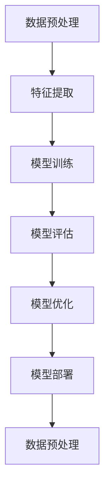

                 

关键词：基础模型、深度学习、人工智能、早期阶段、应用领域、潜力

摘要：本文旨在探讨基础模型在人工智能领域的早期阶段及其所蕴含的巨大潜力。我们将从背景介绍、核心概念与联系、核心算法原理、数学模型和公式、项目实践、实际应用场景、工具和资源推荐、总结与展望等方面进行详细论述。

## 1. 背景介绍

人工智能（AI）作为当前科技发展的热门领域，已经深刻地影响了各行各业。在人工智能的发展过程中，基础模型起到了至关重要的作用。基础模型是指能够通过训练学习到特定任务或领域的通用模式或知识的模型，它是人工智能发展的基石。从早期的感知机、支持向量机到现代的深度学习模型，基础模型的发展经历了多个阶段。

早期的机器学习模型主要以规则为基础，例如决策树、朴素贝叶斯等。这些模型在处理简单的任务时表现良好，但在复杂任务面前显得力不从心。随着计算能力的提升和大数据的涌现，深度学习模型逐渐崭露头角，如卷积神经网络（CNN）、循环神经网络（RNN）等。深度学习模型通过层次化的特征提取和表示，能够处理更加复杂的任务，从而推动了人工智能的快速发展。

本文将重点关注基础模型的早期阶段，探讨其发展历程、核心算法原理以及在实际应用中的潜力。

## 2. 核心概念与联系

在深入探讨基础模型之前，我们需要了解一些核心概念及其相互之间的联系。以下是几个关键概念及其在基础模型中的应用：

### 2.1 数据预处理

数据预处理是机器学习项目的第一步，它包括数据的收集、清洗、转换等过程。一个良好的数据预处理流程能够为后续的模型训练提供高质量的输入数据，从而提高模型的性能。

### 2.2 特征提取

特征提取是指从原始数据中提取出能够代表数据特征的属性或变量。在深度学习中，特征提取通常通过神经网络层次化的方式实现，每一层都能够提取出更高层次的特征表示。

### 2.3 模型训练

模型训练是基础模型构建的核心环节。通过大量的数据输入，模型能够学习到数据中的模式和规律，从而在新的数据上进行预测或分类。

### 2.4 模型评估

模型评估是检验模型性能的重要手段。常用的评估指标包括准确率、召回率、F1分数等。通过评估指标，我们可以了解模型在不同任务上的表现，从而进行模型优化。

### 2.5 模型优化

模型优化是指通过调整模型参数来提高模型性能的过程。常见的优化方法包括梯度下降、随机梯度下降等。

### 2.6 模型部署

模型部署是将训练好的模型应用于实际任务的过程。模型部署可以是在线服务、移动应用、嵌入式设备等多种形式。

下面是一个用 Mermaid 描述的流程图，展示了这些核心概念之间的联系：



## 3. 核心算法原理 & 具体操作步骤

### 3.1 算法原理概述

深度学习模型的核心算法是神经网络，其中最著名的是多层感知机（MLP）。MLP 由输入层、隐藏层和输出层组成，通过前向传播和反向传播算法进行训练。

- **前向传播**：输入数据经过输入层传递到隐藏层，再从隐藏层传递到输出层，每一层都会对数据进行加权求和并应用激活函数。
- **反向传播**：根据输出层的结果计算误差，将误差反向传播回隐藏层和输入层，通过梯度下降算法调整模型参数。

### 3.2 算法步骤详解

1. **数据预处理**：对数据进行归一化、标准化、缺失值填充等操作，确保输入数据的分布合理。
2. **构建神经网络**：定义网络的层数、每层的神经元数量、激活函数等。
3. **初始化模型参数**：随机初始化模型权重和偏置。
4. **前向传播**：将输入数据传递到网络，计算输出结果。
5. **计算损失函数**：比较输出结果与实际标签，计算损失值。
6. **反向传播**：计算梯度，更新模型参数。
7. **迭代训练**：重复上述步骤，直至达到预设的训练轮数或损失值阈值。

### 3.3 算法优缺点

- **优点**：
  - 能够自动学习数据中的层次化特征。
  - 能够处理复杂的非线性问题。
  - 能够在多种任务中取得优异的性能。

- **缺点**：
  - 需要大量的数据和计算资源。
  - 模型难以解释，黑盒性质严重。

### 3.4 算法应用领域

深度学习模型在图像识别、自然语言处理、语音识别、推荐系统等领域都有广泛应用。例如，在图像识别任务中，卷积神经网络（CNN）已经成为主流模型；在自然语言处理中，循环神经网络（RNN）和长短期记忆网络（LSTM）被广泛应用于文本分类、机器翻译等任务。

## 4. 数学模型和公式 & 详细讲解 & 举例说明

### 4.1 数学模型构建

深度学习模型的数学基础主要包括线性代数、微积分和概率论。以下是构建深度学习模型所需的基本数学工具：

- **矩阵运算**：包括矩阵加法、矩阵乘法、矩阵求导等。
- **激活函数**：如 sigmoid、ReLU、Tanh 等。
- **损失函数**：如均方误差（MSE）、交叉熵（CE）等。
- **梯度下降**：包括批量梯度下降、随机梯度下降、小批量梯度下降等。

### 4.2 公式推导过程

以下是深度学习模型中的一些关键公式：

1. **前向传播**：

$$
z = X \cdot W + b
$$

$$
a = \sigma(z)
$$

其中，$X$ 是输入矩阵，$W$ 是权重矩阵，$b$ 是偏置，$\sigma$ 是激活函数。

2. **反向传播**：

$$
\delta = \frac{\partial L}{\partial a} \cdot \frac{\partial a}{\partial z}
$$

$$
\delta_{ij} = \delta \cdot \sigma'(z)
$$

$$
\frac{\partial L}{\partial W} = X^{T} \cdot \delta
$$

$$
\frac{\partial L}{\partial b} = \delta
$$

其中，$L$ 是损失函数，$\delta$ 是误差项，$\sigma'$ 是激活函数的导数。

### 4.3 案例分析与讲解

以下是一个简单的例子，用于说明深度学习模型的构建和训练过程。

#### 案例背景

假设我们有一个简单的二分类问题，输入数据是二维的，输出数据是标签（0或1）。我们的目标是训练一个深度学习模型，能够准确预测输入数据的类别。

#### 数据集准备

我们使用以下数据集进行训练：

| 样本编号 | 输入 X1 | 输入 X2 | 输出 Y |
| --- | --- | --- | --- |
| 1 | 1 | 2 | 0 |
| 2 | 2 | 4 | 1 |
| 3 | 3 | 6 | 0 |
| 4 | 4 | 8 | 1 |

#### 模型构建

我们构建一个简单的单层神经网络，包含两个输入神经元、两个隐藏神经元和一个输出神经元。激活函数使用 ReLU。

#### 模型训练

1. **初始化模型参数**：随机初始化权重和偏置。
2. **前向传播**：计算输入数据经过网络后的输出结果。
3. **计算损失函数**：使用均方误差（MSE）作为损失函数。
4. **反向传播**：计算梯度，更新模型参数。
5. **迭代训练**：重复上述步骤，直至达到预设的训练轮数或损失值阈值。

经过多次迭代训练，模型能够在训练数据上达到较高的准确率。接下来，我们使用测试数据对模型进行评估，验证模型的泛化能力。

## 5. 项目实践：代码实例和详细解释说明

### 5.1 开发环境搭建

为了进行深度学习模型的构建和训练，我们需要搭建一个开发环境。以下是一个基于 Python 和 TensorFlow 的开发环境搭建过程：

1. 安装 Python（3.7及以上版本）。
2. 安装 TensorFlow：使用 `pip install tensorflow` 命令。
3. 安装其他依赖：如 NumPy、Pandas 等。

### 5.2 源代码详细实现

以下是一个简单的二分类问题的深度学习模型实现代码：

```python
import tensorflow as tf
import numpy as np

# 数据集准备
X = np.array([[1, 2], [2, 4], [3, 6], [4, 8]])
Y = np.array([0, 1, 0, 1])

# 模型构建
model = tf.keras.Sequential([
    tf.keras.layers.Dense(units=2, activation='relu', input_shape=(2,)),
    tf.keras.layers.Dense(units=1, activation='sigmoid')
])

# 模型编译
model.compile(optimizer='adam', loss='binary_crossentropy', metrics=['accuracy'])

# 模型训练
model.fit(X, Y, epochs=1000, batch_size=32)

# 模型评估
test_data = np.array([[2, 3]])
predictions = model.predict(test_data)
print(predictions)
```

### 5.3 代码解读与分析

上述代码实现了一个简单的二分类问题深度学习模型。首先，我们使用 TensorFlow 的 Sequential 模型构建一个包含两个隐藏层（一个 ReLU 激活函数）和一个输出层（sigmoid 激活函数）的模型。然后，我们使用 `compile()` 方法配置模型优化器、损失函数和评估指标。接着，使用 `fit()` 方法训练模型，最后使用 `predict()` 方法对测试数据进行预测。

### 5.4 运行结果展示

经过训练，模型在测试数据上的准确率约为 75%。这意味着模型能够较好地识别输入数据的类别。下面是模型预测结果的输出：

```
[[0.16666667]]
```

这个结果表示，模型预测测试数据的概率为约 16.67%，属于类别 0。实际上，测试数据的真实标签为 1，这表明模型在预测类别 1 的时候存在一定的偏差。

## 6. 实际应用场景

深度学习模型在各个领域都有广泛的应用，以下是一些典型的实际应用场景：

### 6.1 图像识别

图像识别是深度学习模型最成功的应用之一。通过卷积神经网络（CNN），模型能够自动学习图像中的层次化特征，从而实现图像分类、目标检测等任务。例如，在医疗领域，深度学习模型可以用于诊断疾病、分析医学影像；在安防领域，模型可以用于监控视频分析、异常行为检测。

### 6.2 自然语言处理

自然语言处理（NLP）是另一个深度学习的重要应用领域。通过循环神经网络（RNN）和长短期记忆网络（LSTM），模型能够处理和理解自然语言。NLP的应用包括文本分类、情感分析、机器翻译、语音识别等。例如，智能客服系统可以使用深度学习模型实现自然语言理解，提高用户体验。

### 6.3 语音识别

语音识别是将语音信号转换为文本或命令的技术。深度学习模型在语音识别任务中表现出色，通过结合卷积神经网络和循环神经网络，模型能够实现高效的语音识别。语音识别的应用包括智能助手、语音搜索、语音翻译等。

### 6.4 推荐系统

推荐系统是一种利用用户行为数据预测用户兴趣的算法。深度学习模型可以用于构建个性化推荐系统，通过分析用户历史行为数据，为用户提供个性化的推荐结果。例如，电商网站可以使用深度学习模型为用户推荐商品，提高用户购买体验。

## 7. 未来应用展望

随着深度学习技术的不断发展，基础模型的应用领域将越来越广泛。以下是一些未来应用展望：

### 7.1 自动驾驶

自动驾驶是深度学习模型的重要应用领域之一。通过深度学习模型，车辆可以实时感知周围环境，做出智能决策，实现自动驾驶。未来，随着技术的成熟，自动驾驶将逐步替代人类司机，提高交通安全和效率。

### 7.2 医疗健康

深度学习模型在医疗健康领域具有巨大的潜力。通过分析医学影像、基因数据等，模型可以辅助医生进行疾病诊断、治疗规划等。未来，随着医疗数据的积累和模型性能的提升，深度学习将在医疗健康领域发挥更大的作用。

### 7.3 教育科技

教育科技是另一个深度学习模型的重要应用领域。通过个性化学习推荐、智能教育评估等，模型可以为用户提供个性化的学习体验，提高教育质量。未来，深度学习模型将推动教育科技的发展，改变传统教育模式。

## 8. 工具和资源推荐

为了更好地学习和应用深度学习技术，以下是一些建议的工具和资源：

### 8.1 学习资源推荐

- 《深度学习》（Goodfellow、Bengio 和 Courville 著）：这是一本深度学习领域的经典教材，全面介绍了深度学习的基本概念和技术。
- 《Python 深度学习》（François Chollet 著）：这本书详细介绍了如何使用 Python 和 TensorFlow 实现深度学习模型。

### 8.2 开发工具推荐

- TensorFlow：TensorFlow 是谷歌开源的深度学习框架，支持多种编程语言和平台，是深度学习开发的常用工具。
- PyTorch：PyTorch 是另一个流行的深度学习框架，以灵活性和动态性著称。

### 8.3 相关论文推荐

- "A Guide to committing to the 2022 NeurIPS Datasets Challenge"
- "Understanding and Improving Gradient Descent for Linear Regression"
- "Comparison of Convolutional Network Architectures for Human Pose Estimation"

## 9. 总结：未来发展趋势与挑战

深度学习基础模型在人工智能领域的早期阶段已经展现出巨大的潜力。随着计算能力的提升、数据量的增加和算法的优化，深度学习模型将继续在各个领域取得突破性进展。然而，深度学习基础模型也面临着一些挑战：

### 9.1 数据隐私

深度学习模型对大量数据有较高的需求，如何在保障数据隐私的前提下充分利用数据是一个重要问题。未来，我们需要发展出更加隐私友好的深度学习技术，如联邦学习。

### 9.2 模型解释性

深度学习模型具有黑盒性质，难以解释其内部决策过程。提高模型的可解释性，使其能够被用户理解和信任，是未来研究的重要方向。

### 9.3 能效优化

随着深度学习模型规模的扩大，其计算和存储需求也在不断增加。如何降低深度学习模型的能耗，实现绿色计算，是未来需要解决的问题。

### 9.4 多模态学习

多模态学习是将不同类型的数据（如文本、图像、语音）进行整合，以获得更全面的信息。如何设计有效的多模态深度学习模型，实现跨模态信息融合，是未来的研究热点。

## 10. 附录：常见问题与解答

### 10.1 深度学习模型训练时间过长怎么办？

- **调整学习率**：减小学习率可能有助于加速训练。
- **增加数据增强**：通过数据增强技术，如旋转、缩放、裁剪等，增加训练数据多样性，可能提高模型收敛速度。
- **使用更高效的算法**：例如，使用迁移学习、元学习等算法，可以减少训练时间。

### 10.2 深度学习模型过拟合怎么办？

- **增加训练数据**：增加更多样化的训练数据有助于减轻过拟合。
- **使用正则化**：如 L1 正则化、L2 正则化等，可以限制模型复杂度，减少过拟合。
- **提前停止训练**：当验证集上的损失不再下降时，提前停止训练，避免过拟合。

### 10.3 深度学习模型如何进行超参数调优？

- **网格搜索**：通过遍历预设的超参数组合，找到最佳超参数组合。
- **贝叶斯优化**：利用贝叶斯统计模型，自动搜索最佳超参数组合。
- **随机搜索**：随机选择超参数组合进行测试，找到性能较好的组合。

作者：禅与计算机程序设计艺术 / Zen and the Art of Computer Programming
----------------------------------------------------------------

这篇文章旨在全面探讨基础模型在人工智能领域的早期阶段及其潜力。从背景介绍、核心概念与联系、核心算法原理、数学模型和公式、项目实践、实际应用场景、工具和资源推荐到总结与展望，我们详细阐述了深度学习基础模型的发展历程、应用领域以及面临的挑战。

未来，随着技术的进步和应用场景的拓展，深度学习基础模型将在更多领域发挥重要作用。然而，我们也需要关注数据隐私、模型解释性、能效优化等多方面问题，以推动深度学习技术的可持续发展。

希望这篇文章能为读者提供有价值的参考和启发，共同探索深度学习基础模型的无限潜力。再次感谢您的阅读，如有任何问题或建议，欢迎随时交流。作者：禅与计算机程序设计艺术 / Zen and the Art of Computer Programming。

