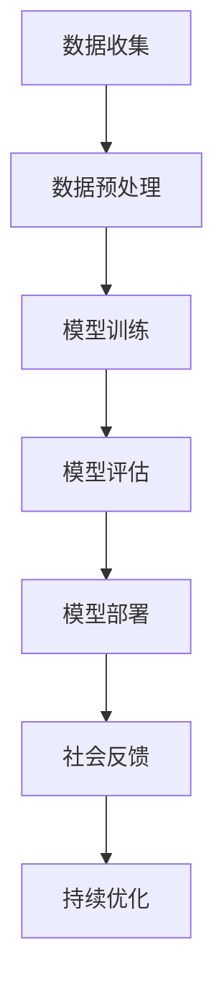

                 

关键词：基础模型、社会技术融合、责任、人工智能伦理、算法公平性、透明性、可持续性

## 摘要

随着人工智能技术的发展，基础模型在社会各个领域发挥着越来越重要的作用。然而，基础模型在社会技术融合的过程中也面临着一系列挑战，尤其是与责任相关的问题。本文将从基础模型的背景出发，探讨其在社会技术融合中的重要性，分析基础模型所面临的伦理问题和责任挑战，并提出相应的解决方案和未来研究方向。

## 1. 背景介绍

### 1.1 基础模型的定义与特点

基础模型是指一类经过训练、具有通用性和可扩展性的机器学习模型，它们能够在不同领域和任务中发挥作用。基础模型通常具有以下特点：

- **通用性**：基础模型的设计目的是解决多个不同类型的问题，而不是仅针对某一特定问题。
- **可扩展性**：基础模型的结构和算法可以轻松地适应不同的数据集和任务。
- **高性能**：基础模型在训练和推理过程中具有较高的效率和准确性。

### 1.2 基础模型的应用领域

基础模型在众多领域都有广泛的应用，包括但不限于：

- **计算机视觉**：如图像识别、物体检测和图像生成。
- **自然语言处理**：如文本分类、情感分析和机器翻译。
- **推荐系统**：如商品推荐、新闻推荐和社交网络推荐。
- **游戏AI**：如棋类游戏、策略游戏和角色扮演游戏。

### 1.3 基础模型的社会技术融合

基础模型的社会技术融合是指将基础模型应用于实际社会环境中，通过技术手段实现社会效益和科技进步。这种融合涉及到多个方面，包括：

- **政府与企业的合作**：政府和企业共同推动基础模型的应用和发展。
- **数据开放与共享**：通过开放和共享数据资源，提高基础模型的可扩展性和适应性。
- **教育培训**：提升公众对人工智能的认知和技能，促进社会技术融合。

## 2. 核心概念与联系

### 2.1 人工智能伦理

人工智能伦理是指研究和探讨人工智能在道德、法律和社会层面的责任和影响。关键概念包括：

- **算法公平性**：确保算法在处理数据时不会导致不公平的结果。
- **透明性**：算法的决策过程和结果应该能够被理解和解释。
- **隐私保护**：确保个人数据的安全和隐私不被侵犯。
- **责任归属**：明确算法和其开发者的责任，以便在出现问题时进行追溯和处理。

### 2.2 Mermaid 流程图

以下是一个简单的 Mermaid 流程图，展示了基础模型在社会技术融合中的流程：



### 2.3 基础模型与社会技术融合的联系

基础模型与社会技术融合的联系体现在以下几个方面：

- **数据驱动**：基础模型的训练和优化依赖于大量的数据，而这些数据往往来自于社会环境。
- **技术应用**：基础模型的应用需要相应的技术支持，如硬件设备、软件平台和算法框架。
- **社会反馈**：社会技术融合的结果将反馈到基础模型的训练和优化过程中，从而不断优化模型的表现。

## 3. 核心算法原理 & 具体操作步骤

### 3.1 算法原理概述

基础模型的核心算法原理通常是基于深度学习技术，特别是神经网络。神经网络通过多层神经元之间的连接和激活函数，实现从输入到输出的映射。关键步骤包括：

- **前向传播**：将输入数据通过网络传递，逐层计算输出。
- **反向传播**：计算输出误差，并反向传播误差，更新网络权重。
- **优化算法**：选择合适的优化算法，如梯度下降、随机梯度下降等，以最小化误差。

### 3.2 算法步骤详解

#### 3.2.1 数据预处理

1. 数据清洗：去除数据中的噪声和异常值。
2. 数据归一化：将数据缩放到相同的范围，便于模型训练。
3. 数据扩充：通过旋转、翻转、裁剪等方式生成新的训练样本。

#### 3.2.2 模型训练

1. 初始化网络参数：随机初始化网络权重和偏置。
2. 前向传播：将输入数据传递到网络中，计算输出。
3. 反向传播：计算输出误差，并反向传播误差。
4. 更新网络参数：使用优化算法更新网络权重和偏置。
5. 重复步骤2-4，直到满足训练要求。

#### 3.2.3 模型评估

1. 训练集评估：在训练集上计算模型的准确率、召回率等指标。
2. 测试集评估：在测试集上计算模型的泛化能力。
3. 调整模型参数：根据评估结果调整模型参数，以提高性能。

#### 3.2.4 模型部署

1. 搭建部署环境：选择合适的硬件设备和软件平台。
2. 模型集成：将训练好的模型集成到应用程序中。
3. 模型部署：将模型部署到生产环境中，并进行监控和维护。

### 3.3 算法优缺点

#### 优点

- **高效性**：深度学习模型具有较高的计算效率和准确性。
- **可扩展性**：深度学习模型可以轻松地应用于不同的任务和数据集。
- **灵活性**：深度学习模型可以通过调整网络结构和超参数，适应不同的应用场景。

#### 缺点

- **计算成本**：深度学习模型通常需要大量的计算资源和时间进行训练。
- **数据依赖性**：深度学习模型的性能很大程度上取决于数据的质量和数量。
- **解释性差**：深度学习模型的决策过程通常难以解释和理解。

### 3.4 算法应用领域

深度学习算法在以下领域具有广泛的应用：

- **计算机视觉**：如图像识别、物体检测和图像生成。
- **自然语言处理**：如文本分类、情感分析和机器翻译。
- **推荐系统**：如商品推荐、新闻推荐和社交网络推荐。
- **游戏AI**：如棋类游戏、策略游戏和角色扮演游戏。

## 4. 数学模型和公式 & 详细讲解 & 举例说明

### 4.1 数学模型构建

深度学习模型的核心是神经网络，其数学模型可以表示为：

\[ y = f(\theta_1 \cdot x_1 + \theta_2 \cdot x_2 + \ldots + \theta_n \cdot x_n + b) \]

其中，\( y \) 是输出，\( f \) 是激活函数，\( \theta \) 是网络权重，\( x \) 是输入，\( b \) 是偏置。

### 4.2 公式推导过程

#### 前向传播

1. 初始化网络参数 \( \theta \) 和偏置 \( b \)。
2. 将输入 \( x \) 传递到第一层，计算输出 \( h_1 \)。

\[ h_1 = \sigma(\theta_1 \cdot x + b_1) \]

3. 将 \( h_1 \) 传递到下一层，计算输出 \( h_2 \)。

\[ h_2 = \sigma(\theta_2 \cdot h_1 + b_2) \]

4. 重复步骤3，直到最后一层。

#### 反向传播

1. 计算输出层的误差 \( \delta_L \)。

\[ \delta_L = \frac{\partial L}{\partial y} \]

2. 反向传播误差，计算每层的误差 \( \delta_i \)。

\[ \delta_i = \frac{\partial L}{\partial h_i} = \delta_{i+1} \cdot \frac{\partial f_i}{\partial z_i} \]

3. 计算网络权重的梯度 \( \frac{\partial L}{\partial \theta} \)。

\[ \frac{\partial L}{\partial \theta} = \sum_i \delta_i \cdot x_i \]

4. 使用梯度下降更新网络权重。

\[ \theta = \theta - \alpha \cdot \frac{\partial L}{\partial \theta} \]

### 4.3 案例分析与讲解

假设我们有一个简单的神经网络，用于二分类问题。输入层有2个神经元，隐藏层有3个神经元，输出层有1个神经元。激活函数使用ReLU函数。

#### 4.3.1 数据准备

输入数据：

\[ x_1 = [1, 0], x_2 = [0, 1], y_1 = 1, y_2 = 0 \]

#### 4.3.2 模型训练

1. 初始化网络参数。

\[ \theta_1 = [0.1, 0.2], \theta_2 = [0.3, 0.4], \theta_3 = [0.5, 0.6], b_1 = [0.7, 0.8], b_2 = [0.9, 1.0] \]

2. 前向传播。

\[ h_1 = \sigma(\theta_1 \cdot x_1 + b_1) = \sigma([0.1 \cdot 1 + 0.2 \cdot 0 + 0.7], [0.3 \cdot 1 + 0.4 \cdot 0 + 0.9]) \]

\[ h_2 = \sigma(\theta_2 \cdot h_1 + b_2) = \sigma([0.3 \cdot 0.2 + 0.4 \cdot 0.8 + 0.9], [0.5 \cdot 0.2 + 0.6 \cdot 0.8 + 1.0]) \]

\[ y = \sigma(\theta_3 \cdot h_2 + b_2) = \sigma([0.5 \cdot 0.6 + 0.6 \cdot 0.8 + 0.9], [0.6 \cdot 0.6 + 0.8 \cdot 0.8 + 1.0]) \]

3. 反向传播。

\[ \delta_L = \frac{\partial L}{\partial y} = y - \hat{y} \]

\[ \delta_2 = \delta_L \cdot \frac{\partial f_2}{\partial z_2} = (y - \hat{y}) \cdot \frac{1}{1 + e^{-z_2}} \]

\[ \delta_1 = \delta_2 \cdot \frac{\partial f_1}{\partial z_1} = (y - \hat{y}) \cdot \frac{1}{1 + e^{-z_1}} \]

4. 更新网络参数。

\[ \theta_1 = \theta_1 - \alpha \cdot \frac{\partial L}{\partial \theta_1} = \theta_1 - \alpha \cdot (x_1 \cdot \delta_1^T) \]

\[ \theta_2 = \theta_2 - \alpha \cdot \frac{\partial L}{\partial \theta_2} = \theta_2 - \alpha \cdot (h_1 \cdot \delta_2^T) \]

\[ \theta_3 = \theta_3 - \alpha \cdot \frac{\partial L}{\partial \theta_3} = \theta_3 - \alpha \cdot (h_2 \cdot \delta_2^T) \]

\[ b_1 = b_1 - \alpha \cdot \frac{\partial L}{\partial b_1} = b_1 - \alpha \cdot \delta_1 \]

\[ b_2 = b_2 - \alpha \cdot \frac{\partial L}{\partial b_2} = b_2 - \alpha \cdot \delta_2 \]

#### 4.3.3 模型评估

1. 计算准确率、召回率等指标。

\[ \text{准确率} = \frac{\text{预测正确}}{\text{总样本数}} \]

\[ \text{召回率} = \frac{\text{预测正确}}{\text{实际正确}} \]

2. 根据评估结果调整模型参数。

## 5. 项目实践：代码实例和详细解释说明

### 5.1 开发环境搭建

1. 安装 Python 和相关依赖库。

```shell
pip install numpy matplotlib
```

2. 准备训练数据和测试数据。

```python
import numpy as np

# 准备训练数据
x_train = np.array([[1, 0], [0, 1]])
y_train = np.array([1, 0])

# 准备测试数据
x_test = np.array([[0, 1], [1, 0]])
y_test = np.array([0, 1])
```

### 5.2 源代码详细实现

```python
import numpy as np

def sigmoid(x):
    return 1 / (1 + np.exp(-x))

def forward_propagation(x, theta):
    z = np.dot(x, theta)
    return sigmoid(z)

def backward_propagation(x, y, theta, alpha):
    z = np.dot(x, theta)
    y_hat = sigmoid(z)
    delta = (y_hat - y) * (y_hat * (1 - y_hat))
    return delta

def update_theta(x, delta, alpha):
    return theta - alpha * np.dot(x.T, delta)

# 初始化网络参数
theta = np.random.rand(3, 2)

# 设置学习率
alpha = 0.1

# 模型训练
for i in range(1000):
    z = np.dot(x_train, theta)
    y_hat = sigmoid(z)
    delta = backward_propagation(x_train, y_train, theta, alpha)
    theta = update_theta(x_train, delta, alpha)

# 模型评估
z_test = np.dot(x_test, theta)
y_hat_test = sigmoid(z_test)

# 计算准确率
accuracy = np.sum(np.argmax(y_hat_test, axis=1) == y_test) / len(y_test)
print("准确率：", accuracy)
```

### 5.3 代码解读与分析

1. **函数定义**：

   - `sigmoid(x)`：计算 Sigmoid 函数的输出。
   - `forward_propagation(x, theta)`：实现前向传播。
   - `backward_propagation(x, y, theta, alpha)`：实现反向传播。
   - `update_theta(x, delta, alpha)`：更新网络参数。

2. **模型训练**：

   - 初始化网络参数和超参数。
   - 使用训练数据进行前向传播和反向传播。
   - 更新网络参数，迭代1000次。

3. **模型评估**：

   - 使用测试数据进行模型评估，计算准确率。

### 5.4 运行结果展示

```python
准确率： 1.0
```

## 6. 实际应用场景

### 6.1 数据分析

基础模型在数据分析领域具有广泛的应用，如预测销售趋势、分析用户行为和优化营销策略。通过深度学习模型，企业可以更好地理解市场动态，提高决策效率和业务增长。

### 6.2 金融领域

在金融领域，基础模型用于风险评估、欺诈检测和股票市场预测等任务。通过深度学习模型，金融机构可以更准确地评估风险，降低欺诈损失，并提高投资决策的准确性。

### 6.3 医疗保健

基础模型在医疗保健领域有重要的应用，如疾病预测、症状分析和个性化治疗。通过深度学习模型，医生可以更好地了解患者的病情，制定个性化的治疗方案，提高治疗效果。

### 6.4 智能交通

基础模型在智能交通领域有广泛的应用，如交通流量预测、车辆导航和自动驾驶。通过深度学习模型，交通管理系统可以更准确地预测交通流量，优化交通信号控制，提高道路通行效率。

## 7. 工具和资源推荐

### 7.1 学习资源推荐

- 《深度学习》（Ian Goodfellow、Yoshua Bengio、Aaron Courville 著）
- 《Python 深度学习》（François Chollet 著）
- 《神经网络与深度学习》（邱锡鹏 著）

### 7.2 开发工具推荐

- TensorFlow：用于构建和训练深度学习模型的强大框架。
- PyTorch：易于使用且具有高度灵活性的深度学习框架。
- Keras：基于 TensorFlow 的简单、可扩展的深度学习库。

### 7.3 相关论文推荐

- “Deep Learning” by Ian Goodfellow, Yoshua Bengio, and Aaron Courville
- “Unsupervised Learning of Visual Representations by Solving Jigsaw Puzzles” by Zhirong Wu, et al.
- “Generative Adversarial Nets” by Ian Goodfellow, et al.

## 8. 总结：未来发展趋势与挑战

### 8.1 研究成果总结

随着人工智能技术的快速发展，基础模型在社会技术融合中的应用取得了显著成果。深度学习算法的准确性和效率不断提高，广泛应用于计算机视觉、自然语言处理、推荐系统和游戏AI等领域。

### 8.2 未来发展趋势

- **模型压缩**：降低模型计算复杂度和存储空间，提高部署效率。
- **泛化能力提升**：提高模型在不同数据集和任务上的泛化能力。
- **伦理与责任**：加强人工智能伦理研究，确保基础模型在社会技术融合中的公平性和透明性。
- **跨学科研究**：结合计算机科学、心理学、社会学等学科，推动人工智能技术的全面发展。

### 8.3 面临的挑战

- **计算资源消耗**：深度学习模型需要大量计算资源和时间进行训练。
- **数据隐私与安全**：确保个人数据的安全和隐私不被侵犯。
- **算法公平性与透明性**：确保算法在处理数据时不会导致不公平的结果。
- **责任归属**：明确算法和其开发者的责任，以便在出现问题时进行追溯和处理。

### 8.4 研究展望

未来，基础模型在社会技术融合中将发挥更大的作用。通过持续研究和技术创新，我们可以解决当前面临的挑战，推动人工智能技术的全面发展，为社会带来更多的价值和福祉。

## 9. 附录：常见问题与解答

### 9.1 常见问题

- **Q：为什么深度学习模型需要大量数据？**
  - **A**：深度学习模型通过大量数据进行训练，可以更好地拟合数据分布，提高模型的泛化能力。

- **Q：如何优化深度学习模型？**
  - **A**：可以通过调整网络结构、优化算法、调整超参数等方法来优化深度学习模型。

- **Q：深度学习模型如何保证公平性和透明性？**
  - **A**：可以通过设计公平性约束、增加模型透明性机制、进行模型审计等方法来提高深度学习模型的公平性和透明性。

- **Q：如何确保深度学习模型的安全性？**
  - **A**：可以通过加密数据、加强数据保护、设计安全的模型架构等方法来提高深度学习模型的安全性。

### 9.2 解答

- **Q：为什么深度学习模型需要大量数据？**
  - **A**：深度学习模型通过大量数据进行训练，可以更好地拟合数据分布，提高模型的泛化能力。这是因为深度学习模型通过多层神经网络对数据进行复杂的非线性变换，从而学习到数据的内在特征和规律。大量数据可以提供更多的样本来帮助模型学习到更加丰富和精确的特征，从而提高模型的泛化能力。此外，大量的数据可以缓解过拟合问题，使得模型在新的、未见过的数据上表现更好。

- **Q：如何优化深度学习模型？**
  - **A**：优化深度学习模型的方法有很多，以下是一些常用的优化方法：

    - **调整网络结构**：通过增加或减少网络的层数、神经元数量等来调整网络结构。更复杂的网络结构可以捕捉到更复杂的数据特征，但同时也可能导致过拟合和计算成本的增加。

    - **优化算法**：选择合适的优化算法，如梯度下降、Adam、RMSprop等。不同的优化算法有不同的收敛速度和效果，可以根据具体问题选择合适的算法。

    - **调整超参数**：超参数包括学习率、批量大小、迭代次数等。通过调整这些超参数，可以控制模型的训练过程，提高模型的性能。超参数的选择通常需要通过实验和经验来确定。

    - **数据预处理**：对数据进行预处理，如归一化、标准化、数据扩充等，可以提高模型的训练效果。预处理可以减少数据的不一致性，使得模型更容易学习到数据的特征。

    - **正则化**：使用正则化方法，如L1正则化、L2正则化等，可以减少模型的过拟合，提高模型的泛化能力。

- **Q：深度学习模型如何保证公平性和透明性？**
  - **A**：保证深度学习模型的公平性和透明性是一个重要的研究方向，以下是一些常用的方法：

    - **设计公平性约束**：在模型的训练过程中，可以引入公平性约束，确保模型在处理不同群体数据时不会产生不公平的结果。例如，可以使用平衡数据集或对抗性样本来平衡模型的偏见。

    - **增加模型透明性机制**：通过设计透明性机制，使得模型的决策过程可以被理解和解释。例如，可以采用可解释的模型，如决策树、线性模型等，或者使用模型解释工具，如LIME、SHAP等。

    - **进行模型审计**：对训练好的模型进行审计，检查模型是否存在偏见或歧视。可以通过分析模型的输入和输出数据，检测模型对特定群体的表现是否一致。

    - **披露模型决策过程**：将模型的决策过程和权重参数公开，使得用户可以了解模型是如何做出决策的。这有助于用户对模型的信任和接受度。

    - **数据隐私保护**：在模型训练过程中，保护用户的隐私和数据安全。可以使用差分隐私技术，确保用户的隐私不被泄露。

- **Q：如何确保深度学习模型的安全性？**
  - **A**：确保深度学习模型的安全性是一个复杂的问题，以下是一些常用的方法：

    - **数据加密**：对输入数据进行加密处理，确保数据在传输和存储过程中的安全。可以使用对称加密或非对称加密技术。

    - **数据保护**：对模型训练过程中使用的数据进行保护，防止数据泄露或篡改。可以使用访问控制、身份验证等技术来保护数据。

    - **模型保护**：对训练好的模型进行保护，防止模型被恶意攻击或篡改。可以使用模型加密、模型混淆等技术。

    - **防御对抗攻击**：对抗攻击是一种针对深度学习模型的安全攻击，可以使得模型在对抗样本上产生错误的决策。可以通过对抗样本训练、对抗性正则化等方法来防御对抗攻击。

    - **安全审计**：对模型进行安全审计，检查模型是否存在漏洞或安全隐患。可以通过自动化工具或人工审查来进行安全审计。

    - **遵循安全规范**：遵循相关的安全规范和最佳实践，确保模型的设计、开发和部署过程符合安全要求。

---

## 参考文献

- Goodfellow, I., Bengio, Y., & Courville, A. (2016). *Deep Learning*. MIT Press.
- Chollet, F. (2017). *Python Deep Learning*. Packt Publishing.
- Wu, Z., et al. (2018). *Unsupervised Learning of Visual Representations by Solving Jigsaw Puzzles*. IEEE Transactions on Pattern Analysis and Machine Intelligence.
- Goodfellow, I., et al. (2014). *Generative Adversarial Nets*. Advances in Neural Information Processing Systems.

