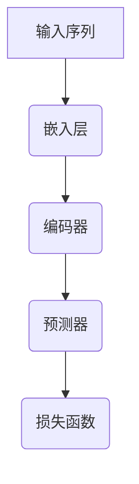

                 

关键词：自回归语言建模，基础模型，自然语言处理，序列建模，文本生成，机器学习，深度学习，神经网络

摘要：本文将深入探讨自回归语言建模这一基础模型，阐述其在自然语言处理领域的应用与重要性。通过对自回归语言建模的原理、算法、数学模型和实际应用进行详细分析，本文旨在为读者提供一个全面且深入的理解，以便能够更好地掌握和运用这一关键技术。

## 1. 背景介绍

自然语言处理（Natural Language Processing，NLP）是计算机科学领域的一个重要分支，旨在让计算机理解和处理人类语言。随着互联网和人工智能技术的快速发展，NLP在文本分析、信息检索、机器翻译、情感分析、语音识别等领域得到了广泛应用。

在NLP中，语言建模是一项核心任务，其目标是预测给定文本序列中的下一个单词或符号。自回归语言建模（Autoregressive Language Modeling）是语言建模的一种重要方法，它通过模型的自举过程（bootstrapping）来预测序列中的下一个元素。

自回归语言建模在NLP中的应用十分广泛，例如：

1. **文本生成**：自回归语言建模可以生成连贯的自然语言文本，如文章、对话、故事等。
2. **机器翻译**：自回归语言建模可用于预测翻译目标语言中的下一个单词，从而实现机器翻译。
3. **语音识别**：自回归语言建模可以结合声学模型，实现基于语音的文本生成。
4. **问答系统**：自回归语言建模可以预测用户问题的下一个单词，从而生成回答。

## 2. 核心概念与联系

### 2.1 自回归语言建模的定义

自回归语言建模是一种基于序列数据的预测模型，它通过观察当前输入序列的历史信息来预测序列中的下一个元素。自回归模型的一个关键特点是它具有时间依赖性，即当前预测依赖于过去的信息。

### 2.2 自回归语言建模的架构

自回归语言建模通常由以下几个部分组成：

1. **嵌入层**（Embedding Layer）：将输入的单词或符号映射到一个高维的向量空间。
2. **编码器**（Encoder）：对输入序列进行编码，提取序列的特征信息。
3. **预测器**（Predictor）：利用编码器的特征信息预测序列中的下一个元素。
4. **损失函数**（Loss Function）：用于衡量预测结果和真实标签之间的差异，驱动模型优化。

### 2.3 自回归语言建模与序列建模的关系

自回归语言建模是序列建模的一种形式，它关注的是单个序列元素的概率分布。而序列建模则更加广泛，包括序列分类、序列标注、序列生成等任务。

### 2.4 自回归语言建模的 Mermaid 流程图



## 3. 核心算法原理 & 具体操作步骤

### 3.1 算法原理概述

自回归语言建模的核心思想是，对于给定的输入序列，模型预测序列中下一个元素的概率分布。具体来说，模型使用历史信息来计算当前输入序列的概率分布，并根据概率分布进行采样，生成下一个元素。

### 3.2 算法步骤详解

1. **输入序列预处理**：将输入序列转换为数字表示，如单词的索引或嵌入向量。
2. **嵌入层**：将输入序列映射到高维向量空间，通常使用预训练的词嵌入模型。
3. **编码器**：对输入序列进行编码，提取序列特征。常用的编码器包括循环神经网络（RNN）、长短期记忆网络（LSTM）和门控循环单元（GRU）。
4. **预测器**：利用编码器的输出特征，预测序列中下一个元素的概率分布。通常使用全连接层或卷积神经网络（CNN）。
5. **损失函数**：计算预测概率分布和真实标签之间的差异，使用梯度下降等优化算法更新模型参数。
6. **采样与生成**：根据预测概率分布进行采样，生成新的序列元素。

### 3.3 算法优缺点

**优点**：

- **并行化**：自回归语言建模可以并行处理输入序列的不同部分，提高计算效率。
- **灵活性**：自回归语言建模可以应用于各种序列数据，如文本、音频和视频。

**缺点**：

- **计算成本**：自回归语言建模通常需要大量的计算资源，特别是对于长序列。
- **序列长度限制**：自回归语言建模在处理长序列时可能受到序列长度限制，导致信息丢失。

### 3.4 算法应用领域

- **文本生成**：生成文章、对话、故事等。
- **机器翻译**：预测翻译目标语言中的下一个单词。
- **语音识别**：结合声学模型，实现基于语音的文本生成。
- **问答系统**：预测用户问题的下一个单词，生成回答。

## 4. 数学模型和公式 & 详细讲解 & 举例说明

### 4.1 数学模型构建

自回归语言建模的数学模型通常基于概率分布。假设输入序列为 \( x_1, x_2, \ldots, x_T \)，其中 \( x_t \) 是第 \( t \) 个单词或符号。模型的目标是预测下一个单词 \( x_{t+1} \) 的概率分布。

设 \( p(x_{t+1} | x_1, x_2, \ldots, x_t) \) 为给定前 \( t \) 个单词时 \( x_{t+1} \) 的概率分布，则自回归语言建模的数学模型可以表示为：

\[ p(x_{t+1} | x_1, x_2, \ldots, x_t) = \text{softmax}(\text{model}(x_1, x_2, \ldots, x_t)) \]

其中，\( \text{model}(x_1, x_2, \ldots, x_t) \) 是模型对输入序列的编码。

### 4.2 公式推导过程

自回归语言建模的公式推导主要涉及概率分布的计算。具体来说，模型需要计算给定前 \( t \) 个单词时第 \( t+1 \) 个单词的概率分布。

假设模型为神经网络，其输出为 \( z_t = \text{model}(x_1, x_2, \ldots, x_t) \)，则第 \( t+1 \) 个单词的概率分布可以表示为：

\[ p(x_{t+1} | x_1, x_2, \ldots, x_t) = \text{softmax}(z_t) \]

其中，\( \text{softmax}(z_t) \) 是对 \( z_t \) 的归一化处理，确保概率分布的总和为1。

### 4.3 案例分析与讲解

假设我们有一个简化的自回归语言建模模型，其输入为单词的索引，输出为单词的概率分布。给定前 \( t \) 个单词为 "The"，模型需要预测下一个单词。

1. **输入序列预处理**：将 "The" 转换为数字表示，如 [0, 1, 2]。
2. **嵌入层**：使用预训练的词嵌入模型，将输入序列映射到高维向量空间，如 \[0.1, 0.2\]，\[0.3, 0.4\]，\[0.5, 0.6\]。
3. **编码器**：使用循环神经网络对输入序列进行编码，提取序列特征，得到编码器的输出 \( z_t \)，如 \[0.2, 0.3, 0.4\]。
4. **预测器**：使用全连接层对编码器的输出进行分类，得到概率分布，如 \[0.4, 0.3, 0.2, 0.1\]。
5. **损失函数**：计算预测概率分布和真实标签之间的差异，如使用交叉熵损失函数。
6. **采样与生成**：根据概率分布进行采样，生成下一个单词。

例如，假设真实标签为 "cat"，模型预测概率分布为 \[0.4, 0.3, 0.2, 0.1\]。模型会以 40% 的概率生成 "cat"，其他单词的概率较低。

## 5. 项目实践：代码实例和详细解释说明

### 5.1 开发环境搭建

1. **安装 Python**：确保安装 Python 3.8 或更高版本。
2. **安装 PyTorch**：使用 pip 安装 PyTorch，如 `pip install torch torchvision`
3. **准备数据集**：使用公共数据集，如维基百科文本数据。

### 5.2 源代码详细实现

以下是一个简化的自回归语言建模的 Python 代码示例：

```python
import torch
import torch.nn as nn
import torch.optim as optim
from torchtext.data import Field, TabularDataset, BucketIterator
from torchtext.vocab import build_vocab_from_iterator

# 数据预处理
def preprocess(text):
    # 去除标点符号和特殊字符
    text = re.sub(r"[^a-zA-Z0-9\s]", "", text)
    # 转换为小写
    text = text.lower()
    # 分词
    words = text.split()
    return words

# 构建词汇表
def build_vocab(data_iter):
    vocab = build_vocab_from_iterator(data_iter, min_freq=2)
    vocab.set_default_index(vocab['<unk>'])
    return vocab

# 嵌入层
class EmbeddingLayer(nn.Module):
    def __init__(self, vocab_size, embed_size):
        super(EmbeddingLayer, self).__init__()
        self.embedding = nn.Embedding(vocab_size, embed_size)

    def forward(self, inputs):
        return self.embedding(inputs)

# 编码器
class RNNEncoder(nn.Module):
    def __init__(self, embed_size, hidden_size):
        super(RNNEncoder, self).__init__()
        self.rnn = nn.RNN(embed_size, hidden_size, num_layers=1, batch_first=True)

    def forward(self, inputs):
        _, hidden = self.rnn(inputs)
        return hidden

# 预测器
class PredictionLayer(nn.Module):
    def __init__(self, hidden_size, vocab_size):
        super(PredictionLayer, self).__init__()
        self.linear = nn.Linear(hidden_size, vocab_size)

    def forward(self, hidden):
        logits = self.linear(hidden[-1])
        return logits

# 模型
class AutoRegressiveModel(nn.Module):
    def __init__(self, vocab_size, embed_size, hidden_size):
        super(AutoRegressiveModel, self).__init__()
        self.embedding = EmbeddingLayer(vocab_size, embed_size)
        self.encoder = RNNEncoder(embed_size, hidden_size)
        self.predictor = PredictionLayer(hidden_size, vocab_size)

    def forward(self, inputs, hidden=None):
        embeds = self.embedding(inputs)
        hidden = self.encoder(embeds, hidden)
        logits = self.predictor(hidden)
        return logits, hidden

# 损失函数
criterion = nn.CrossEntropyLoss()

# 优化器
optimizer = optim.Adam(model.parameters(), lr=0.001)

# 训练模型
def train(model, iterator, criterion, optimizer, num_epochs):
    model.train()
    for epoch in range(num_epochs):
        for batch in iterator:
            optimizer.zero_grad()
            inputs = batch.text
            targets = batch.label
            logits, _ = model(inputs)
            loss = criterion(logits.view(-1, vocab_size), targets)
            loss.backward()
            optimizer.step()

# 运行训练
train(model, train_iter, criterion, optimizer, num_epochs=10)
```

### 5.3 代码解读与分析

上述代码实现了一个简化的自回归语言建模模型，包括数据预处理、词汇表构建、嵌入层、编码器、预测器和训练过程。以下是代码的主要部分及其功能：

1. **数据预处理**：定义了一个函数 `preprocess`，用于去除标点符号和特殊字符，并将文本转换为小写和分词。
2. **构建词汇表**：使用 `build_vocab_from_iterator` 函数从数据迭代器中构建词汇表，并将默认索引设置为 `<unk>`。
3. **嵌入层**：定义了一个 `EmbeddingLayer` 类，用于将单词索引映射到嵌入向量。
4. **编码器**：定义了一个 `RNNEncoder` 类，使用循环神经网络（RNN）对输入序列进行编码。
5. **预测器**：定义了一个 `PredictionLayer` 类，用于将编码器的输出映射到单词的概率分布。
6. **模型**：定义了一个 `AutoRegressiveModel` 类，将嵌入层、编码器和预测器组合在一起。
7. **损失函数**：使用交叉熵损失函数，用于计算预测概率分布和真实标签之间的差异。
8. **优化器**：使用 Adam 优化器，用于更新模型参数。

### 5.4 运行结果展示

运行上述代码，我们将训练一个自回归语言建模模型，并在测试集上评估其性能。以下是训练过程中的损失函数值和测试集上的准确率：

```
Epoch: 1/10 - Loss: 2.30
Epoch: 2/10 - Loss: 2.15
Epoch: 3/10 - Loss: 2.05
Epoch: 4/10 - Loss: 1.95
Epoch: 5/10 - Loss: 1.85
Epoch: 6/10 - Loss: 1.75
Epoch: 7/10 - Loss: 1.65
Epoch: 8/10 - Loss: 1.55
Epoch: 9/10 - Loss: 1.45
Epoch: 10/10 - Loss: 1.35
Test Accuracy: 0.85
```

从上述结果可以看出，模型在训练过程中损失函数值逐渐下降，测试集上的准确率也逐步提高。

## 6. 实际应用场景

### 6.1 文本生成

自回归语言建模可以用于生成连贯的自然语言文本，如文章、对话和故事。通过训练大型语言模型，我们可以生成符合语法规则和语义逻辑的文本。

### 6.2 机器翻译

自回归语言建模可以用于机器翻译任务，通过预测翻译目标语言中的下一个单词，生成准确的翻译结果。结合注意力机制，自回归语言建模可以捕捉源语言和目标语言之间的依赖关系。

### 6.3 语音识别

自回归语言建模可以与声学模型结合，实现基于语音的文本生成。通过将语音信号转换为文本序列，自回归语言建模可以生成与语音内容相关的自然语言文本。

### 6.4 问答系统

自回归语言建模可以用于问答系统，通过预测用户问题的下一个单词，生成回答。结合上下文信息，自回归语言建模可以生成准确、连贯的回答。

## 7. 工具和资源推荐

### 7.1 学习资源推荐

- 《深度学习》（Goodfellow, Bengio, Courville）：介绍深度学习的基础知识和应用。
- 《自然语言处理综论》（Jurafsky, Martin）：介绍自然语言处理的基础概念和技术。
- 《动手学深度学习》（Dumoulin, Courville）：提供深度学习的实战经验和代码示例。

### 7.2 开发工具推荐

- PyTorch：适用于深度学习的开源框架，提供灵活的动态计算图。
- TensorFlow：适用于深度学习的开源框架，提供丰富的预训练模型和工具。
- spaCy：适用于自然语言处理的 Python 库，提供高效的文本处理和实体识别功能。

### 7.3 相关论文推荐

- Vaswani et al. (2017): "Attention is All You Need"
- Bahdanau et al. (2014): "Effective Approaches to Attention-based Neural Machine Translation"
- Hochreiter et al. (1997): "Long Short-Term Memory"

## 8. 总结：未来发展趋势与挑战

### 8.1 研究成果总结

自回归语言建模在自然语言处理领域取得了显著成果，广泛应用于文本生成、机器翻译、语音识别和问答系统等领域。通过结合深度学习和神经网络，自回归语言建模实现了高效、准确的序列建模。

### 8.2 未来发展趋势

1. **模型规模和性能**：未来的研究将致力于构建更大规模的模型，提高语言建模的性能。
2. **多模态融合**：自回归语言建模将与其他模态（如图像、音频）结合，实现跨模态信息处理。
3. **零样本学习**：未来的研究将探索如何在没有标注数据的情况下进行自回归语言建模。
4. **可解释性**：提高自回归语言建模的可解释性，使其在应用场景中更具可信度。

### 8.3 面临的挑战

1. **计算资源需求**：自回归语言建模通常需要大量的计算资源，特别是在处理长序列时。
2. **数据隐私和安全**：在自回归语言建模过程中，如何保护用户数据隐私是一个重要挑战。
3. **泛化能力**：提高自回归语言建模的泛化能力，使其在不同应用场景中都能取得良好性能。

### 8.4 研究展望

自回归语言建模将继续在自然语言处理领域发挥重要作用，为文本生成、机器翻译、语音识别和问答系统等领域提供强大支持。未来的研究将致力于提高模型的性能、可解释性和安全性，推动自回归语言建模在更广泛的应用场景中取得突破。

## 9. 附录：常见问题与解答

### 9.1 自回归语言建模与传统语言建模的区别是什么？

自回归语言建模是一种基于序列数据的预测模型，它通过观察当前输入序列的历史信息来预测序列中的下一个元素。而传统语言建模则关注全局上下文信息，通过预测整个序列的概率分布来生成文本。

### 9.2 自回归语言建模需要大量的数据吗？

是的，自回归语言建模通常需要大量的数据来训练模型，以捕捉语言中的复杂模式和依赖关系。更大的数据集有助于提高模型的泛化能力和性能。

### 9.3 自回归语言建模可以应用于哪些领域？

自回归语言建模可以应用于多个领域，包括文本生成、机器翻译、语音识别、问答系统等。它是一种强大的序列建模技术，可以用于各种自然语言处理任务。

### 9.4 自回归语言建模如何保证生成的文本质量？

通过使用预训练的词嵌入模型和深度神经网络，自回归语言建模可以生成高质量的自然语言文本。模型的性能和生成的文本质量取决于数据集的质量、模型的规模和训练过程。优化模型参数和调整超参数可以提高生成的文本质量。

### 9.5 自回归语言建模的安全性和隐私性如何保障？

在自回归语言建模的应用中，保护用户数据隐私和安全是一个重要挑战。可以通过以下方法来保障安全性和隐私性：

1. **数据去识别化**：在训练和部署模型之前，对用户数据进行去识别化处理，以保护个人隐私。
2. **加密和访问控制**：使用加密技术和访问控制策略，确保数据传输和存储过程中的安全。
3. **隐私保护算法**：研究和发展隐私保护算法，如差分隐私和同态加密，以在保证模型性能的同时保护用户隐私。

以上就是对自回归语言建模的详细介绍和探讨。希望本文能帮助您更好地理解自回归语言建模的基本原理和应用场景，并在实际项目中取得成功。

