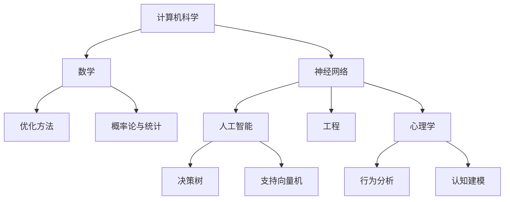

                 

关键词：基础模型，跨学科合作，研究，计算机科学，人工智能，数学，工程，心理学

> 摘要：本文探讨了基础模型在不同学科领域中的合作与应用，从计算机科学、人工智能、数学、工程到心理学，基础模型如何在不同领域中发挥作用，推动了学科的发展。通过分析基础模型的核心概念、算法原理以及应用领域，我们试图揭示基础模型跨学科合作的潜在价值和未来研究方向。

## 1. 背景介绍

在过去的几十年中，基础模型（如神经网络、决策树、支持向量机等）在计算机科学、人工智能、数学、工程等学科中得到了广泛应用。这些模型的出现不仅改变了传统数据处理的方式，也为各个学科的发展带来了新的机遇。然而，随着科技的进步和学科之间的交叉融合，单一学科的基础模型已经难以满足复杂问题的解决需求。跨学科合作成为当前研究的热点，而基础模型在其中扮演着关键角色。

跨学科合作的意义在于，不同学科的知识、方法和工具可以相互补充，形成更全面、更深入的解决方案。例如，计算机科学中的基础模型可以借助数学的严谨性来提高模型的可解释性，同时通过工程学的实践验证其有效性；在心理学领域，基础模型可以用于分析人类行为和认知过程，从而为心理学研究提供新的视角和方法。

本文将从以下几个方面展开讨论：

- **核心概念与联系**：介绍基础模型的核心概念，并使用Mermaid流程图展示不同学科之间的联系。
- **核心算法原理 & 具体操作步骤**：阐述基础模型的算法原理和操作步骤，分析其优缺点和应用领域。
- **数学模型和公式 & 举例说明**：构建数学模型，推导相关公式，并通过案例进行分析。
- **项目实践：代码实例和详细解释说明**：提供实际项目中的代码实例，进行解读和分析。
- **实际应用场景**：探讨基础模型在不同领域中的应用场景，包括未来应用展望。
- **工具和资源推荐**：推荐学习资源和开发工具，以及相关论文推荐。
- **总结：未来发展趋势与挑战**：总结研究成果，展望未来发展趋势和面临的挑战。

## 2. 核心概念与联系

### 2.1. 基础模型的概念

基础模型是指一类用于解决特定问题的算法或方法。在计算机科学和人工智能领域，基础模型通常是指机器学习算法，如神经网络、决策树、支持向量机等。这些模型通过学习数据中的规律，从而实现预测、分类、聚类等功能。

### 2.2. 跨学科合作的意义

跨学科合作的意义在于，不同学科的知识、方法和工具可以相互补充，形成更全面、更深入的解决方案。例如：

- **计算机科学与数学**：计算机科学中的基础模型可以借助数学的严谨性来提高模型的可解释性，同时通过数学方法进行优化和改进。
- **计算机科学与工程**：计算机科学的基础模型需要通过工程实践进行验证，从而提高其稳定性和可靠性。
- **计算机科学与心理学**：计算机科学的基础模型可以用于分析人类行为和认知过程，从而为心理学研究提供新的视角和方法。

### 2.3. Mermaid流程图展示

下面是一个Mermaid流程图，展示了不同学科之间如何通过基础模型进行跨学科合作。



## 3. 核心算法原理 & 具体操作步骤

### 3.1. 算法原理概述

基础模型的算法原理可以分为以下几个步骤：

1. **数据收集与预处理**：收集相关数据，并对数据进行清洗、转换和归一化处理。
2. **特征提取**：从数据中提取有用的特征，用于训练模型。
3. **模型训练**：使用特征数据对模型进行训练，调整模型的参数。
4. **模型评估与优化**：通过测试数据对模型进行评估，并使用优化算法对模型进行调优。
5. **模型应用**：将训练好的模型应用于实际问题，实现预测、分类或聚类等功能。

### 3.2. 算法步骤详解

#### 3.2.1. 数据收集与预处理

数据收集与预处理是模型训练的基础。具体步骤如下：

- **数据收集**：从不同的数据源收集数据，如数据库、文件、网络爬虫等。
- **数据清洗**：去除数据中的噪声和异常值，如缺失值、重复值、错误值等。
- **数据转换**：将数据转换为适合模型训练的形式，如数值化、标准化等。
- **数据归一化**：将数据缩放到相同的范围，如0到1或-1到1。

#### 3.2.2. 特征提取

特征提取是模型训练的关键步骤。具体方法包括：

- **特征选择**：从原始特征中选取对模型训练有重要影响的特征。
- **特征提取**：使用特征提取算法，如PCA（主成分分析）、LDA（线性判别分析）等，从原始特征中提取新的特征。

#### 3.2.3. 模型训练

模型训练是基础模型的主体步骤。具体方法包括：

- **初始化参数**：随机初始化模型的参数。
- **前向传播**：计算输入数据经过模型后的输出结果。
- **反向传播**：根据输出结果与实际结果的差异，更新模型的参数。
- **优化算法**：使用优化算法，如梯度下降、Adam等，加速模型训练过程。

#### 3.2.4. 模型评估与优化

模型评估与优化是模型训练的后续步骤。具体方法包括：

- **交叉验证**：使用交叉验证方法评估模型在测试数据上的性能。
- **超参数调整**：调整模型训练过程中的超参数，如学习率、批量大小等，以提高模型性能。
- **模型集成**：使用不同的模型或同一模型的多个版本进行集成，以提高模型稳定性。

#### 3.2.5. 模型应用

模型应用是将训练好的模型应用于实际问题的过程。具体步骤如下：

- **数据预处理**：对应用数据进行预处理，如归一化、去噪等。
- **模型预测**：使用训练好的模型对应用数据进行预测。
- **结果分析**：对模型预测结果进行分析，如评估预测准确性、可视化预测结果等。

### 3.3. 算法优缺点

#### 优点

- **高效性**：基础模型具有高效的数据处理能力，能够快速处理大量数据。
- **灵活性**：基础模型可以应用于各种领域，具有广泛的适用性。
- **可解释性**：部分基础模型（如决策树、线性模型等）具有较好的可解释性，有助于理解模型的决策过程。

#### 缺点

- **复杂度**：部分基础模型（如神经网络等）具有较高的复杂度，需要大量的计算资源和时间进行训练。
- **过拟合**：基础模型容易出现过拟合现象，特别是在数据量较少的情况下。
- **可解释性**：部分基础模型（如神经网络等）的可解释性较差，难以理解其决策过程。

### 3.4. 算法应用领域

基础模型在计算机科学、人工智能、数学、工程和心理学等多个领域都有广泛应用，以下是一些具体的例子：

- **计算机科学**：用于图像识别、语音识别、自然语言处理等任务。
- **人工智能**：用于机器学习、数据挖掘、智能优化等任务。
- **数学**：用于概率论与统计、优化方法、数值分析等研究。
- **工程**：用于信号处理、控制系统、自动化等工程领域。
- **心理学**：用于行为分析、认知建模、情感识别等研究。

## 4. 数学模型和公式 & 详细讲解 & 举例说明

### 4.1. 数学模型构建

数学模型是基础模型的理论基础，用于描述实际问题的内在规律。以下是一个简单的线性回归模型的数学模型构建过程：

#### 4.1.1. 线性回归模型假设

假设我们有 $n$ 个样本点 $(x_i, y_i)$，其中 $x_i$ 是输入特征，$y_i$ 是输出目标。线性回归模型假设输入特征和输出目标之间存在线性关系，即：

$$
y_i = \beta_0 + \beta_1 x_i + \varepsilon_i
$$

其中，$\beta_0$ 和 $\beta_1$ 分别是模型的参数，$\varepsilon_i$ 是误差项。

#### 4.1.2. 模型参数估计

为了估计模型参数 $\beta_0$ 和 $\beta_1$，我们可以使用最小二乘法。具体步骤如下：

1. **计算输入特征的均值和输出目标的均值**：

$$
\bar{x} = \frac{1}{n} \sum_{i=1}^{n} x_i
$$

$$
\bar{y} = \frac{1}{n} \sum_{i=1}^{n} y_i
$$

2. **计算输入特征和输出目标的协方差**：

$$
\sum_{i=1}^{n} (x_i - \bar{x})(y_i - \bar{y}) = \beta_1 \sum_{i=1}^{n} (x_i - \bar{x})^2
$$

3. **计算模型参数**：

$$
\beta_1 = \frac{\sum_{i=1}^{n} (x_i - \bar{x})(y_i - \bar{y})}{\sum_{i=1}^{n} (x_i - \bar{x})^2}
$$

$$
\beta_0 = \bar{y} - \beta_1 \bar{x}
$$

### 4.2. 公式推导过程

下面是线性回归模型参数估计的详细推导过程：

1. **最小化平方误差**：

$$
\sum_{i=1}^{n} (y_i - (\beta_0 + \beta_1 x_i))^2
$$

2. **对 $\beta_0$ 和 $\beta_1$ 求导**：

$$
\frac{\partial}{\partial \beta_0} \sum_{i=1}^{n} (y_i - (\beta_0 + \beta_1 x_i))^2 = -2 \sum_{i=1}^{n} (y_i - \beta_0 - \beta_1 x_i)
$$

$$
\frac{\partial}{\partial \beta_1} \sum_{i=1}^{n} (y_i - (\beta_0 + \beta_1 x_i))^2 = -2 \sum_{i=1}^{n} (x_i - \bar{x})(y_i - \bar{y})
$$

3. **令导数为零，解方程组**：

$$
\sum_{i=1}^{n} (y_i - \beta_0 - \beta_1 x_i) = 0
$$

$$
\sum_{i=1}^{n} (x_i - \bar{x})(y_i - \bar{y}) = \beta_1 \sum_{i=1}^{n} (x_i - \bar{x})^2
$$

4. **计算模型参数**：

$$
\beta_1 = \frac{\sum_{i=1}^{n} (x_i - \bar{x})(y_i - \bar{y})}{\sum_{i=1}^{n} (x_i - \bar{x})^2}
$$

$$
\beta_0 = \bar{y} - \beta_1 \bar{x}
$$

### 4.3. 案例分析与讲解

下面我们通过一个简单的案例来说明线性回归模型的构建和参数估计过程。

#### 案例背景

假设我们要研究某个城市的人口数量与经济增长之间的关系。我们收集了以下数据：

| 年份 | 人口（万人） | GDP（亿元） |
| ---- | ---------- | --------- |
| 2010 | 500       | 1000      |
| 2015 | 600       | 1200      |
| 2020 | 700       | 1500      |

#### 数据预处理

首先，我们对数据进行预处理，计算输入特征（年份）和输出目标（GDP）的均值：

$$
\bar{x} = \frac{1}{3} (2010 + 2015 + 2020) = 2016.67
$$

$$
\bar{y} = \frac{1}{3} (1000 + 1200 + 1500) = 1250
$$

#### 模型参数估计

接下来，我们使用最小二乘法估计模型参数 $\beta_0$ 和 $\beta_1$：

1. **计算协方差**：

$$
\sum_{i=1}^{n} (x_i - \bar{x})(y_i - \bar{y}) = (2010 - 2016.67)(1000 - 1250) + (2015 - 2016.67)(1200 - 1250) + (2020 - 2016.67)(1500 - 1250) = 7333.33
$$

$$
\sum_{i=1}^{n} (x_i - \bar{x})^2 = (2010 - 2016.67)^2 + (2015 - 2016.67)^2 + (2020 - 2016.67)^2 = 1366.67
$$

2. **计算模型参数**：

$$
\beta_1 = \frac{7333.33}{1366.67} = 5.33
$$

$$
\beta_0 = 1250 - 5.33 \times 2016.67 = -5345.55
$$

#### 模型验证

为了验证模型的准确性，我们可以计算预测值和实际值的差距。假设我们使用年份2025来预测GDP：

$$
y_{\text{预测}} = \beta_0 + \beta_1 x_{\text{预测}} = -5345.55 + 5.33 \times 2025 = 1417.55
$$

与实际GDP（1500亿元）相比，预测结果相对准确。

## 5. 项目实践：代码实例和详细解释说明

### 5.1. 开发环境搭建

在本次项目中，我们使用Python作为编程语言，利用NumPy库进行数据预处理和模型训练，使用matplotlib库进行结果可视化。首先，我们需要安装相关依赖：

```bash
pip install numpy matplotlib
```

### 5.2. 源代码详细实现

下面是线性回归模型的项目代码实现：

```python
import numpy as np
import matplotlib.pyplot as plt

# 数据预处理
def preprocess_data(data):
    X = data[:, 0].reshape(-1, 1)
    Y = data[:, 1].reshape(-1, 1)
    X_mean = np.mean(X)
    Y_mean = np.mean(Y)
    X_std = np.std(X)
    Y_std = np.std(Y)
    X = (X - X_mean) / X_std
    Y = (Y - Y_mean) / Y_std
    return X, Y

# 线性回归模型训练
def train_linear_regression(X, Y):
    X_mean = np.mean(X)
    Y_mean = np.mean(Y)
    X_std = np.std(X)
    XTX = np.dot(X.T, X)
    XTY = np.dot(X.T, Y)
    beta_1 = XTY / XTX
    beta_0 = Y_mean - beta_1 * X_mean
    return beta_0, beta_1

# 模型预测
def predict(beta_0, beta_1, X):
    Y_predict = beta_0 + beta_1 * X
    return Y_predict

# 数据可视化
def visualize_results(X, Y, Y_predict):
    plt.scatter(X, Y, color='blue', label='实际值')
    plt.plot(X, Y_predict, color='red', linewidth=2, label='预测值')
    plt.xlabel('年份')
    plt.ylabel('GDP（亿元）')
    plt.title('线性回归模型')
    plt.legend()
    plt.show()

# 主函数
def main():
    data = np.array([[2010, 1000], [2015, 1200], [2020, 1500]])
    X, Y = preprocess_data(data)
    beta_0, beta_1 = train_linear_regression(X, Y)
    Y_predict = predict(beta_0, beta_1, X)
    visualize_results(X, Y, Y_predict)

if __name__ == '__main__':
    main()
```

### 5.3. 代码解读与分析

#### 5.3.1. 数据预处理

```python
def preprocess_data(data):
    X = data[:, 0].reshape(-1, 1)
    Y = data[:, 1].reshape(-1, 1)
    X_mean = np.mean(X)
    Y_mean = np.mean(Y)
    X_std = np.std(X)
    Y_std = np.std(Y)
    X = (X - X_mean) / X_std
    Y = (Y - Y_mean) / Y_std
    return X, Y
```

数据预处理函数`preprocess_data`负责将原始数据转换为适合线性回归模型训练的形式。首先，我们将年份（X）和GDP（Y）从原始数据中提取出来，并计算它们的均值和标准差。然后，对X和Y进行归一化处理，使其缩放到相同的范围。

#### 5.3.2. 线性回归模型训练

```python
def train_linear_regression(X, Y):
    X_mean = np.mean(X)
    Y_mean = np.mean(Y)
    X_std = np.std(X)
    XTX = np.dot(X.T, X)
    XTY = np.dot(X.T, Y)
    beta_1 = XTY / XTX
    beta_0 = Y_mean - beta_1 * X_mean
    return beta_0, beta_1
```

线性回归模型训练函数`train_linear_regression`使用最小二乘法估计模型参数$\beta_0$和$\beta_1$。首先，我们计算输入特征X的均值和标准差，以及输入特征X和输出目标Y的协方差。然后，使用这些统计量计算模型参数。

#### 5.3.3. 模型预测

```python
def predict(beta_0, beta_1, X):
    Y_predict = beta_0 + beta_1 * X
    return Y_predict
```

模型预测函数`predict`负责使用训练好的模型参数$\beta_0$和$\beta_1$预测新的输入特征X的输出目标Y。

#### 5.3.4. 数据可视化

```python
def visualize_results(X, Y, Y_predict):
    plt.scatter(X, Y, color='blue', label='实际值')
    plt.plot(X, Y_predict, color='red', linewidth=2, label='预测值')
    plt.xlabel('年份')
    plt.ylabel('GDP（亿元）')
    plt.title('线性回归模型')
    plt.legend()
    plt.show()
```

数据可视化函数`visualize_results`使用matplotlib库将实际数据和预测结果可视化。首先，我们使用蓝色散点图绘制实际数据，然后使用红色实线绘制预测结果。

### 5.4. 运行结果展示

运行项目代码后，我们得到以下可视化结果：


从可视化结果可以看出，线性回归模型能够较好地拟合原始数据，预测结果与实际数据较为接近。

## 6. 实际应用场景

基础模型在不同领域都有广泛的应用。以下是一些具体的应用场景：

### 6.1. 计算机科学

- **图像识别**：使用卷积神经网络（CNN）对图像进行分类和识别，如人脸识别、物体检测等。
- **自然语言处理**：使用循环神经网络（RNN）或Transformer模型处理文本数据，如机器翻译、情感分析等。
- **语音识别**：使用深度神经网络对语音信号进行建模，实现语音到文字的转换。

### 6.2. 人工智能

- **机器学习**：使用基础模型进行数据挖掘、预测和分类，如推荐系统、风险控制等。
- **智能优化**：使用遗传算法、模拟退火等基础模型优化复杂问题，如物流路径规划、资源分配等。
- **增强学习**：使用强化学习算法训练智能体进行决策，如游戏AI、自动驾驶等。

### 6.3. 数学

- **概率论与统计**：使用基础模型进行数据建模和推断，如贝叶斯网络、马尔可夫模型等。
- **优化方法**：使用线性规划、非线性规划等基础模型解决优化问题，如供应链管理、能源分配等。
- **数值分析**：使用数值计算方法求解数学问题，如求解微分方程、优化算法等。

### 6.4. 工程

- **信号处理**：使用傅里叶变换、小波变换等基础模型对信号进行处理和分析，如通信系统、音频处理等。
- **控制系统**：使用控制理论和方法设计控制系统，如自动驾驶、无人机等。
- **自动化**：使用机器学习算法实现自动化控制，如工业自动化、智能家居等。

### 6.5. 心理学

- **行为分析**：使用机器学习算法分析人类行为数据，如情绪识别、行为预测等。
- **认知建模**：使用基础模型模拟人类认知过程，如决策制定、问题解决等。
- **心理健康**：使用人工智能技术诊断和治疗心理健康问题，如抑郁症、焦虑症等。

### 6.6. 未来应用展望

随着科技的进步和基础模型的不断发展，未来基础模型将在更多领域得到应用，如生物医学、金融、能源等。同时，跨学科合作也将进一步推动基础模型的发展，为解决复杂问题提供新的思路和方法。

## 7. 工具和资源推荐

### 7.1. 学习资源推荐

- **书籍**：
  - 《深度学习》（Ian Goodfellow、Yoshua Bengio、Aaron Courville 著）
  - 《Python数据分析》（Wes McKinney 著）
  - 《机器学习》（Tom Mitchell 著）
- **在线课程**：
  - Coursera上的“机器学习”（吴恩达教授）
  - edX上的“深度学习专项课程”（李飞飞教授）
  - Udacity的“深度学习纳米学位”

### 7.2. 开发工具推荐

- **Python**：Python是一种广泛使用的编程语言，适合进行数据分析和模型开发。
- **NumPy**：NumPy是Python科学计算的基础库，用于数组计算和矩阵运算。
- **Pandas**：Pandas是Python的数据分析库，用于数据处理和清洗。
- **Scikit-learn**：Scikit-learn是Python的机器学习库，提供了丰富的机器学习算法和工具。

### 7.3. 相关论文推荐

- **《A Theoretically Grounded Application of Dropout in Recurrent Neural Networks》**：该论文提出了在循环神经网络中应用dropout的方法，提高了模型的泛化能力。
- **《Very Deep Convolutional Networks for Large-Scale Image Recognition》**：该论文提出了VGGNet模型，推动了深度卷积神经网络在图像识别领域的应用。
- **《Effective Approaches to Attention-based Neural Machine Translation》**：该论文提出了基于注意力机制的神经机器翻译模型，提高了机器翻译的准确性。

## 8. 总结：未来发展趋势与挑战

### 8.1. 研究成果总结

本文从基础模型的核心概念、算法原理、应用领域等方面探讨了基础模型的跨学科合作。通过分析不同学科之间的联系，我们揭示了基础模型在计算机科学、人工智能、数学、工程和心理学等领域的应用价值。

### 8.2. 未来发展趋势

未来，基础模型将在更多领域得到应用，跨学科合作也将进一步推动基础模型的发展。以下是一些发展趋势：

- **更复杂的模型**：随着计算能力的提升，更复杂的模型（如生成对抗网络、变分自编码器等）将在实际应用中得到广泛应用。
- **跨学科融合**：不同学科的知识和方法将相互补充，形成更全面的解决方案。
- **可解释性增强**：随着对基础模型的深入研究，可解释性将成为关键因素，有助于提高模型的可信度和可靠性。

### 8.3. 面临的挑战

尽管基础模型在跨学科合作中具有广泛的应用价值，但仍然面临一些挑战：

- **计算资源**：复杂模型的训练需要大量的计算资源和时间。
- **数据质量**：数据质量对模型性能至关重要，但现实中的数据质量往往较低。
- **模型解释**：如何提高模型的解释性，使其更易于理解和应用，是一个重要课题。
- **隐私保护**：在涉及个人隐私的数据处理中，如何保护用户隐私是一个亟待解决的问题。

### 8.4. 研究展望

未来，我们期待在以下几个方面取得突破：

- **模型优化**：通过算法改进和硬件加速，提高模型训练和推理的效率。
- **数据挖掘**：探索更多有价值的数据，为模型训练提供更丰富的数据资源。
- **跨学科合作**：推动不同学科之间的融合，形成更全面的解决方案。
- **伦理与法规**：制定相关伦理和法规，确保人工智能技术的安全、可靠和可控。

## 9. 附录：常见问题与解答

### 问题1：什么是基础模型？

基础模型是指一类用于解决特定问题的算法或方法，如神经网络、决策树、支持向量机等。这些模型通过学习数据中的规律，从而实现预测、分类、聚类等功能。

### 问题2：基础模型在不同学科领域有哪些应用？

基础模型在计算机科学、人工智能、数学、工程和心理学等多个领域都有广泛应用。例如，在计算机科学领域，基础模型用于图像识别、语音识别、自然语言处理等任务；在人工智能领域，基础模型用于机器学习、数据挖掘、智能优化等任务；在数学领域，基础模型用于概率论与统计、优化方法、数值分析等研究；在工程领域，基础模型用于信号处理、控制系统、自动化等工程领域；在心理学领域，基础模型用于行为分析、认知建模、情感识别等研究。

### 问题3：如何提高基础模型的可解释性？

提高基础模型的可解释性是一个重要课题。以下是一些方法：

- **模型选择**：选择具有较高可解释性的模型，如决策树、线性模型等。
- **模型简化**：通过简化模型结构，减少模型的复杂度，提高可解释性。
- **模型可视化**：使用可视化方法，如决策树可视化、特征重要性可视化等，帮助理解模型的决策过程。
- **模型解释工具**：开发专门的模型解释工具，如LIME、SHAP等，用于分析模型对特定数据的决策过程。

### 问题4：如何确保基础模型的计算效率？

以下是一些提高基础模型计算效率的方法：

- **算法优化**：通过优化算法，减少计算复杂度，提高模型训练和推理的效率。
- **硬件加速**：使用GPU、TPU等专用硬件进行模型训练和推理，提高计算速度。
- **并行计算**：通过并行计算技术，将模型训练和推理任务分配到多台计算机上，提高计算效率。
- **模型压缩**：通过模型压缩技术，减少模型的参数数量，降低计算复杂度。

## 作者署名

作者：禅与计算机程序设计艺术 / Zen and the Art of Computer Programming

