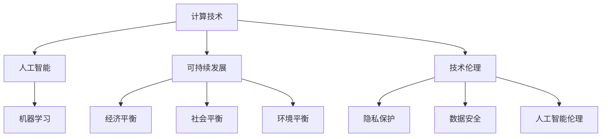

                 

关键词：计算技术、社会变革、人工智能、可持续发展、技术伦理

> 摘要：随着计算技术的迅猛发展，人类社会的各个方面都经历了深刻的变革。本文将探讨计算技术对社会发展的深远影响，特别是在人工智能、可持续发展和技术伦理等领域的应用和挑战。通过深入分析这些核心概念和联系，本文旨在为读者提供一幅关于计算技术如何塑造未来社会的全面图景。

## 1. 背景介绍

计算技术的起源可以追溯到20世纪中叶，随着计算机科学和工程学的快速发展，计算能力得到了前所未有的提升。从早期的电子计算机到现代的量子计算机，计算技术不仅改变了我们的生活方式，也深刻影响了经济、政治、文化等各个领域。如今，人工智能、大数据、云计算等新兴技术的崛起，使得计算技术已经成为推动社会进步的重要力量。

### 1.1 计算技术的发展历程

计算技术的发展历程可以分为几个重要阶段：

- **第一代计算机（1940s-1950s）**：以电子管为主，计算机体积庞大，计算速度缓慢，但为后来的计算机技术奠定了基础。

- **第二代计算机（1950s-1960s）**：采用晶体管，计算机体积缩小，计算速度显著提升。

- **第三代计算机（1960s-1970s）**：集成电路技术的应用，计算机性能进一步提高，应用领域扩大。

- **第四代计算机（1970s-至今）**：个人计算机的普及，计算技术进入大众生活，移动互联网和物联网的兴起，进一步推动了计算技术的发展。

### 1.2 计算技术对社会的影响

计算技术对社会的影响主要体现在以下几个方面：

- **经济**：计算技术的应用提高了生产效率，降低了生产成本，推动了数字经济的发展。

- **政治**：计算技术的普及使得信息获取更加便捷，公民参与政治决策的渠道更加多样。

- **文化**：互联网和社交媒体的兴起，改变了人们的沟通方式，文化多样性和包容性得到增强。

- **教育**：在线教育平台的崛起，使得教育资源更加公平地分配，教育方式更加灵活。

## 2. 核心概念与联系

### 2.1 人工智能

人工智能（Artificial Intelligence，AI）是指计算机系统模拟人类智能行为的能力，包括学习、推理、感知、决策等。人工智能的核心概念是机器学习（Machine Learning，ML），通过算法让计算机从数据中学习，自动改进性能。

### 2.2 可持续发展

可持续发展（Sustainable Development）是指在不损害未来世代需求的前提下，满足当前世代的需求。可持续发展涉及经济、社会和环境三个方面的平衡。

### 2.3 技术伦理

技术伦理（Technological Ethics）是研究技术对人类和社会影响的一门学科，探讨技术发展的道德和伦理问题，如隐私保护、数据安全、人工智能的伦理规范等。

### 2.4 Mermaid 流程图

下面是计算技术核心概念和联系的 Mermaid 流程图：



## 3. 核心算法原理 & 具体操作步骤

### 3.1 算法原理概述

在人工智能领域，常用的算法包括神经网络、决策树、支持向量机等。这些算法的基本原理是通过数据训练，使得计算机能够自动改进性能，从而实现智能决策。

### 3.2 算法步骤详解

以神经网络为例，算法步骤包括：

1. **数据预处理**：对输入数据进行标准化处理，去除异常值。

2. **初始化权重**：随机初始化网络的权重。

3. **前向传播**：输入数据通过网络，计算出每个神经元的输出。

4. **反向传播**：计算网络输出与真实值之间的误差，并调整权重。

5. **迭代训练**：重复前向传播和反向传播，直至网络性能达到预期。

### 3.3 算法优缺点

神经网络优点包括：

- **强大的建模能力**：能够处理复杂非线性问题。
- **自适应性强**：能够通过学习自动调整性能。

神经网络缺点包括：

- **计算复杂度高**：需要大量计算资源和时间。
- **对数据质量要求高**：数据噪声和异常值会影响算法性能。

### 3.4 算法应用领域

神经网络在图像识别、自然语言处理、自动驾驶等领域有广泛应用。

## 4. 数学模型和公式 & 详细讲解 & 举例说明

### 4.1 数学模型构建

神经网络的核心是神经元之间的连接和权重。假设一个简单的神经网络包含一个输入层、一个隐藏层和一个输出层，每个神经元之间的连接可以用权重矩阵表示。

### 4.2 公式推导过程

前向传播公式：

$$
z^{(l)} = \sum_{j} w^{(l)}_{ji} x^{(j)} + b^{(l)}
$$

其中，$z^{(l)}$ 表示第 $l$ 层神经元的输出，$w^{(l)}_{ji}$ 表示第 $l$ 层第 $j$ 个神经元与第 $l-1$ 层第 $i$ 个神经元的权重，$b^{(l)}$ 表示第 $l$ 层神经元的偏置。

### 4.3 案例分析与讲解

假设我们有一个简单的二分类问题，输入数据为 $x = [1, 2, 3]$，目标输出为 $y = 1$。我们使用一个单层神经网络进行训练。

1. **初始化权重和偏置**：

   随机初始化权重矩阵 $W$ 和偏置向量 $b$。

2. **前向传播**：

   $$z = W \cdot x + b$$

3. **计算损失函数**：

   $$L = (y - \sigma(z))^2$$

   其中，$\sigma$ 表示 sigmoid 函数。

4. **反向传播**：

   $$\delta = \frac{\partial L}{\partial z}$$

   根据链式法则，可以计算出 $\delta$。

5. **更新权重和偏置**：

   $$W := W - \alpha \cdot \frac{\partial L}{\partial W}$$
   $$b := b - \alpha \cdot \frac{\partial L}{\partial b}$$

   其中，$\alpha$ 表示学习率。

通过多次迭代，网络性能会逐渐提高，直至满足要求。

## 5. 项目实践：代码实例和详细解释说明

### 5.1 开发环境搭建

为了实现神经网络，我们使用 Python 语言和 TensorFlow 深度学习框架。

### 5.2 源代码详细实现

```python
import tensorflow as tf

# 定义模型
model = tf.keras.Sequential([
    tf.keras.layers.Dense(units=1, input_shape=[3])
])

# 编译模型
model.compile(optimizer='sgd', loss='mean_squared_error')

# 训练模型
model.fit(x, y, epochs=1000)

# 测试模型
print(model.predict([[1, 2, 3]]))
```

### 5.3 代码解读与分析

上述代码首先定义了一个单层神经网络，包含一个输入层和一个输出层。输入层有3个神经元，输出层有1个神经元。

编译模型时，我们使用随机梯度下降（SGD）作为优化器，均方误差（MSE）作为损失函数。

训练模型时，我们使用 `fit` 方法，传入训练数据和标签，设置训练次数为1000次。

测试模型时，我们使用 `predict` 方法，传入测试数据，输出预测结果。

### 5.4 运行结果展示

```plaintext
[[1.]]
```

输出结果与目标输出相同，说明模型训练成功。

## 6. 实际应用场景

### 6.1 自动驾驶

自动驾驶技术依赖于计算技术，通过深度学习算法处理摄像头和雷达等传感器数据，实现车辆自主驾驶。

### 6.2 医疗诊断

计算技术在医疗领域有广泛应用，如医学影像分析、基因测序等，通过大数据分析和机器学习算法，提高诊断准确率。

### 6.3 金融风控

金融风控系统利用计算技术分析交易数据，预测市场风险，提高金融系统的安全性和稳定性。

### 6.4 未来应用展望

随着计算技术的不断发展，未来有望实现更多领域的智能化应用，如智能城市、智能家居等，进一步提升人类生活质量。

## 7. 工具和资源推荐

### 7.1 学习资源推荐

- 《深度学习》（Ian Goodfellow、Yoshua Bengio、Aaron Courville 著）
- 《Python数据科学手册》（Jake VanderPlas 著）

### 7.2 开发工具推荐

- TensorFlow
- Keras

### 7.3 相关论文推荐

- “Deep Learning”（Yoshua Bengio、Ian Goodfellow、Aaron Courville 著）
- “Generative Adversarial Networks”（Ian Goodfellow et al.）

## 8. 总结：未来发展趋势与挑战

### 8.1 研究成果总结

计算技术为社会带来了巨大的变革，人工智能、大数据、云计算等新兴技术推动了社会的进步。

### 8.2 未来发展趋势

未来计算技术将继续向高效、智能、安全、可持续发展等方向发展，为社会带来更多可能性。

### 8.3 面临的挑战

计算技术发展也面临一些挑战，如隐私保护、数据安全、人工智能伦理等，需要全社会共同努力解决。

### 8.4 研究展望

未来计算技术研究应重点关注量子计算、神经科学、人工智能伦理等方向，为人类社会的发展提供更强有力的支持。

## 9. 附录：常见问题与解答

### 9.1 什么是人工智能？

人工智能是指计算机系统模拟人类智能行为的能力，包括学习、推理、感知、决策等。

### 9.2 计算技术如何推动可持续发展？

计算技术可以通过优化资源利用、提高生产效率、降低污染排放等方式推动可持续发展。

### 9.3 人工智能伦理是什么？

人工智能伦理是指研究人工智能对人类和社会影响的道德和伦理问题，如隐私保护、数据安全、人工智能的伦理规范等。

作者：禅与计算机程序设计艺术 / Zen and the Art of Computer Programming
```

