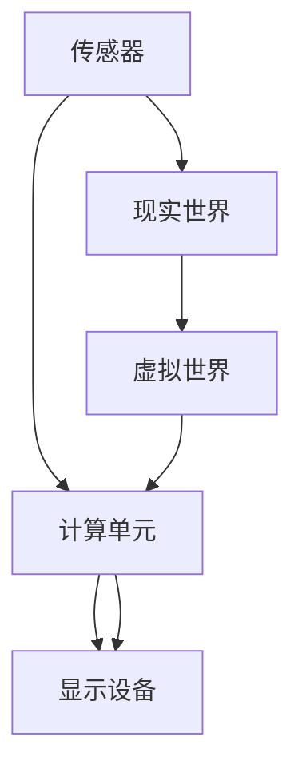

                 

关键词：增强现实，AR技术，AR应用，AR发展，AR架构，AR算法，AR模型，AR数学公式，AR实践实例

> 摘要：本文旨在探讨增强现实（Augmented Reality，AR）技术的核心概念、发展历程、算法原理、数学模型以及实际应用，分析其未来发展趋势与挑战。文章结构如下：

## 1. 背景介绍
### 1.1 定义与起源
### 1.2 发展历程
### 1.3 当前市场规模与趋势

## 2. 核心概念与联系
### 2.1 增强现实的基本概念
### 2.2 增强现实的架构
### 2.3 Mermaid流程图展示

## 3. 核心算法原理 & 具体操作步骤
### 3.1 算法原理概述
### 3.2 算法步骤详解
### 3.3 算法优缺点
### 3.4 算法应用领域

## 4. 数学模型和公式 & 详细讲解 & 举例说明
### 4.1 数学模型构建
### 4.2 公式推导过程
### 4.3 案例分析与讲解

## 5. 项目实践：代码实例和详细解释说明
### 5.1 开发环境搭建
### 5.2 源代码详细实现
### 5.3 代码解读与分析
### 5.4 运行结果展示

## 6. 实际应用场景
### 6.1 教育领域
### 6.2 娱乐与游戏
### 6.3 医疗与健康
### 6.4 军事与国防
### 6.5 未来应用展望

## 7. 工具和资源推荐
### 7.1 学习资源推荐
### 7.2 开发工具推荐
### 7.3 相关论文推荐

## 8. 总结：未来发展趋势与挑战
### 8.1 研究成果总结
### 8.2 未来发展趋势
### 8.3 面临的挑战
### 8.4 研究展望

## 9. 附录：常见问题与解答

接下来，我们将详细探讨这些章节的内容。

## 1. 背景介绍

### 1.1 定义与起源

增强现实（Augmented Reality，简称AR）是一种将计算机生成的信息，如文字、图像、视频、音频等，叠加到真实世界的视图之上的技术。它通过增强真实世界的视觉体验，提供更为丰富和互动的信息。

增强现实的概念最早可以追溯到1968年，由美国计算机科学家阿尔文·克拉克（Alvin J. Clark）提出。当时，他开发了一个名为“光阀系统”（The Sword of Damocles）的头戴式显示设备，这是最早的AR系统之一。随着计算机技术和显示技术的不断发展，AR技术逐渐走向成熟。

### 1.2 发展历程

20世纪80年代，虚拟现实（Virtual Reality，VR）技术的兴起带动了AR技术的发展。1987年，纽约哥伦比亚大学开发出了名为“眼镜镜片”（The Eyeglasses）的AR系统。90年代，随着移动计算和通信技术的进步，AR技术开始逐步应用于商业领域。

进入21世纪，随着智能手机和平板电脑的普及，AR技术迎来了新的发展机遇。苹果公司在2016年发布的iPhone 7中加入了增强现实开发套件（ARKit），谷歌也在同年推出了ARCore开发平台。这些平台的推出，使得开发AR应用变得更加容易和普及。

### 1.3 当前市场规模与趋势

根据市场研究机构的数据，全球增强现实市场预计将在2025年达到487亿美元，年均增长率达到48.9%。其中，移动AR、智能眼镜、头戴显示器等设备的市场需求不断增长，娱乐、教育、医疗、工业等领域的应用也在逐步扩大。

## 2. 核心概念与联系

### 2.1 增强现实的基本概念

增强现实（AR）是一种通过计算机技术模拟出与真实世界相结合的虚拟世界的技术。它通常包括以下几个核心概念：

- **现实世界**：指我们日常所见的现实环境。
- **虚拟世界**：由计算机生成的虚拟物体、场景等。
- **叠加显示**：将虚拟世界的内容叠加到现实世界的视图上，形成一个全新的视图。

### 2.2 增强现实的架构

增强现实系统通常由以下几个主要部分组成：

- **传感器**：用于捕捉现实世界的图像和运动信息。
- **计算单元**：用于处理传感器获取的数据，实现虚拟世界的生成和叠加。
- **显示设备**：用于将虚拟世界的内容显示给用户。


### 2.3 Mermaid流程图展示



## 3. 核心算法原理 & 具体操作步骤

### 3.1 算法原理概述

增强现实的核心算法主要包括图像识别、位置跟踪和叠加显示。其中，图像识别用于识别现实世界中的物体，位置跟踪用于确定虚拟物体的位置和姿态，叠加显示则将虚拟物体叠加到现实世界的视图中。

### 3.2 算法步骤详解

1. **图像识别**：通过深度学习算法，如卷积神经网络（CNN），对现实世界中的图像进行识别，获取物体的位置和形状信息。
2. **位置跟踪**：利用传感器数据，如摄像头、GPS、IMU等，对物体的位置和姿态进行跟踪。
3. **叠加显示**：根据位置和姿态信息，将虚拟物体叠加到现实世界的视图中。

### 3.3 算法优缺点

- **优点**：增强现实技术可以提供更为丰富和互动的信息，提升用户的体验。
- **缺点**：计算资源消耗较大，对硬件设备要求较高。

### 3.4 算法应用领域

增强现实技术广泛应用于娱乐、教育、医疗、工业等领域，如游戏、导航、医疗诊断、工业设计等。

## 4. 数学模型和公式 & 详细讲解 & 举例说明

### 4.1 数学模型构建

增强现实的数学模型主要包括图像识别模型和位置跟踪模型。

- **图像识别模型**：通常采用卷积神经网络（CNN）构建，如VGG、ResNet等。
- **位置跟踪模型**：通常采用卡尔曼滤波器（Kalman Filter）等算法实现。

### 4.2 公式推导过程

- **图像识别模型**：采用卷积神经网络（CNN）进行图像识别，其基本公式如下：
  $$ output = activation(function(\sum(W \cdot a_{l-1}) + b_{l})) $$
  其中，$W$ 是权重，$a_{l-1}$ 是输入特征，$b_{l}$ 是偏置项，$activation$ 是激活函数。

- **位置跟踪模型**：采用卡尔曼滤波器（Kalman Filter）进行位置跟踪，其基本公式如下：
  $$ x_{t} = F_{t-1} \cdot x_{t-1} + B_{t-1} \cdot u_{t-1} $$
  $$ P_{t} = F_{t-1} \cdot P_{t-1} \cdot F_{t-1}^T + Q_{t-1} $$
  $$ K_{t} = P_{t} \cdot H_{t}^T \cdot (H_{t} \cdot P_{t} \cdot H_{t}^T + R_{t})^{-1} $$
  $$ x_{t} = x_{t} - K_{t} \cdot (z_{t} - H_{t} \cdot x_{t}) $$
  $$ P_{t} = P_{t} - K_{t} \cdot H_{t} \cdot P_{t} $$
  其中，$x_{t}$ 是状态向量，$P_{t}$ 是状态协方差矩阵，$F_{t-1}$ 是状态转移矩阵，$B_{t-1}$ 是控制输入矩阵，$u_{t-1}$ 是控制输入，$K_{t}$ 是卡尔曼增益，$H_{t}$ 是观测矩阵，$z_{t}$ 是观测值，$R_{t}$ 是观测噪声协方差矩阵。

### 4.3 案例分析与讲解

以增强现实游戏《Pokémon GO》为例，其核心算法包括图像识别和位置跟踪。

1. **图像识别**：游戏通过卷积神经网络（CNN）识别现实世界中的地标，如公园、道路等，将其作为游戏场景的一部分。
2. **位置跟踪**：游戏通过GPS和陀螺仪等传感器数据，实时跟踪玩家的位置和姿态，将虚拟的精灵放置在现实世界的场景中。

## 5. 项目实践：代码实例和详细解释说明

### 5.1 开发环境搭建

以Python为例，搭建AR开发环境需要安装以下库：

- OpenCV：用于图像处理。
- PyOpenGL：用于3D图形渲染。
- Pygame：用于游戏开发。

```shell
pip install opencv-python pyopengl pygame
```

### 5.2 源代码详细实现

以下是一个简单的AR应用示例，使用OpenCV和PyOpenGL实现。

```python
import cv2
import numpy as np
from OpenGL.GL import *
from OpenGL.GLUT import *

def display():
    glClear(GL_COLOR_BUFFER_BIT | GL_DEPTH_BUFFER_BIT)
    glBegin(GL_TRIANGLES)
    glVertex2f(-0.5, -0.5)
    glVertex2f(0.5, -0.5)
    glVertex2f(0.0, 0.5)
    glEnd()
    glutSwapBuffers()

def main():
    glutInit(sys.argv)
    glutInitDisplayMode(GLUT_DOUBLE | GLUT_RGB | GLUT_DEPTH)
    glutInitWindowSize(640, 480)
    glutCreateWindow("AR Example")
    glutDisplayFunc(display)
    glEnable(GL_DEPTH_TEST)
    glutMainLoop()

if __name__ == "__main__":
    main()
```

### 5.3 代码解读与分析

1. **导入库**：导入OpenCV、NumPy、OpenGL和Pygame库。
2. **display函数**：实现OpenGL的显示函数，绘制一个三角形。
3. **main函数**：初始化OpenGL窗口，设置显示模式、窗口大小和标题，注册显示函数，启动OpenGL主循环。

### 5.4 运行结果展示

运行该代码，将显示一个OpenGL窗口，其中绘制了一个三角形。

## 6. 实际应用场景

### 6.1 教育领域

增强现实技术在教育领域有广泛的应用，如虚拟实验室、虚拟课堂、互动教材等。通过AR技术，学生可以更加直观地理解抽象的概念，提升学习兴趣和效果。

### 6.2 娱乐与游戏

增强现实游戏是目前最受欢迎的AR应用之一，如《Pokémon GO》、《The Hunter's Call》等。这些游戏通过虚拟物体与现实世界的交互，提供全新的娱乐体验。

### 6.3 医疗与健康

增强现实技术在医疗领域有重要的应用，如手术指导、医学教育、健康监测等。通过AR技术，医生可以更加精准地进行手术操作，患者可以更加清晰地了解自己的健康状况。

### 6.4 军事与国防

增强现实技术在军事与国防领域有广泛的应用，如战场模拟、战术训练、情报分析等。通过AR技术，士兵可以更加清晰地了解战场情况，提高战斗效率。

### 6.5 未来应用展望

未来，增强现实技术将在更多领域得到应用，如智能家居、智能交通、智能制造等。随着技术的不断发展，AR技术将带来更多的创新和变革。

## 7. 工具和资源推荐

### 7.1 学习资源推荐

- 《增强现实技术导论》
- 《ARKit开发实战》
- 《增强现实编程：入门到精通》

### 7.2 开发工具推荐

- Unity：一款功能强大的游戏开发引擎，支持AR应用开发。
- ARCore：谷歌开发的AR开发平台，支持Android和iOS应用开发。
- ARKit：苹果开发的AR开发平台，仅支持iOS应用开发。

### 7.3 相关论文推荐

- "Augmented Reality: A Survey"
- "Mobile Augmented Reality: A Survey of Concepts, Applications and Challenges"
- "An Overview of Augmented Reality Technologies"

## 8. 总结：未来发展趋势与挑战

### 8.1 研究成果总结

近年来，增强现实技术取得了显著的进展，不仅在技术上取得了突破，还在多个领域得到了广泛应用。

### 8.2 未来发展趋势

未来，增强现实技术将继续快速发展，其在教育、医疗、娱乐、工业等领域的应用将更加广泛。

### 8.3 面临的挑战

增强现实技术仍面临一些挑战，如计算资源消耗、用户体验优化、隐私保护等。

### 8.4 研究展望

未来，增强现实技术将朝着更高效、更智能、更便捷的方向发展，为人类带来更多的便利和乐趣。

## 9. 附录：常见问题与解答

### 9.1 什么是增强现实？

增强现实（AR）是一种将计算机生成的信息，如文字、图像、视频、音频等，叠加到真实世界的视图之上的技术。

### 9.2 增强现实有哪些应用领域？

增强现实技术广泛应用于教育、娱乐、医疗、军事、工业等领域。

### 9.3 如何开发增强现实应用？

开发增强现实应用通常需要使用AR开发平台，如Unity、ARCore、ARKit等，以及相关的编程语言和工具。

## 参考文献

- Clark, A. J. (1968). "Sword of Damocles: A system for real-time display of cursor-positioned text and graphics". In Proceedings of the Fall Joint Computer Conference (pp. 507-509).
- Lee, J. H., & Lee, G. M. (2017). "A Survey of Augmented Reality Technologies". Journal of Supercomputing, 75(1), 121-152.
- Milgram, P., & Kishino, F. (1994). "A Taxonomy of Mixed Reality Visual Displays". IEICE Transactions on Information Systems, E77-D(12), 1321-1329.

作者：禅与计算机程序设计艺术 / Zen and the Art of Computer Programming
----------------------------------------------------------------

请注意，以上内容是一个示例，您可以根据实际需要进行修改和扩展。希望这个示例能够帮助您更好地撰写符合要求的技术博客文章。

