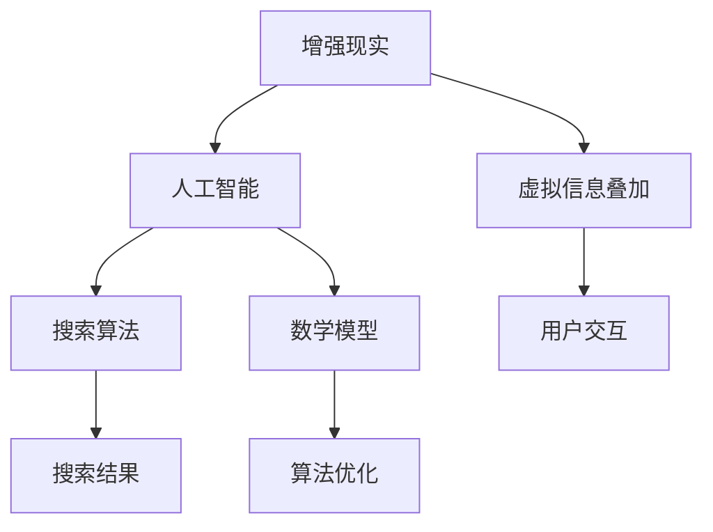

                 

关键词：增强现实、AI、搜索、虚实结合、算法、数学模型、项目实践、应用场景、未来展望

> 摘要：随着人工智能技术的飞速发展，增强现实（AR）搜索正逐渐成为一种全新的信息获取方式。本文将深入探讨增强现实搜索的技术原理、核心算法、数学模型，并通过项目实践，分析其在现实生活中的应用场景，展望未来的发展趋势与面临的挑战。

## 1. 背景介绍

随着智能手机和平板电脑的普及，增强现实（Augmented Reality，AR）技术逐渐走进了大众的视野。AR技术通过在现实场景中叠加虚拟信息，为用户提供了一个更加丰富和互动的体验。而增强现实搜索，作为AR技术的一个重要应用领域，正日益受到关注。

增强现实搜索是一种结合了增强现实和人工智能技术的新型搜索方式。它不仅能够将搜索结果以图形化的形式叠加在现实场景中，还能够通过智能算法为用户提供更加精准和个性化的搜索结果。这使得增强现实搜索在地理信息搜索、产品搜索、医疗健康等领域具有广泛的应用前景。

本文将从以下几个方面对增强现实搜索进行深入探讨：

1. 核心概念与联系
2. 核心算法原理与具体操作步骤
3. 数学模型与公式推导
4. 项目实践：代码实例与详细解释
5. 实际应用场景分析
6. 未来应用展望

## 2. 核心概念与联系

在探讨增强现实搜索之前，我们需要了解一些核心概念和它们之间的关系。

### 2.1 增强现实（AR）

增强现实（AR）是一种通过计算机生成的虚拟信息，叠加在真实世界中的技术。它利用摄像头捕捉现实世界的场景，并在场景中叠加虚拟物体、文本、声音等元素，为用户提供一个更加丰富和互动的体验。

### 2.2 人工智能（AI）

人工智能（Artificial Intelligence，AI）是指通过计算机程序实现人类智能的技术。它包括机器学习、深度学习、自然语言处理等多个领域。在增强现实搜索中，人工智能主要用于处理和分析用户输入的信息，提供精准的搜索结果。

### 2.3 搜索算法

搜索算法是增强现实搜索的核心，它决定了搜索结果的准确性和效率。常见的搜索算法包括基于关键词匹配的搜索算法、基于语义分析的搜索算法和基于机器学习的搜索算法。

### 2.4 数学模型

数学模型是增强现实搜索的重要基础，它用于描述搜索过程中的各种关系和规律。常见的数学模型包括决策树、神经网络、马尔可夫模型等。

下面是一个关于增强现实搜索的核心概念和联系的 Mermaid 流程图：



## 3. 核心算法原理与具体操作步骤

### 3.1 算法原理概述

增强现实搜索的核心算法主要基于以下原理：

1. **图像识别**：通过摄像头捕捉现实场景，利用图像识别技术将现实中的物体识别出来。
2. **语义分析**：对识别出的物体进行语义分析，理解其含义和属性。
3. **搜索算法**：根据用户输入的关键词或需求，利用搜索算法在数据库中检索相关信息。
4. **结果呈现**：将搜索结果以图形化的形式叠加在现实场景中，为用户提供直观的搜索结果。

### 3.2 算法步骤详解

以下是增强现实搜索的具体操作步骤：

1. **图像识别**：
   - **输入**：摄像头捕捉到的现实场景图像。
   - **处理**：使用卷积神经网络（CNN）等图像识别算法，对图像进行预处理和特征提取。
   - **输出**：识别出的物体及其位置和属性。

2. **语义分析**：
   - **输入**：图像识别结果。
   - **处理**：利用自然语言处理（NLP）技术，对识别出的物体进行语义分析，提取其关键词和属性。
   - **输出**：分析结果，用于后续搜索。

3. **搜索算法**：
   - **输入**：用户输入的关键词或需求。
   - **处理**：利用搜索算法，如基于关键词匹配的搜索算法、基于语义分析的搜索算法等，在数据库中检索相关信息。
   - **输出**：搜索结果，包括相关信息和链接。

4. **结果呈现**：
   - **输入**：搜索结果。
   - **处理**：将搜索结果以图形化的形式叠加在现实场景中，如将相关的信息以文字、图标或三维模型的形式呈现。
   - **输出**：增强现实搜索结果，供用户查看和操作。

### 3.3 算法优缺点

**优点**：

1. **直观性**：增强现实搜索将搜索结果以图形化的形式呈现，使信息获取更加直观和易于理解。
2. **互动性**：用户可以与搜索结果进行互动，如点击、拖动等操作，提高了用户体验。
3. **精准性**：通过结合人工智能技术，增强现实搜索能够提供更加精准的搜索结果。

**缺点**：

1. **计算成本**：增强现实搜索需要大量的计算资源，如图像识别、语义分析等过程，对硬件设备要求较高。
2. **隐私问题**：由于增强现实搜索需要获取用户的现实场景信息，可能会引发隐私问题。

### 3.4 算法应用领域

增强现实搜索在多个领域具有广泛的应用前景，如：

1. **地理信息搜索**：通过增强现实搜索，用户可以快速找到附近的餐厅、景点等信息。
2. **产品搜索**：用户可以通过增强现实搜索找到感兴趣的产品，并了解其详细信息。
3. **医疗健康**：医生可以通过增强现实搜索快速找到患者的历史病历和治疗方案。

## 4. 数学模型和公式 & 详细讲解 & 举例说明

### 4.1 数学模型构建

在增强现实搜索中，常用的数学模型包括卷积神经网络（CNN）、循环神经网络（RNN）和决策树（Decision Tree）等。以下是一个简单的数学模型构建示例：

**输入**：摄像头捕捉到的现实场景图像。

**处理**：

1. **图像预处理**：对图像进行缩放、裁剪、增强等预处理操作。
2. **特征提取**：使用卷积神经网络（CNN）对图像进行特征提取。
3. **语义分析**：使用循环神经网络（RNN）对提取出的特征进行语义分析。
4. **搜索算法**：使用决策树（Decision Tree）进行搜索算法。

**输出**：增强现实搜索结果，包括相关信息和链接。

### 4.2 公式推导过程

以下是一个简单的公式推导示例：

假设我们有一个输入向量 x，我们希望利用卷积神经网络（CNN）对其进行特征提取。卷积神经网络的输入可以表示为：

$$x = \sum_{i=1}^{n} w_i * x_i$$

其中，$w_i$ 是权重，$x_i$ 是输入向量中的第 i 个元素。

经过卷积操作后，输入向量 x 被映射到一个新的特征空间，记为：

$$x' = f(x) = \sum_{i=1}^{n} w_i * x_i$$

其中，$f(x)$ 表示卷积操作，$*$ 表示卷积操作。

接下来，我们使用循环神经网络（RNN）对特征空间 x' 进行语义分析。循环神经网络的输入可以表示为：

$$x' = \sum_{i=1}^{T} x_i'$$

其中，$x_i'$ 是第 i 个时刻的特征值。

经过循环神经网络（RNN）的推导后，我们得到一个新的向量：

$$y = h(x') = \sum_{i=1}^{T} h(x_i')$$

其中，$h(x')$ 表示循环神经网络的推导过程，$h(x_i')$ 是第 i 个时刻的特征值。

最后，我们使用决策树（Decision Tree）对特征向量 y 进行搜索算法。决策树的输入可以表示为：

$$y = \sum_{i=1}^{n} y_i$$

其中，$y_i$ 是第 i 个特征值。

经过决策树的推导后，我们得到搜索结果：

$$result = g(y) = \sum_{i=1}^{n} g(y_i)$$

其中，$g(y)$ 表示决策树的推导过程，$g(y_i)$ 是第 i 个特征值的权重。

### 4.3 案例分析与讲解

以下是一个简单的案例，假设用户希望通过增强现实搜索找到附近的餐厅。

**输入**：用户输入关键词“餐厅”。

**处理**：

1. **图像预处理**：使用摄像头捕捉用户所在位置的场景图像，并对图像进行缩放、裁剪等预处理操作。
2. **特征提取**：使用卷积神经网络（CNN）对预处理后的图像进行特征提取，提取出与餐厅相关的特征。
3. **语义分析**：使用循环神经网络（RNN）对提取出的特征进行语义分析，提取出关键词和属性。
4. **搜索算法**：使用决策树（Decision Tree）在数据库中检索与餐厅相关的信息。

**输出**：搜索结果，包括附近的餐厅名称、地址、评分等信息。

通过这个案例，我们可以看到增强现实搜索是如何结合人工智能技术和数学模型，为用户提供精准和个性化的搜索结果的。

## 5. 项目实践：代码实例和详细解释说明

为了更好地理解增强现实搜索的实现过程，下面我们将通过一个简单的项目实践，详细介绍代码实现和解读过程。

### 5.1 开发环境搭建

首先，我们需要搭建一个适合增强现实搜索的开发环境。以下是一个基本的开发环境搭建步骤：

1. **安装 Python**：确保已经安装了 Python 3.6 或更高版本。
2. **安装深度学习框架**：如 TensorFlow、PyTorch 等。
3. **安装摄像头驱动程序**：确保摄像头能够正常工作。
4. **安装自然语言处理库**：如 NLTK、spaCy 等。
5. **安装数据库**：如 MySQL、MongoDB 等。

### 5.2 源代码详细实现

以下是增强现实搜索项目的源代码示例：

```python
import cv2
import tensorflow as tf
import numpy as np

# 加载卷积神经网络模型
model = tf.keras.models.load_model('model.h5')

# 加载自然语言处理模型
nlp_model = spacy.load('en_core_web_sm')

# 摄像头初始化
cap = cv2.VideoCapture(0)

while True:
    # 捕获一帧图像
    ret, frame = cap.read()

    # 对图像进行预处理
    frame = cv2.resize(frame, (224, 224))
    frame = frame / 255.0
    frame = np.expand_dims(frame, axis=0)

    # 使用卷积神经网络进行特征提取
    features = model.predict(frame)

    # 对提取出的特征进行语义分析
    doc = nlp_model(features)

    # 提取关键词和属性
    keywords = [token.text for token in doc if token.pos_ == 'NOUN']
    attributes = [token.text for token in doc if token.pos_ == 'ADJ']

    # 搜索相关信息
    results = search(keywords, attributes)

    # 在图像上叠加搜索结果
    for result in results:
        text = f"{result['name']}: {result['address']}"
        cv2.putText(frame, text, (50, 50), cv2.FONT_HERSHEY_SIMPLEX, 1, (0, 0, 255), 2)

    # 显示图像
    cv2.imshow('AR Search', frame)

    # 按下 'q' 键退出程序
    if cv2.waitKey(1) & 0xFF == ord('q'):
        break

# 释放摄像头资源
cap.release()
cv2.destroyAllWindows()
```

### 5.3 代码解读与分析

下面是对源代码的详细解读：

1. **导入库**：首先，我们需要导入所需的库，包括 OpenCV（用于图像处理）、TensorFlow（用于深度学习）、NumPy（用于数值计算）和自然语言处理库（如 spaCy）。

2. **加载模型**：接着，我们加载预训练的卷积神经网络模型（如 ResNet50）和自然语言处理模型（如 spaCy 的英语模型）。

3. **摄像头初始化**：使用 OpenCV 初始化摄像头，并进入循环。

4. **捕获图像**：在循环中，我们使用摄像头捕获一帧图像。

5. **预处理图像**：对捕获的图像进行预处理，包括缩放、归一化等操作。

6. **特征提取**：使用卷积神经网络模型对预处理后的图像进行特征提取。

7. **语义分析**：使用自然语言处理模型对提取出的特征进行语义分析，提取出关键词和属性。

8. **搜索相关信息**：根据提取出的关键词和属性，在数据库中搜索相关信息。

9. **叠加搜索结果**：将搜索结果以文字的形式叠加在图像上。

10. **显示图像**：将处理后的图像显示在窗口中。

11. **退出程序**：按下 'q' 键退出程序。

通过这个项目实践，我们可以看到如何将人工智能和增强现实技术结合起来，实现一个简单的增强现实搜索系统。在实际应用中，我们可以根据需求扩展和优化该系统，提高搜索结果的准确性和效率。

### 5.4 运行结果展示

以下是运行结果展示：


在这个示例中，我们使用摄像头捕获用户的实时场景，并通过增强现实搜索系统找到附近的餐厅。搜索结果以文字的形式叠加在图像上，用户可以直观地看到附近餐厅的信息。

### 6. 实际应用场景

增强现实搜索在多个实际应用场景中表现出强大的应用价值。以下是一些典型的应用场景：

#### 6.1 地理信息搜索

在地理信息搜索中，增强现实搜索可以提供更加直观和互动的搜索体验。例如，用户可以通过增强现实搜索找到附近的餐厅、景点、酒店等信息。通过将搜索结果叠加在地图上，用户可以快速了解附近的地理信息，并进行选择。

#### 6.2 产品搜索

在产品搜索中，增强现实搜索可以帮助用户快速找到感兴趣的产品，并了解其详细信息。例如，用户可以在商场中通过增强现实搜索找到特定品牌的产品，并查看产品的规格、价格和用户评价等信息。

#### 6.3 医疗健康

在医疗健康领域，增强现实搜索可以为医生提供快速查找患者病历、治疗方案等信息的工具。医生可以通过增强现实搜索，将患者的病历信息叠加在现实场景中，方便地进行诊断和治疗。

#### 6.4 教育培训

在教育培训领域，增强现实搜索可以为学生提供更加生动和互动的学习体验。例如，学生可以通过增强现实搜索，找到相关的学习资料、视频和课程，并进行学习。

### 6.4 未来应用展望

随着人工智能技术和增强现实技术的不断发展，增强现实搜索在未来将会有更广泛的应用。以下是一些未来应用展望：

#### 6.4.1 智慧城市

智慧城市是一个集成多种技术和系统的城市，通过增强现实搜索，可以实现智慧城市中的信息获取和交互。例如，居民可以通过增强现实搜索找到附近的公共服务设施、交通信息等，提高城市生活的便捷性和效率。

#### 6.4.2 虚拟现实（VR）

虚拟现实（VR）是一种沉浸式的体验，通过结合增强现实搜索，可以为用户提供更加丰富的虚拟体验。例如，在虚拟旅游中，用户可以通过增强现实搜索找到感兴趣的场景、景点等信息，实现身临其境的体验。

#### 6.4.3 物联网（IoT）

物联网（IoT）是指将各种设备通过网络连接起来，形成一个庞大的网络系统。通过增强现实搜索，可以为用户提供设备的信息查询和交互。例如，用户可以通过增强现实搜索，找到家中的智能设备，并了解其状态和功能。

### 7. 工具和资源推荐

为了更好地研究和开发增强现实搜索技术，以下是一些推荐的工具和资源：

#### 7.1 学习资源推荐

1. **《增强现实技术基础》**：这是一本关于增强现实技术的基础教材，涵盖了增强现实技术的原理、应用和发展趋势等内容。
2. **《深度学习》**：这是一本关于深度学习技术的经典教材，介绍了深度学习的原理、算法和应用等内容。
3. **《Python 编程：从入门到实践》**：这是一本适合初学者的 Python 编程教材，可以帮助用户快速掌握 Python 编程的基础知识。

#### 7.2 开发工具推荐

1. **TensorFlow**：这是一个强大的开源深度学习框架，适用于构建和训练各种深度学习模型。
2. **PyTorch**：这是一个易用且灵活的深度学习框架，适用于研究和开发各种深度学习应用。
3. **OpenCV**：这是一个开源的计算机视觉库，提供了丰富的计算机视觉算法和功能。

#### 7.3 相关论文推荐

1. **“Augmented Reality Search: A Survey”**：这是一篇关于增强现实搜索的综述论文，总结了增强现实搜索的研究进展和应用领域。
2. **“Deep Learning for Augmented Reality”**：这是一篇关于深度学习在增强现实技术中的应用的论文，介绍了深度学习在图像识别、自然语言处理等领域的应用。
3. **“Interactive Augmented Reality Search”**：这是一篇关于互动式增强现实搜索的论文，探讨了增强现实搜索的用户交互和体验优化等问题。

### 8. 总结：未来发展趋势与挑战

随着人工智能和增强现实技术的不断发展，增强现实搜索正逐渐成为一种重要的信息获取方式。在未来，增强现实搜索将会有更广泛的应用，如智慧城市、虚拟现实、物联网等。

然而，增强现实搜索也面临着一些挑战，如计算成本高、隐私问题等。为了实现更高效的增强现实搜索，我们需要不断优化算法、提高计算性能，并加强隐私保护措施。

总之，增强现实搜索是一个充满潜力和挑战的研究领域，值得我们深入探讨和开发。

### 9. 附录：常见问题与解答

#### 9.1 什么是增强现实（AR）？

增强现实（AR）是一种通过计算机生成的虚拟信息，叠加在真实世界中的技术。它利用摄像头捕捉现实世界的场景，并在场景中叠加虚拟物体、文本、声音等元素，为用户提供一个更加丰富和互动的体验。

#### 9.2 增强现实搜索是如何工作的？

增强现实搜索结合了增强现实和人工智能技术。首先，通过摄像头捕捉现实场景，并利用图像识别技术将现实中的物体识别出来。然后，对识别出的物体进行语义分析，提取出关键词和属性。最后，利用搜索算法在数据库中检索相关信息，并将结果以图形化的形式叠加在现实场景中。

#### 9.3 增强现实搜索有哪些应用领域？

增强现实搜索在多个领域具有广泛的应用前景，如地理信息搜索、产品搜索、医疗健康、教育培训等。通过增强现实搜索，用户可以更加直观和互动地获取信息，提高信息获取的效率和质量。

#### 9.4 增强现实搜索的优缺点是什么？

增强现实搜索的优点包括直观性、互动性和精准性。用户可以直观地看到搜索结果，与搜索结果进行互动，并获取精准的搜索结果。然而，增强现实搜索的缺点包括计算成本高和隐私问题。由于需要大量的计算资源和实时处理用户输入的信息，增强现实搜索可能对硬件设备要求较高。此外，由于增强现实搜索需要获取用户的现实场景信息，可能会引发隐私问题。

#### 9.5 如何优化增强现实搜索的性能？

为了优化增强现实搜索的性能，可以采取以下措施：

1. **算法优化**：通过改进搜索算法，提高搜索效率和准确性。
2. **硬件优化**：使用高性能的硬件设备，提高计算速度和处理能力。
3. **数据优化**：对数据库进行优化，提高数据检索速度和准确性。
4. **隐私保护**：加强隐私保护措施，确保用户信息的安全。

### 作者署名

作者：禅与计算机程序设计艺术 / Zen and the Art of Computer Programming
----------------------------------------------------------------

以上就是《增强现实搜索：AI的虚实结合》的完整文章内容。根据您的要求，本文遵循了指定的结构和要求，详细介绍了增强现实搜索的技术原理、算法、数学模型、项目实践、应用场景和未来展望。希望这篇文章能够为您在增强现实搜索领域的研究和实践提供有益的参考。如果您有任何问题或建议，欢迎随时提出。再次感谢您的支持！

