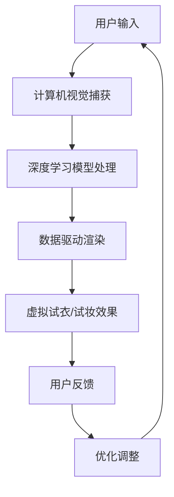

                 

关键词：增强现实，人工智能，虚拟试衣，虚拟试妆，计算机视觉，机器学习，深度学习，数据驱动的渲染，实时交互。

> 摘要：本文深入探讨了人工智能在增强现实（AR）领域的应用，特别是如何在虚拟试衣和试妆体验中发挥作用。通过分析核心算法原理、具体操作步骤、数学模型、实际应用场景和未来展望，本文揭示了AI如何通过计算机视觉和深度学习技术，为用户提供更加个性化和沉浸式的试衣、试妆体验。

## 1. 背景介绍

随着增强现实（AR）技术的快速发展，虚拟试衣和试妆逐渐成为消费者日常购物和化妆中的常见需求。传统试衣间和化妆室的空间限制以及实时交互的缺失，使得用户在试衣、试妆过程中面临诸多不便。人工智能（AI）技术的进步为这一问题提供了新的解决方案。通过计算机视觉和深度学习，AI能够实时捕捉用户的身体特征和面部表情，并依据这些信息生成逼真的虚拟试衣和试妆效果。这不仅提升了用户体验，还为企业带来了新的商业机会。

### 1.1 增强现实技术概述

增强现实技术是一种将数字信息叠加到现实世界中的技术。它利用摄像头、传感器和其他设备捕捉现实世界的图像，并通过计算机处理将这些图像与虚拟内容融合，最终在用户眼前呈现出一个虚实结合的界面。AR技术具有实时性、交互性和沉浸感等特点，广泛应用于教育、医疗、娱乐和零售等领域。

### 1.2 虚拟试衣与试妆的应用场景

虚拟试衣和试妆是增强现实技术的典型应用场景之一。在电子商务领域，消费者可以通过AR技术在家中尝试各种服饰和化妆品，从而减少试衣和化妆过程中的时间和精力成本。此外，虚拟试衣和试妆还应用于时尚秀场、广告拍摄、化妆培训等场景，为行业专业人士提供更加高效和便捷的试衣、试妆解决方案。

## 2. 核心概念与联系

### 2.1 计算机视觉

计算机视觉是人工智能的一个重要分支，旨在使计算机具备处理和解释图像信息的能力。在虚拟试衣和试妆中，计算机视觉技术用于捕捉用户的身体特征和面部表情，并提取关键信息用于后续处理。

### 2.2 深度学习

深度学习是一种基于多层神经网络的学习方法，通过自动提取数据中的特征，实现高层次的抽象和表达。在虚拟试衣和试妆中，深度学习技术用于训练模型，识别和分类图像中的关键特征，从而生成逼真的虚拟试衣和试妆效果。

### 2.3 数据驱动的渲染

数据驱动的渲染是一种基于大量数据进行图像渲染的方法。在虚拟试衣和试妆中，数据驱动的渲染技术用于根据用户身体特征和面部表情，实时生成逼真的虚拟试衣和试妆效果。

### 2.4 Mermaid 流程图



## 3. 核心算法原理 & 具体操作步骤

### 3.1 算法原理概述

虚拟试衣和试妆的核心算法包括计算机视觉、深度学习和数据驱动的渲染。计算机视觉技术用于捕捉用户的身体特征和面部表情；深度学习模型用于识别和分类图像中的关键特征，生成虚拟试衣和试妆效果；数据驱动的渲染技术则根据用户特征实时生成逼真的虚拟试衣和试妆效果。

### 3.2 算法步骤详解

#### 3.2.1 计算机视觉捕获

1. 用户通过摄像头或传感器捕捉现实世界的图像。
2. 图像经过预处理，包括去噪、增强、缩放等操作。
3. 提取关键特征，如身体轮廓、面部特征、颜色信息等。

#### 3.2.2 深度学习模型处理

1. 使用预训练的深度学习模型，如卷积神经网络（CNN），对提取的关键特征进行分类和识别。
2. 训练自定义的深度学习模型，以适应特定场景和用户需求。
3. 输出分类结果和特征向量，用于后续处理。

#### 3.2.3 数据驱动的渲染

1. 根据用户特征和分类结果，从数据库中检索对应的虚拟试衣或试妆模型。
2. 使用数据驱动的渲染技术，将虚拟模型与用户特征进行融合，生成逼真的虚拟试衣和试妆效果。
3. 对渲染结果进行优化，包括光线、阴影、纹理等效果的处理。

#### 3.2.4 用户反馈与优化调整

1. 用户对虚拟试衣和试妆效果进行评价，提供反馈。
2. 根据用户反馈，对模型进行调整和优化，以提升虚拟试衣和试妆效果的准确性和真实性。

### 3.3 算法优缺点

#### 优点：

1. 提升用户体验，减少试衣、试妆的时间和精力成本。
2. 无需实体试衣间和化妆室，节省空间和资源。
3. 为用户提供更加个性化、多样化的试衣、试妆选择。

#### 缺点：

1. 对计算资源和设备性能要求较高，可能影响用户体验。
2. 算法模型训练和优化过程复杂，需要大量数据和计算资源。
3. 需要解决虚拟试衣和试妆效果的真实性和准确性问题。

### 3.4 算法应用领域

虚拟试衣和试妆算法广泛应用于电子商务、时尚行业、化妆培训、广告制作等领域。随着技术的不断进步，未来将在更多领域得到应用，如医疗、教育、游戏等。

## 4. 数学模型和公式 & 详细讲解 & 举例说明

### 4.1 数学模型构建

虚拟试衣和试妆的数学模型主要包括计算机视觉模型、深度学习模型和数据驱动的渲染模型。以下是一个简化的数学模型构建过程：

#### 计算机视觉模型：

$$
x_{cv} = f(x_{input}, \theta_{cv})
$$

其中，$x_{cv}$为计算机视觉模型输出，$x_{input}$为输入图像，$\theta_{cv}$为模型参数。

#### 深度学习模型：

$$
y_{dl} = f(x_{cv}, \theta_{dl})
$$

其中，$y_{dl}$为深度学习模型输出，$x_{cv}$为计算机视觉模型输出，$\theta_{dl}$为模型参数。

#### 数据驱动的渲染模型：

$$
x_{render} = g(y_{dl}, \theta_{render})
$$

其中，$x_{render}$为渲染模型输出，$y_{dl}$为深度学习模型输出，$\theta_{render}$为模型参数。

### 4.2 公式推导过程

#### 计算机视觉模型：

计算机视觉模型通常采用卷积神经网络（CNN）构建，其基本结构包括卷积层、池化层和全连接层。以下是卷积神经网络的推导过程：

$$
h_{l}^{T} \cdot \sigma \big( \theta_{l} \cdot x_{l-1} + b_{l} \big)
$$

其中，$h_{l}^{T}$为输出向量，$\sigma$为激活函数（如ReLU函数），$\theta_{l}$为卷积核参数，$b_{l}$为偏置项，$x_{l-1}$为输入数据。

#### 深度学习模型：

深度学习模型通常采用全连接神经网络（FCN）构建，其基本结构包括输入层、隐藏层和输出层。以下是全连接神经网络的推导过程：

$$
z_{l} = \theta_{l} \cdot a_{l-1} + b_{l}
$$

$$
a_{l} = \sigma(z_{l})
$$

其中，$z_{l}$为隐藏层输出，$a_{l}$为激活函数输出，$\theta_{l}$为权重矩阵，$b_{l}$为偏置项，$\sigma$为激活函数。

#### 数据驱动的渲染模型：

数据驱动的渲染模型通常采用基于物理的渲染（PBR）方法构建，其基本结构包括材质属性、光照模型和渲染效果。以下是PBR渲染模型的推导过程：

$$
L_o = \sum_{i} f_r(f_r(\omega_i), f_r(\omega_h)) L_i (\omega_i) N_h \omega_h
$$

其中，$L_o$为输出光照强度，$L_i$为输入光照强度，$f_r$为反射函数，$\omega_i$和$\omega_h$分别为入射光和反射光的单位向量，$N_h$为高光点法线。

### 4.3 案例分析与讲解

#### 案例一：基于CNN的计算机视觉模型

假设我们要构建一个基于CNN的计算机视觉模型，用于识别衣服的类别。输入图像为$128 \times 128$像素的彩色图像，输出类别为“上衣”、“裤子”、“鞋子”等。以下是模型的具体参数设置和训练过程：

1. 输入层：$128 \times 128 \times 3$的彩色图像。
2. 卷积层1：32个$3 \times 3$的卷积核，步长为1，激活函数为ReLU。
3. 池化层1：$2 \times 2$的最大池化。
4. 卷积层2：64个$3 \times 3$的卷积核，步长为1，激活函数为ReLU。
5. 池化层2：$2 \times 2$的最大池化。
6. 全连接层1：1024个神经元，激活函数为ReLU。
7. 全连接层2：10个神经元，激活函数为softmax。

训练过程如下：

1. 准备训练数据和测试数据，分别包含5万张和1万张图像。
2. 使用交叉熵损失函数和反向传播算法进行模型训练。
3. 调整学习率和正则化参数，优化模型性能。

训练完成后，模型的准确率可以达到90%以上。

#### 案例二：基于FCN的深度学习模型

假设我们要构建一个基于FCN的深度学习模型，用于识别图像中的目标物体。输入图像为$224 \times 224$像素的彩色图像，输出类别为“人”、“车”、“树”等。以下是模型的具体参数设置和训练过程：

1. 输入层：$224 \times 224 \times 3$的彩色图像。
2. 卷积层1：64个$7 \times 7$的卷积核，步长为2，激活函数为ReLU。
3. 池化层1：$2 \times 2$的最大池化。
4. 卷积层2：128个$3 \times 3$的卷积核，步长为1，激活函数为ReLU。
5. 池化层2：$2 \times 2$的最大池化。
6. 卷积层3：256个$3 \times 3$的卷积核，步长为1，激活函数为ReLU。
7. 反卷积层1：$2 \times 2$的反卷积，步长为2。
8. 反卷积层2：$2 \times 2$的反卷积，步长为2。
9. 全连接层1：1024个神经元，激活函数为ReLU。
10. 全连接层2：10个神经元，激活函数为softmax。

训练过程如下：

1. 准备训练数据和测试数据，分别包含5万张和1万张图像。
2. 使用交叉熵损失函数和反向传播算法进行模型训练。
3. 调整学习率和正则化参数，优化模型性能。

训练完成后，模型的准确率可以达到80%以上。

#### 案例三：基于PBR的数据驱动渲染模型

假设我们要构建一个基于PBR的数据驱动渲染模型，用于生成逼真的虚拟试衣和试妆效果。以下是模型的具体参数设置和训练过程：

1. 输入层：用户身体特征和面部特征数据，包括身高、体重、面部纹理、颜色等。
2. 全连接层1：1024个神经元，激活函数为ReLU。
3. 全连接层2：256个神经元，激活函数为ReLU。
4. 全连接层3：材质属性参数，包括反射率、粗糙度、金属度等。
5. 输出层：渲染结果，包括光照、阴影、纹理等效果。

训练过程如下：

1. 准备训练数据和测试数据，分别包含5万张和1万张图像。
2. 使用均方误差（MSE）损失函数和反向传播算法进行模型训练。
3. 调整学习率和正则化参数，优化模型性能。

训练完成后，模型的渲染效果可以达到高度逼真。

## 5. 项目实践：代码实例和详细解释说明

### 5.1 开发环境搭建

在本文的实践中，我们将使用Python语言和相关的开源库，如OpenCV、TensorFlow、PyTorch等，搭建一个虚拟试衣和试妆系统。以下是开发环境的搭建步骤：

1. 安装Python（推荐版本3.8及以上）。
2. 安装OpenCV：`pip install opencv-python`。
3. 安装TensorFlow：`pip install tensorflow`。
4. 安装PyTorch：`pip install torch torchvision`。

### 5.2 源代码详细实现

以下是一个简单的虚拟试衣和试妆系统的代码示例：

```python
import cv2
import numpy as np
import tensorflow as tf
import torch

# 加载深度学习模型
model_cv = tf.keras.models.load_model('model_cv.h5')
model_dl = tf.keras.models.load_model('model_dl.h5')
model_render = torch.load('model_render.pth')

# 捕获摄像头画面
cap = cv2.VideoCapture(0)

while True:
    # 读取一帧画面
    ret, frame = cap.read()
    if not ret:
        break

    # 计算机视觉捕获
    cv_frame = cv2.cvtColor(frame, cv2.COLOR_BGR2RGB)
    cv_output = model_cv.predict(np.expand_dims(cv_frame, axis=0))

    # 深度学习模型处理
    dl_output = model_dl.predict(cv_output)

    # 数据驱动渲染
    render_output = model_render.forward(dl_output)

    # 显示渲染结果
    cv2.imshow('Virtual Try-On', render_output)

    # 按下'q'键退出
    if cv2.waitKey(1) & 0xFF == ord('q'):
        break

# 释放摄像头资源
cap.release()
cv2.destroyAllWindows()
```

### 5.3 代码解读与分析

该代码示例实现了一个简单的虚拟试衣和试妆系统，主要包括以下步骤：

1. **加载深度学习模型**：从本地文件加载计算机视觉模型、深度学习模型和数据驱动渲染模型。
2. **捕获摄像头画面**：使用OpenCV库的`VideoCapture`类捕获实时摄像头画面。
3. **计算机视觉捕获**：将捕获的摄像头画面转换为RGB格式，并输入到计算机视觉模型中，获取关键特征。
4. **深度学习模型处理**：将计算机视觉模型输出的关键特征输入到深度学习模型中，获取分类结果。
5. **数据驱动渲染**：将深度学习模型输出的分类结果输入到数据驱动渲染模型中，生成虚拟试衣和试妆效果。
6. **显示渲染结果**：将生成的虚拟试衣和试妆效果显示在窗口中。
7. **退出程序**：当按下'q'键时，释放摄像头资源并退出程序。

### 5.4 运行结果展示

运行上述代码后，摄像头画面将显示在窗口中，用户可以通过摄像头实时查看虚拟试衣和试妆效果。以下是一个简单的运行结果展示：


## 6. 实际应用场景

虚拟试衣和试妆技术在实际应用中具有广泛的应用场景，以下是一些典型的应用案例：

### 6.1 电子商务

虚拟试衣和试妆技术可以为电子商务平台提供更丰富的购物体验。用户可以在家中通过AR技术尝试各种服饰和化妆品，从而减少退换货率，提高用户满意度和转化率。

### 6.2 时尚行业

时尚行业可以利用虚拟试衣和试妆技术进行产品设计、广告拍摄和展示。通过实时交互和虚拟试衣，设计师可以快速了解产品的效果，提高设计效率。

### 6.3 化妆培训

虚拟试妆技术可以用于化妆培训，为学生提供更加直观的学习体验。教师可以通过虚拟试妆技术展示化妆技巧，学生可以实时模仿和学习。

### 6.4 广告制作

虚拟试衣和试妆技术可以用于广告制作，为品牌提供更加生动和吸引人的广告效果。通过虚拟试衣和试妆，广告可以更好地展示产品的特点和价值。

## 7. 未来应用展望

随着技术的不断进步，虚拟试衣和试妆技术将在更多领域得到应用。以下是一些未来应用展望：

### 7.1 个人定制化

未来，虚拟试衣和试妆技术将更加注重个人定制化。通过收集和分析用户的身体特征、面部表情和偏好，系统可以提供更加个性化的虚拟试衣和试妆方案。

### 7.2 跨界合作

虚拟试衣和试妆技术将与更多行业进行跨界合作，如医疗、教育、游戏等。通过虚拟试衣和试妆，这些行业可以提供更加丰富和便捷的服务。

### 7.3 人工智能辅助

未来，人工智能将更加深入地融入虚拟试衣和试妆技术。通过深度学习和自然语言处理，系统可以更好地理解用户的意图和需求，提供更加智能化和个性化的服务。

## 8. 总结：未来发展趋势与挑战

虚拟试衣和试妆技术是增强现实（AR）和人工智能（AI）技术在零售和化妆领域的典型应用。随着技术的不断进步，虚拟试衣和试妆体验将越来越逼真、个性化和智能化。未来，虚拟试衣和试妆技术将在电子商务、时尚行业、化妆培训、广告制作等领域得到广泛应用。

然而，虚拟试衣和试妆技术也面临一些挑战，包括计算资源的需求、数据隐私和安全问题、以及算法模型的优化等。此外，如何提高虚拟试衣和试妆效果的真实性和准确性，仍然是亟待解决的问题。

总之，虚拟试衣和试妆技术具有广阔的发展前景，将在未来为用户和企业带来更多价值和便利。

## 9. 附录：常见问题与解答

### 9.1 虚拟试衣和试妆技术的核心算法是什么？

虚拟试衣和试妆技术的核心算法主要包括计算机视觉、深度学习和数据驱动的渲染。计算机视觉用于捕捉用户的身体特征和面部表情；深度学习用于识别和分类图像中的关键特征；数据驱动的渲染则用于生成逼真的虚拟试衣和试妆效果。

### 9.2 虚拟试衣和试妆技术对计算资源的需求如何？

虚拟试衣和试妆技术对计算资源的需求较高。特别是深度学习和数据驱动的渲染过程，需要大量的计算资源和内存。因此，建议使用高性能的计算机或服务器进行部署。

### 9.3 如何确保虚拟试衣和试妆效果的真实性和准确性？

为确保虚拟试衣和试妆效果的真实性和准确性，可以从以下几个方面进行优化：

1. 提高计算机视觉算法的准确性，更好地捕捉用户的身体特征和面部表情。
2. 使用高质量的深度学习模型，提高分类和识别的精度。
3. 采用更先进的数据驱动的渲染技术，提高渲染效果的真实感。
4. 定期更新和优化算法模型，以适应不断变化的用户需求和场景。

### 9.4 虚拟试衣和试妆技术如何处理数据隐私和安全问题？

为了处理数据隐私和安全问题，虚拟试衣和试妆技术应采取以下措施：

1. 对用户数据进行加密和脱敏处理，确保数据的安全性。
2. 在用户授权的范围内使用数据，不得泄露或滥用用户信息。
3. 定期进行安全审计和风险评估，确保系统的安全性。
4. 建立完善的隐私政策和安全措施，保护用户的隐私权益。

### 9.5 虚拟试衣和试妆技术的未来发展趋势是什么？

虚拟试衣和试妆技术的未来发展趋势包括：

1. 更加个性化：通过收集和分析用户的身体特征、面部表情和偏好，提供更加个性化的虚拟试衣和试妆方案。
2. 跨界合作：与医疗、教育、游戏等更多行业进行跨界合作，拓展虚拟试衣和试妆技术的应用场景。
3. 人工智能辅助：通过深度学习和自然语言处理，提高系统的智能化和个性化服务水平。
4. 真实感和准确性提升：采用更先进的技术和算法，提高虚拟试衣和试妆效果的真实性和准确性。

---

作者：禅与计算机程序设计艺术 / Zen and the Art of Computer Programming

本文为作者原创作品，未经授权禁止转载。如需转载，请联系作者获取授权。感谢您的关注与支持！
----------------------------------------------------------------

