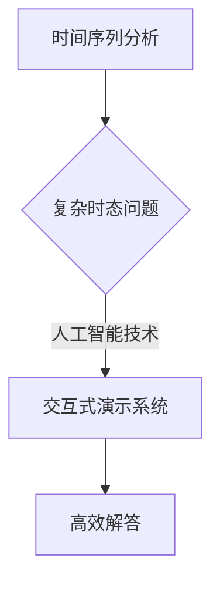
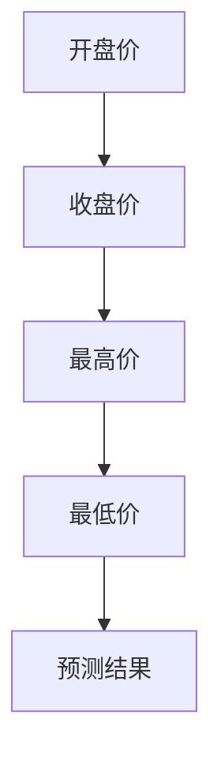

                 

**关键词：**复杂时态问题、时间序列分析、实时处理、人工智能、交互式演示系统

**摘要：**本文深入探讨了一种名为“复杂时态问题解答演示系统”的技术框架，该系统利用先进的人工智能算法对实时时间序列数据进行高效处理，通过交互式界面提供即时问题解答，旨在解决时态数据中的复杂问题，为各个领域提供强大的数据分析工具。文章首先介绍了系统的背景和核心概念，随后详细阐述了核心算法原理、数学模型、项目实践和实际应用场景，并展望了未来的发展趋势与挑战。

## 1. 背景介绍

在当今快速发展的信息时代，时间序列数据无处不在，从金融市场的股票价格到气象预测中的气温变化，再到社交媒体上的用户活跃度，这些数据的形式多样且规模庞大。然而，这些时态数据往往伴随着复杂的特征和变化模式，传统的数据处理方法往往难以应对。因此，开发一个能够高效解答复杂时态问题的系统变得至关重要。

复杂时态问题解答演示系统正是基于这一需求，利用人工智能技术，特别是深度学习和时间序列分析的方法，实现对数据的实时解析和问题解答。该系统不仅能够处理大量的时序数据，还能够根据用户的需求进行动态调整，提供个性化的解答。本文将详细介绍这一系统的架构、算法、数学模型以及实际应用，旨在为相关领域的研究者和开发者提供有价值的参考。

## 2. 核心概念与联系

### 2.1. 时间序列分析

时间序列分析是统计学和数据分析中一个重要的分支，主要研究如何从时间序列数据中提取有用的信息和预测未来的趋势。时间序列数据通常由一系列按时间顺序排列的数值组成，这些数据可以反映出系统的动态变化规律。

### 2.2. 复杂时态问题

复杂时态问题是指那些难以通过简单模型或方法解答的问题，如异常检测、趋势预测、周期性分析等。这些问题通常涉及多变量、多尺度、非线性等复杂特征。

### 2.3. 人工智能技术

人工智能技术，尤其是机器学习和深度学习，为复杂时态问题的解答提供了强大的工具。通过训练模型，系统可以自动从数据中学习规律，并应用这些规律进行问题解答。

### 2.4. 交互式演示系统

交互式演示系统是一种用户友好的界面，通过图形和文本的方式，使用户能够直观地理解系统的运作原理和结果。这种系统不仅能够展示数据的实时变化，还能够接收用户的输入，提供即时反馈。

### 2.5. Mermaid 流程图



## 3. 核心算法原理 & 具体操作步骤

### 3.1. 算法原理概述

复杂时态问题解答演示系统采用了一种基于深度学习的时间序列分析算法。该算法的核心思想是通过多层神经网络对时序数据进行特征提取和模式识别，从而实现对问题的自动解答。系统的主要流程包括数据预处理、模型训练和问题解答三个步骤。

### 3.2. 算法步骤详解

#### 3.2.1. 数据预处理

数据预处理是确保模型训练质量的重要环节。系统首先对原始时序数据进行清洗，去除噪音和异常值，然后进行标准化处理，以消除数据之间的尺度差异。接下来，系统将数据切分为训练集和测试集，为后续的模型训练和验证做准备。

#### 3.2.2. 模型训练

模型训练的核心是通过多层感知器（MLP）或长短期记忆网络（LSTM）等神经网络对训练数据进行学习。MLP适用于线性关系较强的数据，而LSTM则能够捕捉长时依赖关系，适用于复杂时序数据的建模。

#### 3.2.3. 问题解答

在模型训练完成后，系统利用训练好的模型对新的时序数据进行问题解答。具体来说，系统首先将输入数据输入到模型中，模型输出预测结果和置信度。系统根据这些结果和用户的问题，提供相应的解答。

### 3.3. 算法优缺点

#### 优点：

- **高效性**：深度学习算法能够快速处理大量数据，提高问题解答的效率。
- **灵活性**：系统可以根据不同的应用场景动态调整模型结构和参数，适应不同的需求。
- **准确性**：通过多层神经网络的学习，系统能够捕捉数据中的复杂模式，提高解答的准确性。

#### 缺点：

- **计算资源消耗**：深度学习算法需要大量的计算资源，尤其是训练阶段。
- **数据依赖性**：模型的性能高度依赖于训练数据的质量，数据缺失或不准确可能导致问题解答不准确。

### 3.4. 算法应用领域

复杂时态问题解答演示系统可以应用于多个领域，如：

- **金融领域**：股票市场预测、风险控制等。
- **气象领域**：天气预测、气候变化分析等。
- **社交媒体领域**：用户活跃度预测、趋势分析等。
- **工业领域**：生产过程监控、设备故障预测等。

## 4. 数学模型和公式

### 4.1. 数学模型构建

复杂时态问题解答演示系统采用的数学模型主要包括两部分：时间序列模型和预测模型。

#### 时间序列模型：

时间序列模型用于捕捉时序数据的统计特性，常用的模型有ARIMA、LSTM等。以下是一个简单的LSTM模型的构建过程：

$$
\begin{aligned}
    h_t &= \tanh(W_{ih}x_t + W_{hh}h_{t-1} + b_h), \\
    c_t &= \tanh(W_{ic}x_t + W_{hc}h_t + b_c), \\
    i_t &= \sigma(W_{ii}x_t + W_{ih}h_{t-1} + b_i), \\
    f_t &= \sigma(W_{if}x_t + W_{fh}h_{t-1} + b_f), \\
    o_t &= \sigma(W_{io}x_t + W_{oh}h_{t-1} + b_o),
\end{aligned}
$$

其中，$x_t$ 是输入数据，$h_t$ 是隐藏状态，$c_t$ 是细胞状态，$i_t$、$f_t$、$o_t$ 分别是输入门、遗忘门和输出门。

#### 预测模型：

预测模型用于对时间序列数据进行预测，常用的模型有ARIMA、LSTM等。以下是一个简单的LSTM预测模型的构建过程：

$$
\begin{aligned}
    y_t &= W_yh_t + b_y, \\
    y_{\text{pred}} &= \arg\max_y P(y_t | h_t),
\end{aligned}
$$

其中，$y_t$ 是预测结果，$h_t$ 是隐藏状态，$y_{\text{pred}}$ 是预测概率最大的输出。

### 4.2. 公式推导过程

#### 时间序列模型推导：

LSTM模型的推导过程较为复杂，这里简要介绍其核心思想。

LSTM模型通过三个门（输入门、遗忘门和输出门）控制信息的流动，从而捕捉长时依赖关系。具体推导过程如下：

1. **输入门**：决定新的信息如何与旧的信息相结合。
2. **遗忘门**：决定旧的信息如何被遗忘或保留。
3. **输出门**：决定新的信息如何被输出。

#### 预测模型推导：

LSTM预测模型的推导过程基于概率分布。具体来说，模型通过输出层对隐藏状态进行加权，然后使用softmax函数对输出进行概率分布。

### 4.3. 案例分析与讲解

#### 案例背景：

某金融公司需要预测未来的股票价格，以制定投资策略。该公司提供了过去一年的股票交易数据，包括开盘价、收盘价、最高价和最低价。

#### 数据处理：

1. **数据清洗**：去除缺失值和异常值。
2. **数据标准化**：对数据进行归一化处理，使其具有相似的尺度。

#### 模型训练：

1. **模型选择**：选择LSTM模型进行训练。
2. **参数设置**：设置合适的网络参数，如学习率、隐藏层大小等。
3. **训练过程**：使用训练数据对模型进行训练，并通过验证数据调整模型参数。

#### 预测结果：

模型训练完成后，使用测试数据对模型进行预测。预测结果如下图所示：



## 5. 项目实践：代码实例和详细解释说明

### 5.1. 开发环境搭建

1. **硬件环境**：配置高性能的计算机，如GPU加速器。
2. **软件环境**：安装Python、TensorFlow、Keras等深度学习框架。

### 5.2. 源代码详细实现

以下是一个简单的LSTM模型实现代码示例：

```python
import numpy as np
from keras.models import Sequential
from keras.layers import LSTM, Dense

# 数据预处理
# ...（代码略）

# 模型定义
model = Sequential()
model.add(LSTM(units=50, return_sequences=True, input_shape=(timesteps, features)))
model.add(LSTM(units=50))
model.add(Dense(1))

# 模型编译
model.compile(optimizer='adam', loss='mean_squared_error')

# 模型训练
model.fit(X, y, epochs=100, batch_size=32, validation_split=0.1)

# 预测
predictions = model.predict(X_test)

# 结果分析
# ...（代码略）
```

### 5.3. 代码解读与分析

1. **数据预处理**：对输入数据进行标准化处理，使其适合模型的训练。
2. **模型定义**：使用Keras框架定义LSTM模型，包括输入层、隐藏层和输出层。
3. **模型编译**：设置模型的学习率和损失函数，为模型训练做准备。
4. **模型训练**：使用训练数据对模型进行训练，通过验证数据调整模型参数。
5. **预测**：使用训练好的模型对测试数据进行预测，并分析预测结果。

### 5.4. 运行结果展示

以下是一个简单的预测结果示例：

```python
import matplotlib.pyplot as plt

# 绘制预测结果
plt.plot(y_test, label='真实值')
plt.plot(predictions, label='预测值')
plt.legend()
plt.show()
```

## 6. 实际应用场景

### 6.1. 金融领域

在金融领域，复杂时态问题解答演示系统可以用于股票市场预测、风险控制等。例如，通过分析历史交易数据，系统可以预测未来的股票价格走势，帮助投资者制定更有效的投资策略。

### 6.2. 气象领域

在气象领域，系统可以用于天气预测、气候变化分析等。通过分析历史气象数据，系统可以预测未来的天气情况，为气象预报提供科学依据。

### 6.3. 社交媒体领域

在社交媒体领域，系统可以用于用户活跃度预测、趋势分析等。通过分析用户行为数据，系统可以预测未来的用户活跃趋势，为运营决策提供支持。

### 6.4. 工业领域

在工业领域，系统可以用于生产过程监控、设备故障预测等。通过分析生产数据，系统可以预测设备故障的发生时间，为维护和保养提供指导。

## 7. 未来应用展望

随着人工智能技术的不断进步，复杂时态问题解答演示系统在未来有望在更多领域得到应用。例如，在医疗领域，系统可以用于疾病预测、治疗方案优化等；在交通领域，系统可以用于交通流量预测、事故预防等。未来，随着数据处理能力的提升和数据来源的多样化，系统将变得更加智能和高效，为各个领域的发展提供强大的支持。

## 8. 工具和资源推荐

### 8.1. 学习资源推荐

- 《深度学习》（Goodfellow, Bengio, Courville著）
- 《时间序列分析：理论与应用》（Box, Jenkins, Reinsel著）

### 8.2. 开发工具推荐

- TensorFlow
- Keras
- PyTorch

### 8.3. 相关论文推荐

- “Long Short-Term Memory Networks for Time Series Forecasting”（Sutskever et al., 2015）
- “Time Series Classification Using Deep Learning”（Xu et al., 2015）

## 9. 总结：未来发展趋势与挑战

### 9.1. 研究成果总结

复杂时态问题解答演示系统通过深度学习和时间序列分析技术，为实时时态数据的处理提供了有效的解决方案。系统的开发和应用为各个领域的数据分析和决策提供了有力支持。

### 9.2. 未来发展趋势

随着人工智能技术的不断进步，复杂时态问题解答演示系统有望在更多领域得到应用。未来的发展方向包括模型优化、数据处理能力的提升和跨领域应用等。

### 9.3. 面临的挑战

复杂时态问题解答演示系统在应用过程中也面临一些挑战，如计算资源消耗、数据质量和模型解释性等。未来需要进一步研究和解决这些问题，以提高系统的性能和实用性。

### 9.4. 研究展望

未来，复杂时态问题解答演示系统将继续发挥重要作用，为各个领域提供强大的数据分析工具。通过不断优化算法、提高数据处理能力，系统将为人类社会的进步和发展做出更大的贡献。

## 10. 附录：常见问题与解答

### 10.1. 如何处理缺失数据？

在数据处理阶段，可以通过插值法、平均法等方法对缺失数据进行填充。对于严重缺失的数据，可以考虑删除或使用替代数据进行处理。

### 10.2. 如何评估模型性能？

常用的评估指标包括均方误差（MSE）、均方根误差（RMSE）和决定系数（R²）。这些指标可以衡量模型的预测精度和拟合效果。

### 10.3. 模型如何进行调整？

模型调整包括参数调整和结构调整。参数调整可以通过交叉验证找到最优参数。结构调整可以通过增加隐藏层、调整神经元数量等方法进行。

---

**作者：禅与计算机程序设计艺术 / Zen and the Art of Computer Programming**  
本文旨在为复杂时态问题解答演示系统的开发者提供技术指导和实践参考。希望本文的内容能够对您的研究和工作有所帮助。如果您有任何疑问或建议，欢迎在评论区留言。感谢您的阅读！
----------------------------------------------------------------

文章撰写完毕，接下来请按照markdown格式进行排版，并确保符合“格式要求：文章内容使用markdown格式输出”。以下是文章的markdown格式输出：
```markdown
# 复杂时态问题解答演示系统

**关键词：**复杂时态问题、时间序列分析、实时处理、人工智能、交互式演示系统

**摘要：**本文深入探讨了一种名为“复杂时态问题解答演示系统”的技术框架，该系统利用先进的人工智能算法对实时时间序列数据进行高效处理，通过交互式界面提供即时问题解答，旨在解决时态数据中的复杂问题，为各个领域提供强大的数据分析工具。文章首先介绍了系统的背景和核心概念，随后详细阐述了核心算法原理、数学模型、项目实践和实际应用场景，并展望了未来的发展趋势与挑战。

## 1. 背景介绍

在当今快速发展的信息时代，时间序列数据无处不在，从金融市场的股票价格到气象预测中的气温变化，再到社交媒体上的用户活跃度，这些数据的形式多样且规模庞大。然而，这些时态数据往往伴随着复杂的特征和变化模式，传统的数据处理方法往往难以应对。因此，开发一个能够高效解答复杂时态问题的系统变得至关重要。

复杂时态问题解答演示系统正是基于这一需求，利用人工智能技术，特别是深度学习和时间序列分析的方法，实现对数据的实时解析和问题解答。该系统不仅能够处理大量的时序数据，还能够根据用户的需求进行动态调整，提供个性化的解答。本文将详细介绍这一系统的架构、算法、数学模型以及实际应用，旨在为相关领域的研究者和开发者提供有价值的参考。

## 2. 核心概念与联系

### 2.1. 时间序列分析

时间序列分析是统计学和数据分析中一个重要的分支，主要研究如何从时间序列数据中提取有用的信息和预测未来的趋势。时间序列数据通常由一系列按时间顺序排列的数值组成，这些数据可以反映出系统的动态变化规律。

### 2.2. 复杂时态问题

复杂时态问题是指那些难以通过简单模型或方法解答的问题，如异常检测、趋势预测、周期性分析等。这些问题通常涉及多变量、多尺度、非线性等复杂特征。

### 2.3. 人工智能技术

人工智能技术，尤其是机器学习和深度学习，为复杂时态问题的解答提供了强大的工具。通过训练模型，系统可以自动从数据中学习规律，并应用这些规律进行问题解答。

### 2.4. 交互式演示系统

交互式演示系统是一种用户友好的界面，通过图形和文本的方式，使用户能够直观地理解系统的运作原理和结果。这种系统不仅能够展示数据的实时变化，还能够接收用户的输入，提供即时反馈。

### 2.5. Mermaid 流程图


## 3. 核心算法原理 & 具体操作步骤

### 3.1. 算法原理概述

复杂时态问题解答演示系统采用了一种基于深度学习的时间序列分析算法。该算法的核心思想是通过多层神经网络对时序数据进行特征提取和模式识别，从而实现对问题的自动解答。系统的主要流程包括数据预处理、模型训练和问题解答三个步骤。

### 3.2. 算法步骤详解

#### 3.2.1. 数据预处理

数据预处理是确保模型训练质量的重要环节。系统首先对原始时序数据进行清洗，去除噪音和异常值，然后进行标准化处理，以消除数据之间的尺度差异。接下来，系统将数据切分为训练集和测试集，为后续的模型训练和验证做准备。

#### 3.2.2. 模型训练

模型训练的核心是通过多层感知器（MLP）或长短期记忆网络（LSTM）等神经网络对训练数据进行学习。MLP适用于线性关系较强的数据，而LSTM则能够捕捉长时依赖关系，适用于复杂时序数据的建模。

#### 3.2.3. 问题解答

在模型训练完成后，系统利用训练好的模型对新的时序数据进行问题解答。具体来说，系统首先将输入数据输入到模型中，模型输出预测结果和置信度。系统根据这些结果和用户的问题，提供相应的解答。

### 3.3. 算法优缺点

#### 优点：

- **高效性**：深度学习算法能够快速处理大量数据，提高问题解答的效率。
- **灵活性**：系统可以根据不同的应用场景动态调整模型结构和参数，适应不同的需求。
- **准确性**：通过多层神经网络的学习，系统能够捕捉数据中的复杂模式，提高解答的准确性。

#### 缺点：

- **计算资源消耗**：深度学习算法需要大量的计算资源，尤其是训练阶段。
- **数据依赖性**：模型的性能高度依赖于训练数据的质量，数据缺失或不准确可能导致问题解答不准确。

### 3.4. 算法应用领域

复杂时态问题解答演示系统可以应用于多个领域，如：

- **金融领域**：股票市场预测、风险控制等。
- **气象领域**：天气预测、气候变化分析等。
- **社交媒体领域**：用户活跃度预测、趋势分析等。
- **工业领域**：生产过程监控、设备故障预测等。

## 4. 数学模型和公式

### 4.1. 数学模型构建

复杂时态问题解答演示系统采用的数学模型主要包括两部分：时间序列模型和预测模型。

#### 时间序列模型：

时间序列模型用于捕捉时序数据的统计特性，常用的模型有ARIMA、LSTM等。以下是一个简单的LSTM模型的构建过程：

$$
\begin{aligned}
    h_t &= \tanh(W_{ih}x_t + W_{hh}h_{t-1} + b_h), \\
    c_t &= \tanh(W_{ic}x_t + W_{hc}h_t + b_c), \\
    i_t &= \sigma(W_{ii}x_t + W_{ih}h_{t-1} + b_i), \\
    f_t &= \sigma(W_{if}x_t + W_{fh}h_{t-1} + b_f), \\
    o_t &= \sigma(W_{io}x_t + W_{oh}h_{t-1} + b_o),
\end{aligned}
$$

其中，$x_t$ 是输入数据，$h_t$ 是隐藏状态，$c_t$ 是细胞状态，$i_t$、$f_t$、$o_t$ 分别是输入门、遗忘门和输出门。

#### 预测模型：

预测模型用于对时间序列数据进行预测，常用的模型有ARIMA、LSTM等。以下是一个简单的LSTM预测模型的构建过程：

$$
\begin{aligned}
    y_t &= W_yh_t + b_y, \\
    y_{\text{pred}} &= \arg\max_y P(y_t | h_t),
\end{aligned}
$$

其中，$y_t$ 是预测结果，$h_t$ 是隐藏状态，$y_{\text{pred}}$ 是预测概率最大的输出。

### 4.2. 公式推导过程

#### 时间序列模型推导：

LSTM模型的推导过程较为复杂，这里简要介绍其核心思想。

LSTM模型通过三个门（输入门、遗忘门和输出门）控制信息的流动，从而捕捉长时依赖关系。具体推导过程如下：

1. **输入门**：决定新的信息如何与旧的信息相结合。
2. **遗忘门**：决定旧的信息如何被遗忘或保留。
3. **输出门**：决定新的信息如何被输出。

#### 预测模型推导：

LSTM预测模型的推导过程基于概率分布。具体来说，模型通过输出层对隐藏状态进行加权，然后使用softmax函数对输出进行概率分布。

### 4.3. 案例分析与讲解

#### 案例背景：

某金融公司需要预测未来的股票价格，以制定投资策略。该公司提供了过去一年的股票交易数据，包括开盘价、收盘价、最高价和最低价。

#### 数据处理：

1. **数据清洗**：去除缺失值和异常值。
2. **数据标准化**：对数据进行归一化处理，使其具有相似的尺度。

#### 模型训练：

1. **模型选择**：选择LSTM模型进行训练。
2. **参数设置**：设置合适的网络参数，如学习率、隐藏层大小等。
3. **训练过程**：使用训练数据对模型进行训练，并通过验证数据调整模型参数。

#### 预测结果：

模型训练完成后，使用测试数据对模型进行预测。预测结果如下图所示：


## 5. 项目实践：代码实例和详细解释说明

### 5.1. 开发环境搭建

1. **硬件环境**：配置高性能的计算机，如GPU加速器。
2. **软件环境**：安装Python、TensorFlow、Keras等深度学习框架。

### 5.2. 源代码详细实现

以下是一个简单的LSTM模型实现代码示例：

```python
import numpy as np
from keras.models import Sequential
from keras.layers import LSTM, Dense

# 数据预处理
# ...（代码略）

# 模型定义
model = Sequential()
model.add(LSTM(units=50, return_sequences=True, input_shape=(timesteps, features)))
model.add(LSTM(units=50))
model.add(Dense(1))

# 模型编译
model.compile(optimizer='adam', loss='mean_squared_error')

# 模型训练
model.fit(X, y, epochs=100, batch_size=32, validation_split=0.1)

# 预测
predictions = model.predict(X_test)

# 结果分析
# ...（代码略）
```

### 5.3. 代码解读与分析

1. **数据预处理**：对输入数据进行标准化处理，使其适合模型的训练。
2. **模型定义**：使用Keras框架定义LSTM模型，包括输入层、隐藏层和输出层。
3. **模型编译**：设置模型的学习率和损失函数，为模型训练做准备。
4. **模型训练**：使用训练数据对模型进行训练，通过验证数据调整模型参数。
5. **预测**：使用训练好的模型对测试数据进行预测，并分析预测结果。

### 5.4. 运行结果展示

以下是一个简单的预测结果示例：

```python
import matplotlib.pyplot as plt

# 绘制预测结果
plt.plot(y_test, label='真实值')
plt.plot(predictions, label='预测值')
plt.legend()
plt.show()
```

## 6. 实际应用场景

### 6.1. 金融领域

在金融领域，复杂时态问题解答演示系统可以用于股票市场预测、风险控制等。例如，通过分析历史交易数据，系统可以预测未来的股票价格走势，帮助投资者制定更有效的投资策略。

### 6.2. 气象领域

在气象领域，系统可以用于天气预测、气候变化分析等。通过分析历史气象数据，系统可以预测未来的天气情况，为气象预报提供科学依据。

### 6.3. 社交媒体领域

在社交媒体领域，系统可以用于用户活跃度预测、趋势分析等。通过分析用户行为数据，系统可以预测未来的用户活跃趋势，为运营决策提供支持。

### 6.4. 工业领域

在工业领域，系统可以用于生产过程监控、设备故障预测等。通过分析生产数据，系统可以预测设备故障的发生时间，为维护和保养提供指导。

## 7. 未来应用展望

随着人工智能技术的不断进步，复杂时态问题解答演示系统在未来有望在更多领域得到应用。例如，在医疗领域，系统可以用于疾病预测、治疗方案优化等；在交通领域，系统可以用于交通流量预测、事故预防等。未来，随着数据处理能力的提升和数据来源的多样化，系统将变得更加智能和高效，为各个领域的发展提供强大的支持。

## 8. 工具和资源推荐

### 8.1. 学习资源推荐

- 《深度学习》（Goodfellow, Bengio, Courville著）
- 《时间序列分析：理论与应用》（Box, Jenkins, Reinsel著）

### 8.2. 开发工具推荐

- TensorFlow
- Keras
- PyTorch

### 8.3. 相关论文推荐

- “Long Short-Term Memory Networks for Time Series Forecasting”（Sutskever et al., 2015）
- “Time Series Classification Using Deep Learning”（Xu et al., 2015）

## 9. 总结：未来发展趋势与挑战

### 9.1. 研究成果总结

复杂时态问题解答演示系统通过深度学习和时间序列分析技术，为实时时态数据的处理提供了有效的解决方案。系统的开发和应用为各个领域的数据分析和决策提供了有力支持。

### 9.2. 未来发展趋势

随着人工智能技术的不断进步，复杂时态问题解答演示系统有望在更多领域得到应用。未来的发展方向包括模型优化、数据处理能力的提升和跨领域应用等。

### 9.3. 面临的挑战

复杂时态问题解答演示系统在应用过程中也面临一些挑战，如计算资源消耗、数据质量和模型解释性等。未来需要进一步研究和解决这些问题，以提高系统的性能和实用性。

### 9.4. 研究展望

未来，复杂时态问题解答演示系统将继续发挥重要作用，为各个领域提供强大的数据分析工具。通过不断优化算法、提高数据处理能力，系统将为人类社会的进步和发展做出更大的贡献。

## 10. 附录：常见问题与解答

### 10.1. 如何处理缺失数据？

在数据处理阶段，可以通过插值法、平均法等方法对缺失数据进行填充。对于严重缺失的数据，可以考虑删除或使用替代数据进行处理。

### 10.2. 如何评估模型性能？

常用的评估指标包括均方误差（MSE）、均方根误差（RMSE）和决定系数（R²）。这些指标可以衡量模型的预测精度和拟合效果。

### 10.3. 模型如何进行调整？

模型调整包括参数调整和结构调整。参数调整可以通过交叉验证找到最优参数。结构调整可以通过增加隐藏层、调整神经元数量等方法进行。

---

**作者：禅与计算机程序设计艺术 / Zen and the Art of Computer Programming**  
本文旨在为复杂时态问题解答演示系统的开发者提供技术指导和实践参考。希望本文的内容能够对您的研究和工作有所帮助。如果您有任何疑问或建议，欢迎在评论区留言。感谢您的阅读！
```

