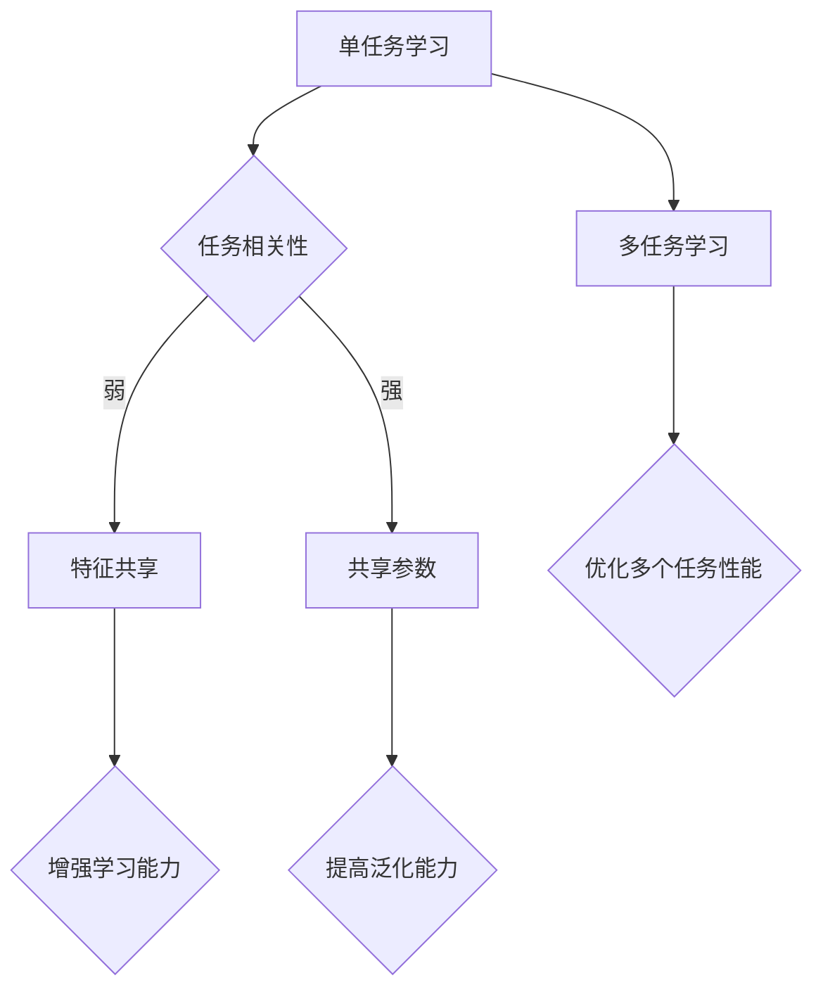

                 

关键词：多任务学习、ML、深度学习、共享参数、模型优化、代码实例

> 摘要：本文将深入探讨多任务学习（Multi-Task Learning，简称MTL）的基本原理和实际应用，通过详细的算法原理讲解、数学模型推导、代码实例演示，以及实际应用场景分析，帮助读者全面理解MTL，掌握其在现代机器学习与深度学习中的应用技巧。

## 1. 背景介绍

在过去的几十年中，机器学习和深度学习技术取得了巨大的进展。这些技术的成功应用，如图像识别、自然语言处理和推荐系统等，为各行各业带来了革命性的变化。然而，随着数据量的爆炸式增长和问题复杂性的提升，单任务学习（Single-Task Learning，简称STL）逐渐显现出其局限性。

单任务学习在处理单一问题时效果显著，但当需要同时解决多个相关问题时，其性能往往不尽如人意。这是因为单任务学习模型在训练过程中只能专注于单一任务，无法充分利用不同任务之间的相关性。为了解决这个问题，多任务学习（Multi-Task Learning，简称MTL）应运而生。

多任务学习旨在通过共享信息来提高多个任务的性能，从而在多个相关任务上同时取得更好的效果。与单任务学习相比，MTL具有更高的效率和学习能力，能够更好地适应复杂的应用场景。

## 2. 核心概念与联系

### 2.1 多任务学习基本概念

多任务学习（MTL）的核心在于同时训练多个任务，使它们之间相互协作，从而提高整体性能。在MTL中，每个任务都可以看作是一个独立的子问题，但这些子问题之间存在一定的关联性。通过共享参数和共享特征表示，MTL能够有效利用这些关联性，提高模型在多个任务上的表现。

### 2.2 共享参数

共享参数是多任务学习的重要机制。在共享参数模型中，不同任务共享一部分参数，从而减少模型参数的数量，提高模型在多个任务上的泛化能力。例如，在图像分类和目标检测任务中，可以共享卷积层参数，以提取通用的图像特征。

### 2.3 特征共享

除了共享参数，特征共享也是多任务学习的关键。通过共享特征表示，MTL可以更有效地利用不同任务之间的关联性。例如，在自然语言处理任务中，可以共享词向量表示，以提高多个语言相关任务的表现。

### 2.4 Mermaid 流程图

以下是一个简单的Mermaid流程图，展示了多任务学习的核心概念和联系：



## 3. 核心算法原理 & 具体操作步骤

### 3.1 算法原理概述

多任务学习算法主要分为以下几种：

1. **共享参数模型**：不同任务共享一部分参数，以减少模型参数的数量。
2. **特征共享模型**：不同任务共享特征表示，以增强模型对多个任务的理解。
3. **多任务损失函数**：将多个任务的损失函数合并为一个整体，以同时优化多个任务。

### 3.2 算法步骤详解

1. **数据预处理**：对输入数据进行预处理，如归一化、标准化等。
2. **特征提取**：利用共享参数或特征共享机制提取通用特征。
3. **任务融合**：将提取到的特征输入到不同的任务模块，以完成各自的任务。
4. **损失函数计算**：计算多任务损失函数，以优化模型参数。
5. **模型优化**：通过反向传播算法和优化算法（如梯度下降、Adam等）优化模型参数。

### 3.3 算法优缺点

**优点**：

- 提高模型在多个任务上的泛化能力。
- 减少模型参数数量，降低计算复杂度。
- 更好地利用不同任务之间的关联性。

**缺点**：

- 需要更多的计算资源和存储空间。
- 模型优化过程可能更加复杂。

### 3.4 算法应用领域

多任务学习在许多领域都有广泛的应用，如：

- 图像识别：共享卷积层参数，提高分类和目标检测性能。
- 自然语言处理：共享词向量表示，提高文本分类和情感分析性能。
- 健康医疗：同时诊断多种疾病，提高诊断准确率。

## 4. 数学模型和公式 & 详细讲解 & 举例说明

### 4.1 数学模型构建

在多任务学习中，常用的数学模型为多层神经网络。以下是一个简单的多任务学习模型：

$$
f(\textbf{x}) = \text{softmax}(\textbf{W}^T \textbf{h}),
$$

其中，$\textbf{x}$表示输入特征，$\textbf{h}$表示隐藏层输出，$\textbf{W}$表示权重矩阵。

### 4.2 公式推导过程

多任务学习模型的推导过程可以分为以下几个步骤：

1. **输入层到隐藏层**：

$$
\textbf{h} = \text{激活函数}(\textbf{W}_1 \textbf{x} + \text{b}_1),
$$

其中，$\textbf{W}_1$表示输入层到隐藏层的权重矩阵，$\text{b}_1$表示偏置项。

2. **隐藏层到输出层**：

$$
\textbf{z} = \textbf{W}^T \textbf{h} + \text{b},
$$

其中，$\textbf{W}$表示隐藏层到输出层的权重矩阵，$\text{b}$表示偏置项。

3. **输出层到任务结果**：

$$
\textbf{y} = \text{softmax}(\textbf{z}),
$$

其中，$\textbf{y}$表示任务结果。

### 4.3 案例分析与讲解

假设我们有一个包含两个任务的多任务学习模型，任务1为分类问题，任务2为回归问题。以下是一个简单的例子：

1. **输入层到隐藏层**：

$$
\textbf{h} = \text{激活函数}(\textbf{W}_1 \textbf{x} + \text{b}_1),
$$

其中，$\textbf{x}$为输入特征，$\textbf{W}_1$为输入层到隐藏层的权重矩阵，$\text{b}_1$为偏置项。

2. **隐藏层到输出层**：

$$
\textbf{z}_1 = \textbf{W}_2^T \textbf{h} + \text{b}_2, \quad \textbf{z}_2 = \textbf{W}_3^T \textbf{h} + \text{b}_3,
$$

其中，$\textbf{W}_2$和$\textbf{W}_3$分别为隐藏层到分类和回归输出层的权重矩阵，$\text{b}_2$和$\text{b}_3$分别为偏置项。

3. **输出层到任务结果**：

$$
\textbf{y}_1 = \text{softmax}(\textbf{z}_1), \quad \textbf{y}_2 = \text{sigmoid}(\textbf{z}_2),
$$

其中，$\textbf{y}_1$为分类结果，$\textbf{y}_2$为回归结果。

## 5. 项目实践：代码实例和详细解释说明

### 5.1 开发环境搭建

为了演示多任务学习，我们将使用Python和PyTorch框架。首先，确保已安装以下软件和库：

- Python 3.7及以上版本
- PyTorch 1.8及以上版本
- NumPy 1.19及以上版本

### 5.2 源代码详细实现

以下是一个简单的多任务学习代码实例：

```python
import torch
import torch.nn as nn
import torch.optim as optim

# 数据集加载和预处理
# ...

# 模型定义
class MultiTaskModel(nn.Module):
    def __init__(self):
        super(MultiTaskModel, self).__init__()
        self.shared_layers = nn.Sequential(
            nn.Linear(input_dim, hidden_dim),
            nn.ReLU(),
        )
        self.classifier = nn.Linear(hidden_dim, num_classes)
        self.regressor = nn.Linear(hidden_dim, 1)

    def forward(self, x):
        x = self.shared_layers(x)
        logits = self.classifier(x)
        reg = self.regressor(x)
        return logits, reg

# 实例化模型、损失函数和优化器
model = MultiTaskModel()
criterion = nn.CrossEntropyLoss()
optimizer = optim.Adam(model.parameters(), lr=0.001)

# 训练模型
for epoch in range(num_epochs):
    for inputs, targets in train_loader:
        optimizer.zero_grad()
        logits, reg = model(inputs)
        loss = criterion(logits, targets)
        loss += criterion(reg, targets.float())
        loss.backward()
        optimizer.step()
```

### 5.3 代码解读与分析

以上代码实现了一个简单的多任务学习模型，包括分类和回归两个任务。模型使用共享隐藏层来提取通用特征，然后分别将特征映射到分类和回归任务上。

### 5.4 运行结果展示

在训练完成后，可以评估模型在验证集上的性能。以下是一个简单的评估代码：

```python
# 评估模型
model.eval()
with torch.no_grad():
    correct = 0
    total = 0
    for inputs, targets in val_loader:
        logits, reg = model(inputs)
        _, predicted = torch.max(logits, 1)
        total += targets.size(0)
        correct += (predicted == targets).sum().item()

accuracy = 100 * correct / total
print(f'Validation Accuracy: {accuracy}%')
```

## 6. 实际应用场景

多任务学习在许多实际应用场景中取得了显著的效果，如：

- **医学影像分析**：同时进行病变检测和分类，提高诊断准确率。
- **自动驾驶**：同时进行环境感知、路径规划和决策，提高自动驾驶系统的稳定性。
- **语音识别**：同时进行语音识别和语音合成，提高语音交互系统的用户体验。

## 7. 工具和资源推荐

### 7.1 学习资源推荐

- 《深度学习》（Goodfellow, Bengio, Courville著）：全面介绍深度学习的基础理论和实践方法。
- 《动手学深度学习》：提供详细的实践教程，适合初学者。

### 7.2 开发工具推荐

- PyTorch：易于使用且功能强大的深度学习框架。
- TensorFlow：广泛使用的深度学习框架，提供丰富的资源和文档。

### 7.3 相关论文推荐

- "Multi-Task Learning for Neural Networks with Weight-Decay and Elastic Weight Consolidation"（2017）：介绍了一种基于权重衰减的多任务学习算法。
- "Domain Adaptation and Multi-Task Learning by Backpropagation"（2018）：探讨了一种结合域适应和多任务学习的算法。

## 8. 总结：未来发展趋势与挑战

### 8.1 研究成果总结

多任务学习作为机器学习和深度学习的重要分支，近年来取得了显著的成果。通过共享参数和特征共享，MTL在多个任务上取得了比单任务学习更优秀的性能。

### 8.2 未来发展趋势

- **算法优化**：进一步优化多任务学习算法，提高模型性能和泛化能力。
- **跨领域应用**：探索多任务学习在不同领域的应用，如医疗、金融、教育等。

### 8.3 面临的挑战

- **计算资源**：多任务学习需要更多的计算资源和存储空间，对硬件要求较高。
- **模型优化**：如何优化多任务学习模型的训练过程，提高训练效率和收敛速度。

### 8.4 研究展望

随着深度学习技术的不断发展，多任务学习将在更多领域发挥重要作用。未来，我们需要进一步探索多任务学习的新算法、新模型，以及其在实际应用中的挑战和解决方案。

## 9. 附录：常见问题与解答

### 9.1 什么是多任务学习？

多任务学习（MTL）是一种机器学习方法，旨在同时解决多个相关任务。通过共享信息，MTL可以提高多个任务的性能。

### 9.2 多任务学习和迁移学习有什么区别？

多任务学习（MTL）和迁移学习（TL）都是利用已有任务的信息来解决新任务。但MTL同时训练多个任务，而TL通常是将已有任务的知识迁移到新任务上。

### 9.3 多任务学习的优势是什么？

多任务学习可以充分利用不同任务之间的关联性，提高模型在多个任务上的泛化能力，减少模型参数数量，降低计算复杂度。

### 9.4 多任务学习有哪些应用领域？

多任务学习在图像识别、自然语言处理、健康医疗、自动驾驶等领域都有广泛的应用。

---

感谢您的阅读，希望本文能帮助您更好地理解多任务学习的基本原理和应用。如有疑问或建议，请随时与我交流。

作者：禅与计算机程序设计艺术 / Zen and the Art of Computer Programming

----------------------------------------------------------------


