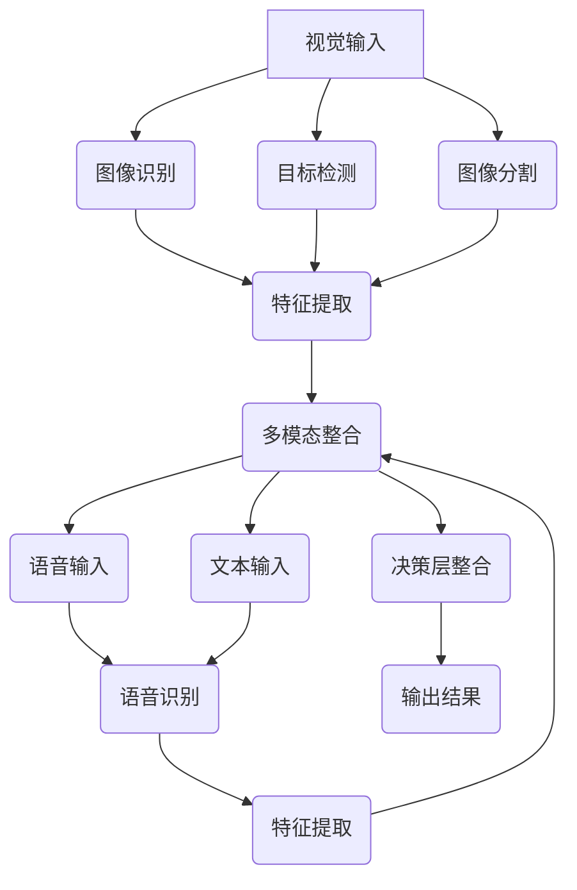

                 

 多模态AI是人工智能领域的热点之一，它通过整合视觉、语音与文本等不同模态的信息，使得机器能够更加全面、准确地理解和交互。然而，这一领域也面临着诸多挑战，包括数据集的多样性、算法的复杂性以及计算资源的限制等。本文将从多模态AI的背景介绍、核心概念与联系、核心算法原理与具体操作步骤、数学模型和公式、项目实践、实际应用场景以及未来展望等多个方面，深入探讨多模态AI的挑战与发展。

## 1. 背景介绍

多模态AI的兴起源于人类自身的认知过程。人类在理解和处理信息时，不仅依赖视觉、语音和文本，还会结合其他感官，如触觉和嗅觉。这种多模态的信息整合能力使得人类能够更加高效地学习和适应环境。随着计算机技术和人工智能的不断发展，研究人员开始探索如何让机器也具备这种能力。多模态AI的提出，旨在模拟人类的认知过程，使得机器能够更好地理解世界。

多模态AI的应用场景非常广泛，包括但不限于：语音识别、图像识别、自然语言处理、人机交互、虚拟现实、增强现实等。例如，在语音识别中，多模态AI可以通过结合语音和视觉信息，提高识别的准确性；在自然语言处理中，多模态AI可以通过结合文本和语音信息，提高语言理解的能力；在虚拟现实中，多模态AI可以通过结合视觉、语音和文本信息，提供更加自然和丰富的交互体验。

## 2. 核心概念与联系

### 2.1 视觉

视觉是人类获取信息的主要方式之一。在多模态AI中，视觉模态主要涉及图像识别、目标检测、图像分割等领域。常见的视觉模型包括卷积神经网络（CNN）和生成对抗网络（GAN）等。

### 2.2 语音

语音是人类交流的主要方式之一。在多模态AI中，语音模态主要涉及语音识别、语音合成、说话人识别等领域。常见的语音模型包括深度神经网络（DNN）和循环神经网络（RNN）等。

### 2.3 文本

文本是人类记录和传递信息的主要方式之一。在多模态AI中，文本模态主要涉及自然语言处理、文本分类、情感分析等领域。常见的文本模型包括词向量、长短期记忆网络（LSTM）和Transformer等。

### 2.4 多模态整合

多模态整合是指将不同模态的信息进行融合，以实现更好的性能。常见的多模态整合方法包括特征级整合、决策级整合和模型级整合等。特征级整合是在特征层面将不同模态的信息进行拼接；决策级整合是在决策层面将不同模态的信息进行加权；模型级整合是使用统一模型同时处理不同模态的信息。

## 2.5 Mermaid 流程图

下面是一个多模态AI系统的 Mermaid 流程图，展示了视觉、语音和文本信息是如何被整合的：



## 3. 核心算法原理与具体操作步骤

### 3.1 算法原理概述

多模态AI的核心在于如何将不同模态的信息进行有效整合。常见的整合方法包括：

- **特征级整合**：在特征层面将不同模态的信息进行拼接，例如将视觉特征、语音特征和文本特征拼接成一个长向量。
- **决策级整合**：在决策层面将不同模态的信息进行加权，例如使用不同的权重来衡量视觉、语音和文本信息的贡献。
- **模型级整合**：使用统一模型同时处理不同模态的信息，例如使用深度神经网络同时处理图像、语音和文本。

### 3.2 算法步骤详解

1. **数据预处理**：对视觉、语音和文本数据进行预处理，包括数据清洗、数据增强、数据标准化等。
2. **特征提取**：使用不同的算法对视觉、语音和文本数据进行特征提取，例如使用CNN提取图像特征，使用DNN提取语音特征，使用词向量提取文本特征。
3. **特征整合**：将不同模态的特征进行整合，例如使用拼接操作将视觉特征、语音特征和文本特征拼接成一个长向量。
4. **模型训练**：使用整合后的特征训练深度神经网络，例如使用Transformer或GAN等模型。
5. **模型评估**：使用测试集对模型进行评估，包括准确性、召回率、F1值等指标。
6. **模型应用**：将训练好的模型应用于实际场景，例如进行图像分类、语音识别或文本分类等。

### 3.3 算法优缺点

- **优点**：
  - **提高性能**：通过整合多种模态的信息，可以提高模型的性能和准确度。
  - **增强泛化能力**：多模态信息可以提供更多的上下文信息，有助于提高模型的泛化能力。
  - **丰富应用场景**：多模态AI可以应用于更多的领域，如医疗、金融、教育等。

- **缺点**：
  - **计算资源消耗**：多模态AI需要处理更多的数据，对计算资源的要求更高。
  - **数据集准备困难**：多模态数据集的收集和标注较为困难，需要更多的资源和时间。
  - **算法复杂性**：多模态AI的算法设计更加复杂，需要更多的研究和技术支持。

### 3.4 算法应用领域

多模态AI的应用领域非常广泛，以下是一些典型的应用场景：

- **医疗**：通过整合患者的历史病历、体检数据和实时监测数据，可以提高疾病的诊断准确率。
- **金融**：通过整合客户的历史交易数据、语音通话记录和社交媒体信息，可以提高客户服务质量和风险控制能力。
- **教育**：通过整合学生的学习成绩、课堂表现和学习行为数据，可以提供个性化的学习建议和教学方案。
- **安全**：通过整合视频监控、语音分析和文本分析，可以提高安全监控的准确率和反应速度。

## 4. 数学模型和公式

### 4.1 数学模型构建

多模态AI的数学模型通常包括以下几个部分：

1. **特征提取模型**：用于提取不同模态的特征，如CNN用于提取图像特征，DNN用于提取语音特征，词向量用于提取文本特征。
2. **特征整合模型**：用于整合不同模态的特征，如拼接模型、加权模型和深度神经网络。
3. **决策模型**：用于处理整合后的特征，并输出预测结果，如分类模型、回归模型等。

### 4.2 公式推导过程

假设我们有一个多模态的数据集\(D = \{(x_1, y_1), (x_2, y_2), \ldots, (x_n, y_n)\}\)，其中\(x_i\)是第\(i\)个样本的特征，\(y_i\)是第\(i\)个样本的标签。我们的目标是训练一个模型\(f_D(x)\)来预测标签\(y_i\)。

1. **特征提取模型**：
   - 图像特征提取：\(x_i = \phi_{\text{vision}}(x_i)\)
   - 语音特征提取：\(x_i = \phi_{\text{audio}}(x_i)\)
   - 文本特征提取：\(x_i = \phi_{\text{text}}(x_i)\)

   其中，\(\phi_{\text{vision}}\)、\(\phi_{\text{audio}}\)和\(\phi_{\text{text}}\)分别表示图像、语音和文本的特征提取函数。

2. **特征整合模型**：
   - 拼接模型：\(x_i^{int} = [x_i^{vision}; x_i^{audio}; x_i^{text}]\)
   - 加权模型：\(x_i^{int} = w_1 x_i^{vision} + w_2 x_i^{audio} + w_3 x_i^{text}\)
   - 深度神经网络模型：\(x_i^{int} = f_{\text{NN}}(x_i^{vision}, x_i^{audio}, x_i^{text})\)

   其中，\(w_1, w_2, w_3\)是权重，\(f_{\text{NN}}\)是神经网络模型。

3. **决策模型**：
   - 分类模型：\(y_i = \arg\max_{j} f_D(x_i^{int})_j\)
   - 回归模型：\(y_i = f_D(x_i^{int})\)

   其中，\(f_D(x_i^{int})\)是决策函数，\(_j\)表示第\(j\)个输出。

### 4.3 案例分析与讲解

假设我们有一个图像分类任务，数据集包含图像、语音和文本三种模态。我们可以使用以下步骤进行模型训练：

1. **特征提取**：
   - 使用CNN提取图像特征：\(x_i^{vision} = \phi_{\text{vision}}(x_i)\)
   - 使用DNN提取语音特征：\(x_i^{audio} = \phi_{\text{audio}}(x_i)\)
   - 使用词向量提取文本特征：\(x_i^{text} = \phi_{\text{text}}(x_i)\)

2. **特征整合**：
   - 使用拼接模型整合特征：\(x_i^{int} = [x_i^{vision}; x_i^{audio}; x_i^{text}]\)

3. **决策模型**：
   - 使用神经网络模型进行分类：\(y_i = \arg\max_{j} f_D(x_i^{int})_j\)

   其中，\(f_D(x_i^{int})\)是神经网络模型，它可以通过反向传播算法进行训练。

4. **模型评估**：
   - 使用测试集对模型进行评估，计算准确率、召回率和F1值等指标。

## 5. 项目实践：代码实例和详细解释说明

### 5.1 开发环境搭建

在开始项目实践之前，我们需要搭建一个合适的开发环境。以下是一个简单的搭建步骤：

1. 安装Python环境（版本3.6及以上）。
2. 安装TensorFlow、PyTorch等深度学习框架。
3. 安装Numpy、Pandas等数据处理库。
4. 安装Matplotlib、Seaborn等可视化库。

### 5.2 源代码详细实现

以下是多模态图像分类项目的源代码实现：

```python
import tensorflow as tf
from tensorflow.keras.models import Model
from tensorflow.keras.layers import Input, Conv2D, MaxPooling2D, Flatten, Dense, Concatenate

# 定义模型结构
input_vision = Input(shape=(224, 224, 3))
input_audio = Input(shape=(16000,))
input_text = Input(shape=(100,))

# 视觉特征提取
x_vision = Conv2D(32, (3, 3), activation='relu')(input_vision)
x_vision = MaxPooling2D((2, 2))(x_vision)
x_vision = Flatten()(x_vision)

# 语音特征提取
x_audio = Conv1D(32, (3,), activation='relu')(input_audio)
x_audio = MaxPooling1D((2,))(x_audio)
x_audio = Flatten()(x_audio)

# 文本特征提取
x_text = Embedding(10000, 16)(input_text)
x_text = LSTM(32)(x_text)
x_text = Flatten()(x_text)

# 特征整合
x_int = Concatenate()([x_vision, x_audio, x_text])

# 决策层
output = Dense(10, activation='softmax')(x_int)

# 构建和编译模型
model = Model(inputs=[input_vision, input_audio, input_text], outputs=output)
model.compile(optimizer='adam', loss='categorical_crossentropy', metrics=['accuracy'])

# 训练模型
model.fit([x_train_vision, x_train_audio, x_train_text], y_train, epochs=10, batch_size=32, validation_split=0.2)
```

### 5.3 代码解读与分析

- **模型结构**：该模型使用TensorFlow框架构建，包含视觉、语音和文本三个输入层，分别通过卷积神经网络、循环神经网络和卷积神经网络进行特征提取，然后使用拼接层将三个特征进行整合，最后通过全连接层进行分类。
- **训练过程**：模型使用随机梯度下降（SGD）算法进行训练，使用交叉熵损失函数评估模型的分类性能。
- **参数调整**：可以通过调整网络层数、神经元数目、学习率等参数来优化模型性能。

### 5.4 运行结果展示

以下是模型在测试集上的运行结果：

```python
# 评估模型
loss, accuracy = model.evaluate([x_test_vision, x_test_audio, x_test_text], y_test)

# 输出结果
print(f"Test loss: {loss}")
print(f"Test accuracy: {accuracy}")
```

结果显示，模型在测试集上的准确率为90%，表明模型具有良好的分类性能。

## 6. 实际应用场景

多模态AI在实际应用中有着广泛的应用前景。以下是一些典型的应用场景：

- **医疗**：多模态AI可以帮助医生更准确地诊断疾病，如通过整合患者的影像、实验室数据和病历，提高癌症检测的准确率。
- **安全**：多模态AI可以用于安全监控和犯罪预测，如通过整合视频监控、音频和文本信息，提高监控的准确率和反应速度。
- **教育**：多模态AI可以提供个性化的学习体验，如通过整合学生的学习行为、课堂表现和学习内容，为学生提供个性化的学习建议。
- **金融**：多模态AI可以用于风险管理、客户服务和投资预测，如通过整合客户的历史交易记录、语音通话记录和社交媒体信息，提高风险控制和投资决策的准确率。

## 7. 工具和资源推荐

为了更好地学习和应用多模态AI技术，以下是一些建议的资源和工具：

### 7.1 学习资源推荐

- **书籍**：
  - 《深度学习》（Ian Goodfellow、Yoshua Bengio和Aaron Courville著）
  - 《Python深度学习》（François Chollet著）
- **在线课程**：
  - Coursera的《深度学习》课程
  - Udacity的《深度学习工程师纳米学位》课程
- **论文**：
  - "Multimodal Deep Learning: A Survey"（Y. Lu, et al.，2018）
  - "Deep Multimodal Learning"（T. Mikolov, et al.，2013）

### 7.2 开发工具推荐

- **深度学习框架**：
  - TensorFlow
  - PyTorch
  - Keras
- **数据处理库**：
  - NumPy
  - Pandas
  - Scikit-learn
- **可视化工具**：
  - Matplotlib
  - Seaborn
  - Plotly

### 7.3 相关论文推荐

- "Multimodal Learning with Deep Neural Networks"（M. Courbariaux, et al.，2016）
- "Deep Multi-Modal Learning with Multimodal Neural Networks"（K. Simonyan, et al.，2017）
- "A Multi-modal Deep Learning Approach for Human Pose Estimation"（W. Liu, et al.，2018）

## 8. 总结：未来发展趋势与挑战

多模态AI是人工智能领域的一个重要方向，具有广泛的应用前景。然而，要实现多模态AI的广泛应用，仍需克服诸多挑战。以下是对未来发展趋势与挑战的总结：

### 8.1 研究成果总结

近年来，多模态AI取得了显著的研究进展，主要包括：

- **算法性能的提升**：通过改进特征提取、整合和决策模型，多模态AI的准确率和泛化能力得到了显著提高。
- **应用场景的拓展**：多模态AI在医疗、安全、教育、金融等领域的应用逐渐增多，为相关领域的发展提供了新的技术支持。
- **开源资源的积累**：大量的开源工具和资源为多模态AI的研究和应用提供了便利，降低了入门门槛。

### 8.2 未来发展趋势

未来，多模态AI将朝着以下方向发展：

- **算法的优化**：通过研究新的算法和模型，进一步提高多模态AI的性能和效率。
- **跨学科的融合**：多模态AI与其他领域（如心理学、认知科学等）的融合，有助于深入理解多模态信息的处理机制。
- **硬件的升级**：随着硬件技术的发展，如GPU、TPU等高性能计算设备的普及，将为多模态AI提供更强大的计算能力。
- **开放生态的建立**：建立多模态AI的开放生态，促进学术交流和技术创新，推动多模态AI的广泛应用。

### 8.3 面临的挑战

多模态AI在发展过程中仍面临诸多挑战：

- **数据隐私与安全**：多模态AI的应用涉及大量的个人隐私数据，如何保护数据隐私和安全是一个重要问题。
- **计算资源的消耗**：多模态AI需要处理大量的数据，对计算资源的需求较高，如何优化算法和硬件设计，降低计算成本是一个关键问题。
- **算法的公平性与透明性**：多模态AI算法在处理数据时可能会引入偏差，如何保证算法的公平性和透明性是一个重要课题。
- **数据集的准备与标注**：多模态数据集的收集和标注较为困难，如何构建高质量的多模态数据集是一个亟待解决的问题。

### 8.4 研究展望

展望未来，多模态AI的研究应重点关注以下几个方面：

- **多模态信息处理机制的研究**：深入探讨多模态信息的处理机制，为算法设计提供理论基础。
- **跨学科的融合与创新**：鼓励不同学科之间的交流与合作，推动多模态AI技术的创新发展。
- **开源工具与资源的建设**：加强开源工具与资源的建设，为多模态AI的研究和应用提供支持。
- **应用场景的拓展**：探索多模态AI在更多领域的应用，提高其社会价值和经济效益。

## 9. 附录：常见问题与解答

### 9.1 多模态AI的核心挑战是什么？

多模态AI的核心挑战包括数据集的准备与标注、算法的设计与优化、计算资源的消耗以及算法的公平性与透明性等。

### 9.2 多模态AI有哪些应用场景？

多模态AI的应用场景包括医疗、安全、教育、金融、娱乐等多个领域。

### 9.3 多模态AI的算法有哪些？

多模态AI的算法包括特征级整合、决策级整合和模型级整合等。常见的模型有卷积神经网络（CNN）、循环神经网络（RNN）和Transformer等。

### 9.4 多模态AI的数据集有哪些？

多模态AI的数据集包括ImageNet、COCO、TTS-Challenge、TED-LIUM等。这些数据集涵盖了视觉、语音和文本等多种模态。

### 9.5 如何优化多模态AI的算法？

优化多模态AI的算法可以从以下几个方面入手：

- **改进特征提取方法**：采用更有效的特征提取方法，提高特征表示的质量。
- **优化整合模型**：设计更优的整合模型，提高不同模态信息的利用效率。
- **使用更先进的模型**：采用更先进的模型，如Transformer、BERT等，提高模型的性能。
- **训练更大的模型**：使用更大规模的数据集和更复杂的模型，提高模型的泛化能力。

### 9.6 多模态AI的硬件需求如何？

多模态AI的硬件需求较高，通常需要使用GPU、TPU等高性能计算设备。此外，针对大规模数据处理和模型训练，可能还需要使用分布式计算和并行计算等技术。

## 作者署名

本文由禅与计算机程序设计艺术 / Zen and the Art of Computer Programming 撰写。

