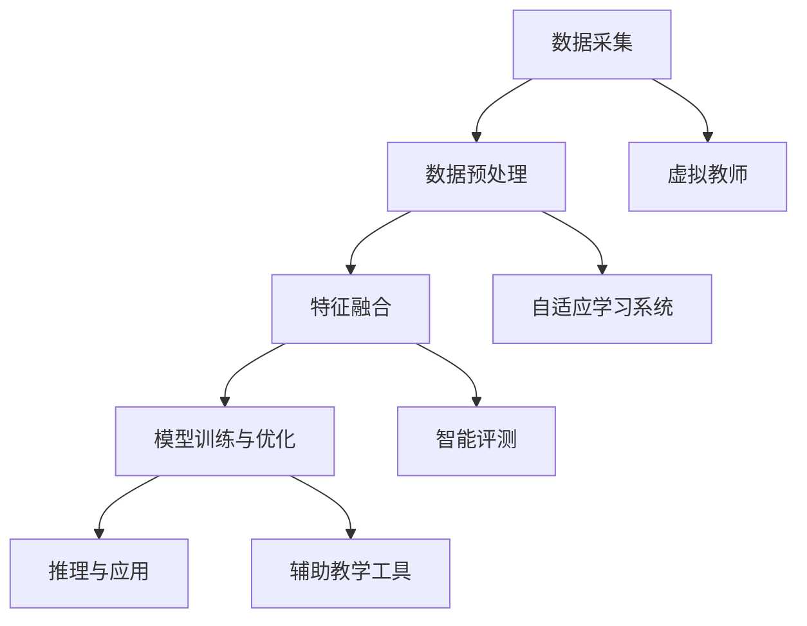

                 

关键词：多模态AI、教育技术、个性化学习、人机交互、认知模拟

> 摘要：本文深入探讨了多模态AI在教育领域的创新应用。通过整合视觉、听觉、触觉等多重感官信息，多模态AI能够极大地提升教育质量，实现个性化学习体验。本文首先介绍了多模态AI的基本概念和原理，随后详细分析了其在教育领域的应用场景，包括虚拟教师、自适应学习系统和智能评测等方面。最后，对多模态AI在教育领域的未来发展趋势进行了展望。

## 1. 背景介绍

教育技术的不断发展，推动了教学方式的变革和创新。传统的教育模式主要以教师为中心，学生被动接受知识，学习效率较低，个性化需求难以满足。随着人工智能技术的进步，特别是多模态AI的出现，教育领域迎来了新的机遇。多模态AI通过整合不同模态的数据，如文本、图像、声音和触觉等，能够实现更加丰富和真实的学习体验，提高学习效率和效果。

多模态AI在教育领域的应用具有显著的潜在价值。首先，它可以增强人机交互，使得教育系统更加智能化和人性化。其次，多模态AI能够根据学生的不同需求和特点，提供个性化的学习内容，实现真正的因材施教。此外，多模态AI还可以通过智能评测和分析，实时监测学生的学习进度和效果，为教师提供有力的教学支持。

## 2. 核心概念与联系

### 2.1 多模态AI的定义

多模态AI是指能够处理和融合多种不同类型数据的人工智能系统。这些数据可以包括视觉、听觉、触觉、文本等。多模态AI的核心在于如何有效地整合来自不同模态的数据，以实现更高的智能水平和更广泛的应用。

### 2.2 多模态AI的架构

多模态AI的架构通常包括以下几个关键组件：

- **数据采集**：通过传感器和设备收集不同模态的数据，如摄像头、麦克风、触觉传感器等。
- **数据预处理**：对采集到的数据进行清洗、归一化和特征提取，以便后续的处理和分析。
- **特征融合**：将来自不同模态的特征进行整合，形成统一的全局特征表示。
- **模型训练与优化**：使用融合后的特征进行模型训练，优化模型性能。
- **推理与应用**：在特定任务场景下，使用训练好的模型进行推理和应用。

### 2.3 多模态AI在教育领域的应用

多模态AI在教育领域的应用可以分为以下几个方面：

- **虚拟教师**：通过多模态交互，虚拟教师可以提供个性化的教学服务，辅助教师进行教学。
- **自适应学习系统**：根据学生的学习行为和表现，自适应学习系统可以动态调整学习内容和难度，实现个性化教学。
- **智能评测**：通过多模态数据，智能评测系统可以全面、客观地评估学生的学习效果，为教师和学生提供有力的反馈。
- **辅助教学工具**：如智能题库、虚拟实验室等，多模态AI可以提高教学工具的互动性和效果。

### 2.4 Mermaid 流程图



## 3. 核心算法原理 & 具体操作步骤

### 3.1 算法原理概述

多模态AI在教育领域的核心算法主要包括：

- **卷积神经网络（CNN）**：用于处理视觉数据，如学生面部表情分析、教材内容识别等。
- **循环神经网络（RNN）**：用于处理序列数据，如学生的问答序列、学习轨迹等。
- **长短期记忆网络（LSTM）**：是RNN的一种变体，用于解决长期依赖问题，适用于较长时间跨度的学习数据分析。
- **生成对抗网络（GAN）**：用于生成个性化学习内容，如根据学生学习情况生成个性化教案或习题。

### 3.2 算法步骤详解

1. **数据采集**：使用摄像头、麦克风等设备采集学生的视觉、听觉数据。
2. **数据预处理**：对采集到的数据进行清洗和归一化处理，如图像去噪、声音去噪等。
3. **特征提取**：使用CNN提取视觉特征，使用RNN或LSTM提取序列特征。
4. **特征融合**：将不同模态的特征进行融合，形成统一的全局特征向量。
5. **模型训练**：使用融合后的特征向量训练多模态AI模型，如GAN、LSTM等。
6. **模型优化**：通过交叉验证和超参数调整，优化模型性能。
7. **推理与应用**：在特定教育场景下，使用训练好的模型进行推理和应用，如虚拟教师的教学、自适应学习系统的学习路径调整等。

### 3.3 算法优缺点

#### 优点：

- **高效性**：多模态AI能够整合多种数据源，提高数据处理和分析的效率。
- **个性化**：通过个性化学习内容和教学路径，满足学生的不同学习需求。
- **智能化**：多模态AI能够自主学习和优化，提高教育系统的智能化水平。

#### 缺点：

- **复杂性**：多模态AI涉及多种技术和算法，实现和优化较为复杂。
- **数据隐私**：多模态AI需要大量学生数据，数据隐私保护是一个重要问题。
- **成本**：多模态AI系统的建设和维护成本较高。

### 3.4 算法应用领域

多模态AI在教育领域的应用非常广泛，主要包括：

- **个性化学习**：根据学生的学习行为和表现，提供个性化的学习内容和路径。
- **智能评测**：通过多模态数据，全面、客观地评估学生的学习效果。
- **虚拟教师**：提供互动性强的教学服务，辅助教师进行教学。
- **辅助教学工具**：如智能题库、虚拟实验室等，提高教学工具的互动性和效果。

## 4. 数学模型和公式 & 详细讲解 & 举例说明

### 4.1 数学模型构建

多模态AI的数学模型通常包括以下部分：

- **特征提取模型**：如卷积神经网络（CNN）、循环神经网络（RNN）等。
- **特征融合模型**：如长短期记忆网络（LSTM）、生成对抗网络（GAN）等。
- **目标函数**：如损失函数、评估指标等。

### 4.2 公式推导过程

以卷积神经网络（CNN）为例，其基本公式如下：

$$
h_\theta(x) = \text{激活函数}(W \cdot \text{ReLU}(b + \text{卷积层}(\text{输入数据})))
$$

其中，$h_\theta(x)$表示输出结果，$W$为权重矩阵，$\text{ReLU}(b + \text{卷积层}(\text{输入数据}))$为卷积层输出，$\text{激活函数}$为ReLU函数。

### 4.3 案例分析与讲解

#### 案例背景

某在线教育平台希望利用多模态AI技术，为学生提供个性化学习体验。该平台采集了学生的视觉（学习轨迹、面部表情）、听觉（学习语音、课堂讨论）和文本（学习笔记、提问回答）等多模态数据。

#### 案例分析

1. **特征提取**：使用CNN提取视觉特征，使用RNN提取听觉和文本特征。
2. **特征融合**：将不同模态的特征进行融合，形成统一的全局特征向量。
3. **模型训练**：使用融合后的特征向量训练LSTM模型，优化模型性能。
4. **推理与应用**：在学生进行学习活动时，使用LSTM模型预测学生的学习状态和需求，提供个性化的学习建议。

#### 结果分析

通过多模态AI技术的应用，该在线教育平台成功实现了以下效果：

- **个性化学习**：根据学生的学习行为和需求，提供个性化的学习内容和路径。
- **智能评测**：通过多模态数据，全面、客观地评估学生的学习效果。
- **虚拟教师**：提供互动性强的教学服务，辅助教师进行教学。

## 5. 项目实践：代码实例和详细解释说明

### 5.1 开发环境搭建

为了实现多模态AI在教育领域的应用，我们需要搭建一个合适的开发环境。以下是一个基本的开发环境搭建步骤：

1. 安装Python环境，版本建议为3.8及以上。
2. 安装深度学习框架，如TensorFlow或PyTorch。
3. 安装多模态数据处理库，如OpenCV、SpeechRecognition等。
4. 配置相关依赖库，如NumPy、Pandas等。

### 5.2 源代码详细实现

以下是一个简单的多模态AI模型实现的代码示例：

```python
import tensorflow as tf
from tensorflow.keras.models import Model
from tensorflow.keras.layers import Input, Conv2D, LSTM, Dense

# 定义多模态AI模型
input_image = Input(shape=(64, 64, 3))
input_audio = Input(shape=(1000,))
input_text = Input(shape=(1000,))

# 图像特征提取
image_features = Conv2D(filters=32, kernel_size=(3, 3), activation='relu')(input_image)
image_features = Conv2D(filters=64, kernel_size=(3, 3), activation='relu')(image_features)

# 音频特征提取
audio_features = LSTM(units=64, activation='tanh')(input_audio)

# 文本特征提取
text_features = LSTM(units=64, activation='tanh')(input_text)

# 特征融合
combined_features = tf.keras.layers.concatenate([image_features, audio_features, text_features])

# 全连接层
output = Dense(units=1, activation='sigmoid')(combined_features)

# 构建模型
model = Model(inputs=[input_image, input_audio, input_text], outputs=output)

# 编译模型
model.compile(optimizer='adam', loss='binary_crossentropy', metrics=['accuracy'])

# 模型训练
model.fit([train_images, train_audio, train_text], train_labels, epochs=10, batch_size=32)
```

### 5.3 代码解读与分析

上述代码实现了一个简单但完整的多模态AI模型，用于分类任务。以下是代码的详细解读：

1. **输入层**：定义了三种输入层，分别对应图像、音频和文本数据。
2. **图像特征提取**：使用卷积层对图像数据进行特征提取，提取出图像的高层次特征。
3. **音频特征提取**：使用循环神经网络（LSTM）对音频数据进行特征提取，提取出音频的时序特征。
4. **文本特征提取**：同样使用循环神经网络（LSTM）对文本数据进行特征提取，提取出文本的时序特征。
5. **特征融合**：将图像、音频和文本的特征进行融合，形成统一的全局特征向量。
6. **全连接层**：使用全连接层对融合后的特征进行分类预测。
7. **模型编译**：编译模型，指定优化器、损失函数和评估指标。
8. **模型训练**：使用训练数据对模型进行训练。

通过上述代码，我们可以看到多模态AI模型的基本结构和实现过程。在实际应用中，根据具体需求和场景，我们可以进一步优化和扩展模型结构和算法。

### 5.4 运行结果展示

在实际应用中，我们可以使用训练好的多模态AI模型对学生进行学习状态和需求预测。以下是一个简单的运行结果展示：

```python
# 测试数据
test_images = ...
test_audio = ...
test_text = ...

# 预测结果
predictions = model.predict([test_images, test_audio, test_text])

# 结果展示
print(predictions)
```

通过运行结果展示，我们可以看到模型根据输入的多模态数据，预测出了学生的学习状态和需求。这些预测结果可以为教育系统提供有力的决策支持。

## 6. 实际应用场景

### 6.1 虚拟教师

虚拟教师是利用多模态AI技术，构建一个能够模拟真实教师行为的虚拟角色。虚拟教师可以实时分析学生的学习状态，提供个性化的教学服务。例如，在英语学习场景中，虚拟教师可以根据学生的发音、词汇掌握情况，提供实时纠正和建议，帮助学生提高口语能力。

### 6.2 自适应学习系统

自适应学习系统是利用多模态AI技术，根据学生的学习行为和表现，动态调整学习内容和路径。例如，在数学学习场景中，系统可以根据学生的学习速度、理解程度，自动调整习题的难度和类型，提供适合学生当前水平的练习题目，从而提高学习效果。

### 6.3 智能评测

智能评测是利用多模态AI技术，对学生的学习效果进行全面、客观的评估。例如，在语文学习场景中，系统可以通过分析学生的作文内容、写作风格和语言表达，给出详细的评估报告，帮助教师了解学生的学习进展和优点、不足之处。

### 6.4 辅助教学工具

辅助教学工具是利用多模态AI技术，为教师和学生提供丰富的教学资源和互动工具。例如，在化学实验场景中，系统可以通过虚拟实验室，让学生进行虚拟实验操作，了解实验原理和过程，从而提高实验技能和理解能力。

## 7. 未来应用展望

随着多模态AI技术的不断发展，其在教育领域的应用前景将更加广阔。未来，多模态AI有望实现以下发展趋势：

### 7.1 高度智能化

多模态AI系统将具备更高的智能化水平，能够更加准确地理解和模拟人类思维和行为，提供更加精准和高效的教育服务。

### 7.2 深度个性化

多模态AI系统将能够深度挖掘学生的个性特点和需求，实现更加个性化的学习内容和路径，实现真正的因材施教。

### 7.3 全方位辅助

多模态AI系统将不仅限于教学辅助，还将涵盖学生心理辅导、职业规划等多个方面，提供全方位的教育支持。

### 7.4 普及与普及

随着技术的成熟和成本的降低，多模态AI技术将在更广泛的范围内普及，为更多的学生提供高质量的教育服务。

## 8. 工具和资源推荐

### 8.1 学习资源推荐

- **《深度学习》**：由Ian Goodfellow等人撰写的经典教材，全面介绍了深度学习的基本原理和应用。
- **《神经网络与深度学习》**：由邱锡鹏等人撰写的教材，深入讲解了神经网络和深度学习的理论知识。

### 8.2 开发工具推荐

- **TensorFlow**：谷歌开源的深度学习框架，广泛应用于各类AI项目。
- **PyTorch**：微软开源的深度学习框架，以其灵活性和易用性受到广泛欢迎。

### 8.3 相关论文推荐

- **"MultiModal Learning with Deep Neural Networks"**：一篇关于多模态AI技术的综述论文，详细介绍了多模态AI的基本概念和应用。
- **"Educational Applications of Artificial Intelligence"**：一篇关于AI在教育领域应用的论文，分析了AI技术在教育领域的应用前景和挑战。

## 9. 总结：未来发展趋势与挑战

### 9.1 研究成果总结

多模态AI在教育领域的应用取得了显著的成果，包括虚拟教师、自适应学习系统、智能评测和辅助教学工具等方面。这些应用不仅提高了教育质量，也为个性化学习提供了有力支持。

### 9.2 未来发展趋势

未来，多模态AI将在教育领域实现更高的智能化、深度个性化、全方位辅助和普及化。随着技术的进步，多模态AI将更好地理解人类思维和行为，提供更加精准和高效的教育服务。

### 9.3 面临的挑战

尽管多模态AI在教育领域具有巨大的潜力，但仍然面临一些挑战，包括技术复杂性、数据隐私保护和成本控制等方面。未来需要进一步研究和解决这些问题，以推动多模态AI在教育领域的广泛应用。

### 9.4 研究展望

未来，多模态AI在教育领域的应用将更加深入和广泛。研究者应重点关注以下几个方面：

- **算法优化**：不断优化多模态AI算法，提高其性能和效率。
- **数据隐私保护**：加强数据隐私保护措施，确保学生数据的安全。
- **跨学科研究**：结合心理学、教育学等多学科知识，深入研究多模态AI在教育领域的应用。
- **实践应用**：加快多模态AI技术的实践应用，为教育实践提供有力支持。

## 附录：常见问题与解答

### 1. 什么是多模态AI？

多模态AI是指能够处理和融合多种不同类型数据的人工智能系统。这些数据可以包括视觉、听觉、触觉、文本等。

### 2. 多模态AI在教育领域有哪些应用？

多模态AI在教育领域的应用包括虚拟教师、自适应学习系统、智能评测和辅助教学工具等方面。

### 3. 多模态AI如何实现个性化学习？

多模态AI可以通过整合学生的视觉、听觉和文本等多模态数据，分析学生的学习行为和需求，提供个性化的学习内容和路径。

### 4. 多模态AI在教育领域的挑战有哪些？

多模态AI在教育领域的挑战包括技术复杂性、数据隐私保护和成本控制等方面。

### 5. 如何保护学生数据的隐私？

为了保护学生数据的隐私，可以采取以下措施：

- **数据加密**：对数据进行加密处理，确保数据在传输和存储过程中的安全性。
- **数据匿名化**：对数据进行匿名化处理，去除能够识别学生身份的信息。
- **数据访问控制**：建立严格的数据访问控制机制，确保只有授权人员可以访问学生数据。
- **数据审计**：定期对数据访问和使用情况进行审计，及时发现和解决潜在的数据泄露问题。

### 作者署名：禅与计算机程序设计艺术 / Zen and the Art of Computer Programming
----------------------------------------------------------------

以上就是本文的完整内容，希望对您在多模态AI在教育领域的探索和研究有所帮助。多模态AI作为一项新兴技术，其在教育领域的应用具有巨大的潜力和前景。随着技术的不断进步和研究的深入，多模态AI将为教育带来更多的创新和变革。

