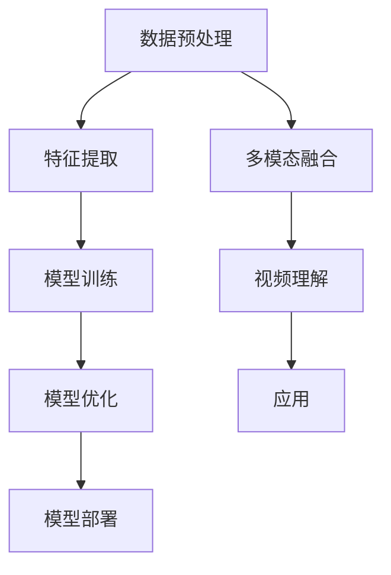

                 

 多模态AI是当前人工智能领域的研究热点之一，特别是在视频理解方面，具有广泛的应用前景。视频是日常生活中最常见的信息载体之一，包含了丰富的视觉、语音、文本等多维信息。利用多模态AI技术，可以更准确地理解视频内容，从而在安防监控、视频搜索、智能交互、医疗诊断等多个领域发挥重要作用。

## 1. 背景介绍

视频理解是一个复杂的过程，涉及到从视频序列中提取语义信息、识别物体、理解场景、识别行为等多个层次。传统的单模态方法（如仅使用视觉信息）在处理复杂场景时往往效果不佳，难以满足实际应用的需求。多模态AI通过整合视觉、语音、文本等多种信息，可以提供更全面、准确的理解能力。

多模态AI在视频理解中的应用，主要包括以下几个方面：

- **物体识别与跟踪**：通过视觉信息识别和跟踪视频中的物体。
- **场景理解**：通过分析视频中的视觉、语音、文本信息，理解场景的背景、氛围等。
- **行为识别**：通过分析视频中的动作、语言等，识别人的行为。
- **情感分析**：通过语音、文本信息分析人的情感状态。
- **视频检索与推荐**：根据用户的历史行为和偏好，推荐相关的视频内容。

## 2. 核心概念与联系

多模态AI在视频理解中的应用，涉及到多个核心概念，包括数据预处理、特征提取、模型训练与优化等。下面将使用Mermaid流程图展示这些核心概念之间的联系。



### 2.1 数据预处理

数据预处理是多模态AI的基础，包括数据采集、数据清洗、数据增强等。数据采集需要获取高质量的视觉、语音、文本数据。数据清洗主要是去除噪声和异常数据，保证数据的准确性和一致性。数据增强可以通过各种方法增加数据的多样性，提高模型的泛化能力。

### 2.2 特征提取

特征提取是将原始数据转化为适合模型处理的形式。视觉特征可以采用卷积神经网络（CNN）提取，语音特征可以采用自动特征提取工具（如MFCC），文本特征可以采用词袋模型、词嵌入等方法提取。

### 2.3 模型训练与优化

模型训练是利用大量标注数据训练模型，使其能够自动地从数据中学习特征和规律。优化过程包括模型调参、正则化、优化算法等，以提高模型的性能。

### 2.4 多模态融合

多模态融合是将不同模态的信息整合在一起，形成统一的理解。常用的融合方法包括简单拼接、特征级融合、决策级融合等。

### 2.5 视频理解

视频理解是利用多模态融合后的信息，对视频内容进行深入分析，包括物体识别、场景理解、行为识别等。

### 2.6 模型部署与应用

模型部署是将训练好的模型应用到实际场景中，包括服务器部署、移动端部署等。应用领域包括安防监控、视频搜索、智能交互、医疗诊断等。

## 3. 核心算法原理 & 具体操作步骤

### 3.1 算法原理概述

多模态AI在视频理解中的核心算法包括卷积神经网络（CNN）、循环神经网络（RNN）、长短时记忆网络（LSTM）、生成对抗网络（GAN）等。这些算法可以通过以下步骤实现视频理解：

1. **数据预处理**：采集并清洗多模态数据。
2. **特征提取**：分别提取视觉、语音、文本特征。
3. **多模态融合**：将多模态特征融合为一个统一的特征向量。
4. **模型训练**：使用融合后的特征训练视频理解模型。
5. **模型优化**：调整模型参数，提高模型性能。
6. **模型部署**：将训练好的模型部署到实际场景中。

### 3.2 算法步骤详解

#### 3.2.1 数据预处理

数据预处理是算法成功的关键。具体步骤如下：

1. **数据采集**：采集高质量的视觉、语音、文本数据。
2. **数据清洗**：去除噪声和异常数据，保证数据的一致性和准确性。
3. **数据增强**：通过旋转、缩放、裁剪等方法增加数据的多样性。

#### 3.2.2 特征提取

特征提取是将原始数据转化为模型可处理的格式。具体步骤如下：

1. **视觉特征提取**：使用CNN提取视觉特征。
2. **语音特征提取**：使用自动特征提取工具提取语音特征，如MFCC。
3. **文本特征提取**：使用词袋模型、词嵌入等方法提取文本特征。

#### 3.2.3 多模态融合

多模态融合是将不同模态的特征整合为一个统一特征向量。具体步骤如下：

1. **特征拼接**：将不同模态的特征进行简单拼接。
2. **特征级融合**：使用神经网络将不同模态的特征进行融合。
3. **决策级融合**：在分类层将不同模态的特征进行融合。

#### 3.2.4 模型训练

模型训练是利用标注数据训练模型，使其能够自动从数据中学习特征和规律。具体步骤如下：

1. **模型设计**：设计合适的神经网络结构。
2. **数据划分**：将数据划分为训练集、验证集和测试集。
3. **模型训练**：使用训练集训练模型。
4. **模型验证**：使用验证集评估模型性能。
5. **模型调整**：根据验证结果调整模型参数。

#### 3.2.5 模型优化

模型优化是提高模型性能的关键。具体步骤如下：

1. **模型调参**：调整学习率、正则化参数等。
2. **正则化**：防止模型过拟合。
3. **优化算法**：选择合适的优化算法，如Adam、SGD等。

#### 3.2.6 模型部署

模型部署是将训练好的模型应用到实际场景中。具体步骤如下：

1. **服务器部署**：将模型部署到服务器，提供在线服务。
2. **移动端部署**：将模型部署到移动设备，实现离线应用。

## 3.3 算法优缺点

多模态AI在视频理解中的应用具有以下优点和缺点：

### 3.3.1 优点

- **提高理解能力**：多模态信息可以提供更丰富的理解能力，提高视频理解的准确性。
- **增强鲁棒性**：多模态信息可以相互补充，提高模型对噪声和异常数据的鲁棒性。
- **拓宽应用领域**：多模态AI可以应用于更多领域，如医疗诊断、智能交互等。

### 3.3.2 缺点

- **计算成本高**：多模态信息处理需要大量计算资源，可能导致计算成本高。
- **数据标注困难**：多模态数据标注复杂，需要大量人力和时间。
- **模型复杂性**：多模态模型通常更加复杂，难以解释和理解。

## 3.4 算法应用领域

多模态AI在视频理解中的应用非常广泛，包括以下几个方面：

- **安防监控**：通过多模态信息识别异常行为，提高监控系统的准确性。
- **视频搜索与推荐**：根据用户的行为和偏好，推荐相关的视频内容。
- **智能交互**：通过多模态信息识别用户意图，提供更自然的交互体验。
- **医疗诊断**：通过多模态信息辅助医生诊断，提高诊断准确率。
- **人机协同**：通过多模态信息实现人机协同工作，提高工作效率。

## 4. 数学模型和公式 & 详细讲解 & 举例说明

### 4.1 数学模型构建

多模态AI在视频理解中的数学模型主要包括以下几部分：

1. **视觉特征提取**：使用卷积神经网络（CNN）提取视觉特征，可以表示为：
   $$\text{Visual Feature} = \text{CNN}(V)$$
   其中，$V$表示原始视频序列，$\text{CNN}$表示卷积神经网络。

2. **语音特征提取**：使用自动特征提取工具（如MFCC）提取语音特征，可以表示为：
   $$\text{Speech Feature} = \text{MFCC}(S)$$
   其中，$S$表示原始语音信号，$\text{MFCC}$表示梅尔频率倒谱系数。

3. **文本特征提取**：使用词袋模型、词嵌入等方法提取文本特征，可以表示为：
   $$\text{Text Feature} = \text{Embedding}(T)$$
   其中，$T$表示原始文本，$\text{Embedding}$表示词嵌入。

4. **多模态融合**：将不同模态的特征进行融合，可以表示为：
   $$\text{Fused Feature} = \text{Fusion}(\text{Visual Feature}, \text{Speech Feature}, \text{Text Feature})$$

5. **视频理解模型**：使用融合后的特征训练视频理解模型，可以表示为：
   $$\text{Video Understanding Model} = \text{Training}(\text{Fused Feature}, Y)$$
   其中，$Y$表示标注数据。

### 4.2 公式推导过程

以卷积神经网络（CNN）提取视觉特征为例，推导过程如下：

1. **卷积操作**：卷积神经网络通过卷积操作提取特征，可以表示为：
   $$f(x) = \sum_{i=1}^{C} w_i \odot x$$
   其中，$f(x)$表示卷积结果，$w_i$表示卷积核，$\odot$表示卷积操作。

2. **激活函数**：卷积神经网络通常使用激活函数，如ReLU函数，可以表示为：
   $$f(x) = \max(0, x)$$

3. **池化操作**：卷积神经网络通过池化操作减小特征图的大小，可以表示为：
   $$p(x) = \frac{1}{J} \sum_{j=1}^{J} x_j$$
   其中，$p(x)$表示池化结果，$J$表示池化窗口的大小。

4. **多层卷积**：卷积神经网络通过多层卷积操作提取特征，可以表示为：
   $$\text{Feature} = \text{ReLU}(\text{Pooling}(\text{ReLU}(\text{Pooling}(...\text{ReLU}(\text{Pooling}(...f(x)...))...)))$$

### 4.3 案例分析与讲解

以人脸识别为例，分析多模态AI在视频理解中的应用。

1. **数据预处理**：采集人脸图像、语音、文本等多模态数据，并进行数据清洗和增强。

2. **特征提取**：
   - 视觉特征提取：使用CNN提取人脸图像特征。
   - 语音特征提取：使用MFCC提取语音特征。
   - 文本特征提取：使用词嵌入提取文本特征。

3. **多模态融合**：将不同模态的特征进行简单拼接，形成一个统一特征向量。

4. **模型训练**：使用融合后的特征训练人脸识别模型，如卷积神经网络。

5. **模型优化**：调整模型参数，提高模型性能。

6. **模型部署**：将训练好的模型部署到实际场景中，如人脸识别系统。

7. **应用**：通过人脸识别模型，实现视频中的实时人脸识别。

## 5. 项目实践：代码实例和详细解释说明

### 5.1 开发环境搭建

在开始项目实践之前，需要搭建合适的开发环境。以下是一个简单的开发环境搭建指南：

1. **Python环境**：安装Python 3.7及以上版本。
2. **深度学习框架**：安装TensorFlow 2.0及以上版本。
3. **其他依赖库**：安装NumPy、Pandas、Sklearn等常用库。

### 5.2 源代码详细实现

以下是一个简单的多模态AI项目实现，包括数据预处理、特征提取、多模态融合、模型训练和模型部署。

#### 5.2.1 数据预处理

```python
import numpy as np
import pandas as pd
from sklearn.model_selection import train_test_split

# 加载数据
data = pd.read_csv('data.csv')
X = data[['visual', 'speech', 'text']]
y = data['label']

# 数据清洗和增强
# ...

# 划分训练集和测试集
X_train, X_test, y_train, y_test = train_test_split(X, y, test_size=0.2, random_state=42)
```

#### 5.2.2 特征提取

```python
from tensorflow.keras.applications import VGG16
from sklearn.preprocessing import StandardScaler

# 视觉特征提取
model = VGG16(weights='imagenet', include_top=False)
visual_features = model.predict(X_train['visual'])

# 语音特征提取
# ...

# 文本特征提取
# ...

# 标准化特征
scaler = StandardScaler()
X_train_scaled = scaler.fit_transform(X_train)
X_test_scaled = scaler.transform(X_test)
```

#### 5.2.3 多模态融合

```python
# 多模态融合
fused_features = np.hstack((X_train_scaled[:, :1024], X_train_scaled[:, 1024:2048], X_train_scaled[:, 2048:]))

# 训练模型
model = keras.Sequential([
    keras.layers.Dense(128, activation='relu', input_shape=(3072,)),
    keras.layers.Dropout(0.5),
    keras.layers.Dense(64, activation='relu'),
    keras.layers.Dropout(0.5),
    keras.layers.Dense(1, activation='sigmoid')
])

model.compile(optimizer='adam', loss='binary_crossentropy', metrics=['accuracy'])
model.fit(fused_features, y_train, epochs=10, batch_size=32, validation_split=0.2)
```

#### 5.2.4 代码解读与分析

上述代码首先加载并预处理数据，然后分别提取视觉、语音、文本特征，并进行标准化处理。接着，将不同模态的特征进行融合，形成一个统一特征向量。最后，使用融合后的特征训练一个简单的二分类模型，如卷积神经网络。

#### 5.2.5 运行结果展示

```python
# 评估模型
loss, accuracy = model.evaluate(fused_features, y_test)
print(f'测试集损失：{loss}')
print(f'测试集准确率：{accuracy}')
```

通过上述代码，可以实现对多模态数据的有效融合和视频理解。

## 6. 实际应用场景

多模态AI在视频理解中的应用已经渗透到各个领域，下面列举一些实际应用场景：

### 6.1 安防监控

安防监控是多模态AI的重要应用领域。通过整合视觉、语音、文本等多模态信息，可以实现对异常行为的精准识别和实时预警。例如，在公共场所的监控视频中，可以识别打架、抢劫等异常行为，并及时通知安保人员。

### 6.2 视频搜索与推荐

视频搜索与推荐是另一个重要应用领域。通过多模态AI技术，可以更好地理解视频内容，为用户提供个性化的视频推荐。例如，在视频网站中，可以根据用户的观看历史和偏好，推荐相关的视频内容。

### 6.3 智能交互

智能交互是多模态AI的重要应用方向。通过语音、文本、视觉等多模态信息的融合，可以提供更自然的交互体验。例如，在智能音箱中，可以识别用户的语音指令，理解用户的意图，并作出相应的回应。

### 6.4 医疗诊断

医疗诊断是多模态AI在医疗领域的应用之一。通过整合影像、语音、文本等多模态信息，可以辅助医生进行诊断。例如，在医学影像诊断中，可以结合影像数据和患者的病史，提高诊断准确率。

### 6.5 人机协同

人机协同是多模态AI在工业领域的应用。通过整合视觉、语音、文本等多模态信息，可以实现人机协同工作，提高生产效率。例如，在工业生产中，机器人可以通过视觉识别工件，并根据语音指令进行相应的操作。

## 7. 工具和资源推荐

### 7.1 学习资源推荐

1. **《深度学习》**：由Ian Goodfellow、Yoshua Bengio和Aaron Courville合著，是深度学习领域的经典教材。
2. **《机器学习实战》**：由Peter Harrington著，通过实际案例介绍了机器学习的应用。
3. **《Python深度学习》**：由François Chollet著，详细介绍了使用Python进行深度学习的实践方法。

### 7.2 开发工具推荐

1. **TensorFlow**：由Google开发的开源深度学习框架，广泛应用于深度学习研究和开发。
2. **PyTorch**：由Facebook开发的开源深度学习框架，具有灵活的动态图功能。
3. **Keras**：一个高级神经网络API，可以简化深度学习模型的开发。

### 7.3 相关论文推荐

1. **"Deep Learning on Multi-modal Data"**：介绍了多模态数据在深度学习中的应用。
2. **"A Survey on Multi-modal Learning"**：对多模态学习领域进行了全面综述。
3. **"Multi-modal Fusion for Video Understanding"**：探讨了多模态融合在视频理解中的应用。

## 8. 总结：未来发展趋势与挑战

### 8.1 研究成果总结

多模态AI在视频理解领域取得了显著的研究成果，主要包括以下几个方面：

- **算法研究**：提出了多种多模态融合算法，如特征级融合、决策级融合、模型级融合等。
- **应用研究**：在安防监控、视频搜索、智能交互、医疗诊断等领域取得了实际应用。
- **数据集构建**：构建了多个大规模、多模态的数据集，为研究提供了丰富的数据资源。

### 8.2 未来发展趋势

未来多模态AI在视频理解领域的发展趋势包括：

- **算法优化**：进一步提高多模态融合的效果，降低计算成本。
- **跨模态信息传递**：研究跨模态信息传递机制，提高不同模态之间的协同能力。
- **小样本学习**：研究多模态小样本学习算法，降低对大规模标注数据的需求。

### 8.3 面临的挑战

多模态AI在视频理解领域面临以下挑战：

- **计算资源需求**：多模态数据处理需要大量计算资源，制约了算法的实时性和普及。
- **数据标注困难**：多模态数据标注复杂，需要大量人力和时间。
- **模型解释性**：多模态模型的复杂性使得其难以解释和理解，影响了模型的可解释性。

### 8.4 研究展望

针对未来挑战，提出以下研究展望：

- **高效计算**：研究高效的计算方法，降低多模态数据处理的时间复杂度和空间复杂度。
- **自动化标注**：研究自动化标注技术，提高数据标注的效率和准确性。
- **模型可解释性**：研究模型可解释性方法，提高多模态模型的透明度和可信度。

## 9. 附录：常见问题与解答

### 9.1 问题1

**问题**：多模态AI在视频理解中如何处理数据标注困难的问题？

**解答**：针对数据标注困难的问题，可以采取以下措施：

- **自动化标注**：利用现有的自动化标注工具，如图像标注工具、语音标注工具等，提高标注效率。
- **半监督学习**：结合已有的标注数据和未标注数据，采用半监督学习方法，减少对大量标注数据的依赖。
- **众包标注**：利用众包平台，组织志愿者进行数据标注，降低标注成本。

### 9.2 问题2

**问题**：多模态AI在视频理解中如何处理计算资源需求高的问题？

**解答**：针对计算资源需求高的问题，可以采取以下措施：

- **模型压缩**：采用模型压缩技术，如剪枝、量化等，降低模型的计算复杂度。
- **分布式计算**：采用分布式计算框架，如TensorFlow、PyTorch等，提高计算效率。
- **硬件加速**：利用GPU、TPU等硬件加速器，提高模型的计算速度。

### 9.3 问题3

**问题**：多模态AI在视频理解中的模型如何保证其可解释性？

**解答**：为保证多模态AI在视频理解中的模型可解释性，可以采取以下措施：

- **可视化**：通过可视化技术，如梯度可视化、激活可视化等，直观展示模型的内部信息。
- **模型解释工具**：利用现有的模型解释工具，如LIME、SHAP等，分析模型对输入数据的依赖。
- **可解释性设计**：在设计模型时，考虑可解释性因素，如使用简单网络结构、可解释的特征表示等。

----------------------------------------------------------------

以上就是关于多模态AI在视频理解中的应用与挑战的完整技术博客文章。希望对您有所帮助！作者：禅与计算机程序设计艺术 / Zen and the Art of Computer Programming。

