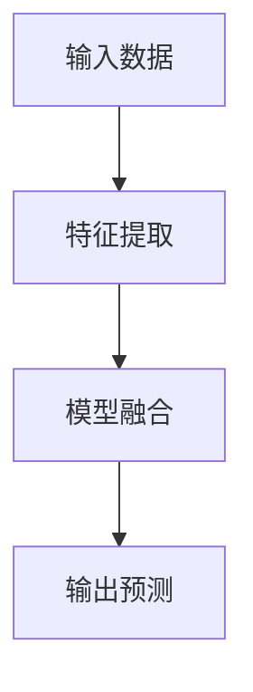
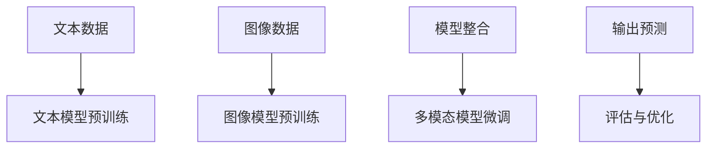
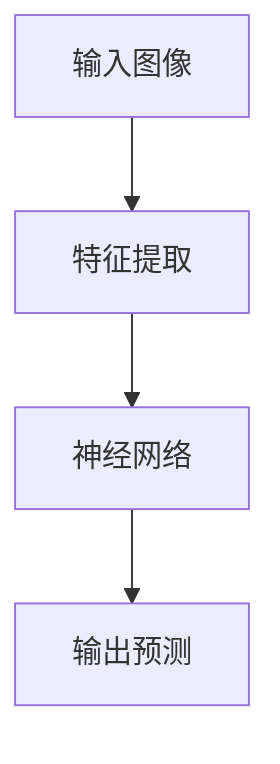

                 

关键词：多模态AI，整体微调，组件预训练，神经网络，模型优化，AI系统架构，机器学习，深度学习。

> 摘要：本文深入探讨了多模态AI系统中的两种关键训练策略：整体微调和组件预训练。通过对这两种策略的原理、操作步骤、优缺点及应用领域的详细分析，本文旨在为读者提供关于如何有效训练多模态AI系统的实用指导。文章结构紧凑、逻辑清晰，旨在帮助读者理解多模态AI系统的核心概念与实现方法。

## 1. 背景介绍

多模态AI系统是一种能够处理并整合来自多种来源的信息（如文本、图像、声音等）的人工智能系统。随着技术的进步，多模态AI在多个领域得到了广泛应用，如自然语言处理、图像识别、语音识别、虚拟助手等。然而，多模态AI系统的训练是一个复杂的过程，因为它需要处理不同类型的数据，并且这些数据之间可能存在很强的关联性。

在多模态AI系统的训练中，有两种主要的策略：整体微调和组件预训练。整体微调（End-to-End Fine-Tuning）指的是直接将不同模态的数据整合到一个统一的模型中进行训练，而组件预训练（Component Pre-training）则是先分别对每个模态的数据进行预训练，然后再将预训练的模型整合到一个更大的模型中进行微调。

这两种策略各有优缺点，选择哪一种策略取决于具体的应用场景和需求。本文将深入探讨这两种策略的原理、操作步骤、优缺点及应用领域，帮助读者更好地理解和应用多模态AI系统。

## 2. 核心概念与联系

### 2.1 整体微调

整体微调是一种将多种模态的数据直接输入到一个统一模型中进行训练的方法。这种方法的核心思想是将不同模态的数据通过共享的底层特征表示进行整合，从而在统一框架下处理多模态信息。



### 2.2 组件预训练

组件预训练则是先分别对每个模态的数据进行预训练，然后再将预训练的模型整合到一个更大的模型中进行微调。这种方法的核心思想是利用不同模态数据的特定特征，通过分别训练的方式提高模型的性能，然后再在整合模型中进行微调，以优化整体性能。



### 2.3 联系与对比

整体微调和组件预训练的核心区别在于训练策略的不同。整体微调更加统一，可以减少模型间的交互成本，但可能难以充分利用每个模态的特定特征。而组件预训练则可以更好地利用每个模态的特定特征，但需要更多的计算资源和训练时间。

两种策略各有优缺点，具体选择哪种策略取决于具体的应用场景和需求。例如，对于需要高实时性的应用，整体微调可能更为合适；而对于需要高度精确的多模态分析的应用，组件预训练可能更为有效。

## 3. 核心算法原理 & 具体操作步骤

### 3.1 算法原理概述

整体微调的核心思想是将不同模态的数据通过统一的特征提取和融合模块进行处理，从而在统一的框架下实现对多模态信息的处理。组件预训练则是通过分别对每个模态的数据进行预训练，然后整合到更大的模型中进行微调，以优化整体性能。

### 3.2 算法步骤详解

#### 整体微调步骤：

1. **数据预处理**：对不同的模态数据进行预处理，包括数据清洗、归一化等操作。
2. **特征提取**：使用共享的底层特征提取模块对每个模态的数据进行特征提取。
3. **模型融合**：将不同模态的特征进行融合，形成一个统一的特征表示。
4. **训练与微调**：在统一模型下对数据进行训练和微调。
5. **评估与优化**：对模型进行评估，并根据评估结果进行优化。

#### 组件预训练步骤：

1. **数据预处理**：对不同的模态数据进行预处理，包括数据清洗、归一化等操作。
2. **模型预训练**：分别对每个模态的数据进行预训练。
3. **模型整合**：将预训练的模型整合到更大的模型中进行微调。
4. **训练与微调**：在整合模型下对数据进行训练和微调。
5. **评估与优化**：对模型进行评估，并根据评估结果进行优化。

### 3.3 算法优缺点

#### 整体微调优缺点：

**优点**：统一框架，减少模型间交互成本，提高训练效率。

**缺点**：难以充分利用每个模态的特定特征，可能影响整体性能。

#### 组件预训练优缺点：

**优点**：能够更好地利用每个模态的特定特征，提高模型性能。

**缺点**：需要更多的计算资源和训练时间，且模型整合可能带来额外的复杂性。

### 3.4 算法应用领域

整体微调和组件预训练在多个领域都有广泛应用，如自然语言处理、图像识别、语音识别等。例如，在自然语言处理领域，整体微调常用于文本分类和机器翻译等任务；而在图像识别领域，组件预训练则常用于人脸识别和物体检测等任务。

## 4. 数学模型和公式 & 详细讲解 & 举例说明

### 4.1 数学模型构建

在多模态AI系统中，常用的数学模型包括神经网络模型、循环神经网络（RNN）、卷积神经网络（CNN）等。以下是一个简单的神经网络模型示例：

```latex
y = f(W \cdot x + b)
```

其中，\( y \) 是输出，\( f \) 是激活函数，\( W \) 是权重矩阵，\( x \) 是输入，\( b \) 是偏置。

### 4.2 公式推导过程

以一个简单的多层感知机（MLP）为例，其输出可以表示为：

```latex
y = \sigma(z)
```

其中，\( \sigma \) 是 sigmoid 激活函数，\( z \) 是输入的线性组合：

```latex
z = \sum_{i=1}^{n} W_i \cdot x_i + b
```

### 4.3 案例分析与讲解

假设我们有一个二分类问题，目标是判断一个手写数字是否为0或1。我们可以使用一个简单的多层感知机模型来解决这个问题。

输入：一个手写数字的28x28像素的图像。

输出：一个二分类标签，0或1。

我们可以将图像的每个像素值作为输入特征，然后通过多层感知机模型进行分类。



在这个例子中，特征提取层可以使用卷积神经网络（CNN）来实现，神经网络层可以使用多层感知机（MLP）来实现。

## 5. 项目实践：代码实例和详细解释说明

### 5.1 开发环境搭建

为了实践整体微调和组件预训练策略，我们需要搭建一个合适的开发环境。以下是一个简单的搭建过程：

1. 安装 Python 3.8 或更高版本。
2. 安装 PyTorch 1.8 或更高版本。
3. 安装必要的依赖库，如 NumPy、Pandas、TensorBoard 等。

### 5.2 源代码详细实现

以下是一个简单的代码实例，展示了如何使用整体微调和组件预训练策略来训练一个多模态AI模型。

```python
import torch
import torch.nn as nn
import torch.optim as optim

# 数据预处理
def preprocess_data(data):
    # 对数据进行清洗、归一化等操作
    pass

# 整体微调模型
class MultiModalModel(nn.Module):
    def __init__(self):
        super(MultiModalModel, self).__init__()
        # 定义特征提取层和融合层
        pass
    
    def forward(self, text, image):
        # 将文本和图像数据进行特征提取和融合
        pass

# 组件预训练模型
class ComponentModel(nn.Module):
    def __init__(self):
        super(ComponentModel, self).__init__()
        # 定义文本模型和图像模型
        pass
    
    def forward(self, text, image):
        # 分别对文本和图像数据进行预训练
        pass

# 训练过程
def train_model(model, data_loader, criterion, optimizer):
    model.train()
    for data in data_loader:
        # 数据预处理
        text, image, label = preprocess_data(data)
        
        # 前向传播
        output = model(text, image)
        
        # 计算损失
        loss = criterion(output, label)
        
        # 反向传播和优化
        optimizer.zero_grad()
        loss.backward()
        optimizer.step()

# 主函数
if __name__ == "__main__":
    # 加载数据集
    data_loader = torch.utils.data.DataLoader(dataset, batch_size=64, shuffle=True)

    # 初始化模型、损失函数和优化器
    model = MultiModalModel()
    criterion = nn.CrossEntropyLoss()
    optimizer = optim.Adam(model.parameters(), lr=0.001)

    # 训练模型
    train_model(model, data_loader, criterion, optimizer)
```

### 5.3 代码解读与分析

在这个代码实例中，我们首先定义了两个模型：`MultiModalModel` 和 `ComponentModel`。`MultiModalModel` 代表整体微调模型，`ComponentModel` 代表组件预训练模型。

在 `preprocess_data` 函数中，我们实现了数据预处理操作，如清洗、归一化等。

在 `MultiModalModel` 类中，我们定义了特征提取层和融合层。在 `forward` 方法中，我们将文本和图像数据进行特征提取和融合。

在 `ComponentModel` 类中，我们定义了文本模型和图像模型。在 `forward` 方法中，我们分别对文本和图像数据进行预训练。

在 `train_model` 函数中，我们实现了模型的训练过程。首先，我们将数据加载到 `data_loader` 中。然后，我们进行前向传播、计算损失、反向传播和优化。

在主函数中，我们初始化模型、损失函数和优化器。然后，我们使用 `train_model` 函数训练模型。

### 5.4 运行结果展示

在训练完成后，我们可以使用以下代码来评估模型的性能：

```python
import torch.utils.data as data

# 加载测试数据集
test_loader = data.DataLoader(test_dataset, batch_size=64, shuffle=False)

# 初始化模型
model.eval()

# 评估模型
with torch.no_grad():
    correct = 0
    total = 0
    for data in test_loader:
        text, image, label = preprocess_data(data)
        outputs = model(text, image)
        _, predicted = torch.max(outputs.data, 1)
        total += label.size(0)
        correct += (predicted == label).sum().item()

# 输出评估结果
print('准确率: {:.2f}%'.format(100 * correct / total))
```

这个代码实例展示了如何使用整体微调和组件预训练策略来训练一个多模态AI模型。通过运行这个代码，我们可以评估模型的性能，并根据评估结果进行优化。

## 6. 实际应用场景

多模态AI系统在许多实际应用场景中都有广泛的应用，以下是一些典型的应用场景：

### 自然语言处理

在自然语言处理领域，多模态AI系统可以整合文本和语音数据，从而提高文本分类、情感分析、机器翻译等任务的性能。例如，在一个问答系统中，多模态AI可以同时处理用户的文本问题和语音回答，从而提供更准确和自然的回答。

### 图像识别

在图像识别领域，多模态AI系统可以整合图像和文本数据，从而提高物体检测、图像分类等任务的性能。例如，在一个图像分类任务中，多模态AI可以同时分析图像内容和标题信息，从而提高分类的准确性。

### 语音识别

在语音识别领域，多模态AI系统可以整合语音和文本数据，从而提高语音识别的准确率和自然度。例如，在一个语音助手应用中，多模态AI可以同时分析用户的语音输入和文本输入，从而提供更准确和自然的交互体验。

### 虚拟助手

在虚拟助手领域，多模态AI系统可以整合文本、语音和图像数据，从而提供更智能、更自然的交互体验。例如，在一个虚拟购物助手应用中，多模态AI可以同时分析用户的文本提问、语音回答和图像反馈，从而提供更准确的购物建议。

### 医疗诊断

在医疗诊断领域，多模态AI系统可以整合医学图像和患者文本记录，从而提高疾病诊断的准确性。例如，在一个乳腺癌诊断任务中，多模态AI可以同时分析医学图像和患者的病理报告，从而提供更准确的诊断结果。

这些应用场景展示了多模态AI系统的广泛应用和巨大潜力。随着技术的不断进步，多模态AI系统将在更多领域发挥重要作用，为人类带来更多便利和创新。

## 7. 工具和资源推荐

### 7.1 学习资源推荐

1. 《深度学习》（Ian Goodfellow、Yoshua Bengio和Aaron Courville著）：这本书是深度学习领域的经典教材，详细介绍了深度学习的基础知识、技术原理和应用实例。
2. 《多模态学习：理论与应用》（王宏伟著）：这本书深入探讨了多模态学习的基础理论、方法和技术，是了解多模态AI系统的重要参考资料。
3. Coursera上的《深度学习专项课程》（吴恩达教授）：这是一系列免费的在线课程，涵盖了深度学习的理论基础、实践方法和应用场景。

### 7.2 开发工具推荐

1. PyTorch：PyTorch是一个流行的深度学习框架，提供了丰富的API和工具，适合开发多模态AI系统。
2. TensorFlow：TensorFlow是另一个流行的深度学习框架，提供了广泛的功能和工具，适合开发复杂的多模态AI系统。
3. Keras：Keras是一个基于TensorFlow的简化深度学习框架，提供了更简单的API和工具，适合快速开发和实验。

### 7.3 相关论文推荐

1. "Unifying Visual and Language Models for Image Captioning with Multimodal Recurrent Neural Networks"（MRRNN）
2. "Multimodal Deep Learning: A Survey"（多模态深度学习综述）
3. "Multimodal Learning by Transferring Latent Features between Modalities"（跨模态特征转移的多模态学习）

这些资源和工具将为读者提供丰富的知识和技术支持，帮助更好地理解和应用多模态AI系统。

## 8. 总结：未来发展趋势与挑战

### 8.1 研究成果总结

多模态AI系统作为一种融合多种模态数据的人工智能技术，已经在自然语言处理、图像识别、语音识别等领域取得了显著的成果。通过整体微调和组件预训练策略，多模态AI系统能够有效地整合不同模态的数据，提高模型的性能和准确性。

### 8.2 未来发展趋势

未来，多模态AI系统的发展将更加注重以下几个方面：

1. **跨模态数据融合**：随着数据源的多样化，如何更好地融合不同模态的数据成为研究的关键。未来可能会出现更多创新的融合方法，如基于注意力机制的跨模态融合模型。
2. **模型可解释性**：多模态AI系统的模型复杂度较高，如何提高其可解释性，使其更容易被人类理解和接受，是一个重要的研究方向。
3. **实时性**：随着应用场景的不断拓展，多模态AI系统的实时性要求越来越高。未来可能会出现更多轻量级的多模态AI模型，以满足实时应用的需求。
4. **跨领域迁移**：如何将多模态AI系统在不同领域之间进行迁移，提高其通用性和适应性，也是未来的一个重要研究方向。

### 8.3 面临的挑战

尽管多模态AI系统在许多领域取得了显著成果，但仍然面临一些挑战：

1. **计算资源**：多模态AI系统的训练和推理需要大量的计算资源，如何高效地利用现有计算资源，提高训练和推理的效率，是一个亟待解决的问题。
2. **数据隐私**：多模态AI系统需要处理大量的个人数据，如何保护用户隐私，防止数据泄露，是一个重要的问题。
3. **模型泛化能力**：多模态AI系统需要在不同应用场景下具有良好的泛化能力，如何提高其泛化能力，使其能够应对各种复杂情况，是一个重要的研究方向。
4. **跨领域合作**：多模态AI系统的发展需要计算机科学、心理学、医学等多个领域的协同合作，如何促进跨领域合作，推动多模态AI系统的发展，是一个重要的挑战。

### 8.4 研究展望

展望未来，多模态AI系统将在更多领域发挥重要作用，为人类带来更多便利和创新。随着技术的不断进步，多模态AI系统将变得更加智能、实时和可解释。同时，跨领域合作将推动多模态AI系统的发展，使其在各个领域实现更大的突破。

## 9. 附录：常见问题与解答

### 问题1：什么是整体微调？

整体微调是一种将多种模态的数据直接输入到一个统一模型中进行训练的方法。通过共享的底层特征表示，不同模态的数据在统一框架下进行处理。

### 问题2：什么是组件预训练？

组件预训练是一种先分别对每个模态的数据进行预训练，然后再将预训练的模型整合到一个更大的模型中进行微调的方法。这种方法可以更好地利用每个模态的特定特征。

### 问题3：整体微调和组件预训练有哪些优缺点？

整体微调的优点是统一框架，减少模型间交互成本，提高训练效率；缺点是难以充分利用每个模态的特定特征。组件预训练的优点是能够更好地利用每个模态的特定特征；缺点是需要更多的计算资源和训练时间。

### 问题4：多模态AI系统在哪些领域有应用？

多模态AI系统在自然语言处理、图像识别、语音识别、虚拟助手、医疗诊断等领域都有广泛应用。

### 问题5：如何评估多模态AI系统的性能？

可以使用准确率、召回率、F1分数等指标来评估多模态AI系统的性能。同时，也可以通过实际应用场景的测试来评估系统的实用性和效果。

### 问题6：如何提高多模态AI系统的实时性？

可以通过使用轻量级的模型、优化数据预处理和模型推理过程、使用硬件加速等技术来提高多模态AI系统的实时性。

### 问题7：如何保护多模态AI系统的数据隐私？

可以通过数据加密、匿名化、差分隐私等技术来保护多模态AI系统的数据隐私。

### 问题8：如何提高多模态AI系统的可解释性？

可以通过引入可解释性的模型结构、开发可解释性的分析工具、使用注意力机制等方法来提高多模态AI系统的可解释性。

### 问题9：如何促进多模态AI系统的跨领域合作？

可以通过建立跨学科的研究团队、举办多模态AI领域的会议和研讨会、推动学术交流和合作等方式来促进多模态AI系统的跨领域合作。

以上是关于多模态AI系统中整体微调和组件预训练的常见问题与解答。希望这些解答能够帮助读者更好地理解和应用多模态AI系统。

