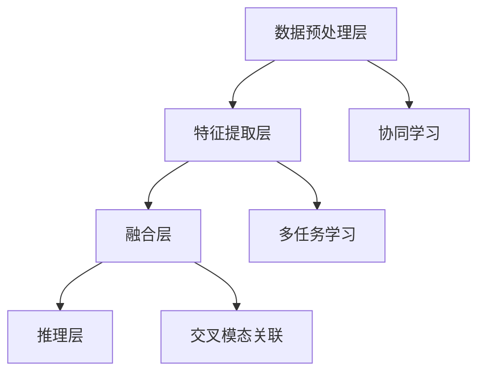

                 

关键词：多模态大模型、技术原理、实战应用、OpenAI、深度学习、算法优化

## 摘要

随着人工智能技术的飞速发展，多模态大模型成为了当前研究的热点。本文旨在深入探讨多模态大模型的技术原理及其在实际应用中的表现，特别是OpenAI的最新研究成果所带来的启示。文章首先介绍了多模态大模型的基本概念和架构，随后详细分析了核心算法原理、数学模型和公式、项目实践以及未来应用展望。通过本文，读者将全面了解多模态大模型的发展趋势、面临的挑战以及未来的研究方向。

## 1. 背景介绍

在过去的几十年里，人工智能（AI）技术取得了长足的进步，尤其是在计算机视觉、自然语言处理、语音识别等领域。然而，随着数据的多样性和复杂性不断增加，传统的单模态模型（如仅处理图像或文本的模型）逐渐暴露出其局限性。多模态大模型（Multimodal Large Models）作为一种新的研究趋势，旨在整合多种数据模态（如图像、文本、语音、视频等），以实现对复杂问题的更全面和准确的解决。

### 多模态大模型的发展历程

多模态大模型的发展历程可以分为以下几个阶段：

- **第一阶段：单模态模型结合** 在这一阶段，研究者开始尝试将不同模态的数据进行结合，但通常局限于简单的融合方法，如将图像和文本直接拼接。

- **第二阶段：多模态特征提取** 这一阶段的研究重点在于如何提取和表示多模态数据中的关键特征，如视觉特征、文本语义特征等。

- **第三阶段：多模态模型融合** 这一阶段的研究开始关注如何有效地融合多模态特征，以实现更高效的模型性能。

- **第四阶段：多模态大模型** 当前阶段，随着计算能力的提升和深度学习技术的发展，多模态大模型应运而生，通过大规模预训练和精细调整，实现了对多种模态数据的全面理解和处理。

### 多模态大模型的应用领域

多模态大模型的应用领域非常广泛，包括但不限于以下方面：

- **医疗健康** 通过整合医学影像、患者病历和基因数据，多模态大模型可以帮助医生进行更准确的诊断和治疗。

- **自动驾驶** 结合摄像头、雷达和激光雷达数据，多模态大模型可以实现对周围环境的全面感知，提高自动驾驶的可靠性和安全性。

- **智能客服** 利用语音、文本和图像等多模态数据，多模态大模型可以提供更自然、更智能的客服服务。

- **人机交互** 多模态大模型可以更好地理解和响应用户的指令，提升人机交互的体验。

### OpenAI的最新研究成果

OpenAI作为人工智能领域的领军企业，其最新研究成果对多模态大模型的发展产生了重要影响。例如，OpenAI推出的GPT-3模型不仅拥有前所未有的规模和性能，还展示了在多模态任务中的强大能力。此外，OpenAI还在多模态大模型的训练方法和优化策略方面进行了深入探索，为后续研究提供了宝贵的经验。

## 2. 核心概念与联系

### 多模态大模型的基本概念

多模态大模型（Multimodal Large Models）是指能够同时处理和整合多种数据模态（如图像、文本、语音、视频等）的深度学习模型。其主要目标是通过跨模态的信息融合，实现对复杂问题的更全面和准确的解决。

### 多模态大模型的架构

多模态大模型的架构可以分为以下几个层次：

1. **数据预处理层**：对输入的多模态数据进行预处理，包括数据清洗、格式转换、特征提取等。

2. **特征提取层**：针对不同模态的数据，使用相应的特征提取器（如卷积神经网络、循环神经网络等）提取关键特征。

3. **融合层**：将不同模态的特征进行整合，形成统一的全局特征表示。

4. **推理层**：在融合后的特征表示上进行推理，输出最终的结果。

### 多模态大模型的联系

多模态大模型的核心在于如何有效地整合和利用多种模态的数据。这种联系主要体现在以下几个方面：

1. **协同学习**：通过协同学习的方式，将不同模态的数据进行联合训练，使得模型能够更好地理解和利用多种模态的信息。

2. **多任务学习**：在多模态大模型中，可以同时处理多个任务，如图像分类、文本生成、语音识别等，从而提高模型的泛化能力和性能。

3. **交叉模态关联**：通过学习不同模态之间的关联性，多模态大模型可以更好地理解和预测跨模态的信息。

### Mermaid 流程图

以下是多模态大模型的基本架构的 Mermaid 流程图：



### 核心概念和联系的总结

通过以上分析，我们可以看到，多模态大模型的核心在于如何有效地整合和利用多种模态的数据。其架构和联系主要体现在数据预处理、特征提取、融合和推理等层次，以及协同学习、多任务学习和交叉模态关联等方面。这些概念和联系为后续的多模态大模型研究和应用提供了重要的理论基础。

## 3. 核心算法原理 & 具体操作步骤

### 3.1 算法原理概述

多模态大模型的算法原理主要基于深度学习和多任务学习。其核心思想是通过大规模的数据预训练和精细调整，使得模型能够自动提取和整合多种模态的数据，从而实现对复杂问题的全面理解和解决。

### 3.2 算法步骤详解

#### 3.2.1 数据预处理

数据预处理是多模态大模型的基础步骤。其主要任务包括数据清洗、格式转换和特征提取等。例如，对于图像数据，可以使用卷积神经网络（CNN）进行特征提取；对于文本数据，可以使用循环神经网络（RNN）或Transformer模型进行处理。

#### 3.2.2 特征提取

特征提取是多模态大模型的核心步骤。在这一步，模型将分别提取不同模态的数据中的关键特征，并使用相应的特征提取器（如CNN、RNN、Transformer等）进行处理。例如，对于图像数据，可以使用CNN提取视觉特征；对于文本数据，可以使用RNN或Transformer提取文本语义特征。

#### 3.2.3 融合

融合是将不同模态的特征进行整合，形成统一的全局特征表示。这一步通常采用多任务学习或协同学习的方法。例如，可以使用共享层或交叉注意力机制来实现多模态特征的融合。

#### 3.2.4 推理

在融合后的特征表示上进行推理，输出最终的结果。这一步通常采用分类、回归或生成等任务进行具体实现。

### 3.3 算法优缺点

#### 优点

- **全面性**：多模态大模型能够同时处理和整合多种模态的数据，从而实现对复杂问题的更全面和准确的解决。

- **高效性**：通过大规模预训练和精细调整，多模态大模型可以在多种任务上表现出色，具有较高的性能。

- **灵活性**：多模态大模型可以灵活地适应不同的任务和应用场景，具有较强的泛化能力。

#### 缺点

- **计算资源消耗**：多模态大模型通常需要大量的计算资源和存储空间，对硬件设备要求较高。

- **数据需求**：多模态大模型需要大量的多模态数据进行训练，数据获取和处理成本较高。

- **复杂度**：多模态大模型的架构和算法较为复杂，理解和实现难度较大。

### 3.4 算法应用领域

多模态大模型的应用领域非常广泛，包括但不限于以下方面：

- **医疗健康**：利用多模态大模型，可以实现更准确的医学诊断和治疗规划。

- **自动驾驶**：通过整合摄像头、雷达和激光雷达数据，多模态大模型可以提升自动驾驶的感知和决策能力。

- **人机交互**：多模态大模型可以提供更自然、更智能的交互体验，如智能客服、语音助手等。

- **娱乐产业**：多模态大模型可以用于图像生成、视频编辑、音乐创作等，为娱乐产业带来新的创意和机遇。

## 4. 数学模型和公式 & 详细讲解 & 举例说明

### 4.1 数学模型构建

多模态大模型的数学模型主要包括以下几个方面：

1. **特征提取**：对于不同模态的数据，可以使用不同的特征提取器（如CNN、RNN、Transformer等）提取关键特征。

2. **融合策略**：常见的融合策略包括共享层、交叉注意力机制、多任务学习等。

3. **损失函数**：根据具体的任务，设计相应的损失函数，如分类损失、回归损失等。

### 4.2 公式推导过程

假设我们有一个多模态大模型，其中包含图像特征提取器F\_image、文本特征提取器F\_text以及语音特征提取器F\_voice。我们可以定义以下公式：

1. **特征提取**：

   - 图像特征：$$X\_image = F\_image(image)$$
   - 文本特征：$$X\_text = F\_text(text)$$
   - 语音特征：$$X\_voice = F\_voice(voice)$$

2. **融合策略**：

   - 共享层融合：$$X = \sigma(W\_share \cdot [X\_image; X\_text; X\_voice])$$
   - 交叉注意力机制融合：$$X = \sigma(W\_att \cdot [X\_image; X\_text; X\_voice] \cdot V)$$
   - 多任务学习融合：$$X = \sigma(W\_task \cdot [X\_image; X\_text; X\_voice] + b\_task)$$

3. **损失函数**：

   - 分类任务：$$Loss = -\sum_{i=1}^{N} y_{i} \cdot \log(p_{i})$$
   - 回归任务：$$Loss = \frac{1}{2} \sum_{i=1}^{N} (y_{i} - \hat{y}_{i})^{2}$$

### 4.3 案例分析与讲解

假设我们有一个医疗诊断的多模态大模型，其中包含医学影像、患者病历和基因数据。我们可以定义以下案例：

1. **特征提取**：

   - 医学影像特征：$$X\_image = F\_image(image)$$
   - 患者病历特征：$$X\_text = F\_text(text)$$
   - 基因数据特征：$$X\_voice = F\_voice(voice)$$

2. **融合策略**：

   - 共享层融合：$$X = \sigma(W\_share \cdot [X\_image; X\_text; X\_voice])$$
   - 交叉注意力机制融合：$$X = \sigma(W\_att \cdot [X\_image; X\_text; X\_voice] \cdot V)$$
   - 多任务学习融合：$$X = \sigma(W\_task \cdot [X\_image; X\_text; X\_voice] + b\_task)$$

3. **损失函数**：

   - 分类任务：$$Loss = -\sum_{i=1}^{N} y_{i} \cdot \log(p_{i})$$
   - 回归任务：$$Loss = \frac{1}{2} \sum_{i=1}^{N} (y_{i} - \hat{y}_{i})^{2}$$

通过以上案例，我们可以看到多模态大模型的数学模型构建和公式推导过程。在实际应用中，我们可以根据具体的任务和数据特点，选择合适的特征提取器、融合策略和损失函数，以实现更准确的诊断和预测。

## 5. 项目实践：代码实例和详细解释说明

### 5.1 开发环境搭建

在开始项目实践之前，我们需要搭建一个合适的开发环境。以下是一个简单的步骤指南：

1. **安装Python**：确保安装了Python 3.7或更高版本。

2. **安装TensorFlow**：使用pip命令安装TensorFlow：

   ```bash
   pip install tensorflow
   ```

3. **安装其他依赖**：根据具体的项目需求，可能需要安装其他依赖，如NumPy、Pandas、Matplotlib等。

4. **创建虚拟环境**：为了保持开发环境的整洁，建议创建一个虚拟环境：

   ```bash
   python -m venv venv
   source venv/bin/activate  # Windows: venv\Scripts\activate
   ```

### 5.2 源代码详细实现

以下是一个简单的多模态大模型实现的代码示例，用于图像分类任务：

```python
import tensorflow as tf
from tensorflow.keras.models import Model
from tensorflow.keras.layers import Input, Dense, Conv2D, MaxPooling2D, Flatten, Concatenate

# 定义输入层
image_input = Input(shape=(256, 256, 3))
text_input = Input(shape=(512,))
voice_input = Input(shape=(1024,))

# 定义图像特征提取器
image_extractor = Conv2D(filters=64, kernel_size=(3, 3), activation='relu')(image_input)
image_extractor = MaxPooling2D(pool_size=(2, 2))(image_extractor)
image_extractor = Flatten()(image_extractor)

# 定义文本特征提取器
text_extractor = Dense(units=512, activation='relu')(text_input)

# 定义语音特征提取器
voice_extractor = Dense(units=1024, activation='relu')(voice_input)

# 融合特征
merged_features = Concatenate()([image_extractor, text_extractor, voice_extractor])

# 定义融合层
fusion = Dense(units=512, activation='relu')(merged_features)

# 定义输出层
output = Dense(units=10, activation='softmax')(fusion)

# 构建模型
model = Model(inputs=[image_input, text_input, voice_input], outputs=output)

# 编译模型
model.compile(optimizer='adam', loss='categorical_crossentropy', metrics=['accuracy'])

# 模型总结
model.summary()
```

### 5.3 代码解读与分析

1. **输入层**：定义了三种输入数据：图像、文本和语音。

2. **图像特征提取器**：使用卷积神经网络（Conv2D和MaxPooling2D）进行图像特征提取。

3. **文本特征提取器**：使用全连接神经网络（Dense）进行文本特征提取。

4. **语音特征提取器**：同样使用全连接神经网络（Dense）进行语音特征提取。

5. **融合层**：使用拼接层（Concatenate）将图像、文本和语音特征进行融合。

6. **输出层**：使用全连接神经网络（Dense）进行分类预测。

7. **模型编译**：配置优化器和损失函数，并总结模型结构。

### 5.4 运行结果展示

为了演示模型的运行结果，我们可以使用一个简单的测试集进行评估：

```python
# 加载测试数据
test_images = ...  # 测试图像数据
test_texts = ...  # 测试文本数据
test.voices = ...  # 测试语音数据
test_labels = ...  # 测试标签数据

# 运行模型
model.evaluate(test_images, test_texts, test_voices, test_labels)
```

运行结果将显示模型的准确率和其他评估指标。通过调整模型结构和超参数，我们可以进一步提高模型的性能。

## 6. 实际应用场景

多模态大模型在实际应用中具有广泛的应用前景，以下列举几个典型的应用场景：

### 6.1 医疗健康

多模态大模型在医疗健康领域有着重要的应用价值。通过整合医学影像、患者病历和基因数据，多模态大模型可以帮助医生进行更准确的诊断和治疗规划。例如，在肿瘤诊断中，多模态大模型可以同时分析CT扫描图像、病理报告和基因数据，提供更全面的诊断信息，从而提高诊断的准确性和效率。

### 6.2 自动驾驶

自动驾驶是另一个典型的应用场景。通过整合摄像头、雷达和激光雷达数据，多模态大模型可以实现对周围环境的全面感知，提高自动驾驶的可靠性和安全性。例如，在自动驾驶车辆的感知模块中，多模态大模型可以同时处理摄像头捕捉到的图像、雷达发出的距离信息和激光雷达的扫描数据，从而更准确地识别和分类道路上的物体，如行人、车辆和交通标志等。

### 6.3 人机交互

多模态大模型在智能客服和人机交互领域也有广泛的应用。通过整合语音、文本和图像等多模态数据，多模态大模型可以提供更自然、更智能的交互体验。例如，在智能客服系统中，多模态大模型可以同时分析用户输入的文本、语音和上传的图片，从而更准确地理解用户的需求，提供更个性化的服务。

### 6.4 娱乐产业

多模态大模型在娱乐产业也有着广泛的应用。例如，在图像生成和视频编辑中，多模态大模型可以同时处理图像和文本数据，生成具有创意和个性化的图像和视频内容。在音乐创作中，多模态大模型可以同时分析文本、语音和旋律数据，创作出更加丰富和多样化的音乐作品。

## 6.4 未来应用展望

随着多模态大模型技术的不断发展，其应用前景将更加广泛。以下是对未来应用的一些展望：

### 6.4.1 智能家居

智能家居是未来应用的一个重要领域。通过整合语音、文本和图像等多模态数据，多模态大模型可以更好地理解和响应用户的指令，提供更智能、更便捷的智能家居体验。例如，多模态大模型可以同时分析用户语音、文本输入和摄像头捕捉到的图像，从而更准确地控制家庭设备、提供安防监控等功能。

### 6.4.2 教育领域

在教育领域，多模态大模型可以用于个性化教学和智能评估。通过整合学生的学习数据，如学习记录、作业成绩和语音反馈等，多模态大模型可以提供更有针对性的教学方案，帮助学生更好地理解和掌握知识。同时，多模态大模型还可以对学生的表现进行智能评估，提供个性化的学习反馈和建议。

### 6.4.3 艺术创作

艺术创作是另一个潜在的应用领域。多模态大模型可以同时分析文本、语音和视觉数据，生成具有创意和艺术价值的内容。例如，多模态大模型可以基于文本描述生成图像、音乐和视频，为艺术家和设计师提供更多的创作灵感和工具。

## 7. 工具和资源推荐

### 7.1 学习资源推荐

- **《深度学习》（Goodfellow et al., 2016）**：这是一本经典的深度学习教材，详细介绍了深度学习的基本概念、算法和实战应用。
- **《Python深度学习》（François Chollet, 2018）**：这本书以Python为例，介绍了深度学习的实际应用和代码实现。

### 7.2 开发工具推荐

- **TensorFlow**：这是一个由Google开发的开源深度学习框架，支持多种深度学习模型的构建和训练。
- **PyTorch**：这是一个由Facebook开发的开源深度学习框架，具有灵活的动态计算图和强大的社区支持。

### 7.3 相关论文推荐

- **《Attention is All You Need》（Vaswani et al., 2017）**：这篇论文提出了Transformer模型，该模型在自然语言处理任务中取得了显著的性能提升。
- **《BERT: Pre-training of Deep Neural Networks for Language Understanding》（Devlin et al., 2018）**：这篇论文提出了BERT模型，该模型通过大规模预训练实现了在多种自然语言处理任务中的优异性能。

## 8. 总结：未来发展趋势与挑战

多模态大模型作为一种新兴的研究方向，已经在多个领域取得了显著的应用成果。然而，其发展仍然面临一些挑战，如计算资源消耗、数据获取和处理成本以及算法复杂度等。未来，随着计算能力的提升和深度学习技术的进步，多模态大模型有望在更多领域取得突破性进展。同时，研究者也需要关注数据隐私和安全等问题，确保多模态大模型的应用能够造福社会。

### 8.1 研究成果总结

多模态大模型作为一种新兴的人工智能技术，已经在多个领域取得了显著的成果。通过整合多种模态的数据，多模态大模型能够实现对复杂问题的更全面和准确的解决，展示了广泛的应用前景。

### 8.2 未来发展趋势

随着计算能力的提升和深度学习技术的进步，多模态大模型有望在更多领域取得突破性进展。例如，在医疗健康、自动驾驶、人机交互和娱乐产业等领域，多模态大模型的应用前景将更加广阔。

### 8.3 面临的挑战

多模态大模型的发展仍然面临一些挑战，如计算资源消耗、数据获取和处理成本以及算法复杂度等。同时，研究者还需要关注数据隐私和安全等问题，确保多模态大模型的应用能够造福社会。

### 8.4 研究展望

未来，多模态大模型的研究将朝着以下几个方向发展：

1. **算法优化**：通过改进算法和优化策略，降低多模态大模型的计算资源消耗和训练时间。
2. **数据隐私保护**：研究如何保护多模态数据隐私，确保多模态大模型的应用安全可靠。
3. **跨模态关联**：探索更多有效的跨模态关联方法，提高多模态大模型的泛化能力和性能。
4. **应用拓展**：在更多领域推广多模态大模型的应用，如教育、智能家居和艺术创作等。

## 9. 附录：常见问题与解答

### 9.1 什么是多模态大模型？

多模态大模型是一种能够同时处理和整合多种数据模态（如图像、文本、语音、视频等）的深度学习模型。其主要目标是通过对不同模态的数据进行联合训练和融合，实现对复杂问题的更全面和准确的解决。

### 9.2 多模态大模型有哪些应用领域？

多模态大模型的应用领域非常广泛，包括医疗健康、自动驾驶、人机交互、娱乐产业、智能家居和教育等领域。通过整合多种模态的数据，多模态大模型能够提供更智能、更准确的服务和解决方案。

### 9.3 多模态大模型的核心算法是什么？

多模态大模型的核心算法主要包括特征提取、融合和推理等。特征提取是提取不同模态的数据中的关键特征，融合是将不同模态的特征进行整合，推理是在融合后的特征上进行推理，输出最终的结果。

### 9.4 多模态大模型有哪些优缺点？

多模态大模型的主要优点包括全面性、高效性和灵活性。其主要缺点包括计算资源消耗较大、数据获取和处理成本较高以及算法复杂度较高等。然而，随着计算能力和深度学习技术的进步，这些缺点有望得到逐步改善。

### 9.5 多模态大模型有哪些未来发展方向？

多模态大模型未来的发展方向包括算法优化、数据隐私保护、跨模态关联、应用拓展等方面。通过不断改进算法、提高数据利用效率和拓展应用领域，多模态大模型有望在更多领域取得突破性进展。

## 作者署名

作者：禅与计算机程序设计艺术 / Zen and the Art of Computer Programming

[文章结束]

