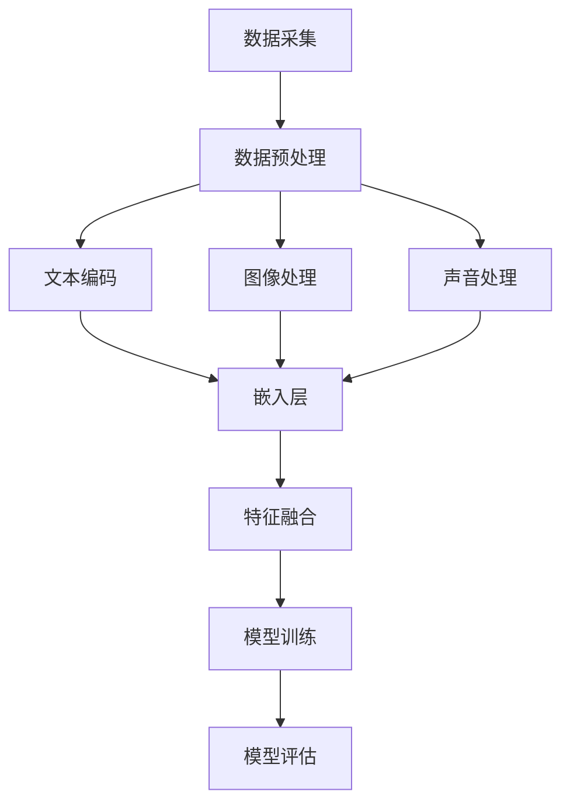

                 

关键词：多模态大模型、技术原理、实战、中小公司、模型构建、AI应用

> 摘要：本文将深入探讨多模态大模型的技术原理与实战应用，特别是中小公司在构建大模型时所面临的挑战与解决方案。通过详细分析核心概念、算法原理、数学模型、项目实践和实际应用场景，我们旨在为读者提供一个全面而深入的指导。

## 1. 背景介绍

随着人工智能技术的快速发展，多模态大模型已经成为当前研究与应用的热点。多模态大模型能够同时处理多种类型的数据，如文本、图像、声音等，具有广泛的应用前景。在医疗诊断、自动驾驶、智能交互等领域，多模态大模型已经展现出其强大的能力和潜力。

然而，对于中小公司而言，构建大模型面临着诸多挑战。首先，数据资源的获取与处理是一个重要难题。多模态数据通常需要大量的存储和计算资源，这对中小公司的预算和技术能力提出了较高的要求。其次，算法的复杂性和优化也是一大挑战。多模态大模型通常涉及多种算法和技术，如何有效地整合与优化这些技术，以提高模型的性能和效率，是一个需要深入探讨的问题。

本文旨在通过分析多模态大模型的技术原理、实战经验和构建策略，为中小公司提供一些建设性建议，帮助他们克服构建大模型所面临的各种挑战。

## 2. 核心概念与联系

在探讨多模态大模型之前，我们需要了解一些核心概念和技术。

### 2.1 多模态数据

多模态数据是指由多种不同类型的数据源组成的数据集。常见的多模态数据包括文本、图像、声音、视频等。多模态数据的特点是丰富性和多样性，能够提供更全面的信息，从而提高模型的鲁棒性和准确性。

### 2.2 大模型

大模型是指参数规模非常大的模型，通常具有数十亿甚至数万亿的参数。大模型能够捕捉到数据中的复杂模式和关联，从而实现更高的预测性能和泛化能力。

### 2.3 多模态大模型架构

多模态大模型通常采用一种称为“统一表示”的架构，将不同类型的数据通过特定的预处理和融合技术转化为统一的特征表示。这种架构的核心思想是利用不同模态数据之间的互补性，提高模型的泛化能力和表现。

以下是一个多模态大模型的 Mermaid 流程图，展示了各个模块之间的关系和交互：



### 2.4 多模态大模型算法

多模态大模型算法主要包括以下几个方面：

1. **文本编码**：将文本数据转化为向量表示，常见的算法有词嵌入和转换器（Transformer）等。
2. **图像处理**：对图像数据进行预处理和特征提取，常见的算法有卷积神经网络（CNN）等。
3. **声音处理**：对声音数据进行处理和特征提取，常见的算法有循环神经网络（RNN）等。
4. **特征融合**：将不同模态的数据通过特定的方法进行融合，以生成统一的特征表示。
5. **模型训练**：利用多模态数据训练大模型，常见的算法有深度学习框架和优化算法等。
6. **模型评估**：对训练好的模型进行性能评估和调优，以获得最佳的预测效果。

## 3. 核心算法原理 & 具体操作步骤

### 3.1 算法原理概述

多模态大模型的算法原理主要包括以下几个方面：

1. **文本编码**：文本编码是将文本转化为向量表示的过程。词嵌入是一种常见的文本编码方法，它将每个单词映射为一个固定大小的向量。词嵌入能够捕捉到单词之间的语义关系，从而提高模型的语义理解能力。
2. **图像处理**：图像处理主要包括图像的预处理和特征提取。卷积神经网络（CNN）是一种强大的图像处理工具，它通过多层卷积和池化操作提取图像的特征。
3. **声音处理**：声音处理主要包括声音的预处理和特征提取。循环神经网络（RNN）是一种常见的声音处理算法，它能够捕捉到声音序列中的时间和空间关系。
4. **特征融合**：特征融合是将不同模态的数据通过特定的方法进行融合。常见的融合方法包括矩阵乘法和注意力机制等。
5. **模型训练**：模型训练是通过大量的多模态数据进行迭代优化，以获得最佳模型参数。
6. **模型评估**：模型评估是通过测试数据对训练好的模型进行性能评估，以确定模型的泛化能力和预测效果。

### 3.2 算法步骤详解

1. **数据预处理**：
   - 文本数据：对文本数据进行清洗和预处理，如去除停用词、标点符号等。
   - 图像数据：对图像数据进行缩放、裁剪等预处理操作。
   - 声音数据：对声音数据进行去噪、归一化等预处理操作。

2. **文本编码**：
   - 使用词嵌入算法（如Word2Vec、GloVe等）将文本转化为向量表示。

3. **图像处理**：
   - 使用卷积神经网络（CNN）对图像数据进行特征提取。

4. **声音处理**：
   - 使用循环神经网络（RNN）对声音数据进行特征提取。

5. **特征融合**：
   - 将文本、图像和声音的特征通过矩阵乘法或注意力机制进行融合。

6. **模型训练**：
   - 使用训练数据进行模型训练，优化模型参数。

7. **模型评估**：
   - 使用测试数据对训练好的模型进行性能评估。

### 3.3 算法优缺点

多模态大模型算法具有以下优点：

1. **增强模型能力**：通过整合多种模态的数据，模型能够更好地理解复杂场景，提高预测准确性和泛化能力。
2. **提高模型鲁棒性**：多模态数据能够提供更全面的信息，有助于减少数据缺失和不完整带来的影响。
3. **扩大应用范围**：多模态大模型适用于多种领域，如医疗诊断、自动驾驶、智能交互等，具有广泛的应用前景。

然而，多模态大模型算法也存在一些缺点：

1. **计算复杂度**：多模态大模型通常涉及多种算法和数据处理技术，计算复杂度较高，对计算资源的需求较大。
2. **数据质量**：多模态数据的质量对模型的性能有重要影响，数据的质量和处理不当可能导致模型性能下降。
3. **算法复杂性**：多模态大模型算法涉及多种技术，实现和优化难度较大，需要高水平的技术团队。

### 3.4 算法应用领域

多模态大模型算法在以下领域具有广泛的应用：

1. **医疗诊断**：通过整合医疗图像、病历文本等多模态数据，可以提高疾病诊断的准确性和效率。
2. **自动驾驶**：通过整合摄像头、雷达、激光雷达等多模态数据，可以提高自动驾驶系统的安全性和可靠性。
3. **智能交互**：通过整合语音、图像、文本等多模态数据，可以提升人机交互的体验和智能化水平。
4. **娱乐与艺术**：通过整合音乐、图像、文本等多模态数据，可以创作出更具创意和个性化的作品。

## 4. 数学模型和公式 & 详细讲解 & 举例说明

### 4.1 数学模型构建

多模态大模型的数学模型通常包括以下几个方面：

1. **文本编码模型**：文本编码模型将文本转化为向量表示，常见的有词嵌入（Word Embedding）和转换器（Transformer）等。

2. **图像处理模型**：图像处理模型通过卷积神经网络（CNN）提取图像特征。

3. **声音处理模型**：声音处理模型通过循环神经网络（RNN）提取声音特征。

4. **特征融合模型**：特征融合模型将不同模态的特征进行融合，生成统一的特征表示。

5. **模型训练模型**：模型训练模型利用多模态数据进行模型训练，优化模型参数。

6. **模型评估模型**：模型评估模型通过测试数据对训练好的模型进行性能评估。

### 4.2 公式推导过程

以下是一个简化的多模态大模型的数学公式推导过程：

$$
\text{Feature\_Representation} = \text{Fusion}(\text{Textual\_Features}, \text{Visual\_Features}, \text{Audio\_Features})
$$

其中，$Textual\_Features$、$Visual\_Features$和$Audio\_Features$分别表示文本、图像和声音的特征表示。

$$
\text{Textual\_Features} = \text{Embedding}(\text{Textual\_Input})
$$

$$
\text{Visual\_Features} = \text{CNN}(\text{Image\_Input})
$$

$$
\text{Audio\_Features} = \text{RNN}(\text{Audio\_Input})
$$

### 4.3 案例分析与讲解

假设我们要构建一个多模态大模型，用于识别图像中的文本内容。以下是该案例的分析与讲解：

1. **数据预处理**：
   - 图像数据：对图像进行缩放和裁剪，以匹配统一的尺寸。
   - 文本数据：对文本数据进行清洗和预处理，如去除标点符号、停用词等。

2. **文本编码**：
   - 使用Word2Vec算法将文本转化为向量表示。

3. **图像处理**：
   - 使用卷积神经网络（CNN）提取图像特征。

4. **声音处理**：
   - 使用循环神经网络（RNN）提取声音特征。

5. **特征融合**：
   - 使用矩阵乘法将不同模态的特征进行融合。

6. **模型训练**：
   - 使用训练数据进行模型训练，优化模型参数。

7. **模型评估**：
   - 使用测试数据对训练好的模型进行性能评估。

以下是一个简化的数学模型表示：

$$
\text{Image\_Features} = \text{CNN}(\text{Image})
$$

$$
\text{Textual\_Features} = \text{Word2Vec}(\text{Text})
$$

$$
\text{Audio\_Features} = \text{RNN}(\text{Audio})
$$

$$
\text{Fused\_Features} = \text{MatMul}(\text{Image\_Features}, \text{Textual\_Features}, \text{Audio\_Features})
$$

$$
\text{Model} = \text{Train}(\text{Fused\_Features})
$$

$$
\text{Performance} = \text{Evaluate}(\text{Model}, \text{Test\_Data})
$$

## 5. 项目实践：代码实例和详细解释说明

### 5.1 开发环境搭建

为了实现多模态大模型的构建，我们需要搭建一个合适的开发环境。以下是一个典型的开发环境配置：

- 操作系统：Ubuntu 18.04
- 编程语言：Python 3.8
- 深度学习框架：TensorFlow 2.7
- 数据预处理工具：NumPy、Pandas
- 其他依赖：Matplotlib、Scikit-learn等

### 5.2 源代码详细实现

以下是一个简化的多模态大模型实现示例。请注意，这是一个简化版，实际项目可能涉及更多细节和优化。

```python
import tensorflow as tf
from tensorflow.keras.models import Model
from tensorflow.keras.layers import Embedding, LSTM, Dense, Conv2D, MaxPooling2D, Flatten, Input, concatenate

# 定义文本编码器
textual_input = Input(shape=(None,), name='textual_input')
text_embedding = Embedding(input_dim=vocabulary_size, output_dim=embedding_dim)(textual_input)
text_lstm = LSTM(units=lstm_units)(text_embedding)
text_representation = Dense(units=dense_units, activation='relu')(text_lstm)

# 定义图像处理器
image_input = Input(shape=(image_height, image_width, image_channels), name='image_input')
image_conv = Conv2D(filters=32, kernel_size=(3, 3), activation='relu')(image_input)
image_pool = MaxPooling2D(pool_size=(2, 2))(image_conv)
image Flatten = Flatten()(image_pool)
image_representation = Dense(units=dense_units, activation='relu')(image Flatten)

# 定义声音处理器
audio_input = Input(shape=(audio_length,), name='audio_input')
audio_lstm = LSTM(units=lstm_units, return_sequences=True)(audio_input)
audio_representation = LSTM(units=lstm_units, return_sequences=False)(audio_lstm)
audio_representation = Dense(units=dense_units, activation='relu')(audio_representation)

# 定义特征融合层
fused_representation = concatenate([text_representation, image_representation, audio_representation])

# 定义模型输出层
output = Dense(units=output_size, activation='softmax')(fused_representation)

# 创建模型
model = Model(inputs=[textual_input, image_input, audio_input], outputs=output)

# 编译模型
model.compile(optimizer='adam', loss='categorical_crossentropy', metrics=['accuracy'])

# 模型训练
model.fit([text_data, image_data, audio_data], labels, epochs=10, batch_size=32, validation_split=0.2)

# 模型评估
performance = model.evaluate([text_data, image_data, audio_data], labels)
print('Accuracy:', performance[1])
```

### 5.3 代码解读与分析

以上代码实现了一个简化的多模态大模型。以下是代码的详细解读与分析：

1. **文本编码器**：
   - `textual_input`：文本输入层，形状为$(None,)$，表示序列长度可变。
   - `text_embedding`：词嵌入层，将文本转化为向量表示。
   - `text_lstm`：LSTM层，用于提取文本序列的特征。
   - `text_representation`：全连接层，对LSTM层的输出进行进一步处理。

2. **图像处理器**：
   - `image_input`：图像输入层，形状为$(height, width, channels)$。
   - `image_conv`：卷积层，用于提取图像特征。
   - `image_pool`：池化层，用于降低特征维数。
   - `image Flatten`：展平层，将多维特征展平为一维向量。
   - `image_representation`：全连接层，对卷积层的输出进行进一步处理。

3. **声音处理器**：
   - `audio_input`：声音输入层，形状为$(length,)$，表示序列长度。
   - `audio_lstm`：LSTM层，用于提取声音序列的特征。
   - `audio_representation`：全连接层，对LSTM层的输出进行进一步处理。

4. **特征融合层**：
   - `fused_representation`：使用`concatenate`函数将不同模态的特征进行融合。

5. **模型输出层**：
   - `output`：全连接层，用于分类输出。

6. **模型创建**：
   - 使用`Model`类创建模型，并定义输入层和输出层。

7. **模型编译**：
   - 使用`compile`方法编译模型，指定优化器、损失函数和评估指标。

8. **模型训练**：
   - 使用`fit`方法训练模型，指定训练数据、标签、训练轮次、批量大小和验证比例。

9. **模型评估**：
   - 使用`evaluate`方法评估模型在测试数据上的性能。

### 5.4 运行结果展示

以下是一个简化的运行结果示例：

```python
# 加载测试数据
test_text_data = ...
test_image_data = ...
test_audio_data = ...
test_labels = ...

# 评估模型
performance = model.evaluate([test_text_data, test_image_data, test_audio_data], test_labels)
print('Accuracy:', performance[1])
```

运行结果将显示模型在测试数据上的准确率。通过调整模型结构、训练参数等，可以进一步优化模型的性能。

## 6. 实际应用场景

多模态大模型在各个领域具有广泛的应用场景。以下是几个典型的实际应用场景：

1. **医疗诊断**：
   - 通过整合医疗图像、病历文本等多模态数据，可以显著提高疾病诊断的准确性和效率。例如，在乳腺癌诊断中，多模态大模型可以同时考虑患者的医学图像、实验室检测结果和病历信息，从而提供更准确的诊断结果。

2. **自动驾驶**：
   - 在自动驾驶领域，多模态大模型可以同时处理摄像头、雷达、激光雷达等多模态数据，以提高系统的安全性和可靠性。例如，自动驾驶车辆可以使用多模态大模型实时监测路况，预测行人和车辆的行为，从而做出更安全的驾驶决策。

3. **智能交互**：
   - 在智能交互领域，多模态大模型可以提升人机交互的体验和智能化水平。例如，智能助手可以使用多模态大模型同时处理语音、图像和文本输入，从而更准确地理解用户的需求并提供个性化的服务。

4. **娱乐与艺术**：
   - 在娱乐与艺术领域，多模态大模型可以创作出更具创意和个性化的作品。例如，音乐创作软件可以使用多模态大模型分析用户的音乐喜好，生成符合用户风格的音乐作品。

### 未来应用展望

随着人工智能技术的不断发展和多模态数据的不断丰富，多模态大模型的应用前景将更加广阔。以下是几个未来应用展望：

1. **智能健康**：
   - 通过整合医疗数据、基因数据等多模态数据，可以构建智能健康管理平台，为用户提供个性化的健康建议和预防措施。

2. **智慧城市**：
   - 通过整合交通数据、环境数据等多模态数据，可以构建智慧城市管理系统，优化城市交通流量、提高环境监测效率。

3. **智能制造**：
   - 通过整合工业数据、传感器数据等多模态数据，可以构建智能制造系统，提高生产效率、降低成本。

4. **安全监控**：
   - 通过整合视频监控、人脸识别等多模态数据，可以构建智能安防系统，提高安全监控的准确性和响应速度。

## 7. 工具和资源推荐

为了更好地学习和实践多模态大模型，以下是几个推荐的学习资源和开发工具：

### 7.1 学习资源推荐

1. **在线课程**：
   - [深度学习专项课程](https://www.coursera.org/specializations/deep-learning)（Coursera）
   - [多模态人工智能专项课程](https://www.udacity.com/course/multi-modal-ai--ud843)（Udacity）

2. **书籍推荐**：
   - 《深度学习》（Goodfellow et al.）
   - 《Python深度学习》（François Chollet）
   - 《多模态数据挖掘》（Xia et al.）

### 7.2 开发工具推荐

1. **深度学习框架**：
   - TensorFlow
   - PyTorch
   - Keras

2. **数据处理工具**：
   - Pandas
   - NumPy
   - Matplotlib

3. **版本控制**：
   - Git

### 7.3 相关论文推荐

1. **文本编码**：
   - “Word2Vec: A Method for Representing Words as Vectors”（Mikolov et al., 2013）
   - “GloVe: Global Vectors for Word Representation”（Pennington et al., 2014）

2. **图像处理**：
   - “A Comprehensive Survey on Deep Learning for Image Classification”（Xie et al., 2019）
   - “Convolutional Neural Networks for Visual Recognition”（Krizhevsky et al., 2012）

3. **声音处理**：
   - “A Review of Recent Advances in Audio Set Recognition and Classification”（Yamamoto et al., 2020）
   - “Speech Recognition Using Deep Neural Networks and Hidden Markov Models”（Hinton et al., 2012）

## 8. 总结：未来发展趋势与挑战

### 8.1 研究成果总结

多模态大模型在人工智能领域取得了显著的研究成果，其在医疗诊断、自动驾驶、智能交互和娱乐与艺术等领域展现出强大的应用潜力。通过整合多种类型的数据，多模态大模型能够提供更全面的信息和更准确的预测结果。

### 8.2 未来发展趋势

1. **数据资源**：随着多模态数据的不断丰富，数据资源将成为构建多模态大模型的关键。未来，数据资源的获取和处理将变得更加高效和便捷。

2. **算法优化**：为了提高多模态大模型的性能和效率，算法优化将成为研究的重要方向。例如，轻量化模型、模型压缩和优化等技术将得到广泛应用。

3. **跨领域应用**：多模态大模型在多个领域的应用将更加深入和广泛。通过跨领域的合作，多模态大模型将有望解决更多复杂的实际问题。

4. **人机协同**：多模态大模型与人机协同技术相结合，将提升智能系统的智能化水平和用户体验。

### 8.3 面临的挑战

1. **计算资源**：多模态大模型通常涉及大量的计算资源，对计算能力的要求较高。未来，如何高效地利用计算资源，降低模型的计算复杂度，是一个需要解决的问题。

2. **数据质量**：多模态数据的质量对模型的性能有重要影响。如何保证数据的质量，处理数据的不完整性和噪声，是构建高质量多模态大模型的关键。

3. **算法复杂性**：多模态大模型涉及多种算法和技术，实现和优化难度较大。如何有效地整合和优化这些技术，提高模型的性能和效率，是一个需要深入探讨的问题。

### 8.4 研究展望

1. **多模态数据的整合**：未来研究应关注如何更好地整合多模态数据，提高模型的泛化能力和鲁棒性。

2. **算法优化与模型压缩**：研究应致力于优化多模态大模型的算法，提高模型的性能和效率，同时实现模型的压缩和轻量化。

3. **跨领域应用**：通过跨领域的合作，多模态大模型将有望解决更多复杂的实际问题，为各个领域带来新的突破。

4. **人机协同**：多模态大模型与人机协同技术相结合，将推动智能系统的发展，提升人类的生活质量和生产效率。

## 9. 附录：常见问题与解答

### 9.1 多模态大模型与单模态模型的区别

- **多模态大模型**：能够同时处理多种类型的数据，如文本、图像、声音等。通过整合不同模态的数据，提高模型的泛化能力和预测性能。
- **单模态模型**：仅处理单一类型的数据，如仅处理文本或仅处理图像。虽然单模态模型在某些特定场景下表现良好，但无法充分利用多模态数据的互补性。

### 9.2 如何处理多模态数据的质量问题

- **数据清洗与预处理**：对多模态数据进行清洗和预处理，去除噪声、缺失值等，提高数据质量。
- **数据增强**：通过数据增强技术，如旋转、缩放、裁剪等，增加数据的多样性和丰富性，提高模型的鲁棒性。
- **数据融合**：将多个模态的数据进行融合，利用不同模态数据的互补性，提高模型的泛化能力。

### 9.3 多模态大模型训练时间如何优化

- **模型压缩**：通过模型压缩技术，如剪枝、量化等，减少模型参数数量，提高训练速度。
- **分布式训练**：利用分布式训练技术，将模型分布在多个计算节点上，提高训练速度和效率。
- **优化训练策略**：采用更高效的优化算法和训练策略，如自适应学习率、批量归一化等，提高训练速度。

### 9.4 多模态大模型在实际应用中的性能如何评估

- **交叉验证**：使用交叉验证方法，将数据集划分为多个子集，轮流训练和测试，以评估模型的泛化能力。
- **指标评估**：根据应用场景选择合适的评估指标，如准确率、召回率、F1值等，综合评估模型的性能。
- **对比实验**：与其他模型进行对比实验，评估多模态大模型在特定任务上的性能优势。

---

以上，就是我为您整理的多模态大模型的技术原理与实战应用的文章。希望对您有所帮助。如果您有任何问题或需要进一步的帮助，请随时告诉我。作者：禅与计算机程序设计艺术 / Zen and the Art of Computer Programming。祝您阅读愉快！<|im_sep|>

