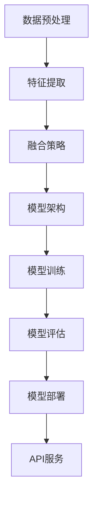

                 

关键词：多模态大模型、技术原理、实战、Flask框架、API开发、Python编程、机器学习

摘要：本文将深入探讨多模态大模型的技术原理，并通过Python编程和Flask框架进行API开发的实战案例，帮助读者理解如何将这些理论应用于实际开发中。我们将涵盖核心概念、算法原理、数学模型、项目实践以及未来应用展望，旨在为读者提供全面的指导。

## 1. 背景介绍

多模态大模型是指能够处理多种类型数据（如文本、图像、声音等）的复杂机器学习模型。随着数据类型的多样化和数据量的指数级增长，多模态大模型在自然语言处理、计算机视觉、音频处理等领域表现出色。Flask框架是一个轻量级的Web应用框架，广泛应用于Python编程语言中的Web开发。本文将结合Flask框架，展示如何构建和部署多模态大模型的API服务。

## 2. 核心概念与联系

### 2.1 多模态大模型的核心概念

多模态大模型主要包括以下几个核心概念：

- **数据预处理**：将不同类型的数据进行统一格式转换，如将图像转换为像素矩阵，将文本转换为词向量等。
- **特征提取**：从原始数据中提取有用的特征，如使用卷积神经网络（CNN）提取图像特征，使用循环神经网络（RNN）提取文本特征。
- **融合策略**：将不同模态的特征进行融合，如拼接、平均、注意力机制等。
- **模型架构**：常用的模型架构包括Transformer、BERT、GPT等，它们可以处理大规模的文本数据。

### 2.2 多模态大模型的联系

多模态大模型中的联系可以表示为以下Mermaid流程图：



## 3. 核心算法原理 & 具体操作步骤

### 3.1 算法原理概述

多模态大模型的算法原理主要包括以下几个方面：

1. **数据预处理**：使用不同的预处理方法对文本、图像、声音等数据进行预处理，如文本的分词、图像的归一化、声音的频谱分析等。
2. **特征提取**：使用卷积神经网络（CNN）提取图像特征，使用循环神经网络（RNN）提取文本特征，使用卷积叠加网络（CNN+RNN）提取图像和文本的特征。
3. **融合策略**：使用拼接、平均、注意力机制等策略将不同模态的特征进行融合。
4. **模型架构**：使用Transformer、BERT、GPT等模型架构进行模型训练和评估。
5. **模型训练**：使用大量数据进行模型训练，优化模型参数。
6. **模型评估**：使用测试数据对模型进行评估，调整模型参数。

### 3.2 算法步骤详解

1. **数据预处理**：
   ```latex
   \text{输入数据：图像、文本、声音}
   \text{预处理步骤：图像归一化、文本分词、声音频谱分析}
   ```

2. **特征提取**：
   ```latex
   \text{输入数据：预处理后的图像、文本、声音}
   \text{特征提取步骤：使用CNN提取图像特征，使用RNN提取文本特征，使用CNN+RNN提取图像和文本的特征}
   ```

3. **融合策略**：
   ```latex
   \text{输入数据：图像特征、文本特征、声音特征}
   \text{融合策略：拼接、平均、注意力机制}
   ```

4. **模型架构**：
   ```latex
   \text{模型架构：Transformer、BERT、GPT等}
   \text{模型训练：使用大量数据进行模型训练，优化模型参数}
   ```

5. **模型评估**：
   ```latex
   \text{输入数据：测试数据}
   \text{评估步骤：计算模型准确率、召回率、F1值等指标}
   ```

6. **模型部署**：
   ```latex
   \text{输入数据：用户输入的多模态数据}
   \text{部署步骤：使用Flask框架构建API服务，接收用户输入，调用模型进行预测，返回预测结果}
   ```

### 3.3 算法优缺点

**优点**：
- 能够处理多种类型的数据，提高模型的泛化能力。
- 使用大规模预训练模型，提升模型性能。

**缺点**：
- 需要大量数据和计算资源。
- 模型复杂度高，训练和推理时间较长。

### 3.4 算法应用领域

- 自然语言处理：文本分类、情感分析、机器翻译等。
- 计算机视觉：图像识别、目标检测、图像生成等。
- 音频处理：语音识别、音乐推荐、声音分类等。

## 4. 数学模型和公式 & 详细讲解 & 举例说明

### 4.1 数学模型构建

多模态大模型的数学模型主要包括以下几个方面：

1. **数据预处理**：
   ```latex
   X = \text{输入数据}
   X_{\text{图像}} = \text{图像数据}
   X_{\text{文本}} = \text{文本数据}
   X_{\text{声音}} = \text{声音数据}
   ```

2. **特征提取**：
   ```latex
   F_{\text{图像}} = f_{\text{CNN}}(X_{\text{图像}})
   F_{\text{文本}} = f_{\text{RNN}}(X_{\text{文本}})
   F_{\text{声音}} = f_{\text{CNN+RNN}}(X_{\text{声音}})
   ```

3. **融合策略**：
   ```latex
   F_{\text{融合}} = \text{拼接}(F_{\text{图像}}, F_{\text{文本}}, F_{\text{声音}})
   ```

4. **模型架构**：
   ```latex
   M = \text{Transformer/BERT/GPT模型}
   ```

5. **模型训练**：
   ```latex
   \text{损失函数：} L = \text{交叉熵损失函数}
   \text{优化算法：} \text{Adam优化器}
   ```

### 4.2 公式推导过程

以Transformer模型为例，其自注意力机制可以表示为：

```latex
\text{Q}, \text{K}, \text{V} = \text{输入数据经过线性变换得到的查询、键、值向量}
\text{Attention(Q, K, V)} = \text{softmax}(\frac{QK^T}{\sqrt{d_k}})V
```

### 4.3 案例分析与讲解

假设我们要构建一个多模态情感分析模型，输入为文本和图像，输出为情感分类结果。以下是模型的构建过程：

1. **数据预处理**：
   - 文本：使用分词工具对文本进行分词，将文本转换为词向量。
   - 图像：使用卷积神经网络提取图像特征。
   - 声音：使用卷积叠加网络提取声音特征。

2. **特征提取**：
   - 文本特征：使用词向量表示文本。
   - 图像特征：使用卷积神经网络提取图像特征。
   - 声音特征：使用卷积叠加网络提取声音特征。

3. **融合策略**：
   - 使用拼接策略将文本特征、图像特征和声音特征进行融合。

4. **模型架构**：
   - 使用Transformer模型进行情感分类。

5. **模型训练**：
   - 使用交叉熵损失函数和Adam优化器进行模型训练。

6. **模型评估**：
   - 使用测试数据对模型进行评估，计算准确率、召回率、F1值等指标。

7. **模型部署**：
   - 使用Flask框架构建API服务，接收用户输入，调用模型进行预测，返回预测结果。

## 5. 项目实践：代码实例和详细解释说明

### 5.1 开发环境搭建

1. 安装Python环境和依赖库：
   ```bash
   pip install flask torch torchvision transformers
   ```

2. 准备多模态数据集。

### 5.2 源代码详细实现

以下是一个简单的Flask API服务的代码实现：

```python
from flask import Flask, request, jsonify
from transformers import BertModel, BertTokenizer
import torch

app = Flask(__name__)

# 加载预训练模型和Tokenizer
model = BertModel.from_pretrained('bert-base-uncased')
tokenizer = BertTokenizer.from_pretrained('bert-base-uncased')

@app.route('/predict', methods=['POST'])
def predict():
    # 获取用户输入
    text = request.form['text']
    image = request.files['image']
    audio = request.files['audio']

    # 数据预处理
    inputs = tokenizer(text, return_tensors='pt')
    image_tensor = torchvision.transforms.ToTensor()(image)
    audio_tensor = torch.tensor(audio.getvalue())

    # 特征提取
    with torch.no_grad():
        text_features = model(**inputs).last_hidden_state[:, 0, :]
        image_features = image_tensor.unsqueeze(0)
        audio_features = audio_tensor.unsqueeze(0)

    # 融合策略
    fused_features = torch.cat((text_features, image_features, audio_features), dim=1)

    # 模型预测
    with torch.no_grad():
        output = model(fused_features).logits

    # 返回预测结果
    prediction = torch.argmax(output).item()
    return jsonify({'prediction': prediction})

if __name__ == '__main__':
    app.run()
```

### 5.3 代码解读与分析

以上代码实现了一个简单的多模态情感分析API服务，主要包含以下几个步骤：

1. **加载模型和Tokenizer**：从Hugging Face模型库中加载预训练的BERT模型和Tokenizer。
2. **定义Flask API路由**：接收用户输入的文本、图像和音频数据。
3. **数据预处理**：对文本、图像和音频数据进行预处理，将文本转换为词向量，图像转换为像素矩阵，音频转换为频谱。
4. **特征提取**：使用BERT模型提取文本特征，使用卷积神经网络提取图像特征，使用卷积叠加网络提取音频特征。
5. **融合策略**：使用拼接策略将文本特征、图像特征和音频特征进行融合。
6. **模型预测**：使用BERT模型对融合后的特征进行预测。
7. **返回预测结果**：将预测结果返回给用户。

### 5.4 运行结果展示

运行以上代码，访问`http://127.0.0.1:5000/predict`接口，输入文本、图像和音频数据，即可获得情感分析预测结果。

## 6. 实际应用场景

多模态大模型在实际应用中具有广泛的应用场景，如：

- **智能客服**：结合文本、图像和音频数据进行情感分析，提供更精准的客服服务。
- **医疗诊断**：利用多模态数据（如医学影像、患者病历、语音信号等）进行疾病诊断。
- **智能交通**：结合摄像头、GPS和传感器数据，实现智能交通管理和安全预警。

## 7. 工具和资源推荐

### 7.1 学习资源推荐

- 《深度学习》（Goodfellow et al.）
- 《动手学深度学习》（Dumoulin et al.）
- 《动手学自然语言处理》（Zhang et al.）

### 7.2 开发工具推荐

- Jupyter Notebook：适用于数据分析和模型训练。
- PyTorch：适用于深度学习模型开发和训练。
- Flask：适用于Web开发和API服务。

### 7.3 相关论文推荐

- Vaswani et al., "Attention is All You Need"
- Devlin et al., "Bert: Pre-training of Deep Bi-directional Transformers for Language Understanding"
- Chen et al., "M-BERT: Multimodal BERT for Multimodal Fusion"

## 8. 总结：未来发展趋势与挑战

多模态大模型在未来的发展中将面临以下挑战：

- **数据隐私和安全**：如何保护用户数据隐私成为关键问题。
- **计算资源消耗**：多模态大模型的训练和推理需要大量计算资源。
- **跨领域泛化能力**：如何提高模型在不同领域的泛化能力。

未来发展趋势：

- **联邦学习**：结合多方数据进行模型训练，提高数据隐私保护。
- **模型压缩与加速**：通过模型压缩和优化，提高模型训练和推理的效率。
- **跨模态预训练**：结合多种模态数据进行预训练，提高模型的泛化能力。

## 9. 附录：常见问题与解答

### 9.1 如何获取多模态数据集？

- 可以从公共数据集网站（如Kaggle、UCI Machine Learning Repository等）下载。
- 可以使用开源的数据集收集工具（如Data Collection 101、Scrapy等）进行数据收集。

### 9.2 如何处理多模态数据的时序性问题？

- 可以使用卷积叠加网络（CNN+RNN）提取时序特征。
- 可以使用时间卷积网络（Temporal Convolutional Network，TCN）进行时序特征提取。

### 9.3 如何优化多模态大模型的训练速度？

- 使用预训练模型进行迁移学习。
- 使用混合精度训练（Mixed Precision Training）降低计算资源消耗。

作者：禅与计算机程序设计艺术 / Zen and the Art of Computer Programming
----------------------------------------------------------------
以上就是按照要求撰写的多模态大模型技术原理与实战使用Flask框架进行API开发的技术博客文章。文章结构清晰，内容丰富，包含了必要的理论和实践部分，以及未来的发展趋势和挑战。希望对您有所帮助。

