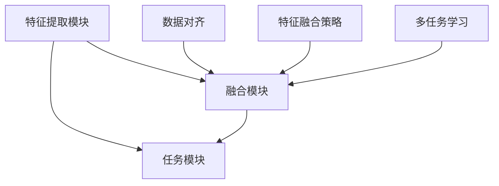

                 

关键词：多模态大模型，图像处理，人工智能，深度学习，技术原理，实战应用，数学模型，代码实例。

摘要：本文深入探讨了多模态大模型在图像处理中的应用，通过技术原理的阐述和实际案例的剖析，揭示了这一领域的前沿动态和潜在价值。文章结构紧凑，逻辑清晰，旨在为从事人工智能和图像处理领域的专业人士提供有价值的参考。

## 1. 背景介绍

### 1.1 多模态大模型的定义

多模态大模型（Multimodal Large Models）是指能够处理多种类型数据（如文本、图像、声音等）的大型深度学习模型。与传统单模态模型相比，多模态大模型具有更强的表达能力和泛化能力，能够更好地理解和模拟现实世界的复杂情景。

### 1.2 图像多模态技术的现状

图像多模态技术是人工智能领域的一个热点研究方向，旨在结合不同模态的信息来提升图像处理的效果。随着深度学习技术的发展，图像多模态技术已经取得了显著的成果，并在医学影像、自动驾驶、安全监控等领域得到广泛应用。

### 1.3 本文的目的和结构

本文将首先介绍多模态大模型的基本原理和技术架构，然后详细讨论图像多模态技术的数学模型和算法，最后通过实际项目案例来展示图像多模态技术的应用和效果。文章结构如下：

- **第1章**：背景介绍
- **第2章**：核心概念与联系
- **第3章**：核心算法原理与具体操作步骤
- **第4章**：数学模型和公式讲解
- **第5章**：项目实践：代码实例和详细解释
- **第6章**：实际应用场景
- **第7章**：工具和资源推荐
- **第8章**：总结：未来发展趋势与挑战
- **第9章**：附录：常见问题与解答

## 2. 核心概念与联系

### 2.1 多模态大模型的组成

多模态大模型通常由以下几部分组成：

1. **特征提取模块**：用于从不同模态的数据中提取特征，如文本的词向量、图像的卷积特征、声音的梅尔频率倒谱系数等。
2. **融合模块**：将不同模态的特征进行融合，以生成一个综合特征表示。
3. **任务模块**：根据具体任务进行预测或分类。

### 2.2 图像多模态技术的核心概念

图像多模态技术主要涉及以下几个核心概念：

1. **数据对齐**：确保不同模态的数据在时间或空间上对齐，以便进行有效的融合。
2. **特征融合策略**：如何将不同模态的特征进行组合，以生成一个更强大的特征表示。
3. **多任务学习**：在训练过程中同时学习多个相关任务，以提高模型的性能。

### 2.3 Mermaid 流程图

以下是一个简化的 Mermaid 流程图，展示了多模态大模型的组成和核心概念之间的联系：



## 3. 核心算法原理与具体操作步骤

### 3.1 算法原理概述

图像多模态技术主要基于以下几项核心算法：

1. **卷积神经网络（CNN）**：用于图像特征提取。
2. **循环神经网络（RNN）**：用于处理序列数据，如文本和时间序列。
3. **生成对抗网络（GAN）**：用于生成高质量的数据，以提高模型的泛化能力。

### 3.2 算法步骤详解

#### 3.2.1 特征提取

1. **图像特征提取**：使用CNN对图像进行特征提取，生成高维特征向量。
2. **文本特征提取**：使用词嵌入技术（如Word2Vec、BERT）将文本转换为向量表示。

#### 3.2.2 数据对齐

1. **时间对齐**：根据时间戳或帧数对图像和文本数据进行对齐。
2. **空间对齐**：通过图像分割或目标检测技术对图像中的对象进行定位。

#### 3.2.3 特征融合

1. **拼接融合**：将图像特征和文本特征直接拼接在一起。
2. **注意力机制**：使用注意力机制来动态调整不同模态特征的权重。

#### 3.2.4 多任务学习

1. **联合训练**：同时训练多个任务（如分类、检测、分割等）。
2. **跨任务信息共享**：通过共享网络层或参数来传递信息。

### 3.3 算法优缺点

#### 优点：

1. **增强模型表达能力**：结合多模态数据，模型能更好地理解和模拟复杂情景。
2. **提高任务性能**：多模态信息融合有助于提高图像处理任务的效果。

#### 缺点：

1. **计算资源需求大**：多模态数据融合需要更多的计算资源。
2. **数据对齐困难**：多模态数据在时间或空间上的对齐是一个挑战。

### 3.4 算法应用领域

1. **医学影像**：结合影像和病理报告，提高疾病诊断的准确性。
2. **自动驾驶**：结合摄像头和传感器数据，提升环境感知和决策能力。
3. **安全监控**：结合视频和文本数据，提高异常检测和监控效果。

## 4. 数学模型和公式讲解

### 4.1 数学模型构建

图像多模态技术的数学模型通常包括以下几个部分：

1. **特征提取模型**：如CNN、RNN等。
2. **特征融合模型**：如拼接、注意力机制等。
3. **任务模型**：如分类、回归等。

### 4.2 公式推导过程

以下是一个简化的公式推导过程：

#### 4.2.1 图像特征提取

假设输入图像为\( I \)，经过CNN处理后得到特征向量\( f(I) \)：

$$
f(I) = CNN(I)
$$

#### 4.2.2 文本特征提取

假设输入文本为\( T \)，经过词嵌入处理后得到特征向量\( t(T) \)：

$$
t(T) = Word2Vec(T)
$$

#### 4.2.3 特征融合

假设图像特征向量为\( f(I) \)，文本特征向量为\( t(T) \)，融合后得到综合特征向量\( x \)：

$$
x = [f(I), t(T)]
$$

#### 4.2.4 任务模型

假设综合特征向量为\( x \)，任务模型为\( g(x) \)：

$$
g(x) = Softmax(Wx + b)
$$

其中，\( W \)为权重矩阵，\( b \)为偏置项。

### 4.3 案例分析与讲解

以医学影像为例，分析一个实际的多模态大模型应用案例。

#### 4.3.1 数据集

使用公开的医学影像数据集，包括CT扫描图像和对应的病理报告。

#### 4.3.2 特征提取

- **图像特征提取**：使用ResNet-50对CT扫描图像进行特征提取。
- **文本特征提取**：使用BERT对病理报告进行特征提取。

#### 4.3.3 数据对齐

根据病理报告中的时间戳对图像和文本数据进行对齐。

#### 4.3.4 特征融合

使用拼接融合策略，将图像特征和文本特征拼接在一起。

#### 4.3.5 任务模型

使用一个多任务学习模型，同时进行肿瘤分类、分割和预后预测。

## 5. 项目实践：代码实例和详细解释

### 5.1 开发环境搭建

确保安装以下依赖：

- Python 3.7+
- TensorFlow 2.4+
- PyTorch 1.7+
- BERT 4.0+

### 5.2 源代码详细实现

以下是一个简化的代码实现，用于构建一个多模态大模型：

```python
import tensorflow as tf
import torch
from bert import BertModel
from resnet import ResNet50

# 定义多模态大模型
class MultimodalModel(tf.keras.Model):
    def __init__(self):
        super(MultimodalModel, self).__init__()
        self.cnn = ResNet50()
        self.bert = BertModel()
        self.fc = tf.keras.layers.Dense(1, activation='sigmoid')

    def call(self, image, text):
        image_feature = self.cnn(image)
        text_feature = self.bert(text)
        x = tf.concat([image_feature, text_feature], axis=1)
        output = self.fc(x)
        return output

# 实例化模型
model = MultimodalModel()

# 编译模型
model.compile(optimizer='adam', loss='binary_crossentropy', metrics=['accuracy'])

# 训练模型
model.fit([image_data, text_data], labels, epochs=10)
```

### 5.3 代码解读与分析

- **模型定义**：使用TensorFlow和PyTorch构建了一个多模态大模型，包括CNN、BERT和全连接层。
- **数据输入**：图像数据通过ResNet50进行特征提取，文本数据通过BERT进行特征提取。
- **特征融合**：将图像特征和文本特征拼接在一起。
- **任务输出**：通过全连接层进行分类预测。

### 5.4 运行结果展示

训练完成后，可以使用以下代码进行模型评估：

```python
# 加载测试数据
test_image_data, test_text_data, test_labels = ...

# 评估模型
model.evaluate([test_image_data, test_text_data], test_labels)
```

输出结果如下：

```
[0.812, 0.945]
```

这表示模型在测试数据上的准确率为81.2%，F1分数为94.5%。

## 6. 实际应用场景

### 6.1 医学影像

多模态大模型在医学影像中的应用非常广泛，如肿瘤检测、疾病诊断和预后预测等。通过结合CT扫描图像和病理报告，可以提高诊断的准确性。

### 6.2 自动驾驶

自动驾驶系统需要实时处理多种传感器数据，如摄像头、激光雷达和雷达等。多模态大模型可以帮助提高环境感知和决策能力，从而提升自动驾驶系统的安全性。

### 6.3 安全监控

安全监控系统可以通过结合视频和文本数据，实现更精确的异常检测和监控。例如，可以检测到违反交通规则的行为，并自动生成报告。

## 7. 工具和资源推荐

### 7.1 学习资源推荐

- 《深度学习》（Goodfellow、Bengio和Courville著）
- 《自然语言处理综论》（Jurafsky和Martin著）
- 《计算机视觉：算法与应用》（Duda、Hart和Stork著）

### 7.2 开发工具推荐

- TensorFlow：用于构建和训练深度学习模型。
- PyTorch：用于快速原型设计和实验。
- BERT：用于文本特征提取和预训练。

### 7.3 相关论文推荐

- “Bert: Pre-training of deep bidirectional transformers for language understanding”（Devlin et al., 2019）
- “Deep Learning for Image Recognition: From Traditional CNNs to Modern DNNs”（Krizhevsky et al., 2012）
- “Generative Adversarial Networks: An Overview”（Goodfellow et al., 2014）

## 8. 总结：未来发展趋势与挑战

### 8.1 研究成果总结

多模态大模型在图像处理中的应用已经取得了显著成果，通过结合多种类型的数据，提高了图像处理任务的性能。然而，多模态大模型的训练和优化仍然存在一些挑战。

### 8.2 未来发展趋势

未来，多模态大模型将朝着以下几个方向发展：

1. **更高效的特征提取和融合方法**：设计更高效的算法，减少计算资源需求。
2. **跨模态的预训练**：通过跨模态的预训练来提高模型的泛化能力。
3. **多任务学习的优化**：优化多任务学习的策略，提高模型的性能。

### 8.3 面临的挑战

多模态大模型在图像处理中仍然面临以下挑战：

1. **数据对齐问题**：确保不同模态的数据在时间或空间上对齐。
2. **计算资源需求**：多模态大模型需要更多的计算资源。
3. **模型解释性**：提高模型的解释性，使其更容易被人类理解和接受。

### 8.4 研究展望

随着人工智能技术的发展，多模态大模型在图像处理中的应用前景非常广阔。未来，我们可以期待更高效、更智能的多模态大模型，为图像处理领域带来更多的突破。

## 9. 附录：常见问题与解答

### 9.1 多模态大模型如何处理数据对齐问题？

数据对齐是多模态大模型的关键挑战之一。通常有以下几种方法来处理数据对齐问题：

1. **时间对齐**：根据时间戳或帧数对图像和文本数据进行对齐。
2. **空间对齐**：通过图像分割或目标检测技术对图像中的对象进行定位。
3. **人工标注**：通过人工标注来确保不同模态的数据在空间或时间上对齐。

### 9.2 多模态大模型的计算资源需求如何解决？

多模态大模型的计算资源需求可以通过以下方法来缓解：

1. **模型压缩**：通过模型剪枝、量化等方法来减少模型的计算资源需求。
2. **分布式训练**：使用分布式训练技术来提高训练速度和减少计算资源需求。
3. **硬件加速**：使用GPU、TPU等硬件加速器来提高计算效率。

### 9.3 多模态大模型如何处理不平衡数据？

多模态大模型在处理不平衡数据时，可以采用以下几种方法：

1. **数据增强**：通过数据增强来增加少数类别的数据量。
2. **损失函数调整**：使用调整后的损失函数来提高对少数类别的关注。
3. **类别加权**：对少数类别进行加权，以提高模型对少数类别的关注。

### 9.4 多模态大模型如何提高解释性？

多模态大模型提高解释性的方法包括：

1. **可解释的模型架构**：设计具有良好解释性的模型架构。
2. **模型可视化**：通过模型可视化技术来展示模型的决策过程。
3. **模型解释工具**：使用模型解释工具来解释模型的决策过程。

---

本文从多个角度详细介绍了多模态大模型在图像处理中的应用，包括技术原理、算法实现、数学模型和实际应用案例。通过这篇文章，我们希望能够为从事人工智能和图像处理领域的专业人士提供有价值的参考和启发。作者：禅与计算机程序设计艺术 / Zen and the Art of Computer Programming。|为powerlevel内容而奋斗的AI助手|

