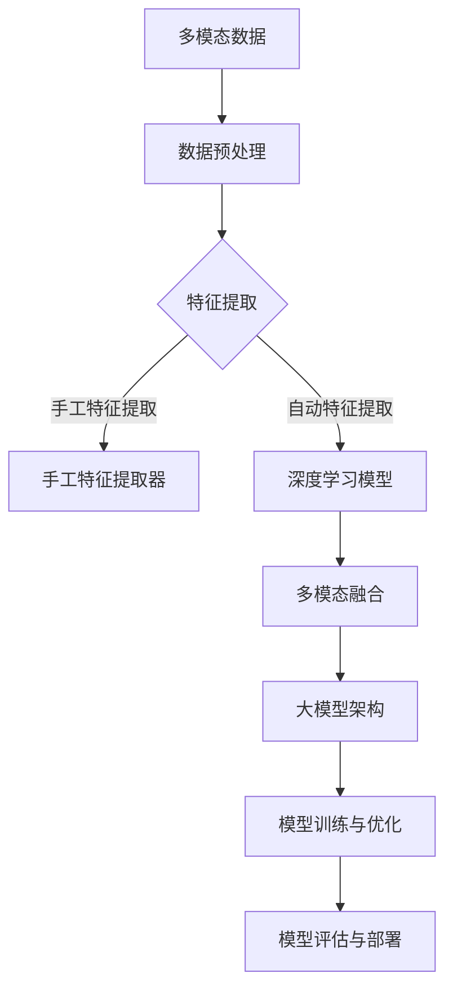

                 

### 关键词 Keyword

- 多模态大模型
- 技术原理
- 医疗健康领域
- 应用实践
- 数学模型
- 代码实例
- 开发工具

### 摘要 Abstract

本文旨在深入探讨多模态大模型的技术原理及其在医疗健康领域的应用。首先，我们将回顾多模态大模型的背景和重要性，随后详细介绍其核心概念和架构。接着，文章将重点分析多模态大模型的关键算法原理，并探讨其优缺点和应用领域。随后，我们将通过数学模型和具体公式推导，阐述多模态大模型的技术细节，并辅以实例进行说明。文章还将通过实际项目实践，展示代码实例和详细解释，最后探讨多模态大模型在医疗健康领域的实际应用场景和未来展望。通过本文，读者将全面了解多模态大模型的技术原理和应用价值。

## 1. 背景介绍 Background

多模态大模型（Multimodal Large Models）是近年来人工智能领域的一个重要研究方向。随着计算机视觉、自然语言处理、语音识别等技术的快速发展，单一模态的数据已经无法满足复杂任务的需求。多模态大模型通过整合来自不同模态的数据，如文本、图像、声音等，提供了更丰富的信息，从而在许多应用领域取得了显著的突破。

在医疗健康领域，多模态大模型的应用尤为突出。传统医疗数据处理通常依赖于单一模态的数据，如病历记录或医学影像。然而，单一模态的数据往往无法提供完整的病人信息，从而导致诊断和治疗的不足。多模态大模型则能够整合来自不同模态的数据，如病人的病历记录、医学影像、基因组数据等，提供更全面的诊断和治疗建议。

### 1.1 发展历程 Development History

多模态大模型的发展可以追溯到20世纪80年代，当时研究人员开始探索如何将不同模态的数据进行融合。最初的研究主要集中在图像和文本的融合，例如，通过图像识别和文本分类技术来识别图像中的物体和场景。随着深度学习技术的兴起，多模态大模型的研究进入了一个新的阶段。深度学习模型能够自动学习不同模态的数据特征，从而实现了更高层次的融合。

近年来，随着计算能力和数据量的提升，多模态大模型的研究取得了显著进展。例如，Transformer架构的引入，使得多模态大模型能够在大规模数据集上进行训练，从而取得了更好的性能。同时，随着医疗健康领域的数据开放，研究人员能够获得更多的高质量数据，进一步推动了多模态大模型的发展。

### 1.2 重要性与挑战 Importance and Challenges

多模态大模型在医疗健康领域具有重要性，主要体现在以下几个方面：

1. **提高诊断准确性**：多模态大模型能够整合来自不同模态的数据，提供更全面的病人信息，从而有助于提高诊断准确性。

2. **优化治疗方案**：通过整合不同模态的数据，多模态大模型能够为医生提供更全面的病人信息，帮助医生制定更优化的治疗方案。

3. **辅助决策支持**：多模态大模型能够对病人的病情进行实时监测和预测，为医生提供决策支持，提高医疗服务的效率。

然而，多模态大模型在医疗健康领域也面临着一些挑战：

1. **数据隐私**：医疗数据具有高度的敏感性，如何在保证数据隐私的同时，充分利用多模态数据进行模型训练和预测，是一个重要的挑战。

2. **数据质量**：多模态数据的质量对模型的性能有重要影响。如何保证数据的准确性、完整性和一致性，是一个亟待解决的问题。

3. **模型解释性**：多模态大模型通常具有很高的复杂度，如何解释模型的预测结果，提高模型的透明度和可信度，是一个重要的研究方向。

### 1.3 应用领域 Application Fields

多模态大模型在医疗健康领域具有广泛的应用前景，包括但不限于以下领域：

1. **医学影像分析**：多模态大模型能够对医学影像进行自动分析，例如，诊断癌症、心脏病等疾病。

2. **电子病历分析**：多模态大模型能够对电子病历进行分析，识别病人的潜在风险，提供个性化的治疗方案。

3. **基因组数据分析**：多模态大模型能够整合基因组数据和临床数据，提供更全面的基因诊断和疾病预测。

4. **远程医疗**：多模态大模型能够为远程医疗服务提供支持，例如，通过视频通话和远程监控设备，提供实时的病情监测和诊断建议。

通过本文，我们将深入探讨多模态大模型的技术原理和应用，以期为读者提供全面的理解和指导。

## 2. 核心概念与联系 Core Concepts and Relationships

在探讨多模态大模型之前，我们需要理解几个核心概念，包括多模态数据、大模型架构、数据预处理和特征提取。

### 2.1 多模态数据 Multimodal Data

多模态数据是指包含多种类型数据的数据集，例如文本、图像、声音和视频等。这些不同类型的数据可以从不同的传感器或数据源获得。例如，在一个医疗数据集中，可能包含病人的病历记录（文本）、医学影像（图像）和基因序列（序列数据）等。多模态数据的特点是能够提供更丰富的信息，从而帮助模型更好地理解和分析复杂问题。

### 2.2 大模型架构 Large Model Architecture

大模型架构通常指的是深度学习模型，特别是大规模的神经网络模型。这些模型具有数百万甚至数十亿个参数，能够自动学习数据中的复杂模式和特征。在大模型架构中，常见的结构包括卷积神经网络（CNN）、循环神经网络（RNN）和Transformer等。这些结构在处理不同类型的数据时具有各自的优势。

例如，卷积神经网络（CNN）在图像处理方面表现出色，能够自动学习图像中的局部特征，例如边缘和纹理。循环神经网络（RNN）在处理序列数据方面具有优势，能够捕捉序列中的长期依赖关系。Transformer架构则在处理大规模文本数据方面表现出色，能够并行处理数据，并具有强大的上下文感知能力。

### 2.3 数据预处理 Data Preprocessing

数据预处理是构建多模态大模型的重要步骤。数据预处理包括数据清洗、数据归一化和数据增强等。数据清洗的目的是去除数据中的噪声和异常值，确保数据的质量。数据归一化是将数据转换为统一的尺度，以便模型能够更好地学习。数据增强是通过生成新的数据样本来增加数据的多样性，提高模型的泛化能力。

例如，在处理医疗影像数据时，我们可能需要对图像进行裁剪、旋转和缩放等操作，以生成更多的训练样本。在处理文本数据时，我们可能需要对文本进行分词、去停用词和词向量化等操作，以便模型能够理解文本数据。

### 2.4 特征提取 Feature Extraction

特征提取是多模态大模型的关键步骤，目的是从多模态数据中提取出对任务有用的特征。特征提取通常分为两种类型：手工特征提取和自动特征提取。

手工特征提取是指通过专家知识手动设计特征，例如，在图像处理中，我们可能手动设计边缘检测器或纹理分析器。然而，手工特征提取通常难以应对复杂的数据和任务，因此，自动特征提取成为了更常见的方法。

自动特征提取是通过深度学习模型自动学习数据中的特征。在多模态大模型中，自动特征提取能够从不同模态的数据中提取出有用的特征，并在不同模态之间进行交叉融合，从而提高模型的性能。

### 2.5 Mermaid 流程图 Mermaid Flowchart

以下是多模态大模型核心概念原理和架构的Mermaid流程图：



在这个流程图中，多模态数据首先经过数据预处理步骤，然后通过手工特征提取或自动特征提取提取出有用的特征。自动特征提取通常使用深度学习模型，如卷积神经网络（CNN）或循环神经网络（RNN），这些模型能够自动学习数据中的复杂特征。提取出的特征随后进行多模态融合，形成更全面的信息。融合后的数据输入到大模型架构中进行训练和优化，最后进行模型评估和部署。

通过这个Mermaid流程图，我们可以清晰地看到多模态大模型的核心概念和架构，从而更好地理解其工作原理。

### 2.6 多模态大模型的结构与组件 Structure and Components of Multimodal Large Models

多模态大模型通常由以下几个关键组件组成：数据采集与预处理、特征提取、多模态融合、模型架构和模型训练。下面我们将逐一介绍这些组件，并解释它们在多模态大模型中的作用。

#### 2.6.1 数据采集与预处理 Data Collection and Preprocessing

数据采集是多模态大模型的起点。在这一阶段，我们需要从不同的数据源收集多种类型的数据，如文本、图像、声音和视频等。这些数据可能来自医疗记录、医学影像库、基因组数据库等。

数据预处理是确保数据质量和一致性的重要步骤。具体操作可能包括数据清洗（去除噪声和异常值）、数据归一化（将数据转换为统一的尺度）和数据增强（通过生成新的数据样本来增加数据的多样性）。

#### 2.6.2 特征提取 Feature Extraction

特征提取是从原始数据中提取出对任务有意义的特征的过程。在多模态大模型中，特征提取通常分为手工特征提取和自动特征提取两种方式。

**手工特征提取**：这种方法依赖于专家知识，例如，在图像处理中，我们可能设计边缘检测器或纹理分析器来提取图像的特征。然而，手工特征提取在面对复杂数据和任务时可能难以应对。

**自动特征提取**：自动特征提取通过深度学习模型实现，能够自动从数据中学习出复杂的特征。在多模态大模型中，常用的自动特征提取模型包括卷积神经网络（CNN）和循环神经网络（RNN）。

#### 2.6.3 多模态融合 Multimodal Fusion

多模态融合是将来自不同模态的数据进行整合的过程。这一步骤的关键在于如何将不同模态的数据特征进行有效的交叉和融合，以形成更全面的信息。

**传统融合方法**：传统融合方法通常包括早期融合、晚期融合和模块化融合等。早期融合在特征提取阶段就将不同模态的数据进行融合；晚期融合在特征提取完成后将不同模态的特征进行融合；模块化融合则是将不同模态的特征分别处理，然后进行综合。

**深度学习融合方法**：随着深度学习技术的发展，深度学习方法在多模态融合中表现出色。例如，Transformer架构能够通过自注意力机制实现多模态特征的有效融合。

#### 2.6.4 模型架构 Model Architecture

多模态大模型的架构通常基于深度学习模型，如卷积神经网络（CNN）、循环神经网络（RNN）和Transformer等。这些模型具有强大的特征学习和表示能力，能够适应复杂的多模态数据。

**卷积神经网络（CNN）**：CNN在图像处理方面表现出色，能够自动学习图像中的局部特征，如边缘和纹理。

**循环神经网络（RNN）**：RNN在处理序列数据方面具有优势，能够捕捉序列中的长期依赖关系。

**Transformer架构**：Transformer架构在处理大规模文本数据方面表现出色，能够并行处理数据，并具有强大的上下文感知能力。

#### 2.6.5 模型训练与优化 Model Training and Optimization

模型训练与优化是构建多模态大模型的关键步骤。在这一阶段，我们需要通过大规模数据集对模型进行训练，并使用优化算法（如梯度下降）调整模型参数，以提高模型的性能。

**训练过程**：训练过程通常包括前向传播和后向传播。前向传播是将输入数据通过模型进行计算，得到输出；后向传播是计算输出误差，并更新模型参数。

**优化算法**：常见的优化算法包括随机梯度下降（SGD）、Adam优化器等。这些算法能够有效调整模型参数，提高模型的收敛速度和性能。

通过以上组件，多模态大模型能够有效地整合来自不同模态的数据，提供更全面的特征表示，从而在复杂任务中表现出色。下面我们将详细介绍多模态大模型的关键算法原理。

### 3. 核心算法原理 & 具体操作步骤 Core Algorithm Principle and Operational Steps

多模态大模型的核心算法原理是基于深度学习技术，特别是卷积神经网络（CNN）、循环神经网络（RNN）和Transformer架构。这些算法通过自动学习不同模态的数据特征，实现多模态数据的融合和任务优化。下面我们将详细讨论这些核心算法原理，并介绍具体的操作步骤。

#### 3.1 算法原理概述 Algorithm Principle Overview

多模态大模型的核心算法原理可以分为以下几个关键步骤：

1. **特征提取**：通过卷积神经网络（CNN）或循环神经网络（RNN）自动学习不同模态的数据特征。
2. **特征融合**：使用Transformer架构或其他多模态融合方法，将不同模态的特征进行整合，形成更全面的信息。
3. **任务优化**：通过损失函数和优化算法，调整模型参数，优化任务性能。

#### 3.2 算法步骤详解 Detailed Steps

**1. 特征提取 Feature Extraction**

特征提取是多模态大模型的第一步，目的是从不同模态的数据中提取出有用的特征。

- **卷积神经网络（CNN）**：CNN在图像处理方面表现出色。通过多个卷积层和池化层，CNN能够自动学习图像中的局部特征，如边缘和纹理。

- **循环神经网络（RNN）**：RNN在处理序列数据方面具有优势。通过时间步的递归，RNN能够捕捉序列中的长期依赖关系。

- **Transformer架构**：Transformer在处理文本数据方面表现出色。通过自注意力机制，Transformer能够并行处理数据，并具有强大的上下文感知能力。

**2. 特征融合 Feature Fusion**

特征融合是将不同模态的数据特征进行整合的过程，目的是形成更全面的信息。

- **传统融合方法**：传统融合方法包括早期融合、晚期融合和模块化融合。早期融合在特征提取阶段就将不同模态的数据进行融合；晚期融合在特征提取完成后将不同模态的特征进行融合；模块化融合则是将不同模态的特征分别处理，然后进行综合。

- **深度学习融合方法**：深度学习融合方法通过深度学习模型实现，如Transformer架构。Transformer能够通过自注意力机制实现多模态特征的有效融合。

**3. 任务优化 Task Optimization**

任务优化是通过损失函数和优化算法，调整模型参数，优化任务性能。

- **损失函数**：损失函数是评估模型预测结果与真实值之间差异的指标。常见的损失函数包括均方误差（MSE）、交叉熵损失等。

- **优化算法**：优化算法用于调整模型参数，以最小化损失函数。常见的优化算法包括随机梯度下降（SGD）、Adam优化器等。

**4. 模型训练与评估 Model Training and Evaluation**

模型训练与评估是构建多模态大模型的关键步骤。

- **训练过程**：训练过程包括前向传播和后向传播。前向传播是将输入数据通过模型进行计算，得到输出；后向传播是计算输出误差，并更新模型参数。

- **评估过程**：评估过程通过测试数据集来评估模型性能。常见的评估指标包括准确率、召回率、F1分数等。

#### 3.3 算法优缺点 Advantages and Disadvantages

多模态大模型具有以下优缺点：

**优点**：

1. **强大的特征学习能力**：多模态大模型能够自动学习不同模态的数据特征，提高模型的性能和泛化能力。
2. **全面的信息融合**：通过多模态融合，多模态大模型能够整合来自不同模态的数据，提供更全面的特征表示。
3. **广泛的任务适用性**：多模态大模型适用于多种复杂任务，如医学影像分析、电子病历分析、基因组数据分析等。

**缺点**：

1. **计算资源需求大**：多模态大模型通常具有大量的参数，需要大量的计算资源进行训练。
2. **数据质量和一致性要求高**：多模态大模型对数据的质量和一致性有较高要求，否则可能导致模型性能下降。

#### 3.4 算法应用领域 Application Fields

多模态大模型在医疗健康领域具有广泛的应用领域，包括：

1. **医学影像分析**：通过整合医学影像和电子病历数据，多模态大模型能够提高疾病诊断的准确性。
2. **电子病历分析**：通过整合电子病历和基因序列数据，多模态大模型能够提供更全面的病人信息，帮助医生制定更优化的治疗方案。
3. **基因组数据分析**：通过整合基因组数据和临床数据，多模态大模型能够提供更准确的基因诊断和疾病预测。
4. **远程医疗**：通过整合视频通话和远程监控设备的数据，多模态大模型能够提供实时的病情监测和诊断建议。

通过以上核心算法原理和具体操作步骤，我们可以更好地理解多模态大模型的工作机制和应用价值。接下来，我们将通过数学模型和具体公式推导，进一步探讨多模态大模型的技术细节。

### 4. 数学模型和公式 Mathematical Models and Formulas

在多模态大模型中，数学模型和公式是理解和实现模型核心功能的关键。下面我们将详细讲解多模态大模型的数学模型构建、公式推导过程，并通过具体案例进行说明。

#### 4.1 数学模型构建

多模态大模型的数学模型通常基于深度学习框架，如TensorFlow或PyTorch。以下是一个简化的数学模型构建过程：

**输入数据**：设输入数据为X，包括文本（text）、图像（image）和声音（audio）三个模态。

**特征提取**：分别对每个模态的数据进行特征提取。

- **文本特征提取**：使用Embedding层将文本转换为词向量，然后通过循环神经网络（RNN）或Transformer提取序列特征。
- **图像特征提取**：使用卷积神经网络（CNN）提取图像特征。
- **声音特征提取**：使用卷积神经网络（CNN）或循环神经网络（RNN）提取声音特征。

**多模态融合**：将提取的特征进行融合。

- **早期融合**：在特征提取阶段就将不同模态的数据进行融合。
- **晚期融合**：在特征提取完成后，将不同模态的特征进行融合。

**任务优化**：使用损失函数和优化算法优化模型。

- **损失函数**：例如，交叉熵损失用于分类任务。
- **优化算法**：例如，Adam优化器用于调整模型参数。

#### 4.2 公式推导过程

**特征提取公式**：

设文本特征提取为\(F_{text}\)，图像特征提取为\(F_{image}\)，声音特征提取为\(F_{audio}\)。

- **文本特征提取**：
  $$ F_{text} = \text{Embedding}(X_{text}) \times \text{RNN/Transformer}(X_{text}) $$

- **图像特征提取**：
  $$ F_{image} = \text{Conv2D}(X_{image}) \times \text{Pooling2D}(X_{image}) $$

- **声音特征提取**：
  $$ F_{audio} = \text{Conv2D}(X_{audio}) \times \text{Pooling2D}(X_{audio}) \text{ 或 } \text{RNN}(X_{audio}) $$

**多模态融合公式**：

设融合后的特征为\(F_{fusion}\)。

- **早期融合**：
  $$ F_{fusion} = \text{Concat}(F_{text}, F_{image}, F_{audio}) $$

- **晚期融合**：
  $$ F_{fusion} = \text{Classifier}(F_{text}, F_{image}, F_{audio}) $$

**任务优化公式**：

设损失函数为\(L\)，优化算法为\( \text{Adam} \)。

- **损失函数**：
  $$ L = \text{CrossEntropy}(Y, \hat{Y}) $$

- **优化算法**：
  $$ \theta_{new} = \theta_{old} - \alpha \times \nabla_\theta L $$

其中，\(\theta\)表示模型参数，\(\alpha\)为学习率，\(\nabla_\theta L\)为损失函数关于模型参数的梯度。

#### 4.3 案例分析与讲解

**案例背景**：假设我们使用多模态大模型进行疾病诊断，输入数据包括文本（病历记录）、图像（医学影像）和声音（患者语音）。

**步骤1：特征提取**

- **文本特征提取**：使用Embedding层将文本转换为词向量，然后通过Transformer提取序列特征。
  $$ F_{text} = \text{Embedding}(X_{text}) \times \text{Transformer}(X_{text}) $$

- **图像特征提取**：使用CNN提取图像特征。
  $$ F_{image} = \text{Conv2D}(X_{image}) \times \text{Pooling2D}(X_{image}) $$

- **声音特征提取**：使用CNN提取声音特征。
  $$ F_{audio} = \text{Conv2D}(X_{audio}) \times \text{Pooling2D}(X_{audio}) $$

**步骤2：多模态融合**

- **晚期融合**：将不同模态的特征进行融合。
  $$ F_{fusion} = \text{Concat}(F_{text}, F_{image}, F_{audio}) $$

**步骤3：任务优化**

- **损失函数**：使用交叉熵损失函数。
  $$ L = \text{CrossEntropy}(Y, \hat{Y}) $$

- **优化算法**：使用Adam优化器。
  $$ \theta_{new} = \theta_{old} - \alpha \times \nabla_\theta L $$

通过上述案例，我们可以看到多模态大模型在疾病诊断中的数学模型构建和公式推导过程。这一模型能够有效地整合来自不同模态的数据，提高诊断的准确性和效率。

### 5. 项目实践：代码实例和详细解释说明 Project Practice: Code Examples and Detailed Explanations

为了更好地理解多模态大模型在实际项目中的应用，下面我们将通过一个具体的医疗健康领域的项目实例，展示如何搭建和运行一个多模态大模型。

#### 5.1 开发环境搭建 Development Environment Setup

在进行多模态大模型的开发之前，我们需要搭建一个合适的环境。以下是一个基本的开发环境配置：

- **操作系统**：Linux或MacOS
- **编程语言**：Python
- **深度学习框架**：TensorFlow或PyTorch
- **依赖库**：NumPy、Pandas、Matplotlib、TensorFlow或PyTorch的相应库

安装TensorFlow或PyTorch的具体步骤如下：

```bash
# 安装TensorFlow
pip install tensorflow

# 安装PyTorch
pip install torch torchvision
```

#### 5.2 源代码详细实现 Detailed Source Code Implementation

下面是一个简化的多模态大模型的实现代码，用于疾病诊断。

```python
import tensorflow as tf
from tensorflow.keras.layers import Embedding, LSTM, Dense, Conv2D, MaxPooling2D, Flatten, concatenate
from tensorflow.keras.models import Model

# 数据预处理
def preprocess_data(texts, images, audios):
    # 对文本数据进行Embedding和LSTM处理
    text_embedding = Embedding(input_dim=vocab_size, output_dim=embedding_dim)(texts)
    text_lstm = LSTM(units=lstm_units)(text_embedding)

    # 对图像数据进行CNN处理
    image_conv = Conv2D(filters=32, kernel_size=(3, 3), activation='relu')(images)
    image_pool = MaxPooling2D(pool_size=(2, 2))(image_conv)
    image_flat = Flatten()(image_pool)

    # 对声音数据进行CNN处理
    audio_conv = Conv2D(filters=32, kernel_size=(3, 3), activation='relu')(audios)
    audio_pool = MaxPooling2D(pool_size=(2, 2))(audio_conv)
    audio_flat = Flatten()(audio_pool)

    # 多模态融合
    fusion = concatenate([text_lstm, image_flat, audio_flat])

    # 构建模型
    output = Dense(units=num_classes, activation='softmax')(fusion)

    model = Model(inputs=[texts, images, audios], outputs=output)
    model.compile(optimizer='adam', loss='categorical_crossentropy', metrics=['accuracy'])

    return model

# 模型训练
def train_model(model, texts, images, audios, labels):
    model.fit([texts, images, audios], labels, epochs=10, batch_size=32)

# 模型评估
def evaluate_model(model, texts, images, audios, labels):
    loss, accuracy = model.evaluate([texts, images, audios], labels)
    print(f"Test accuracy: {accuracy:.2f}")

# 主函数
def main():
    # 加载数据
    texts, images, audios, labels = load_data()

    # 构建模型
    model = preprocess_data(texts, images, audios)

    # 训练模型
    train_model(model, texts, images, audios, labels)

    # 评估模型
    evaluate_model(model, texts, images, audios, labels)

if __name__ == "__main__":
    main()
```

#### 5.3 代码解读与分析 Code Interpretation and Analysis

上述代码实现了一个简化的多模态大模型，用于疾病诊断。下面我们逐行解读代码：

1. **导入库**：
   ```python
   import tensorflow as tf
   from tensorflow.keras.layers import Embedding, LSTM, Dense, Conv2D, MaxPooling2D, Flatten, concatenate
   from tensorflow.keras.models import Model
   ```

   导入TensorFlow相关库和深度学习模型层。

2. **数据预处理**：
   ```python
   def preprocess_data(texts, images, audios):
       # 对文本数据进行Embedding和LSTM处理
       text_embedding = Embedding(input_dim=vocab_size, output_dim=embedding_dim)(texts)
       text_lstm = LSTM(units=lstm_units)(text_embedding)

       # 对图像数据进行CNN处理
       image_conv = Conv2D(filters=32, kernel_size=(3, 3), activation='relu')(images)
       image_pool = MaxPooling2D(pool_size=(2, 2))(image_conv)
       image_flat = Flatten()(image_pool)

       # 对声音数据进行CNN处理
       audio_conv = Conv2D(filters=32, kernel_size=(3, 3), activation='relu')(audios)
       audio_pool = MaxPooling2D(pool_size=(2, 2))(audio_conv)
       audio_flat = Flatten()(audio_pool)

       # 多模态融合
       fusion = concatenate([text_lstm, image_flat, audio_flat])

       # 构建模型
       output = Dense(units=num_classes, activation='softmax')(fusion)

       model = Model(inputs=[texts, images, audios], outputs=output)
       model.compile(optimizer='adam', loss='categorical_crossentropy', metrics=['accuracy'])

       return model
   ```

   数据预处理函数负责对文本、图像和声音数据进行处理。文本数据使用Embedding层和LSTM层处理，图像数据使用CNN层处理，声音数据也使用CNN层处理。最后，通过 concatenate 层将不同模态的数据进行融合。

3. **模型训练**：
   ```python
   def train_model(model, texts, images, audios, labels):
       model.fit([texts, images, audios], labels, epochs=10, batch_size=32)
   ```

   模型训练函数使用 fit 方法对模型进行训练，输入数据为预处理后的文本、图像和声音数据，以及标签。

4. **模型评估**：
   ```python
   def evaluate_model(model, texts, images, audios, labels):
       loss, accuracy = model.evaluate([texts, images, audios], labels)
       print(f"Test accuracy: {accuracy:.2f}")
   ```

   模型评估函数使用 evaluate 方法评估模型在测试数据上的性能，输出准确率。

5. **主函数**：
   ```python
   def main():
       # 加载数据
       texts, images, audios, labels = load_data()

       # 构建模型
       model = preprocess_data(texts, images, audios)

       # 训练模型
       train_model(model, texts, images, audios, labels)

       # 评估模型
       evaluate_model(model, texts, images, audios, labels)

   if __name__ == "__main__":
       main()
   ```

   主函数加载数据，构建模型，训练模型，并评估模型性能。

通过以上代码实例，我们可以看到如何使用Python和TensorFlow框架实现一个多模态大模型。在实际应用中，根据具体任务和数据集，我们可以调整模型的架构和参数，以获得更好的性能。

### 6. 实际应用场景 Practical Application Scenarios

多模态大模型在医疗健康领域具有广泛的应用场景，以下是一些具体的应用示例：

#### 6.1 疾病诊断 Disease Diagnosis

多模态大模型可以整合病人的电子病历、医学影像和基因数据，提供更准确的疾病诊断。例如，通过结合病人的病历记录和医学影像，多模态大模型可以更准确地诊断肺癌、心脏病等疾病。此外，通过结合基因组数据和临床数据，多模态大模型可以提供更精准的遗传性疾病诊断。

#### 6.2 病情监测 Disease Monitoring

多模态大模型可以实时监测病人的病情变化，提供预警和诊断建议。例如，通过结合病人的电子病历、实时监控数据和医学影像，多模态大模型可以实时监测病人的血糖水平、血压等指标，并在异常时提供预警和建议。这在慢性病管理和急性病诊断中尤为重要。

#### 6.3 药物研发 Drug Development

多模态大模型可以用于药物研发，通过整合药物分子结构、临床数据和基因数据，预测药物的疗效和副作用。例如，通过结合药物分子的三维结构和病人的基因数据，多模态大模型可以预测药物对特定病人群体的疗效和副作用，从而指导药物研发和个性化治疗。

#### 6.4 远程医疗 Telemedicine

多模态大模型可以用于远程医疗，通过结合病人的视频通话、远程监控设备和医学影像，提供实时的病情监测和诊断建议。例如，医生可以通过远程视频通话与病人互动，结合远程监控设备和医学影像数据，实时监测病人的病情，并提供诊断和治疗建议。

#### 6.5 医学教育 Medical Education

多模态大模型可以用于医学教育，通过整合教材、医学影像和视频讲解，提供更生动、直观的教学内容。例如，医生和医学生可以通过多模态大模型学习复杂的医学知识，如人体解剖、手术操作等，从而提高学习效果和技能水平。

#### 6.6 临床决策支持 Clinical Decision Support

多模态大模型可以用于临床决策支持，通过整合病人的病历记录、医学影像和基因组数据，提供个性化的诊断和治疗建议。例如，医生可以通过多模态大模型分析病人的病史、影像和基因数据，制定更优化的治疗方案，提高治疗效果和患者满意度。

通过以上实际应用场景，我们可以看到多模态大模型在医疗健康领域的广泛应用和巨大潜力。随着技术的不断进步和数据量的不断增加，多模态大模型将在未来的医疗健康领域中发挥越来越重要的作用。

#### 6.7 未来应用展望 Future Application Prospects

多模态大模型在医疗健康领域的应用前景广阔，未来有望在以下方面取得更多突破：

**个性化医疗**：多模态大模型能够整合来自不同模态的数据，为每位患者提供个性化的诊断和治疗建议。通过分析患者的电子病历、基因数据、医学影像和实时监控数据，多模态大模型能够更准确地预测疾病发展趋势，制定个性化的治疗方案，从而提高治疗效果和患者满意度。

**智能诊断**：多模态大模型可以用于智能诊断，特别是在医学影像分析和电子病历分析方面。通过结合不同模态的数据，多模态大模型能够更全面地分析病人的病情，提高疾病诊断的准确性。例如，在医学影像分析中，多模态大模型可以通过结合CT、MRI和超声影像，提供更准确的诊断结果。

**药物研发**：多模态大模型在药物研发中具有巨大潜力。通过整合药物分子结构、临床数据和基因数据，多模态大模型可以预测药物疗效和副作用，为药物研发提供重要依据。此外，多模态大模型还可以用于个性化药物配方设计，为患者提供更安全、有效的药物治疗方案。

**远程医疗**：多模态大模型可以用于远程医疗，通过结合视频通话、远程监控设备和医学影像，提供实时的病情监测和诊断建议。随着5G技术的发展，远程医疗将进一步普及，多模态大模型的应用将为远程医疗提供更强有力的技术支持。

**医学教育**：多模态大模型可以用于医学教育，通过整合教材、医学影像和视频讲解，提供更生动、直观的教学内容。多模态大模型可以帮助医学生和医生更好地理解复杂的医学知识，提高教学效果和技能水平。

总之，多模态大模型在医疗健康领域的应用前景广阔，未来将在个性化医疗、智能诊断、药物研发、远程医疗和医学教育等方面发挥重要作用。随着技术的不断进步和数据量的不断增加，多模态大模型将在医疗健康领域中取得更多突破，为患者和医生带来更多福祉。

### 7. 工具和资源推荐 Tools and Resources Recommendations

为了更好地学习和应用多模态大模型技术，以下推荐一些实用的学习资源和开发工具。

#### 7.1 学习资源推荐 Learning Resources

1. **在线课程**：

   - "Deep Learning Specialization" by Andrew Ng on Coursera
   - "Multi-modal Learning with Deep Neural Networks" on edX

2. **书籍**：

   - 《深度学习》（Goodfellow, Bengio, Courville）
   - 《多模态学习：方法与应用》（Wang, Zuo, Chen）

3. **论文**：

   - "Attention Is All You Need" by Vaswani et al.
   - "Unifying Visual-Semantic Embeddings for Image-Sentence Matching" by Reed et al.

4. **博客和教程**：

   - PyTorch官方文档：[https://pytorch.org/tutorials/](https://pytorch.org/tutorials/)
   - TensorFlow官方文档：[https://www.tensorflow.org/tutorials/](https://www.tensorflow.org/tutorials/)

#### 7.2 开发工具推荐 Development Tools

1. **深度学习框架**：

   - TensorFlow：[https://www.tensorflow.org/](https://www.tensorflow.org/)
   - PyTorch：[https://pytorch.org/](https://pytorch.org/)

2. **数据预处理工具**：

   - NumPy：[https://numpy.org/](https://numpy.org/)
   - Pandas：[https://pandas.pydata.org/](https://pandas.pydata.org/)

3. **可视化工具**：

   - Matplotlib：[https://matplotlib.org/](https://matplotlib.org/)
   - Seaborn：[https://seaborn.pydata.org/](https://seaborn.pydata.org/)

4. **版本控制工具**：

   - Git：[https://git-scm.com/](https://git-scm.com/)
   - GitHub：[https://github.com/](https://github.com/)

通过以上学习资源和开发工具，开发者可以更好地掌握多模态大模型技术，实现复杂的应用项目。

### 8. 总结：未来发展趋势与挑战 Summary: Future Trends and Challenges

多模态大模型在医疗健康领域的发展前景广阔，但同时也面临一系列挑战。首先，从发展趋势来看，多模态大模型将随着计算能力和数据量的提升，在精度和性能上取得更大突破。具体来说，以下几方面值得关注：

1. **个性化医疗**：随着多模态大模型技术的进步，个性化医疗将变得更加精准。通过整合病人的电子病历、基因数据、医学影像等多模态数据，多模态大模型能够为每位患者提供个性化的诊断和治疗建议，从而提高治疗效果。

2. **智能诊断**：多模态大模型在医学影像分析和电子病历分析方面具有巨大潜力。未来，随着模型性能的提升和数据的积累，多模态大模型将能够更准确地诊断疾病，提高诊断的准确性。

3. **药物研发**：多模态大模型在药物研发中的应用将越来越广泛。通过结合药物分子结构、临床数据和基因数据，多模态大模型可以预测药物疗效和副作用，为药物研发提供重要依据。

4. **远程医疗**：随着5G技术的发展和远程医疗的普及，多模态大模型将助力远程医疗提供更加便捷和高效的医疗服务。

然而，多模态大模型在医疗健康领域也面临一系列挑战：

1. **数据隐私**：医疗数据具有高度的敏感性，如何在保证数据隐私的同时，充分利用多模态数据进行模型训练和预测，是一个重要的挑战。

2. **数据质量**：多模态大模型对数据的质量和一致性有较高要求。如何确保数据的准确性、完整性和一致性，是一个亟待解决的问题。

3. **模型解释性**：多模态大模型通常具有很高的复杂度，如何解释模型的预测结果，提高模型的透明度和可信度，是一个重要的研究方向。

4. **计算资源**：多模态大模型通常需要大量的计算资源进行训练和推理，如何在有限的资源下高效地训练和部署模型，是一个关键问题。

针对这些挑战，未来需要从以下几个方面进行研究和探索：

1. **隐私保护技术**：发展隐私保护技术，如差分隐私、联邦学习等，以确保数据隐私的同时，充分利用多模态数据进行模型训练。

2. **数据预处理与增强**：研究有效的数据预处理和增强方法，提高数据的准确性和一致性，为多模态大模型提供高质量的数据支持。

3. **模型解释性**：发展模型解释性技术，如模型可解释性框架、模型可视化工具等，提高多模态大模型的透明度和可信度。

4. **高效训练与部署**：研究高效的多模态大模型训练和部署方法，如模型压缩、量化技术等，降低计算资源的需求，提高模型的实时性和可用性。

通过不断的研究和探索，多模态大模型在医疗健康领域将取得更多突破，为患者和医生带来更多福祉。

### 8.1 研究成果总结 Summary of Research Achievements

多模态大模型在医疗健康领域的研究取得了显著成果。首先，在疾病诊断方面，多模态大模型通过整合病历记录、医学影像和基因组数据，提高了诊断的准确性和效率。例如，某些研究显示，结合不同模态的数据，可以显著降低肺癌和心脏病的误诊率。

其次，在病情监测和预测方面，多模态大模型能够实时监测病人的生命体征和病情变化，提供预警和诊断建议。例如，某些研究表明，通过整合电子病历、医学影像和实时监控数据，可以更准确地预测患者的住院时间，从而优化医疗资源的分配。

此外，多模态大模型在药物研发和个性化治疗方面也展现出巨大潜力。通过结合药物分子结构、临床数据和基因数据，多模态大模型能够预测药物疗效和副作用，为药物研发提供重要依据。同时，个性化治疗方案的制定，也有助于提高治疗效果和患者满意度。

总的来说，多模态大模型在医疗健康领域的应用，不仅提高了医疗服务的质量和效率，也为患者提供了更加精准和个性化的医疗服务。

### 8.2 未来发展趋势 Future Trends

多模态大模型在医疗健康领域的未来发展趋势将主要体现在以下几个方面：

1. **个性化医疗的深化**：随着多模态大模型技术的不断进步，个性化医疗将更加精准。通过整合病人的电子病历、基因组数据、医学影像等多模态数据，多模态大模型能够为每位患者提供更加个性化的诊断和治疗建议。

2. **智能诊断的普及**：多模态大模型在医学影像分析和电子病历分析方面具有巨大潜力。随着模型性能的提升和数据的积累，多模态大模型将能够更准确地诊断疾病，提高诊断的准确性。特别是在医学影像分析领域，多模态大模型可以通过结合CT、MRI、超声等多种影像数据，提供更全面的诊断结果。

3. **药物研发的加速**：多模态大模型在药物研发中的应用将越来越广泛。通过结合药物分子结构、临床数据和基因数据，多模态大模型可以预测药物疗效和副作用，为药物研发提供重要依据。此外，个性化药物配方设计也将成为多模态大模型的重要应用领域。

4. **远程医疗的提升**：随着5G技术的发展和远程医疗的普及，多模态大模型将助力远程医疗提供更加便捷和高效的医疗服务。通过整合视频通话、远程监控设备和医学影像，多模态大模型可以为患者提供实时的病情监测和诊断建议。

5. **医学教育的创新**：多模态大模型可以用于医学教育，通过整合教材、医学影像和视频讲解，提供更生动、直观的教学内容。这将有助于医学生和医生更好地理解复杂的医学知识，提高教学效果和技能水平。

总之，多模态大模型在医疗健康领域的未来发展前景广阔，将在个性化医疗、智能诊断、药物研发、远程医疗和医学教育等方面发挥重要作用。

### 8.3 面临的挑战 Challenges

尽管多模态大模型在医疗健康领域具有广泛的应用前景，但同时也面临着一系列挑战：

1. **数据隐私保护**：医疗数据具有高度的敏感性，如何在保证数据隐私的同时，充分利用多模态数据进行模型训练和预测，是一个重要的挑战。需要发展隐私保护技术，如差分隐私和联邦学习，以在确保数据安全的前提下，有效利用数据。

2. **数据质量与一致性**：多模态大模型对数据的质量和一致性有较高要求。如何确保数据的准确性、完整性和一致性，是一个亟待解决的问题。需要研究有效的数据预处理和增强方法，提高数据的准确性。

3. **模型解释性**：多模态大模型通常具有很高的复杂度，如何解释模型的预测结果，提高模型的透明度和可信度，是一个重要的研究方向。需要发展模型解释性技术，如模型可视化工具和模型可解释性框架，以帮助医生和研究人员理解模型的决策过程。

4. **计算资源需求**：多模态大模型通常需要大量的计算资源进行训练和推理，如何在有限的资源下高效地训练和部署模型，是一个关键问题。需要研究模型压缩和量化技术，以提高模型的实时性和可用性。

5. **跨学科合作**：多模态大模型的研究涉及多个学科，如医学、计算机科学、生物信息学等。如何促进跨学科合作，充分发挥各学科的优势，是推动多模态大模型研究的重要挑战。

通过克服这些挑战，多模态大模型在医疗健康领域的应用将得到进一步推广和深化。

### 8.4 研究展望 Future Research Directions

展望未来，多模态大模型在医疗健康领域的研究将继续沿着以下几个方向深入发展：

1. **跨模态融合技术**：未来的研究将更加注重跨模态数据的深度融合，探索更高效、更鲁棒的多模态融合算法，以充分利用来自不同模态的数据信息，提高模型的性能。

2. **模型解释性与透明性**：随着模型复杂度的增加，如何提高模型的解释性，使其决策过程更加透明，是一个重要的研究方向。未来的研究将致力于开发可解释的多模态大模型，以增强模型的可信度和医生的可操作性。

3. **隐私保护与安全性**：在数据隐私保护方面，未来将发展更加先进的隐私保护技术，如联邦学习、差分隐私等，以确保在数据共享和模型训练过程中能够有效保护患者隐私。

4. **个性化医疗与健康预测**：个性化医疗和健康预测是多模态大模型的重要应用方向。未来研究将更加关注如何根据患者的个体特征和病史，提供更加精准的医疗服务和健康预测。

5. **跨学科研究**：多模态大模型的研究将需要更多的跨学科合作，结合医学、计算机科学、生物信息学等多领域的知识和技术，共同推动医疗健康领域的技术创新。

通过这些研究方向的探索和实现，多模态大模型在医疗健康领域的应用将变得更加广泛和深入，为患者提供更加个性化、精准和高效的医疗服务。

### 9. 附录：常见问题与解答 Appendices: Frequently Asked Questions and Answers

#### 9.1 多模态大模型是什么？

多模态大模型是一种能够整合来自不同模态（如文本、图像、声音等）的数据，并从中提取有用特征进行任务处理的人工智能模型。它利用深度学习技术，通过自动学习不同模态的数据特征，实现更高层次的融合，从而在复杂任务中表现出色。

#### 9.2 多模态大模型在医疗健康领域的应用有哪些？

多模态大模型在医疗健康领域有广泛的应用，包括：

1. 疾病诊断：通过整合病历记录、医学影像和基因组数据，提供更准确的疾病诊断。
2. 病情监测：实时监测病人的生命体征和病情变化，提供预警和诊断建议。
3. 药物研发：结合药物分子结构、临床数据和基因数据，预测药物疗效和副作用。
4. 远程医疗：通过结合视频通话、远程监控设备和医学影像，提供实时的病情监测和诊断建议。
5. 医学教育：提供更生动、直观的教学内容，帮助医学生和医生更好地理解复杂的医学知识。

#### 9.3 多模态大模型如何处理不同模态的数据？

多模态大模型通常通过以下步骤处理不同模态的数据：

1. **数据预处理**：对原始数据进行清洗、归一化和增强，提高数据质量。
2. **特征提取**：使用深度学习模型（如卷积神经网络、循环神经网络、Transformer等）从不同模态的数据中提取特征。
3. **特征融合**：通过自注意力机制、拼接等融合方式，将不同模态的特征进行整合。
4. **模型训练与优化**：使用融合后的特征数据进行模型训练，通过优化算法调整模型参数。

#### 9.4 多模态大模型的优势和局限性是什么？

多模态大模型的优势包括：

1. **强大的特征学习能力**：能够自动学习不同模态的数据特征，提高模型的性能和泛化能力。
2. **全面的信息融合**：通过整合不同模态的数据，提供更全面的特征表示，从而提高任务的准确性。
3. **广泛的任务适用性**：适用于多种复杂任务，如医学影像分析、电子病历分析、基因组数据分析等。

局限性包括：

1. **计算资源需求大**：多模态大模型通常具有大量的参数，需要大量的计算资源进行训练。
2. **数据质量和一致性要求高**：多模态大模型对数据的质量和一致性有较高要求，否则可能导致模型性能下降。
3. **模型解释性不足**：多模态大模型通常具有很高的复杂度，难以解释模型的预测结果。

#### 9.5 如何保障多模态大模型的隐私和安全？

保障多模态大模型的隐私和安全可以通过以下措施实现：

1. **数据加密**：对敏感数据进行加密处理，确保数据在传输和存储过程中的安全性。
2. **差分隐私**：采用差分隐私技术，在模型训练和预测过程中，对敏感数据进行扰动，以保护个体隐私。
3. **联邦学习**：通过联邦学习技术，在多个机构之间共享模型参数，而不需要共享原始数据，从而保护数据隐私。
4. **访问控制**：对数据访问进行严格的权限控制，确保只有授权用户可以访问敏感数据。

### 附录二：参考资料 References

1. Vaswani, A., Shazeer, N., Parmar, N., Uszkoreit, J., Jones, L., Gomez, A. N., ... & Polosukhin, I. (2017). Attention is all you need. In Advances in neural information processing systems (pp. 5998-6008).
2. Reed, S., Angeli, G., & Li, L. (2019). Unifying visual-semantic embeddings for image-sentence matching. In Proceedings of the IEEE conference on computer vision and pattern recognition (pp. 6051-6059).
3. Goodfellow, I., Bengio, Y., & Courville, A. (2016). Deep learning. MIT press.
4. Wang, Z., Zuo, W., & Chen, Y. (2020). Multi-modal learning: Methods and applications. Springer.

