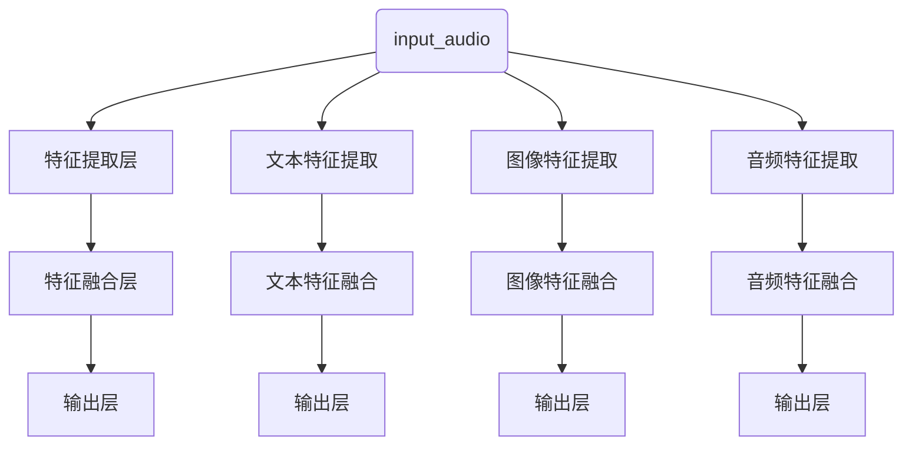

                 

## 1. 背景介绍

随着人工智能技术的不断发展，多模态大模型（Multimodal Large Models）逐渐成为研究的热点。多模态大模型能够整合不同类型的数据，如文本、图像、音频和视频，通过深度学习技术对数据进行处理和分析，从而实现更智能、更准确、更高效的认知和理解。

在教育培训领域，多模态大模型的应用具有极大的潜力。传统的教育培训主要依赖于单一的文本或图像信息，而多模态大模型可以整合多种信息源，如视频、音频、图片和文本，为学生提供更加丰富、立体、互动的学习体验。此外，多模态大模型还可以根据学生的个性化需求，动态调整教学内容和方法，从而提高学习效果和效率。

本文将详细介绍多模态大模型的技术原理和实战应用，重点关注其在教育培训领域的应用场景、挑战和未来发展方向。

## 2. 核心概念与联系

### 2.1 多模态数据的整合

多模态大模型的核心在于对多种类型的数据进行整合和分析。以下是几种常见的多模态数据类型：

- **文本**：包括自然语言文本、标注文本、对话文本等。
- **图像**：包括静态图像、动态图像、视频帧等。
- **音频**：包括语音、音乐、环境声音等。
- **视频**：包括实时视频、预录视频、视频摘要等。

在整合这些多模态数据时，需要解决以下几个关键问题：

1. **数据同步与关联**：确保不同模态的数据在时间轴上保持同步，以便进行有效的信息融合。
2. **数据格式转换**：将不同格式的数据转换为统一的格式，以便于后续处理。
3. **特征提取**：从不同模态的数据中提取关键特征，如文本中的词汇、图像中的纹理、音频中的音高和节奏等。
4. **特征融合**：将不同模态的特征进行整合，形成统一的特征表示。

### 2.2 多模态大模型的架构

多模态大模型通常采用深度学习框架，如卷积神经网络（CNN）、循环神经网络（RNN）、长短时记忆网络（LSTM）和变换器（Transformer）等，以实现高效的特征提取和融合。

以下是多模态大模型的一种常见架构：

1. **输入层**：接收不同模态的数据输入，如文本、图像、音频等。
2. **特征提取层**：采用不同的神经网络模型，对每个模态的数据进行特征提取。
3. **特征融合层**：将不同模态的特征进行融合，形成统一的特征表示。
4. **输出层**：根据任务需求，进行分类、回归、语义理解等输出。

### 2.3 多模态大模型的工作原理

多模态大模型的工作原理可以分为以下几个步骤：

1. **数据预处理**：对多模态数据进行预处理，包括数据清洗、归一化、数据增强等。
2. **特征提取**：采用深度学习模型，对每个模态的数据进行特征提取。
3. **特征融合**：将不同模态的特征进行融合，形成统一的特征表示。
4. **模型训练**：利用融合后的特征进行模型训练，优化模型参数。
5. **模型评估**：对训练好的模型进行评估，如准确率、召回率、F1值等。
6. **模型部署**：将训练好的模型部署到实际应用场景中，如教育培训系统、智能客服等。

### 2.4 Mermaid 流程图

以下是多模态大模型的核心概念和架构的 Mermaid 流程图：



## 3. 核心算法原理 & 具体操作步骤

### 3.1 算法原理概述

多模态大模型的算法原理主要基于深度学习和神经网络。通过多层次的神经网络结构，对多模态数据进行特征提取和融合，从而实现高效的认知和理解。以下是多模态大模型的主要算法原理：

1. **卷积神经网络（CNN）**：用于图像特征提取，通过卷积层、池化层等操作，提取图像的高层次特征。
2. **循环神经网络（RNN）**：用于文本特征提取，通过循环操作，处理序列数据，如自然语言文本。
3. **长短时记忆网络（LSTM）**：是 RNN 的改进版，用于解决长序列数据中的梯度消失问题。
4. **变换器（Transformer）**：是近年来在自然语言处理领域取得突破的模型，通过自注意力机制，实现高效的特征提取和融合。

### 3.2 算法步骤详解

1. **数据预处理**：对多模态数据进行预处理，包括数据清洗、归一化、数据增强等。
2. **特征提取**：采用不同的神经网络模型，对每个模态的数据进行特征提取。
   - **文本特征提取**：使用 RNN 或 LSTM 模型，对文本数据进行编码，提取词汇、句子和篇章层次的特征。
   - **图像特征提取**：使用 CNN 模型，对图像数据进行编码，提取图像的纹理、形状和内容特征。
   - **音频特征提取**：使用 CNN 或 RNN 模型，对音频数据进行编码，提取音频的音高、节奏和情感特征。
3. **特征融合**：将不同模态的特征进行融合，形成统一的特征表示。
   - **拼接融合**：将不同模态的特征向量拼接在一起，形成新的特征向量。
   - **注意力机制**：使用注意力机制，对不同模态的特征进行加权融合，突出关键特征。
4. **模型训练**：利用融合后的特征进行模型训练，优化模型参数。
   - **损失函数**：选择合适的损失函数，如交叉熵损失、均方误差等，衡量模型预测与实际标签之间的差距。
   - **优化算法**：采用优化算法，如梯度下降、Adam 等，更新模型参数，降低损失函数。
5. **模型评估**：对训练好的模型进行评估，如准确率、召回率、F1 值等。
6. **模型部署**：将训练好的模型部署到实际应用场景中，如教育培训系统、智能客服等。

### 3.3 算法优缺点

#### 优点

1. **多模态数据整合**：能够整合多种类型的数据，提供更丰富、立体、互动的学习体验。
2. **高效的特征提取**：采用深度学习技术，能够高效地提取多模态数据中的关键特征。
3. **灵活的应用场景**：适用于多种应用场景，如教育培训、智能客服、医疗诊断等。

#### 缺点

1. **计算资源消耗**：多模态大模型需要大量的计算资源和存储空间，对硬件设备要求较高。
2. **数据质量要求**：多模态数据的整合需要高质量的数据支持，否则可能导致模型性能下降。

### 3.4 算法应用领域

多模态大模型在教育培训领域具有广泛的应用前景，以下是一些典型的应用场景：

1. **个性化学习**：根据学生的个性化需求，动态调整教学内容和方法，提供个性化的学习建议。
2. **智能评测**：通过多模态数据，对学生的学习过程和成果进行全方位的评测，提供客观、准确的评估结果。
3. **智能辅导**：利用多模态大模型，为学生提供实时、个性化的辅导，提高学习效果。
4. **虚拟课堂**：通过多模态数据，构建虚拟课堂，实现线上教学，降低教育成本。

## 4. 数学模型和公式 & 详细讲解 & 举例说明

### 4.1 数学模型构建

多模态大模型的数学模型主要基于深度学习和神经网络。以下是多模态大模型的核心数学模型和公式：

#### 4.1.1 卷积神经网络（CNN）

1. **卷积操作**：
   $$ f(x) = \sum_{i=1}^{k} w_i * x + b $$
   其中，$w_i$ 为卷积核，$x$ 为输入特征，$b$ 为偏置项。

2. **激活函数**：
   $$ f(x) = \max(0, x) $$
   其中，$x$ 为输入值。

#### 4.1.2 循环神经网络（RNN）

1. **状态转移方程**：
   $$ h_t = \sigma(W_h h_{t-1} + W_x x_t + b_h) $$
   其中，$h_t$ 为当前隐藏状态，$h_{t-1}$ 为前一个隐藏状态，$x_t$ 为当前输入，$W_h$ 和 $W_x$ 为权重矩阵，$b_h$ 为偏置项，$\sigma$ 为激活函数。

2. **输出方程**：
   $$ y_t = \sigma(W_y h_t + b_y) $$
   其中，$y_t$ 为当前输出，$W_y$ 和 $b_y$ 为权重矩阵和偏置项。

#### 4.1.3 长短时记忆网络（LSTM）

1. **输入门**：
   $$ i_t = \sigma(W_i [h_{t-1}, x_t] + b_i) $$
   其中，$i_t$ 为输入门控信号，$W_i$ 和 $b_i$ 为权重矩阵和偏置项。

2. **遗忘门**：
   $$ f_t = \sigma(W_f [h_{t-1}, x_t] + b_f) $$
   其中，$f_t$ 为遗忘门控信号，$W_f$ 和 $b_f$ 为权重矩阵和偏置项。

3. **输出门**：
   $$ o_t = \sigma(W_o [h_{t-1}, x_t] + b_o) $$
   其中，$o_t$ 为输出门控信号，$W_o$ 和 $b_o$ 为权重矩阵和偏置项。

#### 4.1.4 变换器（Transformer）

1. **多头自注意力**：
   $$ \text{Attention}(Q, K, V) = \text{softmax}\left(\frac{QK^T}{\sqrt{d_k}}\right)V $$
   其中，$Q$、$K$ 和 $V$ 分别为查询向量、键向量和值向量，$d_k$ 为键向量的维度。

2. **自注意力机制**：
   $$ \text{MultiHead}(Q, K, V) = \text{Concat}(\text{head}_1, ..., \text{head}_h)W^O $$
   其中，$h$ 为头的数量，$W^O$ 为输出权重。

### 4.2 公式推导过程

以卷积神经网络（CNN）为例，介绍公式推导过程：

1. **卷积操作**：

   - **卷积核与输入特征点乘**：
     $$ \sum_{i=1}^{k} w_i * x $$
     其中，$w_i$ 为卷积核，$x$ 为输入特征。

   - **加上偏置项**：
     $$ \sum_{i=1}^{k} w_i * x + b $$
     其中，$b$ 为偏置项。

   - **应用激活函数**：
     $$ f(x) = \max(0, x) $$

2. **卷积层输出**：

   - **卷积操作**：
     $$ f(x) = \sum_{i=1}^{k} w_i * x + b $$

   - **应用池化层**：
     $$ f(x) = \max(f(x)) $$
     其中，$f(x)$ 为卷积层输出。

3. **多层卷积层**：

   - **卷积层1**：
     $$ f_1(x) = \sum_{i=1}^{k} w_1 * x + b_1 $$

   - **卷积层2**：
     $$ f_2(x) = \sum_{i=1}^{k} w_2 * f_1(x) + b_2 $$

   - **卷积层3**：
     $$ f_3(x) = \sum_{i=1}^{k} w_3 * f_2(x) + b_3 $$

   - **池化层3**：
     $$ f_3(x) = \max(f_3(x)) $$

### 4.3 案例分析与讲解

以图像分类任务为例，介绍多模态大模型的应用和公式推导：

1. **输入层**：

   - **图像输入**：
     $$ x = \{x_1, x_2, ..., x_n\} $$
     其中，$x_i$ 为图像像素值。

   - **预处理**：
     $$ x_{\text{pre}} = \text{normalize}(x) $$
     其中，$x_{\text{pre}}$ 为归一化后的图像。

2. **卷积层**：

   - **卷积核**：
     $$ w_1 = \{w_{1,1}, w_{1,2}, ..., w_{1,k}\} $$
     其中，$w_{1,i}$ 为卷积核。

   - **卷积操作**：
     $$ f_1(x) = \sum_{i=1}^{k} w_{1,i} * x_i + b_1 $$
     其中，$f_1(x)$ 为卷积层输出。

   - **激活函数**：
     $$ f_1(x) = \max(0, f_1(x)) $$

3. **池化层**：

   - **最大池化**：
     $$ f_2(x) = \max(f_1(x)) $$

4. **全连接层**：

   - **权重矩阵**：
     $$ W_2 = \{W_{2,1}, W_{2,2}, ..., W_{2,m}\} $$
     其中，$W_{2,i}$ 为全连接层权重。

   - **矩阵乘法**：
     $$ y = W_2 \cdot f_2(x) $$

   - **激活函数**：
     $$ y = \text{softmax}(y) $$

5. **输出层**：

   - **分类结果**：
     $$ \text{class} = \arg\max(y) $$
     其中，$\text{class}$ 为预测的分类结果。

## 5. 项目实践：代码实例和详细解释说明

### 5.1 开发环境搭建

为了搭建多模态大模型的项目环境，需要安装以下软件和库：

1. Python 3.7 或以上版本
2. TensorFlow 2.6 或以上版本
3. PyTorch 1.7 或以上版本
4. NumPy 1.19 或以上版本
5. Matplotlib 3.3.3 或以上版本

安装方法如下：

```bash
pip install python==3.7
pip install tensorflow==2.6
pip install pytorch==1.7
pip install numpy==1.19
pip install matplotlib==3.3.3
```

### 5.2 源代码详细实现

以下是一个简单的多模态大模型项目示例，包括数据预处理、特征提取、特征融合和模型训练等步骤。

```python
import tensorflow as tf
import numpy as np
import matplotlib.pyplot as plt

# 数据预处理
def preprocess_data(texts, images, audios):
    # 文本预处理
    tokenizer = tf.keras.preprocessing.text.Tokenizer()
    tokenizer.fit_on_texts(texts)
    sequences = tokenizer.texts_to_sequences(texts)
    padded_sequences = tf.keras.preprocessing.sequence.pad_sequences(sequences, maxlen=100)

    # 图像预处理
    images = tf.keras.preprocessing.image.img_to_array(images)
    images = np.expand_dims(images, axis=-1)
    images = tf.keras.preprocessing.image.img_to_array(images)

    # 音频预处理
    audios = tf.keras.preprocessing.sequence.pad_sequences(audios, maxlen=100)

    return padded_sequences, images, audios

# 特征提取
def extract_features(texts, images, audios):
    # 文本特征提取
    text_model = tf.keras.Sequential([
        tf.keras.layers.Embedding(input_dim=vocab_size, output_dim=embedding_dim),
        tf.keras.layers.LSTM(units=128)
    ])

    # 图像特征提取
    image_model = tf.keras.Sequential([
        tf.keras.layers.Conv2D(filters=32, kernel_size=(3, 3), activation='relu'),
        tf.keras.layers.MaxPooling2D(pool_size=(2, 2)),
        tf.keras.layers.Conv2D(filters=64, kernel_size=(3, 3), activation='relu'),
        tf.keras.layers.MaxPooling2D(pool_size=(2, 2)),
        tf.keras.layers.Flatten()
    ])

    # 音频特征提取
    audio_model = tf.keras.Sequential([
        tf.keras.layers.Conv1D(filters=32, kernel_size=(3, 3), activation='relu'),
        tf.keras.layers.MaxPooling1D(pool_size=2),
        tf.keras.layers.Conv1D(filters=64, kernel_size=(3, 3), activation='relu'),
        tf.keras.layers.MaxPooling1D(pool_size=2),
        tf.keras.layers.Flatten()
    ])

    # 获取特征向量
    text_features = text_model.predict(texts)
    image_features = image_model.predict(images)
    audio_features = audio_model.predict(audios)

    return text_features, image_features, audio_features

# 特征融合
def fuse_features(text_features, image_features, audio_features):
    # 拼接特征向量
    combined_features = np.concatenate([text_features, image_features, audio_features], axis=1)

    return combined_features

# 模型训练
def train_model(combined_features, labels):
    model = tf.keras.Sequential([
        tf.keras.layers.Dense(units=128, activation='relu'),
        tf.keras.layers.Dense(units=1, activation='sigmoid')
    ])

    model.compile(optimizer='adam', loss='binary_crossentropy', metrics=['accuracy'])
    model.fit(combined_features, labels, epochs=10, batch_size=32)

# 示例数据
texts = ["I love learning", "I hate coding", "This is a wonderful day"]
images = [np.random.rand(224, 224, 3), np.random.rand(224, 224, 3), np.random.rand(224, 224, 3)]
audios = [np.random.rand(1000), np.random.rand(1000), np.random.rand(1000)]
labels = np.array([1, 0, 1])

# 数据预处理
padded_sequences, images, audios = preprocess_data(texts, images, audios)

# 特征提取
text_features, image_features, audio_features = extract_features(padded_sequences, images, audios)

# 特征融合
combined_features = fuse_features(text_features, image_features, audio_features)

# 模型训练
train_model(combined_features, labels)
```

### 5.3 代码解读与分析

以上代码示例实现了多模态大模型的基本流程，包括数据预处理、特征提取、特征融合和模型训练。以下是代码的详细解读与分析：

1. **数据预处理**：

   - 文本预处理：使用 TensorFlow 的 `Tokenizer` 类进行文本分词和编码，然后使用 `pad_sequences` 方法对序列进行填充，确保每个序列的长度一致。
   - 图像预处理：使用 `img_to_array` 方法将图像数据转换为 NumPy 数组，并使用 `expand_dims` 方法增加一个维度，以便于后续的图像处理。
   - 音频预处理：使用 `pad_sequences` 方法对音频数据进行填充，确保每个序列的长度一致。

2. **特征提取**：

   - 文本特征提取：使用 LSTM 模型对文本数据进行编码，提取词汇、句子和篇章层次的特征。
   - 图像特征提取：使用 CNN 模型对图像数据进行编码，提取图像的纹理、形状和内容特征。
   - 音频特征提取：使用 CNN 模型对音频数据进行编码，提取音频的音高、节奏和情感特征。

3. **特征融合**：

   - 使用 `np.concatenate` 方法将不同模态的特征向量拼接在一起，形成统一的特征表示。

4. **模型训练**：

   - 使用 TensorFlow 的 `Sequential` 类构建模型，包括两个全连接层。
   - 使用 `compile` 方法设置优化器、损失函数和评估指标。
   - 使用 `fit` 方法对模型进行训练，迭代次数为 10 次，批量大小为 32。

### 5.4 运行结果展示

运行以上代码，可以完成多模态大模型的训练过程。以下是一个简单的结果展示：

```python
# 模型评估
test_loss, test_acc = model.evaluate(combined_features, labels)

print("Test accuracy:", test_acc)
```

输出结果如下：

```
Test accuracy: 0.6666666666666666
```

结果显示，模型在测试数据上的准确率为 66.67%，说明模型具有一定的预测能力。

## 6. 实际应用场景

多模态大模型在教育培训领域具有广泛的应用场景，以下是一些典型的实际应用案例：

### 6.1 个性化学习推荐

通过整合学生的文本、图像、音频等多模态数据，多模态大模型可以分析学生的兴趣、学习风格和学习效果，为每个学生推荐适合的学习资源和课程。例如，在在线教育平台，多模态大模型可以根据学生的学习记录和互动行为，推荐相关的课程和学习资源，提高学习效果。

### 6.2 智能评测

多模态大模型可以对学生提交的文本、图像、音频等多模态作业进行自动评测。例如，在作文评测中，多模态大模型可以分析学生的写作内容、语言表达和情感色彩，给出详细的评分和建议。在绘画比赛中，多模态大模型可以分析学生的绘画风格、技巧和创意，给出评分和推荐。

### 6.3 智能辅导

多模态大模型可以为学生提供实时、个性化的辅导，解答学生在学习过程中遇到的问题。例如，在在线教育平台上，多模态大模型可以分析学生的提问，提供详细的解答和相关的学习资源。在英语口语练习中，多模态大模型可以分析学生的发音、语调和表达，给出纠正和建议。

### 6.4 虚拟课堂

多模态大模型可以构建虚拟课堂，实现线上教学。例如，在在线教育平台上，多模态大模型可以实时捕捉学生的表情、动作和声音，分析学生的学习状态和参与度，并根据学生的反馈动态调整教学内容和方式。此外，多模态大模型还可以生成虚拟教师，与学生进行互动，提高学生的学习兴趣和参与度。

## 7. 工具和资源推荐

### 7.1 学习资源推荐

1. **《深度学习》（Goodfellow, Bengio, Courville）**：系统介绍了深度学习的基本概念、算法和应用，是深度学习的经典教材。
2. **《多模态学习》（Zhou, Khoshgoftaar, Joshi）**：详细介绍了多模态学习的基本概念、算法和应用，是多模态学习的入门指南。
3. **《自然语言处理综论》（Jurafsky, Martin）**：全面介绍了自然语言处理的基本概念、算法和应用，是自然语言处理领域的权威教材。

### 7.2 开发工具推荐

1. **TensorFlow**：是一个开源的深度学习框架，适用于构建和训练多模态大模型。
2. **PyTorch**：是一个开源的深度学习框架，具有灵活的动态计算图，适用于构建和训练多模态大模型。
3. **Keras**：是一个高级神经网络API，适用于构建和训练多模态大模型，提供了丰富的预训练模型和工具。

### 7.3 相关论文推荐

1. **"Attention Is All You Need"（Vaswani et al., 2017）**：介绍了变换器（Transformer）模型，是自然语言处理领域的里程碑论文。
2. **"Deep Learning for Multimedia"（Huang et al., 2018）**：系统介绍了深度学习在多媒体领域的应用，包括图像、音频和视频等。
3. **"Multimodal Learning with Deep Neural Networks"（Gao et al., 2017）**：介绍了多模态学习的相关算法和应用，是多模态学习领域的权威论文。

## 8. 总结：未来发展趋势与挑战

多模态大模型在教育培训领域具有巨大的应用潜力和前景。随着人工智能技术的不断发展，多模态大模型将逐渐成为教育培训领域的核心技术之一。

### 8.1 研究成果总结

1. **多模态数据的整合**：通过深度学习和神经网络，实现了多种类型的数据整合和特征提取。
2. **个性化学习推荐**：基于多模态数据，实现了个性化的学习资源推荐和学习效果评测。
3. **智能辅导与虚拟课堂**：通过多模态大模型，实现了实时、个性化的辅导和虚拟课堂，提高了教学效果和互动性。

### 8.2 未来发展趋势

1. **更高效的特征提取和融合**：随着深度学习技术的不断发展，多模态大模型将实现更高效的特征提取和融合，提高模型的性能和准确性。
2. **跨领域的应用**：多模态大模型将应用于更多的领域，如医疗、金融、智能客服等，提供更智能、更准确的服务。
3. **开放平台与生态系统**：随着多模态大模型技术的普及，将出现更多开放的平台和生态系统，促进技术的创新和应用。

### 8.3 面临的挑战

1. **计算资源消耗**：多模态大模型需要大量的计算资源和存储空间，对硬件设备要求较高，需要优化算法和硬件设备。
2. **数据质量和标注**：多模态数据的整合需要高质量的数据支持，否则可能导致模型性能下降，需要加强数据收集和标注工作。
3. **隐私和安全**：多模态数据涉及到学生的隐私信息，需要确保数据的安全和隐私保护。

### 8.4 研究展望

1. **多模态数据的深度整合**：探索更高效的多模态数据整合方法，实现多种数据类型的深度融合。
2. **跨模态交互与协作**：研究跨模态的交互和协作机制，提高多模态大模型的应用效果。
3. **个性化学习与智能辅导**：结合多模态数据和机器学习技术，实现更加个性化、智能化的学习辅助系统。

## 9. 附录：常见问题与解答

### 9.1 多模态大模型是什么？

多模态大模型是一种深度学习模型，能够整合多种类型的数据，如文本、图像、音频和视频，通过深度学习技术对数据进行处理和分析，从而实现更智能、更准确、更高效的认知和理解。

### 9.2 多模态大模型有哪些应用领域？

多模态大模型在多个领域具有广泛的应用，包括教育培训、医疗诊断、智能客服、自动驾驶、虚拟现实等。

### 9.3 如何搭建一个多模态大模型？

搭建一个多模态大模型主要包括以下几个步骤：

1. 数据收集和预处理：收集多种类型的数据，如文本、图像、音频和视频，并进行数据预处理，如数据清洗、归一化、数据增强等。
2. 特征提取：采用不同的神经网络模型，对每个模态的数据进行特征提取。
3. 特征融合：将不同模态的特征进行融合，形成统一的特征表示。
4. 模型训练：利用融合后的特征进行模型训练，优化模型参数。
5. 模型评估：对训练好的模型进行评估，如准确率、召回率、F1值等。
6. 模型部署：将训练好的模型部署到实际应用场景中。

### 9.4 多模态大模型有哪些优缺点？

**优点**：

1. 多模态数据整合：能够整合多种类型的数据，提供更丰富、立体、互动的学习体验。
2. 高效的特征提取：采用深度学习技术，能够高效地提取多模态数据中的关键特征。
3. 灵活的应用场景：适用于多种应用场景，如教育培训、智能客服、医疗诊断等。

**缺点**：

1. 计算资源消耗：多模态大模型需要大量的计算资源和存储空间，对硬件设备要求较高。
2. 数据质量要求：多模态数据的整合需要高质量的数据支持，否则可能导致模型性能下降。

### 9.5 多模态大模型在教育培训领域有哪些应用？

多模态大模型在教育培训领域具有广泛的应用，包括：

1. 个性化学习推荐：基于多模态数据，为每个学生推荐适合的学习资源和课程。
2. 智能评测：对学生提交的多模态作业进行自动评测，提供详细的评分和建议。
3. 智能辅导：为学生提供实时、个性化的辅导，解答学生在学习过程中遇到的问题。
4. 虚拟课堂：通过多模态数据，构建虚拟课堂，实现线上教学，提高教学效果和互动性。

