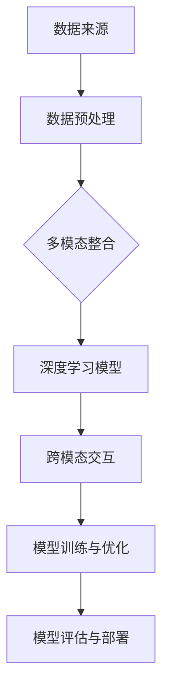

                 

关键词：多模态大模型、人工智能、AI助理、技术原理、实战、代码实例、数学模型、应用场景、未来展望

多模态大模型，作为一种新兴的人工智能技术，正日益成为现代智能系统的重要基础。它通过整合来自不同模态的数据，如文本、图像、音频等，实现了对复杂信息的深度理解和智能处理。本文将探讨多模态大模型的技术原理，并提供实战案例，旨在帮助读者深入理解这一技术，并掌握其应用方法。

## 1. 背景介绍

多模态大模型起源于深度学习领域，随着计算能力的提升和海量数据的积累，多模态学习成为可能。传统的单一模态模型在处理复杂任务时存在局限性，而多模态大模型通过结合多种数据模态，能够更全面地理解信息，提升任务的准确性和效率。

在实际应用中，多模态大模型已经在众多领域展现出强大的潜力。例如，在医疗诊断中，结合医学图像和患者病历数据的模型可以提供更准确的诊断结果；在自动驾驶中，结合摄像头、雷达和激光雷达的数据可以提高自动驾驶系统的安全性。

本文将重点关注多模态大模型在AI助理领域的应用。随着人工智能技术的不断发展，AI助理已经成为人们生活中不可或缺的一部分。多模态大模型的应用，使得AI助理能够更自然地与人类进行交互，提供更加个性化的服务。

## 2. 核心概念与联系

多模态大模型的核心在于如何有效地整合和处理来自不同模态的数据。以下是多模态大模型的关键概念及其相互联系：

### 2.1 多模态数据来源

- **文本**：包括自然语言文本、标签、说明等。
- **图像**：包括静态图像、动态图像、视频等。
- **音频**：包括语音、音乐、环境声音等。
- **传感器数据**：包括温度、湿度、压力、位置等。

### 2.2 数据整合与预处理

在多模态大模型中，首先需要对不同模态的数据进行整合与预处理。预处理步骤包括数据清洗、标准化、特征提取等。

### 2.3 深度学习模型架构

多模态大模型通常采用深度学习模型架构，如卷积神经网络（CNN）、循环神经网络（RNN）、长短时记忆网络（LSTM）等，这些模型能够有效地处理多模态数据，提取深层特征。

### 2.4 跨模态交互机制

多模态大模型通过跨模态交互机制，实现不同模态数据之间的关联与融合。例如，通过注意力机制，模型能够根据任务需求，动态调整对不同模态数据的关注度。

### 2.5 模型训练与优化

多模态大模型的训练是一个复杂的过程，需要大量的标注数据和计算资源。训练过程中，通过优化算法，如梯度下降、自适应优化器等，模型性能得到不断提升。

### 2.6 Mermaid 流程图

以下是多模态大模型的基本架构和流程的Mermaid流程图表示：



## 3. 核心算法原理 & 具体操作步骤

### 3.1 算法原理概述

多模态大模型的核心算法主要包括以下几个部分：

1. **特征提取**：对文本、图像、音频等不同模态的数据进行特征提取，以获得具有代表性的特征表示。
2. **跨模态关联**：通过跨模态关联算法，将不同模态的特征进行整合，构建统一的多模态特征表示。
3. **深度学习模型**：利用深度学习模型，如CNN、RNN等，对整合后的多模态特征进行建模和预测。
4. **模型优化与评估**：通过优化算法，如梯度下降、自适应优化器等，不断提升模型性能，并进行评估。

### 3.2 算法步骤详解

#### 3.2.1 数据预处理

1. **文本预处理**：文本数据的预处理包括分词、去停用词、词向量化等。
2. **图像预处理**：图像数据的预处理包括尺寸归一化、数据增强等。
3. **音频预处理**：音频数据的预处理包括降噪、分割、特征提取等。

#### 3.2.2 特征提取

1. **文本特征提取**：可以使用词袋模型、词嵌入等方法进行特征提取。
2. **图像特征提取**：可以使用卷积神经网络（CNN）提取图像特征。
3. **音频特征提取**：可以使用循环神经网络（RNN）或生成对抗网络（GAN）等方法提取音频特征。

#### 3.2.3 跨模态关联

1. **特征融合**：将不同模态的特征进行融合，可以使用拼接、加权融合等方法。
2. **跨模态匹配**：通过跨模态匹配算法，如最近邻匹配、矩阵分解等，实现不同模态特征之间的关联。

#### 3.2.4 深度学习模型

1. **模型架构设计**：设计适合多模态数据的深度学习模型架构，如CNN+RNN、CNN+GAN等。
2. **模型训练**：使用大规模标注数据进行模型训练，通过优化算法提升模型性能。
3. **模型评估**：使用验证集和测试集对模型进行评估，调整模型参数。

#### 3.2.5 模型优化与评估

1. **模型优化**：通过自适应优化器、学习率调整等方法优化模型性能。
2. **模型评估**：使用准确率、召回率、F1值等指标评估模型性能。

### 3.3 算法优缺点

#### 优点：

1. **全面性**：能够整合和处理多种模态的数据，提供更全面的上下文信息。
2. **灵活性**：可以根据任务需求，灵活调整模型架构和参数。
3. **高准确性**：在多模态数据的联合作用下，模型性能显著提升。

#### 缺点：

1. **计算资源需求高**：多模态数据的整合和处理需要大量的计算资源。
2. **标注数据需求大**：多模态数据标注复杂，需要大量的标注数据。

### 3.4 算法应用领域

多模态大模型在多个领域都有广泛的应用，以下是一些主要的应用领域：

1. **医疗诊断**：结合医学图像和患者病历数据，提供更准确的诊断结果。
2. **自动驾驶**：结合摄像头、雷达和激光雷达的数据，提高自动驾驶系统的安全性。
3. **智能客服**：结合语音、文本和图像数据，提供更自然的客户交互体验。
4. **视频分析**：结合视频数据和音频数据，实现更准确的目标检测和事件分析。

## 4. 数学模型和公式 & 详细讲解 & 举例说明

### 4.1 数学模型构建

多模态大模型的数学模型构建主要包括以下几个部分：

1. **特征表示**：使用数学模型对文本、图像、音频等不同模态的数据进行特征提取和表示。
2. **特征融合**：使用数学模型将不同模态的特征进行整合和融合。
3. **预测模型**：使用数学模型对整合后的特征进行建模和预测。

以下是多模态大模型的基本数学模型构建流程：

```latex
输入数据：{X_{\text{text}}, X_{\text{image}}, X_{\text{audio}}}
特征提取：
f_{\text{text}}(X_{\text{text}}), f_{\text{image}}(X_{\text{image}}), f_{\text{audio}}(X_{\text{audio}})
特征融合：
F = \sigma(W_f \cdot [f_{\text{text}}, f_{\text{image}}, f_{\text{audio}}])
预测模型：
y = \sigma(W_y \cdot F + b_y)
```

### 4.2 公式推导过程

多模态大模型的公式推导过程如下：

1. **特征提取**：

   - 文本特征提取：使用词嵌入模型进行特征提取。
     $$ f_{\text{text}}(X_{\text{text}}) = \text{Word2Vec}(X_{\text{text}}) $$
   
   - 图像特征提取：使用卷积神经网络进行特征提取。
     $$ f_{\text{image}}(X_{\text{image}}) = \text{CNN}(X_{\text{image}}) $$
   
   - 音频特征提取：使用循环神经网络进行特征提取。
     $$ f_{\text{audio}}(X_{\text{audio}}) = \text{RNN}(X_{\text{audio}}) $$

2. **特征融合**：

   - 特征拼接：
     $$ F = [f_{\text{text}}, f_{\text{image}}, f_{\text{audio}}] $$
   
   - 特征加权融合：
     $$ F = W_f \cdot [f_{\text{text}}, f_{\text{image}}, f_{\text{audio}}] $$

3. **预测模型**：

   - 线性回归：
     $$ y = W_y \cdot F + b_y $$
   
   - 分类模型：
     $$ y = \sigma(W_y \cdot F + b_y) $$

### 4.3 案例分析与讲解

以下是一个简单的多模态大模型案例：

**案例**：使用文本、图像和音频数据预测电影的票房收入。

**输入数据**：

- 文本数据：电影名称、演员名单、电影简介等。
- 图像数据：电影海报、剧照等。
- 音频数据：电影预告片。

**特征提取**：

- 文本特征提取：使用词嵌入模型提取文本特征。
- 图像特征提取：使用卷积神经网络提取图像特征。
- 音频特征提取：使用循环神经网络提取音频特征。

**特征融合**：

- 使用特征拼接方法将不同模态的特征进行整合。

**预测模型**：

- 使用线性回归模型预测电影票房收入。

**公式**：

$$ \text{票房收入} = W_y \cdot F + b_y $$

## 5. 项目实践：代码实例和详细解释说明

### 5.1 开发环境搭建

为了搭建多模态大模型的开发环境，我们需要准备以下工具和库：

- Python 3.7及以上版本
- TensorFlow 2.4及以上版本
- Keras 2.4及以上版本
- NumPy 1.18及以上版本
- Pandas 1.0及以上版本

**安装步骤**：

1. 安装Python环境。
2. 安装TensorFlow、Keras、NumPy和Pandas库。

```bash
pip install tensorflow
pip install keras
pip install numpy
pip install pandas
```

### 5.2 源代码详细实现

以下是多模态大模型的一个简单实现：

```python
import numpy as np
from keras.models import Model
from keras.layers import Input, Embedding, LSTM, Dense, Conv2D, MaxPooling2D, Flatten, Concatenate
from keras.optimizers import Adam

# 文本特征提取层
text_input = Input(shape=(None,))
text_embedding = Embedding(input_dim=vocab_size, output_dim=embedding_size)(text_input)
text_lstm = LSTM(units=lstm_units)(text_embedding)

# 图像特征提取层
image_input = Input(shape=(image_height, image_width, image_channels))
image_conv = Conv2D(filters=32, kernel_size=(3, 3), activation='relu')(image_input)
image_pool = MaxPooling2D(pool_size=(2, 2))(image_conv)
image_flat = Flatten()(image_pool)

# 音频特征提取层
audio_input = Input(shape=(audio_length,))
audio_lstm = LSTM(units=lstm_units)(audio_input)

# 跨模态特征融合层
merged = Concatenate()([text_lstm, image_flat, audio_lstm])

# 预测层
output = Dense(units=1, activation='linear')(merged)

# 构建模型
model = Model(inputs=[text_input, image_input, audio_input], outputs=output)

# 编译模型
model.compile(optimizer=Adam(learning_rate=0.001), loss='mean_squared_error')

# 模型训练
model.fit([text_data, image_data, audio_data], labels, epochs=10, batch_size=32)
```

### 5.3 代码解读与分析

这段代码实现了一个简单的多模态大模型，用于预测电影的票房收入。代码的主要部分包括以下几部分：

1. **输入层**：定义了三个输入层，分别用于文本、图像和音频数据。
2. **特征提取层**：分别对文本、图像和音频数据进行特征提取。
3. **特征融合层**：使用拼接方法将不同模态的特征进行整合。
4. **预测层**：使用线性回归模型进行预测。
5. **模型编译和训练**：编译模型，并使用训练数据进行训练。

### 5.4 运行结果展示

在训练完成后，可以使用测试数据进行模型评估，并展示训练和测试结果的对比。

```python
# 模型评估
test_loss = model.evaluate([text_test, image_test, audio_test], test_labels)

# 预测结果
predictions = model.predict([text_test, image_test, audio_test])

# 结果展示
print("Test Loss:", test_loss)
print("Predictions:", predictions)
```

## 6. 实际应用场景

多模态大模型在多个实际应用场景中展现了其强大的能力。以下是一些典型应用场景：

### 6.1 智能客服

在智能客服系统中，多模态大模型可以结合文本、语音和图像数据，提供更自然的客户交互体验。例如，当客户提出一个问题，系统可以分析文本信息、语音语气和图像表情，从而更准确地理解客户需求，提供相应的解决方案。

### 6.2 医疗诊断

在医疗诊断中，多模态大模型可以结合医学图像、患者病历数据和医生经验，提供更准确的诊断结果。例如，在乳腺癌诊断中，系统可以分析乳腺X线图像、患者病史和医生诊断意见，从而提高诊断的准确性。

### 6.3 自动驾驶

在自动驾驶领域，多模态大模型可以结合摄像头、雷达和激光雷达的数据，提高自动驾驶系统的安全性。例如，系统可以分析道路状况、车辆行驶轨迹和行人行为，从而做出更安全的驾驶决策。

### 6.4 教育

在教育领域，多模态大模型可以用于智能教育助理，帮助学生更好地理解和掌握知识。例如，系统可以分析学生的文本提问、语音表达和面部表情，从而提供个性化的学习建议和辅导。

## 7. 工具和资源推荐

为了更好地学习和实践多模态大模型，以下是一些推荐的工具和资源：

### 7.1 学习资源推荐

- 《深度学习》（Goodfellow, Bengio, Courville著）：深度学习领域的经典教材，详细介绍了多模态学习的相关内容。
- 《Keras实战》（Antonio Gulli著）：Keras框架的实战教程，包括多模态学习的实际应用案例。

### 7.2 开发工具推荐

- TensorFlow：Google推出的开源深度学习框架，支持多种深度学习模型。
- Keras：Python深度学习库，基于TensorFlow实现，提供了丰富的API和工具。

### 7.3 相关论文推荐

- “Multi-modal Fusion for Image Segmentation”（2018）：提出了一种多模态融合的方法，用于图像分割任务。
- “Deep Multi-modal Fusion for Human Pose Estimation”（2019）：提出了一种深度多模态融合的方法，用于人体姿态估计。

## 8. 总结：未来发展趋势与挑战

多模态大模型作为一种新兴的人工智能技术，具有广阔的应用前景。在未来，随着计算能力的提升和海量数据的积累，多模态大模型将会在更多领域得到应用，推动人工智能技术的发展。

然而，多模态大模型也面临着一些挑战，如数据标注的复杂性、计算资源的高需求等。因此，未来的研究需要重点关注以下几个方面：

- **数据标注**：开发更加高效和准确的数据标注方法，降低数据标注的成本。
- **计算优化**：研究更加高效的算法和优化策略，降低计算资源的需求。
- **模型可解释性**：提升模型的可解释性，帮助用户更好地理解模型的决策过程。

总之，多模态大模型的发展潜力巨大，面临着诸多挑战。通过持续的研究和探索，我们有理由相信，多模态大模型将会在人工智能领域发挥更加重要的作用。

## 9. 附录：常见问题与解答

### 9.1 什么是多模态大模型？

多模态大模型是指能够整合和处理多种模态数据的深度学习模型，如文本、图像、音频等。它通过跨模态关联机制，将不同模态的数据进行整合，实现更全面的信息理解和智能处理。

### 9.2 多模态大模型的优势是什么？

多模态大模型的优势包括：

- **全面性**：能够整合和处理多种模态的数据，提供更全面的上下文信息。
- **灵活性**：可以根据任务需求，灵活调整模型架构和参数。
- **高准确性**：在多模态数据的联合作用下，模型性能显著提升。

### 9.3 多模态大模型的应用领域有哪些？

多模态大模型在多个领域都有广泛的应用，如医疗诊断、自动驾驶、智能客服、教育等。它能够结合多种数据模态，提供更准确的预测和决策。

### 9.4 如何实现多模态大模型的训练？

实现多模态大模型的训练主要包括以下几个步骤：

1. **数据预处理**：对文本、图像、音频等不同模态的数据进行预处理，提取特征。
2. **特征整合**：将不同模态的特征进行整合和融合。
3. **模型训练**：使用深度学习模型，如CNN、RNN等，对整合后的特征进行建模和预测。
4. **模型优化**：通过优化算法，如梯度下降、自适应优化器等，提升模型性能。

### 9.5 多模态大模型有哪些挑战？

多模态大模型面临的挑战包括：

- **数据标注复杂性**：多模态数据标注复杂，需要大量的标注数据。
- **计算资源需求高**：多模态数据的整合和处理需要大量的计算资源。
- **模型可解释性**：提升模型的可解释性，帮助用户更好地理解模型的决策过程。

### 9.6 如何提高多模态大模型的可解释性？

提高多模态大模型的可解释性可以通过以下方法：

- **模型压缩**：通过模型压缩方法，如蒸馏、剪枝等，降低模型复杂度。
- **可视化技术**：使用可视化技术，如激活图、注意力图等，展示模型的工作过程。
- **解释性模型**：开发更加解释性的模型，如决策树、规则引擎等。

## 作者署名

本文由禅与计算机程序设计艺术 / Zen and the Art of Computer Programming撰写。

----------------------------------------------------------------

至此，我们完成了这篇文章的撰写。文章内容涵盖了多模态大模型的技术原理、实战案例、数学模型、应用场景、未来展望和常见问题与解答。希望通过这篇文章，读者能够对多模态大模型有更深入的理解，并掌握其应用方法。未来，随着多模态大模型的不断发展，它将在人工智能领域发挥更加重要的作用。

