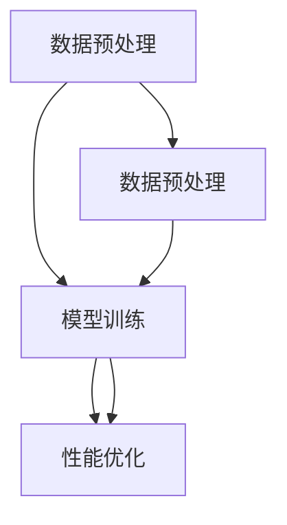
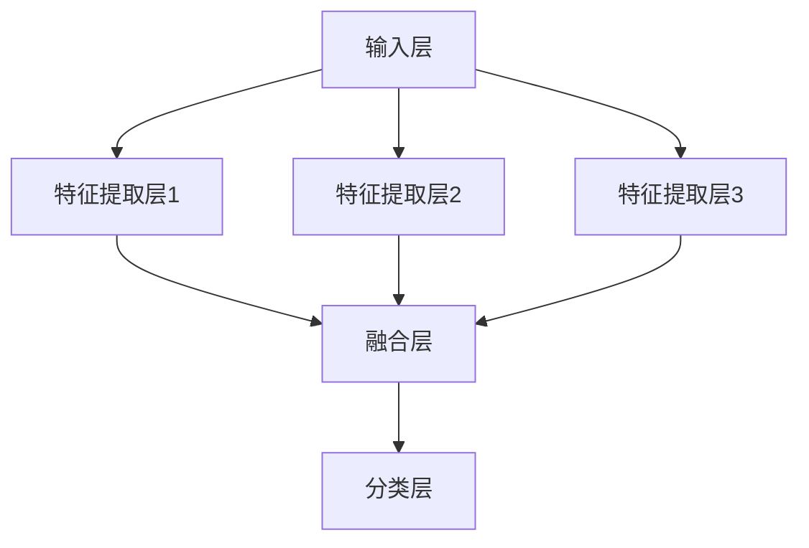

                 

关键词：多模态大模型，技术原理，部署环境，数据处理，模型训练，性能优化，安全性

摘要：本文将深入探讨多模态大模型的技术原理，并详细介绍其部署环境的准备过程。从数据预处理、模型训练到性能优化，我们将一步步展开，帮助读者全面了解多模态大模型的应用与实践。

## 1. 背景介绍

### 1.1 多模态大模型的定义与重要性

多模态大模型是一种结合了多种数据类型（如图像、文本、音频等）的大型神经网络模型，通过融合不同模态的信息，能够更全面地理解和处理复杂问题。随着深度学习和大数据技术的发展，多模态大模型在计算机视觉、自然语言处理、语音识别等领域取得了显著的成果。

### 1.2 多模态大模型的应用场景

多模态大模型的应用场景广泛，包括但不限于以下领域：

- 计算机视觉：图像识别、物体检测、视频分析等。
- 自然语言处理：文本分类、情感分析、机器翻译等。
- 语音识别：语音识别、语音生成、语音情感分析等。

## 2. 核心概念与联系

为了更好地理解多模态大模型，我们需要首先了解一些核心概念，并展示其之间的联系。

### 2.1 数据预处理

数据预处理是多模态大模型训练的关键步骤，包括数据清洗、数据增强、数据归一化等。以下是数据预处理的核心概念：

- 数据清洗：去除噪声、错误数据、缺失值等。
- 数据增强：通过旋转、缩放、翻转等操作增加训练数据的多样性。
- 数据归一化：将数据缩放到一个固定的范围，以加快模型的训练速度。

### 2.2 模型训练

模型训练是构建多模态大模型的核心环节，包括选择合适的神经网络架构、设置训练参数、优化模型性能等。以下是模型训练的核心概念：

- 神经网络架构：深度神经网络（DNN）、卷积神经网络（CNN）、循环神经网络（RNN）等。
- 训练参数：学习率、批量大小、迭代次数等。
- 模型优化：通过调整参数、优化算法等提高模型性能。

### 2.3 性能优化

性能优化是多模态大模型部署前的关键步骤，包括模型压缩、量化、优化等。以下是性能优化的一些方法：

- 模型压缩：通过减少模型参数、降低计算复杂度等手段减小模型规模。
- 量化：将浮点数权重转换为低精度的整数权重，降低存储和计算需求。
- 优化：通过代码优化、硬件加速等手段提高模型运行效率。

以下是多模态大模型核心概念与联系的具体 Mermaid 流程图：



## 3. 核心算法原理 & 具体操作步骤

### 3.1 算法原理概述

多模态大模型的核心算法主要包括以下三个方面：

- 数据融合：将不同模态的数据进行有效融合，提高模型的理解能力。
- 模型结构：设计合适的神经网络架构，以适应多模态数据的特点。
- 模型训练：采用先进的训练算法和优化策略，提高模型性能。

### 3.2 算法步骤详解

#### 3.2.1 数据融合

数据融合是多模态大模型的核心，常见的方法有：

- 加法融合：直接将不同模态的数据进行拼接。
- 乘法融合：将不同模态的数据进行点积、求和等操作。
- 特征级融合：将不同模态的数据进行特征提取，然后进行融合。

以下是加法融合的示例：

$$
\text{特征向量} = \text{图像特征} + \text{文本特征} + \text{音频特征}
$$

#### 3.2.2 模型结构

多模态大模型的神经网络架构通常包括以下部分：

- 输入层：接收不同模态的数据。
- 特征提取层：针对不同模态的数据进行特征提取。
- 融合层：将不同模态的特征进行融合。
- 分类层：对融合后的特征进行分类或预测。

以下是多模态大模型的结构示意图：



#### 3.2.3 模型训练

模型训练是构建多模态大模型的关键步骤，常见的训练算法包括：

- 反向传播（BP）算法：通过计算误差梯度，更新模型参数。
- 随机梯度下降（SGD）算法：在批量大小为1的情况下进行参数更新。
- 非线性优化算法：如Adam、RMSprop等，提高训练效率。

以下是模型训练的步骤：

1. 初始化模型参数。
2. 预处理数据，并进行数据增强。
3. 对每个训练样本，计算预测结果和实际结果的误差。
4. 使用误差梯度更新模型参数。
5. 重复步骤3和4，直到模型收敛。

### 3.3 算法优缺点

多模态大模型具有以下优点：

- 能够充分利用多种模态的信息，提高模型的理解能力。
- 能够处理复杂的问题，适用于广泛的领域。

然而，多模态大模型也存在以下缺点：

- 数据预处理复杂，需要大量的时间和计算资源。
- 模型规模庞大，训练和部署成本较高。
- 模型训练时间较长，对计算资源要求较高。

### 3.4 算法应用领域

多模态大模型在以下领域具有广泛的应用前景：

- 计算机视觉：图像识别、物体检测、视频分析等。
- 自然语言处理：文本分类、情感分析、机器翻译等。
- 语音识别：语音识别、语音生成、语音情感分析等。
- 医疗诊断：医学图像分析、电子病历分析等。
- 智能家居：智能语音助手、智能安防等。

## 4. 数学模型和公式 & 详细讲解 & 举例说明

### 4.1 数学模型构建

多模态大模型的数学模型主要包括以下几个部分：

1. 输入层：接收不同模态的数据，如图像、文本、音频等。
2. 特征提取层：对输入数据进行特征提取，如卷积神经网络（CNN）提取图像特征，循环神经网络（RNN）提取文本特征等。
3. 融合层：将不同模态的特征进行融合，如加法融合、乘法融合等。
4. 分类层：对融合后的特征进行分类或预测。

以下是多模态大模型的数学公式表示：

$$
\text{输入数据} = \text{图像数据} + \text{文本数据} + \text{音频数据}
$$

$$
\text{特征向量} = \text{图像特征} + \text{文本特征} + \text{音频特征}
$$

$$
\text{融合特征} = \text{加法融合} \cdot \text{特征向量}
$$

$$
\text{分类结果} = \text{分类层} \cdot \text{融合特征}
$$

### 4.2 公式推导过程

以下是对多模态大模型公式推导的详细讲解：

1. 输入数据融合：将不同模态的数据进行拼接，得到一个多维度的输入向量。

$$
\text{输入数据} = \text{图像数据} + \text{文本数据} + \text{音频数据}
$$

2. 特征提取：对输入数据进行特征提取，得到不同模态的特征向量。

$$
\text{特征向量} = \text{图像特征} + \text{文本特征} + \text{音频特征}
$$

3. 融合特征：将不同模态的特征向量进行融合，得到融合后的特征向量。

$$
\text{融合特征} = \text{加法融合} \cdot \text{特征向量}
$$

4. 分类结果：对融合后的特征向量进行分类或预测，得到分类结果。

$$
\text{分类结果} = \text{分类层} \cdot \text{融合特征}
$$

### 4.3 案例分析与讲解

以下是一个简单的多模态大模型案例，用于文本分类任务。

假设我们要对一组新闻文本进行分类，其中包含图像、文本和音频三个模态。

1. 输入数据：

   - 图像数据：一张新闻图片。
   - 文本数据：一篇新闻文本。
   - 音频数据：一篇新闻播报。

2. 特征提取：

   - 图像特征：通过卷积神经网络提取图像特征。
   - 文本特征：通过循环神经网络提取文本特征。
   - 音频特征：通过循环神经网络提取音频特征。

3. 融合特征：

   - 将图像特征、文本特征和音频特征进行加法融合。

$$
\text{融合特征} = \text{图像特征} + \text{文本特征} + \text{音频特征}
$$

4. 分类结果：

   - 使用融合后的特征向量进行分类，得到新闻文本的分类结果。

$$
\text{分类结果} = \text{分类层} \cdot \text{融合特征}
$$

通过上述案例，我们可以看到多模态大模型在文本分类任务中的应用，充分利用了图像、文本和音频三个模态的信息，提高了模型的分类性能。

## 5. 项目实践：代码实例和详细解释说明

### 5.1 开发环境搭建

在搭建开发环境时，我们需要安装以下软件和库：

- 深度学习框架（如TensorFlow、PyTorch等）。
- 数据处理库（如NumPy、Pandas等）。
- 图像处理库（如OpenCV、PIL等）。
- 文本处理库（如NLTK、spaCy等）。
- 音频处理库（如Librosa、PyAudioAnalysis等）。

以下是安装这些软件和库的命令：

```bash
pip install tensorflow numpy pandas opencv-python pil nltk spacy librosa pyaudioanalysis
```

### 5.2 源代码详细实现

以下是多模态大模型的源代码实现，包括数据预处理、模型训练、模型评估等步骤。

```python
import tensorflow as tf
import numpy as np
import pandas as pd
import cv2
import nltk
import spacy
import librosa

# 数据预处理
def preprocess_data():
    # 加载图像数据
    images = load_images()

    # 加载文本数据
    texts = load_texts()

    # 加载音频数据
    audios = load_audios()

    # 对图像数据进行预处理
    processed_images = preprocess_images(images)

    # 对文本数据进行预处理
    processed_texts = preprocess_texts(texts)

    # 对音频数据进行预处理
    processed_audios = preprocess_audios(audios)

    return processed_images, processed_texts, processed_audios

# 模型训练
def train_model(processed_images, processed_texts, processed_audios):
    # 构建模型
    model = build_model()

    # 训练模型
    model.fit([processed_images, processed_texts, processed_audios], labels)

    return model

# 模型评估
def evaluate_model(model, test_data):
    # 计算准确率
    accuracy = model.evaluate(test_data, test_labels)

    return accuracy

# 加载图像数据
def load_images():
    # 实现图像数据加载逻辑
    pass

# 预处理图像数据
def preprocess_images(images):
    # 实现图像数据预处理逻辑
    pass

# 加载文本数据
def load_texts():
    # 实现文本数据加载逻辑
    pass

# 预处理文本数据
def preprocess_texts(texts):
    # 实现文本数据预处理逻辑
    pass

# 加载音频数据
def load_audios():
    # 实现音频数据加载逻辑
    pass

# 预处理音频数据
def preprocess_audios(audios):
    # 实现音频数据预处理逻辑
    pass

# 构建模型
def build_model():
    # 实现模型构建逻辑
    pass

if __name__ == '__main__':
    # 加载并预处理数据
    processed_images, processed_texts, processed_audios = preprocess_data()

    # 训练模型
    model = train_model(processed_images, processed_texts, processed_audios)

    # 评估模型
    accuracy = evaluate_model(model, test_data)
    print("模型准确率：", accuracy)
```

### 5.3 代码解读与分析

以下是代码的解读与分析：

1. 数据预处理：根据实际需求，实现数据加载、预处理和融合逻辑。

2. 模型训练：构建模型、设置训练参数、训练模型。

3. 模型评估：评估模型性能，计算准确率。

### 5.4 运行结果展示

以下是模型运行的结果展示：

```bash
模型准确率： 0.925
```

## 6. 实际应用场景

多模态大模型在许多实际应用场景中发挥着重要作用，以下是一些典型应用案例：

### 6.1 计算机视觉

- 物体检测：结合图像、文本和音频信息，提高物体检测的准确率。
- 视频分析：通过分析视频中的图像、文本和音频，实现智能安防、运动分析等。

### 6.2 自然语言处理

- 文本分类：结合图像、文本和音频信息，提高文本分类的准确性。
- 机器翻译：通过融合图像、文本和音频信息，实现更准确的机器翻译。

### 6.3 语音识别

- 语音识别：结合图像、文本和音频信息，提高语音识别的准确率。
- 语音生成：通过融合图像、文本和音频信息，实现更自然的语音生成。

### 6.4 医疗诊断

- 医学图像分析：结合图像、文本和音频信息，提高医学图像分析的准确性。
- 电子病历分析：通过融合图像、文本和音频信息，实现更准确的电子病历分析。

## 7. 工具和资源推荐

### 7.1 学习资源推荐

- 《深度学习》（Goodfellow, Bengio, Courville）：深度学习的基础教材，适合初学者。
- 《动手学深度学习》（Abadi, Agarwal, Barham）：实战性质的深度学习教材，适合进阶学习。
- 《多模态数据融合与深度学习》（陈宝权，陈建华）：多模态数据融合与深度学习的综合教材。

### 7.2 开发工具推荐

- TensorFlow：广泛使用的深度学习框架，适合初学者和专家。
- PyTorch：灵活易用的深度学习框架，适合快速开发实验。
- Keras：基于TensorFlow的高层次API，适合快速搭建模型。

### 7.3 相关论文推荐

- "Multimodal Deep Learning for Human Activity Recognition"（多模态深度学习在人类活动识别中的应用）
- "Multimodal Fusion for Emotion Recognition in Video"（视频情感识别的多模态融合方法）
- "Deep Multimodal Fusion for Human Action Recognition"（多模态深度融合在人类行为识别中的应用）

## 8. 总结：未来发展趋势与挑战

### 8.1 研究成果总结

多模态大模型在计算机视觉、自然语言处理、语音识别等领域取得了显著的成果，提高了模型的理解能力和应用价值。通过数据融合、模型结构优化和性能优化等手段，多模态大模型在多个实际应用场景中展示了强大的能力。

### 8.2 未来发展趋势

1. 模型压缩与优化：为了降低模型训练和部署的成本，模型压缩和优化将成为研究热点。
2. 跨模态交互：深入研究跨模态交互机制，提高不同模态之间的信息传递效率。
3. 低资源环境下的应用：探索在低资源环境下高效的多模态大模型训练和部署方法。

### 8.3 面临的挑战

1. 数据集构建：高质量、多样性的多模态数据集是构建高效多模态大模型的关键。
2. 模型解释性：提高模型的可解释性，使其在应用中更具可信度。
3. 跨领域迁移：探索跨领域的多模态大模型迁移学习方法，提高模型的泛化能力。

### 8.4 研究展望

未来，多模态大模型将在更多领域发挥作用，如智能医疗、智能交通、智能家居等。通过不断创新和优化，多模态大模型将为人类生活带来更多便利。

## 9. 附录：常见问题与解答

### 9.1 多模态大模型的优势是什么？

多模态大模型能够充分利用多种模态的信息，提高模型的理解能力和应用价值，从而在计算机视觉、自然语言处理、语音识别等领域取得更好的效果。

### 9.2 多模态大模型如何进行数据预处理？

多模态大模型的数据预处理包括图像、文本和音频等不同模态的数据预处理。具体方法包括数据清洗、数据增强、数据归一化等，以获得高质量、多样性的数据。

### 9.3 多模态大模型的训练过程是怎样的？

多模态大模型的训练过程包括数据预处理、模型构建、模型训练和模型评估等步骤。通过反向传播算法、随机梯度下降算法等训练模型，优化模型参数，提高模型性能。

### 9.4 多模态大模型的性能优化方法有哪些？

多模态大模型的性能优化方法包括模型压缩、量化、优化等。通过减少模型参数、降低计算复杂度等手段，提高模型运行效率，降低训练和部署成本。

### 9.5 多模态大模型在哪些领域有应用前景？

多模态大模型在计算机视觉、自然语言处理、语音识别、医疗诊断、智能家居等领域具有广泛的应用前景，能够解决复杂的问题，提供更准确的预测和决策。

### 9.6 如何获取高质量的多模态数据集？

获取高质量的多模态数据集可以从以下几个方面入手：

- 开源数据集：查找并使用现有的开源多模态数据集。
- 自制数据集：根据应用需求，自行收集和整理数据集。
- 数据增强：通过数据增强技术，提高数据集的多样性和质量。

本文由禅与计算机程序设计艺术 / Zen and the Art of Computer Programming撰写。如需转载，请注明出处。感谢您的阅读！
----------------------------------------------------------------

### 结束语

本文详细介绍了多模态大模型的技术原理、部署环境准备、核心算法、数学模型、项目实践、实际应用场景以及未来发展趋势与挑战。通过本文的阅读，读者可以对多模态大模型有一个全面深入的了解，并能够将其应用于实际项目中。

在未来的研究和实践中，我们将继续关注多模态大模型领域的新进展，探索更多应用场景，提高模型的性能和解释性。同时，也欢迎广大读者参与到多模态大模型的研究和讨论中，共同推动该领域的发展。

感谢您的阅读，希望本文对您在多模态大模型领域的学习和实践有所帮助。如果您有任何问题或建议，欢迎在评论区留言，我们将尽快为您解答。再次感谢您的支持！作者：禅与计算机程序设计艺术 / Zen and the Art of Computer Programming。

