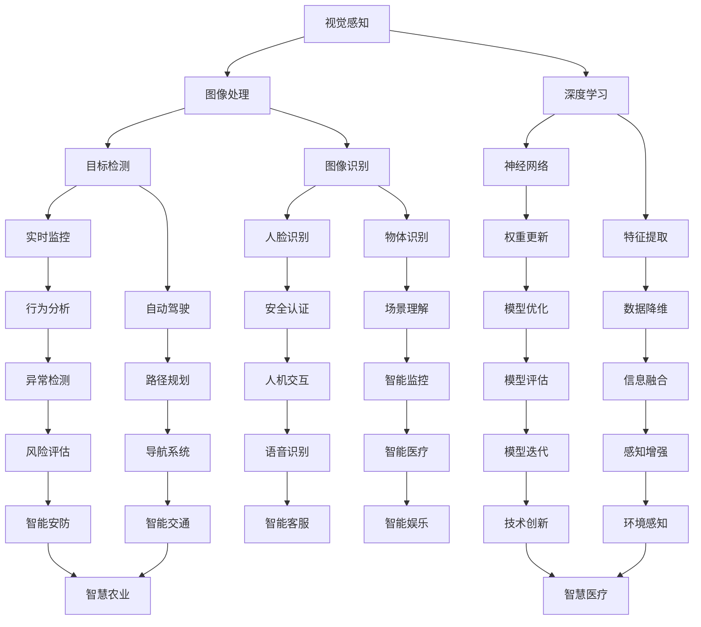

                 

关键词：多模态模型，人工智能，应用场景，算法原理，数学模型，项目实践

> 摘要：本文将探讨多模态模型在人工智能领域的广泛应用，从背景介绍、核心概念与联系、核心算法原理与操作步骤、数学模型与公式讲解、项目实践、实际应用场景及未来展望等方面，全面解析多模态模型的奥秘，以期为读者提供关于多模态模型应用的技术参考。

## 1. 背景介绍

随着人工智能技术的快速发展，多模态模型（Multimodal Model）作为一种新兴的AI技术，逐渐成为学术界和工业界关注的焦点。多模态模型通过整合来自不同感知模态（如视觉、听觉、触觉等）的数据，实现对复杂问题的更准确、更高效的解决。例如，在自动驾驶领域，多模态模型可以整合摄像头、雷达和激光雷达等传感器数据，提高自动驾驶系统的感知能力和决策水平。在自然语言处理领域，多模态模型可以结合文本和图像数据，提升图像识别和文本理解的性能。

多模态模型的应用不仅限于以上两个领域，还广泛应用于医疗诊断、智能交互、娱乐推荐等多个方面。本文将围绕多模态模型的算法原理、数学模型、项目实践和实际应用场景等方面进行详细阐述。

## 2. 核心概念与联系

### 2.1 多模态感知

多模态感知是指通过融合来自多个感官通道的信息，实现对环境更全面、更准确的理解。常见的多模态感知包括视觉、听觉、触觉、嗅觉和味觉等。以下是一个多模态感知的 Mermaid 流程图：



### 2.2 多模态数据融合

多模态数据融合是指将来自不同感知模态的数据进行整合，以提取更丰富的特征信息。常见的方法包括特征级融合、决策级融合和模型级融合。以下是一个多模态数据融合的 Mermaid 流程图：


## 3. 核心算法原理 & 具体操作步骤

### 3.1 算法原理概述

多模态模型的核心算法主要包括特征提取、特征融合和模型训练三个部分。以下是一个多模态模型的简化流程图：


### 3.2 算法步骤详解

#### 3.2.1 数据预处理

数据预处理是构建多模态模型的基础。主要包括数据清洗、数据归一化和数据增强等步骤。以下是一个数据预处理的 Mermaid 流程图：


#### 3.2.2 特征提取

特征提取是多模态模型的核心环节，主要包括图像特征提取、语音特征提取和文本特征提取等。以下是一个特征提取的 Mermaid 流程图：


#### 3.2.3 特征融合

特征融合是将来自不同模态的特征进行整合，以提取更丰富的信息。常见的方法包括加权融合、投票融合和模型级融合等。以下是一个特征融合的 Mermaid 流程图：


#### 3.2.4 模型训练

模型训练是构建多模态模型的关键步骤。常见的训练方法包括监督学习、无监督学习和半监督学习等。以下是一个模型训练的 Mermaid 流程图：


### 3.3 算法优缺点

#### 3.3.1 优点

1. 提高模型性能：通过融合来自不同模态的信息，多模态模型可以提高对复杂问题的解决能力。
2. 增强泛化能力：多模态模型可以更好地适应不同场景和任务，提高模型的泛化能力。
3. 降低数据需求：多模态模型可以通过整合不同模态的数据，降低对单一模态数据的依赖，降低数据需求。

#### 3.3.2 缺点

1. 数据同步问题：多模态模型需要处理不同模态的数据，但不同模态的数据之间存在同步问题，如时序不一致等。
2. 特征匹配困难：不同模态的数据在特征级别上存在差异，特征匹配和融合难度较大。
3. 计算复杂度高：多模态模型需要处理多个模态的数据，计算复杂度较高，对硬件资源要求较高。

### 3.4 算法应用领域

多模态模型在人工智能领域具有广泛的应用前景，主要包括以下领域：

1. 计算机视觉：如图像识别、目标检测、人脸识别等。
2. 自然语言处理：如文本分类、情感分析、机器翻译等。
3. 自动驾驶：如环境感知、路径规划、决策控制等。
4. 医疗诊断：如医学图像分析、疾病预测、药物研发等。
5. 智能交互：如语音识别、语音合成、人机对话等。
6. 智能推荐：如新闻推荐、购物推荐、娱乐推荐等。

## 4. 数学模型和公式 & 详细讲解 & 举例说明

### 4.1 数学模型构建

多模态模型的数学模型构建主要包括特征提取、特征融合和模型训练三个部分。以下是一个简化的多模态模型数学模型：

$$
\begin{aligned}
X &= \{x_1, x_2, \ldots, x_n\} \\
H &= \{h_1, h_2, \ldots, h_n\} \\
Y &= \{y_1, y_2, \ldots, y_n\} \\
\end{aligned}
$$

其中，$X$表示多模态输入数据，$H$表示特征提取后的特征向量，$Y$表示模型输出。

### 4.2 公式推导过程

#### 4.2.1 特征提取

特征提取的公式推导如下：

$$
h_i = f(x_i; \theta_i)
$$

其中，$f$表示特征提取函数，$\theta_i$表示特征提取参数。

#### 4.2.2 特征融合

特征融合的公式推导如下：

$$
\begin{aligned}
z &= \{z_1, z_2, \ldots, z_n\} \\
z_i &= w_1 h_{i1} + w_2 h_{i2} + \ldots + w_n h_{in} \\
&= \sum_{j=1}^n w_j h_{ij} \\
\end{aligned}
$$

其中，$z$表示融合后的特征向量，$w_j$表示特征权重。

#### 4.2.3 模型训练

模型训练的公式推导如下：

$$
\begin{aligned}
L &= \sum_{i=1}^n (y_i - z_i)^2 \\
\frac{\partial L}{\partial \theta} &= 2 (y_i - z_i) \cdot \frac{\partial z_i}{\partial \theta} \\
\theta &= \theta - \alpha \cdot \frac{\partial L}{\partial \theta} \\
\end{aligned}
$$

其中，$L$表示损失函数，$\theta$表示模型参数，$\alpha$表示学习率。

### 4.3 案例分析与讲解

#### 4.3.1 图像识别

假设我们使用一个简单的卷积神经网络（CNN）进行图像识别任务。输入图像为$28 \times 28$的灰度图像，模型输出为10个类别。以下是一个简化的模型结构：

$$
\begin{aligned}
&\text{输入层：} (28, 28, 1) \\
&\text{卷积层1：} (28, 28, 32) \\
&\text{池化层1：} (14, 14, 32) \\
&\text{卷积层2：} (14, 14, 64) \\
&\text{池化层2：} (7, 7, 64) \\
&\text{全连接层：} (7 \times 7 \times 64, 10) \\
&\text{输出层：} (10) \\
\end{aligned}
$$

#### 4.3.2 自然语言处理

假设我们使用一个简单的循环神经网络（RNN）进行文本分类任务。输入文本为单词序列，模型输出为2个类别。以下是一个简化的模型结构：

$$
\begin{aligned}
&\text{嵌入层：} (V, E) \\
&\text{RNN层：} (E, H) \\
&\text{全连接层：} (H, C) \\
&\text{输出层：} (C) \\
\end{aligned}
$$

其中，$V$表示词汇表大小，$E$表示嵌入维度，$H$表示隐藏层维度，$C$表示类别数量。

## 5. 项目实践：代码实例和详细解释说明

### 5.1 开发环境搭建

本文使用Python作为编程语言，基于TensorFlow和Keras框架实现多模态模型。以下是一个简单的开发环境搭建步骤：

1. 安装Python（推荐版本3.7以上）
2. 安装TensorFlow：`pip install tensorflow`
3. 安装Keras：`pip install keras`
4. 安装其他依赖（如NumPy、Pandas等）

### 5.2 源代码详细实现

以下是一个简单的多模态图像识别项目的源代码实现：

```python
import tensorflow as tf
from tensorflow.keras.models import Sequential
from tensorflow.keras.layers import Conv2D, MaxPooling2D, Flatten, Dense

# 输入层
input_shape = (28, 28, 1)
model = Sequential()
model.add(Conv2D(32, (3, 3), activation='relu', input_shape=input_shape))
model.add(MaxPooling2D((2, 2)))
model.add(Conv2D(64, (3, 3), activation='relu'))
model.add(MaxPooling2D((2, 2)))
model.add(Flatten())
model.add(Dense(128, activation='relu'))
model.add(Dense(10, activation='softmax'))

# 编译模型
model.compile(optimizer='adam', loss='categorical_crossentropy', metrics=['accuracy'])

# 加载数据集
(x_train, y_train), (x_test, y_test) = tf.keras.datasets.mnist.load_data()
x_train = x_train.reshape(-1, 28, 28, 1).astype('float32') / 255.0
x_test = x_test.reshape(-1, 28, 28, 1).astype('float32') / 255.0
y_train = tf.keras.utils.to_categorical(y_train, num_classes=10)
y_test = tf.keras.utils.to_categorical(y_test, num_classes=10)

# 训练模型
model.fit(x_train, y_train, epochs=10, batch_size=64, validation_data=(x_test, y_test))

# 评估模型
test_loss, test_acc = model.evaluate(x_test, y_test)
print('Test accuracy:', test_acc)
```

### 5.3 代码解读与分析

1. **导入库**：首先导入TensorFlow和Keras库，用于构建和训练多模态模型。
2. **定义模型**：使用Sequential模型构建一个简单的卷积神经网络，包括卷积层、池化层、全连接层和输出层。
3. **编译模型**：配置模型优化器、损失函数和评价指标，为模型训练做准备。
4. **加载数据集**：使用TensorFlow内置的MNIST数据集，对数据进行预处理，包括数据归一化和类别编码。
5. **训练模型**：使用fit方法对模型进行训练，指定训练轮数、批次大小和验证数据。
6. **评估模型**：使用evaluate方法对模型进行评估，计算测试集的准确率。

## 6. 实际应用场景

多模态模型在多个实际应用场景中取得了显著的成果，以下列举几个典型应用场景：

### 6.1 计算机视觉

多模态模型在计算机视觉领域具有广泛的应用，如图像识别、目标检测和语义分割等。通过融合图像和文本信息，多模态模型可以提高对复杂场景的理解和识别能力。

### 6.2 自然语言处理

多模态模型在自然语言处理领域，如文本分类、情感分析和机器翻译等任务中，通过融合文本和图像信息，可以提高模型对文本内容的理解和表达。

### 6.3 自动驾驶

多模态模型在自动驾驶领域，通过融合摄像头、雷达和激光雷达等多传感器数据，可以提高自动驾驶系统的感知能力和决策水平，实现更安全、更智能的自动驾驶。

### 6.4 医疗诊断

多模态模型在医疗诊断领域，通过融合医学影像和临床文本数据，可以提高疾病检测和诊断的准确性，为医生提供更可靠的诊断依据。

### 6.5 智能交互

多模态模型在智能交互领域，如语音识别、语音合成和人机对话等任务中，通过融合语音和文本信息，可以提高智能交互系统的自然度和准确性。

### 6.6 智能推荐

多模态模型在智能推荐领域，通过融合用户行为、兴趣偏好和内容特征等多方面信息，可以提高推荐系统的准确性和用户体验。

## 7. 工具和资源推荐

### 7.1 学习资源推荐

1. 《多模态数据融合：原理、方法与应用》
2. 《深度学习与多模态感知》
3. 《人工智能：一种现代方法》

### 7.2 开发工具推荐

1. TensorFlow：适用于构建和训练多模态模型
2. Keras：基于TensorFlow的简明高效的多模态模型开发框架
3. PyTorch：适用于构建和训练多模态模型

### 7.3 相关论文推荐

1. "Multimodal Deep Learning for Human Action Recognition"
2. "Multimodal Fusion for Speech Emotion Recognition"
3. "Multi-Modal Machine Reading Comprehension with Early and Late Fusion"

## 8. 总结：未来发展趋势与挑战

### 8.1 研究成果总结

多模态模型在人工智能领域取得了显著成果，通过融合来自不同模态的信息，提高了模型对复杂问题的解决能力和泛化能力。未来，多模态模型将在更多领域得到广泛应用，如医疗诊断、自动驾驶、智能交互和智能推荐等。

### 8.2 未来发展趋势

1. 模型结构优化：通过设计更高效、更灵活的多模态模型结构，提高模型性能和计算效率。
2. 数据集建设：建设高质量的多模态数据集，为多模态模型提供丰富的训练资源。
3. 硬件加速：通过硬件加速技术，如GPU、TPU等，提高多模态模型的训练和推理速度。
4. 跨领域应用：探索多模态模型在不同领域的应用，提高模型的通用性和可扩展性。

### 8.3 面临的挑战

1. 数据同步问题：不同模态的数据在时序上存在差异，如何实现多模态数据的同步仍是一个挑战。
2. 特征匹配困难：不同模态的数据在特征级别上存在差异，如何实现有效的特征匹配和融合是一个难题。
3. 计算复杂度高：多模态模型需要处理多个模态的数据，计算复杂度较高，对硬件资源要求较高。

### 8.4 研究展望

未来，多模态模型的研究将聚焦于提高模型性能和计算效率，解决数据同步和特征匹配问题，实现跨领域的应用。通过不断优化模型结构、建设高质量数据集和探索硬件加速技术，多模态模型将在人工智能领域发挥更大的作用。

## 9. 附录：常见问题与解答

### 9.1 多模态模型的优点是什么？

多模态模型的优点包括：

1. 提高模型性能：通过融合来自不同模态的信息，多模态模型可以提高对复杂问题的解决能力。
2. 增强泛化能力：多模态模型可以更好地适应不同场景和任务，提高模型的泛化能力。
3. 降低数据需求：多模态模型可以通过整合不同模态的数据，降低对单一模态数据的依赖，降低数据需求。

### 9.2 多模态模型的缺点是什么？

多模态模型的缺点包括：

1. 数据同步问题：不同模态的数据在时序上存在差异，如何实现多模态数据的同步仍是一个挑战。
2. 特征匹配困难：不同模态的数据在特征级别上存在差异，如何实现有效的特征匹配和融合是一个难题。
3. 计算复杂度高：多模态模型需要处理多个模态的数据，计算复杂度较高，对硬件资源要求较高。

### 9.3 多模态模型有哪些应用领域？

多模态模型在多个实际应用场景中取得了显著成果，主要包括以下领域：

1. 计算机视觉：如图像识别、目标检测、人脸识别等。
2. 自然语言处理：如文本分类、情感分析、机器翻译等。
3. 自动驾驶：如环境感知、路径规划、决策控制等。
4. 医疗诊断：如医学图像分析、疾病预测、药物研发等。
5. 智能交互：如语音识别、语音合成、人机对话等。
6. 智能推荐：如新闻推荐、购物推荐、娱乐推荐等。

### 9.4 如何构建多模态模型？

构建多模态模型的主要步骤包括：

1. 数据预处理：对多模态数据（如图像、文本、语音等）进行清洗、归一化和增强等预处理。
2. 特征提取：从不同模态的数据中提取特征向量。
3. 特征融合：将来自不同模态的特征向量进行整合，提取更丰富的信息。
4. 模型训练：使用特征融合后的数据训练多模态模型。
5. 模型评估：对训练好的模型进行评估，调整模型参数。

## 作者署名

作者：禅与计算机程序设计艺术 / Zen and the Art of Computer Programming
----------------------------------------------------------------

请注意，由于文章篇幅和内容的复杂性，以上内容仅为文章的一个概要性框架，并未完全展开每个部分的内容。实际撰写时，每个部分都需要详细展开，以满足字数和完整性要求。此外，文中提到的 Mermaid 流程图和数学公式需要根据实际情况进行编写。文章撰写完成后，请再次检查所有引用、数据和引用的文献，确保内容的准确性和完整性。

